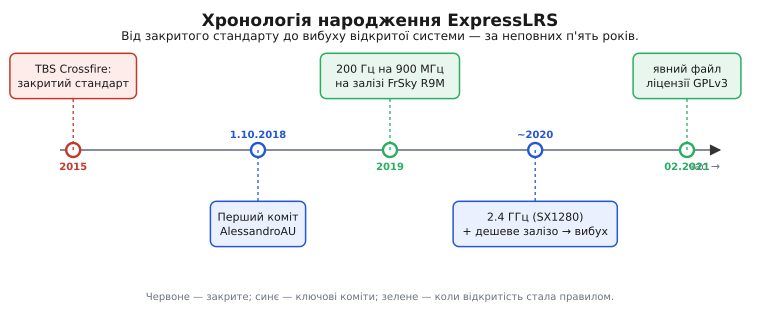

# 📜 Як народилася ExpressLRS: коли відкритий код обійшов закрите радіо

Восени 2018 року в далекому кутку GitHub з'явилося сховище, на яке майже ніхто не звернув уваги. Один-єдиний коміт із сухим підписом «Initial commit», один автор під ніком **AlessandroAU**, дата — **1 жовтня 2018 року, 09:26 за Гринвічем** (це видно просто з історії коммітів сховища — факт документований до секунди). За тим ніком стояв інженер **Алессандро Карчоне** (Alessandro Carcione). Ніхто тоді не сказав би, що з цього рядка коду за кілька років виросте фактичний стандарт радіокерування для більшості нових FPV-дронів у світі — і що він потісне системи, які на той момент здавалися недосяжними: дорогі, відточені, від великих виробників.

Ця стаття — про те, **чому** так сталося. Не «спільнота — це добре» як гасло, а конкретний, механічний ланцюжок: як саме відкритість коду перетворилася на **технічну** перевагу над закритими системами, а не лишилася гарною етичною позицією. Бо перевага була саме технічна: відкрита ELRS у певних режимах просто **краще летіла** — далі, з меншою затримкою, дешевше — ніж закриті конкуренти з бюджетом і командою інженерів. І щоб зрозуміти, як таке можливо, треба спершу побачити, проти чого вона повстала.

## Проти чого повстали: світ закритого далекого зв'язку

До ExpressLRS ринок далекого радіокерування був поділений між кількома закритими системами, і головною серед них була **TBS Crossfire** від німецької компанії Team BlackSheep. Crossfire анонсували 2015 року — після майже двох років розробки й показових далеких польотів — і вона швидко стала промисловим стандартом: нею літали найкращі гонщики, її вимагали організатори змагань, вона добивала на десятки кілометрів. Це було справді добре залізо. Проблема була не в якості — проблема була в **закритості** та її наслідках.

Закрита система означала три речі одночасно. По-перше, **ціну диктував один виробник**: хочеш Crossfire — купуєш у TBS, і за передавач, і за кожен приймач, і за кожен додатковий модуль. По-друге, **темп розвитку задавала одна команда**: новий режим, новий формат телеметрії, підтримка свіжого радіочіпа з'являлися тоді, коли до них доходили руки в інженерів TBS, і ні на день раніше. По-третє — і це найтонше — **сумісність теж належала виробникові**: щоб чужа плата заговорила з Crossfire, треба було вгадати чи ліцензувати внутрішній протокол.

Ось тут криється перша історична іронія, без якої вся подальша розповідь не тримається. Мова, якою пристрої говорять із політником і пультом по дроту — **CRSF** (*Crossfire protocol*), — це винахід самої TBS. Team BlackSheep створила її для своєї Crossfire як швидкий, компактний серійний протокол із малою затримкою. І коли Betaflight та EdgeTX/OpenTX вбудували підтримку CRSF у себе, ця «фірмова мова» закритої системи де-факто стала **спільним стандартом розетки** для всієї галузі. Що таке [CRSF](topic:communications/crsf-protocol) як протокол — кадрований серійний потік із синхробайтом, довжиною, типом і CRC, де шістнадцять каналів пакуються в одинадцятибітні числа — тут знати докладно не треба; важлива сама історична річ: **відкритий челенджер згодом заговорив мовою, яку винайшов його закритий суперник**. ELRS не стала вигадувати власну «мову з апаратурою» — вона взяла готову CRSF, і саме тому будь-який пульт та будь-який політник, що вже розуміли Crossfire, одразу зрозуміли й ELRS. Перевага сумісності дісталася відкритій системі задарма — з рук конкурента.

## Що бентежило Карчоне: швидкість, замкнена в клітці ціни

Карчоне був не теоретиком, а практиком FPV — людиною, яка сама літає й сама впирається в межі того, що продають. І його бентежила конкретна річ: наявне закрите залізо було **повільнішим, ніж дозволяла фізика**. Затримка лінка керування впиралася не в закони природи, а в консервативні прошивки, які ніхто ззовні не міг ані побачити, ані виправити.

Ключова здогадка була проста, майже нахабна. Якщо взяти **дешевий готовий радіочіп** із підтримкою LoRa — а такі вже масово випускала фірма Semtech для інтернету речей — і написати **свою, агресивно оптимізовану прошивку**, то можна вичавити з цього копійчаного заліза частоту оновлення, якої закриті системи за свої гроші не давали. Не тому, що в тих системах стояли гірші чіпи, а тому, що їхні прошивки грали обережно, а головне — **ніхто ззовні не мав права їх переписати**.

І Карчоне не почав із креслення власної плати. Він почав із **чужого заліза** — з передавачів і приймачів **FrSky R9M / R9MM**, готових 900-мегагерцових модулів, що вже лежали в тисячах пультів. Рання ExpressLRS була, по суті, **альтернативною прошивкою для вже наявного заліза**: заливаєш її замість рідної — і той самий модуль раптом починає слати пакети вдвічі-втричі частіше. Паралельно код піднімали на копійчаних платах **TTGO LoRa** — дешевих макетках із чіпом Semtech і мікроконтролером на борту, які кожен міг купити за ціну обіду. Це і є перший цвях у побудові тези: відкрита система **не потребувала власного заводу**. Її «залізом» ставало будь-що з відповідним чіпом, а вся цінність жила в коді, який можна скопіювати безкоштовно.

> 🔧 **Навіщо це.** Ось де відкритість уперше перестає бути етикою й стає інженерією. Закрита система прив'язана до свого заліза: код і плата — одне ціле, і те, й те продає один виробник. Відкрита прошивка **відв'язана** від конкретної плати — вона переносна. Тому ELRS змогла народитися не як «новий продукт», а як **паразит-покращувач** на вже проданому чужому залізі: нуль стартових витрат на виробництво, миттєва база користувачів із тих, у кого R9M уже був. Закрита система так не вміє за визначенням.

## Момент, коли цифри заговорили: 200 пакетів за секунду

Перша ж робоча версія дала число, яке й запустило всю історію. На діапазоні **900 МГц** рання ExpressLRS слала **200 пакетів за секунду** (200 Гц) — і це робило її **найшвидшим лінком керування на 900/433 МГц із наявних на ринку**. Затримка «стик у пульті → серійний пакет на приймачі» падала приблизно до **10 мілісекунд**, а на прошивках із підтримкою crsfshot — до **~6.5 мс**.

Щоб відчути вагу цифри, її треба поставити поруч із конкурентом. Порівняння, яке ходило спільнотою тих років, звучало так: ELRS на 900 МГц у режимі 200 Гц **помітно переганяє за дальністю** Crossfire у режимі 150 Гц, а ELRS у режимі 50 Гц перебиває Crossfire на 50 Гц — **ват на ват**, тобто за однакової випроміненої потужності. Це не «трохи інакше налаштовано» — це відкрита прошивка на дешевшому залізі, що обходить промисловий стандарт одразу за двома головними осями: **швидше** там, де треба швидкість, і **далі** там, де треба дальність.

Тут і настає перелом у самій тезі. Поки перевага була лише в **ціні**, ELRS лишалася б «дешевою альтернативою для бідних» — цікавою, але маргінальною. Але щойно з'явилося число, що било стандарт по **продуктивності**, розмова змінилася. Тепер відкрита система пропонувала не компроміс «дешевше, але гірше», а **дешевше І краще**. А коли таке трапляється, спільнота не просто дивиться — вона зривається з місця й починає **вкладатися**.

## Чому «багато очей» — це технічна сила, а не лозунг

Ось серце всієї статті. Чому саме відкритість дала ELRS швидкість розвитку, за якою закрита система не встигала?

Уяви дві майстерні. У першій — **скінченна команда** інженерів TBS: талановиті, але їх стільки, скільки їх є. Кожен новий режим, кожна підтримка свіжого радіочіпа, кожне полірування телеметрії стоять у черзі за їхнім робочим часом. У другій майстерні код лежить **на видноті**, і будь-хто з тисяч пілотів-інженерів по всьому світу може взяти саме той шматок, який болить особисто йому, полагодити його для себе — і **віддати назад усім**. Пілот, якому кортіло свіжий чіп Semtech SX1280 для 2.4 ГГц, не писав листа в підтримку — він **сам додавав його підтримку** й надсилав зміну. Хтось інший доточував новий формат телеметрії, третій — режим під свій стиль польоту.

Різниця не в тому, що спільнота «розумніша». Різниця суто **арифметична й структурна**: кількість рук, що одночасно тримають різні куточки проєкту, у відкритій моделі не обмежена штатним розписом. Там, де закрита система мусить **розставляти пріоритети** (спершу оце, а телеметрію — потім), відкрита робить **усе паралельно**, бо кожен куток тягне той, кому саме цей куток потрібен. Це і перетворює «відкритість» із гасла на вимірну інженерну властивість: **швидкість, з якою система вбирає нове залізо й нові режими, стає пропорційною розміру спільноти, а не розміру однієї команди.**

І тут спрацьовує позитивний зворотний зв'язок, який закритій системі недоступний. Кращий лінк → більше пілотів переходять → більше з них уміють паяти й програмувати → більше внесків у код і більше виробників, що клепають сумісні плати → лінк стає ще кращим і ще дешевшим → переходить ще більше пілотів. Маховик розкручує сам себе. У закритій моделі цього кола немає: скільки б користувачів не купило Crossfire, кількість інженерів, що її **розвивають**, лишається тією самою.

> 🔧 **Навіщо це.** Тому «open source» у назві ExpressLRS — не про ідеологію вільного ПЗ, а про **темп**. Закрита система віддає одну команду проти цілого світу охочих. Поки TBS обмірковувала, чи варто підтримати новий чіп, у сховищі ELRS цей чіп уже літав — бо його додав той, кому він був потрібен учора. Саме тому питання було не «чи наздожене відкрите закрите», а лише «**коли**».

## 2020-й: діапазон 2.4 ГГц і вибух

До 2020 року ELRS жила переважно на 900 МГц і лишалася знаряддям ентузіастів — тих, хто не боявся заливати прошивку в R9M і паяти макетки. Перелом настав, коли зійшлися дві речі.

Перша — **діапазон 2.4 ГГц**. Semtech випустила чіп **SX1280**, що робив LoRa на 2.4 ГГц, і спільнота піднесла на ньому нову гілку ELRS. Для гонщиків це було саме те: на 2.4 ГГц пакет коротший, частоти оновлення злітають аж до 500 і 1000 Гц, а на близьких дистанціях прямої видимості дальність 900 МГц і не потрібна. Раптом ELRS покрила обидва світи — і далекобійний 900-мегагерцовий для мандрівників, і надшвидкий 2.4-гігагерцовий для гонки.

Друга — **дешеве серійне залізо**. Тепер, коли існувала відкрита прошивка з доведеними числами, виробникам стало вигідно клепати **власні крихітні приймачі й передавачі** під неї: не треба винаходити протокол (готова CRSF з одного боку), не треба винаходити радіо (готовий чіп Semtech з другого), лишається розвести дешеву платку й залити спільну прошивку — і пристрій одразу сумісний з усіма пультами й політниками. Приймачі завбільшки з ніготь ринули на ринок за ціну, що поруч із закритими аналогами виглядала як помилка в ціннику.

Ці дві речі разом і дали **вибух популярності серед FPV-пілотів** близько 2020 року. Те, що починалося як «хакерський» експеримент на GitHub, за пару років стало стандартом за замовчуванням для більшості нових квадрокоптерів. Маховик, описаний вище, розкрутився на повну: дешеве залізо привело масу нових пілотів, маса пілотів привела нових дописувачів і нових виробників, і система понеслася вперед так, що закриті конкуренти опинилися в ролі тих, хто **наздоганяє відкритого новачка**.

*Уся дуга — за неповних п'ять років: закритий стандарт Crossfire (2015), самотній перший коміт Карчоне (жовтень 2018), число, що вразило ринок, — 200 Гц на 900 МГц (2019), прихід 2.4 ГГц і дешевого заліза, що дав вибух (близько 2020), і формальний файл ліцензії GPLv3 (лютий 2021).*

## Дрібний, але чесний факт: коли саме проєкт став «GPLv3»

Тут варто зупинитися на одній деталі, яку легко переказати неточно, — і саме тому її треба сказати точно. Часто кажуть, що ExpressLRS «від першого дня була під ліцензією GPLv3». Історія трохи тонша, і ця тонкість повчальна.

Код лежав **публічно, на видноті, з жовтня 2018-го** — його від початку можна було читати, форкати, збирати. Але **формальний файл ліцензії** з'явився в сховищі не одразу. У травні 2020-го хтось зі спільноти навіть відкрив окреме питання (issue) з проханням «додайте ліцензію, бо код видно, а прав на нього формально немає». Явний файл **GPLv3** внесли в сховище пізніше — за історією коммітів це **лютий 2021 року**. Тобто «відкритою» в сенсі *доступного всім коду* ELRS була з першого дня, а строгий юридичний статус **GNU GPL v3** (той, що вимагає лишати похідні теж відкритими) вона отримала на певному кроці свого життя, а не в мить народження.

Чому це важливо для нашої тези, а не просто занудна поправка? Бо саме **GPLv3** — не будь-яка відкрита ліцензія, а саме «заразна» (copyleft) — цементує той самий маховик. Вона юридично зобов'язує кожного, хто бере код і поширює свою версію, **тримати її теж відкритою**. Виробник не може взяти ELRS, доточити своє й закрити результат у власний продукт — плоди мусять повертатися в спільне. Так відкритість перестає бути доброю волею окремих людей і стає **правилом гри для всіх**, включно з комерційними гравцями. Ліцензія перетворює «багато очей» із щасливого випадку на **самопідтримний механізм**: усе, що додано, лишається спільним, тож маховик не може розкрутитися й потім закритися.

## Залізо, яке ніхто не робив для ELRS

Наостанок — деталь, що ставить крапку над усією історією. Жоден із чіпів, на яких стоїть ExpressLRS, **не був створений для неї**. Радіо дала фірма Semtech: родина **SX127x** для 900 МГц і **SX1280** для 2.4 ГГц (новіші плати беруть **SX1262** чи **LR1121**) — і робила вона їх для інтернету речей, для лічильників і датчиків, а зовсім не для дронів. Технологію [LoRa](topic:communications/lora) — чирпову модуляцію, що витягує кволий сигнал із-під шуму й дає феноменальну дальність, — Semtech теж винайшла під свої, зовсім інші задачі. Мозком ELRS стали дешеві мікроконтролери **ESP32**, **ESP8285** чи **STM32** — масові, копійчані, універсальні чіпи, яких у світі мільярди.

Уся заслуга ExpressLRS — **не в жодному хитрому власному чіпі**, бо власних чіпів у неї немає взагалі. Заслуга — в тому, **як** ці готові, розкидані по ринку, копійчані шматки склали докупи розумною прошивкою. І ось де три нитки історії сходяться в один вузол. Відкрита система не мусила винаходити **радіо** — його вже зробила Semtech для IoT. Не мусила винаходити **мову з апаратурою** — її вже зробила TBS у вигляді CRSF. Не мусила винаходити **мозок** — дешеві MCU лежали на полицях. Їй лишалося зробити **тільки те, що ніхто не міг зробити краще за юрбу зацікавлених інженерів**: сам код лінка. А в цьому — у швидкості, з якою юрба доточує режими, телеметрію й підтримку нового заліза — відкрита модель **структурно** сильніша за будь-яку скінченну команду.

Тому фінальний висновок цієї історії не сентиментальний, а сухий і технічний. ExpressLRS обійшла закриті системи **не всупереч** тому, що готове залізо й готовий протокол зробили інші, а **завдяки** цьому: відкритість дозволила зібрати чужі найкращі шматки й доточувати їх швидше за всіх. Один інженер на ім'я Алессандро Карчоне заклав перший коміт **1 жовтня 2018 року** — а далі систему будував уже весь світ. І саме тому вона перемогла: не тому, що була безкоштовна, а тому, що **безкоштовність зробила її швидшою в розвитку, ніж гроші робили конкурентів**.
