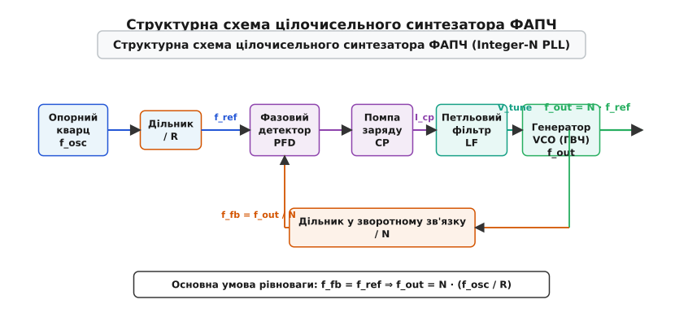
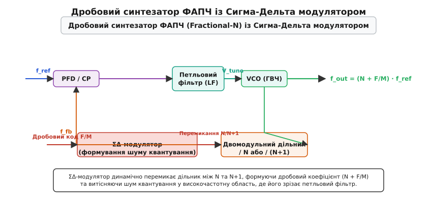
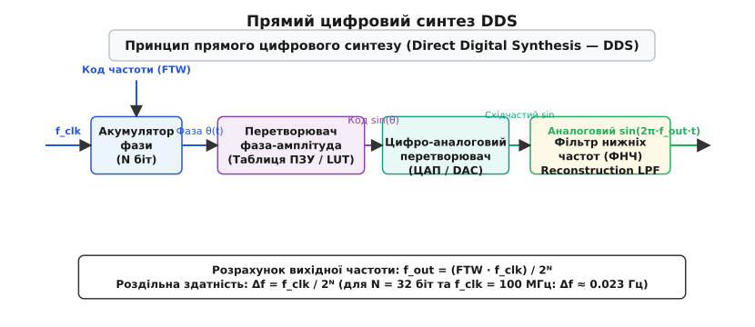
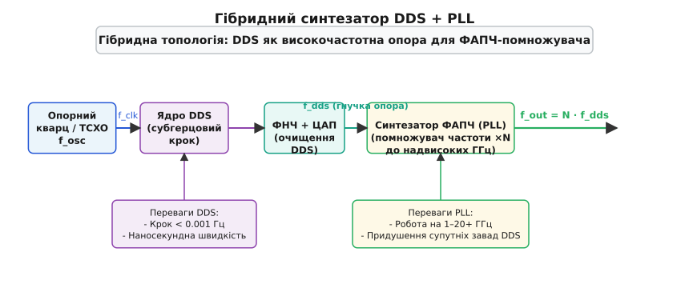
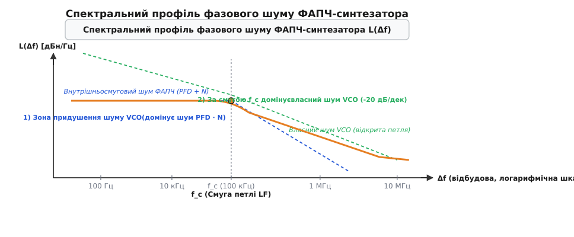

# Синтезатор частот

<preknowlist>
- [Гетеродин](topic:communications/local-oscillator) — власний генератор опорної частоти приймача та передавача.
- [Змішувач](topic:communications/mixer) — елемент переносу частотного спектра шляхом множення сигналів.
- [Супергетеродин](topic:communications/superheterodyne) — архітектура радіоприймача із проміжною частотою.
</preknowlist>

У сучасних трансиверах Wi-Fi 6, 5G NR чи систем швидкопереналаштовуваного зв'язку (FHSS) гетеродин повинен миттєво переключатися між тисячами дискретних радіоканалів із точністю не гірше 1 часточки на мільйон (1 ppm). Якщо спробувати побудувати такий трансивер на дискретному LC-генераторі, зміна температури плати всього на 5°C викличе дрейф частоти на 10 МГц — що зсуне приймач на 400 каналів убік і повністю знищить зв'язок. З іншого боку, кварцовий резонатор забезпечує потрібну стабільність 1 ppm, але механічно здатен резонувати лише на одній-єдиній фіксованій частоті.

Цю фундаментальну суперечність розв'язує **синтезатор частот** (англ. *Frequency Synthesizer*, від лат. *synthetikos*, грец. *syntithemi* — «складати разом»). Синтезатор — це електронний пристрій або напівпровідниковий вузол, який генерує широку сітку високостабільних радіочастот із єдиного опорного кварцового генератора за допомогою петель фазового автоналаштування або цифрового обчислення фази.

Для розуміння принципу побудови та роботи синтезаторів необхідно явно розрізняти чотири базові поняття:
- **Генератор, керований напругою (ГВЧ / VCO, англ. *Voltage-Controlled Oscillator*):** високочастотний генератор коливань, вихідна частота якого пропорційно змінюється залежно від прикладеної аналогової напруги керування `V_tune`.
- **Фазово-частотний детектор (PFD, англ. *Phase-Frequency Detector*):** цифровий логічний вузол, який порівнює опорний та поділений зворотний сигнали за частотою і фазою та формує імпульси похибки `UP` / `DOWN`.
- **Помпа заряду (Charge Pump, CP):** кероване джерело струму, що перетворює логічні імпульси PFD на впорскування або відкачування дозованого струму заряду в петльовий фільтр.
- **Фазовий шум (Phase Noise):** короткочасні випадкові флуктуації фази та частоти сигналу, що визначають його спектральну чистоту й створюють шумову «спідницю» навколо несучої частоти.

Докладніше про технологічний шлях від перших кварцових калібрів та матричних аналогових змішувачів до напівпровідникових ФАПЧ та цифрового синтезу викладено в [історії розвитку синтезаторів частот](topic:communications/frequency-synthesizer/hist-frequency-synthesizer.md).

---

### Анатомія ФАПЧ-синтезатора (Phase-Locked Loop)

Переважна більшість сучасних радіочастотних синтезаторів побудована на основі непрямого синтезу — петель **фазової автопідстройки частоти** (ФАПЧ, англ. *Phase-Locked Loop*, **PLL**). 

Головна ідея ФАПЧ полягає у фізичному «прив'язуванні» фази високочастотного, але нестабільного генератора керованого напругою (VCO) до фази еталонного кварцового генератора (TCXO/OCXO).


*Структурна схема цілочисельного синтезатора ФАПЧ (Integer-N PLL): фазово-частотний детектор порівнює поділену опорну частоту f_ref з поділеною вихідною f_fb і через помпу заряду та петльовий фільтр підлаштовує напругу керування VCO.*

Розберімо шість базових ланок, з яких складається класичний цілочисельний (Integer-N) ФАПЧ-синтезатор:

1. **Опорний генератор (Reference Oscillator):** Стабільний кварцовий генератор (типово 10 МГц, 25 МГц або 40 МГц) із термокомпенсацією (TCXO) або термостабілізацією (OCXO). Забезпечує еталонний часовий такт із точністю `0.1...1 ppm`.
2. **Дільник опорної частоти (/ R):** Цифровий лічильник, який ділить частоту опорного кварцю `f_osc` на ціле число `R`, отримуючи опорну частоту на порівняльному детекторі `f_ref = f_osc / R`.
3. **Фазово-частотний детектор (PFD):** Цифровий осередок на D-тригерах зі схилом скидання. PFD порівнює два вхідних сигнали: опорну частоту `f_ref` та поділену частоту зворотного зв'язку `f_fb`. PFD генерує логічні імпульси `UP` (якщо `f_fb` відстає за фазою) або `DOWN` (якщо `f_fb` випереджає за фазою), тривалість яких пропорційна різниці фаз `Δθ`.
4. **Помпа заряду (Charge Pump, CP):** Керовані джерела струму, які перетворюють логічні імпульси `UP`/`DOWN` на впорскування або відкачування фіксованого струму `I_cp` (типово 0.5...5 мА) у петльовий фільтр.
5. **Петльовий фільтр (Loop Filter, LF):** Аналоговий фільтр нижніх частот (зазвичай 2-го або 3-го порядку на резисторах `R1` та конденсаторах `C1, C2`). Він згладжує імпульси струму помпи заряду, перетворюючи їх на постійну аналогову напругу керування `V_tune`, та придушує залишки пульсацій опорної частоти.
6. **Генератор керований напругою (VCO / ГВЧ):** Високочастотний LC-генератор, переналаштовуваний за допомогою варикапів (напівпровідникових діодів, чия ємність змінюється від прикладеної напруги `V_tune`). Вихідна частота VCO `f_out` прямо пропорційна `V_tune`.

У зворотному зв'язку вихідний сигнал VCO `f_out` надходить на **дільник зворотного зв'язку (/ N)**, який ділить частоту в `N` разів перед подачею на другий вхід PFD: `f_fb = f_out / N`.

#### Внутрішня мікроархітектура та проблеми фазового детектора

Фазово-частотний детектор (PFD) будується на двох тригерах із загальним елементом «І» у колі скидання. Коли на вхід `Ref` надходить позитивний фронт, верхній тригер встановлює сигнал `UP = 1`. Коли надходить фронт `FB`, нижній тригер встановлює `DOWN = 1`. Як тільки обидва тригери опиняються в стані 1, схема «І» через затримку скидає обидва тригери в 0. Різниця тривалостей між імпульсами `UP` та `DOWN` дорівнює різниці фаз `Δθ`.

Проте реальний PFD має критичну апаратну проблему — **зону нечутливості** (англ. *Dead Zone*). При дуже малих різницях фаз (коли `Δθ ≈ 0`) елементи PFD та ключі помпи заряду не встигають фізично відкритися через скінченний час затримки напівпровідникових вентилів (типово 1...2 нс). У результаті при малій фазовій похибці помпа заряду видає нульовий струм, петля зворотного зв'язку розмикається, і VCO починає вільно блукати за фазою. Це викликає підняття фазового шуму усередині смуги та блукання частоти.

Для усунення зони нечутливості у схему PFD впроваджують примусову затримку в коло скидання (англ. *Anti-Backlash Pulse*). У результаті навіть при повній збіжності фаз `UP` та `DOWN` почергово відкриваються на короткий фіксований час (наприклад, 3 нс). Струми помпи заряду компенсують один одного, але ключі гарантовано виходять із закритого стану, повністю ліквідуючи мертву зону.

Другою проблемою є **несиметрія струмів помпи заряду** (`I_up ≠ I_dn`). Якщо струм впорскування відрізняється від струму витоку хоча б на 1-2%, у кожному такті PFD на конденсаторах фільтра створюється паразитна сходинка напруги. Ця сходинка викликає модуляцію напруги `V_tune` із частотою `f_PFD`, що призводить до виникнення потужних **опорних супутніх випромінювань** (англ. *Reference Spurs*) у вихідному спектрі на відбудовах `f_out ± f_PFD`.

#### Основне рівняння рівноваги ФАПЧ

Петля зворотного зв'язку неперервно підлаштовує напругу `V_tune` доти, доки фазовий детектор не зафіксує повну рівність частот та фаз на своїх входах:

```
f_fb = f_ref
```

Підставляючи вирази для `f_fb` та `f_ref`, отримуємо фундаментальне рівняння цілочисельного синтезатора частот:

```
f_out / N = f_osc / R   ⇒   f_out = N · (f_osc / R) = N · f_ref
```

Таким чином, ФАПЧ виступає в ролі **точного цифрового помножувача частоти**: змінюючи ціле число `N` у регістрі дільника, ми можемо переналаштовувати вихідний генератор на будь-яку частоту, кратну кроку сітки `f_ref`.

#### Фундаментальний компроміс цілочисельного ФАПЧ

У цілочисельній архітектурі (Integer-N) крок сітки частот `Δf` строго дорівнює опорній частоті на PFD:

```
Δf = f_ref = f_osc / R
```

Якщо для радіоканалу потрібен дрібний крок налаштування (наприклад, `Δf = 10 кГц`), доводиться вибирати `f_ref = 10 кГц`. Проте це породжує дві важкі фізичні проблеми:

1. **Множення фазового шуму:** При `f_out = 1000 МГц` та `f_ref = 10 кГц` коефіцієнт ділення становить `N = 100 000`. Шум фазового детектора та опорного кварцю помножується на виході в `N` разів. Спектральна щільність шуму зростає на `20 · log₁₀(N) = 20 · log₁₀(100 000) = +100 дБ`! Внутрішньосмуговий фазовий шум генератора стає катастрофічно високим.
2. **Уповільнення динаміки петлі:** Смуга пропускання петльового фільтра `f_c` має бути принаймні в 10 разів меншою за опорну частоту `f_ref` для збереження стійкості петлі та придушення пульсацій: `f_c ≤ f_ref / 10 = 1 кГц`. Дуже вузька смуга петлі робить час встановлення частоти `t_lock` надзвичайно тривалим — десятки мілісекунд. Передавач не може швидко перемикати канали.

---

### Подолання компромісу: Дробові ФАПЧ (Fractional-N) та Сигма-Дельта модуляція

Щоб розірвати жорсткий зв'язок між кроком налаштування `Δf` та опорною частотою `f_ref`, на початку 1980-х років було розроблено архітектуру **дробового синтезатора ФАПЧ** (Fractional-N PLL).

У дробовому синтезаторі коефіцієнт ділення у зворотному зв'язку є не цілим числом `N`, а дробовим значенням:

```
N_frac = N + F / M
```

де `N` — ціла частина коефіцієнта, `F` — чисельник дробової частини, а `M` — знаменник (модуль дробовості).


*Дробовий синтезатор ФАПЧ (Fractional-N): Сигма-Дельта модулятор динамічно змінює коефіцієнт ділення між N та N+1, формуючи дробовий коефіцієнт (N + F/M) та витісняючи шум квантування за межі смуги пропускання петльового фільтра.*

#### Механізм часового усереднення та двомодульний прескалер

Фізичний дільник частоти на тригерах не може ділити сигнал на дробове число за один такт. Тому дробовий коефіцієнт формується шляхом **динамічного перемикання цілочисельного дільника** між значеннями `N` та `N+1` у часі.

Наприклад, якщо необхідно забезпечити коефіцієнт ділення `N_frac = 100.25 = 100 + 1/4`, двомодульний прескалер три такти поспіль ділить вихідну частоту на `100`, а кожен четвертий такт ділить на `101`:

```
Середній N = ( 100 + 100 + 100 + 101 ) / 4 = 401 / 4 = 100.25
```

Завдяки цьому опорна частота `f_ref` на PFD може залишатися високою (наприклад, 50 МГц), забезпечуючи розширену смугу петлі та низькі `N`, а крок сітки частот обчислюється як:

```
Δf = f_ref / M = 50 000 000 Гц / 4000 = 12.5 кГц
```

#### Проблема дробових завад та Сигма-Дельта формування шуму (Noise Shaping)

Періодичне перемикання дільника між `N` та `N+1` створює строго періодичну похибку фази на вході PFD. Ця фазова похибка породжує у вихідному спектрі сильні дискретні побічні піки — **дробові супутні випромінювання** (англ. *Fractional Spurs*), які потрапляють прямо в робочу смугу зв'язку.

Вирішенням цієї проблеми стало використання цифрового **Сигма-Дельта (ΣΔ) модулятора** вищого порядку (MASH-1-1-1 або MASH-2-2). 

Замість строго періодичного перемикання дільника, ΣΔ-модулятор псевдовипадковим чином змінює коефіцієнт ділення у широкому діапазоні (наприклад, `N-1, N, N+1, N+2`), зберігаючи точне середнє значення `N + F/M`. Це перетворює дискретні спайкові завади на суцільний шум квантування.

Більше того, завдяки передавальні функції ΣΔ-модулятора застосовується ефект **формування шуму** (*Noise Shaping*):
- У низькочастотній області (усередині смуги петлі ФАПЧ `f_c`) шум квантування майже дорівнює нулю.
- Весь шум квантування витісняється у високочастотну область (зі підйомом +40 дБ/декада або +60 дБ/декада для 2-го та 3-го порядків відповідно).

Далі аналоговий петльовий фільтр (LF) повністю відфільтровує цей високочастотний шум, залишаючи на виході VCO ідеально чистий радіочастотний сигнал із субгерцовим кроком сітки та мікросекундною швидкістю перемикання каналів.

Однак у дробових ФАПЧ існує специфічний дефект — **графові завади на цілочисельних межах** (англ. *Integer Boundary Spurs*). Коли вихідна частота `f_out` наближається дуже близько до цілого кратного від опорної частоти `f_PFD` (наприклад, `f_out = 2400.01 МГц` при `f_PFD = 50 МГц`), чисельник `F` стає дуже малим (`F ≈ 1`). ΣΔ-модулятор починає генерувати низькочастотні гармоніки перемикання, які потрапляють усередину смуги петлі й створюють супутні піки на відбудові 10 кГц від несучої. Для усунення цього ефекту застосовують навмисний зсув опорної частоти (Reference Shifting) або додавання цифрового псевдовипадкового дизерингу (Dithering).

---

### Прямий цифровий синтез (DDS / NCO): абсолютна гнучкість у цифрі

Альтернативним підходом до генерації радіочастотних сигналів є **прямий цифровий синтез** (англ. *Direct Digital Synthesis*, **DDS**, або *Numerically Controlled Oscillator*, **NCO**). На відміну від ФАПЧ, DDS є повністю цифровою системою без петель зворотного зв'язку.


*Структурна схема прямого цифрового синтезу (DDS): акумулятор фази з кроком FTW формує цифровий код кута, який перетворюється на синусоїду таблицею ROM та відтворюється ЦАП і ФНЧ.*

Схема DDS складається з чотирьох послідовних цифро-аналогових блоків:

1. **Акумулятор фази (Phase Accumulator):** `N`-бітний цифровий регістр (типово `N = 32` або `48` біт). З кожним тактовим імпульсом високої опорної частоти `f_clk` акумулятор додає до свого поточного значення цифровий код частоти **FTW** (англ. *Frequency Tuning Word*). Значення акумулятора описує поточний фазовий кут синусоїди `θ(t)` від `0` до `2π`.
2. **Перетворювач фаза-амплітуда (Phase-to-Amplitude Converter, LUT):** Блок пам'яті (ПЗУ або обчислювальний алгоритм CORDIC), який перетворює старші біти фазового кута `θ` у цифровий код амплітуди синуса `sin(θ)`.
3. **Цифро-аналоговий перетворювач (DAC / ЦАП):** Високошвидкісний ЦАП (з розрядністю 10...14 біт), який перетворює цифрові коди амплітуди на аналогову східчасту синусоїду.
4. **Реконструктивний ФНЧ (Reconstruction LPF):** Аналоговий фільтр нижніх частот (зазвичай 7-го порядку Чебишева чи еліптичний), який згладжує східчасту форму сигналу та відфільтровує високі тактові гармоніки `f_clk`.

#### Математика та крок DDS

Вихідна частота DDS `f_out` строго обчислюється за формулою:

```
f_out = ( FTW · f_clk ) / 2ᴺ
```

А мінімальний крок налаштування частоти `Δf` (роздільна здатність) визначається розрядністю акумулятора `N`:

```
Δf = f_clk / 2ᴺ
```

Для стандартного 32-бітного акумулятора (`N = 32`) та тактової частоти `f_clk = 100 МГц`:

```
Δf = 100 000 000 Гц / 2³² = 100 000 000 / 4 294 967 296 ≈ 0.0233 Гц
```

DDS забезпечує субгерцову точність налаштування частоти, яку неможливо досягти у класичних аналогових системах.

#### Переваги та обмеження DDS

**Головні переваги DDS:**
- **Наносекундна швидкість перемикання:** Частота змінюється за 1 такт `f_clk` (кілька наносекунд) просто записом нового значення `FTW` у регістр.
- **Абсолютна безперервність фази:** При зміні частоти фазовий кут не розривається, що виключає сплески та позасмугове випромінювання.
- **Цифрове керування фазою та амплітудою:** Додавання фазового зсуву до акумулятора дозволяє реалізувати точну фазову модуляцію (BPSK, QPSK).

**Головні обмеження DDS:**
- **Обмеження теоремою Найквіста:** Максимальна вихідна частота не може перевищувати половини тактової (`f_out < 0.5 · f_clk`), а на практиці через обмеження аналогового ФНЧ `f_out ≤ 0.4 · f_clk`.
- **Супутні завади (Spurs):** Усічення розрядності фази перед таблицею ROM та нелінійність ЦАП створюють помітні супутні гармоніки. Спектральний динамічний діапазон, вільний від завад (SFDR), у DDS зазвичай становить 60...75 дБс, що поступається чистим ФАПЧ.

---

### Порівняння топологій та гібридні рішення (DDS + PLL)

Інженерний вибір між Integer-N, Fractional-N та DDS залежить від вимог до діапазону частот, швидкості налаштування та спектральної чистоти. Детальний порівняльний аналіз усіх чотирьох класів із параметричною таблицею наведено у матеріалі про [порівняльний аналіз топологій синтезаторів](topic:communications/frequency-synthesizer/comp-pll-dds-synthesizers.md).

Щоб поєднати абсолютну гнучкість і субгерцовий крок DDS із можливістю генерації надвисоких частот (гігагерцевий діапазон) та низьким рівнем завад ФАПЧ, розроблено **гібридні синтезатори частот**.


*Гібридний синтезатор частот: DDS створює чистовий сигнал опорної частоти із субгерцовим кроком, а ФАПЧ помножує його у високочастотний діапазон з мінімальними супутніми завадами.*

У гібридній схемі DDS працює на відносно низьких частотах (наприклад, 10...50 МГц), де ЦАП має високий SFDR (понад 80 дБс). DDS здійснює субгерцовий крок та швидку модуляцію, а вихідний сигнал DDS подається як опорна частота `f_ref` на високочастотний ФАПЧ. ФАПЧ помножує частоту в `N` разів (до 5–10 ГГц), а вузька смуга петльового фільтра ФАПЧ додатково зрізає супутні завади DDS.

---

### Фазовий шум, супутні випромінювання (Spurs) та динаміка петлі

Якість синтезатора частот оцінюється за його спектральною чистотою. На відміну від ідеального математичного сигналу, реальний вихідний сигнал синтезатора оточений шумовою «спідницею» фазового шуму та дискретними супутньою піками.


*Профіль фазового шуму ФАПЧ: усередині смуги петлі f_c переважає помножений шум фазового детектора й опори (20 log N), за межами смуги шум придушується і збігається з власним шумом VCO.*

Спектральний профіль фазового шуму замкненої петлі ФАПЧ ділиться на дві чіткі області, розмежовані частотою зрізу петльового фільтра `f_c`:

1. **Внутрішньосмуговий шум (In-band Noise, `Δf < f_c`):** Визначається шумом опорного генератора, фазового детектора та дільників, помноженим на `20 · log₁₀(N)`. У цій зоні петля зворотного зв'язку активно підлаштовує VCO, **придушуючи власний шум VCO**.
2. **Позасмуговий шум (Out-of-band Noise, `Δf > f_c`):** За межами смуги петлі коефіцієнт передачі петлі падає. Шум опорних елементів відфільтровується, і вихідний шум повністю визначається **власним шумом відкритого VCO** (який спадає зі швидкістю −20 дБ/декада відповідно до моделі Лісона).

Точний математичний розрахунок передавальних функцій петлі, коефіцієнта демпфування `ζ` та підсумовування джерел шуму наведено у матеріалі про [розрахунок передавальних функцій та фазового шуму ФАПЧ](topic:communications/frequency-synthesizer/math-pll-synthesizer.md).

Для швидкого розрахунку номіналів елементів петльового фільтра `R1, C1, C2`, оцінки часу захоплення `t_lock` та перевірки профілю фазового шуму створено програмні модулі в матеріалі про [програмний розрахунок параметрів петлі та фазового шуму](topic:communications/frequency-synthesizer/proj-pll-synthesizer-calc.md).

---

### Практична реалізація: чипи, проектування петльових фільтрів та керування

У сучасній радіоелектроніці дискретні ФАПЧ практично не використовуються. Усі блоки (PFD, помпа заряду, дільники, ΣΔ-модулятор, а часто й самі VCO) інтегровані в єдиний кремнієвий чип (наприклад, MAX2870, ADF4351, LMX2595).

#### Мультидіапазонні VCO (Switched-Capacitor Banks)

Один LC-генератор не може перекривати широкий діапазон частот (наприклад, від 2.2 до 4.4 ГГц) лише за рахунок варикапів, оскільки це вимагало б занадто великої крутизни `K_vco`, що різко погіршує фазовий шум.

Тому сучасні VCO внутрішньо розбиті на 128...256 окремих вузьких піддіапазонів за допомогою матриці перемикальних конденсаторів (*Switched Capacitor Array*). При зміні частоти мікросхема автоматично запускає внутрішній цифровий калібрувальний автомат (VCO Band Select), який за кілька мікросекунд вибирає оптимальний піддіапазон, після чого ФАПЧ точно затягує фазу варикапом.

#### Проектування друкованих плат та захист від наводок

Проектування високочастотної частини з синтезатором частот вимагає суворого дотримання правил топології PCB:
- **Окреме живлення LDO:** Петльовий фільтр та помпа заряду повинні живитися від окремого малошумного LDO-регулятора (із рівнем власних шумів `< 10 нВ/√Гц` та високим придушенням пульсацій PSRR > 60 дБ). Будь-які пульсації від імпульсного джерела живлення на лінії `V_tune` створюють потужні завади.
- **Екранування петльового фільтра:** Провідники від помпи заряду до варикапа є найбільш чутливим вузлом схеми. Напруга `V_tune` підходить до елементів із високим імпедансом, тому будь-яка наводка від цифрових ліній SPI чи тактового сигналу моментально перетворюється на частотну модуляцію VCO. Фільтр розміщують у безпосередній близькості до виводів чипа та обводять захисним треком заземлення (Guard Ring).
- **Суцільний шар заземлення (Ground Plane):** Прямо під чипом синтезатора та мікросмужковими лініями обов'язково розміщують суцільний шар міді без розривів для забезпечення зворотного струму та стабільного хвильового опору 50 Ом.

#### Регістрація та SPI-керування

Налаштування інтегрованого синтезатора здійснюється через 32-бітний послідовний інтерфейс SPI. Програміст обчислює значення цілої частини `INT`, дробової частини `FRAC`, знаменника `MOD` та дільника `RF_DIV`, після чого послідовно записує їх у регістри R0...R5.

Докладний опис карти регістрів, розрахунку бітових полів та готові програмні драйвери мовами C і C++ наведено в матеріалі про [регістрацію та SPI-інтерфейс керування синтезатором](topic:communications/frequency-synthesizer/api-synthesizer-control.md).

> 🔧 **Навіщо це.**
> Знання принципів синтезу частот є фундаментальним для розробника радіочастотних систем будь-якого рівня.
> 
> - **У трансиверах ExpressLRS / LoRa (868/915 МГц, 2.4 ГГц):** Дробовий ФАПЧ дозволяє системі здійснювати псевдовипадкове перескочування частот (FHSS) зі швидкістю до 1000 стрибків на секунду, забезпечуючи захист від завад та надійне керування дронами.
> - **У програмно-визначуваних радіосистемах (SDR — HackRF, USRP, AD9361):** Широкодіапазонні синтезатори забезпечують безперервну перебудову прийому й передачі від 70 МГц до 6 ГГц із можливістю обробки будь-яких стандартів зв'язку.
> - **У автомобільно-радарних системах (FMCW 77 ГГц):** Гібридні синтезатори генерують ідеально лінійні високочастотні пилоподібні чирпи для точного вимірювання відстані та швидкості об'єктів на дорозі.
