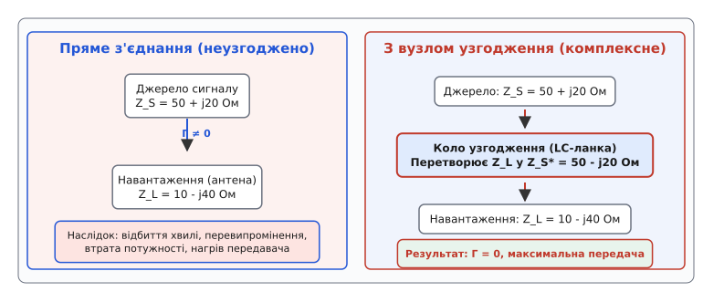
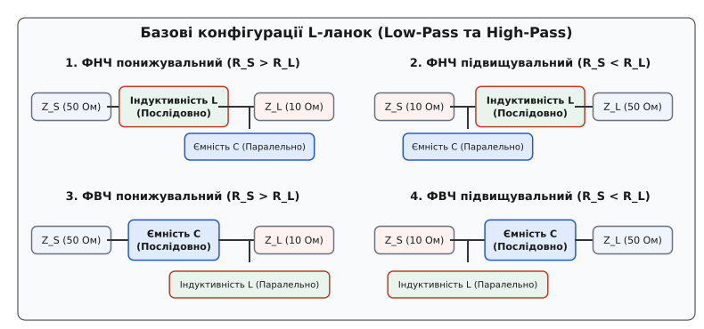
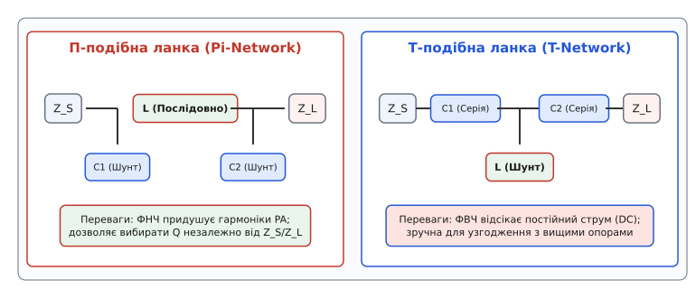
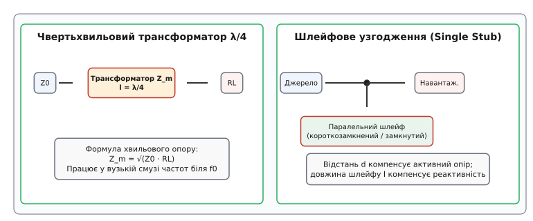

# Кола узгодження імпедансів

<preknowlist>
- [Імпеданс](topic:math/impedance) — комплексна величина опору змінному струму, що містить активну й реактивну складові.
- [Відбиття й КСХ](topic:communications/vswr) — коефіцієнт стоячої хвилі, відбита потужність та коефіцієнт відбиття Γ.
- [Лінії передачі](topic:communications/transmission-lines) — хвильовий опір Z₀, поширення електромагнітної хвилі та розподілені параметри.
</preknowlist>

Якщо підключити вихід радіочастотного підсилювача потужності з внутрішнім опором 10 Ом безпосередньо до стандартного антенного кабелю 50 Ом, передавач утратить понад 30% корисної енергії ще до того, як хвиля вийде в ефір. Відбита від кабельної роз'ємної межі хвиля повернеться назад у транзистор, перетвориться на тепло й може легко спалити вихідний каскад. У зворотній ситуації — при підключенні малошумного підсилювача приймача до антени з розбалансованим опором — слабкий сигнал віддаленого супутника чи дрона повністю потоне у власних шумах входження. Причина обидвох аварій одна й та сама: неузгодженість імпедансів навантаження та джерела. Узгоджувальне коло є тим самим інженерним трансформатором, який примушує два різні опори «бачити» один одного як ідеально рівні на робочій частоті.

### 1. Фізична проблема: чому виникає відбиття та втрата потужності

Будь-яке джерело електричного сигналу — чи то вихідний каскад високочастотного транзистора, чи то змішувач, чи то передавальна мікросхема — має власний внутрішній імпеданс `Z_S = R_S + jX_S`. Навантаження, до якого це джерело підключається (антена, вхід підсилювача, кабельна лінія), володіє імпедансом `Z_L = R_L + jX_L`.


*Принцип комплексно-спряженого узгодження: без узгоджувального кола неузгоджені опори спричиняють відбиття хвилі Γ ≠ 0 та втрату потужності; пасивне коло узгодження перетворює опір Z_L у комплексно-спрямовану величину Z_S*, забезпечуючи режим максимальної передачі активної енергії.*

Коли електромагнітна хвиля біжить усередині провідника або мікросмужкової лінії, вона відчуває локальне відношення напруги до струму. У кожній точці однорідного провідника це відношення є фіксованою величиною — хвильовим опором лінії `Z₀`. Якщо на межі з'єднання двох пристроїв або двох ділянок лінії це відношення раптово змінюється (наприклад, лінія 50 Ом впирається в антену з опором 200 Ом), виникає скачок хвильового імпедансу.

Згідно з фундаментальними рівняннями Максвелла та граничними умовами для електромагнітного поля, напруга й струм на стику двох середовищ мусять залишатися неперервними. Щоб задовольнити ці граничні умови при стрибку опору, частина енергії падаючої електромагнітної хвилі проходить у навантаження, а частина змушена відбитися назад до джерела.

Аналогію цьому явищу можна побачити у механіці та оптиці: коли світловий промінь переходить із повітря у воду, частина світла заломлюється (проходить далі), а частина відбивається від поверхні через стрибок оптичної щільності (показника заломлення). Так само, коли звукова хвиля в повітрі ударяється у тверду стіну, майже весь звук відбивається назад. Проте на відміну від світла чи звуку, де відбиття сприймається природно, у радіочастотній інженерії відбиття електромагнітної хвилі є шкідливим дефектом.

Кількісно це явище описує комплексний коефіцієнт відбиття `Γ`:

```
Γ = (Z_L - Z_S*) / (Z_L + Z_S)
```

де `Z_S* = R_S - jX_S` — комплексно-спряжений імпеданс джерела.

Якщо імпеданси не узгоджені (`Z_L ≠ Z_S*`), виникають три прямі руйнівні наслідки:

1. **Втрата переданої потужності (Mismatch Loss):** Частка відбитої від навантаження потужності дорівнює квадрату модуля коефіцієнта відбиття `|Γ|²`. Відповідно, корисна потужність, яка реально потрапляє в антену чи навантаження, становить лише `(1 - |Γ|²)` від потенційної потужності джерела.
2. **Перегрів та нелінійні спотворення джерела:** Відбита хвиля біжить у зворотному напрямку та повертається у вихідний транзистор підсилювача потужності. Оскільки коефіцієнт корисної дії підсилювача падає, надлишкова відбита енергія розсіюється безпосередньо на кремнієвому кристалі у вигляді тепла. До того ж, амплітуда зворотного сигналу додається до вихідної напруги генератора, спричиняючи зміщення робочої точки транзистора, перевипромінення та виникнення завад інтермодуляції.
3. **Утворення стоячих хвиль у фідері:** Взаємодія падаючої та відбитої хвиль утворює непорушний візерунок із пучностей та вузлів напруги — стоячу хвилю з підвищеним [коефіцієнтом стоячої хвилі (КСХ)](topic:communications/vswr). У пучностях стоячої хвилі напруга може перевищити електричну міцність діелектрика кабелю або друкованої плати, призводячи до дугового пробою та руйнування тракту.

Розв'язанням цієї проблеми є включення між джерелом і навантаженням пасивного чотириполюсника — **кола узгодження імпедансу** (*impedance matching network*). Це коло не містить внутрішніх джерел енергії, але завдяки реактивним елементам (котушкам та конденсаторам) воно здійснює трансформацію опорів, роблячи коефіцієнт відбиття з боку джерела точно нульовим `Γ = 0`.

Детальний історичний шлях розробки перших компенсаційних кіл від телефонних котушок Пупіна та Кемпбелла до номограм Сміта й сучасних адаптивних тюнерів висвітлено в нарисі [📜 Історія розвитку узгоджувальних кіл](topic:communications/impedance-matching-networks/hist-matching-networks.md).

### 2. Принцип комплексно-спряженого узгодження

Фундаментальним теоретичним орієнтиром при розрахунку будь-якого узгоджувального кола є **теорема про максимальну передачу потужності** (теорема Якобі). Вона стверджує: для того щоб пасивне навантаження отримувало від джерела змінного струму максимально можливу активну потужність, імпеданс навантаження `Z_L` з урахуванням узгоджувального кола мусить бути точно комплексно-спряженим відносно внутрішнього імпедансу джерела `Z_S`:

```
Z_L_in = Z_S* = R_S - jX_S
```

Це означає одночасне виконання двох незалежних умов на робочій частоті `f₀`:
1. **Рівність активних опорів:** `Re(Z_L_in) = R_S`. Активна частина вхідного опору узгодженої системи мусить точно дорівнювати внутрішньому активному опору джерела.
2. **Компенсація реактивностей:** `Im(Z_L_in) = -Im(Z_S)`. Реактивна частина вхідного опору мусить бути рівною за модулем, але протилежною за знаком. Якщо джерело має індуктивний характер (`+jX_S`), вхід узгоджувального кола мусить мати ємнісний характер (`-jX_S`), і навпаки.

За виконання обох умов реактивні складові джерела та узгоджувального кола утворюють послідовний або паралельний резонанс на частоті `f₀`. Реактивні струми й напруги циркулюють усередині резонансного контуру, взаємно компенсуючи один одного, а для генератора вся система поводиться як чисто активний опір `R_S`.

Строгий алгебраїчний доказ теореми Якобі через узгодження комплексних функцій та диференціювання потужності наведено у теоретичному розборі [🧮 Математика узгоджувальних кіл та L-ланок](topic:communications/impedance-matching-networks/math-l-network.md).

З точки зору енергетики важливо розрізняти два різні режими роботи радіотехнічних систем:

#### Потужносне комплексно-спряжене узгодження (Power Match / Conjugate Match)
Орієнтоване на досягнення максимального абсолютного рівня сигналу на вході (наприклад, у приймальних антенах, пасивних фільтрах та вимірювальних приладах). У цьому режимі ККД передачі становить 50%, бо друга половина потужності виділяється всередині джерела.

#### Шумове узгодження малошумних підсилювачів (Noise Match)
У входних малошумних підсилювачах (LNA) приймачів головним завданням є не передача максимальної потужності, а досягнення мінімального **коефіцієнта шуму** (*Noise Figure*, `NF_min`). 

Точка оптимального імпедансу за шумом `Γ_opt` майже ніколи не збігається з точкою комплексно-спряженого узгодження `Γ_conj`. Спроба узгодити LNA точно за потужністю призводить до зростання власних шумів підсилювача на 1–2 дБ, що суттєво погіршує чутливість приймача. Тому на вході LNA розробник іде на свідомий компроміс: вибирає імпеданс між `Γ_opt` та `Γ_conj`, погоджуючись на невеликий КСХ ради мінімізації шумів.

#### Узгодження за лініями Load-Pull для підсилювачів потужності (PA Load-Pull)
Для потужних передавальних транзисторів (класи A, AB, C, E) робота з ККД 50% означала б катастрофічний перегрів транзистора. 

Транзистор узгоджують за допомогою методу Load-Pull: на діаграмі Сміта будують контури постійної вихідної потужності та контури постійного ККД (Power Added Efficiency, PAE). Оптимальний опір навантаження `R_opt` вибирається у точці перетину найвищої потужності та ККД (який часто становить 65–85%).

### 3. Двоелементні L-подібні кола (L-Networks)

Найпростішим і найпоширенішим пасивним колом узгодження є **L-подібна ланка** (*L-network*). Вона складається всього з двох реактивних елементів: один увімкнений послідовно у сигнальну трасу, а другий — паралельно на землю.

Назва ланки походить від її схематичної формі, що нагадує літеру «L». Залежно від того, які саме елементи (індуктивність `L` чи ємність `C`) використовуються і на якому боці стоїть паралельне плече, існує чотири фундаментальні ФНЧ- та ФВЧ-конфігурації L-ланок.


*Чотири базові конфігурації L-ланок: понижувальні топології (R_S > R_L) мають паралельний елемент з боку джерела Z_S; підвищувальні (R_S < R_L) — з боку навантаження Z_L. ФНЧ-версії придушують вищі гармоніки, ФВЧ-версії відсікають постійний струм.*

Головне інженерне правило вибору топології L-ланки звучить так: **паралельний реактивний елемент завжди підключається до сторони з більшим активним опором**.

Позначимо більший з двох опорів як `R_high = max(R_S, R_L)`, а менший як `R_low = min(R_S, R_L)`.

#### Механізм трансформації опору

Паралельний реактивний елемент, підключений до опору `R_high`, утворює з ним паралельне коло. Завдяки еквівалентному перетворенню «паралельне ↔ послідовне» це з'єднання перераховується у послідовний ланцюг із меншим активним опором `R_s_eq` та послідовною реактивністю `X_s_eq`:

```
R_s_eq = R_high / (1 + Q²)
```

де `Q` — нагружена добротність ланки.

Вибираючи значення реактивності паралельного елемента так, щоб `1 + Q² = R_high / R_low`, ми отримуємо еквівалентний активний опір `R_s_eq = R_low`. Після цього послідовний елемент протилежного знака повністю компенсує залишковий реактивний опір `X_s_eq`, залишаючи чисто активне узгоджене коло.

Звідси випливає фундаментальне рівняння добротності L-ланки:

```
Q = √((R_high / R_low) - 1)
```

#### Чотири типи L-ланок та їхні сфери застосування

1. **ФНЧ Понижувальний (`R_S > R_L`):** Послідовна котушка `L` з боку навантаження, паралельний конденсатор `C` з боку джерела. Найкраще підходить для узгодження високоомного джерела з низькоомним навантаженням із одночасною фільтрацією вищих гармонік.
2. **ФНЧ Підвищувальний (`R_S < R_L`):** Послідовна котушка `L` з боку джерела, паралельний конденсатор `C` з боку навантаження. Стандартне рішення для виходу транзисторних підсилювачів потужності (наприклад, перетворення 10 Ом виходу транзистора у 50 Ом антени).
3. **ФВЧ Понижувальний (`R_S > R_L`):** Послідовний конденсатор `C` з боку навантаження, паралельна котушка `L` з боку джерела. Забезпечує відсікання постійного струму та низькочастотних завад.
4. **ФВЧ Підвищувальний (`R_S < R_L`):** Послідовний конденсатор `C` з боку джерела, паралельна котушка `L` з боку навантаження.

#### Обмеження L-ланок

L-ланка володіє найвищим ККД серед усіх пасивних дискретних кіл, бо містить мінімальну кількість елементів (всього два). Проте вона має фундаментальний недолік: **добротність `Q` і смуга частот L-ланки жорстко фіксовані співвідношенням опорів `R_high / R_low`**.

Якщо опори `R_S` та `R_L` дуже близькі (наприклад, 40 Ом і 50 Ом), добротність виходить занадто низькою (`Q = 0.5`), і ланка практично не фільтрує гармоніки. Якщо ж опори відрізняються в десятки разів (наприклад, 500 Ом і 10 Ом), добротність стає надто високою (`Q = 7`), роблячи смугу частот надзвичайно вузькою та чутливою до допусків номіналів.

### 4. Триелементні кола: П-подібні (Pi) та Т-подібні ланки

Щоб подолати обмеження L-ланок і отримати можливість **незалежно обирати добротність `Q`** (а отже, регулювати смугу частот та рівень фільтрації завад), у схемотехніку вводять третій реактивний елемент. Це дає дві триелементні топології: **П-подібну (Pi)** та **Т-подібну (T)** ланки.


*Порівняння П-подібної (Pi) та Т-подібної (T) ланок: Pi-ланка використовує дві паралельні ємності й послідовну котушку, утворюючи ФНЧ другого порядку з гнучким вибором Q; T-ланка застосовує дві послідовні ємності й паралельну котушку, забезпечуючи ідеальну гальванічну розв'язку DC.*

#### П-подібна ланка (Pi-Network)

П-подібна ланка складається з двох паралельних конденсаторів `C1`, `C2` та однієї послідовної індуктивності `L`.

Математично П-подібну ланку розглядають як дві послідовно з'єднані L-ланки, зустрінуті своїми послідовними боками у віртуальному внутрішньому вузлі з опором `R_v`. При цьому віртуальний опір вибирається **меншим** за обидва крайні опори: `R_v < R_S` та `R_v < R_L`.

Ключові переваги Pi-ланки:
- **Гнучке керування добротністю:** Розробник самостійно вибирає добротність першого вузла `Q_node1` (наприклад, `Q = 10` до `15`), що задає ширину смуги та високе придушення вищих гармонік.
- **Ефективний ФНЧ другого порядку:** Дві паралельні ємності забезпечують крутий спад амплітудно-частотної характеристики (−40 дБ на декаду частоти), що є критичним для сертифікації передавачів за стандартами [EMC та FCC](topic:communications/emc-certification).
- **Поглинання паразитичних ємностей:** Ємність `C1` можна зменшити на величину вихідної паразитної ємності транзистора `C_oss`, повністю компенсувавши її вплив.

#### Т-подібна ланка (T-Network)

Т-подібна ланка складається з двох послідовних конденсаторів `C1`, `C2` та однієї паралельної індуктивності `L`.

У Т-ланці віртуальний внутрішній опір `R_v` вибирається **більшим** за обидва крайні опори: `R_v > R_S` та `R_v > R_L`.

Ключові переваги T-ланки:
- **Гальванічна розв'язка по постійному струму (DC Block):** Дві послідовні ємності повністю перекривають проходження постійної напруги живлення колектора чи стоку транзистора в антенний тракт.
- **Зручність узгодження дуже низьких опорів:** T-ланка чудово підходить для транзисторів надвисокої потужності, де вихідний опір становить 1–3 Ом.

Детальний аналіз схемотехнічних характеристик, конструктиву high-Q компонентів та порівняльну таблицю параметрів наведено у спеціалізованому огляді [🔌 Схемотехніка та порівняння топологій узгодження](topic:communications/impedance-matching-networks/comp-matching-topologies.md).

### 5. Розподілені узгоджувальні кола (НВЧ діапазони)

При переході у діапазони надвисоких частот (НВЧ / Microwave, частоти від 1.5 ГГц до 100 ГГц — Wi-Fi 5/6, 5G NR, супутниковий зв'язок, авторадари 77 ГГц) застосування дискретних SMD-котушок і конденсаторів стає неможливим. На цих частотах паразитичні індуктивності виводів та власний резонанс компонентів переважають над їхніми розрахунковими номіналами.

На НВЧ узгоджувальні кола виконують у вигляді **розподілених структур** безпосередньо з відрізків [ліній передачі](topic:communications/transmission-lines) на друкованій платі.


*Розподілені узгоджувальні кола: чвертьхвильовий трансформатор λ/4 трансформує активний опір R_L у значення Z_m² / R_L; шлейфове узгодження (Single Stub) використовує паралельний відрізок лінії для повної компенсації реактивності та активного опору на платі.*

#### Чвертьхвильовий трансформатор імпедансу (`λ/4`)

Відрізок лінії передачі довжиною рівно в чверть хвилі `l = λ / 4` володіє унікальною властивістю інверсії імпедансу. Якщо на кінці такого відрізка з хвильовим опором `Z_m` підключено навантаження `Z_L`, вхідний опір лінії з іншого кінця дорівнює:

```
Z_in = Z_m² / Z_L
```

Звідси хвильовий опір лінії `Z_m`, необхідний для узгодження джерела `Z_S = R_S` з навантаженням `Z_L = R_L`, обчислюється як середнє геометричне:

```
Z_m = √(R_S · R_L)
```

На друкованій платі чвертьхвильовий трансформатор виконується як мікросмужкова доріжка розрахованої ширини (що задає `Z_m`) та довжини `l = λ_g / 4`, де `λ_g = c / (f₀ · √ε_eff)` — довжина хвилі у діелектрику плати.

#### Шлейфове узгодження (Stub Matching)

Шлейф (*stub*) — це паралельний відрізок лінії передачі, розімкнений або короткозамкнений на кінці.

Залежно від довжини `l_stub`, шлейф поводиться як чиста паралельна реактивна провідність `B_stub`:
- Короткозамкнений шлейф довжиною `l < λ/4` створює індуктивну провідність (`-jB`).
- Розімкнений шлейф довжиною `l < λ/4` створює ємнісну провідність (`+jB`).

У методі **одинарного шлейфу** (*single-stub matching*) на лінії визначають точку на відстані `d` від навантаження, де дійсна частина провідності дорівнює хвильовій провідності лінії `G = Y₀ = 1/Z₀`. У цій точці паралельно впаюють (або витравлюють на платі) шлейф довжиною `l_stub`, який має точно таку ж за модулем, але протилежну за знаком реактивну провідність `B_stub = -B_line`.

Головна перевага шлейфового узгодження на платі — абсолютна відсутність дискретних SMD-компонентів, нулеві витрати на монтаж та висока точність виготовлення методом фотолітографії.

### 6. Практичні пастки, паразитичні параметри та налаштування

При перенесенні розрахованих номіналів L- або Pi-ланок на реальну друковану плату інженер майже завжди стикається з тим, що виміряний на приладі [КСХ](topic:communications/vswr) відрізняється від ідеального розрахунку. Це відбувається через вплив трьох груп паразитичних параметрів.

#### 1. Паразитичні параметри SMD-падів та доріжок

Контактні площадки (Pads) під SMD-елементи 0402 чи 0603 утворюють паралельні ємності відносно заземленого шару плати `C_pad ≈ 0.15..0.3 пФ`. Короткі відрізки підвідних мікросмужкових доріжок додають послідовну індуктивність `L_trace ≈ 0.8 нГн/мм`.

На частотах 2.4 ГГц послідовна індуктивність доріжки довжиною всього 3 мм додає `X_L = 2π · 2.4e9 · 2.4e-9 ≈ 36 Ом` реактивного опору, що може повністю зруйнувати узгодження!

**Правило компенсації:**
- Під час розрахунку з номіналу послідовної індуктивності віднімають індуктивність підвідних доріжок: `L_actual = L_calc - L_trace`.
- З номіналу паралельної ємності віднімають ємність pad-площадок: `C_actual = C_calc - C_pad`.
- Використовують виріз у землі (Ground Relief / Cutout) безпосередньо під ВЧ-площадками елементів для зменшення паразитної ємності `C_pad`.

#### 2. Власна добротність та резонанс котушок (SRF)

Реальна ВЧ-котушка індуктивності має опір втрат `R_ESR` та власну міжвиткову ємність `C_parasitic`. 

Якщо робоча частота `f₀` наближається до частоти власного резонансу котушки `f_SRF = 1 / (2π √(L · C_par))`, котушка втрачає індуктивний характер і перетворюється на ємність.

> ⚠️ **Інженерне правило:** Для узгоджувальних кіл обирають лише ті котушки, у яких `f_SRF` принаймні удвічі перевищує робочу частоту `f₀` (`f_SRF ≥ 2 · f₀`), а добротність становить `Q_L ≥ 50..100` (High-Q wirewound inductors).

Готовий інструментальний калькулятор та симулятор у форматі вихідного коду мовами C та C++, який автоматично виконує частотне сканування `S₁₁` та розраховує компенсацію втрат котушок, подано в практичному проєкті [⚙️ Калькулятор та симулятор узгоджувальних кіл](topic:communications/impedance-matching-networks/proj-l-network-calc.md).

Зведена довідкова таблиця закритих формул для всіх 8 конфігурацій L-ланок, матриць переведення КСХ у зворотні втрати Return Loss та параметрів точної корекції наведено в довіднику [📋 Довідник формул та параметрів узгодження ВЧ-трактів](topic:communications/impedance-matching-networks/api-rf-matching.md).

> 🔧 **Навіщо це.** Якщо ти розробляєш власну друковану плату з радіомодулем (ESP32, nRF52, STM32WL чи CC2500) і підключаєш PCB-антену або коаксіальний роз'єм U.FL, **завжди закладай на платі місце під П-подібну ланку (Pi-network)** поруч із виводом антени (три SMD-площадки 0402: одна послідовно, дві паралельно на землю). 
> Під час першого монтажу вихідний імпеданс плати неминуче зміститься через товщину диелектрика FR-4, корпусу пристрою та наближення рук користувача. Маючи розпаяні майданчики під Pi-ланку, ти зможеш за допомогою векторного аналізатора ланцюгів (NanoVNA чи професійного VNA) за кілька хвилин підібрати номінали двох-трьох елементів, загнати КСХ нижче 1.3–1.5 та отримати максимальну дальність і надійність зв'язку без перезамовлення нової топології друкованої плати.

Узгодження імпедансів перетворює концептуальні схеми радіотехніки на реально працюючі високоефективні пристрої. Розуміння принципу комплексно-спряженого узгодження, вміння вибирати між L-, Pi- та T-топологіями та облік паразитичних параметрів друкованої плати дозволяють розробнику проєктувати радіочастотні тракти з мінімальним КСХ, високим ККД передавача та максимальної чутливістю приймача.
