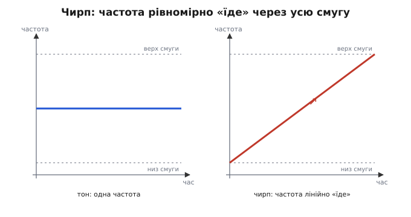
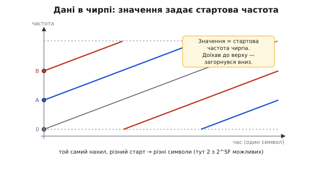
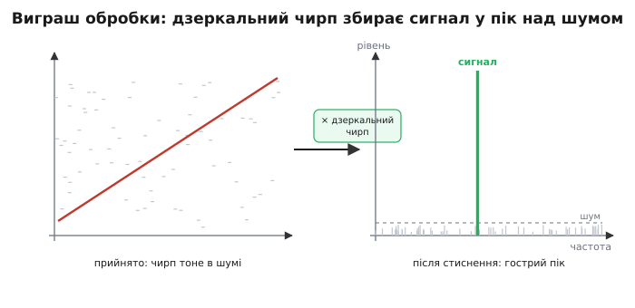
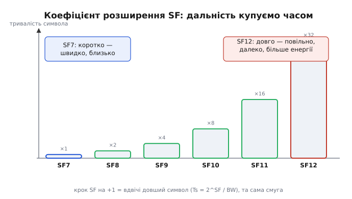

# LoRa (чирп-модуляція)

Уяви датчик вологості ґрунту десь у полі. Живиться від однієї батарейки, яка має протягти кілька років, а доповідати мусить за кілометри — туди, де немає ні Wi-Fi, ні стільникового покриття. Постав це поряд: дальність на кілометри, потужність як у кишенькового ліхтарика, батарея на роки. Звичайне радіо так не вміє — щоб добити далеко, воно кричить голосніше, а голосніше означає більше струму й сіла батарея. LoRa (від англ. *long range* — «велика дальність») обходить цей глухий кут інакше: вона не кричить гучніше, а говорить **повільно й по-особливому**. Серце цього трюку — **чирп** (англ. *chirp* — «цвірінькання, щебет»): сигнал, у якого частота не стоїть на місці, а плавно «їде». Розберімо від самої першопричини, чому таке щебетання дає дальність, якій звичайне радіо може лише позаздрити.

### Що таке чирп: частота, яка їде

Почнімо з найпростішого радіосигналу — **чистого тону**. Це коливання на одній частоті: воно увесь час сидить, скажімо, на 868 мегагерцах і нікуди не рухається. На площині «частота × час» такий тон — рівна горизонтальна лінія. Уся енергія сконцентрована в одній точці спектра.

Тепер зробимо одну-єдину зміну: хай частота не стоїть, а **рівномірно повзе** — починає з нижнього краю діапазону й плавно піднімається до верхнього за відведений час. Дійшовши до стелі, вона миттю «загортається» вниз і повзе знову. Оце і є чирп — звук, у якому тон рівно з'їжджає вгору. Якщо сповільнити пташине щебетання, почуєш саме такий «фііть» — тому розробники й назвали сигнал щебетом.


*На площині «частота × час» звичайний тон — горизонтальна лінія: одна частота весь час. Чирп натомість стартує знизу й рівно піднімається через усю смугу. Та сама енергія розмазується по всій ширині діапазону, а не тулиться в одній точці.*

Найважливіше тут — **наслідок** цього руху. Тон тримає всю потужність в одній точці частоти. Чирп ту саму потужність **розмазує** по всій смузі, через яку проїжджає: на кожен окремий герц припадає лише крихта. Сигнал стає широким і низьким. Саме це робить чирп окремим випадком [розширеного спектра](book:communications/spread-spectrum) — родини методів, де сигнал навмисне розтягують на смугу куди ширшу, ніж потрібно для самих даних, а на приймачі «згортають» назад відомим кодом. При згортанні корисний сигнал збирається у вузький пік над шумом, а будь-яка чужа завада, навпаки, розмазується широко й тоне; цю прибавку звуть **виграшем обробки**, і саме завдяки їй сигнал можна впевнено приймати, навіть коли він слабший за шум. Розмазати можна по-різному — стрибати частотою або множити на швидкий код; чирп — третій такий спосіб.

LoRa бере для свого розмазування саме плавний чирп. Цей різновид так і називають — **чирповий розширений спектр** (англ. *chirp spread spectrum*, CSS). Чому інженери обрали саме його — стане ясно, щойно ми побачимо, як приймач витягує такий сигнал назад.

### Як у чирпі ховаються дані

Чирп, що завжди їде однаково, сам по собі нічого не повідомляє — це просто рівне щебетання. Щоб передавати біти, потрібно, аби різні чирпи означали різні значення. LoRa робить це напрочуд елегантно: усі чирпи мають **однаковий нахил**, а відрізняються лише тим, **з якої частоти стартують**.

Уяви базовий чирп, що їде від самого низу смуги до верху. А тепер — чирп, який стартує не з низу, а з третини смуги: він піднімається до стелі, там «загортається» вниз і доїжджає решту вже від дна. Нахил той самий, але стартова частота інша — і це **інший символ**, інше значення. Скільки можливих стартових точок — стільки й значень може нести один чирп.


*Базовий чирп (сірий) їде від низу смуги. Символи A та B стартують з інших частот: дійшовши верху, частота загортається вниз і доїжджає до кінця символа. Той самий нахил, різний старт — різні значення. Усього таких розрізнюваних стартів 2^SF.*

Скільки саме різних стартів вдається розрізнити, задає один-єдиний параметр — **коефіцієнт розширення** (англ. *spreading factor*, SF). Він каже, **на скільки кроків** ділиться смуга й, отже, скільки бітів несе один чирп: при коефіцієнті SF один символ переносить рівно SF бітів, а розрізнити можна 2^SF стартових позицій. Це й пояснює назву: більший SF «розтягує» той самий обсяг даних на довший, дрібніше нарізаний символ. У LoRa коефіцієнт беруть від 7 до 12 — шість сходинок, кожна зі своїм характером. Як саме SF керує дальністю й швидкістю, побачимо за мить; спершу — головне диво, заради якого все й затівалося.

### Чому чирп бере дальність за малої потужності

Ось питання, на яке варто відповісти чесно. Розмазати сигнал тонким шаром по широкій смузі — наче навмисне його зіпсувати: він стає таким низьким, що ледь видніється над шумом ефіру. Як же приймач його чує, та ще й за кілометри?

Секрет — у способі **згортання** на приймальному боці. Приймач знає точний нахил чирпа й має в себе його **дзеркальну копію** — чирп, що їде в протилежний бік, згори вниз. Прийнятий сигнал множать на цю копію — і відбувається головне: спадний нахил копії точно гасить висхідний нахил сигналу. Частота, яка весь час їхала, після множення **перестає рухатися** — увесь розмазаний по смузі чирп стискається назад в одну вузьку частоту, у різкий високий пік. А все, що нахилу не має — шум, чужі завади, — навпаки, лишається розмазаним і низьким.


*Зліва: прийнятий чирп ледь вищий за шум — на око його там майже не видно. Множення на дзеркальний (спадний) чирп розпрямляє його в одну частоту. Праворуч: уся розмазана енергія збирається в гострий пік, що підіймається високо над шумовою підлогою, тоді як шум лишається низьким.*

У цьому й уся суть. Корисний сигнал збирається докупи, чужий шум — ні; відношення сигналу до шуму різко зростає. Це той самий **виграш обробки** розширеного спектра, тільки реалізований через чирп. Наслідок майже неймовірний: LoRa впевнено приймає сигнал, що **слабший за шумову підлогу**. Чутливість приймача сягає близько −137 дБм на найбільшому коефіцієнті розширення — це сигнал глибоко під рівнем теплового шуму, і його все одно витягують. Звідси й уся дальність: не з гучності, а з терпіння й знання нахилу.

> 🔧 **Навіщо це.** Дальність радіолінії впирається в те, наскільки слабкий сигнал приймач ще здатен розчути. Звичайна схема «голосніше = далі» з'їдає батарею: вдвічі більша дальність коштує вчетверо більше потужності. LoRa натомість міняє не потужність, а **час**: повільніший, дрібніше нарізаний чирп дає більший виграш обробки, тож приймач чує слабший сигнал. Передавач при цьому так само ощадливий — кілька десятків міліват. Тому той самий передавач при більшому коефіцієнті розширення дістає далі, не споживши ні на йоту більше струму в піку.

### Коефіцієнт розширення проти швидкості

Тепер видно, що коефіцієнт розширення — це ручка дальності. Але задарма нічого не буває: за дальність ми платимо **часом**, а отже швидкістю. Подивімося на цей обмін уважно, бо він — серце всіх компромісів LoRa.

Тривалість одного символа прямо залежить від коефіцієнта. Кожен крок SF угору **подвоює** довжину символа: символ розрізають на вдвічі дрібніші кроки, тож він і їде вдвічі довше. Записати це можна одним рядком:

```
Ts = 2^SF / BW          тривалість символа

SF7,  BW 125 кГц :  Ts = 128  / 125000 ≈ 1.0  мс
SF12, BW 125 кГц :  Ts = 4096 / 125000 ≈ 32.8 мс
```

Тут BW (англ. *bandwidth*) — ширина смуги, через яку їде чирп; типово 125 кГц, рідше 250 чи 500. Між SF7 і SF12 символ довшає у 2⁵ = 32 рази. А оскільки один символ несе SF бітів, довший символ означає меншу швидкість. На смузі 125 кГц це виглядає так:

```
SF7  : символ ~1.0  мс,  швидкість ≈ 5.5  кбіт/с   (швидко, ближче)
SF12 : символ ~32.8 мс,  швидкість ≈ 0.25 кбіт/с   (повільно, далеко)
```


*Тривалість символа для SF7…SF12 на одній смузі. Кожна сходинка вгору подвоює довжину (×2, ×4, … ×32 відносно SF7). Короткий символ SF7 — це швидкість і менша дальність; довгий символ SF12 — повільно, зате чутливість і дальність найбільші, а заразом і найдовший час у ефірі.*

Логіка обміну тепер прозора: **нижчий SF — швидше й ближче, вищий SF — повільніше й далі.** Вибираєш не «добре чи погано», а що тобі зараз дорожче. Сенсор, що раз на годину шле кілька байтів із далекого поля, спокійно бере SF12: повільність не біда, коли даних краплина, зате добиває за горизонт. Пристрій, що поряд із приймачем і має передати більше, бере SF7: швидко відстрілявся й заснув. До смуги BW діє схожий важіль: ширша смуга піднімає швидкість, але вкорочує дальність — ще одна грань того самого компромісу.

Є й тонкощі, які видно не одразу. Чирпи з різними коефіцієнтами в одній смузі майже **не заважають** один одному: приймач, налаштований на свій нахил-копію, чужі SF просто розмазує як шум. Тому в одній смузі одночасно живуть кілька «віртуальних каналів» за коефіцієнтом розширення — мережа садовить далекі вузли на високий SF, близькі на низький, і вони не плутаються. А от вертикальна стінка обміну така: на SF12 кожне повідомлення висить у ефірі десятки мілісекунд, тож багато балакучих вузлів швидко забивають канал — повільність дальнього зв'язку має ціну в пропускній здатності всієї мережі.

### Дальність, швидкість, енергія: трикутник вибору

Звівши все докупи, дістаємо три величини, що тягнуть у різні боки, і ручку SF, якою їх балансують. Ось як вони пов'язані.

**Дальність.** Росте з коефіцієнтом розширення: більший SF — більший виграш обробки — чутливіший прийом — дальший зв'язок. На SF12 у відкритій місцевості це кілометри, інколи десятки; у щільній забудові, звісно, менше.

**Швидкість.** Падає з коефіцієнтом: довший символ несе ті самі біти повільніше. Від кількох кілобіт за секунду на SF7 до сотень біт на SF12. LoRa — це принципово **вузький струмочок** даних, не потік: телеметрія, покази, короткі команди, а не відео чи файли.

**Енергія на повідомлення.** Тут підступ. Піковий струм передавача від SF майже не залежить — світить однаково. Але на високому SF повідомлення **довше висить у ефірі** (англ. *time on air* — час у ефірі), тож сумарно витрачає **більше** заряду на одну посилку. Виходить тонкий баланс: SF12 дістає далі, проте кожна передача коштує дорожче за енергією, а ще довше зайнятий канал. Часто оптимум — **найнижчий SF, що ще добиває** до шлюзу: достатньо далеко, але без зайвого часу в ефірі. Саме це автоматично робить адаптивний підбір швидкості в реальних мережах.

Жодне з трьох не можна покращити, не зачепивши інші, — рівно як у будь-якій радіолінії, де всі підсилення й втрати зводять у [бюджет лінії](root:embedded/link-budget). LoRa лиш дає зручну єдину ручку — коефіцієнт розширення, — якою цей баланс крутять прямо на льоту.

### Де працює LoRa

Тепер ясно, під що заточена ця технологія, і її батьківщина стає очевидною. LoRa — основа **інтернету речей** на великих відстанях за мізерної потужності: коли треба зібрати краплинки даних із багатьох розкиданих, автономних, довгоживучих пристроїв.

Лічильники води, газу й електрики, що доповідають покази раз на день із підвалів і колодязів, куди не дістає стільниковий сигнал. Датчики ґрунту, погоди й рівня води на полях і в теплицях. Стеження за худобою та дикими тваринами на величезних угіддях. Розумні паркувальні місця, сміттєві баки, що сигналять про заповнення, лічильники в містах. Спільне в усіх одне: **мало даних, велика відстань, роки від однієї батареї** — точно той профіль, під який чирп і створений. А там, де потрібен жвавий потік даних поряд, LoRa поступається місцем [Wi-Fi](book:communications/wifi) чи стільниковим мережам: кожному інструменту своя задача.

> 📜 **Звідки взялася LoRa.** Сам прийом — лінійний частотний чирп — інженери знають із 1940-х: так працюють радари й гідролокатори, де щебет дає точне вимірювання відстані. Ідея **застосувати чирп для передачі даних** на малій потужності визріла пізніше: близько 2009 року у французькому Греноблі двоє інженерів, Ніколя Сорнен (Nicolas Sornin) і Олів'є Селлер (Olivier Seller), почали бавитися з чирповим розширеним спектром для дешевого далекого зв'язку лічильників. 2010 року вони разом із Франсуа Сфорцою (François Sforza) заснували стартап Cycleo, а 2012-го його разом із технологією купила компанія Semtech, яка й розвинула LoRa до сьогоднішнього вигляду. Це не «винахід з нуля», а вдале перенесення старого радарного прийому в нову нішу — ощадливий інтернет речей; статус усталений, документований самими винахідниками.

Варто чітко розрізняти два рівні. **LoRa** — це сама фізика: чирпова модуляція, спосіб накласти біти на щебет. Поверх неї будують **мережеві правила** — хто коли говорить, як адресувати й шифрувати пакети; найпоширеніший такий звід зветься LoRaWAN. Перше — принцип передачі сигналу, друге — організація мережі над ним; у цій статті йшлося саме про перше, бо вся магія дальності живе там, на рівні чирпа.

Підсумок короткий. Замість кричати гучніше, LoRa говорить повільно й рівним щебетом: чирп розмазує енергію по широкій смузі, а дзеркальний чирп на прийомі збирає її назад у пік над шумом. Одна ручка — коефіцієнт розширення — крутить баланс між дальністю, швидкістю та енергією, дозволяючи витягти сигнал навіть з-під шуму. Звідси й уся ніша: дешевий, автономний, далекий зв'язок для тисяч маленьких речей.

---
