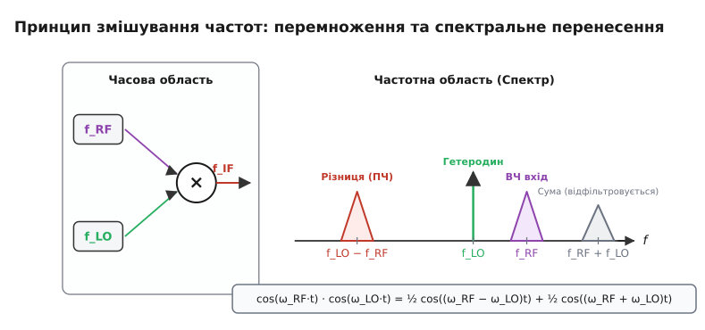
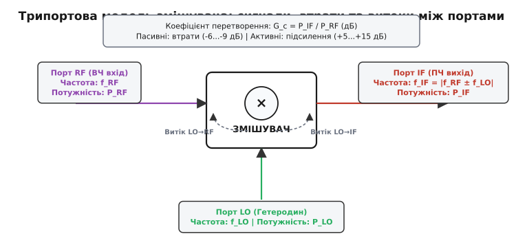
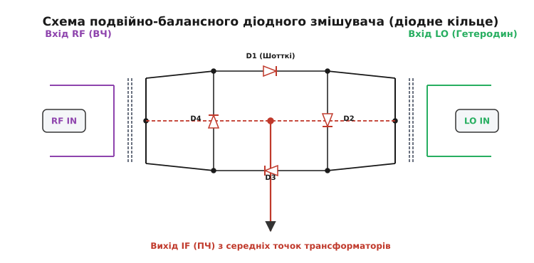
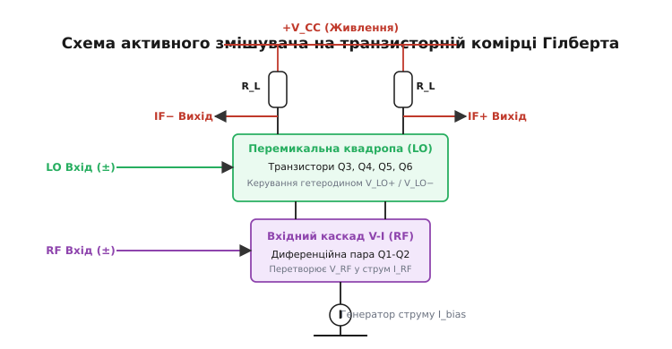
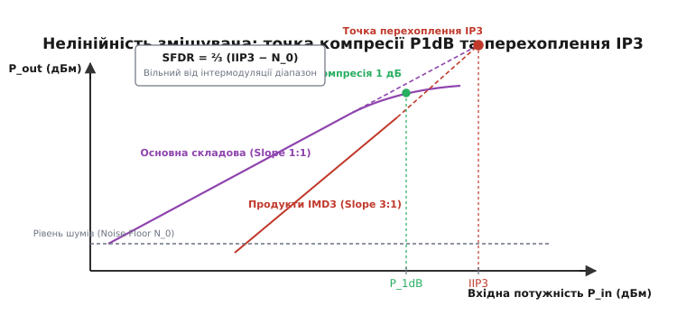

# Змішувач частот

<preknowlist>
- [Супергетеродин](topic:communications/superheterodyne) — проміжна частота та перенесення спектра.
- [Модуляція](topic:communications/why-modulation) — перенос інформаційного вмісту без викривлення.
- [Діод Шотткі](topic:electronics/schottky-diode) — нелінійний напівпровідниковий елемент високої швидкодії.
- [Диференційна пара](topic:electronics/opamp-input-stage) — симетрична транзисторна пара як основа активних схем.
</preknowlist>

Супутниковий приймач Ku-діапазону ловить сигнал із орбіти на частоті 11.7 ГГц. Згасання такого високочастотного сигналу в стандартному коаксіальному кабелі становить понад 100 дБ на кожні 10 метров: якби сигнал спробували передати від антени на даху до приймача у кімнаті безпосередньо, до споживача дійшов би нуль. Єдине інженерне вишення — безпосередньо на антені, у малошумному блоці-конвертері (LNB), перенести частоту 11.7 ГГц донизу, у так званий L-діапазон (950–2150 МГц), де кабель працює з помірними втратами. Проте лінійні підсилювачі, фільтри та пасивні RLC-мережі здатні лише змінювати амплітуду й фазу вже наявних у сигналі частот — вони за визначенням не можуть згенерувати жодної нової частотної компоненти. Для створення нових частот необхідний пристрій, що реалізує **нелінійне аналогове або цифрове перемноження** двох сигналів — **змішувач частот** (англ. *frequency mixer*).

Змішувач є ключовим вузлом будь-якої системи радіозв'язку, радара, аналізатора спектра чи супутникового приймача. Він приймає вхідний радіочастотний сигнал `f_RF` (англ. *radio frequency*) і сигнал допоміжного опорного генератора — гетеродина `f_LO` (англ. *local oscillator*), утворюючи на виході нові комбінаційні частоти, серед яких обирають проміжну частоту `f_IF` (англ. *intermediate frequency*).

### Математична сутність та нелінійне перемноження

Здатність змішувача створювати нові частоти випливає безпосередньо з фундаментальної математичної тотожності для добутку двох тригонометричних функцій. Якщо подати на вхід ідеального аналогового перемножувача два синусоїдальних коливання — корисний ВЧ-сигнал `s_RF(t) = V_RF · cos(ω_RF · t)` та сигнал гетеродина `s_LO(t) = V_LO · cos(ω_LO · t)`, результатом їхньої взаємодії стає добуток:

```
s_out(t) = k · s_RF(t) · s_LO(t)
         = k · V_RF · V_LO · cos(ω_RF · t) · cos(ω_LO · t)
         = ½ · k · V_RF · V_LO · [ cos((ω_RF − ω_LO) · t) + cos((ω_RF + ω_LO) · t) ]
```

У результаті множення початкові частоти `f_RF` та `f_LO` повністю зникають, а замість них народжуються дві нові спектральні компоненти: **різницева частота** `|f_RF − f_LO|` та **сумарна частота** `f_RF + f_LO`. При цьому вся інформація, закладена в амплітудну чи фазову модуляцію початкового ВЧ-сигналу, бездоганно зберігається і дзеркально переноситься на обидві нові частоти.

**Числовий приклад.** Нехай прийнятий приймачем Wi-Fi сигнал сидить на частоті `f_RF = 2450 МГц`, а гетеродин генерує коливання на частоті `f_LO = 2000 МГц`. Після перемноження в змішувачі на виході виникають дві нові частоти:
- Різницева частота (ПЧ): `f_IF = 2450 − 2000 = 450 МГц`.
- Сумарна частота: `f_sum = 2450 + 2000 = 4450 МГц`.

Сумарна частота 4450 МГц легко відсікається простим фільтром низьких частот (ФНЧ), а корисна проміжна частота 450 МГц подається далі в тракт для підсилення та демодуляції.


*Принцип змішування частот: у часовій області змішувач виконує перемноження двох сигналів, а у частотній області це відповідає формуванню сумарної та різницевої частот. Підключений на виході смуговий фільтр виділяє лише різницеву проміжну частоту f_IF, відсікаючи сумарний компонент.*

На практиці ідеальних аналогових перемножувачів сигналів на НВЧ не існує. Створення перемноження в реальних схемах виконується двома фундаментальними шляхами:

1. **За допомогою нелінійної вольт-амперної характеристики (ВАХ).** Якщо подати суму двох сигналів `V(t) = V_RF · cos(ω_RF · t) + V_LO · cos(ω_LO · t)` на елемент із нелінійною залежністю струму від напруги (наприклад, на напівпровідниковий діод чи транзистор), розклад його ВАХ у ряд Тейлора містить квадратичний член:
   ```
   I(V) = a_0 + a_1 · V(t) + a_2 · V²(t) + a_3 · V³(t) + ...
   ```
   Розкриття квадратичного виразу `a_2 · (V_RF(t) + V_LO(t))²` дає доданок `2 · a_2 · V_RF(t) · V_LO(t)`, який і реалізує точне перемноження сигналів.

2. **Шляхом часової комутації (ключового перемикання).** Потужний сигнал гетеродина використовується як керувальний імпульс, що з високою частотою відкриває та закриває електронні ключі (діоди або польові транзистори). Це еквівалентно множенню вхідного сигналу `s_RF(t)` на меандровий прямокутний сигнал `m(t)` із амплітудою ±1. Оскільки меандр містить непарні гармоніки гетеродина (`f_LO`, `3 f_LO`, `5 f_LO`), на виході виникають комбінаційні частоти вида `|f_RF ± n · f_LO|`.

Історичний шлях від перших лабораторних дослідів із гетеродинним прийомом до створення сучасних інтегральних схем змішувачів розглянуто в [історичному нарисі про еволюцію змішувачів](topic:communications/mixer/hist-mixer-evolution.md).

### Анатомія трьох портів та ключові параметри

Змішувач частот — це трипортовий пристрій. Кожен порт має своє чітко визначене функціональне призначення, а взаємодія між ними характеризується специфічним набором параметрів:

- **Порт RF (Radio Frequency):** вхід для слабкого високочастотного сигналу, отриманого від антени або малошумного підсилювача (LNA).
- **Порт LO (Local Oscillator):** вхід для потужного опорного коливання від внутрішнього гетеродина або синтезатора частоти.
- **Порт IF (Intermediate Frequency):** вихід, на якому формується перенесений різницевий або сумарний сигнал.


*Трипортова модель змішувача та його ключові характеристики: коефіцієнт перетворення G_c (або втрати L_c) та паразитна розв'язка між портами (LO→RF, LO→IF, RF→IF).*

Для оцінки якості змішувача інженери користуються такими ключовими параметрами:

- **Коефіцієнт перетворення (Conversion Gain / Loss, `G_c` / `L_c`):** відношення потужності вихідного сигналу на проміжній частоті `P_IF` до потужності вхідного сигналу `P_RF`, виражене у децибелах:
  ```
  G_c (дБ) = 10 · log₁₀( P_IF / P_RF )
  ```
  У пасивних змішувачах (на діодах) спостерігаються втрати перетворення (зазвичай `L_c = -6 ... -9` дБ). В активних змішувачах (на транзисторах) спостерігається підсилення (`G_c = +5 ... +15` дБ).

- **Розв'язка між портами (Port-to-Port Isolation):** показник здатності змішувача послаблювати проходження сигналу з одного порту в інший без перетворення. Найважливішою є розв'язка **LO-to-RF** (попереджає випромінення потужного гетеродина через антену в ефір) та **LO-to-IF** (попереджає перевантаження наступних каскадів ПЧ потужною напругою гетеродина). Вимірюється у дБ і в якісних змішувачах становить від 30 до 60 дБ.

- **Потужність гетеродина (LO Drive Level):** рівень потужності гетеродина, необхідний для переведення діодів або транзисторів змішувача у насичений перемикальний режим. Стандартні пасивні змішувачі поділяють на класи: Level 7 (+7 дБм або 500 мВт), Level 13 (+13 дБм), Level 17 (+17 дБм). Чим вищий рівень LO, тим вища лінійність змішувача і тим більша його стійкість до завад.

- **Коефіцієнт шуму (Noise Figure, NF):** відношення сигнал/шум на вході RF до відношення сигнал/шум на виході IF. Для пасивних змішувачів коефіцієнт шуму чисельно практично дорівнює втратам перетворення (`NF ≈ L_c`).

**Узгодження імпедансів портів.** Для запобігання відбиттю потужності кожен порт змішувача повинен бути узгоджений на хвильовий опір 50 Ом. Якщо коефіцієнт стоячої хвилі (КСХ/VSWR) на порту IF високий через неправильне підключення наступного фільтра, відбита напруга проміжної частоти повертається в змішувач і створює додаткові нелінійні спотворення, погіршуючи параметри `P_1dB` та `IP3` на 3–6 дБ.

### Еволюція топологій: Пасивні проти Активних

Конструктивна схемотехніка змішувачів пройшла еволюцію від найпростішого одного діода до складних симетричних транзисторних матриць. Схеми поділяють на **пасивні** (зазвичай діодні або FET-ключові) та **активні** (на біполярних або польових транзисторах під живленням).

#### Однодіодні та однобалансні змішувачі
Найпростіший однодіодний змішувач містить один діод Шотткі, на який через суматор подаються сигнали RF та LO. Головний недолік такої схеми — повна відсутність розв'язки між портами: потужний гетеродин вільно проникає в антенний тракт та каскади ПЧ.

Застосування витокового трансформатора (балуна) дозволяє побудувати **однобалансну схему** з двох діодів. У ній сигнал гетеродина подається противофазно на два діоди й взаємно компенсується у вихідній цепи, що забезпечує розв'язку LO-to-IF на рівні 20–30 дБ.

#### Подвійно-балансний діодний змішувач (діодне кільце)
Золотим стандартом високолінійних пасивних ВЧ-змішувачів є **подвійно-балансна схема** (англ. *double-balanced mixer*, DBM), побудована на кільці з чотирьох діодів Шотткі та двох симетричних трансформаторах із середньою точкою.


*Схема подвійно-балансного діодного змішувача (діодне кільце): чотири діоди Шотткі D1–D4 та два високочастотні трансформатори забезпечують повну симетрію та придушення витоку гетеродина.*

Під час позитивної напівхвилі напруги гетеродина `LO` діоди D1 та D3 відкриваються, підключаючи вторинну обмотку трансформатора RF до виходу ПЧ в одній полярності. Під час негативної напівхвилі `LO` відкриваються діоди D2 та D4, підключаючи обмотку RF у протилежній полярності.

Завдяки повній мостовій симетрії подвійно-балансне діодне кільце забезпечує:
- Високу розв'язку між усіма трьома портами (LO-to-RF, LO-to-IF, RF-to-IF > 40 дБ).
- Автоматичне придушення усіх парних гармонік сигналу гетеродина та ВЧ.
- Чудову лінійність та стійкість до потужних завад.

#### Активний змішувач на комірці Гілберта
У мікроелектронних напівпровідникових чипах (SiGe, CMOS, BiCMOS) застосування трансформаторів неможливе через їхні великі габарити. Тому в інтегральних схемах панує **активна комірка Гілберта** (англ. *Gilbert cell*) — двохбалансна транзисторна структура, винайдена Баррі Гілбертом у 1968 році.


*Схема активного змішувача на комірці Гілберта: нижня диференційна пара Q1-Q2 виконує перетворення напруги RF у струм, а верхня квадропа Q3-Q6 здійснює комутацію струму за сигналами гетеродина LO.*

Комірка Гілберта складається з двох поверхів:
1. **Нижній каскад (V-I transconductance):** диференційна пара транзисторів Q1–Q2 перетворює вхідну напругу `V_RF` у пропорційний диференційний струм `I_RF`.
2. **Верхній перемикальний каскад (Switching Quad):** чотири транзистори Q3–Q6 працюють як перехресний струмовий комутатор, керований диференційною напругою гетеродина `V_LO`.

Детальний порівняльний аналіз електричних параметрів, переваг та обмежень діодного кільця та комірки Гілберта зведено в [порівняльному розборі активних і пасивних змішувачів](topic:communications/mixer/comp-active-passive-mixers.md).

### Нелінійні спотворення, побічні комбінаційні частоти та IP3

Реальний змішувач не є ідеальним перемножувачем. Наявність вищих членів у розкладі ВАХ (`a_3 · V³`, `a_5 · V⁵` тощо) призводить до виникнення **паразитних інтермодуляційних спотворень** та **побічних комбінаційних частот** (англ. *spurs*).

Якщо на вхід змішувача потрапляють два близькі потужні завадові сигнали з частотами `f_1` та `f_2`, кубічна нелінійність утворює продукти інтермодуляції третього порядку (IMD3) з частотами:
```
f_IMD3 = 2·f_1 − f_2   та   f_IMD3 = 2·f_2 − f_1
```
Ці комбінаційні частоти потрапляють безпосередньо в корисну смугу проміжної частоти `f_IF` і не можуть бути відфільтровані жодним ПЧ-фільтром.


*Залежність вихідної потужності від вхідної для основної частоти та продуктів інтермодуляції 3-го порядку (IMD3). Визначення точки компресії P_1dB та математичної точки перехоплення IIP3.*

Для оцінки динамічного діапазону змішувача використовують два параметри:

1. **Точка компресії підсилення 1 дБ (`P_1dB`):** рівень вхідної потужності `P_in`, при якому реальний коефіцієнт перетворення змішувача зменшується на 1 дБ відносно ідеального лінійного значення через насичення схеми.
2. **Точка перехоплення третього порядку (Third-Order Intercept Point, `IP3`):** умовна точка перетину екстрапольованих лінійних характеристик вихідної потужності основного сигналу (нахил 1:1 у дБ-масштабі) та продуктів IMD3 (нахил 3:1 у дБ-масштабі). 
   - `IIP3` (Input IP3) — точка перехоплення, віднесена до входу (дБм).
   - `OIP3` (Output IP3) — точка перехоплення, віднесена до виходу (дБм).

Зв'язок між параметрами виражається емпіричним співвідношенням:
```
IIP3 ≈ P_1dB + 10...12 дБ
```

**Явище взаємного змішування (Reciprocal Mixing).** Окрім нелінійностей ВАХ, існує ще одне небезпечне явище. Реальний сигнал гетеродина завжди має фазовий шум — розширену спектральну «бороду» навколо несучої `f_LO`. Якщо поруч із слабким корисним сигналом на вхід змішувача приходить потужна завада на сусідньому каналі, ця завада змішується з фазовим шумом гетеродина і накриває корисний сигнал проміжної частоти шумним «підкладком», маскуючи слабкий прийом.

**Таблиця побічних частот (Spur Matrix).** У загальному випадку на виході змішувача формується спектр компонентів `m · f_RF ± n · f_LO`, де `m` та `n` — цілі числа. Найнебезпечнішими є гармоніки 2x2 (`2 f_RF − 2 f_LO`) та 3x3 (`3 f_RF − 3 f_LO`), які потрапляють близько до проміжної частоти. Грамотне планування частотного плану (Frequency Planning) полягає у виборі такої `f_LO`, при якій найсильніші побічні продукти лягають далеко за межі робочої смуги ПЧ-фільтра.

Строгі математичні виведення комбінаційних частот вида `m · f_RF ± n · f_LO`, методи розрахунку `IP3` та вільного від інтермодуляцій динамічного діапазону (`SFDR`) викладено у [математичному аналізі комбінаційних частот і IP3](topic:communications/mixer/math-intermodulation.md).

### Квадратурне змішування (I/Q) та придушення дзеркального каналу

Класичний одноканальний змішувач має фундаментальну фізичну ваду, звану **проблемою дзеркального каналу** (англ. *image frequency*). Оскільки модуль різниці не розрізняє знаку `f_IF = |f_RF − f_LO|`, дві абсолютно різні вхідні частоти — корисна `f_RF = f_LO + f_IF` та дзеркальна `f_img = f_LO − f_IF` — після змішування лягають на одну й ту саму проміжну частоту `f_IF`, безнадійно накладаючись одна на одну.

Для подолання цієї проблеми у сучасній цифровій та векторній радіозв'язку (Zero-IF / Low-IF архітектури, SDR) застосовують **квадратурне (I/Q) змішування**.

Квадратурний змішувач складається з двох одинакових змішувачів (канал I — *In-phase*, канал Q — *Quadrature*), на які вхідний ВЧ-сигнал подається паралельно, а сигнали гетеродина подаються зі взаємним зсувом фази на 90°:
```
LO_I(t) = cos(ω_LO · t)
LO_Q(t) = sin(ω_LO · t)
```
Отримані на виході два квадратурні сигнали `I(t)` та `Q(t)` утворюють комплексний вектор прямокутної площини `Z(t) = I(t) + j · Q(t)`. Завдяки наявності фазової інформації знаки позитивних та негативних частот розділяються, що дозволяє:
- Повністю придушити дзеркальний канал математичним шляхом без громіздких ВЧ-фільтрів (Image Reject Mixer).
- Здійснювати пряме перетворення ВЧ-сигналу безпосередньо у нульову проміжну частоту (Direct Conversion / Zero-IF receiver).
- Передавати складні види векторної модуляції (QPSK, 16-QAM, 256-QAM, OFDM).

**Проблема DC-зсуву та низькочастотного шуму.** У приймачах прямого перетворення (Zero-IF) проміжна частота дорівнює 0 Гц. Проникаючий через розв'язку портів витік гетеродина на порт RF випромінюється в антену, відбивається від навколишніх предметів і змішується сам із собою. Це генерує постійну напругу (DC offset) на виході I/Q компонент, яка перевантажує АЦП. Одночасно активні змішувачі страждають від низькочастотного напівпровідникового флікер-шуму (`1/f`), що погіршує чутливість біля нуля.

Сучасним розвитком квадратурних змішувачів у SDR є так званий **змішувач Тейло (Tayloe Mixer)** або стробоскопічний комутатор накопичення заряду. У ньому гетеродин послідовно замикає чотири ключі з частотою `4 · f_LO`, заряджаючи накопичувальні конденсатори для чотирьох фаз `0°`, `90°`, `180°`, `270°`. Така схема забезпечує низький рівень шуму, високу лінійність та надзвичайно широкий динамічний діапазон.

Програмну та апаратну реалізацію цифрового квадратурного змішувача на базі табличного генератора NCO розглянуто у [проєкті цифрового квадратурного змішувача для SDR](topic:communications/mixer/proj-sdr-mixer.md).

### Інтегральні рішення та практичні рекомендації

Сучасний розробник радіоелектронної апаратури рідко збирає змішувачі на дискретних діодах чи транзисторах. На ринку панують два класи готових компонентів:

1. **Завершені пасивні модулі в метало-керамічних або SMD-корпусах** (наприклад, серії Mini-Circuits ADE-1, SIM-1, RMS-1). Вони містять підібране діодне кільце та витокові трансформатори на феритових мікрокільцях, налаштовані на хвильовий опір 50 Ом.
2. **Інтегральні активні мікросхеми ВЧ-змішувачів** (наприклад, Analog Devices AD831, Maxim Integrated MAX2680/MAX2682, Texas Instruments TRF3705). Вони виготовляються за технологією SiGe/CMOS і містять комірку Гілберта, малошумний вхідний буфер, синтезатор гетеродина та вихідний підсилювач ПЧ.

При розробці друкованої плати ВЧ-модуля слід забезпечувати коротку трасу гетеродина з бар'єрним виа-захистом (Via Fencing), використовувати якісну розв'язку за живленням керамічними конденсаторами та тримати симетрію диференційних ліній I/Q каналів.

Електричний контракт, призначення виводів, регістри керування та практичну послідовність налаштування інтегрального змішувача наведено у [специфікації інтерфейсу та параметрів інтегрального змішувача](topic:communications/mixer/api-mixer-config.md).

> 🔧 **Навіщо це.** Знання фізики змішування частот дозволяє інженеру правильно спроєктувати радіочастотний тракт: підібрати необхідний рівень потужності гетеродина, обчислити динамічний діапазон за параметром `IIP3`, розрахувати селективність за дзеркальним каналом та уникнути перевантаження вихідних каскадів ПЧ паразитною напругою LO.