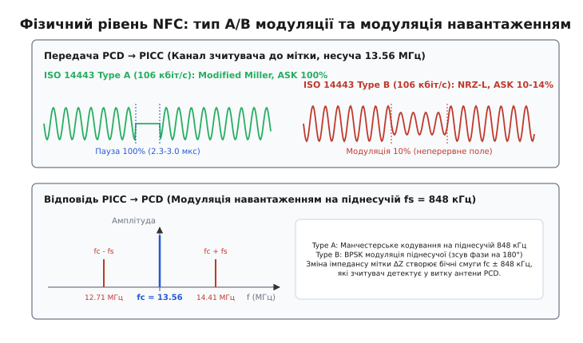
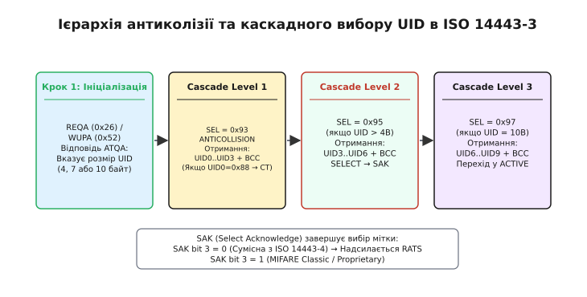
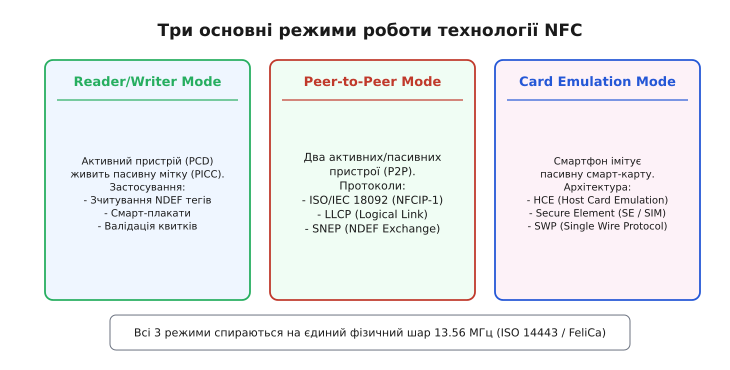
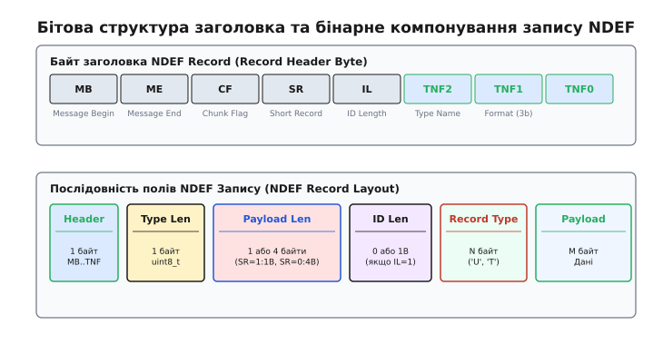

# 📡 Протоколи NFC: ISO 14443, NDEF і режими роботи

<preknowlist>
- [Модуляція сигналу](book:communications/why-modulation) — перенесення інформаційного спектра на високочастотне несуче коливання.
- [Трансформатор і магнітна індукція](book:electronics/transformer) — принципи взаємної індуктивності та наведення ЕРС у зв'язаних контурах.
- [Контрольні суми CRC](book:communications/crc) — виявлення помилок у бінарних кадрах на фізичному рівні.
- [Шина SPI](book:communications/spi-bus) — послідовний апаратний інтерфейс обміну між мікроконтролером та NFC-трансивером.
</preknowlist>

Near Field Communication (NFC) — це технологія бездротового високочастотного зв'язку малого радіуса дії (до 10 см), що працює на неліцензованій частоті 13.56 МГц. На відміну від стандартних радіосистем далекого поля (Far-Field), де передача здійснюється за допомогою випромінюваної електромагнітної хвилі, NFC спирається на індуктивний зв'язок у ближній зоні (Near-Field Magnetic Induction). Антени передавача та приймача фактично утворюють трансформатор із повітряним сердечником, де первинна котушка зчитувача генерує змінне магнітне поле, а вторинна котушка мітки приймає енергію та модулює відбитий імпеданс.

Використання частоти 13.56 МГц обумовлено міжнародною угодою про радіочастотні смуги для промислових, наукових та медичних цілей (ISM Band). Довжина хвилі на цієї частоті становить `λ ≈ 22.1 м`, тому ближня зона охоплює відстані до `r < λ / (2·π) ≈ 3.5 м`. У радіусі ж прямого контактного використання NFC (від 0 до 5 см) випромінювальна складова електромагнітного поля практично відсутня, а взаємодія описується суто через квазістатичне магнітне поле `H`.

Історія виникнення NFC, конфлікти між патентами MIFARE Crypto1 та Sony FeliCa, а також еволюція від перших RFID-карток до стандартів NFC Forum розібрані у [історичному екскурсі про стандартизацію NFC](book:communications/nfc-protocols/hist-nfc-standardization.md).

```
   PCD (Зчитувач / Активний)                   PICC (Мітка / Пасивна)
+-----------------------------+               +----------------------+
| Генератор 13.56 МГц          |               | Резонансний контур   |
| H-поле: I1 · sin(ω·t)       | ===( H )====> | LC: L2 = 13.56 МГц   |
|                             |               |                      |
| Демодулятор I/Q             | <===(ΔZ)===== | Модуляція навантаж.  |
| Детектор піднесучої 848 кГц |  (Відбитий    | FET ключ R_mod       |
+-----------------------------+   імпеданс)   +----------------------+
```

## 1. Фізичний рівень RF та принципи модуляції навантаженням

Фізичний шар NFC регламентується стандартами ISO/IEC 14443-2, ISO/IEC 18092 та JIS X 6319-4. Передача даних від пристрою зчитування (PCD — Proximity Coupling Device) до безконтактної картки або мітки (PICC — Proximity Integrated Circuit Card) відбувається шляхом модуляції несучої частоти `f_c = 13.56 МГц`.


*Часові діаграми модуляції 100% ASK (Type A), 10% ASK (Type B) та спектральні бічні смуги модуляції навантаженням піднесучою 848 кГц.*

Для передачі даних у напрямку PCD -> PICC застосовуються три основні технології фізичного рівня:

1. **ISO 14443 Type A:** Застосовує 100% амплітудне маніпулювання (ASK 100%) та кодування Modified Miller на базовій швидкості 106 кбіт/с. При передачі біта несуче поле короткочасно вимикається (амплітуда падає до нуля на час від 2.3 до 3.0 мкс). Така пауза легко детектується найпростішими аналоговими схемотехнічними детекторами обвідної всередині пасивної мітки без потреби у складних DSP-процесорах.
2. **ISO 14443 Type B:** Застосовує неповну амплітудну модуляцію (ASK 10%) та кодування NRZ-L на швидкості 106 кбіт/с. Амплітуда несучого поля падає лише на 10%, що забезпечує безперервне надходження електромагнітної енергії для живлення мікросхеми мітки під час передачі довгих кадрів даних та виконання мікроконтролером карти складних криптографічних обчислень RSA/AES.
3. **FeliCa (NFC-F / JIS X 6319-4):** Застосовує модуляцію ASK 10% та манчестерське кодування на вищих швидкостях 212 кбіт/с та 424 кбіт/с. Кожен бітовий символ містить обов'язковий перехід стану в середині тактового інтервалу, що гарантує точну самосинхронізацію приймача.

Зворотна передача даних від пасивної мітки до зчитувача (PICC -> PCD) не може використовувати прямого випромінювання, оскільки пасивна мітка не має власного генератора високочастотної потужності. Замість цього мітка використовує **модуляцію навантаженням** (Load Modulation). Переключаючи паралельний шунтувальний опір `R_mod` або ємність у своєму резонансному контурі за допомогою польового ключового транзистора, мітка змінює опір вторинного трансформаторного кола. За законом взаємної індуктивності це відображається у вигляді зміни повного опору (відбитого імпедансу `Z_ref`) на антені зчитувача.

Для запобігання завадам від власного потужного поля зчитувача модуляція навантаженням здійснюється на допоміжній піднесучій частоті `f_s = f_c / 16 = 848 кГц`.
- У **Type A** піднесуча модулюється за амплітудою за кодом Манчестер (зміна стану в середині бітового інтервалу).
- У **Type B** піднесуча модулюється за фазою (BPSK), де зміна фази піднесучої на 180° сигналізує про зміну бітового рівня.
- У **FeliCa (Type F)** піднесуча не використовується: мітка виконує пряму модуляцію навантаженням кодом Манчестер на несучій 13.56 МГц.

Детальний математичний вивід взаємної індуктивності, відбитого імпедансу `Z_ref`, спектрального розкладу бічних смуг `f_c ± f_s` та розрахунок добротності антенного контуру `Q` наведено у [математичному розборі модуляції навантаженням](book:communications/nfc-protocols/math-load-modulation.md).

Схемотехніку аналогового фронтенду трансиверів (PN532, ST25R3916), структуру EMC-фільтрів та інженерні правила розрахунку друкованих PCB-антен розкрито у [огляді компонента аналогового фронтенду NFC](book:communications/nfc-protocols/comp-nfc-controller-frontend.md).

## 2. Ініціалізація та дозвіл колізій ISO 14443-3

Коли пасивна мітка потрапляє в магнітне поле зчитувача, її внутрішній випрямляч на діодах Шотткі заряджає накопичувальний конденсатор живлення. Після виходу внутрішнього процесора мітки з стану скидання (Power-On Reset, POR) вона переходить у стан `IDLE` і починає прослуховувати ефір.

Оскільки у зоні дії антени зчитувача може одночасно опинитися кілька міток, стандарт ISO/IEC 14443-3 визначає біт-орієнтований протокол антиколізії (Bit-Oriented Anticollision Loop), який дозволяє зчитувачу виявити унікальний номер (UID) кожної мітки без конфліктів у каналі.


*Послідовність переходів станів ієрархічного дозволу колізій каскадів Cascade Level 1..3.*

Процедура вирішення колізій виконується за алгоритмом двійкового дерева (Binary Search Tree):

1. **Опитування (REQA / WUPA):** Зчитувач відправляє короткий 7-бітовий кадр `REQA` (0x26) або `WUPA` (0x52). Усі мітки у полі відповідають 2-байтовим кодом `ATQA` (Answer To Request A), який містить інформацію про довжину UID (Single 4 bytes, Double 7 bytes, Triple 10 bytes) та спосіб антиколізії.
2. **Каскадна процедура (Cascade Level 1..3):** Якщо у полі знаходяться дві мітки з різними UID (наприклад, `0x04 A2...` та `0x04 B5...`), їхні відповіді на виклик антиколізії `0x93 0x20` накладаються в ефірі. На біті, де значення UID розходяться ('0' та '1'), кодування Манчестер призводить до порушення фази (одночасна наявність сигналу в обох напівінтервалах біта).
3. **Виявлення колізії:** Приймач зчитувача фіксує бітову помилку та визначає точну позицію першого конфліктного біта `N`.
4. **Розділення гілок:** Зчитувач повторно відправляє команду `SEL` з префіксом вже відомої частини UID та додає біт '0' або '1'. Мітка, у якої біт не збігається з префіксом, негайно замовкає та переходить у стан очікування, а мітка зі збігом продовжує передачу.
5. **Вибір мітки (SELECT):** Після визначення усіх 4 байтів поточного каскаду зчитувач відправляє кадр `SELECT` з повним 4-байтовим UID та контрольною сумою `BCC` (XOR байтів UID). Мітка відповідає байтом `SAK` (Select Acknowledge).

Якщо у полі одночасно присутні мітки з різною довжиною ідентифікатора (наприклад, 4-байтова картка MIFARE Classic та 7-байтова мітка NTAG213), процедура дозволу колізій виконується послідовно по каскадах:
- На Каскаді 1 (`SEL = 0x93`) мітка з 7-байтовим UID повертає байт каскадної позначки `CT = 0x88` у першому байті відповіді, а біт 3 у відповіді SAK вказує `SAK & 0x04 = 1` (UID неповний).
- Отримавши такий SAK, зчитувач зберігає перші 3 байти UID і переходить до Каскаду 2 (`SEL = 0x95`), витягуючи наступні 4 байти ідентифікатора, після чого мітка повертає остаточний `SAK` із встановленими бітами підтримки ISO-DEP чи NDEF.

Для міток Type B антиколізія спирається на серію часових слотів (Slotted ALOHA protocol): зчитувач передає команду `REQB/WUPB` з вказуванням кількості доступних слотів `N = 2^ATQB_SLOTS`. Кожна мітка обирає псевдовипадковий слот від 1 до N і відправляє свій 12-байтовий кадр `ATQB` у вибраному слоті.

Детальні списки байтів команд REQA, WUPA, SELECT, RATS, таблиці розшифровки байтів SAK/ATQA та реалізацію алгоритму контрольної суми CRC-16 ISO 14443-A наведено у [довіднику команд ISO 14443 та CRC-16](book:communications/nfc-protocols/api-iso14443-commands.md).

## 3. Транспортний шар ISO 14443-4 (ISO-DEP) та кадровання APDU

Після успішного закриття циклу антиколізії та отримання байта `SAK` з встановленим 6-м бітом (`SAK & 0x20 != 0`) зчитувач переводить мітку у режим протоколу високого рівня **ISO-DEP** (ISO Data Exchange Protocol).

Для активації ISO-DEP зчитувач посилає команду `RATS` (Request for Answer to Select). Мітка відповідає структурою `ATS` (Answer to Select), у якій вказуються:
- **FSCI (Frame Size Card Integer):** Максимальний розмір буфера кадру мітки (від 16 до 256 байтів).
- **FWI (Frame Waiting Time Integer):** Максимальний час очікування відповіді від смарт-карти перед виникненням таймауту.
- **Опції розширення швидкості:** Підтримка асиметричних швидкостей 212, 424 та 848 кбіт/с.

Після ініціалізації ISO-DEP обмін даними здійснюється блоками даних `I-Block` (Information Block), `R-Block` (Receive Ready / NACK) та `S-Block` (Supervisory / DESELECT / WTX).

Всередині корисного навантаження `I-Block` передаються структури **APDU** (Application Protocol Data Unit) згідно зі стандартом смарт-карт ISO/IEC 7816-4. Це дозволяє проводити банківські транзакції EMV та зчитувати біометричні паспорти через той самий фізичний NFC-канал.

```
 ISO-DEP Frame
+------------------+-----------------------------------------------+-----------+
| PCB Header (1 B) | APDU: [CLA INS P1 P2] [Lc] [Data] [Le]        | CRC (2 B) |
+------------------+-----------------------------------------------+-----------+
```

Кадр APDU розділяється на Command APDU та Response APDU:
- **Command APDU:** Складається з обов'язкового 4-байтового заголовка `CLA` (Class), `INS` (Instruction), `P1` (Parameter 1), `P2` (Parameter 2), після яких ідуть опціональні поля `Lc` (Length of Command Data), масив `Data` та `Le` (Length of Expected Response).
- **Response APDU:** Передає корисні дані відповіді, які завершуються двома обов'язковими байтами статусу `SW1` та `SW2`. Успішне виконання команди позначається кодом `SW1 SW2 = 0x9000`.

### Механізм ланцюгування блоків (Chaining Mechanism)
Якщо довжина кадру APDU перевищує максимальний буфер `FSD` або `FSC` (наприклад, при зчитуванні біометричного фото розміром 10 Кілобайт), протокол ISO-DEP виконує фрагментацію через біт ланцюгування `PCB[4] = 1` (Chaining Bit):
- Зчитувач відправляє першу частину APDU з `PCB = 0x10` (I-Block із встановленим бітом ланцюгування).
- Картка приймає фрагмент і підтверджує його блоком `R-Block(ACK)` з `PCB = 0xA0`.
- Отримавши ACK, зчитувач посилає наступний фрагмент. Після передачі останнього фрагмента біт ланцюгування скидається `PCB[4] = 0`, підтверджуючи завершення передачі масиву даних.

## 4. Режими роботи NFC Forum та класифікація міток Type 1–5

Організація NFC Forum об'єднала різноманітні фізичні стандарти (ISO 14443 Type A/B, FeliCa) у єдину системну архітектуру, визначивши **три прикладні режими роботи**:


*Класифікація режимів Reader/Writer, Peer-to-Peer та порівняння маршрутизації HCE й Secure Element.*

1. **Режим зчитувача/записувача (Reader/Writer Mode):** Пристрій (смартфон або термінал) виступає в ролі активної сторони (PCD), зчитуючи або перезаписуючи дані пасивних міток NFC Forum Type 1–5.
2. **Режим емуляції карти (Card Emulation Mode):** Смартфон виступає в ролі пасивної мітки (PICC) для зовнішнього термінала.
   - **Hardware SE (Secure Element):** Кадри з ефіру через контролер SWP (Single Wire Protocol) маршрутизуються у захищений апаратний чіп (SIM-карту або embedded SE).
   - **HCE (Host Card Emulation):** Введена в Android 4.4 технологія, де кадри ISO-DEP маршрутизуються безпосередньо у високоуровневий прикладний сервіс операційної системи.
3. **P2P режим (Peer-to-Peer Mode):** Двосторонній обмін даними між двома рівноправними пристроями на базі протоколів **LLCP** (Logical Link Control Protocol) та **SNEP** (Simple NDEF Exchange Protocol).

### Протоколи P2P: LLCP та SNEP
У режимі Peer-to-Peer зв'язок між двома активними пристроями (наприклад, двома смартфонами) спирається на рівневу модель:
- **LLCP (Logical Link Control Protocol):** Забезпечує мультиплексування декількох сокетних з'єднань над єдиним радіочастотним каналом ISO 18092. Включає режими зв'язку без встановлення з'єднання (Unconnected / Datagram) та з гарантованою доставкою кадрів (Connection-Oriented).
- **SNEP (Simple NDEF Exchange Protocol):** Протокол прикладного рівня, що працює поверх LLCP на порту `0x04`. SNEP визначає базові команди `PUT` (відправка NDEF-повідомлення на приймач) та `GET` (запит NDEF-повідомлення). При відправці великих файлів SNEP використовує проміжну відповідь `CONTINUE` (0x80), що дозволяє приймачу підтвердити наявність вільного буфера перед прийомом основного масиву даних.

Структура кадру SNEP вміщує 1-байтову версію (`0x10` для v1.0), 1-байтовий код опирації (`0x02` = PUT), 4-байтове поле довжини `Length` у форматі Big-Endian та масив корисного навантаження NDEF Message.

### Протокол зв'язку Secure Element: SWP (Single Wire Protocol)
При використанні апаратного елемента безпеки SIM-карти у режимі емуляції карти, обмін даними між NFC-контролером (CLF) та SIM-картою здійснюється за однопровідним протоколом **SWP (ETSI TS 102 613)** через контакт `C6` (SWPIO):
- Передача даних від NFC-контролера до SIM-карти виконується змінною напругою (S1 signal): Логічна '0' позначається напругою 0 В, а логічна '1' — напругою 1.8 В.
- Зворотна передача від SIM-карти до NFC-контролера виконується модуляцією струму споживання (S2 signal): Струм менше 20 мкА позначає '0', а струм від 600 до 1000 мкА позначає '1'.

### Специфікація типів міток NFC Forum (Tag Types 1–5)

Для забезпечення сумісності програмного забезпечення NFC Forum стандартизував п'ять типів міток:

- **Tag Type 1 (Innovision Topaz/Jewel):** Побудований на ISO 14443A, пам'ять від 96 до 2048 байтів, проста структура без антиколізії каскадів, швидкість 106 кбіт/с.
- **Tag Type 2 (NXP NTAG / MIFARE Ultralight):** Найпоширеніші дешеві наклеювальні мітки. Побудовані на ISO 14443A, пам'ять від 48 до 1920 байтів, посторінковий доступ по 4 байти, підтримують парольний захист PWD_AUTH.
- **Tag Type 3 (Sony FeliCa):** Побудований на японському стандарті JIS X 6319-4, швидкості 212 та 424 кбіт/с, висока захищеність, поблоковий доступ по 16 байтів.
- **Tag Type 4 (NXP MIFARE DESFire / ST25TA):** Побудований на ISO 14443 Type A або Type B з повним стеком ISO-DEP (ISO 14443-4). Пам'ять від 2 до 32 Кілобайтів, підтримка файлової системи ISO 7816-4 та шифрування AES-128.
- **Tag Type 5 (ISO/IEC 15693 Vicinity Cards):** Далекодіючі мітки радіуса дії до 1.5 метра (частота 13.56 МГц). Пам'ять до 8 Кілобайтів, поблоковий доступ.

### Формат даних NDEF (NFC Data Exchange Format)
Для забезпечення уніфікованого взаємообміну інформацією NFC Forum розробив бінарний формат **NDEF**. NDEF-повідомлення (NDEF Message) складається з послідовності одного або кількох NDEF-записів (NDEF Records).


*Деталізація бітів прапорів заголовка MB, ME, CF, SR, IL, TNF та бінарне розгортання запису NDEF.*

Кожен NDEF-запис починається з 1-байтового заголовка прапорів (`Header Byte`):
- **MB (Message Begin):** 1-бітовий прапор першого запису у повідомленні.
- **ME (Message End):** 1-бітовий прапор останнього запису у повідомленні.
- **CF (Chunk Flag):** Прапор фрагментованого запису (для великих масивів даних).
- **SR (Short Record):** Якщо `SR = 1`, поле `Payload Length` займає 1 байт (розмір навантаження до 255 байт). Якщо `SR = 0`, поле розширюється до 4 байтів.
- **IL (ID Length Present):** Прапор наявності поля `ID Length` та `ID`.
- **TNF (Type Name Format):** 3-бітове поле, що задає тип вмісту:
  - `0x01` (Well-Known): Стандартизовані типи NFC Forum (Text 'T', URI 'U').
  - `0x02` (MIME Media): Стандартні MIME-типи (наприклад, `application/json`, `image/png`).
  - `0x03` (Absolute URI): Повні URL-адреси.
  - `0x04` (External): Зовнішні специфічні розширення (наприклад, Android Application Record `android.com:pkg`).

### Згортання NDEF у пам meть міток Type 2 (NTAG TLV Wrapping)
На найпоширеніших пасивних мітках Type 2 (NXP NTAG213/215/216) бінарний масив NDEF не записується відразу з 0-го байта. Пам'ять мітки розбита на сторінки по 4 байти. Сторінки 0..2 зайняті UID та бітами блокування, сторінка 3 містить контейнер можливостей **CC (Capability Container)** (`0xE1 0x10 ...`), а корисні дані загортаються у структуру **TLV (Tag-Length-Value)**:
- `Tag = 0x03` (NDEF Message TLV).
- `Length` = Розмір NDEF-повідомлення (1 або 3 байти).
- `Value` = Послідовність байтів NDEF-повідомлення.
- `Tag = 0xFE` (Terminator TLV) — маркер кінця даних.

Практичну реалізацію бінарного NDEF-парсер та генератора записів URI/Text мовами C та C++ з контролем меж буфера подано у [практичному керівництві з реалізації NDEF парсера та генератора](book:communications/nfc-protocols/proj-ndef-parser-builder.md).

## 5. Безпека, аналіз уразливостей та захист від релейних атак

Безпека безконтактних систем спирається на комбінацію апаратних захистів у мікросхемах карт та криптографічних протоколів:

1. **Аналіз криптоалгоритму Crypto1 (MIFARE Classic):** Перші масові безконтактні картки MIFARE Classic (1K/4K) використовували власний 48-бітний пропетарний криптоалгоритм Crypto1. У 2008 році дослідники розкрили алгоритм генератора псевдовипадкових чисел (PRNG) та зворотну схему генератора потокового шифру. Це дозволило проводити атаки типу Nested та Hardnested, відновлюючи секретні ключі доступу менш ніж за 1 хвилину за допомогою портативних аналізаторів (Proxmark3). Сучасні системи перейшли на відкриті стандарти MIFARE DESFire EV1/EV2/EV3 з підтримкою AES-128.

2. **Апаратні криптографічні сопроцесори:** Сучасні контролери NFC містять вбудовані криптографічні прискорювачі, що підтримують апаратне обчислення AES-128, 3DES, ECC (на кривих P-256) та апаратні генератори справжніх випадкових чисел TRNG (True Random Number Generator). Це гарантує випуск динамічних криптографічних міток взаємної аутентифікації пристроїв без виходу ключів у незахищену пам'ять.

3. **Оновлення прошивок через протокол NCI:** Драйвер NFC-контролера в операційній системі підтримує захищене оновлення мікропрограми трансивера (Secure Firmware Update). Завантажувальний патч підписується цифровим підписом розробника чипа (RSA-2048) і відправляється через системні команди NCI, захищаючи трансивер від підміни прошивки зловмисником.

4. **Захист від релейних атак (Relay Attack & Distance Bounding):** Зловмисники можуть зчитувати банківську картку жертви у метро за допомогою кишенькового рідера, трансуючи кадри APDU через мережу 5G/Wi-Fi на смартфон спільника, який знаходиться біля платіжного термінала за 10 кілометрів. Оскільки протоколи вищого рівня не вимірюють затримку сигналу, термінал вважає, що картка знаходиться поруч. Для запобігання релейним атакам нові специфікації EMVCo 3.0 впроваджують точний контроль часу відповіді кадру (Frame Delay Time, FDT). Якщо затримка відповіді перевищує кванта часу `Δt > 2.0 мс`, транзакція негайно скасовується.

5. **Маршрутизація каскаду HCE в Android:** При використанні Host Card Emulation процесор Android реєструє прикладні ідентифікатори сервісів (AID — Application Identifier, наприклад `A0000000041010` для MasterCard). Коли зовнішній термінал посилає команду `SELECT AID`, контролер NFC перехоплює кадр і маршрутизує його через стек Android OS до зареєстрованого сервісу без залучення апаратного SIM/eSE елемента.
