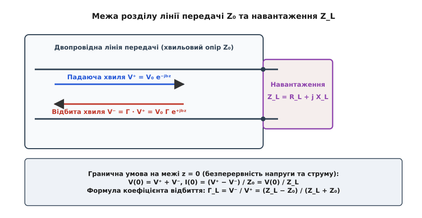
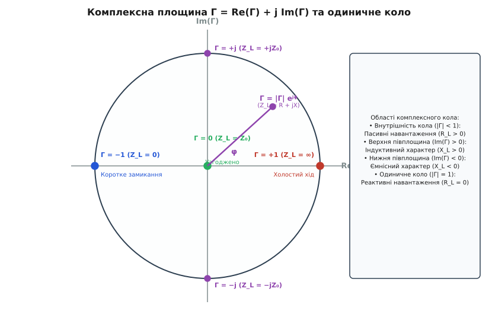
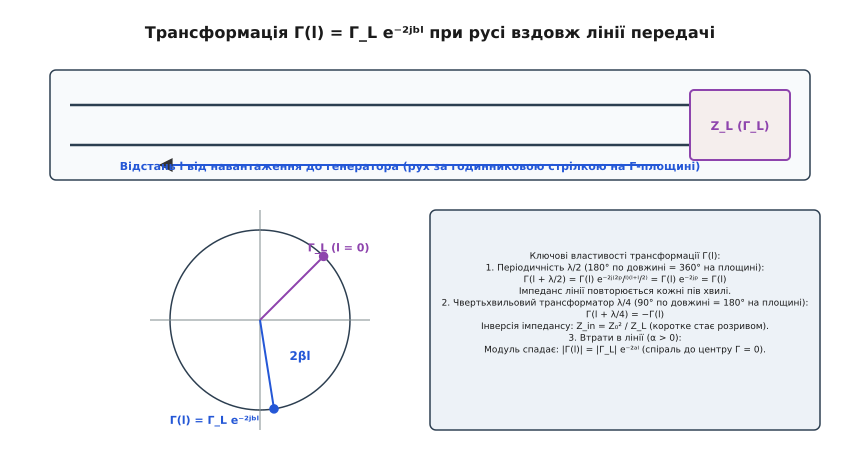
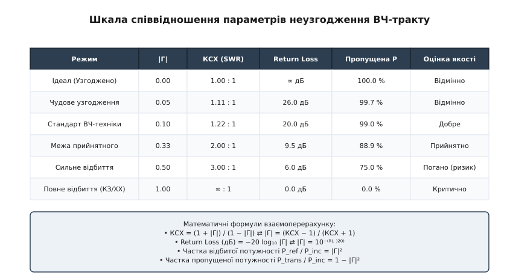

# Коефіцієнт відбиття

<preknowlist>
- [Лінії передачі](book:communications/transmission-lines) — хвильовий опір Z₀, поширення електромагнітних хвиль та розподілені параметри провідників.
- [Відбиття й КСХ](book:communications/vswr) — виникнення стоячих хвиль, співвідношення між напругами та передача потужності.
- [Втрати на відбиття](book:communications/return-loss) — логарифмічний мірник неузгодження в децибелах (Return Loss, S₁₁).
</preknowlist>

Коли високочастотний передавач потужністю 100 Вт відправляє сигнал у 50-омний коаксіальний кабель, а на кінці кабелю підключено антену з опором 150 Ом, вся випромінена енергія не може безперешкодно увійти в антену. На межі стику виникає стрибок імпедансу, і 25 Вт високочастотної потужності розвертаються та біжать зворотним шляхом прямо у вихідні транзистори підсилювача. Щоб обчислити, яка саме частина хвилі відіб'ється, якою буде її фаза та як вона трансформується вздовж кабелю, в електродинаміці використовують фундаментальну величину — **комплексний коефіцієнт відбиття** (позначається грецькою літерою `Γ`, Гамма).

### Фізична природа відбиття на межі двох середовищ

Електромагнітна хвиля, що поширюється вздовж лінії передачі, являє собою гармонійний зв'язок між векторним електричним полем `E` (яке створює різницю потенціалів або напругу `V` між провідниками) та магнітним полем `H` (яке формується протікаючим струмом `I`). У будь-якій точці однорідної лінії без відбиттів відношення комплексної амплітуди напруги біжучої падаючої хвилі `V⁺` до комплексної амплітуди її струму `I⁺` жорстко зафіксоване конструкцією самої лінії передачі:

```
V⁺ / I⁺ = Z₀ = √(L / C)
```

де `L` — погонна індуктивність провідників (Гн/м), `C` — погонна ємність діелектрика (Ф/м), а `Z₀` — хвильовий опір лінії (Ом). Поширення хвилі відбувається зі скінченною фазовою швидкістю `v_p = 1 / √(LC)`. Співвідношення між напругою та струмом падаючої хвилі визначається виключно геометрією провідників та діелектричною проникністю середовища.


*Гранична умова на межі з'єднання лінії передачі та навантаження. Якщо Z_L ≠ Z₀, падаюча хвиля V⁺ не може задовольнити закон Ома самостійно, що викликає виникнення відбитої хвилі V⁻. Коефіцієнт відбиття Γ дорівнює відношенню V⁻ до V⁺.*

Коли падаюча хвиля досягає кінця лінії та впирається в навантаження з імпедансом `Z_L`, вона зіштовхується з граничними умовами Максвелла. Згідно із фундаментальними законами електродинаміки, тангенціальні компоненти векторів напруженості електричного поля `E` та магнітного поля `H` на межі розділу мають бути безперервними. У термінах теорії кіл це означає, що повна напруга `V(0)` та повний струм `I(0)` у точці стику мають підпорядковуватися закону Ома для навантаження:

```
V(0) / I(0) = Z_L
```

Якщо імпеданс навантаження `Z_L` не дорівнює хвильовому опору лінії `Z₀`, виникає фізична суперечність: падаюча хвиля `V⁺` зі своїм власне сформованим співвідношенням напруги та струму `V⁺ / I⁺ = Z₀` не може самостійно задовольнити закон Ома для навантаження `Z_L`.

Мікроскопічний механізм цього явища полягає у швидкому перерозподілі поверхневих зарядів на межі провідників. Електричне поле падаючої хвилі наводить у навантаженні струм, який через відмінність опору `Z_L ≠ Z₀` створює надлишковий (або недостатній) заряд у точці стику. Цей накопичений заряд стає вторинним джерелом електромагнітного випромінювання, яке направляється назад у лінію.

Лінія передачі реагує на цей дисбаланс єдино можливим способом — у точці стику породжується вторинна, відбита електромагнітна хвиля `V⁻`, яка біжить у зворотному напрямку до джерела сигналу.

Повна напруга `V(z)` та повний струм `I(z)` у точці навантаження `z = 0` стають суперпозицією (векторною сумою) двох хвиль:

```
V(0) = V⁺ + V⁻
I(0) = I⁺ − I⁻ = (V⁺ − V⁻) / Z₀
```

Зверніть увагу на знак мінус у виразі для струму: оскільки відбита хвиля поширюється у зворотному напрямку, вектор вектора Пойнтінга відбитої хвилі спрямований назад, що відповідає зворотному напрямку протікання відбитого струму `I⁻`.

За фундаментальним визначенням, **комплексний коефіцієнт відбиття** `Γ` (Гамма) — це відношення комплексної амплітуди відбитої хвилі напруги `V⁻` до комплексної амплітуди падаючої хвилі `V⁺` у точці відбиття:

```
Γ = V⁻ / V⁺
```

Коефіцієнт відбиття є комплексною величиною, оскільки відбита хвиля може мати не лише іншу амплітуду, але й зсув по фазі відносно падаючої хвилі.

Детальніше про те, як Олівер Хевісайд відкрив хвильове відбиття у телеграфних кабелях та як розвивалася вимірювальна техніка ВЧ-діапазону, описано в [історії дослідження відбиття у телеграфних лініях Хевісайда та розробці діаграми Сміта](book:communications/reflection-coefficient/hist-reflection-coefficient.md).

### Математична формула та аналіз характерних режимів

Підставляючи вирази сумарної напруги `V(0) = V⁺ + V⁻` та сумарного струму `I(0) = (V⁺ − V⁻) / Z₀` в закон Ома для навантаження `V(0) / I(0) = Z_L`, ми виводимо базову формулу коефіцієнта відбиття навантаження `Γ_L`:

```
Z_L = (V⁺ + V⁻) / [ (V⁺ − V⁻) / Z₀ ] = Z₀ · (V⁺ + V⁻) / (V⁺ − V⁻)
```

Поділивши чисельник і знаменник на `V⁺` та підставивши `Γ_L = V⁻ / V⁺`, отримуємо рівняння:

```
Z_L = Z₀ · (1 + Γ_L) / (1 − Γ_L)
```

Розв'язавши це рівняння відносно `Γ_L`, маємо канонічну алгебраїчну формулу:

```
Γ_L = (Z_L − Z₀) / (Z_L + Z₀)
```

Ця формула є однією з найважливіших у радіоінженерії. Вона показує, що коефіцієнт відбиття повністю визначається відносним стрибком імпедансу між навантаженням `Z_L` та лінією `Z₀`. Розглянемо п'ять характерних фізичних режимів роботи ВЧ-тракту.

#### 1. Ідеально узгоджене навантаження (`Z_L = Z₀`)

Якщо опір навантаження точно дорівнює хвильовому опору лінії (`Z_L = Z₀`), чисельник формули перетворюється на нуль:

```
Γ_L = (Z₀ − Z₀) / (Z₀ + Z₀) = 0 / (2 Z₀) = 0
```

Відбита хвиля повністю відсутня (`V⁻ = 0`). Вектор Пойнтінга падаючої хвилі повністю поглинається активним опором навантаження (або випромінюється у вільний простір антеною). У лінії відсутні стоячі хвилі, а амплітуда напруги вздовж усієї лінії залишається абсолютно постійною. Це ідеальний стан радіотракту, до якого прагнуть при проектуванні будь-яких ВЧ-систем.

#### 2. Ідеальний розрив / холостий хід (`Z_L = ∞`)

У разі розімкненого кінця лінії спрямуємо `Z_L` до нескінченності:

```
Γ_L = lim_{Z_L → ∞} (Z_L − Z₀) / (Z_L + Z₀) = +1 = 1 · e⁺ʲ ⁰°
```

Модуль коефіцієнта відбиття дорівнює одиниці (`|Γ| = 1`), а фазовий кут дорівнює `0°`. Це означає, що **вся** падаюча хвиля відбивається назад без зміни фази. 

Фізика процесу: на розімкненому кінці струм не може протікати у порожнечу, тому струм відбитої хвилі інвертується й повністю гасить струм падаючої хвилі (`I(0) = I⁺ − I⁺ = 0`). Водночас напруги двох хвиль складаються в фазі, створюючи на розриві подвійну амплітуду напруги: `V(0) = V⁺ + V⁺ = 2 V⁺`.

#### 3. Ідеальне коротке замикання (`Z_L = 0`)

Підставимо нульовий опір навантаження:

```
Γ_L = (0 − Z₀) / (0 + Z₀) = −Z₀ / Z₀ = −1 = 1 · e⁺ʲ ¹⁸⁰°
```

Модуль дорівнює одиниці (`|Γ| = 1`), а знак мінус означає інверсію фази хвилі напруги на `180°` (`e⁺ʲ ᵖ`). 

Фізика процесу: на ідеальному провіднику з нульовим опором напруга принципово не може існувати, тому відбита хвиля напруги повертається з протилежним знаком, гасячи падаючу напругу до нуля (`V(0) = V⁺ − V⁺ = 0`). Водночас струми падаючої та відбитої хвиль складаються в фазі, підвоюючи сумарний струм у точці короткого замикання: `I(0) = I⁺ + I⁺ = 2 I⁺`.

#### 4. Чисто реактивне навантаження (`Z_L = j X_L`)

Якщо навантаження містить лише ідеальну індуктивність або ємність без активного опору втрат (`R_L = 0`), підставимо `Z_L = j X_L`:

```
Γ_L = (j X_L − Z₀) / (j X_L + Z₀)
```

Обчислимо модуль та фазу цього комплексного числа:

```
|Γ_L| = √(X_L² + Z₀²) / √(X_L² + Z₀²) = 1
φ = arctan2(X_L, −Z₀) − arctan2(X_L, Z₀) = π − 2 · arctan(X_L / Z₀)
```

Для будь-якого чисто реактивного навантаження модуль `|Γ|` завжди дорівнює **точно одиниці**. Реактивний елемент (конденсатор чи котушка) за період накопичує енергію в електричному чи магнітному полі й повністю віддає її назад у лінію, не розсіюючи жодного вата активної потужності. Проте фазовий кут відбитої хвилі `φ` залежить від величини та знаку реактивності `X_L`:
- Для індуктивного навантаження (`X_L > 0`) фаза `φ` лежить у верхній півплощині від `0°` до `+180°`;
- Для ємнісного навантаження (`X_L < 0`) фаза `φ` лежить у нижній півплощині від `0°` до `−180°`.

#### 5. Комплексне пасивне навантаження (`Z_L = R_L + j X_L` при `R_L > 0`)

У цьому найзагальнішому реальному випадку модуль коефіцієнта відбиття лежить у межах `0 < |Γ| < 1`. Частина енергії падаючої хвилі поглинається активним опором `R_L`, а решта відбивається назад з відповідним фазовим зсувом `φ`.

Строге математичне виведення систем рівнянь та векторних формул деталізовано в [повному математичному виводі коефіцієнта відбиття та хвильових трансформацій](book:communications/reflection-coefficient/math-gamma-derivation.md).

### Комплексна природа Гамми та площина коефіцієнта відбиття

У загальному випадку коефіцієнт відбиття є комплексним числом і записується в алгебраїчній або показниковій (полярній) формі:

```
Γ = Γ_r + j Γ_i = |Γ| · e⁺ʲ ᶲ
```

де `Γ_r` — дійсна частина, `Γ_i` — уявна частина, `|Γ| = √(Γ_r² + Γ_i²)` — модуль (амплітудне відношення відбитої хвилі до падаючої), а `φ = arctan2(Γ_i, Γ_r)` — фазовий зсув відбитої хвилі відносно падаючої в точці відбиття.


*Комплексна площина коефіцієнта відбиття Γ. Всі пасивні імпеданси з додатним активним опором R_L ≥ 0 відображаються всередину одиничного кола |Γ| ≤ 1. Центр відповідає ідеальному узгодженню (Γ = 0).*

На комплексній площині з осями `Re(Γ)` та `Im(Γ)` всі можливі пасивні навантаження (у яких активний опір `R_L ≥ 0`) відображаються **всередину замкненого одиничного кола** з радіусом `|Γ| ≤ 1`:
- **Центр кола (`Γ = 0 + j 0`):** точний збіг опору з хвильовим (`Z_L = Z₀`), відбиття відсутнє;
- **Правий край (`Γ = +1 + j 0`):** розрив лінії (`Z_L = ∞`);
- **Лівий край (`Γ = −1 + j 0`):** коротке замикання (`Z_L = 0`);
- **Верхня півплощина (`Im(Γ) > 0`):** навантаження має індуктивний характер (`X_L > 0`);
- **Нижня півплощина (`Im(Γ) < 0`):** навантаження має ємнісний характер (`X_L < 0`);
- **Зовнішнє коло (`|Γ| = 1`):** чисто реактивні навантаження без втрат (`R_L = 0`).

Якщо модуль перевищує одиницю (`|Γ| > 1`), це означає, що відбита хвиля має більшу амплітуду, ніж падаюча (`V⁻ > V⁺`). У пасивних кола це фізично неможливо, оскільки суперечить закону збереження енергії. Проте це виникає в активних схемах — наприклад, у підсилювачах з від'ємним опором (тунельні діоди, лавинно-пролітні діоди) або при виникненні самозбудження й генерації в ВЧ-каскадах. На площині `Γ` такі активні режими лежать за межами одиничного кола.

Математичне перетворення між нормованим імпедансом `z_L = Z_L / Z₀` та комплексною `Γ` являє собою конформне білінійне перетворення:

```
Γ = (z_L − 1) / (z_L + 1)   ⇄   z_L = (1 + Γ) / (1 − Γ)
```

Саме це перетворення покладено в основу [Діаграми Сміта](book:communications/smith-chart), де сітка ортогональних кіл активного та реактивного опорів накладена прямо на комплексну площину `Γ`.

### Трансформація коефіцієнта відбиття вздовж лінії передачі

Коли ми переміщуємося від точки підключення навантаження `z = 0` вглиб лінії передачі до джерела сигналу на відстань `l` (тобто в точку `z = −l`), падаюча хвиля долає шлях `l` уперед, а відбита хвиля долає шлях `l` назад. 

Сумарна фазова затримка відбитої хвилі відносно падаючої складає `2 β l`, де `β = 2π / λ` — фазова стала лінії.


*Трансформація коефіцієнта відбиття Γ(l) при русі вздовж лінії передачі на відстань l до генератора. Модуль |Γ| залишається незмінним, а вектор Γ(l) обертається за годинниковою стрілкою на кут 2βl.*

Математично коефіцієнт відбиття в точці лінії на відстані `l` від навантаження виражається формулою:

```
Γ(l) = Γ_L · e⁻²ʲᵇˡ = |Γ_L| · e⁺ʲ ⁽ᶲ ⁻ ²ᵇˡ⁾
```

З цієї формули випливають три фундаментальні правила ВЧ-техніки:

#### 1. Рух по лінії відповідає обертанню за годинниковою стрілкою
При віддаленні від навантаження до генератора вектор `Γ(l)` обертається на комплексній площині **за годинниковою стрілкою** на кут `2 β l`. Модуль `|Γ(l)|` при цьому залишається абсолютно незмінним (у лінії без втрат).

#### 2. Просторова періодичність у півхвилі (`λ / 2`)
Зсув уздовж лінії на відстань `l = λ / 2` відповідає фазовому повороту вектора `Γ` на кут:

```
Δφ = 2 · (2π / λ) · (λ / 2) = 2π  (360°)
```

Повний поворот на 360° повертає вектор `Γ` у вихідну точку. Це означає, що **вхідний імпеданс лінії передачі без втрат точно повторюється кожні півхвилі**: `Z_in(l + λ/2) = Z_in(l)`. Напівхвильовий відрізок кабелю працює як «повторювач імпедансу» 1:1 на даній частоті.

#### 3. Інверсія імпедансу на чверті хвилі (`λ / 4`)
Зсув уздовж лінії на відстань `l = λ / 4` відповідає повороту вектора `Γ` на кут `Δφ = π` (180°):

```
Γ(l + λ/4) = Γ(l) · e⁻ʲᵖ = −Γ(l)
```

Зміна знака `Γ` на протилежний перетворює високий імпеданс на низький і навпаки. Підставляючи `−Γ_L` у формулу імпедансу, отримуємо відоме співвідношення для **чвертьхвильового трансформатора**:

```
Z_in = Z₀² / Z_L
```

Завдяки цьому закону відрізок лінії довжиною `λ/4`, замкнений на кінці накоротко (`Z_L = 0`), на вході поводиться як паралельний резонансний контур з нескінченним опором (`Z_in = ∞`, розрив). Навпаки, розімкнений `λ/4` шлейф на вході стає коротким замиканням (`Z_in = 0`).

Якщо лінія має згасання (`α > 0`), комплексний коефіцієнт поширення дорівнює `γ = α + j β`. Тоді амплітуда відбитої хвилі згасає при русі до джерела:

```
|Γ(l)| = |Γ_L| · e⁻²ᵃˡ
```

На комплексній площині траєкторія `Γ(l)` перетворюється зі звичайного кола на **спіраль, що скручується до центру** `Γ = 0`. Довгий кабель із великим згасанням на вході завжди має низький коефіцієнт відбиття, навіть якщо на його дальньому кінці взагалі немає антени (відбита хвиля згасає дорогою назад і не повертається до джерела).

### Окремі випадки навантажень: трансформатори й узгоджувальні шлейфи

На практиці інженери використовують властивості трансформації `Γ` для створення пасивних ВЧ-компонентів без використання дискретних конденсаторів чи котушок.

#### Шлейфове узгодження (Stub Tuning)
Якщо до лінії передачі паралельно підключити незамкнений або закорочений відрізок лінії (шлейф) довжиною `l_s`, цей шлейф додає паралельну реактивну провідність `j B`. Регулюючи довжину шлейфа `l_s` та точку його підключення від навантаження `d`, можна компенсувати уявну частину коефіцієнта відбиття `Im(Γ)` і загнати сумарний імпеданс точно в точку `Γ = 0`.

- **Одношлейфове узгодження:** дозволяє узгодити будь-яке навантаження `Z_L` з лінією `Z₀` за допомогою одного шлейфа регульованої довжини `l_s` та зміщуваної позиції `d`.
- **Двошлейфове узгодження:** використовує два шлейфи з фіксованою відстанню між ними (наприклад, `λ/8` або `3λ/8`), де регулюються лише довжини самих шлейфів. Це значно зручніше у друкованому виконанні на платах, де позиція підключення жорстко розведена меандрами.

#### Східчасті чвертьхвильові трансформатори
Для розширення робочої смуги частот узгодження замість одного `λ/4` трансформатора застосовують каскадне з'єднання кількох відрізків ліній із різними хвильовими опорами `Z₀₁, Z₀₂, Z₀₃`. За рахунок підбору опорів за біноміальним розподілом або розподілом Чебишова відбиті хвилі від кожного стику взаємно гасять одна одну в широкій смузі частот, утворюючи смуговий фідерний трансформатор.

#### Дільники потужності Уілкінсона
Дільник Уілкінсона складається з двох чвертьхвильових ліній із хвильовим опором `√2 Z₀` та розв'язувального резистора `2 Z₀` між вихідними портами. При виході сигналів у фазі відбиття відсутнє (`Γ = 0`), а в разі неузгодження на виходах відбита потужність розсіюється на розв'язувальному резисторі, забезпечуючи високу ізоляцію між каналами.

### Частотна залежність та смуга узгодження (Межа Фано-Боде)

Коефіцієнт відбиття `Γ` завжди залежить від частоти `f`, оскільки реактивний опір навантаження `X_L(f)` та фазова довжина лінії `β(f) · l` є функціями частоти. 

Ширина смуги частот `Δf`, у межах якої модуль коефіцієнта відбиття не перевищує заданого порогу (наприклад, `|Γ| ≤ 0.33` або `RL ≥ 9.5 дБ`), визначається добротністю навантаження `Q`.

Фундаментальне фізичне обмеження на ширину смуги узгодження описується **теоремою Фано-Боде**:

```
∫₀^∞ ln(1 / |Γ(ω)|) dω ≤ π / (R_L · C_L)
```

Цей інтеграл показує, що площа під кривою відбиття в логарифмічному масштабі є обмеженою константою, яка визначається лише добутком активного опору та ємності навантаження `R_L · C_L`. Якщо ми хочемо отримати дуже глибоке узгодження (`|Γ| → 0`) на одній частоті, смуга частот `Δf` неминуче звузиться. І навпаки: розширення смуги зв'язку неминуче вимагає компромісу з погіршенням мінімального коефіцієнта відбиття.

### Зв'язок із КСХ, Втратами на відбиття ($RL$) та енергетикою лінії

Коефіцієнт відбиття `Γ` є первинною комплексною величиною. У практичній радіоінженерії з нього виводять три інші скалярні параметри, кожен з яких зручний у своїй області застосування.


*Співвідношення між модулем коефіцієнта відбиття |Γ|, КСХ (SWR), втратами на відбиття (Return Loss) та відсотком потужності, що передається в навантаження.*

#### 1. Коефіцієнт стоячої хвилі (КСХ / SWR)
Показує відношення максимуму амплітуди напруги стоячої хвилі `V_max` до її мінімуму `V_min` вздовж лінії. КСХ залежить **виключно від модуля** `|Γ|`:

```
КСХ = (1 + |Γ|) / (1 − |Γ|)   ⇄   |Γ| = (КСХ − 1) / (КСХ + 1)
```

Детальніше інтерпретація КСХ та вимірювання за допомогою антенних аналізаторів описані в статті про [Відбиття й КСХ](book:communications/vswr).

#### 2. Втрати на відбиття (Return Loss, $RL$)
Це логарифмічне вираження модуля коефіцієнта відбиття в децибелах, яке показує, накільки відбита хвиля слабша за падаючу:

```
RL (дБ) = −20 · log₁₀ |Γ|   ⇄   |Γ| = 10⁻⁽ᴿᴸ ⁾²⁰⁾
```

Що менше відбиття, то вище значення `RL` у децибелах. Значення `RL = 20 дБ` відповідає `|Γ| = 0.1` (відбивається лише 1% потужності). Повний опис логарифмічних осей та S-параметра `S₁₁` подано у статті про [Втрати на відбиття](book:communications/return-loss).

#### 3. Частка переданої та відбитої потужності
Потужність електромагнітної хвилі пропорційна квадрату амплітуди напруги. Тому частка відбитої потужності дорівнює `|Γ|²`, а частка потужності, переданої в навантаження, складає `1 − |Γ|²`:

```
P_ref / P_inc = |Γ|²
P_load / P_inc = 1 − |Γ|²
```

Втрати на неузгодженні (*Mismatch Loss*, `ML`) описують послаблення сигналу в децибелах суто через відбиття:

```
ML (дБ) = −10 · log₁₀ (1 − |Γ|²)
```

Для швидкого програмного розрахунку всіх цих параметрів на мовах C, C++ та Python створено [програмний розрахунок комплексного коефіцієнта відбиття та лінійних параметрів ВЧ-тракту](book:communications/reflection-coefficient/proj-gamma-calculator.md).

### Вимірювання коефіцієнта відбиття на практиці: від містків до VNA

У реальних радіотехнічних лабораторіях для вимірювання комплексного `Γ` використовують прилади двох типів: скалярні аналізатори (вимірюють лише модуль `|Γ|` або КСХ) та векторні аналізатори кіл (VNA, вимірюють і модуль `|Γ|`, і фазу `φ`).

Фізичне розділення падаючої та відбитої хвиль виконується за допомогою високочастотних **резистивних містків** або **спрямованих відгалужувачів** (*Directional Couplers*).

```
Генератор ВЧ ──► [ Спрямований відгалужувач ] ──► Навантаження (Z_L)
                      │             │
               Падаюча (a₁)   Відбита (b₁)
                      │             │
                      ▼             ▼
              [ Векторний приймач VNA ] ──► S₁₁ = b₁ / a₁ = Γ_in
```

Векторний аналізатор оцифровує обидва сигнали, обчислюючи комплексний параметр розсіяння `S₁₁ = b₁ / a₁`, який за визначенням дорівнює вхідному коефіцієнту відбиття `Γ_in`.

Для виключення власних втрат вимірювальних кабелів та паразитних відбиттів у роз'ємах перед кожною серією вимірювань проводять двопортове калібрування за методом **SOLT** (*Short-Open-Load-Through*). Калібрування переносить опорну площину вимірювання `Γ` безпосередньо на кінчик кабелю.

Конструкція спрямованих відгалужувачів, містків та алгоритми SOLT-калібрування докладно розібрані в [принципі роботи спрямованих відгалужувачів, вимірювальних містків та калібруванні VNA](book:communications/reflection-coefficient/comp-directional-coupler.md).

> 🔧 **Навіщо це.**
> Розуміння комплексного коефіцієнта відбиття `Γ` — це головний інструмент інженера-розробника ВЧ-апаратури. Без знання фази `Γ` неможливо спроектувати узгоджувальне коло для транзистора підсилювача потужності: два навантаження з однаковим КСХ = 2.0 (`Z₁ = 100 Ом` та `Z₂ = 25 + j 0 Ом`) вимагають діаметрально протилежних узгоджувальних кіл. Для першого потрібно додати паралельну ємність, а для другого — послідовну індуктивність. Саме комплексне значення `Γ` вказує точний напрямок та величину елементів узгодження.

### Практичні наслідки для ВЧ-проєктування й підсилювачів потужності

Неузгодження імпедансу та виникнення відбитої хвилі мають три критичні практичні наслідки у радіоінженерії.

#### 1. Перегрів та руйнування вихідних транзисторів (PA)
У потужних передавачах (радіостанції, радари, ДРОН-передавачі) відбита хвиля `V⁻` повертається у вихідний каскад підсилювача потужності. Ця енергія не випромінюється в простір, а виділяється у вигляді тепла на кристалі вихідного транзистора. При високому КСХ (більше 3:1 або 5:1) амплітуди падаючої та відбитої напруг можуть скластися у пучності, викликавши пробій затвора/колектора за напругою, або перегріти кристалик до термічного руйнування.

#### 2. Залежність лінії навантаження від довжини кабелю
Оскільки коефіцієнт відбиття `Γ(l)` обертається вздовж лінії, опір, який «бачить» підсилювач, залежить від довжини кабелю між підсилювачем та антенною. Зміна довжини кабелю на кілька сантиметрів на частоті 2.4 ГГц може перетворити оптимізоване навантаження підсилювача на високореактивну точку, викликавши падіння ККД або вихід підсилювача в режим автоколивань (самозбудження).

#### 3. Нелінійне відбиття великого сигналу (Large-Signal Γ)
У високопотужних підсилювачах класів C, E та F імпеданс транзистора змінюється впродовж періоду високочастотного сигналу. У цьому разі коефіцієнт відбиття стає функцією амплітуди `Γ(P_in)`. Для оптимізації ККД інженери розраховують окремі коефіцієнти відбиття на основній частоті `Γ(ω₀)`, другій гармоніці `Γ(2ω₀)` та третій гармоніці `Γ(3ω₀)`.

#### 4. Часова рефлектометрія (TDR)
Вимірювання `Γ` у широкій смузі частот дозволяє за допомогою зворотного перетворення Фур'є перейти у часову область (*Time-Domain Reflectometry*, TDR). Аналізатор TDR подає в лінію короткий перепад напруги та реєструє відбиття від кожного зламу доріжки, перехідного отвору або пошкодження кабелю. По затримці відбитого імпульсу визначають точну відстань до дефекту, а по знаку та формі `Γ(t)` — тип несправності (обрив `Γ = +1`, коротке замикання `Γ = −1` чи ємнісна завада `Γ < 0`).
