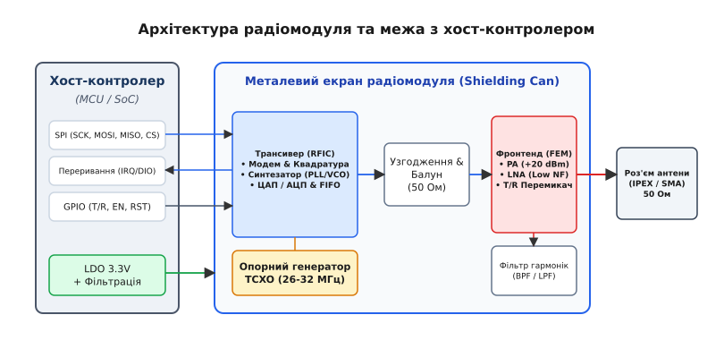
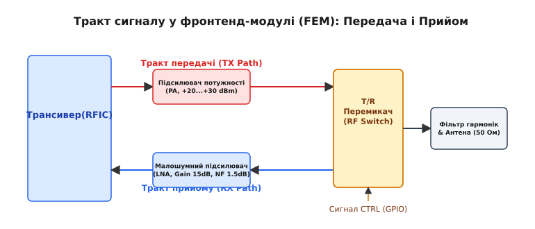
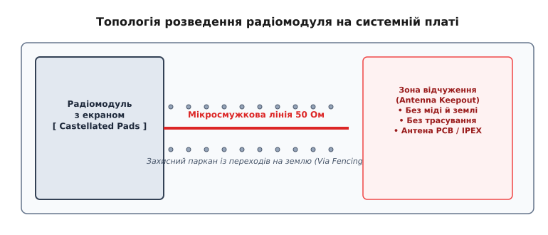

# Радіомодуль

<preknowlist>
- [Лінії передачі](topic:communications/transmission-lines) — хвильовий опір 50 Ом, мікросмужки та узгодження ліній зв'язку.
- [Супергетеродин](topic:communications/superheterodyne) — принципи переносу частоти, гетеродин, змішувачі та проміжна частота.
- [Потужність і децибели](topic:communications/power-decibels) — логарифмічна шкала дБм, вимірювання потужності та коефіцієнта підсилення.
- [Відбиття і КСХ](topic:communications/vswr) — коефіцієнт відбиття, стояча хвиля та зворотні втрати.
</preknowlist>

Налаштування високочастотного тракту на друкованій платі здатне перетворити серійне виготовлення електроніки на непередбачувану лотерею. Найменша похилка в ширині мікросмужкової лінії, незначний зсув ємності конденсатора узгоджувального ланцюга чи шум імпульсного джерела живлення перетворюють підсилювач потужності на генератор паразитного випромінювання та знижують чутливість приймача на десятки децибел. Розробник змушений не лише розраховувати мікросмужкові лінії й імпеданси в 50 Ом, а й забезпечувати термостабільність опорної частоти та проходити піврічні випробування на відповідність міжнародним стандартам радіовипромінювання. Вузол, який повністю ізолює цей комплекс фізичних, схемотехнічних та регуляторних проблем від основної системи, постає у вигляді **радіомодуля** (RF module).

### Межа між цифрою та ВЧ-фізикою

Розробка високочастотної частини на дискретних компонентах безпосередньо на материнській платі пристрою (так звана концепція chip-on-board) вимагає глибокого розуміння радіотехніки. Склотекстоліт стандарту FR-4, з якого виготовляють більшість друкованих плат, має діелектричну проникність `ε_r ≈ 4.2…4.5`, яка змінюється від партії до партії та залежить від температури й вологості. Якщо доріжка від виходу трансивера до антени має відхилення по ширині всього в 0.2 мм, її хвильовий опір зміщується з розрахункових 50 Ом до 60–65 Ом. Це викликає [відбиття хвилі й високий КСХ](topic:communications/vswr), через що значна частина випромінюваної потужності повертається назад і розсіюється у вигляді тепла на вихідному каскаді.

Паразитні ємності та індуктивності виводів дискретних корпусів на частотах понад 800 МГц створюють непередбачувані резонанси. Наприклад, звичайний чип-конденсатор розміру 0603 номіналом 10 пФ на частоті 2.4 ГГц через власну паразитну індуктивність виводів перетворюється на котушку індуктивності, повністю втрачаючи свої фільтрувальні властивості. Будь-яка вимірювальна або узгоджувальна маніпуляція вимагає наявності дорогих векторних аналізаторів кіл (VNA), безлунових камер та спеціалізованого програмного забезпечення для моделювання електромагнітних полів.

Радіомодуль переносить усю цю складність всередину окремого суцільного субблока. Він являє собою закончену друковану плату (або керамічну підкладку), на якій уже змонтовано трансиверний чіп, високоточні пасивні компоненти узгодження, підсилювачі, фільтри гармонік та опорний кварцовий генератор.


*Архітектура радіомодуля. Металевий екран (Shielding Can) ізолює ВЧ-тракт від зовнішніх завад. Чіткий кордон розподілу: цифровий інтерфейс (SPI/UART, IRQ) з боку мікроконтролера та узгоджений 50-омний порт антени з іншого.*

Головний здобуток такої архітектури — чіткий кордон відповідальності:
1. **З боку хост-контролера (MCU)** радіомодуль виглядає як звичайна цифрова периферія. Спілкування відбувається через стандартні послідовні шини (SPI або UART) за допомогою низьковольтних логічних рівнів (1.8 В або 3.3 В). Мікроконтролеру не потрібно знати, як влаштована високочастотна модуляція чи синтез частоти — він просто записує пакунок байтів у FIFO-буфер модуля й дає команду на відправку.
2. **З боку антени** радіомодуль надає один узгоджений високочастотний вихід із хвильовим опором точно 50 Ом (роз'єм IPEX/U.FL, SMA або вивід під контактну площадку).

Другий критичний фактор на користь радіомодулів — **модульна сертифікація**. Проходження випробувань на електромагнітну сумісність (EMC) та отримання сертифікатів FCC (США), CE (Європа) чи RED у спеціалізованих акредитованих лабораторіях коштує десятки тисяч доларів і триває місяцями. Застосування попередньо сертифікованого радіомодуля дозволяє виробнику кінцевого приладу уникнути повторного тестування самого радіовипромінювача: випробуванням піддається лише загальна безпека пристрою.

Про те, як радіочастотні блоки пройшли шлях від важких сталевих коробок телевізійних тюнерів 1950-х років до сучасних керамічних збірок LTCC та систем у корпусі (SiP), детально описано у вставці [📜 Історія радіомодулів](topic:communications/rf-module/hist-rf-modularization.md).

---

### Анатомія та внутрішня структура радіомодуля

Щоб зрозуміти, як радіомодуль перетворює потік цифрових бітів на електромагнітну хвилю у просторі, розглянемо його внутрішні функціональні блоки вздовж тракту проходження сигналу.

#### 1. Інтегральний трансивер (RFIC)
Серцем будь-якого радіомодуля є ВЧ-мікросхема (RF Integrated Circuit). У ній інтегровано:
- **Цифровий модем**: здійснює кодування пакунків, формування преамбули, обчислення контрольних сум [CRC](topic:communications/crc) та безпосередню модуляцію (FSK, PSK, QAM або LoRa).
- **Синтезатор частоти**: містить коло фазової автопідстройки частоти (PLL) та керований напругою генератор (VCO), які генерують високочастотну несучу на основі опорного сигналу.
- **Квадратурний змішувач (I/Q Mixer)**: здійснює пряме або [супергетеродинне перетворення](topic:communications/superheterodyne) частоти з базової аналогової форми в радіочастотний діапазон (і навпаки при прийомі).
- **Буфери FIFO**: внутрішня оперативна пам'ять (зазвичай від 64 до 256 байтів), яка накопичує дані перед відправкою або під час прийому, звільняючи хост-контролер від жестких вимог реального часу.

#### 2. Балун та узгоджувальна мережа (Matching Network)
Виходи підсилювача трансиверного чіпа частіше за все роблять **диференційними** (симетричними) для придушення спільних наводок всередині кристала. Опір цих виходів є комплексним і різниться для передавальної та приймальної гілок (наприклад, `Z_out = 15 + j25` Ом). Антена ж та лінія передачі вимагають **несиметричного 50-омного** сигналу.

Для адаптації використовується **балун** (BALanced-to-UNbalanced transformer) або узгоджувальна LC-мережа (Pi- або T-подібні ланцюги з прецизійних індуктивностей та конденсаторів із допуском 1–2%). Основне завдання цієї мережі — забезпечити максимальну передачу потужності (сопряжене імпедансне узгодження) та трансформувати симетричний сигнал у 50 Ом відносно спільної землі.

#### 3. Фронтенд-модуль (FEM: PA, LNA та T/R Switch)
У малопотужних радіомодулях (наприклад, для Bluetooth на відстані до 10 метрів) виходу самого RFIC вистачає для прямої роботи з антеною. Проте для передачі на кілометри (промислова телеметрія, зв'язок "земля-борт", LoRaWAN) у модуль вбудовують додатковий **фронтенд-модуль** (Front-End Module, FEM).


*Тракт сигналу у фронтенд-модулі (FEM). Під час передачі перемикач T/R Switch спрямовує підсилений сигнал від PA до антени. Під час прийому слабкий сигнал з антени іде на малошумний підсилювач LNA.*

Фронтенд об'єднує три ключові елементи:
- **Підсилювач потужності (PA, Power Amplifier)**: піднімає рівень вихідного сигналу від стандартних `0…+5 дБм` (1–3 мВт) до `+20…+30 дБм` (100 мВт – 1 Вт).
- **Малошумний підсилювач (LNA, Low-Noise Amplifier)**: підсилює надзвичайно слабкий вхідний сигнал з антени (рівня `−110…−130 дБм`), додаючи мінімум власного шуму (коефіцієнт шуму `NF ≈ 1.2…1.8 дБ`).
- **Перемикач прийом/передача (T/R Switch)**: високочастотний швидкодіючий ключовий елемент (SPDT-перемикач на PIN-діодах або GaAs pHEMT транзисторах). Оскільки передавач і приймач працюють на одну антену, T/R перемикач під час передачі надійно ізолює чутливий вхід LNA від виходу потужного PA. Без цієї ізоляції потужний вихідний сигнал (+30 дБм) миттєво спалить вхідні транзистори LNA, розраховані максимум на `+10 дБм`.

#### 4. Опорний генератор (XTAL проти TCXO)
Будь-який радіомодуль потребує джерела базової частоти. Від його стабільності залежить точність роботи синтезатора частоти PLL. На вибір пропонується два варіанти:
- **Пасивний кварцовий резонатор (XTAL)**: дешевий компонент, проте його частота відчутно пливе від температури (відхилення до `±30…±50 ppm`).
- **Термокомпенсований кварцовий генератор (TCXO)**: активний мікромодуль із датчиком температури та схемою компенсації, який утримує нестабільність частоти у вузьких межах `±0.5…±2 ppm`.

Для широкосмугових протоколів (Wi-Fi з шириною каналу 20 МГц) зсув частоти на 20 кГц неприємний, але не смертельний. Проте у вузькосмугових системах (FSK 12.5 кГц) чи дальньому зв'язку LoRa на високих коефіцієнтах розширення (SF12), де смуга чирпа складає 125 кГц, температурний дрейф звичайного XTAL викликає повне розривання лінку. Зсув частоти перевищує допустимий поріг декодера, і приймач перестає "бачити" преамбулу. Докладне порівняння параметрів, характеристик фазового шуму та рекомендацій щодо застосування кварців наведено у вставці [🔌 Опорні кварцові генератори](topic:communications/rf-module/comp-tcxo-reference.md).

#### 5. Металевий екран та фільтрація живлення
Завершальний штрих апаратури модулів — металевий екранний капот (Shielding Can) та розв'язка джерел живлення. Металева кришка закриває весь ВЧ-тракт, виконуючи дві ролі:
1. Захищає чутливий приймач (LNA та змішувач) від наведень з боку зовнішніх імпульсних джерел живлення, дисплеїв та цифрових шин хост-контролера.
2. Не дозволяє власним випромінюванням підсилювача потужності й гетеродину наводитися на сусідні кола материнської плати.

Всередині модуля кожна гілка живлення (аналогова частина ВЧ, синтезатор PLL, цифровий модем) розв'язується окремими керамічними конденсаторами з малими значеннями еквівалентного послідовного опору (ESR) та феритовими фільтрами (Ferrite Beads), що блокують високочастотні пульсації струму.

---

### Енергетика, шум та чутливість приймача

Якість радіомодуля вимірюється двома основними показниками: граничною чутливістю приймача `S` та максимальною чистою вихідною потужністю передавача `P_out`.

Чутливість приймача — це найменша потужність сигналу на вхідному роз'ємі модуля (в дБм), при якій рівень помилок за бітами ([BER](topic:communications/ber-snr-curve)) не перевищує заданого порогу (наприклад, `10^-3`). Чутливість визначається за формулою:

```
S [dBm] = -174 + 10 · log10(B) + NF_sys + SNR_min
```

де:
- `-174 dBm/Гц` — спектральна щільність теплового шуму при кімнатній температурі (290 K);
- `B` — ширина смуги пропускання приймального фільтра у герцах;
- `NF_sys` — коефіцієнт шуму всього приймального тракту модуля у децибелах;
- `SNR_min` — мінімальне співвідношення сигнал/шум у децибелах, необхідне демодулятору для розпізнавання даного типу модуляції.

З цієї формули видно, що покращити чутливість приймача можна трьома шляхами:
1. **Звузити смугу `B`**: перехід від смуги 500 кГц до 125 кГц зменшує шумовий поріг на `10 · log10(500/125) = 6 дБ`.
2. **Застосувати стійку модуляцію (зменшити `SNR_min`)**: класична FSK вимагає `SNR_min ≈ +8…+10 дБ`, тоді як LoRa SF12 здатна декодувати сигнал при `SNR_min = -20 дБ` (нижче уровня шуму на 20 дБ!).
3. **Мінімізувати коефіцієнт шуму системи `NF_sys`**: застосувати якісний LNA на самому початку тракту.

Розрахунок коефіцієнта шуму каскаду `NF_sys` виконується за формулою Фріїса. Згідно з нею, загальний фактор шуму `F_sys` визначається першим каскадом (втратами у фільтрі та коефіцієнтом шуму LNA), а шуми наступних каскадів діляться на підсилення LNA:

```
F_sys = F_1 + (F_2 - 1) / G_1 + (F_3 - 1) / (G_1 · G_2)
```

Повний математичний розрахунок ланцюжка з фільтра, LNA та змішувача з числовими прикладами для різних типів модуляції наведено у вставці [🧮 Розрахунок каскадного коефіцієнта шуму та чутливості](topic:communications/rf-module/math-cascade-noise-figure.md).

З боку передавача ключовим параметром є точка компресії підсилювача потужності по входу/виходу (`P_1dB`) та рівень придушення вищих гармонік. Підсилювач потужності (PA) працює з високими струмами (до 300–500 мА при виході +30 дБм). При насиченні каскаду вихідний сигнал спотворюється, породжуючи гармоніки на подвійній та потрійній частотах несучої (`2f_0, 3f_0`). Роль вихідного фільтра радіомодуля (Low-Pass Filter) — придушити ці гармоніки щонайменше на 40–50 дБ нижче основного сигналу, щоб задовольнити вимоги сертифікації EMC.

#### Оцінка якості каналу: RSSI, SNR та виявлення несучої (CAD)
Сучасний радіомодуль не лише транслює біти, а й виступає в ролі вимірювального приладу для оцінки стану радіоефіру:
- **RSSI (Received Signal Strength Indicator)**: показник сумарної потужності, виміряної в приймальному тракті модулем (у дБм). RSSI вимірює абсолютно весь сигнал у смузі — як корисну несучу, так і зовнішні завади від сусідніх джерел.
- **SNR (Signal-to-Noise Ratio)**: співвідношення між потужністю корисного випромінювання та рівнем фонового шуму. Для класичних FM/FSK систем значення SNR завжди додатне (`+5…+30 дБ`). Для LoRa значення SNR може досягати від'ємних величин (`−20 дБ`), оскільки чирп-сигнал розподіляється по смузі частот нижче теплового шуму.
- **Детектування активності каналу (CAD — Channel Activity Detection)**: функція енергоефективного сканування ефіру. Замість повного декодування пакунка, яке вимагає включення модема на десятки мілісекунд, радіомодуль вмикається на час одного чирпа (менше 1 мс), виконує швидке перетворення Фур'є (FFT) і перевіряє наявність характерної преамбули. Якщо преамбулу виявлено, модуль виставляє переривання `CadDetected` і залишається в режимі прийому; якщо ні — миттєво повертається в сон Sleep. Це знижує середнє споживання автономних датчиків у сотні разів.

---

### Цифровий інтерфейс та керування радіомодулем

З точки зору розробника вбудованого програмного забезпечення (firmware), радіомодуль постає як пристрій на шині SPI або UART із набором внутрішніх конфігураційних регістрів та ліній переривань.

#### Схема з'єднання з мікроконтролером
Для повноцінного керування радіомодулем потрібні такі групи ліній:
- **Шина SPI (SCK, MOSI, MISO, CS)**: швидкісний канал обміну даними (типово 8–10 МГц). Через SPI виконується конфігурація частоти, потужності, типу модуляції, а також читання й запис пакунків у FIFO.
- **Лінія переривання (IRQ / DIO0…DIO5)**: апаратний вивід модуля, який інформує хост-контролер про події реального часу. Найважливіші події: `TxDone` (пакунок повністю випромінено в ефір), `RxDone` (прийнято валидний пакунок із правильною контрольною сумою CRC), `PreambleValid` (виявлено нову преамбулу) та `FifoLevel` (буфер заповнено або опустошено).
- **Лінії керування фронтендом (PA_EN, LNA_EN або CTRL)**: у модулях із потужним FEM ці лінії перемикають режим роботи T/R перемикача. Зазвичай їх керування бере на себе сам RFIC або окремий GPIO мікроконтролера.
- **Скидання (RESET)**: лінія апаратного скидання трансивера в початковий стан.

#### Цикл обробки пакунка
Типовий алгоритм передачі даних радіомодулем складається з таких кроків:
1. **Переведення в Standby**: мікроконтролер переводить модуль із режиму сну (Sleep) у режим очікування (Standby) та перевіряє готовність кварцового генератора.
2. **Завантаження payload у FIFO**: через SPI у буфер FIFO записується байт довжини та самі дані.
3. **Налаштування T/R перемикача**: лінія керування FEM переводиться у стан `TX_MODE` (вмикається PA, LNA вимикається).
4. **Старт передачі**: у регістр режимів `RegOpMode` записується значення `MODE_TX`. Трансивер вмикає синтезатор PLL, чекає захоплення частоти та випромінює пакунок.
5. **Обробка IRQ**: по завершенні випромінювання модуль виставляє логічну одиницю на піні IRQ. Мікроконтролер у своєму обробнику переривань (ISR) зчитує статус, знімає прапор `TxDone` і повертає модуль у режим `Standby` або `RX` для збереження енергії.

Повний приклад працюючого драйвера радіомодуля мовами C та C++ із використанням сучасного C++20 (RAII, `std::span` та `std::expected`) наведено у вставці [⚙️ Низькорівневий драйвер радіомодуля](topic:communications/rf-module/proj-rf-module-driver.md).

---

### Інтеграція на материнській платі та практичні пастки

Навіть ідеально розрахований і сертифікований радіомодуль можна зіпсувати неправильним монтажем та трасуванням на материнській платі пристрою. Розглянемо ключові правила й типові помилки при розведенні друкованої плати (PCB layout).


*Правила трасування материнської плати. 50-омна мікросмужкова лінія огороджується парканом із переходів на землю (Via Fencing). Під антеною витримується зона відчуження (Antenna Keepout) без міді й трасування.*

#### 1. Трасування 50-омної лінії (Coplanar Waveguide)
Доріжка від RF-піна радіомодуля до коаксіального роз'єму IPEX або антени має бути розрахована як мікросмужкова лінія (Microstrip) або копланарний хвилевід із землею (Coplanar Waveguide with Ground).
- **Розрахунок ширини**: ширина доріжки `W` та зазор `S` до бічного шару землі розраховуються у спеціалізованих калькуляторах (наприклад, Saturn PCB Toolkit або KiCad PCB Calculator) залежно від товщини діелектрика `H` між 1-м та 2-м шарами плати.
- **Екранування ліній (Via Fencing)**: вздовж всієї 50-омної доріжки з обох боків розміщують суцільні смужки землі з перехідними отворами (vias) на нижній шар заземлення через кожні 1.5–2 мм. Це створює "коаксіальний ефект", запобігаючи випроміненню доріжки у внутрішні шари плати.

#### 2. Зона відчуження антени (Antenna Keepout Zone)
Якщо на самому радіомодулі або на системній платі використовується вбудована чипова чи друкована меандрова антена (PCB Trace Antenna), під нею та навколо неї на відстані 5–10 мм **суворо заборонено** розміщувати будь-яку мідь (земляні полігони, лінії живлення чи сигнальні доріжки) на всіх шарах плати. Наявність металу в зоні відчуження розлаштовує резонансну частоту антени, перетворюючи її на звичайний згасаючий провідник і викликаючи катастрофічний [ріст КСХ](topic:communications/vswr).

#### 3. Пульсації джерел живлення й вибір LDO
ВЧ-підсилювачі та гетеродини надзвичайно чутливі до шуму джерела живлення. Якщо живити радіомодуль безпосередньо від імпульсного DC-DC перетворювача з пульсаціями амплітудою 50–100 мВ на частоті 1.2 МГц:
- Ці пульсації наводяться на варикап VCO синтезатора частоти, створюючи фазовий шум та паразитичні бокові смуги в спектрі випромінюваного сигналу (Spurious emissions).
- Вхідний LNA втрачає чутливість, а рівень внутрішнього шуму зростає на 5–10 дБ.

**Правило конструювання**: радіомодуль повинен живитися через виділений лінійний регулятор із високим коефіцієнтом придушення пульсацій (PSRR > 60 дБ на частотах 100 кГц). Безпосередньо біля виводів VCC модуля обов'язково ставляться паралельні конденсатори трьох номіналів: `10 мкФ` (для компенсації просідань при кидках струму в TX), `100 нФ` (для фільтрації середніх частот) та `10–100 пФ` (для короткого замикання високочастотних завад на землю).

#### 4. Тепловідвід при високій потужності
Модулі з вихідною потужністю `+30 дБм` (1 Вт) споживають під час передачі струм 400–600 мА при напрузі 3.3–5 В (потужність споживання 2–3 Вт). ККД підсилювачів потужності класу AB становить близько 40–50%, що означає: понад 1.5 Вт енергії розсіюється на модулі у вигляді тепла.

Для запобігання перегріву й термічному деградуванню кристала під контактним майданчиком заземлення модуля (Ground Thermal Pad) розводять сітку з великої кількості глухих або наскрізних металізованих отворів (Thermal Vias). Вони скидають тепло на внутрішні суцільні мідні шари землі материнської плати, яка слугує радіатором.

Надійне дотримання цих рекомендацій перетворює радіомодуль на стабільний та передбачуваний елемент бездротової системи, забезпечуючи максимальну дальність і чистоту ефіру.
