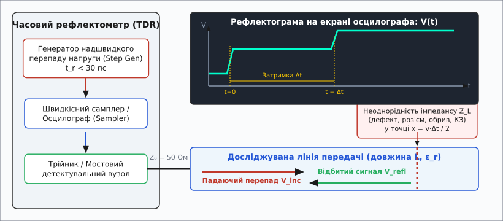
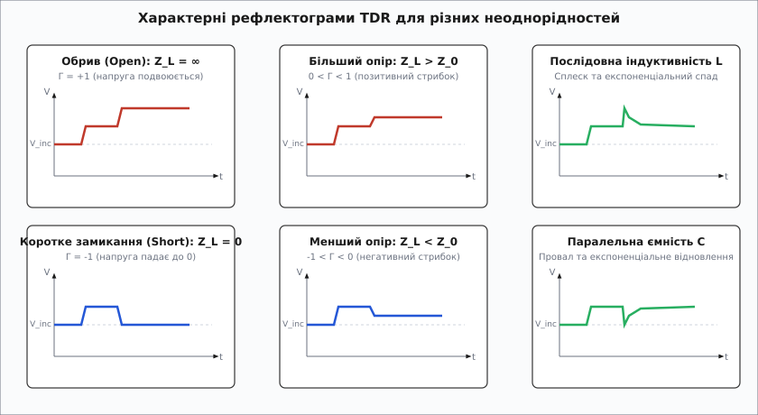
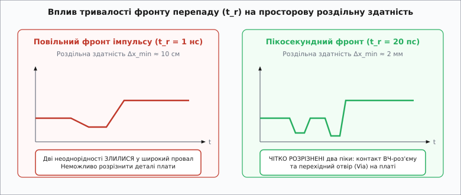
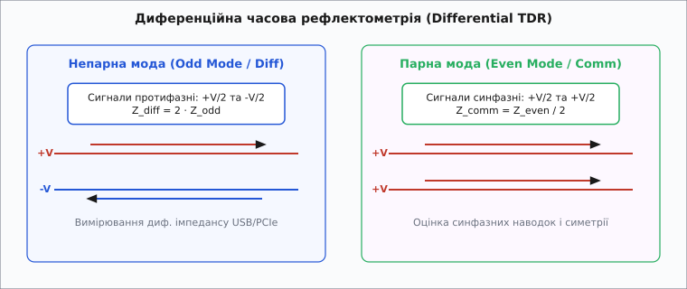

# Часова рефлектометрія (TDR): локація неоднорідностей та аналіз імпедансу

<preknowlist>
- [Лінії передачі й хвильовий опір](book:communications/transmission-lines) — хвильовий опір Z₀, розподілені параметри L та C, падаюча й відбита хвилі.
- [Коефіцієнт стоячої хвилі та відбиття](book:communications/vswr) — коефіцієнт відбиття Γ, поняття неузгодженості навантаження.
</preknowlist>

Коли високочастотна плата зі швидкісною шиною PCIe Gen 5 чи кабель антено-фідерного тракту завдовжки сотню метрів починає втрачати пакети даних або демонструвати високий коефіцієнт стоячої хвилі, звичайний мультиметр чи омметр виявляються безсилими. Вони показують лише постійний струм на кінцях лінії, але не здатні відповісти на два головних запитання: **де саме** розташоване пошкодження та **що саме** трапилося з лінією — чи це мікротріщина в роз'ємі, розчавлений кабель, надлишкова ємність перехідного отвору плати або локальний обрив. Часова рефлектометрія (Time-Domain Reflectometry, TDR) розв'язує цю задачу шляхом зондування лінії надшвидким імпульсом та вимірювання часу й амплітуди відбитої ЕМ-хвилі.

---

### Принцип зондування: електричний радар усередині провідника

Фізична суть часової рефлектометрії повністю аналогічна роботі класичного імпульсного радара або ехолота, але замість вільного простору електромагнітна хвиля поширюється у замкненому просторі між провідниками [лінії передачі](book:communications/transmission-lines).


*Принцип часової рефлектометрії: генератор надшвидкого фронту надсилає в лінію перепад напруги V_inc, а швидкісний самплер фіксує відбиту хвилю V_refl на екрані. Часова затримка Δt між падаючим та відбитим фронтами однозначно визначає відстань x = v·Δt / 2 до дефекту.*

Прилад складається з трьох ключових вузлів: генератора надшвидкого перепаду напруги (Step Generator), швидкісного стробоскопічного самплера або цифрового осцилографа та вимірювального моста чи трійника, що розділяє вихід генератора й вхід самплера.

Процес вимірювання розгортається в часі за таким фізичним механізмом:

1. **Генератор формує ступенястий перепад напруги** `V_inc` (Step function) з надзвичайно коротким фронтом наростання `t_r` (від десятків до одиниць пікосекунд) та спрямовує його в досліджувану лінію. Для формування пікосекундних перепадів застосовують діоди з нагромадженням заряду (Step Recovery Diodes, SRD) або гетероперехідні польові транзистори GaAs/InP, які здатні перемикати струм за час, менший ніж 20 пікосекунд.
2. **Сигнал поширюється уздовж лінії** зі швидкістю `v`, яка визначається ефективною діелектричною проникністю ізолятора `ε_r` та магнітною проникністю `μ_r`:

```
v = c / √(ε_r · μ_r)
```

У більшості немагнітних кабелів та склотекстолітових плат `μ_r = 1`, тому фазова швидкість залежить виключно від діелектрика `v = c / √(ε_r)`. Співвідношення між швидкістю світла у вакуумі `c ≈ 2.998·10⁸ м/с` та швидкістю в лінії називається коефіцієнтом укорочення (Velocity Factor, `VF = 1 / √(ε_r)`).

3. **Якщо лінія є ідеально однорідною** на всій своїй довжині й замкнена на узгоджене навантаження `Z_L = Z₀`, електромагнітна хвиля повністю вбирається в кінці навантаженням. На екрані осцилографа відображається лише гладкий ступенястий перепад вихідного сигналу генератора без жодних повторних сплесків.
4. **Щойно хвиля зустрічає будь-яку неоднорідність** локального хвильового опору `Z_L ≠ Z₀` (роз'єм, згин доріжки, перехідний отвір, тріщину, вологу в кабелі або обрив), частина енергії хвилі відбивається назад до джерела з амплітудою, пропорційною коефіцієнту відбиття `Γ`.
5. **Відбита хвиля повертається** до самплера через час затримки `Δt`. Знаючи швидкість поширення хвилі в діелектрику `v`, прилад визначає точну координату `x` від точки підключення зонда до неоднорідності:

```
x = v · Δt / 2 = (c · Δt) / (2 · √(ε_r))
```

Дільник `2` у знаменнику є принциповим: хвиля долає відстань `x` двічі — спочатку від генератора до неоднорідності, а потім у зворотному напрямку від неоднорідності до самплера осцилографа.

**Приклад розрахунку відстані до дефекту.** Розглянемо коаксіальний кабель із суцільним поліетиленовим діелектриком (`ε_r = 2.25`, коефіцієнт укорочення `VF = 1 / √2.25 = 0.667`). Якщо рефлектометр фіксує сплеск відбитого сигналу через `Δt = 12.0 нс` після падаючого фронту, координата пошкодження обчислюється так:

```
v = 2.998·10⁸ м/с · 0.667 ≈ 2.00·10⁸ м/с
x = (2.00·10⁸ м/с · 12.0·10⁻⁹ с) / 2 = 1.20 м
```

Отже, пошкодження розташоване рівно на відстані 1.20 метра від вимірювального роз'єму.

---

### Сигнатури неоднорідностей: як читати TDR-рефлектограму

Головна перевага TDR перед частотними методами вимірювання (зокрема, КСВН-метрами) полягає в тому, що форма відбитої напруги на екрані однозначно вказує на **фізичний характер** неоднорідності. Амплітуда відбитої хвилі задається [коефіцієнтом відбиття](book:communications/vswr) `Γ(t)`:

```
Γ(t) = V_refl(t) / V_inc = (Z_L(t) - Z₀) / (Z_L(t) + Z₀)
```


*Характерні сигнатури TDR-рефлектограми: обрив подвоює напругу (Γ = +1), коротке замикання обнуляє її (Γ = -1), послідовна індуктивність створює позитивний сплеск, а паралельна ємність — негативний провал.*

Розгляньмо основні типові випадки неоднорідностей імпедансу:

#### 1. Чисто резистивні неоднорідності

* **Обрив лінії (`Z_L = ∞`):** Коефіцієнт відбиття `Γ = +1`. Відбита хвиля повертається в тій самій фазі та додається до падаючої. Напруга на екрані подвоюється (`V_total = 2 · V_inc`).
* **Коротке замикання (`Z_L = 0`):** Коефіцієнт відбиття `Γ = -1`. Відбита хвиля повертається у протифазі та повністю віднімається від падаючої. Напруга на екрані падає до нуля (`V_total = 0`).
* **Стрибок імпедансу вгору (`Z_L > Z₀`):** Наприклад, перехід із 50-омного кабелю на 75-омну доріжку (`0 < Γ < 1`). Сигнал утворює позитивний ступенястий рівень.
* **Стрибок імпедансу вниз (`Z_L < Z₀`):** Наприклад, потовщення доріжки плати або локальне стискання кабелю (`-1 < Γ < 0`). Сигнал утворює негативний ступенястий рівень.

Обчислення локального опору `Z_L` у будь-якій точці лінії здійснюється зворотним перетворенням:

```
Z_L(t) = Z₀ · (1 + Γ(t)) / (1 - Γ(t))
```

#### 2. Реактивні неоднорідності (індуктивні та ємнісні елементи)

У реальних високочастотних приладах та друкованих платах дефекти рідко бувають чисто резистивними. Контактні виводи мікросхем, роз'єми та розварювальні дротики мають паразитну послідовну індуктивність `L`, а контактні майданчики SMD-компонентів і перехідні отвори (Vias) — паразитну паралельну ємність `C`.

* **Послідовна індуктивність (`L`):** У момент надходження швидкого перепаду напруги індуктивність чинить нескінченно великий опір зміні струму (`dI/dt`). Тому в початковий момент вона поводиться як **обрив** (`Γ → +1`), утворюючи гострий позитивний пік напруги. У міру наростання струму індуктивність насичується, і напруга експоненціально спадає до нормального рівня `Z₀` з часовою сталою `τ = L / (2 · Z₀)`.
* **Паралельна ємність (`C`):** На початку перепаду розряджена ємність чинить нульовий опір напрузі (`dV/dt`). Вона поводиться як **коротке замикання** (`Γ → -1`), створюючи гострий негативний провал напруги. У міру заряджання ємності струм зменшується, і напруга експоненціально відновлюється до `Z₀` з часовою сталою `τ = (Z₀ · C) / 2`.

Детальнішу історичну ретроспективу розвитку цих методів вимірювання від перших лабораторій 1940-х років див. у матеріалі [📜 Історія часової рефлектометрії](book:communications/tdr/hist-tdr-radar-origins.md).

---

### Тривалість фронту `t_r` та просторова роздільна здатність

Найважливішим параметром часового рефлектометра є його **просторова роздільна здатність** `Δx_min` — найменша відстань між двома сусідніми неоднорідностями, за якої прилад ще спроможний відобразити їх як два окремі піки, а не як один злитий розмитий провал.


*Вплив тривалості фронту наростання перепаду t_r на роздільну здатність TDR: при t_r = 1 нс дві близькі неоднорідності (наприклад, роз'єм та перехідний отвір) зливаються в один широкий провал; при пікосекундному фронті t_r = 20 пс вони чітко розділяються в часі.*

Роздільна здатність визначається тривалістю фронту наростання `t_r` тестового перепаду напруги (за рівнями 10%–90%):

```
Δx_min ≈ v · t_r / 2 = (c · t_r) / (2 · √(ε_r))
```

З цієї формули чітко видно: **що коротший фронт `t_r`, то вища роздільна здатність приладу**.

#### Порівняльний аналіз роздільної здатності для різних класів приладів

| Клас приладу | Фронт наростання `t_r` | Діелектрик лінії | Роздільна здатність `Δx_min` | Призначення |
| :--- | :--- | :--- | :--- | :--- |
| Кабельний TDR | 1 нс ... 10 нс | Поліетилен (`ε_r = 2.25`) | 10 см ... 1.0 м | Пошук обривів телефонних та силових кабелів |
| Лабораторний TDR | 20 пс ... 35 пс | FR-4 (`ε_r = 4.0`) | 1.5 мм ... 2.6 мм | Аналіз цілісності сигналів (SI) друкованих плат |
| ВНА з IFFT (VNA-TDR) | < 3 пс (еквівалент) | FR-4 / Роджерс | < 200 мікрометрів | Аналіз перехідних отворів та BGA-виводів |

Повний математичний апарат розрахунку екстремумів реактивних піків, інверсії імпедансу та зв'язку з просторовою роздільною здатністю наведено у вставці [🧮 Математика часової рефлектометрії](book:communications/tdr/math-reflection-impedance.md).

---

### Диференційна TDR (Differential TDR) у високошвидкісній цифровій техніці

Сучасні швидкісні інтерфейси передачі даних (USB 3.2/4, PCIe, HDMI, Ethernet 10G/100G) використовують **диференційну передачу сигналів** по двох зв'язаних провідниках. Для їхнього аналізу ззвичайного однофазного TDR недостатньо — необхідний **диференційний часовий рефлектометр** із двома синфазованими генераторами перепаду напруги.


*Диференційна часова рефлектометрія: у непарній моді (Odd Mode) генератори видають протифазні перепади +V/2 та -V/2 для вимірювання диференційного імпедансу Z_diff = 2·Z_odd; у парній моді (Even Mode) генератори видають синфазні перепади +V/2 для оцінки Z_comm = Z_even / 2.*

Прилад працює у двох основних режимах збудження лінії:

1. **Непарна мода (Odd Mode / Differential excitation):**
   * На один провідник подається перепад `+V/2`, а на інший — протифазний перепад `-V/2`.
   * Вимірюваний диференційний хвильовий опір дорівнює подвійній непарній імпедансності:

```
Z_diff = 2 · Z_odd
```

Для стандарту USB 2.0 `Z_diff = 90 Ом`, для USB 3.2 та PCIe `Z_diff = 85 Ом`, для HDMI `Z_diff = 100 Ом`. Диференційна TDR дозволяє бачити локальні асиметрії провідників та розбаланс мікросмужок.

2. **Парна мода (Even Mode / Common excitation):**
   * На обидва провідники одночасно подаються синфазні перепади `+V/2`.
   * Вимірюваний синфазний опір виражається як:

```
Z_comm = Z_even / 2
```

Парна мода застосовується для оцінки перехресних завад (Crosstalk) та стійкості лінії до електромагнітних наводок.

---

### Дисперсія, скін-ефект та розмивання фронту у довгих лініях

При поширенні надшвидкого перепаду напруги у реальних провідниках фронт імпульсу зазнає суттєвих спотворень під дією двох фізичних факторів:
1. **Високочастотного скін-ефекту:** З ростом частоти струм витісняється до тонкої поверхневої плівки провідника. Погонний опір міді зростає пропорційно `√f`, що викликає додаткове згасання високочастотних спектральних компонентів.
2. **Диелектричних втрат (Тангенса кута діелектричних втрат `tan δ`):** Молекулярна поляризація ізолятора поглинає високочастотну енергію хвилі.

Внаслідок цього фронт наростання `t_r` розмивається у міру руху лінії:

```
t_r(x) ≈ √(t_r,0² + (2 · π · α_c · x)²)
```

Це означає, що далекі неоднорідності (наприкінці довгого кабелю) відображаються на екрані з меншою роздільною здатністю та більш гладкими піками, ніж ті, що розташовані безпосередньо біля вимірювального зонда.

---

### Частотна рефлектометрія (FDR) проти часової (TDR)

Окрім прямого імпульсного зондування TDR, у сучасній вимірювальній техніці широко використовують метод **частотної рефлектометрії (Frequency-Domain Reflectometry, FDR)** за допомогою векторних аналізаторів кіл (VNA).

* **Пряма TDR:** Надсилає ступенястий перепад у часовій області. Переваги: висока швидкість наочного відображення, можливість безпосередньо бачити локальний опір `Z(x)` у кожній точці. Недоліки: обмежений динамічний діапазон (60–70 дБ) через шуми самплера.
* **VNA-TDR (FDR з IFFT):** Вимірює комплексний коефіцієнт відбиття `S₁₁(f)` у широкому діапазоні частот (наприклад, від 10 МГц до 50 ГГц), після чого сигнальний процесор виконує зворотне швидке перетворення Фур'є (IFFT). Переваги: колосальний динамічний діапазон (> 100 дБ), можливість програмного часового селектування (Time Gated measurement) для віртуального видалення вимірювальних роз'ємів. Недоліки: вища вартість обладнання.

---

### Застосування у вишукуваннях, геотехніці та силових мережах

Окрім високочастотної мікроелектроніки, TDR широко застосовується в інших галузях інженерії:

* **Ґрунтознавство та гідрологія:** Оскільки відносна діелектрична проникність води (`ε_r ≈ 80`) значно перевищує діелектричну проникність сухого ґрунту (`ε_r ≈ 3...5`), швидкість поширення TDR-імпульсу у закопаній паралельній лінії передачі безпосередньо відображає об'ємну вологість ґрунту (рівняння Топпа).
* **Високовольтні кабельні мережі (ARM — Arc Reflection Method):** Для локації пробоїв підземних силових кабелів TDR поєднують з високовольтним імпульсним генератором («дуговим рефлектометром»). Високовольтний імпульс створює короткочасну електричну дугу у точці пробою, а синхронізований низьковольтний TDR-імпульс відбивається від цієї дуги як від короткого замикання.

---

### Автоматизована обробка та SCPI-інтерфейс

Сучасний рефлектометр виводить на екран не просто сиру напругу від часу `V(t)`, а розрахований профіль опору лінії від координати `Z(x)`. Для цього цифровий сигнальний процесор приладу виконує фільтрацію шумів, калібрування плоскості відліку (Baseline Subtraction) та нелінійне інвертування напруги у значення Ом.

Приклад програмного алгоритму аналізу рефлектограми та локалізації дефектів наведений у практичному розділі [⚙️ Алгоритм обробки TDR-рефлектограми](book:communications/tdr/proj-tdr-analyzer.md).

Для підключення рефлектометрів до автоматизованих вимірювальних стендів (ATE) використовується командний протокол SCPI через інтерфейси Ethernet/LXI або USB-TMC. Детальний довідник команд та API зчитування даних наведено у вставці [📋 Протокол SCPI та API керування рефлектометром](book:communications/tdr/api-tdr-scpi.md).

---

> 🔧 **Навіщо це.**
> Часова рефлектометрія — це основний інструмент діагностики при розробці та верифікації високошвидкісних цифрових плат (High-Speed PCB Design) й антено-фідерних трактів. Вона дозволяє розробнику не вгадувати причину спотворення сигналів, а з точністю до міліметра побачити кожен неналежний перехідний отвір, неякісно припаяний ВЧ-роз'єм або локальне розширення доріжки плати, яке порушує хвильовий опір `Z₀` і спричиняє відбиття хвилі.
