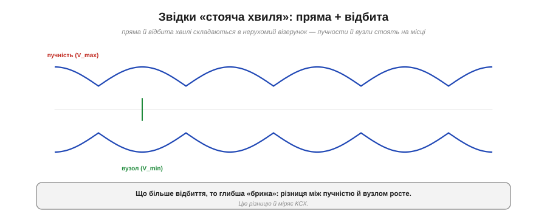
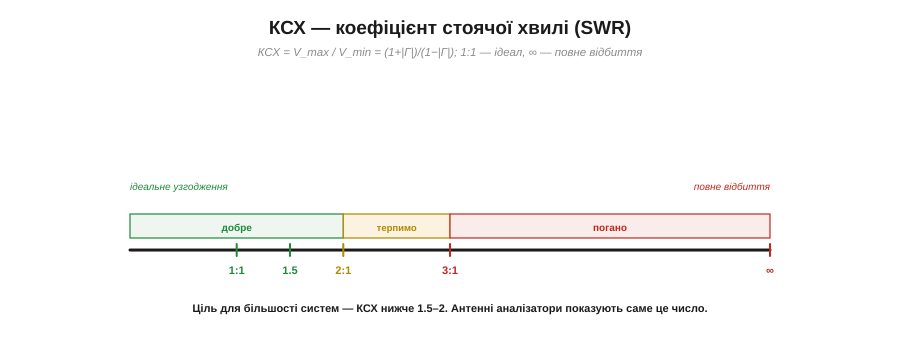
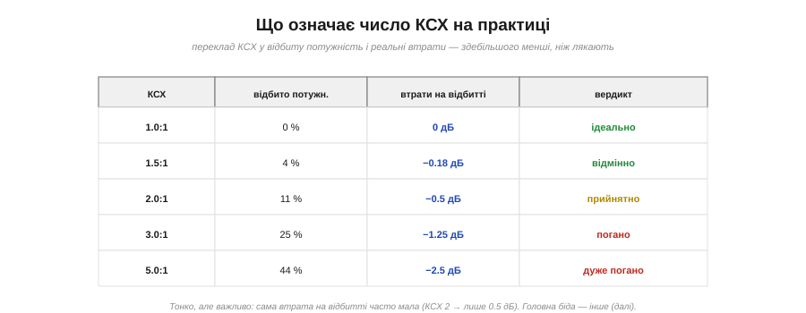
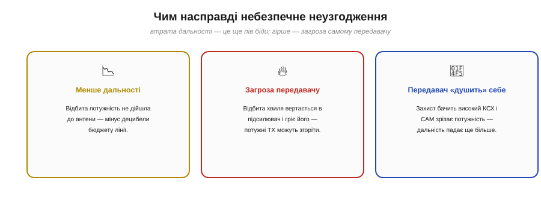
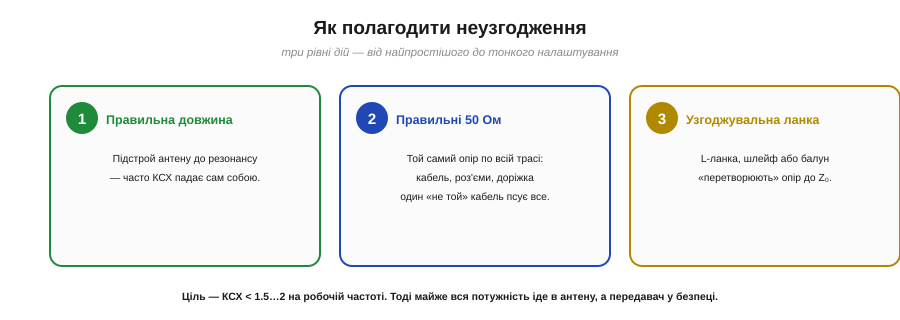

# Відбиття й КСХ

Якщо [лінія й антена не узгоджені за опором](book:communications/transmission-lines), частина хвилі **відбивається** назад. Цю частку треба вміти **вимірювати** числом і розуміти, чим саме неузгодження загрожує. Головна величина тут — **КСХ** (коефіцієнт стоячої хвилі; англійською *SWR*, standing wave ratio), і це, мабуть, найпрактичніший параметр антени, який ти бачитимеш на кожному антенному аналізаторі й у кожному даташиті. Навчитися його читати — означає вміти на місці сказати, працює антена добре чи її треба лагодити.

### Коефіцієнт відбиття: скільки хвилі вертається

Почнімо з первинної величини — **коефіцієнта відбиття** Γ (грецька «гамма»). Він прямо каже, **яка частка** хвилі відбивається від навантаження.


*Коефіцієнт відбиття Γ = (Z_н − Z₀)/(Z_н + Z₀), де Z_н — опір навантаження. Узгоджено (Z_н = Z₀): Γ = 0, нічого не відбивається. Розрив (Z_н = ∞): Γ = +1, відбивається все. Коротке (Z_н = 0): Γ = −1, теж усе, але з інверсією. Модуль |Γ| змінюється від 0 (ідеал) до 1 (повне відбиття).*

Формула проста: Γ = (Z_н − Z₀)/(Z_н + Z₀), де Z_н — опір навантаження (антени), Z₀ — [хвильовий опір лінії](book:communications/transmission-lines). Розгляньмо крайнощі. Якщо опір антени **точно дорівнює** Z₀ — чисельник нуль, **Γ = 0**, відбиття немає, усе ідеально. Якщо на кінці **розрив** (нескінченний опір) — **Γ = +1**, уся хвиля відбивається. Якщо **коротке замикання** (нульовий опір) — **Γ = −1**, теж повне відбиття, тільки з перевертанням фази. Тобто **|Γ|** (модуль) пробігає від **0** (досконале узгодження) до **1** (повне відбиття). Це наш базовий «лічильник» неузгодження.

### Звідки «стояча хвиля»

Тепер — звідки в назві слова «стояча хвиля». Коли відбита хвиля біжить назад і **накладається** на пряму, що біжить уперед, вони складаються в особливий візерунок.


*Пряма й відбита хвилі, складаючись, дають **стоячу хвилю**: візерунок із нерухомих **пучностей** (де напруга максимальна, V_max) і **вузлів** (де мінімальна, V_min). Що сильніше відбиття, то глибша «брижа» — то більша різниця між пучністю й вузлом.*

Дві хвилі, що біжать назустріч, інтерферують так, що вздовж лінії встановлюється **нерухомий** візерунок: у одних точках напруга завжди максимальна (**пучності**, V_max), в інших — завжди мінімальна (**вузли**, V_min). Цей візерунок не біжить, а «стоїть» — звідси й **стояча хвиля**. Ключове: що **більше** відбиття (більший |Γ|), то **глибша** ця брижа — то сильніше різняться V_max і V_min. А якщо відбиття немає зовсім (узгоджено), брижі теж немає: напруга вздовж лінії рівна. Отже, **глибина брижі — це міра неузгодження**. Її й вимірюють.

### КСХ: одне число про узгодження

**КСХ** — це і є відношення «глибини брижі»: наскільки пучність більша за вузол.


*КСХ = V_max/V_min = (1+|Γ|)/(1−|Γ|). Шкала: 1:1 — досконале узгодження (брижі немає); 1.5–2:1 — добре/прийнятно; 3:1 і вище — погано; ∞ — повне відбиття (розрив або коротке). Ціль більшості систем — нижче 1.5–2.*

Формально **КСХ = V_max/V_min = (1+|Γ|)/(1−|Γ|)**. Це одне зручне число. **КСХ = 1:1** — пучність дорівнює вузлу, брижі немає, **досконале узгодження**. **КСХ = 2:1** — пучність удвічі вища за вузол, є помітне відбиття. **КСХ = ∞** — вузол нульовий (повне відбиття: розрив чи коротке). Чим **ближче до 1:1**, то краще. Практична ціль для більшості радіосистем — тримати КСХ **нижче 1.5 або 2**. Саме це число й показує антенний аналізатор, коли ти налаштовуєш антену: крутиш довжину — дивишся, як КСХ повзе до 1.

### Що означає число КСХ насправді

Перекладімо абстрактний КСХ у конкретику: скільки потужності втрачається й чи це страшно.


*Переклад КСХ у відбиту потужність і втрати: 1.5:1 — 4% відбито (−0.18 дБ, відмінно); 2:1 — 11% (−0.5 дБ, прийнятно); 3:1 — 25% (−1.25 дБ, погано); 5:1 — 44% (дуже погано). Важлива тонкість: сама втрата на відбитті часто менша, ніж лякає назва.*

**Приклад (читаємо КСХ 2:1).** Порахуймо, що ховається за «двійкою». Спершу коефіцієнт відбиття: |Γ| = (КСХ−1)/(КСХ+1) = 1/3 ≈ 0.33. Відбита **потужність** — це |Γ|²:

```
|Γ|  = (2−1)/(2+1) = 0.33
відбито потужності = |Γ|² = 0.11  →  11%
дійшло до антени   = 89%   →  втрата ≈ −0.5 дБ
```

Зверни увагу на **несподіванку**: КСХ 2:1 звучить тривожно, а реальна втрата потужності — лише **пів децибела**! Навіть КСХ 3:1 з'їдає всього ~1.25 дБ. Тобто **сама по собі** втрата на відбитті за помірного КСХ — дрібниця в [бюджеті лінії](root:embedded/link-budget). Чому ж тоді всі так бояться високого КСХ? Бо головна біда — **не** у втраченій потужності.

### Чим насправді небезпечне неузгодження

Ось чесна й важлива розв'язка: справжня шкода неузгодження — не стільки у втраченій дальності, скільки в **загрозі передавачу**.


*Три біди. Перша — менше дальності (відбита потужність не дійшла), але за помірного КСХ це дрібниця. Друга, головна — відбита хвиля **вертається в підсилювач** і гріє його; потужний передавач може згоріти. Третя — захист бачить високий КСХ і **сам** зрізає потужність, тож дальність падає ще дужче.*

Розкладімо по совісті. **Перше — втрата дальності:** так, частина потужності не дійшла до антени, але за КСХ до 2 це лише пів децибела — не страшно. **Друге, найважливіше — загроза передавачу:** відбита хвиля **повертається** в підсилювач потужності й розсіюється **в ньому**, перегріваючи його. Для **потужних** передавачів високий КСХ — пряма дорога до згоряння вихідного каскаду. **Третє — самозахист:** саме тому в багатьох передавачах стоїть захист, який, побачивши високий КСХ, **сам зрізає** вихідну потужність (foldback) — і дальність падає вже не на пів децибела, а драматично. Тож правильний акцент: за помірного КСХ хвилюйся не так за втрачені децибели, як за **здоров'я передавача** й за те, що він може «придушити» себе сам.

### Як виміряти узгодження

На щастя, КСХ легко **виміряти** — і це роблять простими приладами.


*Прилад показує КСХ (або «зворотні втрати») залежно від частоти. Де на графіку **глибокий провал** — там антена найкраще узгоджена, тобто резонує. Інструменти: КСХ-метр (вмикають у розрив лінії), антенний аналізатор і дешевий **NanoVNA**, що малює Γ і КСХ по всьому діапазону.*

Найпростіший прилад — **КСХ-метр**: вмикаєш його в розрив між передавачем і антеною, і він показує поточний КСХ. Зручніший — **антенний аналізатор** або дешевий **NanoVNA** (векторний аналізатор за ціну вечері), що малює КСХ чи «зворотні втрати» (*return loss*) **по всьому діапазону** частот. На такому графіку шукають **глибокий провал**: там, де зворотні втрати найбільші (КСХ найближчий до 1), антена **резонує** й найкраще узгоджена. Підлаштовуючи антену, ти «заганяєш» цей провал точно на свою робочу частоту. Це найпряміший спосіб налаштувати антену — не наосліп, а **бачачи** результат.

> 🔧 **Навіщо це.** Якщо ти будуєш радіопристрій із власною антеною, **виміряй КСХ** — це найшвидший спосіб перевірити, чи вона взагалі працює. Дешевий NanoVNA показує провал зворотних втрат; якщо провал стоїть на твоїй частоті й КСХ там нижче ~1.5–2 — антена налаштована, можна паяти далі. Якщо провал «з'їхав» убік або КСХ високий — антена не на ту довжину чи погано узгоджена, і її треба лагодити. І пам'ятай головне: навіть якщо втрата на відбитті здається малою, **захисти передавач** — не ганяй потужний TX на велике неузгодження чи взагалі без антени (це КСХ = ∞!), бо спалиш вихідний каскад.

### Як полагодити неузгодження

І нарешті — що робити, якщо КСХ високий.


*Три рівні дій. (1) **Правильна довжина** — підстрой антену до резонансу, часто цього досить. (2) **Правильні 50 Ом** — один опір по всій трасі: кабель, роз'єми, доріжка. (3) **Узгоджувальна ланка** — L-ланка, шлейф чи балун «перетворюють» опір антени до Z₀.*

Дій у три кроки, від простого до тонкого. **Перше — довжина:** найчастіша причина високого КСХ — антена не на [резонансній довжині](book:communications/resonance-dipole); підстрой її до λ/4 чи λ/2, і КСХ часто падає сам собою. **Друге — траса 50 Ом:** переконайся, що **вся** [лінія на одному опорі](book:communications/transmission-lines) — кабель, роз'єми, доріжка; один «не той» кабель псує все. **Третє — узгоджувальна ланка** (*matching network*): якщо опір антени принципово не 50 Ом (як часто буває в компактних і PCB-антен), між нею й лінією ставлять невелику схему — **L-ланку** з котушки й конденсатора, **шлейф** (*stub*) або **балун** (англ. *balun*, від *balanced–unbalanced* — перехід між симетричною й несиметричною лінією) — яка математично «перетворює» опір антени до потрібних 50 Ом. Ціль усіх трьох — загнати КСХ нижче **1.5–2** на робочій частоті; тоді майже вся потужність іде в антену, а передавач у безпеці.

КСХ зводить усю фізику узгодження в одне число, яке видно на приладі: чим ближче воно до 1:1, то менше хвилі вертається, то спокійніший передавач і чистіший випромінений сигнал. Запам'ятай два акценти — за помірного КСХ хвилюйся не так за втрачені децибели, як за **здоров'я передавача**; а КСХ = ∞ (робота без антени чи на коротке) для потужного TX — пряма дорога до згоряння вихідного каскаду.

---
