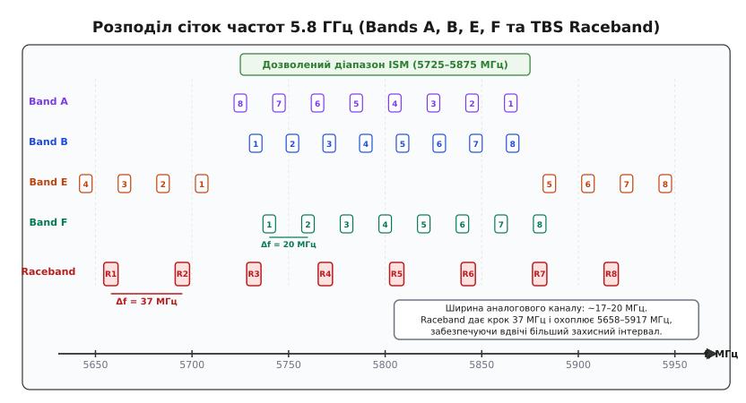
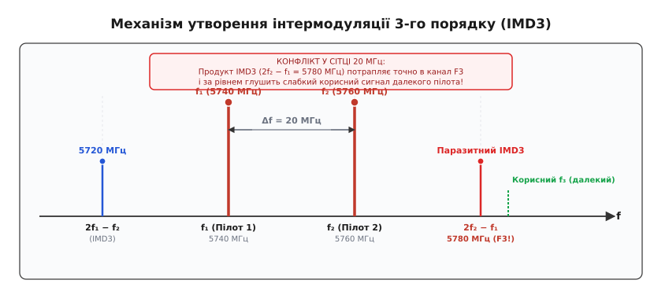
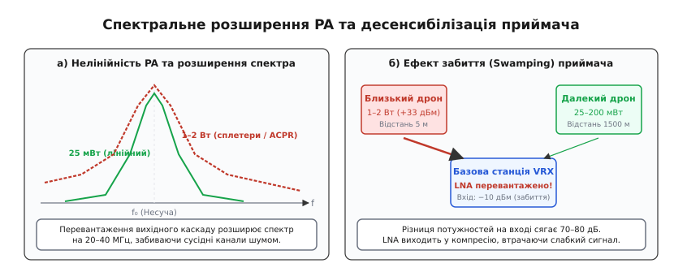
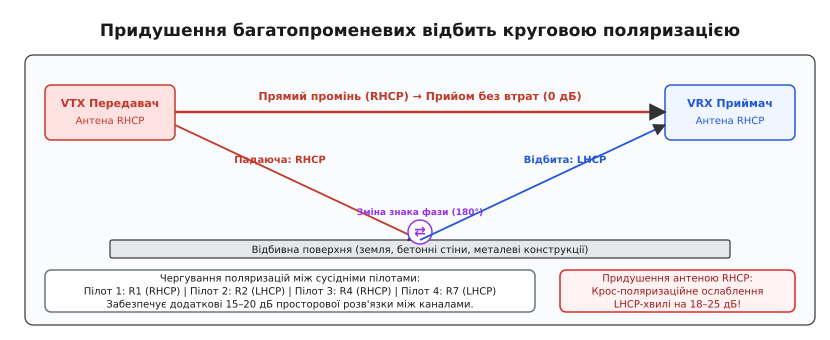

# Канали 5.8 ГГц для FPV (Raceband і смуги A/B/E/F)

<preknowlist>
- [Радіочастотні підсилювачі (LNA і PA)](topic:communications/rf-amplifiers) — робота вхідних малошумних підсилювачів, вихідних каскадів потужності та нелінійне насичення.
- [Змішувач частот](topic:communications/mixer) — перетворення частот, гетеродинне перемножування та утворення комбінаційних продуктів.
- [Поляризація антени](topic:communications/antenna-polarization) — просторова орієнтація електричного вектора хвилі та поляризаційні втрати при неузгодженні.
- [Кругова поляризація](topic:communications/circular-polarization) — обертання вектора поля, праві (RHCP) та ліві (LHCP) хвилі, осьовий коефіцієнт (Axial Ratio).
- [Багатопроменеве згасання](topic:communications/multipath-fading) — інтерференція відбитих променів від перешкод, утворення нулів сигналу та спотворення розгортки.
- [Ефект захоплення FM](topic:communications/fm-capture-effect) — нелінійне придушення слабшого сигналу сильнішим у частотному демодуляторі (WFM).
- [Композитний відеосигнал CVBS](topic:communications/cvbs-signal) — рівні синхронізації, рядкові та кадрові гасильні імпульси, повна смуга аналогового відео.
- [Втрати у вільному просторі](topic:communications/free-space-loss) — формула Фрііса для загасання радіохвиль на надвисоких частотах.
</preknowlist>

На змагальній трасі або під час виконання тактичного групового завдання оператор піднімає дрон у повітря на каналі 5740 МГц (FatShark 1) і стабільно веде розвідку на відстані півтора кілометра, отримуючи чисте аналогове відео. У цей момент інший пілот на стартовій позиції за десять метрів від приймальних антен вмикає живлення свого дрона на сусідньому каналі 5760 МГц (FatShark 2). Миттєво на моніторі третього оператора, чий дрон налаштований на канал 5780 МГц (FatShark 3) і перебуває на протилежному фланзі, зображення повністю розривається смугами, зникає колір, а за секунду екран заливає суцільний білий шум.

Парадокс полягає в тому, що третій оператор не ділив частоту з жодним із увімкнених дронів: між його каналом і першим передавачем — сорок мегагерців розриву, а з другим — двадцять мегагерців, що значно ширше за номінальну смугу аналогового сигналу. Причиною раптової відмови є інтермодуляція (від лат. *inter* — між та *modulatio* — розміреність): фундаментальне фізичне явище взаємного перемножування двох потужних високочастотних коливань у нелінійних каскадах вхідного тракту приймача, яке народжує дзеркальні фантомні сигнали точно на частотах сусідніх каналів.

---

## Фізика діапазону 5.8 ГГц та радіоелектронні обмеження

Радіочастотний діапазон 5.8 ГГц (офіційні межі 5650–5950 МГц) став світовим стандартом бездротової передачі відеоінформації реального часу для малих безпілотних платформ завдяки поєднанню фізичних та конструктивних властивостей електромагнітних хвиль сантиметрового діапазону:

```
λ = c / f = (3 · 10⁸ м/с) / (5.8 · 10⁹ Гц) ≈ 0.0517 м = 5.17 см
```

Довжина хвилі близько п'яти сантиметрів дає змогу виготовляти високоефективні антени кругової поляризації (конюшини Cloverleaf, планарні антени Pagoda, спіральні антени Helical) з геометричними розмірами випромінювачів усього 1.5–3.5 см. Це критично для малорозмірних апаратів, де кожен зайвий грам маси та міліметр аеродинамічного опору скорочує час польоту.

Водночас висока частота накладає жорсткі радіотехнічні обмеження. Згідно з формулою Фрііса для передачі радіосигналу у вільному просторі, втрати поширення (Free-Space Path Loss) зростають пропорційно квадрату частоти:

```
FSPL (дБ) = 20·log₁₀(d) + 20·log₁₀(f) + 20·log₁₀(4·π / c)
```

На частоті 5.8 ГГц втрати сигналу на трасі довжиною 1 км становлять близько `107.7 дБ`, що на `7.7 дБ` більше, ніж на частоті 2.4 ГГц, і на `13.0 дБ` більше, ніж на частоті 1.3 ГГц. Кожні 6 дБ додаткових втрат вимагають або подвоєння чутливості приймача, або чотирикратного збільшення вихідної потужності передавача. 

Висока частота також критично підвищує вимоги до коаксіальних фідерів: тонкий кабель RG178 має власне загасання близько 3.3 дБ на кожен метр довжини, через що навіть 15-сантиметровий подовжувач антени відбирає понад 10% вихідної потужності передавача. Будь-яке мікропошкодження роз'єму IPEX/U.FL або нещільне закручування гайки SMA викликає хвильове неузгодження (КСХ > 2.0), що призводить до відбиття потужності назад у кристал підсилювача та його швидкої теплової деградації.

Крім того, сантиметрові радіохвилі практично не огинають перешкоди за рахунок дифракції: будь-яке дерево з густим листям, залізобетонна стіна чи рельєфна складка місцевості створюють глибоку радіотінь, послаблюючи сигнал на 15–35 дБ. Поширення сигналу відбувається майже виключно в межах прямої видимості (Line-of-Sight, LOS), а будь-які тверді поверхні викликають дзеркальні відбиття, породжуючи складну картину багатопроменевої інтерференції.

---

## Історія та хаос традиційних сіток: Bands A, B, E, F

У перші роки розвитку FPV-систем на ринку не існувало єдиного стандарту частотного розподілу. Перші аналогові приймально-передавальні модулі будувалися на базі азійських мікросхем компанії RichWave (чипи RTC6705 для передавачів та RTC6715 для приймачів) або аналогових модулів Airwave.

Виробники обладнання формували власні внутрішні таблиці каналів, які зашивалися в постійну пам'ять синтезаторів частоти (PLL) або комутувалися двійковими комбінаціями контактів вибору каналу (CH1, CH2, CH3):

1. **Band A (Boscam A):** спадна сітка з кроком 20 МГц (5865, 5845, 5825, 5805, 5785, 5765, 5745, 5725 МГц). Створювалася для промислових систем бездротового відеоспостереження;
2. **Band B (Boscam B):** висхідна сітка з нерівномірним кроком у 19 МГц (5733, 5752, 5771, 5790, 5809, 5828, 5847, 5866 МГц). Крок 19 МГц був обраний для розведення гармонік від гетеродина, проте викликав фатальні взаємні накладання на сітки Band A та Band F;
3. **Band E (Foxtech / Hobbyking):** розбита на дві ізольовані групи по 4 канали з кроком 20 МГц (нижня підсмуга 5645–5705 МГц, верхня підсмуга 5885–5945 МГц). Канали 5645 МГц та 5945 МГц виходили за межі дозволених міжнародних смуг;
4. **Band F (FatShark / Airwave / ImmersionRC):** рівномірна сітка з кроком 20 МГц (5740, 5760, 5780, 5800, 5820, 5840, 5860, 5880 МГц). Завдяки популярності відеоокулярів FatShark вона стала неофіційним стандартом на довгі роки.


*Частотна карта діапазону 5.8 ГГц із накладанням традиційних смуг A, B, E, F та сітки TBS Raceband. Показано нерівномірні інтервали та перекриття дозволеного діапазону ISM.*

Головна вада сіток із кроком 19–20 МГц полягала в тому, що вони розраховувалися виключно на поодинокі польоти. Ширина спектра аналогового FM-відео становить 17–20 МГц, тому канали з інтервалом 20 МГц стояли впритул один до одного без жодного захисного проміжку. Варто було двом пілотам увімкнутися на сусідніх каналах Band F (наприклад, 5740 та 5760 МГц), як бічні пелюстки спектрів накладалися одна на одну.

Повний перелік частот, значень регістрів синтезатора та міжсіткових колізій наведено у вставці [📋 Довідник частотних сіток 5.8 ГГц для FPV та БПЛА](topic:communications/fpv-channels/api-bands.md).

---

## Демодуляція широкосмугової FM та ефект захоплення

Аналогове відео NTSC/PAL передається за допомогою широкосмугової частотної модуляції (WFM, від англ. *Wideband Frequency Modulation*). На відміну від амплітудної модуляції (AM), де сигнал завади лінійно додається до корисного відео, у частотному демодуляторі діє нелінійний **ефект захоплення FM (FM Capture Effect)**.

Вхідний тракт аналогового приймача (RTC6715 / RX5808) містить амплітудний обмежувач (Limiter) та квадратурний частотний дискримінатор. Якщо на вхід надходять два частотно-модульовані сигнали на одній або близьких частотах, обмежувач зрізає амплітудні варіації, перетворюючи сумарний сигнал на вектор із результуючою фазою. 

Якщо амплітуда сильнішого сигналу перевищує слабший хоча б на **1.5–3.0 дБ (коефіцієнт захоплення / Capture Ratio)**, частотний детектор повністю придушує слабший сигнал, демодулюючи виключно сильніший. 

Проте цей захисний механізм діє як пастка у двох критичних ситуаціях:
1. **Зрив синхронізації при вирівнюванні рівнів:** якщо рівні корисного та паразитного сигналів зближуються до різниці менше 1.5 дБ (наприклад, коли чужий дрон наближається, а власний віддаляється), дискримінатор починає хаотично перескакувати між двома сигналами на кожному напівперіоді несучої. Відеопроцесор втрачає рядкові імпульси синхронізації (H-Sync), кадр розвалюється на косі чорні смуги, а телевізійний монітор вимикає зображення (ефект «синього екрана» / Blue Screen);
2. **Паразитне захоплення фантомом IMD3:** оскільки інтермодуляційний продукт 3-го порядку формується всередині вхідного LNA приймача від двох близьких дронів, його амплітуда може перевищувати слабкий корисний сигнал далекого дрона на 20–40 дБ. Детектор захоплює фантомний продукт IMD3 і повністю відключає прийом корисного відео.

---

## Поява TBS Raceband: геометрія рівномірного інтервалу 37 МГц

У 2015 році компанія Team BlackSheep запропонувала радикальне вирішення проблеми частотного хаосу — сітку **Raceband (Band R)**. 

Замість того, щоб тулитися у вузькому діапазоні 5740–5860 МГц, інженери TBS задіяли всю смугу від 5658 МГц до 5917 МГц, доступну в радіоаматорському регламенті (Ham Radio Band). Діапазон розділили на 8 каналів із рівномірним інтервалом у **37 МГц**:

```
Канал R1: 5658 МГц       Канал R5: 5806 МГц
Канал R2: 5695 МГц       Канал R6: 5843 МГц
Канал R3: 5732 МГц       Канал R7: 5880 МГц
Канал R4: 5769 МГц       Канал R8: 5917 МГц
```

Перевага кроку 37 МГц очевидна: при ширині аналогового відеосигналу ~18 МГц між корисними спектрами сусідніх каналів залишається захисний інтервал у `19–20 МГц`. Це дозволило стандартним аналоговим смуговим фільтрам проміжної частоти (фільтри ПЧ на 480 МГц із смугою пропускання 27–30 МГц) повністю відсікати сигнали сусіднього каналу.

Проте, як показала практика великих змагань і тактичних групових вильотів, простий перехід на Raceband не усунув проблему взаємних завад повністю, якщо в повітрі одночасно перебувало більше трьох-чотирьох дронів. Причиною цього стало явище нелінійної інтермодуляції.

---

## Нелінійність радіотракту та механізм інтермодуляції (IMD3)

Усі реальні радіоприймачі мають обмежений динамічний діапазон і нелінійну передатну характеристику вхідних напівпровідникових каскадів (малошумного підсилювача LNA та змішувача).

Якщо на вхід приймача одночасно надходять два потужні високочастотні сигнали на частотах `f₁` та `f₂` (наприклад, від двох дронів, що пролітають неподалік або готуються до старту), передатна функція підсилювача розкладається в степеневий ряд Тейлора:

```
v_out(t) = a₁·v_in(t) + a₂·v_in²(t) + a₃·v_in³(t) + ...
```

Член першого порядку `a₁·v_in` забезпечує бажане лінійне підсилення. Член другого порядку `a₂·v_in²` породжує гармоніки `2·f₁`, `2·f₂` та сумарно-різницеві частоти `f₁ ± f₂`, які лежать далеко за межами робочої смуги 5.8 ГГц і легко пригнічуються вхідними фільтрами.

Головну небезпеку становить кубічний член `a₃·v_in³`. Тригонометричний розклад добутку трьох гармонічних коливань породжує складові третього порядку:

```
cos²(ω₁·t) · cos(ω₂·t) = (1/2)·[1 + cos(2·ω₁·t)] · cos(ω₂·t)
                       = (1/2)·cos(ω₂·t) + (1/4)·cos((2·ω₁ − ω₂)·t) + (1/4)·cos((2·ω₁ + ω₂)·t)
```

Цей розклад утворює дві комбінаційні частоти, які називаються **продуктами інтермодуляції 3-го порядку (IMD3)**:

```
f_IMD3,1 = 2·f₁ − f₂
f_IMD3,2 = 2·f₂ − f₁
```


*Спектральний механізм виникнення продуктів IMD3. Два потужні сигнали f₁ та f₂ породжують комбінаційні частоти 2f₁−f₂ та 2f₂−f₁, одна з яких за рівнем потужності перекриває слабкий корисний сигнал далекого пілота f₃.*

Небезпека продуктів IMD3 полягає в тому, що вони розташовані на тій самій відстані `Δf = |f₂ − f₁|` від основних сигналів і **неминуче потрапляють у робочий діапазон 5.8 ГГц**.

### Чому сітка з кроком 20 МГц вбиває зв'язок

Розглянемо політ трьох пілотів на перших трьох каналах стандартної смуги Band F:
- Пілот 1 на каналі F1: `f₁ = 5740 МГц`;
- Пілот 2 на каналі F2: `f₂ = 5760 МГц`;
- Пілот 3 на каналі F3: `f₃ = 5780 МГц`.

Обчислимо продукт IMD3, породжений першим і другим передавачами:

```
f_IMD3 = 2·f₂ − f₁ = 2·(5760 МГц) − 5740 МГц = 11520 МГц − 5740 МГц = 5780 МГц
```

Отримана паразитна частота **ідеально точно збігається** з несучою частотою третього пілота F3. 

Коли перший і другий дрони перебувають на відстані 20–50 метрів від базової станції, їхні сигнали надходять на вхід приймача F3 з рівнем −25...−30 дБм. Продукт IMD3, згенерований усередині самого приймача третього пілота, сягає рівня −50...−55 дБм. Якщо власний дрон третього пілота відлетів на 800 метрів і його корисний сигнал приходить із рівнем −80 дБм, паразитний інтермодуляційний фантом виявляється **на 25–30 дБ потужнішим за корисний сигнал**. Чутливий демодулятор миттєво захоплює фантомний сигнал, і відео третього пілота повністю зникає.

Строге математичне виведення для двох і трьох тонів, розрахунок точок перетину IP3 та каскадної лінійності наведено у вставці [🧮 Математичний аналіз нелінійності та інтермодуляції 3-го порядку (IMD3)](topic:communications/fpv-channels/math-imd.md).

---

## Нелінійність підсилювачів потужності (PA) та вибір вихідного рівня

Проблема взаємних завад посилюється нелінійними ефектами, які виникають не лише в приймачах, а й безпосередньо у вихідних каскадах передавачів (Power Amplifier, PA).

### Рівні потужності та їхнє призначення

Сучасні аналогові та цифрові передавачі мають перемикані рівні вихідної потужності:

| Потужність | Рівень у дБм | Споживаний струм (12 В) | Рекомендована сфера застосування |
|:---:|:---:|:---:|:---|
| **25 мВт** | 14 дБм | 120–160 мА | Змагання, групові польоти в приміщеннях, тренувальні зони |
| **100–200 мВт** | 20–23 дБм | 250–350 мА | Оптимальний баланс для польотів 4–6 пілотів на відкритій місцевості до 1.5–2 км |
| **400–800 мВт** | 26–29 дБм | 450–650 мА | Поодинокі польоти на середні дистанції (3–6 км) з перешкодами |
| **1–2.5 Вт** | 30–34 дБм | 800–1800 мА | Далекі розвідувальні польоти (Long Range 10–25 км), робота крізь щільні перешкоди |

### Спектральне розширення (Spectral Regrowth) та тепловий дрейф

Коли вихідний каскад підсилювача потужності (PA) передавача працює на граничній потужності (1–2.5 Вт), транзистори входять у режим глибокого насичення біля точки компресії `P1dB`. 

Кубічна та квінтична (5-го порядку) нелінійності підсилювача викликають явище **спектрального розширення (Spectral Regrowth / Splatter)**: енергія передавача розмазується далеко за межі номінальної смуги 20 МГц, піднімаючи шумову полицю на 30–50 МГц в обидва боки від несучої. Навіть якщо частотний план розрахований ідеально, дрон із перевантаженим 2-ватним передавачем створює широкий шлейф бічного шуму, заливаючи сусідні канали.

Крім того, виділення тепла (до 10–15 Вт розсіюваної теплової потужності на кристалі площею кілька квадратних міліметрів) призводить до перегріву вище 90–110°C при тривалому знаходженні дрона на землі без обдуву. При нагріванні кварцовий генератор синтезатора частоти зазнає температурного дрейфу: центральна частота передавача може «попливти» на 2–5 МГц, зміщуючи спектр у бік сусіднього каналу та ламаючи розрахований баланс інтермодуляції.


*Вплив режиму роботи PA на спектр сигналу та ефект забиття (Swamping) вхідного LNA приймача при значній асиметрії рівнів потужності.*

### Ефект забиття (Receiver Desensitization / Swamping)

Якщо один пілот використовує передавач потужністю 1000 мВт (+30 дБм), а інший — 25 мВт (+14 дБм), на стартовому майданчику різниця рівнів сигналів, що надходять на приймальні антени базової станції, може досягати 70–80 дБ.

Потужний сигнал близького дрона повністю перевантажує вхідний підсилювач малошумного тракту (LNA) сусіднього приймача. У підсилювачі спрацьовує компресія коефіцієнта передачі, через що його коефіцієнт підсилення для слабкого сигналу від власного далекого дрона падає практично до нуля. Цей ефект називається **десенсибілізацією (забиттям) приймача**. Жодне цифрове фільтрування в демодуляторі не здатне відновити сигнал, якщо вхідний LNA перевантажений за напругою.

---

## Поляризація антен: відсікання багатопроменевості та просторова ізоляція

На частоті 5.8 ГГц лінійна поляризація (вертикальна або горизонтальна) виявляється малопридатною для мобільних об'єктів із двох причин:
1. **Поляризаційні втрати при кренах:** при маневруванні дрона кут між передавальною та приймальною антенами постійно змінюється. При взаємному нахилі на 90° поляризаційні втрати перевищують 20–30 дБ, викликаючи повне зникнення відео;
2. **Багатопроменева інтерференція (Multipath Fading):** відбиті від землі чи споруд радіохвилі приходять на приймальну антену з різними фазовими затримками, створюючи глибокі інтерференційні провали сигналу.

### Механізм інверсії кругової поляризації при відбитті

У сучасних FPV-системах безальтернативно застосовується **кругова поляризація (Circular Polarization)** — права (RHCP, від англ. *Right-Hand Circular Polarization*) або ліва (LHCP, від англ. *Left-Hand Circular Polarization*).

При дзеркальному відбитті електромагнітної хвилі від плоского провідника або діелектрика (поверхня землі, асфальт, бетонні стіни будівель) тангенціальна складова електричного вектора поля змінює фазу на 180°. Внаслідок цього **напрямок обертання хвилі інвертується: падаюча хвиля RHCP після відбиття перетворюється на хвилю LHCP**.


*Придушення відбитих хвиль антеною кругової поляризації. Одноразово відбита хвиля змінює напрямок обертання з RHCP на LHCP і послаблюється приймальною антеною RHCP на 18–25 дБ.*

Приймальна антена RHCP має власну крос-поляризаційну розв'язку відносно хвиль протилежного напрямку обертання (LHCP) на рівні **18–25 дБ** (визначається якістю антени та її осьовим коефіцієнтом *Axial Ratio* `AR < 1.2`). 

Відбита копія сигналу, перетворена на LHCP, просто не сприймається приймачем. Це повністю усуває гостінг (подвійні контури), розриви рядків та чорні смуги відбиття без використання складних цифрових еквалайзерів.

### Чергування поляризацій для групових польотів

Крос-поляризаційна ізоляція дає потужний інструмент для захисту від інтермодуляції та розділення сусідніх каналів при масових польотах.

Якщо сусідні канали сітки призначати пілотам із чергуванням напрямку поляризації антен:
- **Пілот 1 (Канал R1):** антени передавача і приймача — **RHCP**;
- **Пілот 2 (Канал R2):** антени передавача і приймача — **LHCP**;
- **Пілот 3 (Канал R4):** антени передавача і приймача — **RHCP**;
- **Пілот 4 (Канал R7):** антени передавача і приймача — **LHCP**.

Навіть якщо продукт IMD3 або бічна спектральна пелюстка від Пілота 1 та Пілота 3 випадково потрапить у смугу прийому Пілота 2, приймальна антена LHCP додатково послабить заваду поляризації RHCP на **18–25 дБ**. Це знижує рівень інтермодуляційного сигналу нижче порогу чутливості приймача.

---

## Наземні приймальні комплекси: просторове рознесення та випромінювання гетеродина

Організація робочого місця операторів на землі є завершальною ланкою в ланцюгу забезпечення електромагнітної сумісності.

### 1. Просторова розв'язка Diversity-антен

Сучасні відеоокуляри та наземні станції використовують здвоєні антени: всеспрямовану (Omni, підсилення 2.0–2.5 дБі) для близького маневрування та спрямовану панельну (Patch, підсилення 8–14 дБі, ширина діаграми 60°–75°) для далеких секторів.

Для ефективної роботи просторового рознесення антени повинні бути віддалені одна від одної щонайменше на `d ≥ 5–10 · λ ≈ 25–50 см`. При меншій відстані виникає явище паразитного взаємного зв'язку (Mutual Coupling), коли одна антена перевипромінює частину енергії на іншу, спотворюючи діаграму спрямованості та зменшуючи коефіцієнт підсилення.

### 2. Паразитне випромінювання гетеродина (LO Radiation)

Приймальні модулі RX5808 побудовані за супергетеродинною схемою з проміжною частотою `f_IF = 480 МГц`. Внутрішній гетеродин (Local Oscillator) працює на частоті `f_LO = f_RF − 480 МГц` або `f_RF + 480 МГц`.

Через неідеальну зворотну ізоляцію вхідного змішувача частина коливань гетеродина з рівнем потужності близько −50...−60 дБм просочується назад у приймальну антену і вільно випромінюється в простір. Якщо два оператори сидять пліч-о-пліч на відстані 50 см, антена одного оператора може вловити випромінювання гетеродина сусіда, створивши потужну смугову заваду на проміжній частоті.

**Польове правило:** робочі місця операторів і штативи ретрансляторів повинні розташовуватися на відстані **не менше 2.5–3.0 метрів** одне від одного.

---

## Практичні стратегії частотного планування для 4, 6 та 8 пілотів

Математичний аналіз на базі теорії різницевих множин (множини Сідона та лінійки Голомба) показує, що для гарантованої відсутності колізій IMD3 частоти повинні мати **строго нерівномірні попарні інтервали**.

### 1. Безконфліктний розподіл для 4 пілотів (Raceband {R1, R2, R4, R7})

Класичний «золотий стандарт» чотириканального FPV-рейсингу та тактичних груп:

```
Пілот 1: Канал R1 = 5658 МГц   (Поляризація RHCP)
Пілот 2: Канал R2 = 5695 МГц   (Поляризація LHCP)
Пілот 3: Канал R4 = 5769 МГц   (Поляризація RHCP)
Пілот 4: Канал R7 = 5880 МГц   (Поляризація LHCP)
```

**Аналіз інтервалів між каналами:**
- `R2 − R1 = 37 МГц`;
- `R4 − R2 = 74 МГц` (`2 × 37 МГц`);
- `R7 − R4 = 111 МГц` (`3 × 37 МГц`).

Усі міжканальні відстані (`37, 74, 111 МГц`) є взаємно унікальними. Жоден продукт 2-тонового IMD3 не збігається з робочими каналами, а чергування поляризацій RHCP/LHCP захищає від можливих потрійних інтермодуляційних комбінацій.

### 2. Схема розподілу для 6 пілотів (IMD-Free 6 Pilots)

Для польоту 6 пілотів у межах діапазону 5.8 ГГц задіюють канали з різних смуг або комбінацію Raceband та Band L:

```
Пілот 1: R1 (5658 МГц) — RHCP
Пілот 2: R2 (5695 МГц) — LHCP
Пілот 3: F3 (5780 МГц) — RHCP
Пілот 4: R6 (5843 МГц) — LHCP
Пілот 5: R7 (5880 МГц) — RHCP
Пілот 6: E8 (5945 МГц) — LHCP
```

При такій розкладці мінімальне рознесення між сусідніми частотами становить не менше 35 МГц, а чергування поляризацій гарантує відсутність взаємного зриву синхронізації.

Алгоритми автоматизованого розрахунку та оптимізації сіток мовами C та C++ наведено у вставці [⚙️ Планувальник частот та оптимізатор IMD-free розподілу для FPV](topic:communications/fpv-channels/proj-freq-planner.md).

---

## Спільна робота аналогових та цифрових систем (DJI, Walksnail, HDZero)

Поява цифрових систем високої чіткості (HD FPV) змінила структуру радіоефіру. Цифрові комплекси (DJI O3/O4 Air Unit, Walksnail Avatar HD, HDZero) використовують зовсім інші принципи модуляції:

1. **DJI O3/O4 (OFDM, смуга 20/40 МГц):**
   - У режимі 20 МГц (Standard Bitrate) займає рівно один канал Raceband. Сумісний із спільними польотами за умови фіксованого вибору каналу (Manual Channel Mode);
   - У режимі 40 МГц (High Bitrate) займає смугу понад 40 МГц, створюючи суцільний цифровий шум на двох сусідніх аналогових каналах;
   - Передавач DJI є двостороннім приймачем-передавачем: він постійно випромінює службові пакети квитування та адаптивної зміни бітрейту.
2. **HDZero (DM9300, COFDM без зворотного зв'язку):**
   - Передає некомпресоване відео у смузі 27 МГц у постійному режимі без стрибків потужності;
   - Створює стабільний прогнозований шумовий профіль, найменш агресивний щодо сусідніх аналогових приймачів.

### Правила змішаних польотів

- **Категорично заборонено** залишати цифрові системи DJI/Walksnail у режимі `Auto Channel Selection`: під час польоту система може автоматично перестрибнути на канал, де вже летить аналоговий дрон, миттєво знищивши його відеопотік;
- Цифрові передавачі в режимі 40 МГц розміщують на крайніх каналах сітки (наприклад, канал 5768.5 МГц або 5839.5 МГц), відступаючи від найближчого аналогового дрона щонайменше на 50–60 МГц;
- Якщо в групі летить дрон із цифровим зв'язком, його вихідну потужність на старті обмежують значенням 25–200 мВт.

---

> 🔧 **Навіщо це.** Ось три практичні правила частотної дисципліни для польотів у групі.
>
> 1. **Ніколи не вмикай живлення дрона без команди координатора:** увімкнення VTX навіть на дві секунди для перевірки камери випромінює повну потужність на час ініціалізації PLL і миттєво збиває дрон, який перебуває в повітрі на цьому або інтермодуляційному каналі. Для налаштування на землі використовуй тільки режим **PitMode** (потужність < 0.1 мВт).
> 2. **Літайте на однаковій мінімальній потужності:** якщо всі пілоти виставлять 25 мВт (або 200 мВт на відкритому полі), динамічний діапазон приймачів не буде перевантажений, а продукти IMD3 залишаться нижче рівня шумів. Якщо один пілот увімкне 1 Вт, він десенсибілізує приймачі всіх сусідів у радіусі 50 метрів.
> 3. **Дотримуйтесь розкладки R1-R2-R4-R7 із чергуванням RHCP/LHCP:** це єдиний надійний спосіб забезпечити якісний одночасний політ 4 пілотів на 5.8 ГГц без ризику раптового зриву синхронізації через інтермодуляцію 3-го порядку.

---

Частотне планування в діапазоні 5.8 ГГц — це не просто вибір номера каналу в конфігураторі, а комплексний розрахунок електромагнітної взаємодії вихідних підсилювачів передавачів, динамічного діапазону вхідних змішувачів приймачів та просторової розв'язки антен кругової поляризації. Тільки суворе дотримання частотної сітки Raceband, математичний контроль інтермодуляційних продуктів IMD3 та дисципліна вихідної потужності дозволяють гарантувати стабільний і безпечний відеозв'язок для всієї групи безпілотних апаратів.
