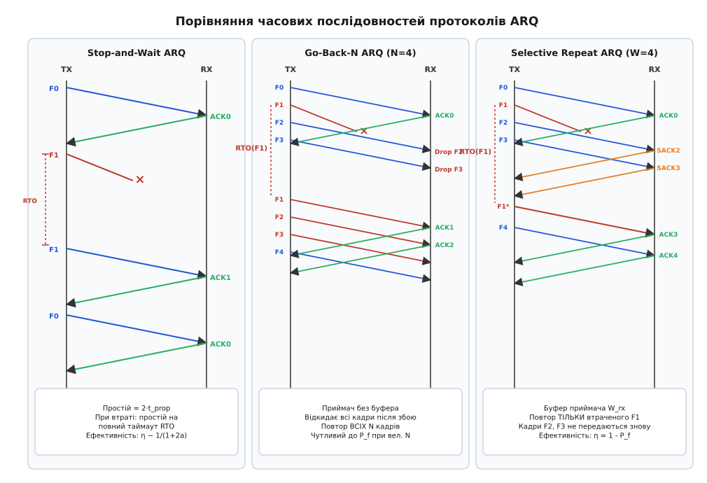
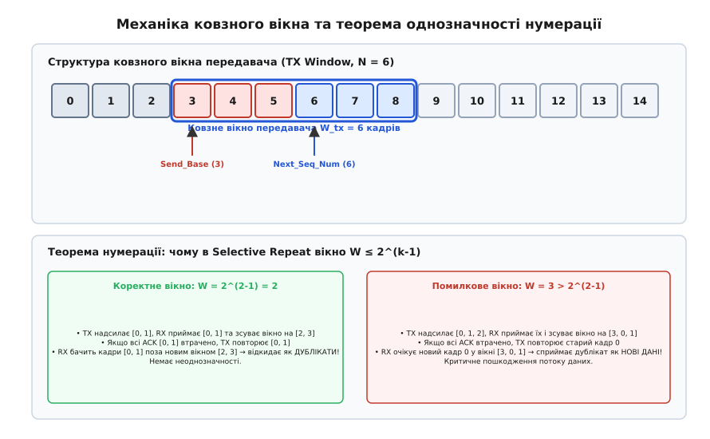
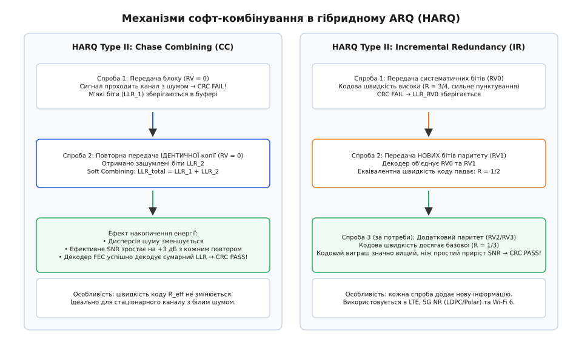
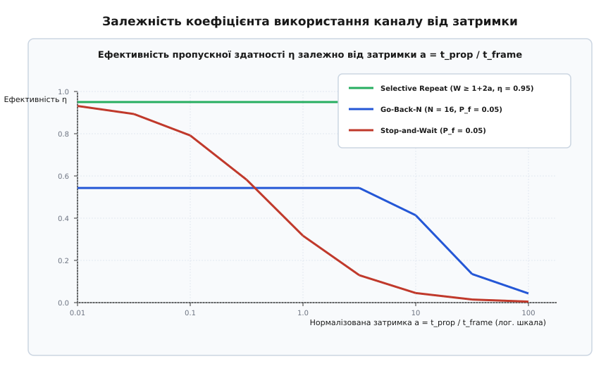

# ARQ: автоматичний запит на повтор

<preknowlist>
- [Контрольна сума CRC](book:communications/crc) — алгоритм поліноміального виявлення бітових помилок у кадрах.
- [Пряме виправлення помилок (FEC)](book:communications/fec-channel-coding) — відновлення спотворених бітів на приймачі через введення надлишковості.
- [Логарифмічне відношення правдоподібностей (LLR)](book:communications/log-likelihood-ratio) — представлення м'яких рішень демодулятора для софт-декодування.
- [Смуга і межа Шеннона](book:communications/bandwidth-capacity) — теоретична границя пропускної здатності зашумленого каналу.
</preknowlist>

Коли цифровий передавач випромінює послідовність імпульсів у мідну кручену пару, оптоволокно чи радіоефір, фізичний сигнал неминуче спотворюється тепловим шумом, інтерференцією та дисперсією. Якщо рівень завади перевищує захисний інтервал демодулятора, окремі біти інвертуються. Обчислення контрольної суми CRC на приймачі дозволяє надійно зафіксувати наявність пошкодженого біта, проте саме по собі виявлення помилки не повертає втрачену інформацію: приймач змушений відкинути спотворений блок, створюючи розрив у потоці даних прикладного застосунку.

Якщо пряме виправлення помилок (FEC) не здатне відновити блок через надмірну глибину спотворень, єдиним фізичним способом гарантувати абсолютну цілісність даних залишається побудова зворотного каналу зв'язку. Приймач інформує передавача про статус кожного надісланого кадру, а передавач автоматично повторює відправку тих блоків, які не дійшли до адресата. 

Цей клас алгоритмів дістав назву **автоматичного запиту на повтор** (англ. *Automatic Repeat reQuest*, ARQ, від лат. *repetere* — повторювати та *quaerere* — запитувати, шукати).

---

## Фізичний бюджет часу та нормалізована затримка каналу

Щоб оцінити продуктивність будь-якої схеми повторної передачі, необхідно розділити повний час доставки пакета на дві фундаментальні фізичні складові: час випромінювання та час поширення хвилі в просторі.

Нехай передавач надсилає кадр довжиною `L` бітів у канал із бітовою швидкістю `R` біт/с. Фізична довжина лінії зв'язку між вузлами становить `d` метрів, а швидкість поширення електромагнітного фронту в середовищі дорівнює `v` (для вакууму та повітря `v ≈ 3·10⁸` м/с, для мідного кабелю та кварцового оптоволокна `v ≈ 2·10⁸` м/с):

1. **Час випромінювання кадру (`t_frame` або `t_tx`):** тривалість утримання фізичного інтерфейсу передавачем для послідовного виштовхування всіх `L` бітів:
```
t_frame = L / R
```
Для кадру довжиною `1500` байтів (`12 000` бітів) на каналі `100` Мбіт/с час випромінювання становить `12 000 / 10⁸ = 120` мкс.

2. **Час поширення сигналу (`t_prop` або `t_p`):** затримка проходження хвилі через фізичне середовище:
```
t_prop = d / v
```
Для оптоволоконного кабелю довжиною `3000` км між дата-центрами час поширення становить `3 000 000 / (2·10⁸) = 15` мс (`15 000` мкс).

3. **Затримка кругового обігу (англ. *Round-Trip Time*, `RTT`):** інтервал від початку передачі першого біта кадру до моменту отримання квитанції підтвердження `ACK`:
```
RTT = t_frame + 2 · t_prop + t_proc + t_ack
```
де `t_proc` — час перевірки CRC та апаратної обробки на приймачі, а `t_ack` — час випромінювання короткого службового пакета `ACK`. Оскільки `t_proc` і `t_ack` зазвичай становлять частки мікросекунди, ними часто нехтують: `RTT ≈ t_frame + 2 · t_prop`.

Ключовою характеристикою каналу є безрозмірний параметр **нормалізованої затримки** `a`:

```
a = t_prop / t_frame = (d · R) / (v · L)
```

Параметр `a` відображає просторову місткість каналу: скільки пакетів даних може одночасно летіти вздовж кабелю або радіотраси в один бік. Якщо `a << 1` (короткий шлейф між платами на столі), час поширення мізерний, і передавач дізнається про долю кадру майже миттєво. Якщо `a >> 1` (супутниковий ретранслятор або трансконтинентальна магістраль), канал перетворюється на довгий конвеєр, здатний утримувати тисячі пакетів одночасно. Добуток `BDP = R · RTT` називають **добутком пропускної здатності на затримку** (англ. *Bandwidth-Delay Product*).

Коефіцієнтом використання каналу (англ. *Channel Utilization* або *Throughput Efficiency*, `η`) називають частку часу, протягом якої канал передає виключно корисні непомилкові дані:

```
η = t_frame / T_avg
```
де `T_avg` — повний середній час, витрачений на гарантовану доставку одного кадру з урахуванням усіх очікувань та повторних спроб.


*Порівняння поведінки Stop-and-Wait, Go-Back-N та Selective Repeat у часі: реакція на пошкодження кадру, величина простою передавача та робота буфера приймача.*

---

## Stop-and-Wait ARQ: строга черга та ціна простою

Найпростішою схемою забезпечення надійності є протокол **Stop-and-Wait** («Зупинись і чекай»).

Алгоритм передавача:
1. Надіслати один кадр даних;
2. Повністю зупинити передачу та запустити таймер очікування повтору (англ. *Retransmission Timeout*, `RTO`);
3. Якщо до спливання `RTO` надійшов позитивний відгук (англ. *Acknowledgment*, `ACK`), перейти до наступного кадру;
4. Якщо таймер сплив або отримано негативний відгук (англ. *Negative Acknowledgment*, `NACK`), повторно надіслати той самий кадр і перезапустити таймер.

### Проблема втрати підтвердження та протокол чергування бітів

Якщо прямий кадр дійшов неушкодженим, але зворотний пакет `ACK` загубився через шум у лінії, передавач після спливання `RTO` надішле дублікат кадру. Якщо кадри не мають нумерації, приймач сприйме дублікат як абсолютно нові дані і двічі запише їх у вихідний потік.

Щоб розрізняти новий блок і повтор попереднього, кадри маркують номером послідовності (англ. *Sequence Number*, `Seq`). Оскільки в протоколі Stop-and-Wait у каналі одночасно перебуває не більше одного непідтвердженого кадру, для однозначного розрізнення двох сусідніх станів достатньо рівно **1 біта** нумерації (значення `0` та `1`).

Цей механізм називають **протоколом чергування бітів** (англ. *Alternating Bit Protocol*):
- Передавач надсилає кадр `Seq = 0` і чекає на `ACK 0`;
- Приймач очікує `Seq = 0`. Отримавши його, він передає дані додатку, повертає `ACK 0` і перемикає очікування на `Seq = 1`;
- Якщо повторний кадр `Seq = 0` приходить знову (через втрату першого `ACK 0`), приймач бачить, що номер не збігається з очікуваним `Seq = 1`. Він відкидає тіло кадру без передачі додатку, але повторно відправляє `ACK 0`, щоб розблокувати завислий передавач;
- Отримавши `ACK 0`, передавач перемикається на відправку кадру `Seq = 1`.

### Аналіз ефективності Stop-and-Wait

У каналі без втрат повний час передачі одного кадру дорівнює:
```
T_0 = t_frame + 2 · t_prop = t_frame · (1 + 2·a)
```

Якщо ймовірність спотворення або втрати кадру становить `P_f`, середня кількість спроб передачі одного блока описується геометричним розподілом із математичним сподіванням `E[K] = 1 / (1 - P_f)`. Середній сумарний час доставки одного кадру:

```
T_avg = E[K] · T_0 = t_frame · (1 + 2·a) / (1 - P_f)
```

Коефіцієнт використання каналу Stop-and-Wait:

```
η_SW = t_frame / T_avg = (1 - P_f) / (1 + 2·a)
```

При великих затримках поширення (`a >> 1`) ефективність Stop-and-Wait стрімко падає як `1 / (2·a)`. Наприклад, на супутниковому лінку з `a = 100` ефективність становить менше `0.5%`: передавач вимушений простоювати 99.5% часу, навіть якщо лінія фізично вільна.

---

## Go-Back-N ARQ: конвеєрна передача з груповим відкатом

Для подолання простою Stop-and-Wait застосовують концепцію **ковзного вікна** (англ. *Sliding Window*). Передавач має право випромінювати до `N` кадрів поспіль без очікування підтвердження на кожен із них.

У протоколі **Go-Back-N** (GBN, «Повернення на N кроків назад»):
- Передавач підтримує вікно розміром `N` кадрів. Базовий номер найстарішого непідтвердженого кадру позначається `Send_Base`, а номер наступного готового до відправки блока — `Next_Seq_Num`;
- Передавач безперервно шле кадри, поки виконується умова `Next_Seq_Num < Send_Base + N`;
- **Приймач має нульовий буфер не за порядком (Zero out-of-order buffer):** він приймає виключно кадр із суворо очікуваним номером `R_expected`. Усі кадри, що прийшли після пропущеного або спотвореного, приймач негайно **відкидає без збереження**;
- Приймач використовує **кумулятивні підтвердження** (англ. *Cumulative ACK*): повідомлення `ACK k` означає, що всі кадри з номерами до `k` включно успішно прийняті та передані додатку.

```
       TX (Вікно N = 4)                                        RX (R_expected = 1)
       │                  Кадр 0 (OK)                          │
       ├──────────────────────────────────────────────────────►│ -> ACK 0
       │                  Кадр 1 (ВТРАЧЕНО)   ×                │
       ├─── ── ── ── ── ── ── ── ── ── ── ── ── ── ── ── ── ──►│ (пропуск кадру 1)
       │                  Кадр 2 (OK)                          │
       ├──────────────────────────────────────────────────────►│ Відкинуто! (очікується 1)
       │                  Кадр 3 (OK)                          │
       ├──────────────────────────────────────────────────────►│ Відкинуто! (очікується 1)
       │                                                       │
       │ [Таймаут RTO для Кадру 1 спливає на TX!]              │
       │                                                       │
       │     Груповий відкат: повтор кадрів 1, 2, 3, 4         │
       ├──────────────────────────────────────────────────────►│
```

### Поведінка при збої та ціна групового відкату

Якщо кадр `k` спотворюється завадою, приймач відкидає сам кадр `k`, а також усі наступні кадри `k+1, k+2, ..., k+N-1`, які передавач уже встиг виштовхнути в канал. По закінченню єдиного таймауту `RTO(k)` передавач відкочується назад до `Send_Base = k` і **повторно передає всю пачку з `N` кадрів**.

Якщо розмір вікна `N` обрано оптимальним для повного покриття затримки (`N ≥ 1 + 2·a`), за відсутності помилок лінія завантажена на 100%. Проте кожна помилка вимагає повторної передачі `N` кадрів. Ефективність Go-Back-N виражається формулою:

```
η_GBN = (1 - P_f) / (1 + (N - 1) · P_f)        [за умови N ≥ 1 + 2·a]
```

Якщо ймовірність помилки `P_f` стає відчутною (наприклад, `P_f = 0.05`), а розмір вікна великий (`N = 100`), знаменник зростає до `1 + 99 · 0.05 = 5.95`, і ефективність падає до `16%`. Go-Back-N катастрофічно деградує в каналах із високим добутком `BDP` та нестабільним рівнем завад.

---

## Selective Repeat ARQ: вибіркова буферизація

Протокол **вибіркового повтору** (англ. *Selective Repeat*, SR) усуває марні повторні передачі неушкоджених блоків шляхом введення оперативної пам'яті на стороні одержувача.

Приймач обладнується **буфером упорядкування** (англ. *Reordering Buffer*) розміром `W_rx`:
- Якщо кадр `k` втрачено, але наступні кадри `k+1, k+2` прийшли без пошкоджень, приймач **зберігає їх у буфері**;
- Приймач надсилає **вибіркові підтвердження** (англ. *Selective Acknowledgment*, `SACK` або індивідуальні `ACK`);
- Передавач повторює **виключно втрачений кадр `k`**, не чіпаючи вже доставлені блоки;
- Щойно втрачений кадр `k` успішно прибуває після повтору, приймач вишиковує кадри `k, k+1, k+2` у строгій послідовності та одним масивом видає їх прикладній програмі, зсуваючи вікно прийому вперед.

За умови `W_tx ≥ 1 + 2·a` передавач ніколи не зупиняє конвеєр, а кожен кадр передається в середньому `1 / (1 - P_f)` разів. Ефективність Selective Repeat є максимально теоретично досяжною для чистих протоколів повтору:

```
η_SR = 1 - P_f
```
Ефективність Selective Repeat **взагалі не залежить від фізичної затримки `a`**, доки розмір вікна достатній для заповнення лінії.

> Повний математичний вивід формул пропускної здатності `η_SW`, `η_GBN`, `η_SR`, розрахунок квантилів випадкової затримки доставки та аналіз блокування початку черги (Head-of-Line Blocking) наведено у вставці [🧮 Виведення формул ефективності та пропускної здатності протоколів ARQ](book:communications/arq/math-throughput-efficiency.md).


*Структура ковзного вікна передавача та приймача і демонстрація виникнення колізії нумерації при розмірі вікна W > 2^(k-1).*

### Теорема про розмір вікна та колізію номерів

Оскільки номери послідовності кодуються фіксованою кількістю `k` бітів у заголовку кадру, нумерація здійснюється за модулем `2^k` (діапазон `0, 1, ..., 2^k - 1`).

При циклічному переході через нуль (англ. *Sequence Number Wrap-Around*) виникає небезпека неоднозначності: приймач може сплутати повтор старого кадру з новим кадром із наступного кола нумерації.

Розгляньмо приклад: `k = 2` біти (номери `0, 1, 2, 3`), розмір вікна `W = 3`:
1. Передавач відправляє кадри `0, 1, 2`;
2. Приймач успішно приймає всі три кадри, видає їх додатку, зміщує своє вікно на номери `[3, 0, 1]` і надсилає підтвердження `ACK 0, ACK 1, ACK 2`;
3. Усі три пакети `ACK` губляться в каналі через сплеск завади;
4. Передавач за таймаутом повторно надсилає старий кадр `0`;
5. Приймач бачить кадр `0`. Але номер `0` входить у його нове вікно `[3, 0, 1]` як новий очікуваний кадр! Приймач записує старий дублікат замість свіжих даних, спричиняючи непоправне пошкодження файлу.

Щоб нове вікно приймача за жодних умов не перекривалося зі старим вікном передавача, сума розмірів вікон повинна задовольняти строгу нерівність:

```
W_tx + W_rx ≤ 2^k
```

Оскільки в Selective Repeat вікна зазвичай вибирають однаковими (`W_tx = W_rx = W`), граничний розмір вікна становить:

```
W ≤ 2^(k-1)                                     [для Selective Repeat]
```

Для Go-Back-N, де приймач має вікно `W_rx = 1`, обмеження становить:

```
W_tx ≤ 2^k - 1                                  [для Go-Back-N]
```

> Програмну реалізацію дискретно-подійного симулятора трьох протоколів на C та C++, порівняльний аналіз розподілу затримок та алгоритми беззнакової модульної перевірки номерів послідовності викладено у вставці [⚙️ Дискретно-подійний симулятор протоколів ARQ](book:communications/arq/proj-arq-simulator.md).

---

## Гібридний ARQ (HARQ): об'єднання софт-рішень і повторів

Класичний ARQ має фундаментальну ваду: він працює з дискретними бітами після жорсткого рішення демодулятора (Hard Decision). Якщо в пакеті з 10 000 бітів спотворено лише 5 бітів, перевірка CRC бракує весь кадр, а приймач повністю викидає 99.95% коректно прийнятої енергії сигналу.

**Гібридний ARQ** (англ. *Hybrid ARQ*, HARQ) об'єднує канальне кодування FEC із протоколом повторної передачі на фізичному рівні (PHY/MAC). Замість знищення пошкодженого блоку приймач зберігає м'які некодовані вибірки — логарифмічні відношення правдоподібності (англ. *Log-Likelihood Ratio*, LLR) кожного біта — у спеціальному **софт-буфері** (англ. *Soft Buffer*).


*Порівняння Chase Combining (накопичення енергії LLR) та Incremental Redundancy (динамічне зниження швидкості коду через передачу нових бітів паритету).*

### 1. HARQ Type I: просте поєднання FEC та ARQ
Блок кодується кодом виправлення помилок із додаванням CRC. Приймач намагається декодувати пакет. Якщо декодер FEC не впорався, пакет відкидається (буфер очищається), а передавачеві надсилається запит на чистий повтор. Виграш забезпечується лише за рахунок виправної здатності коду FEC.

### 2. HARQ Type II: Chase Combining (CC)
При першій невдалій спробі вектор `LLR_1` зберігається в пам'яті. Передавач надсилає **абсолютно ідентичну копію** кодового слова. Приймач виконує поелементне додавання м'яких рішень (Soft Combining):

```
LLR_total(b_i) = LLR_1(b_i) + LLR_2(b_i)
```

Оскільки корисні сигнали двох спроб складаються когерентно за фазою, а некорельований білий шум додається за потужністю, кожне повторення збільшує ефективне відношення сигнал/шум на:

```
SNR_eff = 2 · SNR_0  (+3.01 дБ енергетичного приросту)
```
Після 2–3 об'єднань навіть дуже слабкий зашумлений сигнал накопичує достатньо енергії для безпомилкового декодування.

### 3. HARQ Type II: Incremental Redundancy (IR)
Найдосконаліший метод, прийнятий у стандартах LTE, 5G NR та Wi-Fi 6. 

Початковий інформаційний блок кодується низькошвидкісним материнським кодером LDPC або Turbo (наприклад, із базовою швидкістю `R = 1/3` або `1/5`). Сформовані біти записуються в круговий буфер:
- **Спроба 1 (RV0):** передаються переважно систематичні (інформаційні) біти з високою еквівалентною швидкістю `R ≈ 3/4` (сильне пунктування);
- **Спроба 2 (RV2):** якщо виникла помилка, передавач шле **не копію**, а раніше відкинуті паритетні перевірочні біти;
- Приймач об'єднує обидва блоки, знижуючи ефективну швидкість коду до `R ≈ 1/2`. 

Кодовий виграш від розширення бази перевірок значно перевищує простий енергетичний приріст Chase Combining. HARQ-IR автоматично підлаштовує надлишковість під канал: у гарних умовах пакети летять на максимальній швидкості `R = 3/4`, а при погіршенні зв'язку система автоматично досилає потрібну кількість паритету.

> Детальну структуру дескрипторів HARQ, правила перемикання прапорця NDI, розмітку кругового буфера LBRM та регістровий інтерфейс обміну MAC-PHY наведено у вставці [📋 Інтерфейс та структури керування HARQ у стеках 3GPP (MAC/PHY)](book:communications/arq/api-harq-mac.md).


*Залежність коефіцієнта використання каналу η від нормалізованої затримки a = t_prop / t_frame для трьох класичних схем ARQ при 5% рівні помилок.*

---

---

## Анатомія протокольних заголовків та формати керуючих повідомлень

У класичних канальних протоколах зв'язку (HDLC за стандартом ISO 13239, PPP, IEEE 802.2 LLC Type 2, AX.25 у радіоаматорських та супутникових мережах) структура кадру проектується так, щоб одночасно нести корисні дані та виконувати зворотне підтвердження в зустрічному напрямку (англ. *Piggybacking*).

Усі кадри канального рівня поділяються на три функціональні типи:

```
            ┌──────────────────────────────────────────────────┐
            │          Структура кадру стандарту HDLC          │
            ├────────┬────────┬─────────┬────────┬───────┬─────┤
            │  Flag  │Address │ Control │ Payload│  FCS  │Flag │
            │ (0x7E) │ (8/16) │ (8/16)  │ (Data) │(16/32)│(0x7E│
            └────────┴────────┴────┬────┴────────┴───────┴─────┘
                                   │
       ┌───────────────────────────┴───────────────────────────┐
       ▼                                                       ▼
1. Інформаційний кадр (I-frame):   [ 0 |  N(S): 3 біти | P/F |  N(R): 3 біти ]
2. Супервізорний кадр (S-frame):   [ 1 | 0 | Type: 2б  | P/F |  N(R): 3 біти ]
3. Ненумерований кадр (U-frame):   [ 1 | 1 | Type: 5б  | P/F | Modifier: 3б  ]
```

### Призначення та семантика полів

1. **Інформаційні кадри (I-frames):** переносять корисні дані вищого рівня. Поле керування містить два незалежні лічильники:
   - `N(S)` (Send Sequence Number) — порядковий номер цього кадру, що випромінюється в лінію;
   - `N(R)` (Receive Sequence Number) — номер наступного кадру, який передавач очікує отримати у зустрічному напрямку. Тобто передача даних одночасно підтверджує всі зустрічні кадри з номерами до `N(R) - 1` (кумулятивне попутне підтвердження, Piggybacked ACK).
2. **Супервізорні кадри (S-frames):** не містять поля корисних даних і використовуються виключно для сигналізації стану протоколу ARQ та керування потоком:
   - **`RR` (Receive Ready, тип `00`):** позитивне підтвердження. Повідомляє, що вузол готовий приймати кадри, починаючи з номера `N(R)`;
   - **`RNR` (Receive Not Ready, тип `10`):** позитивне підтвердження до `N(R) - 1`, але з одночасним сповіщенням про **тимчасове переповнення буфера приймача**. Передавач зобов'язаний призупинити випромінювання нових даних до отримання наступного кадру `RR`;
   - **`REJ` (Reject, тип `01`):** запит на груповий відкат у протоколі Go-Back-N. Вимагає повторної передачі всіх кадрів, починаючи з номера `N(R)`;
   - **`SREJ` (Selective Reject, тип `11`):** вибірковий запит у протоколі Selective Repeat. Вимагає повторної передачі виключно одного кадру `N(R)`, не зачіпаючи решту збережених блоків.
3. **Біт опитування та фіналу (`P/F`, Poll/Final):**
   - Встановлений біт `P = 1` від джерела вимагає від приймача негайної передачі службової відповіді (примусова синхронізація станів при підозрі на втрату зв'язку);
   - Відповідь приймача містить біт `F = 1`, що підтверджує отримання запиту та фіксує точний поточний стан лічильників.

---

## Керування потоком даних: Вікно каналу проти вікна приймача

У реальних мережах швидкість передавача часто перевищує обчислювальні можливості приймача або швидкість вичитування даних прикладним процесом (проблема Producer-Consumer). Якщо приймач зайнятий обробкою важкої задачі, його системний буфер швидко заповнюється.

Протокол ARQ вирішує дві принципово різні задачі:
1. **Забезпечення надійності (Error Control):** гарантія доставки попри фізичні завади в середовищі (затримка `t_prop`, втрати `P_f`);
2. **Керування потоком (Flow Control):** захист оперативної пам'яті приймача від переповнення.

Для узгодження цих задач вікно передавача динамічно обмежується мінімумом із двох величин:

```
W_effective = min ( W_channel, W_receiver )
```
де `W_channel = 1 + 2·a` — місткість фізичного каналу («труби»), а `W_receiver` — оголошений приймачем розмір вільного місця в буфері (англ. *Advertised Window*, `rwnd`).

```
       Передавач (TX)                                          Приймач (RX)
       │                  Кадр 0..3 (Повний буфер)             │
       ├──────────────────────────────────────────────────────►│ (Буфер заповнено на 100%!)
       │◄──────────────────────────────────────────────────────┤
       │             ACK 4, Advertised Window = 0              │ (Вікно зачинено: rwnd = 0)
       │                                                       │
       │ [TX переходить у стан очікування (Zero-Window Probe)] │
       │                                                       │
       │                  Службовий зонд (Probe)               │ (Перевірка стану)
       ├──────────────────────────────────────────────────────►│
       │◄──────────────────────────────────────────────────────┤
       │             ACK 4, Advertised Window = 8              │ (Додаток вичитав дані: rwnd = 8)
       │                                                       │
       │ [TX відновлює передачу нових блоків]                  │
       ├──────────────────────────────────────────────────────►│
```

Якщо приймач повертає `rwnd = 0` (нульове вікно), передавач повністю зупиняє роботу. Щоб уникнути взаємного блокування (якщо пакет із новим ненульовим вікном загубиться), передавач запускає **таймер зондування** (англ. *Persist Timer*) і періодично надсилає короткі 1-байтові зондувальні пакети (англ. *Zero-Window Probes*), змушуючи приймач сповіщати про поточний стан пам'яті.

### Синдром дурного вікна (Silly Window Syndrome) та евристики Кларка і Нейгла

Якщо керування потоком реалізовано наївно, протокол ковзного вікна потрапляє в пастку **синдрому дурного вікна** (англ. *Silly Window Syndrome*, SWS):
- Додаток приймача повільно вичитує дані з буфера крихітними порціями (наприклад, по 1 байту через виклик `getc()`);
- Приймач щоразу генерує підтвердження `ACK` з оголошеним вікном `rwnd = 1` байт;
- Передавач негайно формує повнорозмірний канальний кадр, де 40 байтів заголовків (IP + TCP/HDLC) обслуговують **1 байт корисного навантаження**. Пропускна здатність лінії падає в 40 разів через домінування службового оверхеду.

Для ліквідації цього дефекту застосовують дві взаємодоповнюючі евристики:
1. **Рішення Кларка на приймачі (Clark's Solution):** приймач зобов'язаний тримати вікно зачиненим (`rwnd = 0`), поки в буфері не звільниться значний простір — щонайменше максимальний розмір сегмента `MSS` (Maximum Segment Size) або половина повної місткості буфера `Buffer_Capacity / 2`;
2. **Алгоритм Нейгла на передавачі (Nagle's Algorithm):** передавач забороняє відправку дрібних пакетів (менших за `MSS`), якщо в каналі вже є хоча б один раніше відправлений непідтверджений кадр. Передавач накопичує байти в локальному буфері, поки або не назбирається повний `MSS`, або не надійде `ACK` на попередній блок.


---

## Дворівневий захист: Синергія PHY/MAC HARQ та L2/L4 ARQ

У сучасних високошвидкісних радіоінтерфейсах (LTE, 5G NR, Wi-Fi 6/7) надійність забезпечується не одним універсальним протоколом, а **дворівневою ієрархічною системою повторів**.

Чому одного рівня недостатньо:
- **Чому не можна обмежитися лише HARQ на рівні PHY:** Для забезпечення ультранизької затримки фізичний рівень обмежує максимальну кількість спроб софт-комбінування (типово `M_max = 4`). Коли ліміт вичерпано, блок остаточно бракується. Залишкова ймовірність втрати після HARQ становить `Residual BLER ≈ 0.1–1%` (`10⁻³ .. 10⁻²`), що неприпустимо багато для файлових та фінансових протоколів (яким потрібна надійність на рівні `10⁻⁶ .. 10⁻⁹`).
- **Чому не можна обмежитися лише класичним ARQ на вищому рівні:** Зворотний зв'язок на вищих рівнях (RLC або TCP) вимагає проходження всього стека ядра та черг планувальника, маючи часовий цикл `RTT ≈ 20–50` мс. Якби кожна звичайна поодинока завада виправлялася через RLC/TCP, передавач постійно скидав би швидкість, а мережа втрачала б до 90% пропускної здатності.

```
┌─────────────────────────────────────────────────────────────────────────────┐
│                      Рівень L4 / L2: Довгий цикл ARQ                        │
│   - Протоколи: RLC AM (Radio Link Control) / TCP SACK                       │
│   - Одиниці: Логічні пакети та байти (Zero-loss guarantee)                  │
│   - Затримка зворотного зв'язку: RTT_L2 ≈ 20–50 мс                          │
│   - Частота спрацьовування: Рідко (лише при пробої HARQ, P_loss ≈ 0.1%)     │
└──────────────────────────────────────┬──────────────────────────────────────┘
                                       │ (Передає залишковий потік без втрат)
┌──────────────────────────────────────▼──────────────────────────────────────┐
│                      Рівень L1 / MAC: Швидкий контур HARQ                   │
│   - Протоколи: Multi-Process Stop-and-Wait з Incremental Redundancy         │
│   - Одиниці: Апаратні транспортні блоки з LLR софт-комбінуванням            │
│   - Затримка зворотного зв'язку: RTT_PHY ≈ 0.5–2 мс                         │
│   - Частота спрацьовування: Часто (гасить 99% завад за 1–2 мілісекунди)     │
└─────────────────────────────────────────────────────────────────────────────┘
```

Ця взаємодія створює синергетичний ефект:
1. Апаратний контур HARQ миттєво (за частки мілісекунди) гасить 99% типових завад безпосередньо в радіотрансивері, утримуючи видимий рівень втрат для вищих рівнів на рівні `0.1%`;
2. Протокол верхнього рівня (RLC AM у стільникових мережах або TCP SACK в Інтернеті) спокійно страхує лінію від залишкових рідкісних збоїв, гарантуючи 100% збереження цілісності файлів без ризику хибного падіння вікна перевантаження TCP (Congestion Window Collapse).

---

## Супутникові та міжпланетні лінії: Протоколи великої затримки

В умовах космічного зв'язку (міжпланетні апарати NASA/ESA, супутникові угруповання на геостаціонарних та високих еліптичних орбітах) фізична затримка поширення сигналу набуває екстремальних значень:
- Геостаціонарна орбіта (GEO, `d ≈ 36 000` км): затримка в один бік `t_prop ≈ 120–140` мс, повний `RTT ≈ 250–500` мс;
- Місячні місії (Artemis, `d ≈ 384 000` км): затримка в один бік `t_prop ≈ 1.3` с, `RTT ≈ 2.6` с;
- Марсіанські місії (Mars Rover, `d = 55 .. 400` млн км): затримка в один бік `t_prop` становить від `3` до `22` хвилин (`RTT` до `44` хвилин).

### Чому класичний ARQ ламається в глибокому космосі

При затримці `RTT = 40` хвилин передача за схемою Stop-and-Wait означає, що відправивши один пакет, станція на Землі чекатиме квитанції майже три чверті години. Навіть при використанні Selective Repeat розмір вікна `W = 1 + 2·a` для гігабітного лінка зажадав би виділення сотень гігабайтів оперативної пам'яті під непідтверджені дані, а будь-який збій зв'язку через обертання планети блокував би всю чергу.

Для таких екстремальних умов Консультативний комітет з космічних систем передачі даних (CCSDS) розробив спеціалізовані протоколи:

1. **Протокол CCSDS Proximity-1:** канальний протокол для зв'язку між орбітальним апаратом-ретранслятором та спускним марсоходом. Використовує адаптивний Go-Back-N зі статичним вікном та жорстким таймінгом сесій;
2. **Мережі, стійкі до затримок (Delay-Tolerant Networking, DTN):**
   - Замість наскрізного інтерактивного сеансу зв'язку використовується протокол зв'язок-пучків (англ. *Bundle Protocol*, RFC 5050 / RFC 9171);
   - Застосовується концепція **збереження та передачі під відповідальність** (англ. *Custody Transfer*): проміжний супутник-ретранслятор приймає блок даних, записує його в енергонезалежну пам'ять (Flash/SSD), бере на себе повну юридичну відповідальність за його збереження і надсилає локальне підтвердження джерелу;
   - Передача наступному вузлу здійснюється лише тоді, коли апарат виходить у зону прямої видимості іншого вузла (контактна маршрутизація).

---

## Енергетична ціна повторної передачі (Energy per Bit)

В автономних бездротових сенсорах (IoT, аграрні датчики, пристрої LoRaWAN, BLE-мітки) ключовим ресурсом є енергія літієвої батареї.

Кожна дія трансивера має чітку енергетичну вартість:
- Струм у режимі сну (Deep Sleep): `~1` мкА;
- Струм прийому (RX Mode): `~5–15` мА;
- Струм передавача (TX Mode, `+14` дБм): `~50–120` мА.

```
       Енергетичні витрати (E_bit)
       ▲
       │       / Чистий FEC (висока надлишковість постійно)
       │      /
       │     /        / Чистий ARQ (багаторазові повтори)
       │    /        /
       │   /   Optimal HARQ
       │  /  ┌──────┴──────┐
       │ /   │             │
       │/────┴─────────────┴────────► Рівень завад (BER / SNR)
```

Інженерний вибір між чистим кодуванням FEC, чистим ARQ та гібридним HARQ визначається точкою мінімуму сумарної енергії на біт корисної інформації:

1. **Чистий FEC:** вимагає постійної передачі надлишкових бітів паритету (наприклад, кодова швидкість `R = 1/2` подвоює час роботи передавача), навіть коли канал абсолютно чистий. Це призводить до невиправданого перевитрати заряду акумулятора в 95% штатного часу.
2. **Чистий ARQ:** передає рівно нуль надлишкових бітів у чистому каналі. Проте при появі глибоких завад повторне надсилання повних пакетів багаторазово активує енергоємний підсилювач потужності (PA).
3. **Гібридний ARQ (HARQ):** забезпечує мінімальне енергоспоживання завдяки адаптивності: у гарних умовах пакети летять без надлишковості, а при заваді передається лише мінімальна доза м'якого паритету, що дозволяє демодулятору закрити пакет без повторного повного випромінювання.


Вибір архітектури повторної передачі визначається фізичними обмеженнями каналу та вимогами застосунку до затримки і пам'яті.

| Протокол / Стандарт | Рівень стека | Застосована схема ARQ | Розмір вікна / Процеси | Особливості реалізації |
| :--- | :--- | :--- | :--- | :--- |
| **I2C / SMBus** | Фізичний / Канальний | Stop-and-Wait | `N = 1` біт ACK | Побайтове апаратне підтвердження формуванням низького рівня на лінії SDA під час 9-го такту SCL. |
| **Wi-Fi (802.11ax/be)** | MAC | Selective Repeat (Block Ack) | Вікно до `64–256` MPDU | Агрегація кадрів A-MPDU зі спільним 64/256-бітовим рапортом BlockAck. |
| **LTE / 5G NR (PHY/MAC)** | L1 / L2 | HARQ-IR / HARQ-CC | `8–16` паралельних процесів SAW | Апаратне LLR софт-комбінування LDPC/Turbo блоків з таймінгом відгуку `0.5–4` мс. |
| **LTE / 5G NR (RLC)** | L2 | Selective Repeat (RLC AM) | Вікно `512–4096` SN | Страхувальний повільний протокол для виправлення залишкових помилок після вичерпання ліміту HARQ. |
| **TCP (RFC 2018)** | Транспортний (L4) | Selective Repeat (SACK) | Байт-орієнтоване вікно до 1 ГБ | Вибіркові діапазони підтверджених байтів в опціях TCP заголовка для усунення зайвих ретрансмісій. |
| **CCSDS / Space Link** | Космічний зв'язок | Go-Back-N / Proximity-1 | Статичне вікно `N = 8..128` | Використовується на міжпланетних лінках із гігантськими `RTT` (хвилини та години) у поєднанні з Proximity-1. |

> 🔧 **Навіщо це.**
> У розробці вбудованих радіосистем (прошивки телеметрії дронів, LoRa/NRF трансивери, промислові бездротові мережі) типовою помилкою є спроба реалізувати Stop-and-Wait «для простоти». На швидкості 1 Мбіт/с і дальності 500 м передача кадру 128 байтів займає 1 мс, а час очікування відповіді з урахуванням обробки в RTOS досягає 10 мс (`a = 10`). У результаті розробник отримує реальну швидкість не 1 Мбіт/с, а лише 90 кбіт/с.
> 
> Перехід на ковзне вікно Selective Repeat розміром 16 пакетів негайно піднімає корисну швидкість до 950 кбіт/с. Якщо ж лінія працює в умовах сильних індустріальних завад, впровадження найпростішого софт-комбінування Chase Combining у буфері демодулятора знижує число потрібних повторів у 3–4 рази, заощаджуючи заряд акумулятора автономного вузла.
