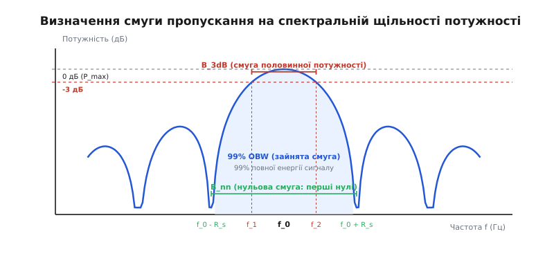
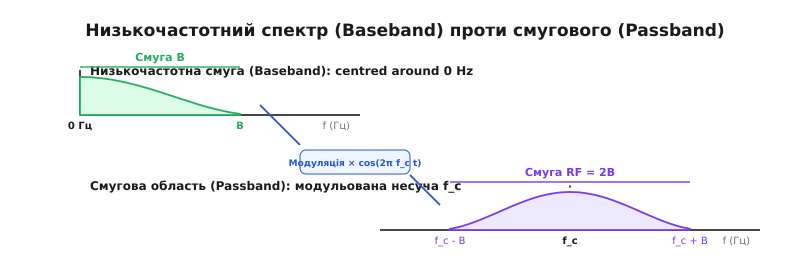
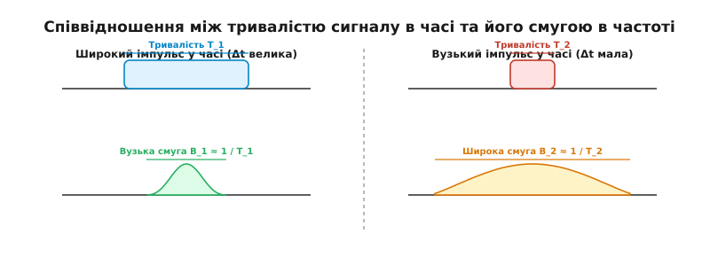

# Смуга пропускання

<preknowlist>
- [Найквіст і аліасинг](topic:communications/nyquist-aliasing) — дискретизація сигналу та теорема Найквіста.
- [Потужність і децибели](topic:communications/power-decibels) — логарифмічна шкала вимірювання відношень потужності та напруги.
- [База й смугова область](topic:communications/baseband-passband) — низькочастотне та квадратурне подання сигналів.
</preknowlist>

Коли прямокутний цифровий імпульс тривалістю 1 мікросекунда подають у мідний коаксіальний кабель довжиною 100 метрів, на протилежному кінці замість чіткого прямокутного перепаду з'являється похила хвилька з розмитими фронтами та закругленими вершинами. Коротші імпульси тривалістю 10 наносекунд на такій самій відстані взагалі втрачають амплітуду й зливаються в суцільний шум. Мідна жила, паразитна ємність ізоляції та індуктивність провідника чинять опір миттєвій зміні напруги: електричне коло затримує вищі гармоніки сигналу й пропускає лише вузький інтервал частот.

Кожен фізичний канал зв'язку — від витої пари й оптичного волокна до атмосферного радіоефіру та ультразвукового середовища у воді — діє як вибірковий частотний бар'єр. Інтервал частот, у межах якого система здатна передавати енергію сигналу без неприпустимого згасання чи спотворення, називають **смугою пропускання** (англ. *bandwidth*, від латинського *banda* — смуга, стрічка, та *frequentia* — частота повторення).

Ширина цієї смуги `B = f_high - f_low` вимірюється в герцах (Гц) і є головним ресурсом будь-якої телекомунікаційної чи вимірювальної системи. Саме вона визначає, скільки незалежних змін напруги чи поля може відбутися за одну секунду, і становить фізичну основу для швидкості передачі даних.

```
       Низькочастотний канал (Baseband):          Смуговий канал (Passband):

       ^ H(f)                                     ^ H(f)
  1.0  +---------\                           1.0  +     /-----\
       |         \                                |    /       \
  0.707+..........`\ (3 дБ)                  0.707+.../.........`\ (3 дБ)
       |            \                             |  /           \
       +-------------+------> f (Гц)              +--+-----------+----+--> f (Гц)
       0            f_c                           0 f_low       f_high
       <---- B ---->                                 <---- B ---->
```

## 1. Фізична суть: чому ефір і кола обмежують спектр

Будь-який реальний сигнал, що змінюється в часі `s(t)`, за математичною теоремою Фур'є можна розкласти на суму нескінченної кількості синусоїдальних коливань із різними частотами, амплітудами та фазами. Ідеальний прямокутний фронт імпульсу вимагає нескінченно широкого спектра: амплітуди вищих гармонік спадають повільно як `1 / k` (де `k` — номер гармоніки).

Коли сигнал проходить через фізичне середовище, виникають чотири фундаментальні фізичні обмеження:

### Скінченна швидкість перезаряду та паразитна ємність

Будь-який електричний провідник володіє погонною індуктивністю `L_0` (Гн/м), а між провідниками та землею існує паразитна ємність `C_0` (Ф/м). Заряджання та розряджання цієї ємності через активний опір провідника `R_0` (Ом/м) потребує часу `τ = R·C`. Швидкі зміни напруги (високі частоти) не встигають повністю зарядити ємність лінії за час одного біта, тому їхня амплітуда на виході стрімко прямує до нуля.

Хвильовий опір лінії `Z_0 = sqrt(L_0 / C_0)` визначає зв'язок між напругою та струмом хвиль, а постійна поширення `γ(f) = α(f) + j·β(f)` описує частотно-залежне згасання `α(f)` та фазовий зсув `β(f)`.

### Скін-ефект у металевих провідниках

На високих частотах струм у металевому провіднику витісняється до його зовнішньої поверхні. Глибина проникнення струму (скін-шар) обчислюється як:

```
δ = sqrt(1 / (π · f · μ · σ))
```

Де `μ` — магнітна проникність, а `σ` — провідність металу. 

Зі зростанням частоти `f` ефективний переріз провідника зменшується пропорційно `sqrt(f)`, що призводить до зростання активного опору лінії `R(f) ~ sqrt(f)`. Як наслідок, вищі частотні компоненти сигналу зазнають значно більшого згасання в мідному кабелі, ніж низькочастотні.

### Диелектричні втрати в ізоляції та волокні

В ізоляційних матеріалах кабелів (поліетилен, фторопласт) та у кварцовому склі оптичних волокон при проходженні змінних полів виникають диелектричні втрати, пропорційні тангенсу кута діелектричних втрат `tan(δ)` та частоті `f`. На НВЧ-частотах (понад 1 ГГц) саме діелектричні втрати стають головним фактором обмеження смуги пропускання.

### Дисперсія середовища та розширення імпульсів

В оптичному волокні або радіоканалі хвилі різних частот поширюються з різними фазовими швидкостями `v(f) = 2·π·f / β(f)`. Це явище називають **хроматичною або модовою дисперсією**.

Дисперсія призводить до того, що окремі спектральні компоненти одного й того самого імпульсу прибувають до приймача з різними затримками `τ_g(f) = -dφ/df` (групова затримка). У результаті вузький у часі світловий або радіоімпульс розмивається по мірі проходження вздовж лінії, накладаючись на сусідні символи.

Передавальна функція каналу `H(f) = |H(f)| · exp(j·φ(f))` повністю описує частотні властивості середовища. Її модуль `|H(f)|` визначає амплітудно-частотну характеристику (АЧХ), а фаза `φ(f)` — фазово-частотну характеристику (ФЧХ). Оскільки `|H(f)|` плавно спадає на краях, виникає потреба чітко визначити межі, де закінчується робоча смуга і починається зона згасання.

## 2. Формальні визначення смуги пропускання

Оскільки спектральна щільність потужності реальних сигналів та АЧХ реальних фільтрів спадають поступово, у радіотехніці та цифровій обробці сигналів використовують кілька формальних визначень смуги.


*Різновиди визначення смуги пропускання: смуга -3 дБ, нульова смуга та 99% зайнята смуга (OBW).*

### Смуга половинної потужності (-3 дБ)

Найпоширенішим у техніці є визначення смуги за рівнем половинної потужності, або смуга -3 дБ (`B_3dB`). Це частотний інтервал між межами `f_1` та `f_2`, на яких потужність сигналу або квадрат модуля АЧХ `|H(f)|^2` спадає у 2 рази порівняно з максимальним значенням у центрі смуги:

```
|H(f_1)|^2 = |H(f_2)|^2 = 0.5 · |H_max|^2
```

Оскільки потужність пропорційна квадрату напруги (`P ~ V^2`), спад потужності вдвічі відповідає зменшенню амплітуди напруги в `1 / sqrt(2) ≈ 0.7071` рази (або на -3.01 дБ у логарифмічній шкалі [децибел](topic:communications/power-decibels)):

```
20 · log10(V / V_max) = 20 · log10(1 / sqrt(2)) ≈ -3.0103 дБ
```

Для класичного аналогового RC-фільтра першого порядку частота зрізу -3 дБ обчислюється як:

```
f_3dB = 1 / (2 · π · R · C)
```

Детальну передісторію виникнення цієї логарифмічної межі висвітлено у вставці про [історію критерію -3 дБ](topic:communications/bandwidth/hist-3db-origin.md).

### Вплив типу та порядку фільтра на форму АЧХ

Ширина перехідної зони між смугою пропускання та смугою придушення залежить від математичного типу фільтра:

1. **Фільтр Баттерворта:** має максимально плоску АЧХ у смузі пропускання без пульсацій. Спад становить `-20·N` дБ/декаду (де `N` — порядок фільтра).
2. **Фільтр Чебишова I типу:** забезпечує значно крутіший спад на межі смуги пропускання за рахунок допустимих рівномірних пульсацій амплітуди всередині смуги.
3. **Фільтр Бесселя:** володіє строго лінійною фазовою характеристикою (постійною груповою затримкою `τ_g`), завдяки чому не спотворює форму прямокутних імпульсів у часі (відсутні викиди й осциляції), але має дуже повільний спад амплітуди в частотній області.
4. **Еліптичний фільтр (Кауера):** дає найкрутіший можливий спад між смугою пропускання та придушення при заданому порядку `N`, але має пульсації як у смузі пропускання, так і у смузі придушення.

### Нульова смуга (Null-to-Null Bandwidth)

Для цифрових модульованих сигналів (наприклад, PSK або FSK) спектр має вигляд функції `sinc^2(f)`. Смугою за першими нулями `B_nn` називають відстань між першими точками, де спектральна щільність потужності повертається до нульового значення.

Для прямокутного цифрового імпульсу тривалістю `T_s` секунд головна пелюстка спектра лежить між частотами `f_0 - 1/T_s` та `f_0 + 1/T_s`, тому нульова смуга дорівнює:

```
B_nn = 2 / T_s = 2 · R_s
```

Де `R_s` — символьна швидкість у бодах. Нульова смуга містить близько 90% усієї енергії прямокутного імпульсу, але не враховує бічні пелюстки, що простягаються в нескінченність.

### Зайнята смуга (99% Occupied Bandwidth)

Міжнародний союз електрозв'язку (ITU) для регулювання радіоефіру використовує поняття зайнятої смуги (англ. *Occupied Bandwidth*, OBW). Зайнятою смугою називають ширину частотного інтервалу, в межах якого випромінюється точно 99% від загальної інтегральної потужності передавача.

Решта 1% потужності розподіляється порівну — по 0.5% у нижньому та верхньому хвостах спектра поза межами `[f_low, f_high]`:

```
∫_{f_low}^{f_high} PSD(f) df = 0.99 · ∫_0^∞ PSD(f) df
```

Вимірювання 99% OBW є обов'язковою вимогою при сертифікації Wi-Fi, Bluetooth, LTE та 5G обладнання для запобігання завадам у сусідніх частотних каналах.

### Еквівалентна шумова смуга (ENBW)

У завданнях розрахунку відношення сигнал/шум (SNR) реальний фільтр із довільною АЧХ замінюють еквівалентним ідеальним прямокутним фільтром з висотою `H_max`. Еквівалентна шумова смуга (англ. *Equivalent Noise Bandwidth*, ENBW) визначається так, щоб через обидва фільтри проходила однакова потужність білого шуму:

```
ENBW = (1 / |H_max|^2) · ∫_0^∞ |H(f)|^2 df
```

Для простого однополюсного RC-фільтра еквівалентна шумова смуга пов'язана зі смугою -3 дБ як `ENBW = (π / 2) · f_3dB ≈ 1.571 · f_3dB`. Для фільтрів вищих порядків відношення `ENBW / f_3dB` стрімко наближається до 1.0. Строгий аналітичний вивід цієї формули наведено у вставці про [математичний вивід ENBW](topic:communications/bandwidth/math-enbw-derivation.md).

## 3. Низькочастотна смуга проти смугової області

За розміщенням на частотній осі всі канали та сигнали поділяють на два фундаментальні класи: низькочастотні (Baseband) та смугові (Passband).


*Низькочастотний спектр сигналу (Baseband) та його перенесення у смугову область (Passband) на несучу частоту f_c.*

### Низькочастотна смуга (Baseband)

Низькочастотним називають сигнал, спектр якого починається від постійного струму (0 Гц) або близьких до нього низьких частот і простягається до верхньої межі `f_h`. 

Прикладами низькочастотних сигналів є людський голос (300 Гц – 3.4 кГц у телефонії), аналоговий аудіосигнал (20 Гц – 20 кГц), аналогове відео CVBS (0 – 6 МГц) та цифрові лінії UART, SPI, I2C, Ethernet (Baseband NRZ).

Смуга пропускання низькочастотного каналу дорівнює просто його верхній граничній частоті: `B = f_h`.

### Смугова область (Passband) та квадратурний перенос

У радіозв'язку, супутникових та волоконно-оптичних лініях низькочастотний сигнал неможливо передати безпосередньо в ефір, оскільки ефективна антена повинна мати розмір близько чверті довжини хвилі (`λ / 4`). Для частоти 1 кГц довжина хвилі становить 300 кілометрів.

Тому низькочастотний сигнал переносять на високу несучу частоту `f_c` за допомогою модуляції. У результаті виникає смуговий сигнал, спектр якого сконцентрований навколо `f_c` в інтервалі від `f_low = f_c - B_bb` до `f_high = f_c + B_bb`.

Ширина смуги радіочастотного (РЧ) каналу при двосторонній модуляції подвоюється порівняно з низькочастотною:

```
B_RF = f_high - f_low = 2 · B_bb
```

У сучасних цифрових радіосистемах (SDR) для обробки смугових сигналів використовують супергетеродинний перенос або пряме цифрове перетворення (Direct Conversion / Zero-IF). Смуговий сигнал розкладають на дві квадратурні складові — синфазну `I(t)` (In-phase) та квадратурну `Q(t)` (Quadrature):

```
s(t) = I(t) · cos(2·π·f_c·t) - Q(t) · sin(2·π·f_c·t)
```

У комплексному низькочастотному эквіваленті `z(t) = I(t) + j·Q(t)` кожна з компонент (I та Q) має смугу `B_IQ = B_RF / 2`, що дозволяє знизити частоту дискретизації АЦП у два рази порівняно з прямою дискретизацією радіочастоти. Детальніше про це розказано в статті про [базове та квадратурне подання](topic:communications/baseband-passband).

## 4. Співвідношення часу й частоти: принцип невизначеності

У цифровій обробці сигналів існує фундаментальний математичний закон дуальності Фур'є: **чим коротший сигнал у часовій області, тим ширшим є його спектр у частотній області**, і навпаки.


*Фундаментальний баланс між тривалістю сигналу в часі та його спектральною шириною у частотній області.*

Математично цей зв'язок виражається нерівністю часово-частотного добутку (аналог принципу невизначеності Гейзенберга в квантовій фізиці):

```
Δt · Δf ≥ c
```

Де `Δt` — ефективна тривалість імпульсу в часі, `Δf` — ширина його спектра в герцах, а `c` — постійна величина, що залежить від форми імпульсу (для гаусового імпульсу `c = 1 / (4·π)` досягає абсолютного мінімуму).

З цього принципу випливають важливі інженерні наслідки:

* **Ідеальний дельта-імпульс Дірака:** має тривалість `Δt → 0` і нескінченно широкий рівномірний спектр `Δf → ∞` від 0 до нескінченності.
* **Постійний гармонічний синус:** існує нескінченно довго в часі `Δt → ∞` і займає одну нескінченно вузьку частотну точку `Δf → 0`.
* **Передача коротких символів:** якщо ми хочемо передавати цифрові біти дуже швидко (короткі тривалості символів `T_s`), смуга пропускання каналу `B` зобов'язана бути пропорційно ширшою.

### Міжсимвольна інтерференція (ISI) та критерій Найквіста

Якщо спробувати передати короткий імпульс тривалістю `T_s` через канал, смуга якого `B` менша за `1 / (2·T_s)`, імпульс не встигне сформувати свою вершину й розтягнеться на сусідні часові інтервали. Виникає **міжсимвольна інтерференція** (англ. *Intersymbol Interference*, ISI), при якій хвости попередніх бітів накладаються на наступні й спричиняють помилки декодування.

Щоб уникнути міжсимвольної інтерференції без розширення смуги, Гаррі Найквіст у 1928 році довів, що максимальна символьна швидкість передачі без ISI у каналі зі смугою `B` дорівнює:

```
R_max = 2 · B  (символів/секунду)
```

Ідеальним імпульсом, який забезпечує нульову ISI на частоті Найквіста `R_max = 2·B`, є імпульс виду `sinc(t / T_s) = sin(π·t/T_s) / (π·t/T_s)`. Його нулі розташовані точно в моментах відліку сусідніх символів `k · T_s`.

Проте реалізувати фізично ідеальний `sinc`-імпульс неможливо, оскільки він має нескінченну тривалість у часі. На практиці використовують фільтри **піднятого косинуса** (Raised Cosine, RC або Root Raised Cosine, RRC) із параметром спаду `α ∈ [0, 1]` (roll-off factor). 

Ширина смуги RRC-фільтра обчислюється за формулою:

```
B = (1 + α) · (R_s / 2)
```

При `α = 0` отримуємо теоретичну межу Найквіста `B = R_s / 2`, а при `α = 1` смуга подвоюється `B = R_s`. У реальних системах LTE та DVB-S2 параметр `α` вибирають у діапазоні `0.05..0.35`.

Детальний аналіз границь дискретизації та відновлення розглянуто в статті про [Найквіста й аліасинг](topic:communications/nyquist-aliasing).

## 5. Аналогова смуга проти цифрової швидкості (Гц проти біт/с)

У побутовій мові та мережевій термінології слово «bandwidth» часто помилково вживають для позначення цифрової швидкості передачі даних (наприклад, «інтернет-канал 100 Мбіт/с»). Проте в інженерії зв'язку **аналогова смуга частот в Гц** та **цифрова пропускна здатність у біт/с** є різними величинами, хоча й пов'язаними між собою.

Відношення інформаційної швидкості `R` (біт/с) до аналогової смуги каналу `B` (Гц) називають **спектральною ефективністю** (англ. *Spectral Efficiency*, `η`):

```
η = R / B  (біт/с / Гц)
```

Спектральна ефективність показує, скільки бітів інформації вдається упакувати в кожен герц смуги частот за одну секунду:

1. **Двійкова модуляція (BPSK / NRZ):** один символ передає 1 біт. При застосуванні згладжувальних фільтрів Найквіста (Raised Cosine) гранична спектральна ефективність становить `η ≈ 1` (біт/с)/Гц.
2. **Багатопозиційна амплітудно-фазова модуляція (QAM):** якщо кожен символ кодує точку у сузір'ї з `M` станів, один символ передає `k = log2(M)` бітів.
   - Для **16-QAM** (`k = 4` біти/символ) спектральна ефективність досягає `η ≈ 4` (біт/с)/Гц.
   - Для **256-QAM** (`k = 8` бітів/символ) спектральна ефективність зростає до `η ≈ 8` (біт/с)/Гц.
   - Для **1024-QAM** (`k = 10` бітів/символ) спектральна ефективність досягає `η ≈ 10` (біт/с)/Гц.

### Теорема Шеннона-Гартлі та границя каналу

Проте нескінченно збільшувати кількість бітів у кожному герці заважають шуми каналу. Коли відстань між сусідніми точками сигнального сузір'я QAM стає порівнянною з амплітудою шумових флуктуацій, приймач починає робити помилки (зростає рівень BER).

Абсолютну фізичну межу для максимальної інформаційної ємності каналу `C` (біт/с) при заданому відношенні сигнал/шум (`SNR`) встановлює фундаментальна теорема Клода Шеннона (1948 рік):

```
C = B · log2(1 + SNR)
```

Де `SNR = P_signal / P_noise` — лінійне відношення потужності сигналу до потужності білого шуму у смузі `B`.

Ця формула описує фундаментальний компроміс між смугою та потужністю:
* **Канали з обмеженою смугою (Bandwidth-limited):** у дротових коаксіальних кабелях чи оптичних волокнах смуга пропускання коштує дорого, але можна забезпечити високе значення `SNR` (наприклад, +30 дБ). У таких системах використовують високі порядку модуляції (1024-QAM, 4096-QAM) для досягнення високої спектральної ефективності `η`.
* **Канали з обмеженою потужністю (Power-limited):** у космічному зв'язку (зонд «Вояджер», міжпланетні станції) потужність передавача обмежена кількома ватами, тому `SNR << 1` (-10..-15 дБ). У цьому випадку цифрову швидкість зберігають за рахунок максимального розширення аналогової смуги `B` із застосуванням шумоподібних сигналів DSSS чи FHSS.

## 6. Вимірювання та цифровий розрахунок смуги

У сучасних вимірювальних приладах, аналізаторах спектра (VSA), контролерах радіочастотного спектра та SDR-системах вимірювання смуги пропускання здійснюють цифровим шляхом за методом Уелча або через швидке перетворення Фур'є (БПФ).

Аналізатор спектра працює за двома основними схемами:
1. **Скануючий супергетеродинний аналізатор:** послідовно перебудовує частоту гетеродина, пропускаючи сигнал через вузькосмуговий фільтр проміжної частоти (RBW, Resolution Bandwidth).
2. **Цифровий аналізатор БПФ (FFT Spectrum Analyzer):** оцифровує смугу частот за допомогою швидкісного АЦП і обчислює дискретний спектр за допомогою БПФ.

Алгоритм цифрового розрахунку смуги включає наступні кроки:

1. **Накопичення масиву відліків та БПФ:** цифровий сигнал дискретизується з частотою `f_s`, розбивається на кадри довжиною `N` відліків та зважується віконною функцією (наприклад, Ганна або Блекмана).
2. **Обчислення спектральної щільності потужності (PSD):** обчислюється масив `psd[i] = |X[i]|^2` для `i = 0..N-1` з частотним кроком `df = f_s / N`.
3. **Пошук точок -3 дБ:** знаходиться максимум `P_max`. Від максимуму вліво та вправо шукаються біни, де потужність падає до `P_max / 2`. Для отримання дробового біна застосовують лінійну інтерполяцію:
   ```
   idx_interp = (i - 1) + (P_target - psd[i-1]) / (psd[i] - psd[i-1])
   ```
4. **Обчислення 99% OBW:** розраховується кумулятивна сума потужності `cumsum[i]`. Знаходяться індекси `i_low` (де кумулятивна сума досягає 0.5% від загальної) та `i_high` (де сума досягає 99.5%). Зайнята смуга становить `OBW = (i_high - i_low) · df`.

Повний вихідний код реалізації цього алгоритму мовами C та C++ з лінійною інтерполяцією та кумулятивною інтеграцією наведено у вставці про [алгоритм вимірювання смуги у коді](topic:communications/bandwidth/proj-bandwidth-estimator.md).

## 7. Практичні інженерні пастки

> 🔧 **Навіщо це.**
> Розуміння різновидів смуги пропускання дозволяє уникнути двох критичних помилок: перевантаження сусідніх радіоканалів (позасмугове випромінювання) та неправильного вибору частоти дискретизації АЦП, що призводить до незворотного аліасингу та спотворення даних.

У реальній розробці радіоелектронної та цифрової апаратури найчастіше трапляються такі трійки пасток:

### 1. Позасмугові сплески (Spectral Splatter) через нелінійність

Спроба сформувати ідеальні прямокутні імпульси в часі призводить до того, що бічні пелюстки спектра `sinc(f)` поширюються далеко за межі виділеного каналу. Якщо підсилювач потужності (PA) працює в режимі насичення (нелінійний режим поблизу точки стиснення P1dB), він гармонійно множить бічні пелюстки, викликаючи «позасмугове сплескування» (англ. *spectral splatter*). 

Це створює позасмугові завади для сусідніх користувачів радіоефіру та погіршує показник ACLR (Adjacent Channel Leakage Ratio). Щоб запобігти цьому, в цифрових передавачах застосовують фільтри згладжування імпульсів RRC та схеми цифрової преспотворення (Digital Predistortion, DPD).

### 2. Плутанина між напруговим -6 дБ та потужності -3 дБ

Починаючі інженери під час вимірювання амплітудно-частотної характеристики на осцилографі або спектроаналізаторі іноді плутають рівні напруги й потужності:

* Спад **потужності вдвічі** становить **-3.01 дБ** (напруга спадає до `1 / sqrt(2) ≈ 0.707` від максимуму).
* Спад **напруги вдвічі** становить **-6.02 дБ** (потужність спадає до `0.25` від максимуму).

Якщо вимірювати смугу фільтра на графіку амплітуди напруги по точці `0.5`, ви отримаєте смугу за рівнем -6 дБ, яка є суттєво ширшою за стандартну смугу -3 дБ.

### 3. Ігнорування перехідної смуги фільтра (Guard Band)

Неіснуючий ідеальний «цегляний» фільтр (Brick-wall filter) мав би нульову перехідну смугу між смугою пропускання та смугою затримування. Реальні цифровий FIR чи аналоговий фільтр мають схил кінцевої крутизни.

Якщо смуга корисного сигналу становить 10 МГц, а сусідній канал починається рівно на 10 МГц, то через перехідну смугу фільтра частина енергії сусіднього каналу неминуче просочиться в приймальний тракт. Тому між сусідніми частотними каналами завжди проектують захисні інтервали — **захисні смуги** (англ. *Guard Bands*). Наприклад, у каналі Wi-Fi 6 шириною 20 МГц корисні піднесні OFDM займають лише 17.8 МГц, а решта 2.2 МГц відведені під захисні смуги на краях спектра.
