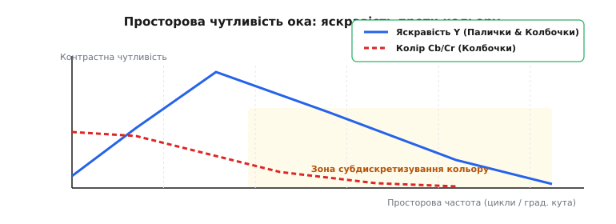
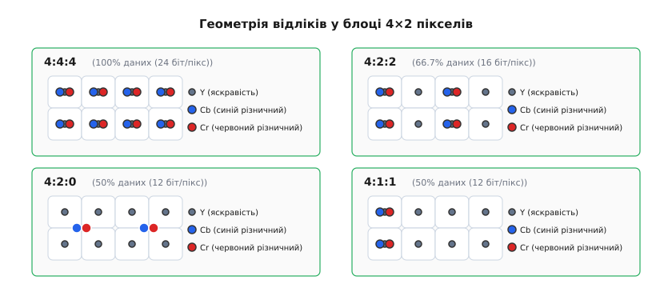
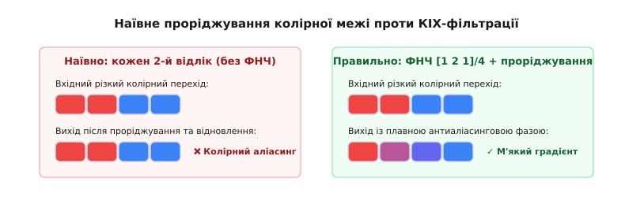
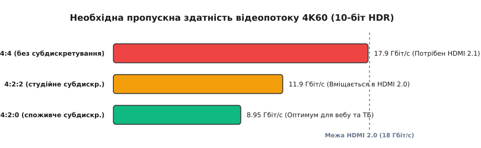

# Колірне субдискретування: зниження просторової роздільності колірних компонентів

<preknowlist>
- [Дискретизація й квантування](topic:electronics/sampling-quantization) — перетворення неперервного сигналу на послідовність відліків і поняття сітки відліків.
- [Колірні простори у відео](topic:communications/color-spaces-video) — лінійна трансформація RGB у YCbCr, поділ на яскравість Y та колірнорізницеві канали Cb/Cr.
- [Проріджування (decimation)](topic:communications/decimation) — зниження частоти відліків у цифровому сигналі та необхідність антиаліасингової фільтрації.
- [Найквіст і аліасинг](topic:communications/nyquist-aliasing) — межа дискретизації fs/2 та дзеркальне складання спектральних компонентів.
</preknowlist>

Коли ти дивишся фільм у роздільності 4K або відкриваєш цифрове фото JPEG, половина колірних відліків кадру насправді просто відсутня. У кожному блоці з чотирьох пікселів є чотири чесні значення яркості, але лише один відлік синього й один відлік червоного кольору. Дані урізано вдвічі, проте зображення здається бездоганно чітким, а колірні межі — природними. Цей оптичний обман є наслідком **колірного субдискретування (*chroma subsampling*, від грец. *chrōma* — «колір» та лат. *sub* + *discretus* — «розділений на відліки»)** — алгоритмічного прийому, який вилучає високі просторові частоти з колірнорізничних каналів відеосигналу, спираючись на анатомічні обмеження людського зору.

Ця задача вперше постала наприкінці 1940-х років при впровадженні кольорового телебачення. Інженери зіткнулися з фізичним тупиком: стандартизований ефірний радіоканал був жорстко обмежений шириною 6 МГц, у якій чорно-білий сигнал яркості вже займав 4.2 МГц. Спроба передати три повночастотні канали RGB вимагала б смуги понад 12 МГц, що унеможливлювало сумісність із мільйонами наявних телевізорів і руйнувало мовну інфраструктуру. Колірне субдискретування розв'язало цю проблему, дозволивши втиснути кольорові дані у залишок 6-мегагерцової смуги. Сьогодні той самий принцип визначає пропускну здатність інтерфейсів HDMI й DisplayPort, обсяг оперативної пам'яті відеокарт та ефективність стиснення в кодеках H.264, H.265 та AV1.

Розберімо, як влаштований цей механізм, чому він не помітний на фотографіях, але ламає текст на моніторах, і як правильно обробляти субдискретизовані буфери в коді без утворення колірного аліасингу.

### Фізіологічний фундамент: як око сприймає світло й колір

Причина, з якої колірне субдискретування взагалі можливе, лежить не в математиці сигналів, а в будові сітківки людського ока. Світлочутливий шар сітківки містить два типи рецепторів — палички (*rods*) та колбочки (*cones*).

Палички (близько 120 мільйонів) відповідають за сутінковий зір і сприймають лише інтенсивність світла (яскравість). Вони мають високу чутливість і щільно вкривають більшу частину сітківки. Колбочки (близько 6–7 мільйонів) відповідають за денний колірний зір і діляться на три типи (L, M, S), чутливі до червоної, зеленої та синьої ділянок спектра. Найважливіше те, що колбочки зосереджені переважно у крихітній центральній ямці сітківки (*fovea centralis*), а на периферії їхня щільність стрімко падає.

Аналіз зорової системи через **контрастно-частотну характеристику (CSF, *Contrast Sensitivity Function*)** показує фундаментальну відмінність між яскравісною та колірною роздільною здатністю людини.


*Графік контрастно-частотної характеристики ока. Суцільна синя крива показує чутливість до яркості Y: пік лежить довкола 4–6 циклів на кутовий градус, а межа розрізнення досягає 30–40 циклів/град. Пунктирна червона крива колірнорізничних каналів Cb/Cr демонструє спад вже після 1–2 циклів/град. Бежева зона показує високі просторові частоти, які зорова система не здатна розрізнити у кольорі.*

Зорова система працює як двоканальний просторовий фільтр:
1. **Канал яркості `Y` (Luminance):** реагує на контрастні перепади світла й тіні. Межа розрізнення дрібних деталей сягає 30–40 циклів на кутовий градус. Саме яскравість формує в мозку відчуття чіткості, контурів предметів та текстури.
2. **Колірні канали `Cb`/`Cr` (Chrominance):** реагують на зміну колірного відтінку при однаковій яскравість. Порогова просторова частота для кольору є втричі-вчетверо нижчою і падає вже після 2–3 циклів на кутовий градус.

Якщо зобразити шарховий візерунок із тонких червоних і синіх ліній одинакової яркості та віддалити його від спостерігача, око дуже швидко втратить здатність розрізняти окремі кольорові смуги й побачить суцільну фіолетову поверхню. Але якщо ті самі смуги відрізнятимуться за яскравістю (наприклад, чорно-білі), око легко розрізнятиме їх на значно більшій відстані.

Це відкриття підказує інженерний висновок: **у зоровому відеопотоці немає сенсу передавати колір із такою ж просторовою густотою, як і яскравість**. Відкинувши високі просторові частоти кольору, ми зекономимо колосальний обсяг даних, а зоровий кортекс людини заповнить відсутні деталі на основі чіткої яркості.

### Історичне коріння: від сумісного аналогового ТБ до цифри

Концепція розділення яркості та кольору з'явилася наприкінці 1940-х років при створенні сумісного кольорового телебачення в США (стандарт NTSC). Інженери мали втиснути кольоровий відеосигнал у наявний аналоговий радіоканал шириною 6 МГц, у якому сигнал яркості `Y` займав 4.2 МГц. 

Якби кольорові канали `R`, `G`, `B` передавалися повністю, була б потрібна потрійна смуга частот (понад 12 МГц), що зламало б усю ефірну інфраструктуру. Інженери NTSC застосували матрицювання [RGB у простір YUV](topic:communications/color-spaces-video). Сигнал яркості `Y` залишили у повній смузі 4.2 МГц, щоб мільйони наявних чорно-білих телевізорів приймали чітку картинку. А колірнорізничні сигнали пропустили через аналогові ФНЧ, обмеживши їхню смугу до 1.3 МГц та 0.6 МГц, і заміксували на піднесучій частоті. [Історія створення YUV та сумісного кольорового ТБ](topic:communications/chroma-subsampling/hist-yuv-color-tv.md) розгортає хронологію цієї патентної та інженерної битви 1950-х років.

З появою цифрового відео на початку 1980-х років (стандарт ITU-R BT.601) обмеження аналогової смуги фільтром перетворилося на **просторову децимацію цифрових відліків**. Замість безупинного аналогового сигналу колір стали квантувати з рідшою піксельною сіткою.

### Нотація `J:a:b` та просторова геометрія сіток відліків

Для опису конфігурації колірного субдискретування використовують стандартну трикомпонентну нотацію **`J:a:b`** (іноді чотирикомпонентну `J:a:b:α`, де `α` — альфа-канал прозорості).

Значення нотації задається для концептуального опорного блоку пікселів шириною `J` пікселів (майже завжди `J = 4`) та висотою 2 пікселі:
- **`J` (перша цифра):** ширина концептуального блоку пікселів яркості `Y` у першому рядку (завжди 4).
- **`a` (друга цифра):** кількість відліків хроматеми (`Cb` та `Cr`) у першому (верхньому) рядку з 4 пікселів.
- **`b` (третя цифра):** кількість відліків хроматеми у другому (нижньому) рядку з 4 пікселів (або кількість змін колірних відліків між першим і другим рядком). Якщо `b = 0`, колірні відліки нижнього рядка не передаються зовсім, а дублюють відліки верхнього рядка.

Розгляньмо чотири основні формати, що використовуються в інженерній практиці.


*Порівняння піксельних сіток для блоків 4×2 пікселів. У форматі 4:4:4 кожен піксель Y має власні точки Cb та Cr. У 4:2:2 колір прореджено вдвічі по горизонталі. У 4:2:0 один відлік Cb і Cr обслуговує квадрат 2×2 (4 пікселі Y). У 4:1:1 колір прореджено вчотири рази по горизонталі.*

#### 1. Формат 4:4:4 (без субдискретування)
У цьому форматі субдискретування **відсутнє**. Кожен піксель зображення містить окремий відлік яркості `Y`, окремий відлік `Cb` та окремий відлік `Cr`.
- **Обсяг даних:** 24 біти на піксель (при 8 бітах на канал). 100% вихідного обсягу.
- **Сфера застосування:** професійна кіновиробнича обробка, візуальні ефекти (VFX), хромакей (*green screen*), комп'ютерна графіка, медична візуалізація та монітори робочих станцій.

#### 2. Формат 4:2:2 (горизонтальне субдискретування вдвічі)
Колірна інформація прореджена вдвічі по горизонталі, але збережена по вертикалі. У кожному рядку з 4 пікселів передається 4 відліки `Y`, але лише 2 відліки `Cb` і 2 відліки `Cr`. Парочка сусідніх по горизонталі пікселів (блок 2×1) ділить між собою один спільний колірний відлік.
- **Обсяг даних:** 16 бітів на піксель на кадр (8 біт Y + 4 біти Cb + 4 біти Cr). Скорочення обсягу на **33.3%** відносно 4:4:4.
- **Сфера застосування:** професійне телевізійне мовлення, студійні відеокодеки (Apple ProRes 422, Avid DNxHD), цифрові відеокамери та відеоінтерфейси HD-SDI.

#### 3. Формат 4:2:0 (квадратне субдискретування 2×2)
Колірна інформація прореджена вдвічі **як по горизонталі, так і по вертикалі**. Квадратний блок із 4 пікселів (2×2 пікселі Y) містить лише **один** відлік `Cb` та **один** відлік `Cr`. Верхній і нижній рядки пікселів ділять колірні відліки навпіл.
- **Обсяг даних:** 12 бітів на піксель на кадр (8 біт Y + 2 біти Cb + 2 біти Cr). Скорочення обсягу на **50.0%** відносно 4:4:4.
- **Сфера застосування:** абсолютний стандарт для споживчого відео. Використовується в стисненні фотографій JPEG, WebP, відеопотоках YouTube, Netflix, дисках Blu-ray, супутниковому ТБ та кодеках H.264, H.265 (HEVC), AV1, VP9.

#### 4. Формат 4:1:1 (горизонтальне субдискретування вчотири рази)
Колір прореджено в 4 рази по горизонталі, але не прореджено по вертикалі. Рядок із 4 пікселів містить 4 відліки `Y` та лише 1 відлік `Cb`/`Cr`.
- **Обсяг даних:** 12 бітів на піксель (як і в 4:2:0), але з асиметричною просторовою роздільністю (вертикальна чіткість кольору вища за горизонтальну).
- **Сфера застосування:** застарілі цифірові аналогово-касетні формати DV (NTSC), DVCAM, DVCPRO. У сучасному відеопрактикумі майже не зустрічається.

[Математичний вивід сіток, обсягів буферів та просторових частот](topic:communications/chroma-subsampling/math-chroma-grid.md) дає точні формули обчислення бітрейтів і просторових матриць для BT.601, BT.709 та BT.2020.

### Фазування відліків: де саме лежить колірна точка

Коли ми кажемо, що один відлік `Cb`/`Cr` обслуговує блок 2×2 пікселів `Y`, постає геометричне питання: **у якій точці простору розташований цей колірний відлік?**

Відповідь залежить від **фазування хроматеми (*chroma sample location / phasing*)**, яке розрізняється між стандартами:

1. **Центральне фазування (Center-aligned / JPEG / WebP / MPEG-1):**
   Колірна точка розташована строго в геометричному центрі сітки 2×2 пікселів яркості — на координатах `(x + 0.5, y + 0.5)`. Це природно для обробки двовимірних матриць у графічних редакторах.
2. **Ліве фазування (Left-aligned / Interstitial / MPEG-2 / H.264 / H.265 progressive):**
   Колірна точка розташована на лівій межі блоку, збігаючись за горизонтальною координатою з першою колонкою пікселів `Y` (`x + 0.0`), і посередині по вертикалі (`y + 0.5`). Це полегшувало апаратне узгодження з розгорткою аналогових телевізійних сигналів.
3. **Чесночне фазування (Top-left / Interlaced video):**
   У чесночному (інтерлейсному) відео колірні відліки парних і непарних полів зсуваються по вертикалі, щоб уникнути фазового тремтіння між напівкадрами.

```
Центральне (JPEG):         Ліве (H.264):
Y00     Y01                Y00, CbCr   Y01
    CrCb                       
Y10     Y11                Y10         Y11
```

Якщо декодер не враховує фазування й декодує H.264 потік за правилами JPEG, колірний шар зображення просторово зміщується на півпікселя праворуч. На контрасних межах з'являється характерний розмитий колірний ореол.

### Алгоритмічний конвеєр: фільтрація та усунення аліасингу

Проріджувати колірні канали — це не просто беремо кожен другий відлік із масиву. Як доведено в законах [децимації сигналів](topic:communications/decimation), простої вибірки елементів через один недостатньо: **без попередньої антиаліасингової фільтрації сигнал буде безнадійно зіпсовано**.

Якщо на вхід подати різку колірну межу (наприклад, перехід від насиченого червоного тексту до синього тла), у спектрі колірного сигналу з'являться високі просторові частоти. Згідно з [теоремою Найквіста-Котельникова](topic:communications/nyquist-aliasing), зниження частоти дискретизації хроматеми вдвічі опускає межу Найквіста до `f_nyq = 0.25` циклів/піксель. Усі частоти, що лежать вище цієї межі, дзеркально відіб'ються вниз і сядуть у низькочастотну область.

На екрані це виглядає як **колірний аліасинг (*chroma aliasing*)**: червоно-сині зубчасті сходинки на вертикальних межах, колірний муар на дрібних текстурах та хибні фіолетові плями.


*Ліворуч: наївне вилучення відліків без ФНЧ викликає колірний аліасинг (різкі сходинки та перекривання спектрів). Праворуч: застосування двовимірного КІХ-фільтра низьких частот створює м'яку антиаліасингову фазу переходу, зберігаючи чіткі межі яркості Y та запобігаючи спотворенню кольору.*

Правильний алгоритмічний конвеєр субдискретизації складається з двох послідовних кроків:

1. **Двовимірна низькочастотна КІХ-фільтрація (2D FIR filtering):**
   Перед зниженням частоти канали `Cb` та `Cr` пропускаються через 2D КІХ-фільтр зрізу з ядром `2×2` або `3×3`. Найпростішим прикладом є зважене усереднення за блоком 2×2 з коефіцієнтами:
   ```
   H_2D = 1/4 · [ 1  1 ]
                [ 1  1 ]
   ```
   Для вищої якості застосовують 5-відводні КІХ-фільтри (наприклад, трикутні ядра `[1 2 1]/4`).
2. **Проріджування (Downsampling):**
   Із фільтрованого масиву беруться значення з кроком 2 по горизонталі й вертикалі.
3. **Відновлення при декодуванні (Upsampling):**
   Для показу на моніторі сітку 4:2:0 потрібно розгорнути назад у 4:4:4 (або RGB). Для цього використовують білінійну або бікубічну інтерполяцію колірних відліків з урахуванням фазового зсуву.

[Робочий перетворювач 4:4:4 ↔ 4:2:0 на C та C++](topic:communications/chroma-subsampling/proj-chroma-converter.md) показує повну реалізацію цього конвеєра з антиаліасинговим КІХ-фільтром та білінійним відновленням.

### Взаємодія субдискретизації з квантуванням у відеокодеках

У кодеках стиснення (JPEG, H.264, HEVC, AV1) колірне субдискретування виконується на самому початку конвеєра — ще до розкладання кадру на просторові частоти за допомогою **дискретного косинусного перетворення (DCT)** або хвильових перетворень (wavelet).

Цей подвійний ефект створює каскадну економію бітрейту:
1. **Просторова децимація:** Зменшує розмірність матриць колірних блоків із `8×8` пікселів до `4×4` колірних коефіцієнтів (у 4:2:0).
2. **Частотне квантування (Quantization Matrix):** Матриці квантування для `Cb`/`Cr` проектуються значно грубішими, ніж для `Y`. Високочастотні коефіцієнти DCT колірних каналів обнуляються кодеком із вищим порогом, оскільки людське око не помітить втрати вищих гармонік відтінку.
3. **Ентропійне кодування (CABAC / Huffman):** Отримані довгі серії нульових колірних коефіцієнтів стискаються ентропійним кодером майже до нульового бітового обсягу.

Завдяки цьому каскаду колірна інформація в підсумковому стиснутому відеопотоці H.264/H.265 займає зазвичай менше **15–20%** загального бітрейту, тоді як 80–85% каналу віддається під детальне кодування каналу яркості `Y`.

### Чому комп'ютерні інтерфейси та тонкий текст страждають від 4:2:0

Якщо субдискретизація 4:2:0 така чудова й заощаджує 50% даних без помітної втрати якості, чому всі комп'ютерні монітори та операційні системи за замовчуванням працюють у повному форматі **4:4:4 RGB**?

Відповідь полягає в різниці між **натуральними фотографіями/кіно** та **штучною графікою ПК**.

Натуральні зображення (обличчя, пейзажі, градієнти) не мають ідеально різких колірних меж завдяки оптиці об'єктива й розмиттю руху (*motion blur*). А от елементи інтерфейсу користувача (GUI) — шрифти, іконки, лінії вікон завтовшки в 1 піксель — створюються математично з нескінченно гострими ребрами.

Особливо катастрофічно 4:2:0 впливає на **технології субпіксельного рендерингу тексту (ClearType у Windows, FreeType в Linux)**.

```
Формат 4:4:4 (Червона буква 1px на чорному тлі):
Червоний піксель: Y=80, Cb=50, Cr=240  --> Чіткий яскравий червоний шрифт

Формат 4:2:0 (Після усереднення 2x2 з чорними сусідніми пікселями):
Червоний піксель: Y=80, Cb=128, Cr=180 --> Брудний розмитий рожево-сірий ореол
```

Субпіксельний рендеринг навмисно забарвлює крайні субпікселі (червоні та сині світлодіоди монітора) у протилежні кольори, щоб візуально потрійнити горизонтальну роздільну здатність тексту. Коли цей тонко збалансований колірний сигнал потрапляє під субдискретизацію 4:2:0, колірні відліки розмиваються на сусідні пікселі. В результаті:
- Дрібний текст (8–11 pt) стає сірим, брудним і майже нечитабельним.
- Навколо чорних букв на білому тлі виникають фіолетові та зелені кольорові ореоли (*color bleeding*).
- Тонкі графічні лінії на схемах CAD та у коді IDE втрачають контраст.

Саме тому підключення комп'ютера до 4K-телевізора дешевим кабелем HDMI 2.0 часто переводить відеокарту в режим 4:2:0. Фільми й відеоігри при цьому виглядають чудово, але чіткість шрифтів у робочих вікнах миттєво падає. Для повноцінної роботи з текстом потрібен режим 4:4:4.

### Економіка пам'яті, пропускної здатності та відеоінтерфейсів

Головний рушій використання субдискретизації в промисловості — це жорстка економіка апаратних ресурсів.

Розгляньмо нестиснутий відеопотік високої чіткості 4K60 (3840×2160 пікселів при 60 кадрах на секунду) із глибиною кодування 10 біт на канал (стандарт HDR10):

```
4K60 HDR10 (3840 × 2160 × 60 кадрів/с):

1. Формат 4:4:4 (30 біт/піксель):
   Бітрейт = 3840 · 2160 · 30 · 60 = 14 929 920 000 біт/с ≈ 14.93 Гбіт/с
   З урахуванням службових інтервалів гасіння (Blanking ~20%): 17.9 Гбіт/с

2. Формат 4:2:2 (20 біт/піксель):
   Бітрейт = 3840 · 2160 · 20 · 60 = 9 953 280 000 біт/с ≈ 9.95 Гбіт/с
   З урахуванням гасіння (~20%): 11.9 Гбіт/с

3. Формат 4:2:0 (15 біт/піксель):
   Бітрейт = 3840 · 2160 · 15 · 60 = 7 464 960 000 біт/с ≈ 7.46 Гбіт/с
   З урахуванням гасіння (~20%): 8.95 Гбіт/с
```


*Діаграма необхідної пропускної здатності для 4K60 10-біт HDR. Інтерфейс HDMI 2.0 має фізичну межу 18.0 Гбіт/с. Потік 4:4:4 не вміщається в HDMI 2.0 без DSC-стиснення. Формати 4:2:2 та 4:2:0 вільно проходять крізь HDMI 2.0.*

Максимальна фізична пропускна здатність стандарту **HDMI 2.0** становить **18.0 Гбіт/с**. З урахуванням кодування 8b/10b корисний ліміт складає 14.4 Гбіт/с.

З розрахунку видно: передати нестиснутий потік 4K60 HDR у форматі 4:4:4 через кабель HDMI 2.0 фізично **неможливо** (потрібно 17.9 Гбіт/с). Єдине рішення без купівлі нового обладнання з HDMI 2.1 — переключити відеокарту у формат **4:2:0** або **4:2:2**, зменшивши бітрейт до 8.95–11.9 Гбіт/с, що гарантовано вміщається в ліміт кабелю.

#### Організація буферів пам'яті (Planar vs Packed)

У програмуванні відеообробки та роботі з відеокартами колірне субдискретування визначає розташування пікселів у RAM:

1. **Паковані формати (Packed Formats, наприклад YUY2 / UYVY):**
   Використовуються для 4:2:2. Відліки яркості й кольору переплетені в єдиному масиві байтів: `Y0 Cb0 Y1 Cr0 | Y2 Cb1 Y3 Cr1`. Зручно для послідовного зчитування у відеопотоках.
2. **Плоскі формати (Planar Formats, наприклад YUV420p / I420):**
   Використовуються для 4:2:0. Кадр ділиться на три **окремі монохромні масиви в пам'яті**:
   - Спочатку йде повний плоскодонний масив `Y` розміром `W × H` байтів.
   - За ним іде масив `Cb` розміром `(W/2) × (H/2)` байтів.
   - За ним іде масив `Cr` розміром `(W/2) × (H/2)` байтів.
3. **Напівплоскі формати (Semi-Planar Formats, наприклад NV12 / NV21):**
   Стандарт для апаратних декодерів смартфонів і GPU (QuickSync, NVENC). Масив `Y` лежить окремо (`W × H`), а колірні компоненти об'єднані в один пакований масив `CbCrCbCr...` розміром `W × (H/2)`. Це забезпечує оптимальне кешування в L2-кеші відеокарти під час рендерингу шейдерами.

> 🔧 **Навіщо це.** Якщо ти розробляєш відеостример, обробку кадрів з веб-камери або растровий редактор, пам'ятай: спроба обробляти 4:2:0 буфер як звичайний RGB-масив призведе до зсуву пам'яті й падіння програми (*Segmentation Fault*). Плоский буфер YUV420p вимагає окремого обчислення кроку рядка (*stride/pitch*) для яркості `W` та для колірних поверхонь `W/2`. При виділенні пам'яті під 4:2:0 розраховуй обсяг як `1.5 · W · H` байтів, а не `3 · W · H`.
