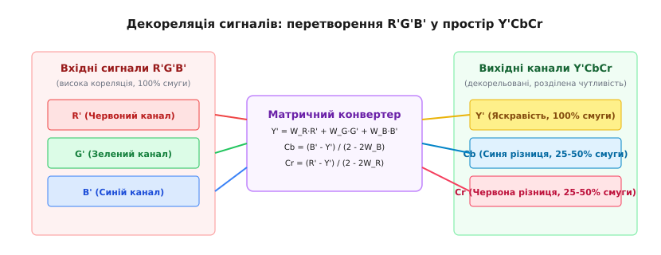
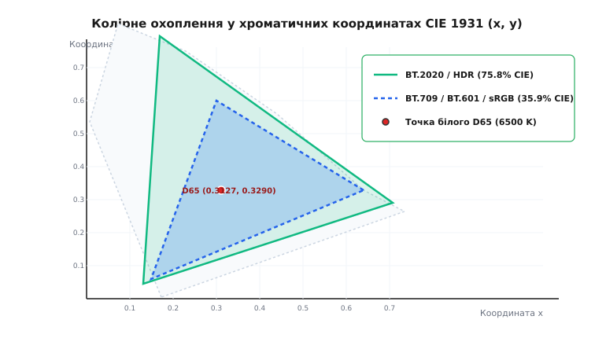
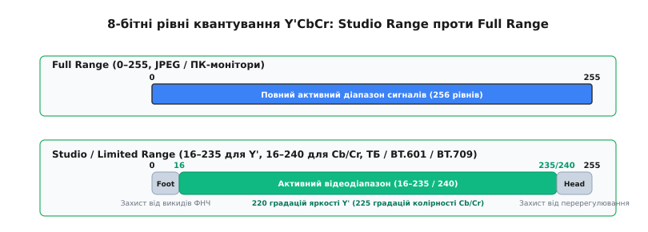

# Колірні простори у відео

<preknowlist>
- [Колірне субдискретування](topic:communications/chroma-subsampling) — просторове проріджування колірних каналів на основі анатому-фізіологічних властивостей людського зору.
- [Дискретизація сигналів](topic:communications/sampling-reconstruction) — перетворення неперервного аналогового сигналу на послідовність цифрових відліків.
</preknowlist>

Якби цифрові відеопотоки передавалися у сирому вигляді через три незалежні первинні канали червоного `R`, зеленого `G` та синього `B` кольорів, стандартний потік високої чіткості HDTV (1920×1080 пікселів при 60 кадрах за секунду з 8-бітною глибиною) вимагав би пропускної здатності понад 3 Гбіт/с. Навіть найсучасніші коаксіальні та ефірні мережі зв'язку розсипалися б під таким навантаженням, а розробка аналогового кольорового телебачення у 1950-х роках виявилася б принципово неможливою через брак ширини спектра радіоканалу. Більше того, пряма передача трьох компонентних каналів `RGB` містить величезну надлишковість: на колірних межах яскравий контур деталі одночасно присутній у всіх трьох сигналах, змушуючи мережу передавати одну й ту саму геометрію тричі.

Анатомічна причина цієї надлишковості лежить у будові сітківки людського ока. Очне яблуко містить близько 120 мільйонів паличок, що відповідають за монохромне нічний зір та високочастотні просторові деталі контрасту, і лише 6 мільйонів колбочок, розділених між трьома вузькими спектральними зонами чутливості (L для довгохвильового, M для середньохвильового, S для короткохвильового діапазонів). Просторова роздільна здатність зорової кори людини щодо змін яркості у 3–4 рази перевищує її чутливість до зміни кольорового відтінку. Виділення однаковою смуги частот під колір та яскравість означає трикратну переплату ресурсами каналу зв'язку за інформацію, яку мозок усе одно не здатен фізично розрізнити.

Інженерним рішенням цієї проблеми стала лінійна декореляція сигналів шляхом перетворення колірного простору з `R'G'B'` у простір яркості та колірнорізничих каналів `Y'CbCr`. Завдяки відокремленню сигналу яркості `Y'`, який несе 100% структурної геометричної інформації та забезпечує повну зворотну сумісність із чорно-білими приймачами, колірні сигнали `Cb` (синя різниця) та `Cr` (червона різниця) можна піддавати апетитній фільтрації нижчих частот та субдискретизації без видимого погіршення якості зображення читачем.


*Принцип математичної декореляції вхідних корельованих сигналів R'G'B' у сигнал яркості Y' та колірнорізничі канали Cb/Cr для стиснення смуги частот.*

## Фізичні закони аддитивного змішування та сприйняття світла

Коли на сітківку ока одночасно потрапляє випромінювання різних довжин хвиль, колбочки L, M та S типів реагують на сумарний спектральний потік. Регулюючи інтенсивність трьох фізичних монохромних випромінювачів `R, G, B` (наприклад, червоного з довжиною хвилі 700 нм, зеленого 546.1 нм та синього 435.8 нм у системі CIE 1931), ми додаємо їхню оптичну потужність і відтворюємо для зорової кори довільний колірний відтінок видимого спектра.

Цей фізичний механізм додавання світлових потоків описує тристимульна модель. Математичним підсумком такої оптичної системи є лінійна комбінація, де будь-який колір `C` однозначно виражається через трійку первинних кольорів:

```
C = r · R + g · G + b · B
```

де `r, g, b` — тристимульні коефіцієнти інтенсивності відповідних джерел. Вказана залежність відображає перший закон аддитивного змішування кольорів Грассмана, який стверджує лінійну незалежність колірного простору та можливість однозначного розкладу будь-якого відтінку за трьома базисними векторами.

Проте людське сприйняття світла має виражену неколінійну характеристику. Законом Вебера-Фехнера та колориметричними дослідженнями Міжнародної комісії з освітлення (CIE) встановлено, що око реагує не на абсолютну фізичну енергію фотонів (значення `RGB`), а на відносний логарифмічний або степеневий приріст інтенсивності. Якби цифрова відеокамера квантувала фізичну інтенсивність світла лінійно, 8-бітний запіс (256 рівнів) виявився б катастрофічно непридатним: темні ділянки кадру (тіні) мали б усього 5–10 рівнів квантування, спричиняючи грубий бандинг (ступінчасті градації), тоді як світлі ділянки отримали б надмірну кількість рівнів, незатребуваних людським зором.

Щоб рівномірно розподілити обмежену кількість цифрових рівнів квантування між темними та світлими ділянками кадру, вхідні лінійні сигнали датчика відеокамери піддаються неколінійній гамма-корекції на стадії формування сигналу.

Цей процес описується передавальною функцією Opto-Electronic Transfer Function (OETF). У класичних відеосистемах лінійні сигнали `R, G, B ∈ [0.0, 1.0]` перетворюються на неколінійні гамма-кореговані сигнали `R', G', B' ∈ [0.0, 1.0]` за допомогою степеневої функції:

```
R' = R^(1 / γ)
G' = G^(1 / γ)
B' = B^(1 / γ)
```

Де параметр `γ ≈ 2.2` (для стандартів BT.709 та sRGB використовується комбінована функція з коротким лінійним відрізком біля нуля для придушення шумів у тінях).

Критично важливо розрізняти теоретичний простір `YCbCr`, побудований на лінійних фізичних стимулах `RGB`, та реальний відеопростір `Y'CbCr`, сформований із гамма-корегованих сигналів `R'G'B'`. Апостроф біля символів (штрих) означає, що матрицювання та розрахунок яркості виконуються над вже нелінійними значеннями. Сформований таким чином сигнал `Y'` називається **координатою яркості (Luma)**, на відміну від фізичної яркості (Luminance `Y`). Матрицювання у нелінійному просторі створює так звану помилку постійної яркості (Constant Luminance Error): частина колірної енергії змішується з каналом яркості, проте це виявилося прийнятним компромісом для спрощення обчислювальної складності аналогових та цифрових схематик.

## Аналогові коріння та цифровий простір Y'CbCr

Поняття колірного простору у відеорозробці сформувалося внаслідок жорстких обмежень сумісності ефірного мовлення. Коли у 1950-х роках виникла потреба впровадити кольорове ТБ, у будинках споживачів уже працювали мільйони чорно-білих телевізорів. Сигнал нового кольорового стандарту мусив передавати повний спектр яскравості у звичайній смузі каналу 6 МГц так, щоб чорно-білий приймач формував чітке контрастне зображення, не помічаючи кольорових піднесучих.

Так виник аналоговий простір `YUV` для систем NTSC та PAL (де `U` та `V` являють собою масштабовані колірнорізничі сигнали `B'-Y'` та `R'-Y'`, заміксовані на піднесучу частоту у квадратурній амплітудній модуляції), а також простір `YDbDr` для системи SECAM із частотною модуляцією колірнорізничних компонент.

З переходом на цифрове відео та стандартизацією ITU-R впроваджено дискретне сімейство колірних просторів `Y'CbCr`:

1. **`Y'PbPr`** — аналоговий компонентний інтерфейс, де сигнали передаються по трьох окремих коаксіальних кабелях (зелений для `Y'`, синій для `Pb`, червоний для `Pr`) із напругами у діапазоні від -0.3 В до +0.7 В.
2. **`Y'CbCr`** — цифрове кодування колірнорізничих сигналів, де неперервні значення квантуються у цілочисельні 8-, 10- або 12-бітні коди. `Cb` (Color-blue) та `Cr` (Color-red) є масштабованими цифровими еквівалентами `Pb` та `Pr`.

Математичне перетворення `R'G'B' -> Y'CbCr` є лінійним поворотом та масштабуванням координат у тривимірному векторному просторі, де вісь `Y'` спрямована вздовж головної діагоналі куба кольорів (від чисто чорного `[0,0,0]` до чисто білого `[1,1,1]`), а площина `CbCr` є ортогональним зрізом, що описує хроматичну насиченість та колірний тон.

## Математика декореляції та вагові коефіцієнти яркості

Людське око сприймає світлову енергію різних довжин хвиль нерівномірно. Згідно з кривою відносної спектральної світлової ефективності `V(λ)`, при однаковій фізичній потужності випромінювання зелений колір викликає найсильніше зорове відчуття яркості: пік чутливості припадає на довжину хвилі 555 нм у денному (фотопічному) зорі. Синій колір, навпаки, дає мінімальний внесок у відчуття яркості через низьку щільність S-колбочок у центральній фовеальній зоні сітківки та особливості обробки сигналів зоровою корою.

Через цю біологічну нерівномірність сприйняття вагові коефіцієнти при формуванні єдиного декорельованого сигналу яркості `Y'` з неколінійних сигналів `R', G', B'` не можуть бути однаковими. Ваговий коефіцієнт зеленого каналу `W_G` завжди є найбільшим і перевищує 50% загальної суми, тоді як частка синього каналу `W_B` виявляється найменшою (від 5% до 11%).

Математично це формування виражається сумою з ваговими коефіцієнтами `W_R`, `W_G`, `W_B`:

```
Y' = W_R · R' + W_G · G' + W_B · B'
```

Для забезпечення нормалізації, коли для нейтрально-білого кольору `R' = G' = B' = 1.0` значення яркості дорівнює `Y' = 1.0`, сума вагових коефіцієнтів завжди строго дорівнює одиниці:

```
W_R + W_G + W_B = 1.0
```

Колірнорізничі сигнали формуються як пряма різниця між гамма-корегованим колірним каналом та обчисленою яркістю:

```
E'_Pb = B' - Y'
E'_Pr = R' - Y'
```

Оскільки `B'` змінюється від 0.0 до 1.0, а `Y'` на чисто синьому кольорі `(R'=0, G'=0, B'=1)` дорівнює `W_B`, максимальний позитивний відхил сигналу `E'_Pb` складає `1.0 - W_B`. На чисто жовтому кольорі `(R'=1, G'=1, B'=0)` яскравість дорівнює `Y' = 1.0 - W_B`, а відхил `E'_Pb` досягає мінімуму `- (1.0 - W_B)`.

Щоб нормалізувати амплітудний розмах колірнорізничих сигналів `Cb` та `Cr` у симетричний діапазон `[-0.5, +0.5]`, вводяться масштабуючі нормувальні множники `K_b = 2 · (1 - W_B)` та `K_r = 2 · (1 - W_R)`:

```
Cb = (B' - Y') / (2 · (1 - W_B))
Cr = (R' - Y') / (2 · (1 - W_R))
```

Докладний розрахунок цих коефіцієнтів через спектральні координати світлофільтрів та виведення зворотної матриці відновлення `Y'CbCr -> R'G'B'` наведено у [Математичному виведенні матриць перетворення](topic:communications/color-spaces-video/math-color-matrix-derivation.md).

## Еволюція факторів вагомості: BT.601, BT.709 та BT.2020

З удосконаленням технології виготовлення люмінофорів електронно-променевих трубок, а згодом рідкокристалічних та OLED-матриць, хроматичні координати первинних випромінювачів `R, G, B` змінювалися від стандарту до стандарту. Зміна базових кольорів автоматично приводила до зміни вагових коефіцієнтів яркості `W_R, W_G, W_B`.


*Порівняння трикутників колірного охоплення стандартів BT.709 (sRGB) та BT.2020 (UHDTV) на хроматичній діаграмі CIE 1931 з точкою білого D65.*

### 1. Стандарт ITU-R BT.601 (SDTV)

Прийнятий у 1982 році для цифрового телебачення стандартної чіткості (576i PAL та 480i NTSC). В основу покладено параметри люмінофорів ЕПТ-моніторів того часу з точкою білого D65 (6504 К):

```
Y' = 0.2990 · R' + 0.5870 · G' + 0.1140 · B'
Cb = -0.1687 · R' - 0.3313 · G' + 0.5000 · B'
Cr = 0.5000 · R' - 0.4187 · G' - 0.0813 · B'
```

### 2. Стандарт ITU-R BT.709 (HDTV)

Прийнятий у 1990 році для телебачення високої чіткості (720p, 1080i, 1080p) та стандартизований для комп'ютерного простору `sRGB`. Використовує більш чисті зелені та червоні випромінювачі, що змістило вагові коефіцієнти в бік підвищення частки зеленого каналу до 71.5%:

```
Y' = 0.2126 · R' + 0.7152 · G' + 0.0722 · B'
Cb = -0.1146 · R' - 0.3854 · G' + 0.5000 · B'
Cr = 0.5000 · R' - 0.4542 · G' - 0.0458 · B'
```

### 3. Стандарт ITU-R BT.2020 / BT.2100 (UHDTV & HDR)

Прийнятий у 2012 році для відео Ультрависокої чіткості 4K/8K та розширеного динамічного діапазону (HDR). Первинні кольори BT.2020 розташовані безпосередньо на межі спектральної локус-кривої CIE 1931 (монохроматичні лазерні джерела світла). Охоплення становить 75.8% усього колірного простору, доступного людині (проти 35.9% у BT.709):

```
Y' = 0.2627 · R' + 0.6780 · G' + 0.0593 · B'
Cb = -0.1396 · R' - 0.3604 · G' + 0.5000 · B'
Cr = 0.5000 · R' - 0.4598 · G' - 0.0402 · B'
```

| Параметр колірності | Стандарт BT.601 (SD) | Стандарт BT.709 (HD) | Стандарт BT.2020 (UHD) |
| :--- | :--- | :--- | :--- |
| **Вага червоного (W_R)** | 0.2990 | 0.2126 | 0.2627 |
| **Вага зеленого (W_G)** | 0.5870 | 0.7152 | 0.6780 |
| **Вага синього (W_B)** | 0.1140 | 0.0722 | 0.0593 |
| **Охоплення CIE 1931** | ~33% | 35.9% | 75.8% |
| **Точка білого** | D65 (6504 К) | D65 (6504 К) | D65 (6504 К) |

Різниця вагових коефіцієнтів означає, що один і той самий набір цифрових відліків `Y'CbCr` створює абсолютно різні кольори на екрані залежно від того, за якою матрицею (BT.601, BT.709 чи BT.2020) його декодують.

## Квантування та рівні сигналів: Studio Range проти Full Range

У цифрових відеосистемах цілочисельні кодові значення `Y'CbCr` мають обмеження за амплітудою. Залежно від призначення відеопотоку використовуються два режими квантування: **Studio Range** (обмежений діапазон, Limited/TV Range) та **Full Range** (повний комп'ютерний діапазон, PC Range).


*Порівняння 8-бітних рівнів квантування між Full Range (0–255) та Studio Range (16–235 для Y', 16–240 для Cb/Cr).*

### 1. Studio Range (Limited Range / TV Range)

У 8-бітному розрядному представленні (256 можливих рівнів від 0 до 255) активний сигнал яркості `Y'` обмежено інтервалом від **16** (чисто чорний колір) до **235** (чисто білий колір). Динамічний розмах яркості становить 220 градацій.

Колірнорізничі канали `Cb` та `Cr` обмежено інтервалом від **16** до **240** з нейтральною точкою ахроматичного сірого кольору на рівні **128**. Розмах становить 224 градації.

Зона нижче 16 (Footroom, від 0 до 15) та зона вище 235/240 (Headroom, від 236 до 255) збережені в інженерних цілях. Вони запобігають жорсткому кліпінгу верхівок сигналів при виникненні перерегулювання (ringing overshoot/undershoot) під час дискретного косинусного перетворення (DCT) у кодеках H.264/HEVC або при роботі аналогово-цифрових ФНЧ-фільтрів.

Для 10-бітного відео (1024 рівні від 0 до 1023) границі Studio Range масштабуються множенням на 4:
* Яскравість `Y'`: від **64** (чорний) до **940** (білий).
* Колірність `Cb/Cr`: від **64** до **960**, нейтраль на **512**.

### 2. Full Range (Full Swing / PC Range)

У комп'ютерній графіці, вебі та фотографії (формат JPEG) збереження Footroom/Headroom вважається марнотратством. Усі 256 рівнів 8-бітної шкали (від 0 до 255) використовуються повністю: 0 відповідає абсолютного чорному, а 255 — абсолютно білому. Колірність `Cb/Cr` займає повний інтервал `0..255` із нейтраллю на рівні 128.

Прямі формули розрахунку 8-бітних цілих значень Studio Range через нормовані дрібні величини `Y', Cb, Cr ∈ [0.0, 1.0]`:

```
Y'_8bit  = round(219 · Y' + 16)
Cb_8bit = round(224 · Cb + 128)
Cr_8bit = round(224 · Cr + 128)
```

## Передавальні функції розширеного динамічного діапазону (HDR)

З появою дисплеїв із піковою яскравістю понад 1000 ніт (проти 100 ніт для стандартного SDR) класична гамма-крива BT.709 виявилася непридатною. У стандарті ITU-R BT.2100 прийнято дві нові передавальні функції:

1. **PQ (Perceptual Quantizer, SMPTE ST 2084):** Абсолютна передавальна функція, заснована на психофізичній моделі контрастної чутливості Бартона. Вона підтримує діапазон яркості від 0.0001 до 10 000 ніт у 10-бітному кодуванні без видимого бандингу. Використовується в HDR10, HDR10+ та Dolby Vision.
2. **HLG (Hybrid Log-Gamma, ARIB STD-B67):** Відносна сумісна функція, яка поєднує класичну гамма-криву у нижній частині діапазону (тіні та півтони) з логарифмічною кривою у верхній частині (яскрава светлова зона). Вона дозволяє відтворювати HDR-сигнал на звичайних SDR-телевізорах без додаткового тономапінгу.

Для кодування колірності у HDR використовується колірний простір **ICtCp** (де `I` — інтенсивність яркості, `Ct` — тританопічна колірна вісь синій-жовтий, `Cp` — протонопічна колірна вісь червоний-зелений), який забезпечує значно кращу ізотропну декореляцію та відсутність хроматичних зсувів кольору при зміні яркості у порівнянні з класичним Y'CbCr. Модель ICtCp прямо розраховується з тристимульних координат LMS очного яблука через матрицю Гунта і забезпечує лінійність сприйняття колірних різниць при масштабуванні яркості від 0.0001 до 10 000 ніт.

Для стиснення розширеного динамічного діапазону HDR до SDR-дисплеїв застосовують алгоритми тономапінгу (Tone Mapping Operator, TMO). Найпопулярніші з них — оператор Рейнхарда, алгоритм Hable Filmic та колірна матриця ACES (Academy Color Encoding System), які гладко стискають піки яркості 1000–4000 ніт у стандартну 100-нітну шкалу BT.709 без втрати деталізації у світлових плямах.

## Спектральне узгодження та метадані VUI у відеопотоках

Одна з найпоширеніших проблем у практичній роботі з відеопотоками — спотворення колірної гами при відтворенні, обумовлене плутаниною колірних метаданих.

### 1. Невідповідність матриці (BT.601 проти BT.709)

Якщо відеокадр записано з ваговими коефіцієнтами HD BT.709 (`W_R = 0.2126`, `W_G = 0.7152`, `W_B = 0.0722`), а декодер помилково обробляє його за матрицею SD BT.601 (`W_R = 0.2990`, `W_G = 0.5870`, `W_B = 0.1140`), виникає суттєве розходження у нормувальних множниках колірнорізничного каналу `Cr`. Вхідний сигнал `Cr` у BT.709 розраховувався з масштабуванням на `2 · (1 - 0.2126) = 1.5748`, тоді як декодер BT.601 множить його на коефіцієнт `1.4020` для відновлення червоного каналу `R'`. Така підстановка призводить до штучного амплітудного переповнення обчисленого значення `R'`: червоні відтінки стають надмірно насиченими та темними, шкіра обличчя набуває неприродного багрового відтінку, а зелений колір зміщується в бік пурпурового.

Цей ефект математичного переповнення та викривлення насиченості червоного каналу називають ярликом **Red Crush**.

Зворотна помилка (декодування відео BT.601 за допомогою матриці BT.709, де ваговий коефіцієнт `W_R` занижено з 0.2990 до 0.2126) призводить до того, що обчислена амплітуда червоного сигналу недостатня, а зображення стає блідим із зеленкуватим відтінком.

### 2. Невідповідність діапазону (Limited проти Full)

* **Limited відео декодується як Full:** Чорні деталі кадру (рівень 16) відображаються як темно-сірі, а білі (рівень 235) — як світло-сірі. Зображення стає «вицвілим», втрачає контраст та глибокий чорний колір.
* **Full відео декодується як Limited:** Рівні від 0 до 15 зливаються у суцільну чорну пляму (Black Crush), а рівні від 236 до 255 — у суцільну білу пляму (White Crush). Тіні та відблиски повністю втрачають деталізацію.

Для усунення плутанини у заголовки медіапотоків (H.264, H.265, AV1) додається спеціальний блок метаданих **VUI (Video Usability Information)**. Він містить три обов'язкові параметри:
1. `color_primaries` — хроматичні координати випромінювачів R, G, B.
2. `transfer_characteristics` — крива гамми (BT.709, PQ ST 2084 для HDR10, HLG).
3. `matrix_coefficients` — використовувані вагові коефіцієнти (`1` для BT.709, `5/6` для BT.601, `9` для BT.2020).
4. `full_range_flag` — прапор амплітуди (`0` = Limited, `1` = Full).

Детальний опис числових кодів VUI, структур C/C++ бібліотеки FFmpeg та команд транскодування наведено у [Структурі метаданих колірних просторів у відеопотоках](topic:communications/color-spaces-video/api-video-color-metadata.md).

## Простеження крізь графічний стек операційної системи (DRM / KMS / GStreamer)

Під час відтворення відеопотоку у сучасних операційних системах (Linux, Android, Windows) перетворення колірного простору виконується безпосередньо апаратними площинами дисплейного контролера (Hardware Video Overlay Planes) за допомогою підсистеми Direct Rendering Manager (DRM / KMS).

У ядрах Linux налаштування колірного простору апаратного сканауту здійснюється через атомарні властивості планів `drm_plane`:
* **`COLOR_ENCODING`:** Атомна властивість DRM-плана, що приймає перелічувані значення `ITU-R BT.601 YCbCr`, `ITU-R BT.709 YCbCr` або `ITU-R BT.2020 YCbCr`. Контролер дисплея завантажує відповідні коефіцієнти у свій внутрішній цілочисельний матричний множник.
* **`COLOR_RANGE`:** Атомна властивість, що вказує дисплейному блоку режим квантування вхідного текстурного буфера — `YCbCr limited range` (16–235) чи `YCbCr full range` (0–255).

У фреймворку GStreamer параметри колірності передаються через структуру capabilities (`caps`) елемента `video/x-raw`:
* `format`: Назва кодування пікселів (I420, NV12, YUY2, RGBA).
* `colorimetry`: Рядок колірності, наприклад `bt709` або `2:4:5:1` (де числа відповідають матриці, праймериз, гаммі та діапазону).

Перевірка та діагностика поточного стану апаратного відеоплану в системі Linux виконується переглядом атрибутів sysfs або утилітою `modetest`:

```bash
# Перевірка атомних властивостей колірності відеоплану в підсистемі DRM/KMS
modetest -M i915 -p | grep -A 5 "COLOR_ENCODING"
```

Коли комбіновані оконні графи (Wayland-копозитори Sway, KWin, Mutter) отримують відеопотік від апаратного декодера у форматі NV12/YUV420p, вони налаштовують прямий вивід кадру на hardware overlay plane відеокарти. Це дозволяє усунути проміжну конвертацію `YUV -> RGB` на графічному процесорі, заощаджуючи до 30% смуги пропускання оперативної пам'яті відеокарти та істотно знижуючи енергоспоживання мобільних пристроїв.

## Крайові випадки та прозорість (Alpha Channel)

При обробці відео з прозорістю (наприклад, графічні оверлеї, титри, анімовані стікери у форматах ProRes 4444, VP9 Alpha або WebM) до колірнорізничної потрійки `Y'CbCr` додається четвертий канал прозорості `A` (Alpha).

Існує дві математичні концепції збереження прозорості:
1. **Пряма прозорість (Straight Alpha):** Значення кольору `R, G, B` зберігаються незалежно від значення прозорості `A`.
2. **Попередньо помножена прозорість (Premultiplied Alpha):** Колірні канали перед кодуванням множаться на коефіцієнт прозорості: `R_pre = R · A`, `G_pre = G · A`, `B_pre = B · A`.

При виконанні матричного перетворення `R'G'B' -> Y'CbCr` з помноженою прозорістю канал яркості `Y'` також виявляється зваженим на коефіцієнт прозорості `A`. Помилкова інтерпретація помноженого алфа-каналу як прямого приводить до виникнення темних кантиків (black halos) навколо прозорих меж графічних об'єктів.

## Практична конвертація та оптимізація

При програванні відео декодовані пікселі `Y'CbCr` необхідно перетворювати у формат `RGB32` (RGBA/BGRA) безпосередньо перед виводом у відеопам'ять графічного прискорювача. Виконання дробових множень для кожного пікселя в режимі реального часу створює надмірне навантаження на центральний процесор.

Для оптимізації конвертації застосовують три підходи:

1. **Цілочисельна арифметика Q8.8:** Усі дробові коефіцієнти матриці масштабуються множенням на 256. Операції з плаваючою комою замінюються на цілочисельне множення та швидкий бітовий зсув `>> 8`.
2. **SIMD-векторизація:** Використання векторних регістрів CPU (Intel AVX2, ARM NEON) дозволяє обробляти 8 або 16 пікселів за одну інструкцію.
3. **Апаратні шейдери GPU:** Обчислення матричного множення переноситься на фрагментний шейдер OpenGL / Direct3D / Vulkan, де текстури `Y` та `UV` вибірково семплюються паралельно тисячами графічних ядер.

Готові алгоритми швидкої цілочисельної конвертації з підтримкою насичення (saturation clamping) подано у [Реалізації швидкого конвертера Y'CbCr у R'G'B'](topic:communications/color-spaces-video/proj-color-space-converter.md).

> 🔧 **Навіщо це.**
> Знання колірних просторів `Y'CbCr`, коефіцієнтів BT.601/BT.709/BT.2020 та діапазонів квантування критично необхідне при розробці відеострімінгових сервісів (WebRTC, RTSP, HLS), медіаплеєрів та апаратних відеокодерів. Неправильний вибір колірної матриці при підключенні камери через HDMI/SDI захоплення або помилковий прапор `full_range_flag` у веб-плеєрі призводить до миттєвого спотворення кольорів на мільйонах пристроїв користувачів, а розуміння цілочисельної математики Q8.8 дозволяє писати розширення декодерів з нульовими затримками.
