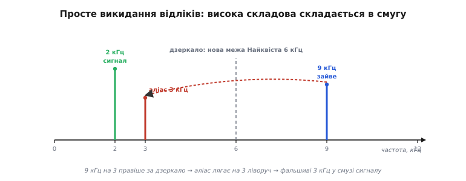
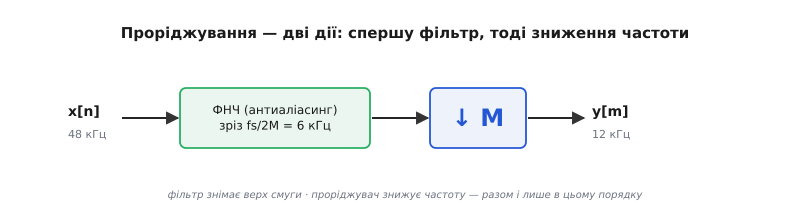
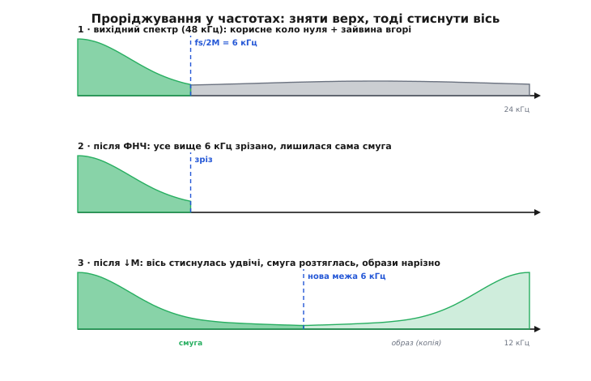
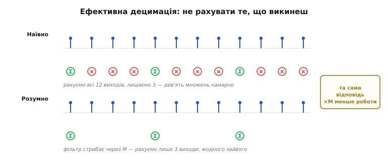
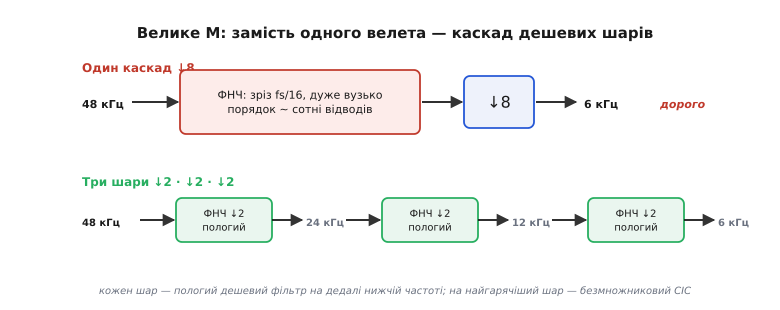

# Проріджування (decimation): фільтр і зниження частоти відліків

<preknowlist>
- [Найквіст і аліасинг](book:communications/nyquist-aliasing) — теорема дискретизації, межа fs/2 і дзеркальне складання частот, що лежать вище за неї.
- [Дискретизація й квантування](book:electronics/sampling-quantization) — що таке відлік і частота відліків fs.
- [КІХ-фільтр](book:algorithms/fir-filter) — фільтр як зважена сума сусідніх відліків; як низькочастотний фільтр зрізає верхні частоти.
- [Спектр](book:math/spectrum) — подання сигналу як набору частот і що таке його смуга.
</preknowlist>

Маєш потік відліків, що йде швидко — скажімо, 48 000 разів на секунду, — а зберігати чи обробляти хочеш утричі-вчетверо повільніший. Найпряміший здогад: лишити кожен четвертий відлік, а три проміжні викинути. Здогад природний — і підступний. Якщо зробити **тільки** це, дані зіпсуються так само безнадійно, як від найгрубішого [аліасингу](book:communications/nyquist-aliasing). Бо викинути три відліки з чотирьох — це не «трохи проредити», а буквально **наново дискретизувати** сигнал, тепер уже вчетверо рідше. А рідша дискретизація опускає межу Найквіста, і все, що лежало вище за нову межу, дзеркально складеться вниз — і сяде просто в смугу корисного сигналу, невідрізнянно від нього.

Ось чому проста на вигляд дія «викинь зайві відліки» насправді складається з двох, і перша з них — не викидання. Спершу треба **зняти фільтром усе, що не вміститься під нову межу Найквіста**, і аж тоді проріджувати. Ця пара — низькочастотний фільтр плюс зниження частоти відліків — і зветься **проріджуванням, або децимацією (*decimation*, від лат. *decimatio* — «вилучення десятого»: у римському війську так карали збунтований підрозділ, кожен десятий за жеребом гинув від рук власних товаришів)**. У цифровій обробці «десятого» замінив довільний крок, та назва прижилася.

Розберімо, чому інакше не можна, як влаштована кожна з двох дій і чому їхній порядок непорушний.

### Чому просте викидання відліків бреше

Позначмо, у скільки разів рідшаємо, буквою M — це **коефіцієнт проріджування (*decimation factor*)**. Лишити кожен M-й відлік означає: нова частота відліків стала fs/M. А з нею опустилася й межа чесності — [частота Найквіста](book:communications/nyquist-aliasing): була fs/2, стала fs/(2M). Усе, що в сигналі лежало між новою межею fs/(2M) і старою fs/2, тепер опинилося **вище** за дозволене. За законом складання воно дзеркально відіб'ється від нової межі й повернеться вниз, у смугу під fs/(2M).

Приклад робить це відчутним. Потік іде на fs = 48 кГц, беремо M = 4, отже нова частота — 12 кГц, нова межа Найквіста — 6 кГц. Хай у сигналі, крім корисного тону 2 кГц, є ще складова на 9 кГц (при 48 кГц вона чесно вміщалася під стару межу 24 кГц і нікому не заважала). Викидаємо три відліки з чотирьох — і 9 кГц, ставши вищою за нову межу 6 кГц, складається до |12 − 9| = 3 кГц. Тепер поряд із чесними 2 кГц у даних оселяються фальшиві 3 кГц, яких у сигналі не було.


*Дзеркало стоїть на новій межі Найквіста 6 кГц. Корисний тон 2 кГц (зелений) лишається собою. А складова 9 кГц, що при 48 кГц не заважала, після викидання відліків відбивається від дзеркала й лягає хибними 3 кГц (червоний) — просто в смугу, поряд із сигналом. Відрізнити її від справжніх 3 кГц уже неможливо.*

Найгірше тут те саме, що робить аліасинг класичною пасткою: підробка нічим не позначена. Відрізнити фальшиві 3 кГц від справжнього тону 3 кГц по самих відліках уже неможливо — інформацію втрачено в мить проріджування, точно як при аналоговому аліасингу перед АЦП. Отже, висновок неминучий: **перш ніж викидати відліки, треба звільнити верхню частину смуги** — зняти все, що не вміститься під нову межу fs/(2M). Тоді складатися просто не буде чому.

### Дві дії проріджування

Отже, проріджування у M разів — це строго дві дії, у строгому порядку:

1. **Згладити низькочастотним фільтром.** Пропустити сигнал крізь [фільтр низьких частот](book:algorithms/fir-filter) зі зрізом на новій межі fs/(2M) — прибрати все вище за неї. Цей фільтр тут виконує ту саму роль, що аналоговий антиаліасинговий фільтр перед АЦП: не пускає у пастку те, що в неї впало б.
2. **Проредити.** Лишити кожен M-й відлік, решту M−1 викинути. Оце і є **зниження частоти відліків (*downsampling*)** — власне зменшення потоку.


*Канонічний ланцюг децимації. Вхідний потік на 48 кГц спершу проходить крізь низькочастотний фільтр зі зрізом fs/(2M) = 6 кГц, який знімає все, що не вміститься під нову межу. Аж тоді блок «↓M» лишає кожен четвертий відлік. На виході — чистий потік на 12 кГц. Ні фільтр без проріджування (він не знижує частоти), ні проріджування без фільтра (воно спричиняє аліасинг) поодинці децимацією не є.*

Порядок цих дій непорушний, і причина — та сама невиправність, що й у Найквіста. Якби ми спершу проредили, а тоді фільтрували, було б уже пізно: аліас склався б у мить викидання відліків, змішавшись із сигналом нерозривно, і жоден фільтр потім його не відділить — бо в даних немає підпису, за яким хибну частоту можна відрізнити від справжньої. Фільтр рятує лише **до** проріджування, поки небезпечні частоти ще стоять окремо й фільтр може їх дістати. Тому золоте правило дискретизації — «фільтруй, перш ніж (пере)дискретизуєш» — тут діє буквально: спершу фільтр, аж тоді викидання.

> 🔧 **Навіщо це.** Найчастіша помилка початківця — «зчитувати давач рідше, ніж він видає». Гіроскоп сипле 8 кГц, а тобі треба 500 Гц у контур керування — і рука тягнеться просто брати кожен шістнадцятий відлік. Так робити **не можна**: увесь широкосмуговий шум давача (а його там багато вище за 250 Гц) складеться вниз і сяде в твою робочу смугу, зіпсувавши саме те, що ти намагаєшся точно виміряти. Правильно — децимація: пропустити через цифровий ФНЧ зі зрізом ~250 Гц, аж тоді проредити. Зайвий бонус — фільтр заодно приглушить шум.

### Що робить фільтр у спектрі

Щоб побачити, чому фільтр і справді закриває пастку, корисно подивитися на весь процес у частотах. Зниження частоти відліків робить зі спектром просту, але спершу неочевидну річ: **розтягує його**. Якщо відліків за секунду поменшало в M разів, то ті самі форми сигналу тепер займають пропорційно більшу частку нової (меншої) частотної осі — наче ту саму картинку розтягли по горизонталі. Смуга [0 … fs/(2M)], що була лише вузьким шматочком коло нуля, розтягується на весь новий діапазон [0 … нова fs/2].


*Три кроки в спектрі. Вгорі — вихідний спектр на 48 кГц: корисна смуга коло нуля, а вище fs/(2M) = 6 кГц ще тягнеться зайвина. Посередині — після ФНЧ: усе вище 6 кГц зрізано, лишилася сама корисна смуга. Внизу — після «↓M»: вісь стиснулась, корисна смуга розтяглася на весь новий діапазон, а її дзеркальні копії (образи) стали на кратних новій частоті й **не перекриваються** — саме тому, що зайвину зняли заздалегідь.*

Глибша механіка така сама, як в аліасингу: дискретизація розмножує спектр, ставлячи його копії довкола кожної кратної частоти відліків. Поки сигнал вміщається під fs/(2M), нова, густіша сітка копій стоїть окремо. Та щойно в сигналі є частоти вище за цю межу — сусідні копії, зсунувшись ближче через меншу частоту, **перекриваються**, і це накладання ми й бачимо як аліас. Фільтр обрізає сигнал так, щоб копіям не було чим перекриватися. [Точну формулу цього розмноження й розтягу спектра](book:communications/decimation/math-decimation-spectrum.md) — з якої видно, звідки береться множник M і чому фільтр рятує, — виведено окремо.

Тут варто відзначити одну відмінність від антиаліасингу перед АЦП, бо вона часто спантеличує. Перед АЦП фільтр **мусить** бути аналоговим — із реального заліза, — бо після оцифрування аліас уже вбудований у числа й не виймається. А тут фільтр — **цифровий**, і це не халтура, а норма. Різниця в тому, що на високій частоті fs сигнал уже є чистим, чесним цифровим поданням (аліасингу ще нема, якщо fs на вході АЦП обрали правильно). Ми не оцифровуємо аналог наосліп, а **перевибираємо з уже відомого доброго цифрового сигналу** — тож цифровий фільтр устигає прибрати небезпечну смугу, поки відліки ще густі й вона в них ще стоїть окремо. Принцип «фільтруй перед (пере)дискретизацією» той самий; змінилося тільки те, що і сигнал, і фільтр тепер цифрові.

### Не рахувати те, що викинеш

Прямолінійна реалізація напрошується сама: пропусти **кожен** відлік крізь фільтр на повній частоті, а тоді з готового потоку лиши кожен M-й. Працює — але марнує сили. Фільтр — це зважена сума кількох сусідів (для КІХ порядку N — N множень-додавань на кожен вихідний відлік); а ми з M порахованих виходів M−1 одразу викидаємо. Виходить, більшу частину дорогої роботи роблено намарно.

Ключове спостереження просте: **рахуй лише ті виходи, що лишаться.** Оскільки нам потрібен кожен M-й вихідний відлік, немає сенсу обчислювати проміжні — досить рухати вікно фільтра одразу на M позицій і рахувати вихід тільки там, де він виживе. Це відразу дає виграш **у M разів** за обчисленнями.


*Угорі — наївно: фільтр працює на кожному відліку, потім три виходи з чотирьох викидаємо (перекреслено) — три чверті множень намарно. Внизу — розумно: вікно фільтра стрибає одразу через M відліків, і жоден зайвий вихід не рахується. Та сама відповідь, у M разів менше роботи.*

Ця ідея веде до [поліфазного розкладу](book:algorithms/polyphase-fir) — способу перебудувати КІХ у M дрібніших підфільтрів так, що кожен вхідний відлік уживається рівно раз, а жоден викинутий вихід не обчислюється взагалі. Фільтр і проріджувач тоді зливаються в одну ощадну операцію. Але навіть без поліфазної хитрощі базовий прийом «рахуй тільки виживших» уже забирає головну частину зайвих множень.

Варто помітити й приємний побічний наслідок такої обробки: жоден відлік не викинуто «просто так». Перш ніж проредити, фільтр **усереднив** сусідів — тобто кожен викинутий відлік ще встиг зробити внесок у той, що лишився. Тому децимація не лише знижує частоту, а й **приглушує шум**: усереднення випадкового шуму частково його гасить, і це та сама вигода, що робить [передискретизацію з наступною децимацією](book:electronics/oversampling-decimation) улюбленим способом видобути з АЦП зайві «чесні» біти [роздільності](book:electronics/adc-resolution).

**Приклад (виграш в обчисленнях).**

```
КІХ-фільтр 64 відводи, вхід fs = 48 кГц, M = 4 → вихід 12 кГц

Наївно (фільтрувати все, тоді викинути):
  64 множення × 48 000 виходів/с = 3 072 000 множень/с

Розумно (рахувати лише виходи, що лишаться):
  64 множення × 12 000 виходів/с =   768 000 множень/с

Виграш = 3 072 000 / 768 000 = 4 = M
```
Висновок: правильна децимація коштує рівно стільки, скільки фільтр на **вихідній** (низькій) частоті, а не на вхідній. Що більше M, то дорожчою була б наївна реалізація й то більший виграш дає лічба лише потрібних виходів. [Робочий проріджувач на C](book:communications/decimation/proj-decimator-c.md) — із КІХ-фільтром, лічбою тільки виживших виходів і пасткою переповнення в цілочисловій арифметиці — зібрано окремим проєктом.

### Коли M велике: багато шарів і CIC

Дотепер ми мовчки припускали, що один фільтр упорається. Та коли M велике — скажімо, 64 чи 256, як буває на виході [сигма-дельта-АЦП](book:electronics/sigma-delta-adc), — один фільтр стає непідйомним. Причина в тому, що зріз fs/(2M) відсовується дуже близько до нуля, а перехідна смуга фільтра (від краю пропускання до початку загородження) мусить бути вузькою відносно високої вхідної частоти. А вузький перехід означає високий порядок: чим гостріший злам, тим більше відводів — сотні, а то й тисячі множень на відлік, ще й на найвищій частоті.

Рятунок — робити спуск **не одним стрибком, а сходами**. Розкладаємо M на множники, M = M₁·M₂·…, і проріджуємо шарами: перший шар знижує частоту трохи, другий — ще, і так далі. Хитрість у тому, що кожному шару можна дати **пологий, дешевий** фільтр: він не мусить бути ідеальною стіною, бо наступні шари доберуть решту, а сам він до того ж уже працює на нижчій частоті, ніж повний одноступеневий. Сумарна робота падає різко.


*Угорі — один каскад на M = 8: зріз тиснеться до нуля, перехід дуже вузький, фільтру потрібні сотні відводів на повній частоті. Внизу — той самий M = 8 як три шари ↓2·↓2·↓2: кожен фільтр пологий і короткий, і кожен наступний працює на дедалі нижчій частоті. Загальна ціна — у рази менша.*

А на найгарячішому місці — там, де 1-бітний потік сигма-дельта-АЦП летить на мегагерцах, — навіть дешевий КІХ на першому шарі задорогий, бо множення на таких частотах коштують надто багато. Тут царює **CIC-фільтр (каскад інтегратор–гребінка, *cascaded integrator-comb*)** — [винахід Юджина Гогенауера 1981 року](book:communications/decimation/hist-multirate-birth.md), що взагалі **не має множників**: кілька інтеграторів-суматорів на високій частоті, тоді проріджувач, тоді стільки ж «гребінкових» ланок на низькій — самі додавання й віднімання. Саме тому [CIC](book:algorithms/cic-filter) — стандартний перший шар децимації в кожному сигма-дельта-АЦП і в приймачах програмного радіо: він дешево збиває шалену частоту в кілька разів, а тонке доведення смуги вже віддає звичайному КІХ на комфортній низькій частоті.

### Де це живе

Децимація — не академічна вправа, а щоденний робочий коник цифрової обробки. Ось де вона стоїть насправді.

**Сигма-дельта-АЦП.** Такий АЦП навмисно оцифровує грубо (часто одним бітом), зате шалено швидко — на мегагерцах, — а тоді децимація перетворює цей потік у повноцінне 16–24-бітне число на кілька кілогерц. Проріджувальний фільтр тут робить подвійну роботу: знижує частоту й водночас усереднює, витягуючи з одного біта на високій частоті багато біт роздільності на низькій.

**Програмне радіо (SDR).** Приймач захоплює широку смугу ефіру на високій частоті, змішує потрібний канал до нуля, а тоді децимацією стягує його до вузького потоку, який уже під силу процесору. Без децимації обробляти повну смугу було б і дорого, і непотрібно.

**Конвеєри давачів.** Інерційний давач видає 8 кГц, контур керування дроном працює на 1 кГц — між ними стоїть децимація: ФНЧ зі зрізом ~500 Гц зрізає вібраційний шум, тоді проріджування зводить потік до потрібної частоти. Так само зводять частоти, коли дані з кількох давачів треба [злити](book:communications/sensor-fusion) на спільній нижчій частоті.

**Перечислення частоти в аудіо.** 48 кГц → 16 кГц — це децимація з M = 3. А коли відношення не ціле (класика: 44.1 кГц студії проти 48 кГц відео), децимацію поєднують із її дзеркальною дією — [інтерполяцією (upsampling)](book:communications/interpolation-upsampling), яка не викидає, а **вставляє** відліки й згладжує їх фільтром. Спершу піднімають частоту в L разів інтерполяцією, тоді опускають у M разів децимацією — і дістають перечислення в раціональне L/M разів.

> 🔧 **Навіщо це.** Коли бачиш у даташиті АЦП чи радіочипа параметр «*decimation ratio*» або «*OSR* (oversampling ratio)» — це і є M цієї теми. Він прямо в'яже три речі: вихідну частоту (fs/M), доступну смугу сигналу (нижче fs/(2M)) і роздільність (більше M — тихіший шум, більше чесних біт). Тому вибір M — це не налаштування «аби працювало», а свідомий розмін між швидкістю, смугою і чистотою: піднімеш M — дістанеш точніші, тихіші, але рідші виміри.

### Разом

Проріджування зводиться до одного твердого правила: **спершу фільтр, тоді викидання відліків** — і ніколи навпаки. Викидання саме собою знижує частоту, але наново відкриває пастку аліасингу; фільтр саме собою частоти не знижує, зате закриває пастку, знімаючи все, що не вміститься під нову межу Найквіста. Разом вони й дають чесне зниження частоти відліків. А далі — самі інженерні розсуди: рахувати лише виходи, що лишаться (виграш у M разів), розбивати велике M на дешеві шари, ставити на найгарячіший шар безмножниковий CIC. Але хоч би скільки хитрощів наросло згори, серце операції незмінне — фільтр, який мусить попрацювати першим.
