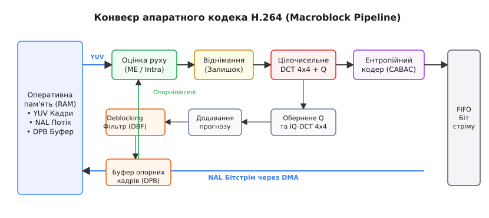
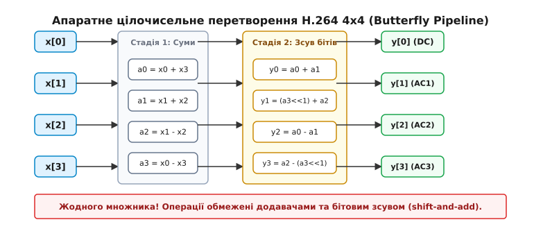
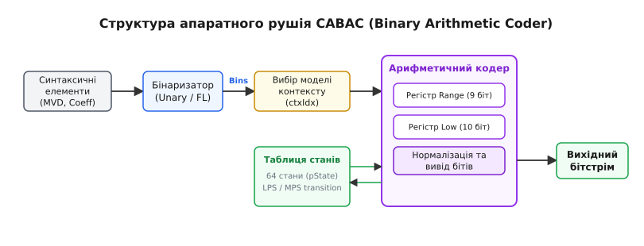

# Апаратний кодек H.264

<preknowlist>
- [Колірне субдискретування](topic:communications/chroma-subsampling) — подання колірності у формі YCbCr 4:2:0 для зменшення обсягу даних.
- [Смуга пропускання](topic:communications/bandwidth) — співвідношення між частотою відліків, роздільністю та бітрейтом відеопотоку.
</preknowlist>

Обробка нестисненого відеопотоку високої чіткості Full HD (1920×1080 пікселів при 60 кадрах на секунду) у форматі YCbCr 4:2:0 створює вхідний потік даних обсягом 186.6 Мбайт/с (або 1.49 Гбіт/с). Для стиснення цього масиву за допомогою програмного енкодера на центральному процесорі потрібно виконати понад 15 мільярдів арифметичних операцій на секунду: обчислити вектори руху для 8 160 макроблоків у кожному кадрі, виконати субпіксельну інтерполяцію, цілочисельне перетворення 4x4, квантування та послідовне ентропійне кодування CABAC. Виконання цих обчислень на універсальних ядрах CPU вимагає 10–16 обчислювальних потоків, завантажує процесор на 100% і споживає 60–90 Вт потужності, роблячи неможливим потокове кодування на мобільних пристроях, у дронах або автономних відеокамерах.

Розв'язанням цієї обчислювальної кризи стало створення спеціалізованого апаратного прискорювача — IP-ядра апаратного кодека H.264 (Hardware Video Codec Engine / VPU). Перенесення алгоритму стиснення у жорстку кремнієву логіку (ASIC) дозволяє обробляти макроблоки у фіксованому конвеєрі із затримкою у кілька тактів, використовуючи локальні SRAM-буфери та прямий доступ до пам'яті (DMA), що знижує споживання потужності до менш ніж 1 Вт при обробці потоку 1080p60.

## Фізичні обмеження програмного кодування

При кодуванні відео на універсальному процесорі кожна операція обробки пікселя вимагає довгого вибірково-декодувального циклу інструкцій: зчитати команду з L1-кешу інструкцій, завантажити відліки пікселів з L2/L3 кешу або DRAM через шину пам'яті, виконати арифметичну операцію у регістрах ALU та записати результат назад. Для відео 1080p60 кількість таких інструкцій сягає кількох мільярдів на секунду.

Основний обчислювальний затор у програмних кодеках виникає у чотирьох вузлах:

1. **Оцінка руху (Motion Estimation):** перебір сотень кандидатів векторів руху для кожного з 8 160 макроблоків кадру вимагає постійного випадкового зчитування сусідніх областей пам'яті. Універсальний кеш процесора постійно зазнає промахів (cache misses), зупиняючи обчислювальні конвеєри ALU через очікування завантаження даних із системної DRAM.
2. **Адаптивне двійкове арифметичне кодування (CABAC):** кожен біт вихідного потоку кодується послідовно із залежністю від стану ймовірності попередньо згенерованого біта. Цей алгоритм є строго послідовним і не піддається векторній паралелізації через SIMD-інструкції (AVX2 або NEON).
3. **Субпіксельна інтерполяція:** розрахунок дробових координат векторів руху вимагає багаторазового застосування 6-точкових FIR-фільтрів до кожного пікселя, що перевантажує арифметичні блоки процесора повторними обчисленнями точок.
4. **Контурна деблокінг-фільтрація (In-Loop Deblocking Filter):** перевірка умов фільтрації для кожної межі 4x4 блоку вимагає інтенсивного розгалуження коду (`if/else`), що спричиняє помилки прогнозування переходів (branch misprediction) у глибоких конвеєрах процесора.

Виконання цих завдань у кремнії досягається відмовою від універсальних команд і переходом до архітектури потоку даних (Dataflow Architecture). В апаратному кодеку немає програмного лічильника інструкцій та вибірки команд. Замість цього пікселі безперервно протікають крізь спеціалізовані логічні вентилі, з'єднані в жорсткий конвеєр. Детальніше дивіться у вставці про [історію появи апаратного прискорення H.264](topic:communications/h264-hardware-codec/hist-h264-hardware.md).

## Внутрішня конвеєрна архітектура апаратного кодека

Апаратне IP-ядро H.264 являє собою комбінацію обчислювальних модулів, з'єднаних шинами даних високої швидкодії (наприклад, AMBA AXI4), та локальних SRAM-буферів для тимчасового збереження рядків пікселів (Line Stores).


*Функціональні блоки апаратного IP-ядра H.264: від завантаження YUV-кадру через DMA до видачі байтового NAL-потоку.*

Конвеєр кодування розбитий на ізольовані стадії, які працюють паралельно над різними макроблоками кадру за принципом двостороннього подвійного буферизування (Ping-Pong Buffering):

- **Контролер DMA та буфер макроблока:** DMA-контролер зчитує з системної пам'яті (RAM) поточний YUV-масив кадру пакетами (Burst Transfers) та завантажує макроблок 16x16 пікселів яркості Y і два блоки 8x8 колірності Cb/Cr у локальну оперативну пам'ять кодека (SRAM Macroblock Buffer). Локальна пам'ять виключає затримки звернення до зовнішньої DRAM під час арифметичної обробки.
- **Рушій прогнозування (Intra / Inter Engine):** паралельно обчислює прогнозований макроблок. У режимі Intra використовуються вже закодовані сусідні пікселі з верхнього та лівого SRAM-буферів. У режимі Inter зчитуються опорні кадри з буфера розпакованих кадрів (Decoded Picture Buffer, DPB).
- **Вузол обчислення залишку (Residual Subtraction):** елемент за елементом віднімає прогнозовані значення від вхідних пікселів, формуючи матрицю різницевих помилок (Residual Matrix).
- **Блок цілочисельного перетворення та квантування (Integer Transform & Quantization):** переводить різницевий сигнал 4x4 із просторової області у частотну та зменшує динамічний діапазон коефіцієнтів відповідно до параметра квантування `QP`.
- **Зворотний контур відновлення (Reconstruction Loop):** містить блоки оберненого квантування та оберненого 4x4 цілочисельного перетворення. Він відновлює кадр точно у тому вигляді, в якому його побачить декодер на приймальному боці, і передає відліки в контурний деблокінг-фільтр.
- **Деблокінг-фільтр (Deblocking Filter):** усуває сіткові артефакти на межах 4x4 блоків і записує оновлений кадр у DPB-буфер пам'яті RAM для використання як опорного при кодуванні наступних кадрів.
- **Ентропійний кодер (CABAC / CAVLC Engine):** упаковує квантовані коефіцієнти, вектори руху та службові заголовки у двійковий потік байтів і записує його у вихідне FIFO.

Завдяки конвеєризації в той час, коли модуль CABAC кодує синтаксичні елементи макроблока `N`, блок цілочисельного перетворення обробляє макроблок `N+1`, рушій оцінки руху шукає вектори для макроблока `N+2`, а контролер DMA завантажує з RAM макроблок `N+3`.

## Структура зрізів (Slices) та типів кадрів

Для гнучкого керування стисненням та стійкістю до помилок каналу зв'язку кадри у H.264 розбиваються на один або кілька зрізів (Slices). Кожен зріз кодується автономно від інших, завдяки чому втрата одного зрізу у мережевому пакеті не пошкоджує сусідні зрізи кадру.

Стандарт розрізняє такі типи зрізів та кадрів:

- **I-зріз (Intra Slice):** кодується виключно з використанням просторового Intra-прогнозування. I-кадри не вимагають інших кадрів для розпакування і слугують точками випадкового доступу (Random Access Points).
- **P-зріз (Predictive Slice):** кодується з використанням Intra-прогнозування або однонаправленого Inter-прогнозування відносно одного з попередньо закодованих опорних кадрів зі списку `RefPicList0`.
- **B-зріз (Bi-predictive Slice):** кодується з використанням двонаправленого Inter-прогнозування відносно двох опорних кадрів зі списків `RefPicList0` (минулі кадри) та `RefPicList1` (майбутні кадри у порядку відображення).
- **SP та SI-зрізи (Switching Slices):** спеціалізовані типи зрізів, призначені для безшовного перемикання між відеопотоками різних бітрейтів без накопичення похибок Inter-прогнозування.

Апаратний кодек будує заголовки зрізів (Slice Headers) та упаковує їх у NAL-одиниці з відповідними маркерами типів (`NAL_UNIT_TYPE_NON_IDR`, `NAL_UNIT_TYPE_IDR`, `NAL_UNIT_TYPE_SPS`, `NAL_UNIT_TYPE_PPS`).

## Просторове та часове усунення надмірності у кремнії

Для стиснення зображення кодек вилучає просторову надмірність (у межах одного кадру) та часову надмірність (між сусідніми кадрами у часі).

### Апаратне Intra-прогнозування

При Intra-кодуванні кодек не звертається до зовнішньої пам'яті RAM за опорними кадрами. Замість цього він будує прогноз макроблока 16x16 на основі крайніх пікселів вже закодованих сусідніх макроблоків (зверху, зліва, зверху-зліва).

Для блоків яркості 4x4 апаратний модуль Intra за один такт обчислює 9 можливих режимів прогнозування:

- **DC (Режим 2):** середнє значення сусідніх пікселів.
- **Vertical (Режим 0) та Horizontal (Режим 1):** копіювання верхнього або лівого рядка пікселів.
- **Діагональні режими (Режими 3–8):** взважена інтерполяція сусідніх пікселів під кутами 45°, 22.5° та 135°.

Спеціалізований масив додавачів обчислює для кожного з 9 режимів метрику похибки SATD (Sum of Absolute Transformed Differences) або SAD (Sum of Absolute Differences):

```
SAD = ∑ | Original[i] - Predicted[i] |
```

Оптимальний режим обирається з урахуванням оцінки швидкості кодування за формулою Rate-Distortion Optimization (RDO): `Cost = SAD + λ · BitCost`. Режим з найменшою вартістю обирається за допомогою комбінаторного порівнювача (Tree Comparator) і його індекс передається в ентропійний кодер.

### Апаратне Inter-прогнозування та оцінка руху

При Inter-кодуванні пошук аналогічного блоку виконується у раніше закодованих кадрах. Відстань між поточним блоком та знайденим блоком у пам'яті називається вектором руху `(MV_x, MV_y)`. Для зменшення кількості переданих бітів кодек кодує не сам вектор руху, а його різницю `MVD` відносно прогнозованого вектора `MVP`:

```
MVD = MV - MVP
```

Де прогнозований вектор `MVP` обчислюється як медіана векторів руху трьох сусідніх макроблоків (зліва, зверху та зверху-праворуч): `MVP = median(MV_A, MV_B, MV_C)`.

Для забезпечення високої точності H.264 дозволяє розбивати макроблок 16x16 на дрібніші вкладені субблоки: 16x8, 8x16, 8x8, 8x4, 4x8 та 4x4 пікселі. Кожен субблок може мати власний вектор руху. Використання дрібних субблоків дозволяє точніше компенсувати складний рух об'єктів з нерівними межами (наприклад, обертання або нахил).

Кодек використовує четвертьпіксельну точність (1/4-pel resolution). Зчитування дробових координат виконується у два етапи за допомогою апаратних FIR-фільтрів:

1. **Половинні пікселі (1/2-pel):** обчислюються застосуванням симетричного 6-точкового FIR-фільтра з коефіцієнтами `(1, -5, 20, 20, -5, 1) / 32` до цілочисельних відліків.
2. **Четвертинні пікселі (1/4-pel):** обчислюються білінійною інтерполяцією між сусідніми половинними та цілочисельними пікселями.

Апаратна реалізація оцінки руху базується на систолічному масиві обчислювальних елементів (Systolic PE Array). Масив з 16×16 паралельних віднімачів та накопичувачів абсолютних різниць обчислює значення SAD для усієї сітки шуканого вікна (Search Window) за кілька десятків тактів. Це робить апаратну оцінку руху в сотні разів швидшою за програмні цикли на CPU.

## Керування буфером розпакованих кадрів (DPB)

Для виконання Inter-прогнозування апаратний кодек і декодер підтримують буфер розпакованих кадрів (Decoded Picture Buffer — DPB). Буфер зберігає відновлені кадри у системній пам'яті DRAM.

Управління DPB здійснюється двома механізмами:

- **Ковзне вікно (Sliding Window Memory Control):** найстаріший опорний кадр автоматично видаляється з пам'яті при досягненні максимальної місткості DPB (значення задається рівнем H.264, наприклад 4–16 кадрів).
- **Команди керування пам'яттю (Memory Management Control Operation — MMCO):** дозволяють явним чином позначати конкретні кадри як довгострокові опорні кадри (Long-Term Reference Frames) або видаляти їх за індексом.

Апаратний кодек організовує списки опорних кадрів `RefPicList0` та `RefPicList1`, упорядковуючи кадри за порядковим номером кадру (Frame Number) або номером порядку відображення (Picture Order Count — POC).

## Цілочисельне перетворення 4x4 та квантування без множників

Класичне косинусне перетворення (ДКТ) вимагає обчислень з дійсними числами і косинусами кутів. В апаратних реалізаціях це створювало великі труднощі, оскільки додавання блоків множення з плаваючою крапкою сильно збільшувало площу кристала та енергоспоживання.

Стандарт H.264 вирішив цю проблему, замінивши ДКТ на точне 4x4 цілочисельне перетворення (Integer Transform). Матриця перетворення `C` містить виключно цілі числа 1 та 2:

```
C = [  1   1   1   1 ]
    [  2   1  -1  -2 ]
    [  1  -1  -1   1 ]
    [  1  -2   2  -1 ]
```


*Обчислення 4x4 цілочисельного перетворення H.264 за схемою «метелик» у регістрах апаратного прискорювача.*

Двовимірне перетворення блоку `X` обчислюється як `Y = C · X · Cᵀ`. Завдяки наявності лише коефіцієнтів 1 та 2, множення на 2 реалізується зсувом біта вліво (`x << 1`), а весь матричний добуток обчислюється на схемі «метелик» (Butterfly Structure) з використанням 8 додавачів та 6 віднімачів без жодного множника.

Масштабування дійснозначних коефіцієнтів повністю перенесено у блок квантування. Квантування коефіцієнта `Y[i][j]` виконується за формулою:

```
Z[i][j] = ( Y[i][j] · MF[QP][i][j] + f ) >> qbits
```

Де `MF[QP]` — фіксоване ціле число з таблиці масштабування для поточного параметра квантування `QP`, а `qbits` — кількість бітів зсуву. Вся арифметика перетворення та квантування виконується на цілочисельних регістрах розрядністю 16 біт. Детальне виведення формул та матричне розкладання наведено у вставці про [математичний вивід цілочисельного перетворення H.264](topic:communications/h264-hardware-codec/math-h264-transform.md).

## Апаратні рушії ентропійного кодування: CAVLC та CABAC

Після квантування більшість AC-коефіцієнтів у блоці 4x4 стають нульовими. Ентропійний кодер упаковує ненульові коефіцієнти та службові дані у вихідний двійковий потік.

Стандарт передбачає два режими ентропійного кодування:

- **CAVLC (Context-Adaptive Variable-Length Coding):** базується на таблицях префіксних кодів Хаффмана та кодах Голомба-Райса. Кодер підбирає таблицю на основі кількості ненульових коефіцієнтів у сусідніх блоках. CAVLC легко реалізується у кремнії через таблиці пошуку (LUT) та зсувні регістри, вимагаючи мінімальної площі кристала.
- **CABAC (Context-Adaptive Binary Arithmetic Coding):** забезпечує на 10–15% вищий ступінь стиснення за рахунок використання двійкового арифметичного кодування з динамічним оновленням ймовірностей.


*Структура конвеєра CABAC: від бінаризатора до арифметичного кодера з оновленням контекстної пам'яті.*

Апаратний рушій CABAC складається з трьох послідовних блоків:

1. **Бінаризатор (Binarizer):** перетворює недвійкові синтаксичні елементи (вектори руху, коефіцієнти) у послідовність двійкових бінів (Bins) за допомогою унарних кодів або кодів Еліаса.
2. **Селектор моделей контексту (Context Modeler):** обирає для кожного біна один із 460 контекстів. Контекст зберігає стан ймовірності `pStateIdx` (від 0 до 63) та значення найімовірнішого символу `valMPS` (0 або 1).
3. **Двійковий арифметичний кодер (Binary Arithmetic Coder — BAC):** підтримує 9-бітний регістр діапазону `range` та 10-бітний регістр нижньої межі `low`. При обробці біна `range` розщеплюється на піддіапазони MPS та LPS. Після кожного біна стан ймовірності у таблиці оновлюється.

Головна складність реалізації CABAC у кремнії полягає у наявності зворотного зв'язку: стан ймовірності для біна `N+1` залежить від результату кодування біна `N`. Апаратні розробники долають це за допомогою спеціалізованих двостадійних регістраційних конвеєрів із спекулятивним обчисленням обох гілок (MPS і LPS) паралельно. Практичний приклад алгоритму ви знайдете у вставці про [реалізацію двійкового арифметичного кодера CABAC](topic:communications/h264-hardware-codec/proj-h264-cabac-pipeline.md).

## Контурний деблокінг-фільтр (In-Loop Deblocking Filter)

Незалежне квантування блоків 4x4 створює розриви яскравості на їхніх межах — артефакт блочності (Blockiness). H.264 включає адаптивний фільтр згладжування безпосередньо у контур кодування. Це означає, що відфільтровані кадри використовуються як опорні для подальшого Inter-прогнозування.

Фільтрація виконується для кожної межі 4x4 блоку. Інтенсивність згладжування визначається параметром «силою межі» (Boundary Strength — `Bs`), який обчислюється апаратно за правилами:

- **`Bs = 4` (Максимальна фільтрація):** межа макроблока у режимі Intra-кодування.
- **`Bs = 3`:** межа блоку 4x4 у режимі Intra-кодування.
- **`Bs = 2`:** межа блоку з ненульовими квантованими коефіцієнтами.
- **`Bs = 1`:** межа блоку з різними векторами руху або різними опорними кадрами.
- **`Bs = 0` (Фільтрація відсутня):** ззвичайні сусідні блоки без різниці у русі та коефіцієнтах.

Апаратний блок DBF містить SRAM-буфери рядків (Line Stores) для збереження нижніх рядків пікселів попереднього макроблока. Фільтрація застосовується лише тоді, коли різниця пікселів на межі не перевищує порогових значень `α(QP)` та `β(QP)`. Якщо різниця більша за поріг `α`, фільтр вважає розрив справжнім контуром об'єкта і пропускає його без згладжування. Це дозволяє усувати штучні блочні кроки, зберігаючи дрібні деталі та чіткі межі об'єктів у кадрі.

## Інтеграція з операційною системою та керування бітрейтом

У сучасних ОС (Linux, Android) взаємодія з апаратним кодеком здійснюється через драйвери ядра та підсистеми V4L2 Memory-to-Memory (M2M), VA-API або вендорні API (NVIDIA NVENC, Intel QuickSync). Драйвер створює у просторі ядра черги вхідних `OUTPUT` та вихідних `CAPTURE` буферів. Завдяки механізму DMA-BUF (Zero-Copy) YUV-кадри передаються з відеокарти або камери у кодек безпосередньо через файлові дескриптори пам'яті без копіювання у процесорне середовище. Детальну специфікацію дивіться у вставці про [інтерфейс V4L2 для апаратних кодеків](topic:communications/h264-hardware-codec/api-v4l2-codec.md).

За підтримання цільового бітрейту відповідає апаратний модуль керування швидкістю (Rate Control Engine). Він реалізує алгоритми регулювання параметрів стиснення у реальному часі за моделлю «прорярявленого відра» (Leaky Bucket Model):

1. **CBR (Constant Bitrate):** жорстко утримує постійний бітрейт для трансляцій у реальному часі. Апаратний регулятор відстежує заповнення вихідного буфера FIFO: якщо буфер переповнюється, регулятор миттєво збільшує `QP` для наступних макроблоків, знижуючи деталізацію; якщо випорожнюється — зменшує `QP`.
2. **VBR (Variable Bitrate):** варіює бітрейт залежно від складності сцени, зберігаючи високу якість під час швидкого руху та виділяючи менший бітрейт на статичні кадри.
3. **CQP (Constant QP):** кодує усі кадри з фіксованим параметром квантування. Використовується для локального запису відео найвищої якості.

Апаратні кодеки реалізують регулювання `QP` не лише на рівні кадру, а й адаптивно у межах одного кадру (Macroblock-level Rate Control). Модуль аналізу просторової складності оцінює дисперсію пікселів у макроблоці: для однорідних ділянок (наприклад, чистого неба) параметр `QP` збільшується, а для деталізованих текстур (обличчя, дрібний текст) `QP` зменшується для збереження зорової чіткості.

У багаторакурсних серверних відеосистемах системний арбітр керує пріоритетами шини AXI (AXI Quality of Service — QoS), гарантуючи апаратному кодеку гарантований допуск до DRAM з мінімальною затримкою. Це відвертає переповнення внутрішніх SRAM-буферів і пропуск кадрів під час пікових навантажень на системну оперативну пам'яті.

> 🔧 **Навіщо це.**
> При розробці систем потокового відео з низькою затримкою (наприклад, FPV-дронів, системи захищеного відеозв'язку або онлайн-ігор) неправильне налаштування апаратного кодека призводить до стробування зображення або пропуску кадрів.
> 
> Для мінімізації затримки (Low-Latency Video Pipeline):
> 1. **Встановлюйте простір GOP (Keyframe Interval) у значення FPS (1 секунда):** це гарантує швидку ресинхронізацію приймача при втраті UDP-пакетів без надмірного роздування бітрейту.
> 2. **Вимикайте B-кадри (`b_frames = 0`):** B-кадри вимагають двонаправленого прогнозування (з майбутніх кадрів), що змушує апаратний кодек затримувати видачу потоку на 2–3 кадри у буфері DPB, додаючи 50–100 мс затримки.
> 3. **Використовуйте режим CBR з коротким внутрішньокадровим оновленням (Intra Refresh):** замість передачі великого I-кадра розробник налаштовує кодек кодувати вертикальну смугу макроблоків у режимі Intra у кожному P-кадрі. Це ліквідує сплески бітрейту (Bitrate Spikes) під час генерації ключових кадрів і запобігає переповненню бездротового каналу зв'язку.
