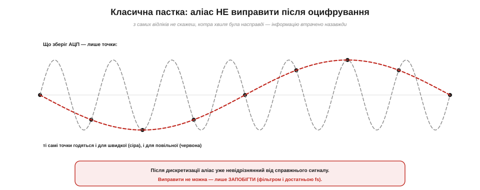
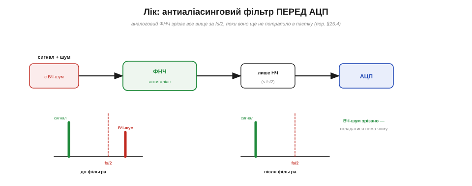

# Частота дискретизації, Найквіст, аліасинг (класична пастка)

[Дискретизація](topic:electronics/sampling-quantization) бере знімки сигналу в рівні миті — лишається ключове питання: **як часто?** Відповідь дає теорема дискретизації, і вона перетворюється на чітке правило, без якого цифрові виміри брешуть. А брешуть вони так: швидкий сигнал, знятий зарідко, безповоротно перевдягається в повільний і видає себе за нього. Це класична пастка цифрових вимірів, яку звуть **аліасингом**, тож розберімо її до дна.

### Частота дискретизації й межа Найквіста

Скільки знімків за секунду робить АЦП — це **частота дискретизації (*sampling rate*, fs)**. Інтуїція проста: що швидше змінюється сигнал, то частіше треба дивитися, аби встигнути за ним. Теорема дискретизації робить цю інтуїцію точною. Вона каже: щоб без утрат схопити сигнал, чия найвища частота дорівнює fmax, треба брати відліки **частіше ніж удвічі** за цю частоту:

```
fs  >  2 × fmax
```

Половину частоти дискретизації називають **частотою Найквіста (fs/2)** — це найвища частота, яку взагалі можна чесно передати за даної fs. Усе, що нижче за неї, АЦП ще здатний відновити; усе, що вище, — приречене.


*Те саме правило «з боку періоду»: на один період сигналу має припадати **більше ніж два** відліки. Густо (багато відліків на період) — хвиля впевнено відновлюється; на самій межі (трохи більше за два) — ще годиться. Менше двох — і починається аліасинг.*

Звідки та «двійка»? Щоб розрізнити коливання, треба впіймати і його «гору», і його «долину» — мінімум дві точки на період, а насправді трохи більше. Один відлік на період побачив би лише однакові точки й вирішив би, що сигнал стоїть на місці. Тому правило fs > 2·fmax — не примха, а абсолютний мінімум, нижче якого інформація про швидкі коливання просто не вміщається у відліки.

Чому саме «більше», а не «рівно» вдвічі? Бо на самій межі може не пощастити з фазою. Уявіть, що відліки випадково лягають точно на нулі синусоїди — на її переходи через середину: тоді всі знімки будуть нульові, і хвиля «зникне» зовсім, хоч за частотою ми її начебто «двома точками на період» і зловили. Саме тому беруть строго більше за дві точки на період, а на практиці — ще з добрим запасом, щоб жодна невдала фаза не змогла приховати сигнал.

### Аліасинг: коли хвиля бреше

Що ж буде, якщо порушити правило — брати відліки заповільно для наявних у сигналі частот? Тоді швидка хвиля «складеться» й прикинеться зовсім іншою, повільною. Це і є **аліасинг (*aliasing*, накладання)**.


*Сіра хвиля робить 7 коливань, але ми взяли лише 8 відліків. Сині точки лягають і на сіру швидку хвилю, і на червону повільну — тож із самих відліків сигнал видається повільним «привидом». Це той самий ефект, що «колесо їде назад» у кіно: кадри-знімки брешуть про швидкий обертовий рух.*

Це не абстракція, а явище, яке ми бачимо щодня. У кіно колеса возів та гвинти літаків часто «крутяться назад» або стоять — бо кадри камери є рідкими знімками, і швидке обертання між ними передається хибно. Стробоскоп «зупиняє» вентилятор за тим самим принципом. Аліасинг у АЦП — це рівно те саме, тільки для напруги: швидке коливання, не вловлене досить частими відліками, постає у даних повільним — і жодним чином не позначене як підробка.

Цей самий обман трапляється й там, де його найменше чекають. Сходи на відео іноді «течуть» угору-вниз, лопаті гелікоптера завмирають у повітрі, спиці велосипеда крутяться навспак — усе це аліасинг частоти кадрів проти швидкого руху. У вимірах він не менш підступний: оцифруєш вібрацію двигуна заповільно — і отримаєш у графіку гладеньку повільну хвилю, якої в реальності немає. Найгірше, що така хвиля виглядає абсолютно правдоподібно, тож хибу легко прийняти за відкриття.

### Механізм: дзеркало на fs/2

Щоб не лякатися аліасингу, а керувати ним, корисно знати, **куди саме** перевдягнеться зайва частота. Правило «складання» просте: частоти вище за Найквіста (fs/2) **відбиваються** від цієї межі, наче від дзеркала, і повертаються в діапазон нижче неї.


*Частота Найквіста fs/2 — це «дзеркало». Сигнал нижче неї (300 Гц) лишається собою. А сигнал вище (700 Гц при fs = 1000) відбивається й з'являється як хибні 300 Гц — нерозрізнянно від справжніх. Загалом аліас(f) = |f − k·fs|.*

Числом це легко перевірити. Нехай fs = 1000 Гц, тоді Найквіст — 500 Гц. Сигнал на 700 Гц вищий за межу, тож складеться до 1000 − 700 = **300 Гц**. Сигнал на 900 Гц дасть хибні 100 Гц, на 1300 Гц — знову 300 Гц (1300 − 1000). Найгірше тут те, що аліас лягає **точно** на те місце, де міг би бути справжній сигнал: хибні 300 Гц від 700-герцового джерела нічим не відрізняються від чесних 300 Гц. Дзеркало не лишає підпису.

Глибша причина цього «дзеркала» така: дискретизація ніби **розмножує** спектр сигналу, створюючи його копії довкола кожної кратної fs частоти. Поки сигнал вміщається нижче за fs/2, копії стоять окремо й не заважають одна одній. Та щойно в ньому з'являються частоти вище за межу, сусідні копії **перекриваються** — і саме це накладання спектрів ми й бачимо як аліас (звідси і його друга назва — «накладання»). Знати цю механіку не обов'язково, щоб уникати пастки, але вона пояснює, чому межа пролягає саме по fs/2, а складання саме дзеркальне.

### Чому це пастка: аліас невиправний

І ось чому аліасинг звуть класичною пасткою, а не просто похибкою. [Похибку квантування](topic:electronics/sampling-quantization) можна хоч оцінити й зменшити; аліас же **неможливо виправити після оцифрування** — взагалі ніяк.


*Усе, що зберіг АЦП, — це точки. Та сама множина точок однаково добре лягає і на швидку (сіру), і на повільну (червону) хвилю. З самих лише даних відновити, котра була насправді, **неможливо** — інформацію втрачено в мить дискретизації. Лишається тільки запобігати.*

Причина проста: у мить дискретизації швидка й повільна хвилі дали **однакові** числа, а різниця між ними просто не потрапила у відліки. Жоден найрозумніший алгоритм потім не відрізнить їх — бо в даних цієї різниці вже нема. Звідси найважливіший практичний висновок усієї теми: з аліасингом не борються постфактум — йому **запобігають** ще до АЦП. А способів запобігти два: зрізати зайві частоти фільтром і брати відліки досить часто.

Ця невиправність робить аліасинг особливо підступним у наукових і промислових вимірах. Бувало, що цілі набори даних доводилося викидати, бо в них «оселялася» низькочастотна осциляція, якої насправді не було, — складений аліас від невидимого швидкого шуму, який ніхто не подумав відфільтрувати. Тож звичка завжди ставити фільтр і брати запас за частотою — це не педантизм, а дешева страховка від тихо й непомітно зіпсованих даних.

### Лік: антиаліасинговий фільтр

Перший і головний лік — поставити перед АЦП **антиаліасинговий фільтр (*anti-aliasing filter*)**: аналоговий фільтр низьких частот, що зрізає все вище за fs/2 ще до того, як воно потрапить у пастку дискретизації. Якщо високих частот на вході вже немає, то й складатися нема чому.


*Аналоговий ФНЧ (фільтр низьких частот) стоїть ПЕРЕД АЦП і зрізає все вище за fs/2. На спектрі: до фільтра був небезпечний ВЧ-шум, після — лишився тільки корисний НЧ-сигнал. Це той самий [RC-фільтр](topic:electronics/rc-filter), лише в новій ролі — захисника від аліасингу.*

Тут важливо побачити просту річ: антиаліасинговий фільтр — це і є звичайний [RC-фільтр](topic:electronics/rc-filter), тільки тепер його мета не згладити ШІМ, а захистити АЦП. І ще одна підступність, про яку легко забути: аліасинг небезпечний навіть тоді, коли **ваш сигнал повільний**. Бо в реальному світі поряд із повільним корисним сигналом завжди є **високочастотний шум** — наведення від радіо, мережі, моторів, імпульсних перетворювачів. Без фільтра цей ВЧ-шум складеться вниз і сяде просто в смугу вашого сигналу, безнадійно його зіпсувавши. Тому антиаліасинговий фільтр потрібен майже завжди, а не лише коли міряєш щось швидке.

Зверніть увагу на слово **аналоговий**. Фільтр мусить стояти до АЦП і бути зробленим із реального заліза — резистора з конденсатором, операційного підсилювача, — бо він має прибрати високі частоти, **поки вони ще є**, до фатальної миті дискретизації. Програмний фільтр у коді, хоч який хитрий, тут уже безсилий: він працює з числами, у яких аліас невідрізнянно змішаний із сигналом, і відділити одне від одного нема за чим.

> 🔧 **Навіщо це.** Запам'ятайте золоте правило: **фільтруй до того, як оцифровуєш**. Цифровий фільтр після АЦП від аліасингу вже не врятує — хибна частота на той момент невідрізнянна від справжньої. Тож якщо в сигналі можливий ВЧ-шум (а він можливий майже завжди), між джерелом і входом АЦП має стояти аналоговий ФНЧ із зрізом нижче за fs/2. Навіть простенький [RC-фільтр](topic:electronics/rc-filter) — уже величезний крок проти аліасингу.

### Із запасом: передискретизація

Другий прийом — не скупитися на відліки. Теоретичний мінімум fs > 2·fmax на практиці беруть із добрим **запасом**; брати помітно більше називають **передискретизацією (*oversampling*)**.


*Чому беруть із запасом. Якщо fs рівно вдвічі за fmax, між сигналом і fs/2 немає проміжку — фільтр мусив би бути ідеальною «стіною», а таких не буває. Узявши fs значно більшою, ми лишаємо проміжок, де пологий реальний фільтр устигає зрізати ВЧ. Бонус: багато відліків можна усереднити — менше шуму.*

Передискретизація розв'язує одразу дві проблеми. По-перше, вона дає **простір реальному фільтру**: ідеального фільтра-стіни не існує, будь-який спадає поступово, тож йому потрібен проміжок між найвищою корисною частотою й межею Найквіста, де він устигне «дотиснути» зайве до нуля. По-друге, надлишок відліків можна **усереднити**: оскільки шум випадковий, усереднення кількох сусідніх вимірів частково його гасить, роблячи результат стабільнішим і навіть додаючи трохи «чесних» біт [роздільності](topic:electronics/adc-resolution).

Виграш від усереднення піддається оцінці: шум спадає приблизно як корінь із кількості усереднених вимірів, тож, усереднивши чотири відліки, його зменшують удвічі, а кожне чотириразове передискретизування з усередненням додає приблизно один «ефективний» біт роздільності. Це майже безкоштовний спосіб витиснути з 12-бітного АЦП якість, ближчу до 13–14 біт, — звісно, ціною швидкості: ви віддаєте зайві відліки за чистоту. Тому передискретизація — улюблений прийом там, де сигнал повільний, а точність дорога; разом із усередненням вона стає основою акуратного [зчитування сигналу](root:embedded/signal-acquisition). Головний же принцип простий: **бери частоту дискретизації із запасом**, а не впритул.

> 🔧 **Навіщо це.** Частоту дискретизації добирають **від сигналу**, а не навмання. Міряєте повільну температуру (зміни за секунди)? Кількох відліків за секунду досить — куди важливіший антиаліасинговий фільтр від мережевих наведень. Ловите звук до кількох кілогерц? Беріть десятки тисяч відліків за секунду. Загальне правило: визнач найвищу потрібну частоту, помнож щонайменше на 2 (а краще на 4–10 для запасу) — і неодмінно постав фільтр перед АЦП.

Лишається питання, **чим** задають цю частоту. У мікроконтролері fs визначається тим, **як часто код викликає читання АЦП**, а рівність інтервалів забезпечує [таймер](topic:programming/timer-counter): саме він «цокає» через рівні проміжки й каже, коли брати наступний відлік. Якщо ж зчитувати абияк, у циклі без годинника, інтервали «гулятимуть», і вся теорія дискретизації попливе разом із ними — адже вона спирається на **рівний** крок у часі. Тому для серйозного вимірювання відліки беруть за таймером (на ESP32 — точним апаратним таймером або [рівними `millis`-інтервалами](topic:programming/nonblocking-time)), а не «коли дійшли руки». Рівномірність у часі тут така сама важлива, як і рівні щаблі за рівнем.

**Приклад (вибір частоти й розрахунок аліаса).**

```
Звук, який чує людина: до ~20 кГц
  → fs > 2 × 20 = 40 кГц;  компакт-диск бере 44.1 кГц (запас ~10 %)

Нехай fs = 1000 Гц  → Найквіст = 500 Гц
  сигнал 300 Гц (нижче 500) → лишається 300 Гц ✓
  шум   700 Гц (вище 500)   → аліас |700 − 1000| = 300 Гц ✗
        сяде ПРЯМО в смугу сигналу — звідси й потреба у фільтрі < 500 Гц
```
Висновок: спершу вирішують, яка найвища потрібна частота, беруть fs удвічі-вчетверо більшою, а все зайве вище за fs/2 зрізають аналоговим фільтром ще до АЦП. Дотримаєш цих двох правил — і класична пастка тебе обмине.

Отже, вісь часу має своє суворе правило: дискретизуй частіше ніж удвічі за найвищу частоту, фільтруй усе зайве **до** АЦП і бери частоту із запасом — інакше швидкий сигнал безповоротно перевдягнеться в повільний. Так замикаються обидві осі ідеального АЦП — і рівні, і час. Та реальний перетворювач має ще й власні [недосконалості](topic:electronics/adc-errors): він трохи бреше навіть у межах своєї шкали, і його доводиться калібрувати — але це вже окрема історія про похибки справжнього АЦП.
