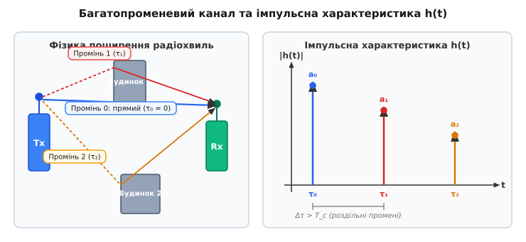

# 📜 Винахід RAKE-приймача: як Роберт Прайс та Пол Ґрін приборкали багатопроменеве згасання

Наприкінці 1950-х років створення RAKE-приймача дослідниками Робертом Прайсом (Robert Price) та Полом Ґріном (Paul E. Green Jr.) з Лабораторії Лінкольна Массачусетського технологічного інституту (MIT Lincoln Laboratory) стало відповіддю на критичну практичну проблему військово-стратегічного зв'язку Сполучених Штатів. У розпал Холодної війни стратегічно важливі лінії короткохвильового радіозв'язку (HF, 3–30 МГц) між континентальною частиною США та арктичними базами спостереження й раннього попередження в Ґренландії та Алясці регулярно виходили з ладу. Причиною цих аварійних відмов були не технічні поломки чи дії супротивника, а сама фізична природа іоносферного поширення радіохвиль.

Короткохвильовий сигнал прямував до приймача не єдиним шляхом, а неодноразово відбивався від різних шарів іоносфери (шарів E, F1, F2), а також від поверхні землі. У результаті антенний вхід приймача отримував кілька копій того самого сигналу, що приходили з різними часовими затримками (від 1 до 5 мілісекунд) та випадковими фазовими зсувами. У тогочасних вузькосмугових системах це призводило до катастрофічного явища — **глибокого інтерференційного згасання (multipath fading)**, коли промені у протифазі взаємно знищували один одного і сигнал зникав у шумах на секунди чи хвилини. Саме для вирішення цієї проблеми Прайс і Ґрін запропонували революційний RAKE-приймач, який замість боротьби з багатопроменевістю почав збирати й додавати енергію всіх рознесених у часі променів.

Традиційний підхід полягав у намаганні уникнути цього згасання за допомогою антенового рознесення (просторового різноманіття) або частотного маневру — будували величезні поля антен або виділяли додаткові частотні канали. Проте це вимагало колосальних витрат заліза й радіочастотного ресурсу.

*Багатопроменеве поширення: прямий промінь та відбиття створюють серію імпульсів з різними затримками та амплітудами.*

### Ідея лабораторії Лінкольна та проект «Decisive»

У 1955–1956 роках двоє молодих дослідників із Лабораторії Лінкольна Массачусетського технологічного інституту (MIT Lincoln Laboratory) — **Роберт Прайс (Robert Price)** та **Пол Ґрін (Paul E. Green Jr.)** — запропонували принципово інший погляд на проблему. Вони працювали над секретним проектом ВПС США під кодовою назвою «Decisive» (контракт AF 19(604)-1049), метою якого була розробка надзахищеного трансконтинентального зв'язку, стійкого як до навмисних радіозавад, так і до іоносферних аномалій.

Прайс і Ґрін поставили фундаментальне запитання: якщо фізичне середовище неминуче розщеплює сигнал на кілька променів, чому вважати ці відбиті промені «завадою»? Адже кожен відбитий промінь несе в собі корисну енергію передавача!

Щоб перетворити багатопроменевість із ворога на союзника, Прайс і Ґрін об'єднали дві революційні технології:
1. **Широкосмугове розширення спектра псевдовипадковою послідовністю (DSSS):** Замість вузькосмугового сигналу вони застосували сигнал із високою швидкістю елементів коду (чипів). Завдяки високій частоті чипів `f_c`, часова роздільність сигналу `T_c = 1 / f_c` стала меншою за різницю затримок між променями `Δτ`. Це дозволило часово розділити промені на виході корелятора.
2. **Паралельна багатоканальна обробка з затримками:** Вони побудували приймач, що містив лінію затримки з відводами та набір паралельних кореляторів, кожен з яких налаштовувався на часову затримку конкретного променя.

Приймач не просто виділяв окремі промені, а **вирівнював їх за фазою та додавав їхню енергію**, відновлюючи сумарний сигнал із максимально можливим співвідношенням сигнал/шум.

### Експериментальна установка та походження назви «RAKE»

Назву пристрою дав Пол Ґрін під час одного з обговорень у лабораторії в Лексінгтоні. Схема приймача з його послідовними відводами лінії затримки, від яких відходили паралельні обробні канали («пальці»), візуально нагадувала садові граблі (*rake* англійською). Метафора виявилася надзвичайно влучною: подібно до того, як граблі згрібають опале листя з галявини у єдину купу, RAKE-приймач «згрібає» розпорошену часом енергію окремих променів у єдиний потужний сигнал.

У 1956–1957 роках Прайс і Ґрін побудували експериментальну систему RAKE для КХ-лінку між радіостанцією лабораторії Лінкольна в Лексінгтоні (штат Массачусетс) та випробувальною станцією в Девіс-Моунтан (штат Техас) на відстані понад 3000 кілометрів. 

Приймач RAKE займав кілька величезних стійок з електронними лампами, аналоговими делай-лініями на основі коаксіальних кабелів та багатокаскадними множниками. Проте результати випробувань виявилися карколомними: RAKE-приймач забезпечував чіткий і безперебійний прийом даних у ситуаціях, коли класичні приймачі високого класу повністю втрачали сигнал через глибокі іоносферні завмирання.

У березні 1958 року вони опублікували фундаментальну працю у журналі *Proceedings of the IRE*: **«A Communication Technique for Multipath Channels»**. Ця стаття стала неофіційною «біблією» для кількох поколінь інженерів цифрового зв'язку та заклала основи теорії часового рознесення сигналів.

### Від військових шаф до мільярдів кишенькових смартфонів

Протягом кількох десятиліть після винаходу RAKE-приймачі залишалися дуже дорогими й громіздкими у реалізації. В епоху лампової та ранньої транзисторної техніки побудова кількох точних кореляторів із фазовою синхронізацією вимагала шаф, набитих складною радіоелектронікою. Тому RAKE застосовувався виключно у спеціальних військових системах зв'язку (наприклад, у захищеній мережі командування ВПС США, супутникових лінках DSCS III та вимірювальних комплексах NASA для зв'язку з далеким космосом).

Справжня цивільна революція відбулася наприкінці 1980-х років із розвитком надвеликих інтегральних схем (СБІС / VLSI) та цифрової обробки сигналів (DSP). Засновники компанії Qualcomm — **Ірвін Джейкобс (Irwin Jacobs)** та **Ендрю Вітербі (Andrew Viterbi)** — усвідомили, що RAKE-приймач є ідеальним серцем для цивільних стільникових мереж прямого розширення спектра (CDMA).

На той час більшість телекомунікаційного світу вважала ідею CDMA для мобільного зв'язку божевільною, стверджуючи, що багатопроменеве згасання в міських «каньйонах» з хмарочосів повністю знищить систему. Проте у листопаді 1989 року Qualcomm провела знамениту демонстрацію в Сан-Дієго (Каліфорнія). Інженери Qualcomm помістили RAKE-приймачі у цифровий мікрочіп розміром з ніготь. У міських умовах, де радіохвилі постійно відбивалися від будинків та машин, RAKE-приймач перетворив міське багатопроменеве середовище з проблеми на джерело додаткового підсилення сигналу (*diversity gain*).

Коли у 1990-х роках було прийнято стандарти IS-95 (cdmaOne), а згодом у 2000-х — стандарти 3G (WCDMA, UMTS, CDMA2000), RAKE-приймач увійшов до складу мікросхем (чипсетів Qualcomm MSM3000, MSM5000) кожного мобільного телефону на планеті.

Лише з приходом 4G LTE та 5G NR, де широкосмугові сигнали перейшли на мультиплексування з ортогональним частотним поділом (OFDM) та циклічним префіксом, RAKE поступився місцем частотному вирівнюванню та MIMO. Проте принцип RAKE — розділення та когерентне об'єднання рознесених у часі сигналів — залишається одним із найелегантніших досягнень радіотехніки XX століття.
