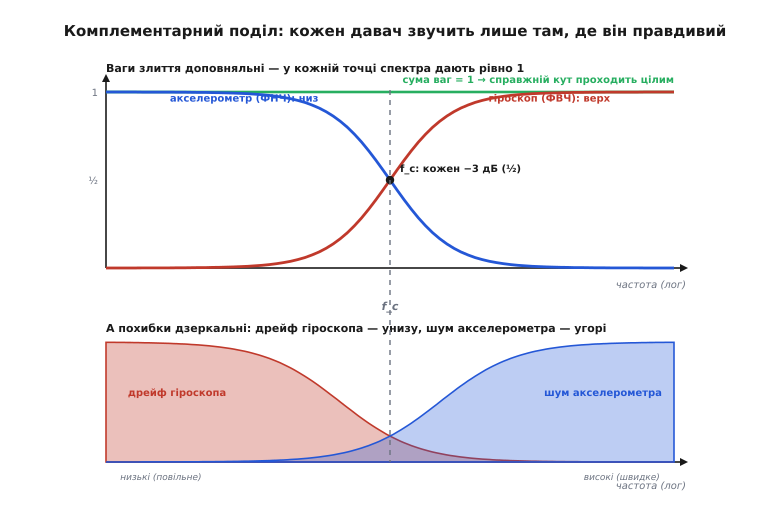
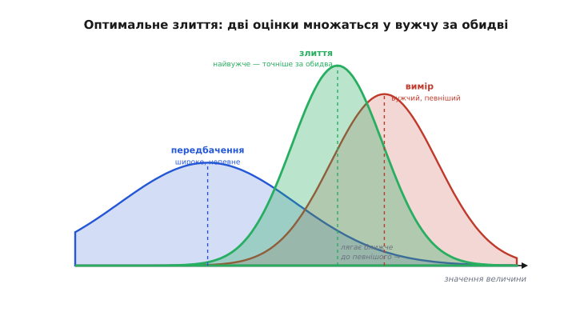
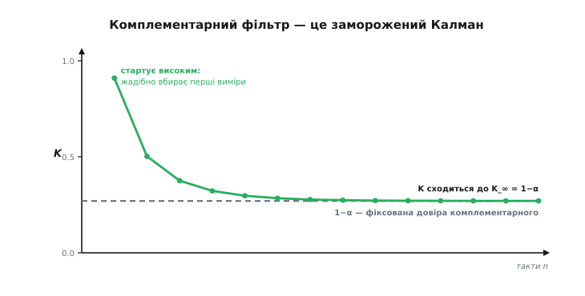
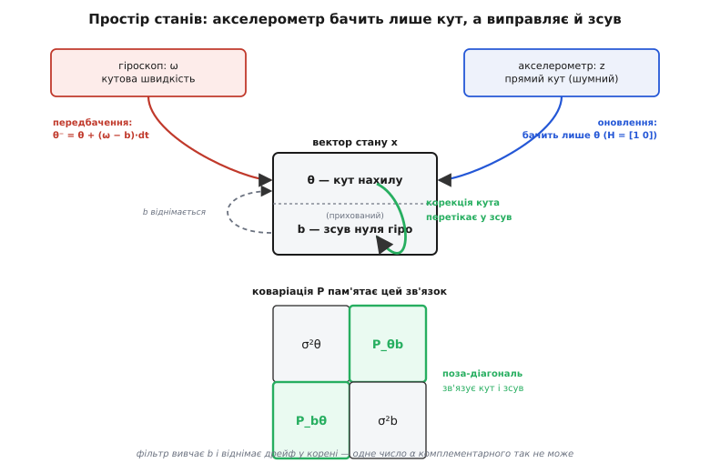

# Сенсорне злиття (fusion): комплементарний фільтр і Калман

<preknowlist>
- [Гіроскоп](topic:electronics/gyroscope) — міряє кутову швидкість; щоб дістати кут, її інтегрують.
- [Акселерометр](topic:electronics/accelerometer) — у спокої міряє напрямок тяжіння, тобто дає абсолютний кут нахилу, але шумить.
- [Середнє й дисперсія](topic:math/mean-variance) — дисперсія як міра розкиду (невпевненості) шумної величини.
- [Інтеграл](topic:math/integral) — підсумовування швидкості в накопичену величину (і накопичення похибки разом із нею).
- [RC-ФНЧ](topic:electronics/rc-low-pass) — фільтр нижніх частот пропускає повільне й ріже швидке; дзеркально ФВЧ — навпаки.
</preknowlist>

Ви хочете знати величину, що змінюється, — кут нахилу плати, висоту ракети, положення авто. І маєте для неї не один давач, а кілька, кожен зі своєю бідою: він правдивий лише в **частині** діапазону, а в решті бреше. [Гіроскоп](topic:electronics/gyroscope) віддає кутову швидкість миттєво й гладко, тож проінтегрований дає чудовий кут **на коротких часах** — але той інтеграл невпинно **спливає**, бо разом зі швидкістю підсумовується крихітний сталий [зсув нуля](topic:electronics/imu-noise-bias-drift). [Акселерометр](topic:electronics/accelerometer) у спокої дивиться на тяжіння й дає **абсолютний** кут, що не дрейфує ніколи, — але його показ тремтить від шуму й від кожного поштовху мотора.

Узяти лише один давач — програти напевно: голий гіроскоп за пів хвилини завалить оцінку, голий акселерометр не дасть їй устояти. А просто **усереднити** їх — ще гірше: тоді дістанете половину дрейфу плюс половину шуму, тобто обидві вади заразом. Вихід не в кращому давачі й не в наївному середньому, а в **розумному поєднанні сигналів** — операції, що бере від кожного джерела рівно ту смугу, де воно каже правду. Цю операцію звуть **сенсорним злиттям** (англ. *sensor fusion*, від лат. *fusio* — «сплавлення»; кілька недосконалих сигналів однієї величини сплавляють в одну оцінку, точнішу за кожен). Дві її класичні форми — **комплементарний фільтр** і **фільтр Калмана** — попри всю різницю у вазі, кажуть одне: зваж кожне шумне джерело за тим, наскільки йому віриш, і зроби це як **фільтр над потоком сигналу**. Уся стаття — про те, як саме зважувати: спершу наперед заданою рукою межею, потім — мірою, яку фільтр обчислює сам.

### Дві дзеркальні вади живуть у різних смугах

Щоб поділити сигнали розумно, спершу гляньмо, **де в спектрі** живе похибка кожного. Гіроскоп дає швидкість, а нам потрібен кут, тож його доводиться [інтегрувати](topic:math/integral) — підсумовувати крок за кроком. Сталий зсув нуля при цьому теж підсумовується й наростає в **лінійний дрейф**: похибка, що з часом лише більшає, а міняється **повільно**. Мовою спектра повільна зміна — це **низькі** частоти. Отже, вся похибка проінтегрованого гіроскопа зосереджена **внизу** спектра, а на високих частотах — там, де швидкі, різкі рухи, — він якраз бездоганний.

Акселерометр — дзеркало. «Низ» він знає завжди правильно **в середньому**: тяжіння нікуди не дінеться, тож на довгих часах його кут без дрейфу. Псує його **шум** — електричний і механічний (вібрація), — а це швидкі, різкі скоки навколо істини. Швидка зміна — це **високі** частоти. Виходить, похибка акселерометра сидить **вгорі** спектра, а внизу — там, де повільна усереднена правда, — він надійний.

> 🔧 **Навіщо це.** Розкладати похибки давачів [за смугами](topic:electronics/imu-noise-bias-drift) варто не задля каталогу вад, а щоб побачити цю **дзеркальність**: гіроскоп поганий там, де акселерометр добрий, і навпаки. Уся можливість злиття стоїть на ній. Якби обидва хибували в одній смузі, жодне зважування не врятувало б — вади наклалися б і в сумі, і поодинці. Перш ніж зливати два будь-які давачі, спитайте себе: а їхні похибки справді в різних частинах спектра?

Ось чому наївне середнє програє: воно бере обидва сигнали **на всіх** частотах порівну, тож упускає і низькочастотний дрейф гіроскопа, і високочастотний шум акселерометра. Правильно — узяти від гіроскопа **лише верх** спектра (швидке, де він точний), від акселерометра **лише низ** (повільне, де він правдивий), і скласти. Розділити сигнали за частотою — і кожну ваду залишити тому фільтру, що її зрізає.

### Комплементарний фільтр: два фільтри, що доповнюють одне одного

Технічно поділ за частотою робить пара фільтрів: [фільтр верхніх частот](topic:electronics/rc-high-pass) (ФВЧ) на проінтегрований гіроскоп і [фільтр нижніх частот](topic:electronics/rc-low-pass) (ФНЧ) на акселерометр. І тут — уся суть назви (від лат. *complementum* — «доповнення»): два фільтри роблять **взаємодоповняльними** так, щоб їхні передавальні коефіцієнти в сумі давали **рівно одиницю на кожній частоті**. Мовою неперервних передавальних функцій, де перехід задає одна стала часу τ:

```
H_ФНЧ(s) = 1 / (1 + sτ)          ← акселерометр: пропускає низ
H_ФВЧ(s) = sτ / (1 + sτ)         ← гіроскоп: пропускає верх
                                     ──────────────
H_ФНЧ(s) + H_ФВЧ(s) = (1 + sτ) / (1 + sτ) = 1   ← на будь-якій частоті
```

Ця тотожність — серце методу. Вона гарантує, що **справжній** кут (той спільний сигнал, який обидва давачі намагаються виміряти) проходить крізь злиття **незмінним** — не послабленим, не зсунутим по фазі. Ділять фільтри між собою лише **похибки**: повільний дрейф гіроскопа зрізає ФВЧ, швидкий шум акселерометра зрізає ФНЧ. Кожна вада потрапляє рівно під той фільтр, що її прибирає, а корисний сигнал лишається цілим. Точка перетину двох кривих — **частота переходу** f_c = 1/(2πτ): вище неї в оцінці панує гіроскоп, нижче — акселерометр.


*Знизу — де в спектрі живе похибка кожного давача: дрейф гіроскопа на низьких частотах, шум акселерометра на високих. Згори — передавальні функції злиття: ФНЧ (акселерометр) спадає з частотою, ФВЧ (гіроскоп) зростає, на частоті переходу f_c кожен послаблений до −3 дБ. У сумі вони дають рівно одиницю (зелена пряма) на всіх частотах, тож справжній кут проходить без спотворення, а кожен давач «звучить» лише там, де він добрий.*

Уся ця частотна краса згортається в **один рядок** на кожен крок. Дискретна форма фільтра — це проста рекурсія (від лат. *recursio* — «повернення»: оцінка на кожному кроці спирається на себе ж попередню):

```
θ[n] = α·(θ[n−1] + ω[n]·dt) + (1 − α)·θ_акс[n]
       └── швидка гілка: гіро ──┘   └─ повільна: акс ─┘
```

Член `α·(θ[n−1] + ω·dt)` бере попередню оцінку, **докручену гіроскопом** на цей крок, — миттєва реакція (верх спектра). Член `(1 − α)·θ_акс` легенько **підтягує** оцінку до акселерометра — повільна корекція, що не дає гіроскопу втекти в дрейф (низ спектра). Одне число α (близьке до 1) керує поділом, і за ним ховається та сама стала часу — через період кроку dt їх пов'язує **τ = α·dt/(1 − α)**. По суті гілка акселерометра — це [експоненційне згладжування](topic:math/exponential-smoothing) його показу, тобто найпростіший [БІХ-фільтр](topic:algorithms/iir-filter) першого порядку; гілка гіроскопа — доповнення цього згладжування до одиниці.

**Один крок фільтра.** Плата працює на 100 Гц, тож крок `dt = 0.01` с; довіра `α = 0.98`. Маємо попередню оцінку `θ = 10.00°`, гіроскоп показує `ω = 50°/с`, акселерометр дає кут `θ_акс = 12.00°`. Знайти нову оцінку й сталу часу.

```
стала часу переходу:
  τ = α·dt/(1−α) = 0.98·0.01/0.02 = 0.49 с   →   f_c = 1/(2π·0.49) ≈ 0.32 Гц

швидка гілка (гіроскоп веде кут):
  θ⁻ = θ + ω·dt = 10.00 + 50·0.01 = 10.50°

злиття (98% гіро + 2% акселя):
  θ = 0.98·10.50 + 0.02·12.00 = 10.29 + 0.24 = 10.53°
```

Оцінка пішла майже за гіроскопом (гладко, до 10.5°) і лише на крихту підтяглася до акселерометра. У тих 2% і вся хитрість: за один крок вони замалі, щоб упустити шум акселерометра, але за багато кроків **не дають** дрейфу гіроскопа накопичитись — щокроку тягнуть оцінку до справжнього «низу». Рухи, швидші за f_c ≈ 0.32 Гц, беруться з гіроскопа, повільніші — з акселерометра. Робочий модуль на C з розбиттям на осі й покроковим прогоном лежить у [комплементарного фільтра](topic:algorithms/complementary-filter) — атома, що дивиться на цей метод з боку робототехніки.

### Межа фіксованої довіри

У цьому й краса, і межа комплементарного фільтра: коефіцієнт α **заданий наперед і сталий**. Він не знає, що діється з давачами **зараз**. А обстановка міняється. На старті, коли про кут ще нічого не відомо, варто жадібно вбирати акселерометр — а фіксований α цього не вміє. Під час тривалого розгону чи затяжного віражу акселерометр міряє вже не чисте тяжіння, а його **суму** з власним прискоренням апарата ([специфічну силу](topic:physics/proper-acceleration)), тож «низ» для нього відхиляється, і опорний кут бреше — тут довіру до акселерометра треба **знизити**, а фіксований α тримає її сталою й повільно тягне оцінку за хибою.

На практиці з цим борються милицями: стежать за довжиною виміряного вектора й, коли |a| помітно відходить від g, **вручну** на час маневру піднімають α, а потім вертають. Милиця працює, але вона позасистемна — окрема евристика збоку. Напрошується питання: а чи не можна зробити **саму довіру** величиною, яку фільтр веде й перераховує сам, строго, на кожному кроці? Можна — і для цього треба спершу зрозуміти, а яка ж довіра **найкраща**.

### Оптимальне зважування: обернена дисперсія

Відступімо від давачів до чистої задачі. Маємо дві незалежні оцінки однієї величини: перша каже x₁, друга — x₂, і кожна неточна. Але «неточна» — не просто число: у кожної є **міра розкиду**, [дисперсія](topic:math/mean-variance) σ² (лат. *dispersio* — «розсіяння»), — наскільки широко «розмазане» те, що джерело стверджує. Мала дисперсія — гострий, вузький дзвін довкола значення («майже напевно отут»); велика — широкий, розпливчастий («десь у цих межах»). Питання: як скласти x₁ і x₂ в одну оцінку з найменшою можливою похибкою?

Відповідь напрочуд проста й глибока: бери кожне джерело з **вагою, оберненою до його дисперсії**. Що вужчий дзвін (певніше джерело) — то більша вага:

```
x̂ = (x₁/σ₁² + x₂/σ₂²) / (1/σ₁² + 1/σ₂²)
1/σ̂² = 1/σ₁² + 1/σ₂²        ← точності (обернені дисперсії) додаються
```

Два висновки, обидва важать. Перший: підсумкова оцінка лягає **ближче до певнішого** джерела — саме туди, куди підказує здоровий глузд. Другий, менш очевидний і найцінніший: її дисперсія σ̂² виходить **меншою за обидві** вхідні. Два незалежні погляди разом обмежують істину тісніше, ніж кожен окремо, — тож спільна оцінка **точніша за будь-яке з джерел**. Це не евристика, а [зважене середнє](topic:math/weighted-average), яке доказово мінімізує середньоквадратичну похибку: точнішої лінійної оцінки з цих двох чисел дістати взагалі неможливо. Чому вага — саме обернена дисперсія, а точності саме додаються, видно з [виведення через добуток двох гаусіан](topic:communications/sensor-fusion/math-gaussian-fusion.md): перемножені щільності [нормального розподілу](topic:math/normal-distribution) дають знову нормальний, і його центр із шириною виходять рівно за цими формулами — по суті це один крок [байєсівського оцінювання](topic:math/bayesian-estimation), де другий вимір уточнює перший.


*Оптимальне злиття двох оцінок. Синій дзвін — перше джерело (широке, непевне), червоний — друге (вужче, певніше). Їхнє злиття (зелений) вужче за **обидва** — тобто точніше за кожне окремо — і сидить **ближче до певнішого** джерела, на відстані, оберненій до дисперсій. Уся арифметика фільтра Калмана — це повторення цього одного кроку.*

### Фільтр Калмана: рекурсивне зважування за певністю

Тепер вернімося до давачів — але вже з правильним інструментом. Про кут ми теж маємо **два** джерела. Перше — **передбачення**: знаємо, де кут був, і знаємо швидкість із гіроскопа, тож можемо сказати, де він тепер. Друге — **вимір**: акселерометр прямо дає кут. Обидва неточні, обидва мають свою дисперсію — і злити їх треба саме оберненим до дисперсій зважуванням. **Фільтр Калмана** робить це **рекурсивно**, тактами, ведучи разом зі значенням і його дисперсію як живу величину. Цикл — два кроки, що повторюються щомиті.

**Крок передбачення** (predict): штовхаємо оцінку моделлю вперед — і **розширюємо** невпевненість.

```
θ⁻ = θ + ω·dt          ← гіроскоп посуває кут
P⁻ = P + Q             ← дисперсія росте на шум моделі Q
```

Тут ключове — друге рівняння. Що довше ми лише передбачаємо, не звіряючись із давачем, то менше певні: модель недосконала, дрейф росте, дзвін **ширшає**. Число Q каже, наскільки брехлива модель за такт.

**Крок оновлення** (update): надходить вимір z (кут з акселерометра з дисперсією R) — і ми зливаємо його з передбаченням тим самим оберненим до дисперсій правилом, тільки записаним через **коефіцієнт Калмана** K.

```
K = P⁻ / (P⁻ + R)              ← частка довіри до виміру, 0..1
θ = θ⁻ + K·(z − θ⁻)            ← підтягуємо оцінку до виміру на частку K
P = (1 − K)·P⁻                 ← вимір додав інформації — дисперсія падає
```

Придивіться до K: це і є [обернене до дисперсій зважування](topic:communications/sensor-fusion/math-gaussian-fusion.md), переписане в один символ. Розкрийте `θ = θ⁻ + K(z−θ⁻)` — дістанете `θ = (R·θ⁻ + P⁻·z)/(P⁻+R)`, тобто рівно зважене середнє передбачення й виміру з вагами, оберненими до їхніх дисперсій. Коли вимір певний (R мале) — K→1, фільтр майже стрибає на вимір; коли вимір шумний (R велике) або передбачення ще надійне (P⁻ мале) — K→0, фільтр тримається передбачення. Але головне ось у чому: **P⁻ фільтр рахує сам**, нарощуючи на передбаченні й стягуючи на оновленні, тож K щокроку відповідає **поточній** обстановці, а не усередненому припущенню. Оце самостійне ведення невпевненості й відрізняє Калмана від усього простішого.

**Один такт одновимірного фільтра.** Минулого такту оцінка кута була `θ = 16.00°` з `σ = 3°`, тобто `P = 9` (град²). Гіроскоп показує `ω = 6°/с`, такт `dt = 0.1` с. Шум моделі за такт `Q = 4`, шум акселерометра `R = 9` (тобто σ_вим = 3°). Надходить вимір `z = 22°`.

```
── передбачення: штовхаємо оцінку, ДИСПЕРСІЯ РОСТЕ ──
  θ⁻ = 16 + 6·0.1     = 16.60°
  P⁻ = 9 + 4          = 13        (σ⁻: 3° → 3.6°, дзвін поширшав)

── оновлення: рахуємо K, ДИСПЕРСІЯ ПАДАЄ ──
  K  = 13 / (13 + 9)  = 0.591
  θ  = 16.60 + 0.591·(22 − 16.60) = 16.60 + 3.19 = 19.79°
  P  = (1 − 0.591)·13 = 5.32       (σ: 3.6° → 2.3°, вужче за стартові 3°!)
```

За один такт фільтр спершу посунув кут гіроскопом і **втратив** певність, а тоді вимір її **повернув із запасом**: підсумкове σ = 2.3° менше навіть за стартове. Коефіцієнт K = 0.591 обчислено з самих лише дисперсій, без жодного ручного підбору. Оце «дихання» невпевненості — розширення на передбаченні, стягування на оновленні — і є весь фільтр. Той самий цикл, лише якісно, на дзвоноподібних кривих, розбирає атом [фільтра Калмана](topic:algorithms/kalman-filter) з боку робототехніки; тут же нас цікавить його **сигнальна** природа.

### Комплементарний фільтр — це заморожений Калман

А тепер найкрасивіший для обробки сигналів висновок, що зшиває докупи обидві половини статті. Придивімось, що станеться з коефіцієнтом K, якщо давачі працюють у **сталому** режимі — Q і R не міняються. На кожному такті P росте на передбаченні (+Q) і падає на оновленні (·(1−K)). Ці дві дії тягнуть P у різні боки, і рано чи пізно вони **врівноважуються**: P приходить до сталого значення P_∞, а з ним застигає й K. Знайти цю рівновагу — значить розв'язати рівняння «дисперсія після повного такту дорівнює самій собі»:

```
P⁻ після такту = R·P⁻/(P⁻+R) + Q          ← стягнули оновленням, наростили передбаченням
розкриємо:  P⁻² − Q·P⁻ − Q·R = 0
корінь:     P⁻ = [Q + √(Q² + 4QR)] / 2      ← стала дисперсія передбачення
```

Це квадратне рівняння рівноваги (окремий випадок так званого рівняння Ріккаті) — і його розв'язок дає **сталий** коефіцієнт K_∞. Підставмо реалістичні для гіро+акселя на 100 Гц числа: за такт дрейф гіроскопа крихітний, `Q = 0.001` (град²), шум акселерометра `R = 9` (град², σ = 3°).

```
P⁻ = [0.001 + √(0.001² + 4·0.001·9)] / 2 = [0.001 + √0.036001] / 2 = 0.0954
K_∞ = P⁻ / (P⁻ + R) = 0.0954 / 9.0954 = 0.0105
```

А тепер порівняймо форму фільтра в цій рівновазі з комплементарним. Підставмо стале K_∞ в рівняння оновлення й підставмо передбачення:

```
θ = θ⁻ + K_∞·(z − θ⁻) = (1 − K_∞)·(θ + ω·dt) + K_∞·z
```

Це **буква в букву** комплементарний фільтр — з α = 1 − K_∞. А K_∞ = 0.0105 дає **α = 0.9895 ≈ 0.99** — рівно ті «магічні» 0.98–0.99, які практики десятиліттями підбирали руками для дронів. Виходить, комплементарний фільтр — це фільтр Калмана з коефіцієнтом, **замороженим на сталому режимі**: там, де Калман щотакту перераховує K, комплементарний бере його усталене значення раз і назавжди. Ручний підбір α — це, по суті, ручний розв'язок рівняння рівноваги на око. Тому й правило вибору α через τ працює: за ним стоїть реальна арифметика дисперсій. І тому ж комплементарний фільтр програє там, де режим **не** сталий: заморожене K не встигає за зміною шумів, тоді як живе K Калмана відстежує її строго. Перевірити цю тотожність числом — прогнати той самий шумний сигнал крізь обидва фільтри й побачити, як K сходиться до 1−α, — можна [зіставленням у коді](topic:communications/sensor-fusion/proj-fusion-compare-c.md).


*Чому комплементарний фільтр — заморожений Калман. Коефіцієнт K (зелений) стартує високим — фільтр невпевнений і жадібно вбирає перші виміри — і сам **сходиться** до сталого K_∞. Комплементарний фільтр бере фіксоване 1−α (сіра пряма) від самого початку, ще не знаючи обстановки. У сталому режимі обидва збігаються: α = 1 − K_∞. Різниця лише в перехідних процесах і в тому, що Калман відстежує зміну шумів, а α — ні.*

### Повний фільтр у просторі станів: оцінити й відняти дрейф

Досі стан фільтра був **одним** числом — кутом. Але справжня сила Калмана розкривається, коли стан стає **вектором**: тоді фільтр оцінює не лише те, що міряють, а й **приховані** величини, яких не міряє жоден давач прямо. Для нашої задачі приховане — це сам **зсув нуля гіроскопа** b, першопричина дрейфу. Візьмімо стан із двох компонент — кут і зсув:

```
x = [ θ ]      θ — кут нахилу
    [ b ]      b — зсув нуля гіроскопа (невідомий, повільно пливе)
```

Модель руху проста й чесна: справжня кутова швидкість — це **виміряна** мінус зсув, а зсув сам по собі майже сталий. У матричному записі один такт передбачення — це множення стану на матрицю переходу F і додавання входу ω:

```
θ⁻ = θ + (ω − b)·dt          F = [ 1  −dt ]      вимір бачить лише кут:
b⁻ = b                           [ 0   1  ]      z = θ,  H = [ 1  0 ]
```

Рівняння Калмана ті самі, лише числа стали матрицями (тут потрібні [матриці як дії](topic:math/matrices-as-operations) й [матриця коваріації](topic:math/covariance-matrix-intuition) P, що тепер тримає не одну дисперсію, а взаємозв'язки компонент стану):

```
передбачення:  x⁻ = F·x + [dt·ω; 0]        P⁻ = F·P·Fᵀ + Q
оновлення:     K = P⁻·Hᵀ·(H·P⁻·Hᵀ + R)⁻¹   x = x⁻ + K·(z − H·x⁻)   P = (I − K·H)·P⁻
```

І ось де магія. Акселерометр міряє **лише кут**, зсуву b він не бачить зовсім. Але в матриці коваріації P off-діагональний елемент **пов'язує** кут і зсув: коли дрейф тягне кут, кут і зсув «пливуть» разом, і фільтр це запам'ятовує в P. Тож корекція від акселерометра, підправляючи кут, **через цей зв'язок підправляє й оцінку зсуву** — фільтр поступово **вивчає** b і віднімає його ще на кроці передбачення. Дрейф гаситься **в корені**, а не замазується постфактум. Саме цього комплементарний фільтр з його одним числом α не вміє **в принципі**: він не має де тримати оцінку зсуву. Оце — головна причина брати повний Калман, коли дрейф серйозний: не просто адаптивна вага, а оцінювання самих **прихованих причин** похибки.


*Фільтр у просторі станів оцінює приховане. Стан — не лише кут θ, а й зсув нуля гіроскопа b. Передбачення бере справжню швидкість як (ω − b); вимір (акселерометр) бачить лише θ. Але коваріація P пов'язує θ і b, тож корекція кута **перетікає** й на оцінку зсуву — фільтр вивчає b і віднімає дрейф у корені. Одне число α комплементарного фільтра такого приховати не може.*

> 🔧 **Навіщо це.** Розширення стану — універсальний прийом далеко за межами кута. Хочете, щоб фільтр сам відстежував зсув давача, масштабний коефіцієнт, невідоме прискорення чи знесення вітром — **додайте їх у вектор стану**, опишіть, як вони входять у модель, і Калман оцінюватиме їх заодно, без жодного окремого давача. Правило: усе, що повільно й передбачувано впливає на вимір, вигідніше **оцінити** як частину стану, ніж калібрувати вручну. Ціна — більші матриці, але вона того майже завжди варта.

### Нелінійна дійсність і звідки все взялося

Одне чесне застереження. Усе вище — про **лінійну** модель: стан входить у передбачення й вимір лінійно, множенням на матриці. Реальна орієнтація такою не буває — повороти не додаються як числа, а `atan2` акселерометра нелінійний. Тоді беруть **розширений фільтр Калмана** ([EKF](topic:algorithms/kalman-ekf), *Extended Kalman Filter*): нелінійну модель на кожному кроці **лінеаризують** навколо поточної оцінки — заміняють дотичною — і далі женуть звичайні рівняння Калмана. Коли й лінеаризація груба, є [несцентований фільтр](topic:algorithms/unscented-kalman-filter) (UKF), що передає невпевненість крізь нелінійність не дотичною, а хмаркою пробних точок. Саме EKF крутиться у більшості польотних контролерів, видаючи надійний [кватерніон орієнтації](topic:math/quaternions), яким апарат знає, як він повернутий, — а на людський погляд той самий стан показують [кутами Ейлера](topic:math/euler-angles).

Варто знати й **звідки** ця математика. Задачу «видобути правду з шумного сигналу й передбачити його хід» ще у 1940-х розв'язав **фільтр Вінера** — оптимальний лінійний фільтр Норберта Вінера, незалежно й та сама теорія — Андрія Колмогорова в СРСР. Але фільтр Вінера мислив у частотній області, вимагав **сталої** статистики й фактично **всієї історії** сигналу — для машини, що рахує на льоту з крихітною пам'яттю, заважко. Рудольф Калман близько 1960 року дав тій самій задачі **рекурсивну** форму в просторі станів: тримати лише поточну оцінку та її дисперсію, оновлювати однаковими дешевими тактами. Це й зробило фільтр придатним для борту — за кілька років він уже вів кораблі «Аполлона» до Місяця. Історія ця не про одинака: близькі ідеї незалежно мали Пітер Сверлінг у США (1958) і глибше, у загальнішій нелінійній формі, Руслан Стратонович у СРСР — докладно про цю естафету відкриттів і шлях до «Аполлона» розказано [окремо](topic:algorithms/kalman-filter/hist-kalman.md).

### Що і коли обирати

Обидва фільтри кажуть одне: зваж передбачення й вимір за їхньою певністю. Різниця — **звідки** береться вага. Комплементарний фільтр бере її **фіксованою**, одним числом α, яке ви задаєте (а фактично — заморожуєте сталий коефіцієнт Калмана). Це копійчано — множення й додавання на такт, крутиться на 8-бітному мікроконтролері, — і **достатньо добре** там, де шуми сталі й передбачувані: аматорський дрон, самобалансний робот, нахиломір. Фільтр Калмана рахує вагу **сам, щотакту**, з поточних дисперсій, ще й веде оцінку прихованих величин (зсув гіроскопа) і власної невпевненості. За це платять моделлю, числами шуму Q і R та важчими обчисленнями.

> 🔧 **Навіщо це.** Правило вибору просте. Потрібна дешева гладка орієнтація, шуми стабільні, а оцінка невпевненості не потрібна — беріть **комплементарний фільтр** і не ускладнюйте. Потрібно зливати багато давачів, оцінювати приховані стани (зсув, знесення), працювати зі змінними шумами або **знати, наскільки оцінці можна вірити** (щоб перейти в безпечний режим, коли давач збрехав) — беріть **Калман**. І пам'ятайте головне зі всього: обидва — не про магію, а про одну ідею оцінювання, що пронизує всю обробку сигналів. Правду здобувають не з одного ідеального виміру (його не буває), а **зважено сплавляючи** багато недосконалих — кожен голос за його надійністю.
