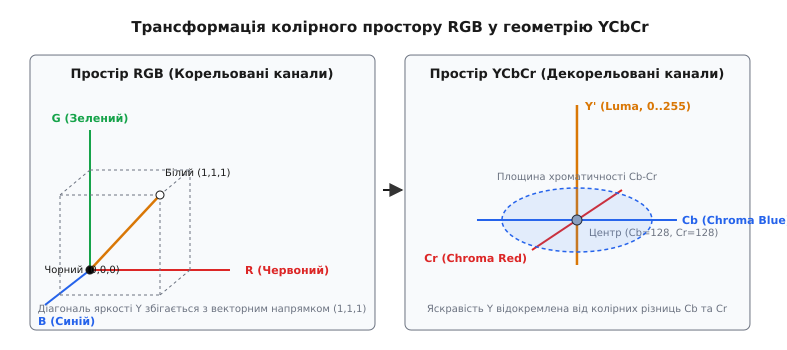
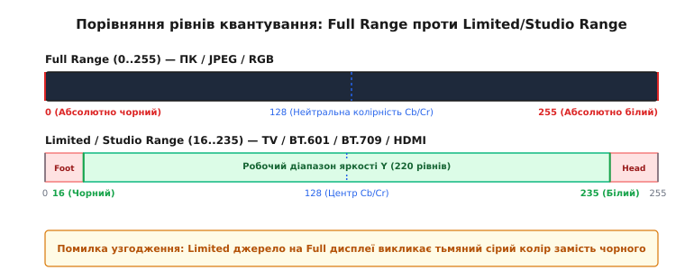
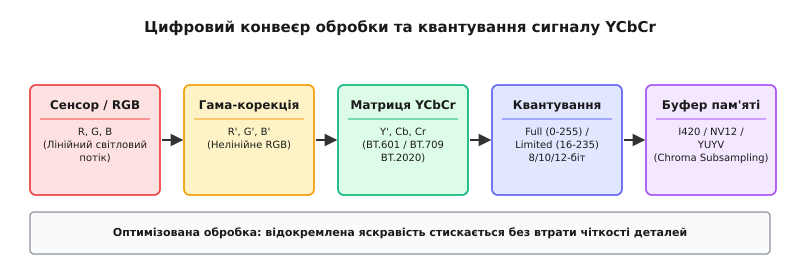

# Колірний простір YCbCr: розділення яркості та колірності у цифровому відео

<preknowlist>
- [Колірні простори у відео](book:communications/color-spaces-video) — лінійне та нелінійне кодування кольору, відмінність між моделями RGB та YUV/YCbCr.
- [Колірне субдискретування](book:communications/chroma-subsampling) — принципи зменшення просторової роздільності колірнорізничних компонентів (4:4:4, 4:2:2, 4:2:0).
- [Найквіст і аліасинг](book:communications/nyquist-aliasing) — дискретизація просторових частот та запобігання спектральному накладанню.
- [Дискретизація й квантування](book:electronics/sampling-quantization) — дискретизація за рівнем, динамічний діапазон та похибка квантування.
</preknowlist>

Передача нестисненого 4K-відеопотоку з частотою 60 кадрів за секунду у повномасштабному колірному форматі RGB24 вимагає пропускної здатності мережевого або інтерфейсного каналу понад 11.9 гігабіта за секунду. Кожен кадр містить 8.3 мільйона пікселів, і для кожного з них зберігаються три незалежні 8-бітні відліки червоного (`R`), зеленого (`G`) та синього (`B`) кольорів. Проте детальний аналіз статистичної структури природних зображень показує, що понад 70% цього обсягу даних є абсолютно надлишковою інформацією. У реальному світі яскраві деталі об'єктів — рельєф, контури, тіні та текстури — виявляються однаково вираженими у всіх трьох канальних складових. Червоний, зелений та синій канали цифрового кадру виявляють високий рівень міжканальної взаємної кореляції: якщо світловий потік падає на поверхню, інтенсивність зростає одночасно у всіх трьох колірних спектрах.

Спроба стискати або передавати відео безпосередньо у просторі RGB вимагає одинакової витрати обчислювальних ресурсів і смуги частот на кожен із трьох колірних каналів. Технологічним розв'язанням цієї фундаментальної проблеми став **колірний простір YCbCr (*Luma and Chroma Blue/Red Color Space*)** — ортогональна колірнорізнична модель, яка за допомогою ортогонального лінійного матричного перетворення відокремлює високоенергетичний ахроматичний сигнал яркості `Y'` від двох низькоенергетичних колірнорізничних компонентів `Cb` та `Cr`.

### Фізико-зорове обґрунтування: чому RGB є неефективним контейнером

Колірна модель RGB виникла як пряма технічна репліка апаратного влаштування трикомпонентних відтворюючих пристроїв: люмінофорних точок електронно-променевих трубок (ЕПТ), рідкокристалічних матриць та світлодіодних панелей. Для фізичного формування світлового випромінювання на екрані потрібні саме три первинні монохроматичні джерела світла з різними довжинами хвиль. Проте як цифровий контейнер для збереження, кодування та трансляції зображень RGB виявляється крайньо марнотратним через дві причинні обставини: статистичну надлишковість сигналу та фізіологічні особливості сітківки людського ока.

З точки зору теорії інформації та математичної статистики, три компоненти `R`, `G` та `B` для типових фотографій чи відеокадрів мають коефіцієнт міжканальної кореляції, що нерідко перевищує `0.85–0.95`. Якщо зобразити довільне зображення у вигляді тривимірної хмари точок у просторі RGB, то ця хмарина не заповнює увесь об'єм куба `[0..255] × [0..255] × [0..255]`, а витягується у вузький еліпсоїд вздовж головної діагоналі яркості — лінії, що зєднує чорну точку `(0, 0, 0)` та білу точку `(255, 255, 255)`. Зберігати три окремі повнорозрядні координати для точок, які згруповані навколо однієї головної осі, означає тричі повторювати одну й ту саму інформацію про загальну інтенсивність світла.

Другим обґрунтуванням вибору колірної моделі є анатомія зорового аналізатора людини. Світлочутливий шар сітківки містить два фундаментально різних типи рецепторів:
1. **Палички (*rods*), близько 120 мільйонів:** мають високу світлочутливість, функціонують у сутінках та реагують виключно на загальну інтенсивність світлового потоку (яскравість). Вони густо вкривають практично всю площу сітківки.
2. **Колбочки (*cones*), близько 6–7 мільйонів:** відповідають за денний колірний зір і діляться на три вузькоспектральні типи (S, M, L), чутливі відповідно до синьої, зеленої та червоної ділянок спектра. Найважливішим є те, що колбочки концентруються у крихітній центральній ямці сітківки (*fovea centralis*), а на периферії їхня щільність стрімко падає.

Вимірювання контрастно-частотної характеристики зору (CSF, *Contrast Sensitivity Function*) свідчить: порогова просторова роздільність ока для дрібних перепадів яркості сягає 30–40 циклів на кутовий градус, тоді як для змінення колірного відтінку при сталій яскравість межа сприйняття падає нижче 6–8 циклів на кутовий градус. Це означає, що око розрізняє найдрібніші подряпини, волосини чи текст лише за рахунок контрасту світла й тіні. Якщо ж змінити колір дрібної деталі без зміни її яркості, зоровий кортекс просто не зафіксує цієї зміни.

Звідси випливає головна концепція колірних перетворень: **ортогональний поворот системи координат**. Математична матриця перетворює базові вектори `RGB` так, що одна представлена вісь збігається з головною діагоналлю яркості, а дві інші лягають у перпендикулярну площину колірності. Це повністю знімає міжканальну кореляцію та дозволяє стискати колірні компоненти без помітної втрати якості для спостерігача.

### Математична анатомія YCbCr: Luma проти Luminance, Cb та Cr

Математичний процес перетворення лінійного триколірного відеосигналу RGB на компактне колірнорізничне подання складається з трьох послідовних кроків: нелінійної гама-корекції з обчисленням зваженої яркості, нормалізації колірнорізничних компонентів та їхнього квантування зі зсувом у додатну цілочисельну область.

#### 1. Нелінійна гама-корекція та зважена яскравість

Першим кроком лінійні інтенсивності світла `R`, `G`, `B`, зняті матрицею камери, піддаються нелінійному гама-стисканню для компенсації логарифмічної чутливості ока. Отримані сигнали позначаються як `R'`, `G'`, `B'`:

```
R' = R^(1/γ)
G' = G^(1/γ)
B' = B^(1/γ)
```

Далі формується сигнал яркості як зважена сума трьох нелінійних компонентів:

```
Y' = Kr·R' + Kg·G' + Kb·B'
```

Коефіцієнти `Kr`, `Kg`, `Kb` підбираються так, щоб їхня сума дорівнювала одиниці (`Kr + Kg + Kb = 1`). Значення зеленого коефіцієнта `Kg` завжди є найбільшим (понад 58–71%), оскільки функція відносної спектральної світлової ефективності людського ока `V(λ)` має абсолютний пік у зелено-жовтій ділянці спектра (довжина хвилі 555 нм). Синій колір, навпаки, має найменший ваговий коефіцієнт (5.9–11.4%), бо колбочки S-типу найменше впливають на відчуття суб'єктивної яркості.

#### 2. Нормалізовані колірнорізничні сигнали

Після обчислення яркості `Y'` з компонентів синього `B'` та червоного `R'` віднімається `Y'`. Зелений компонент `G'` не потребує окремого колірнорізничного сигналу, оскільки його значення однозначно відновлюється з `Y'`, `R'` та `B'`:

```
B' - Y' = (1 - Kb)·B' - Kr·R' - Kg·G'
R' - Y' = (1 - Kr)·R' - Kg·G' - Kb·B'
```

Оскільки вихідні сигнали `R'`, `G'`, `B'` обмежені діапазоном `[0, 1]`, амплітуда різниць `B' - Y'` досягає екстремумів `[-(1 - Kb), +(1 - Kb)]`, а різниця `R' - Y'` — `[-(1 - Kr), +(1 - Kr)]`.

Щоб звести обидва колірнорізничні канали до єдиного симетричного нормалізованого діапазону `[-0.5, +0.5]`, застосовуються нормувальні дільники `2·(1 - Kb)` та `2·(1 - Kr)`:

```
Pb = (B' - Y') / (2·(1 - Kb))
Pr = (R' - Y') / (2·(1 - Kr))
```

Отже, безперервні нормалізовані сигнали `Y'`, `Pb`, `Pr` знаходяться у чітких математичних межах: `Y' ∈ [0, 1]`, a `Pb, Pr ∈ [-0.5, +0.5]`.

#### 3. Масштабування та цифровий зсув

Для дискретизації у 8-бітних цілочисельних буферах пам'яті (де значення мають бути додатними цілими числами в межах `0..255`) відліки колірності `Pb` та `Pr` масштабуються та зсуваються додаванням константи `128` (або `2^(n-1)` для n-бітного кодування).

[Математичне виведення матриць YCbCr та квантування](book:communications/ycbcr/math-ycbcr-conversion.md) детально розгортає процедуру обернення системи лінійних рівнянь, розрахунок зворотних коефіцієнтів та покрокові обчислення для довільних бітових глибин.


*Схема трансформації прямокутного куба RGB у похилий просторовий паралелепіпед YCbCr. Вісь яркості Y' збігається з головною векторною діагоналлю від чорного до білого кольору, а компоненти Cb та Cr формують ортогональну площину колірності з центром у точці нейтрального сірого кольору (128, 128).*

#### Підсумкове термінологічне розмежування: YUV проти YCbCr

Коли виведено весь математичний конвеєр, сформовані величини отримують свої стандартизовані назви та ярлики:
- **`Y'` (Luma) проти `Y` (Luminance):** важливо розрізняти фізичну яскравість **`Y` (*Luminance*)**, яка обчислюється з лінійних сигналів `RGB`, та відеосигнал яркості **`Y'` (*Luma*)**, сформований з нелінійних гама-корегованих сигналів `R'G'B'`. Усі цифрові відеостандарти працюють саме з нелінійним `Y'`.
- **`Pb`/`Pr` проти `Cb`/`Cr`:** позначення `Pb` та `Pr` відповідають безперервним нормалізованим колірнорізничним сигналам у діапазоні `[-0.5, +0.5]`, тоді як акроніми **`Cb` (*Chroma Blue*)** та **`Cr` (*Chroma Red*)** позначають саме підсумкові квантовані цілочисельні компоненти після масштабування та зсуву.
- **YUV проти YCbCr:** у повсякденній технічній літературі поняття YUV та YCbCr часто вживаються як синоніми, проте у строгій відеоінженерії між ними існує чітке розмежування. **YUV** — це аналогова колірнорізнична модель, яка використовувалася у приймально-передавальних ланцюгах аналогових телевізійних систем NTSC, PAL та SECAM для формування електричних напруг модулюючих сигналів. **YCbCr** — це цифрове масштабне кодування, стандартизоване для дискретних відліків у бінарних буферах пам'яті, файлах та цифрових інтерфейсах (SDI, HDMI, DisplayPort).

### Еволюція та стандартизація матриць: BT.601, BT.709 та BT.2020

Протягом історії цифрового відео вагові коефіцієнти яркості `Kr`, `Kg`, `Kb` неодноразово переглядалися міжнародними інститутами стандартизації (ITU-R, SMPTE). Це було викликано не зміною зору людини, а еволюцією технології виготовлення дисплеїв: зміною фізичних характеристик люмінофорів ЕПТ-кінескопів, світлофільтрів рідкокристалічних панелей та базових лазерних джерел світла.

| Стандарт | Сфера застосування | `Kr` (Червоний) | `Kg` (Зелений) | `Kb` (Синій) |
| :--- | :--- | :--- | :--- | :--- |
| **ITU-R BT.601** | SDTV (480i / 576i), DVD, NTSC/PAL | `0.2990` | `0.5870` | `0.1140` |
| **ITU-R BT.709** | HDTV (1080p), sRGB, Blu-ray, Web-відео | `0.2126` | `0.7152` | `0.0722` |
| **ITU-R BT.2020** | UHDTV (4K / 8K), HDR10, Rec.2100 | `0.2627` | `0.6780` | `0.0593` |

Зміна вагових коефіцієнтів між BT.601 та BT.709 відображає перехід від застарілих ЕПТ-люмінофорів 1950-х років до новіших базових кольорів HD-моніторів. У BT.709 частка зеленого кольору в яскравість зросла з 58.7% до 71.52%, а синього знизилася з 11.4% до 7.22%.

#### Проблема спотворення кольору при помилці матриці (Color Matrix Mismatch)

Якщо відеопотік задекодовано або зматрицьовано з використанням невідповідної колірної матриці, виникає характерний систематичний артефакт спотворення колірних відтінків.

Типовий випадок у програмних плеєрах — декодування старого SD-відео (записаного у BT.601) за допомогою сучасної HD-матриці BT.709:
- Оскільки коефіцієнт `Kr` у BT.601 становить `0.299`, а у BT.709 — `0.2126`, обчислений сигнал яркості `Y'` виявляється заниженим на червоних ділянках.
- При зворотному перетворенні на дисплей виводиться надлишок червоного й пурпурового пігменту. Тілесні відтінки облич (*skin tones*) набувають неприродного хворобливого червонувато-рожевого забарвлення, а зелені корони дерев виглядають тьмяними та пережатими.

Навпаки, спроба відтворити HD-відео BT.709 через матрицю BT.601 призводить до того, що обличчя людей стають зеленкувато-блідими. Хоча сучасні відеокодеки (H.264, HEVC, AV1) дозволяють вказувати індекс колірної матриці у спеціальних заголовочних структурах VUI (*Video Usability Information*) або NAL-юнітах, сам заголовок VUI є опціональним. За його відсутності декодери та медіаплеєри застосовують стандартні евристики вибору матриці за роздільною здатністю відеопотоку:
- SD (до 576p / 480p) → BT.601;
- HD / FHD (720p / 1080p) → BT.709;
- 4K / 8K (2160p / 4320p та вище) → BT.2020.

### Динамічний діапазон та квантування: Full Range проти Limited Range

Крім вагових коефіцієнтів колірних матриць, фундаментальним параметром колірного простору YCbCr є визначення цифрових меж амплітуди — розмежування між повномасштабним (*Full Range*) та обмеженим або студійним (*Limited / Studio Range*) квантуванням.


*Графічне зіставлення шкали Full Range (0..255) та студійного діапазону Limited Range (16..235 для Y, 16..240 для Cb/Cr). У студійному режимі ділянки 0..15 (Footroom) та 236..255 (Headroom) відведено для запобігання цифровому зрізанню при фільтрації та сплесках амплітуди.*

#### 1. Full Range (PC Range / JPEG / 0..255)

У повномасштабному режимі цифровий діапазон 8-бітного цілого числа використовується на 100%:
- Компонент яркості `Y` приймає значення від `0` (абсолютно чорний) до `255` (абсолютно білий).
- Колірнорізничні компоненти `Cb` та `Cr` приймають значення від `0` до `255`, де значення `128` відповідає відсутності кольору (нейтральний сірий).

Цей режим є стандартом у комп'ютерній графіці, графічних файлах JPEG, PNG, кодеках WebM та відеоіграх.

#### 2. Limited Range (Studio Range / TV Range / 16..235)

У студійній відеоіндустрії та ефірному мовленні (стандарти ITU-R BT.601, BT.709, специфікації HDMI та SDI) корисний амплітудний діапазон для 8-бітного кодування жорстко обмежений:
- Сигнал яркості **`Y` займає лише 220 рівнів: від 16 (чорний колір) до 235 (білий колір)**.
- Колірнорізничні сигнали **`Cb` та `Cr` займають 224 рівні: від 16 до 240**, із центром ахроматичності на рівні `128`.

Нижня зона від `0` до `15` називається **`Footroom` (або *Blacker-than-Black*)**, а верхня зона від `236` до `255` — **`Headroom` (або *Whiter-than-White*)**.

Походження цієї схеми сягає часів аналогово-цифрового переходу. При пропусканні аналогового відеосигналу через цифрові фільтри згортки на контрастних межах виникають аналогові сплески й коливання амплітуди — явище зворотного викиду (*ringing / overshoot / undershoot*). Якби робочий діапазон займав межі `0..255`, будь-який від'ємний викид аналогового фільтра спричинив би цифрове зрізання (*clamping*) та спотворення гармонік. Наявність зарезервованих полів `Footroom` та `Headroom` дозволяє цифровим та аналоговим фільтрам обробляти сплески амплітуди без катастрофічної втрати інформації. Крім того, діапазони `0` та `255` в інтерфейсах SDI застосовуються як службові коди синхронізації кадрів (SAV/EAV).

#### Системні помилки неузгодження динамічного діапазону

При підключенні ПК до монітора чи телевізора через інтерфейс HDMI досить часто виникає помилка неузгодження рівнів квантування:

1. **Джерело видає Limited (16..235), а монітор налаштований на Full (0..255):**
   Комп'ютер надсилає рівень `16` як чорний колір, але відеокарта чи монітор інтерпретує `16` як 6%-й темно-сірий колір. Зображення стає ненасиченим, блідим, з "тьмяними сірими тінями" (*washed-out grays*), а справжній глибокий чорний колір повністю зникає.
2. **Джерело видає Full (0..255), а монітор очікує Limited (16..235):**
   Усі градації тіней від `0` до `16` зливаються в один суцільний чорний плямистий масив, аGradations від `235` до `255` перетворюються на сліпучо-білу пляму. Виникає ефект "провалених тіней" (*crushed blacks*) та "вибитих світлих ділянок" (*blown highlights*).

### Структуризація в пам'яті: Planar, Semi-Planar та Packed формати

Відокремлення яркості від колірності дозволяє застосувати [Колірне субдискретування](book:communications/chroma-subsampling) — зниження просторової частоти відліків `Cb` та `Cr` у 2 або 4 рази відносно `Y` (форми 4:2:2, 4:2:0, 4:1:1). Для ефективного розміщення таких відліків в оперативній пам'яті відеокарт та процесорів створено три сімейства розкладок (*memory formats*).


*Послідовні етапи цифрового конвеєра: від первинного лінійного світлового потоку сенсора камери через гама-корекцію, матричне перетворення YCbCr та квантування діапазонів до підготовки буферів у пам'яті.*

#### 1. Площинні формати (Planar Formats: I420, YV12)

У площинному форматі компоненти кадру зберігаються у трьох абсолютно окремих послідовних масивах пам'яті (площинах):
- Спочатку лежить суцільний масив яркості `Y` розміром `W × H` байтів.
- За ним іде масив `Cb` розміром `(W/2) × (H/2)` байтів (для субдискретизації 4:2:0).
- За ним іде масив `Cr` розміром `(W/2) × (H/2)` байтів.

Формат **I420** (також відомий як `IYUV`) є стандартним для кодеків JPEG, H.264, VP8, WebRTC та бібліотеки FFmpeg. Така структура є ідеальною для обробки квадратних блоків 8×8 або 16×16 пікселів при виконанні дискретного косинусного перетворення (ДКТ) та оцінки руху (*motion estimation*).

#### 2. Напівплощинні формати (Semi-Planar Formats: NV12, NV21)

Напівплощинна структура складається з двох буферів пам'яті:
- Перший буфер — це суцільна площина яркості `Y` (`W × H` байтів).
- Другий буфер — це об'єднана площина колірності, де відліки `Cb` та `Cr` чергуються байт за байтом: `Cb0 Cr0 Cb1 Cr1 Cb2 Cr2...`

Формат **NV12** є апаратним стандартом для декодерів відеокарт та мобільних систем на кристалі (SoC). Технології апаратного прискорення Intel QuickSync, NVIDIA NVDEC, AMD AMF, Apple VideoToolbox та Android SurfaceFlinger вимагають передачі кадрів саме у форматі NV12. Чергування `CbCr` у другій площині дозволяє графічному процесору (GPU) вибірку колірних компонентів за один векторний читальний запит до текстурної пам'яті.

#### 3. Упаковані формати (Packed Formats: YUYV / YUY2, UYVY)

В упакованому форматі відліки яркості та колірності не діляться на окремі площини, а переплітаються всередині одного масиву байтів. Для формату 4:2:2 кожна пара сусідніх пікселів зберігається у вигляді 4-байтної послідовності:

```
Байт 0: Y0
Байт 1: Cb01
Байт 2: Y1
Байт 3: Cr01
```

Формати **YUYV (YUY2)** та **UYVY** є основними для плати відеозахоплення, веб-камер USB (клас UVC), аналогово-цифрових перетворювачів та потокових фреймбуферів системи Linux V4L2 (*Video for Linux 2*). Вони забезпечують мінімальну затримку читання, оскільки відеокарта може відмалювати кадр на екрані через прямолінійний DMA-перенос без збирання окремих площин.

### Перехід до високого динамічного діапазону (HDR) та простору ICtCp

З появою технологій розширеного динамічного діапазону (HDR10, Dolby Vision, HLG) та передачі 10-бітних і 12-бітних відеопотоків виявилося, що стандартизована геометрія YCbCr виявляє певні математичні недоліки при роботі з надвисокою яскравістю (понад 1000–10000 ніт).

Головною проблемою класичного YCbCr в еру HDR стало явище колірного зсуву піків яркості (*Hue Shift / Constant Luminance Error*). При зміні значення `Cb` або `Cr` у YCbCr змінюється не лише колірний відтінок, але й суб'єктивно сприймана яскравість кадру, оскільки гама-функція `R'G'B'` не відповідає логарифмічній електро-оптичній функції передачі PQ (*Perceptual Quantizer*, стандарт SMPTE ST 2084).

Для вирішення цієї проблеми міжнародний союз електрозв'язку у рекомендації **ITU-R BT.2100** затвердив новий колірний простір **ICtCp**:
- **`I` (Intensity):** компонент ахроматичної інтенсивності, обчислений за перцептивною кривою PQ.
- **`Ct` (Chroma Tritan):** колірнорізничний компонент синьо-жовтої осі.
- **`Cp` (Chroma Protan):** колірнорізничний компонент червоно-зеленої осі.

Простір ICtCp забезпечує сувору лінійність сприйняття яркості та усуває спотворення відтінків при локальному тональному відображенні (*tonemapping*), проте YCbCr залишається основним стандартом для 99% традиційного SDR-відеоконтенту та трансляцій.

### Історична спадщина: від NTSC до цифрових відеокодеків

Концептуальний розвиток методів відокремлення яркості й кольору розпочався ще у 1950-х роках під час розробки сумісного кольорового аналогового телебачення. Інженери мали втиснути кольоровий відеосигнал у наявний ефірний радіоканал шириною 6 МГц, де чорно-біла яскравість вже займала 4.2 МГц. 

[Історія еволюції від аналогового YUV до цифрового стандарту YCbCr](book:communications/ycbcr/hist-yuv-to-ycbcr.md) описує створення стандарту CCIR 601 у 1982 році, патентні битви NTSC, PAL та SECAM, а також хронологію формування єдиної цифрової частоти дискретизації 13.5 МГц.

### Алгоритмічна обробка та апаратні оптимізації

Пряма обчислювальна конверсія матриці YCbCr за формулами з числами з плаваючою комою вимагає виконання 9 операцій множення та 6 операцій додавання із плаваючою крапкою для кожного пікселя кадру. Для кадру 4K це означає понад 125 мільйонів дійсних операцій на один кадр.

На практиці обробка YCbCr реалізується виключно на цілочисельній арифметиці з фіксованою комою (*fixed-point arithmetic*, формат Q16.16 або Q8.8), де дробові коефіцієнти помножуються на `65536` або `256`, а після множення виконується швидкий арифметичний бітовий зсув вправо `>> 16`.

[Практична реалізація конвертера RGB ↔ YCbCr на цілочисельній арифметиці](book:communications/ycbcr/proj-ycbcr-fixedpoint.md) наводить вихідні алгоритми мовами C та C++ з використанням концепцій SIMD-векторизації (AVX2 та ARM NEON) і таблиць підстановки (LUT) для запобігання виходу за межі діапазонів.

> 🔧 **Навіщо це.**
> Розуміння математики та геометрії колірного простору YCbCr є необхідною умовою для розробки відеосерверів, потокових систем WebRTC, медіаплеєрів, драйверів відеозахоплення (V4L2, DirectShow) та алгоритмів комп'ютерного зору (OpenCV, FFmpeg, GStreamer).
>
> Практичне застосування знань про YCbCr включає:
> 1. **Діагностика спотворень зображення:** швидке визначення причин "тьмяного сірого кольору" (Limited Range замість Full Range) чи "вибитих тіней" у мовних відеоканалах або через інтерфейс HDMI.
> 2. **Усунення колірного перекосу:** правильне налаштування VUI-метаданих у кодеках H.264/HEVC за допомогою FFmpeg (прапори `-color_range`, `-colorspace bt709`), що запобігає перетворенню тілесних відтінків облич у пурпуровий колір.
> 3. **Оптимізація обробки відео:** використання напівплощинних форматів NV12 замість RGB24 при роботі з апаратними декодерами GPU, що усуває етап зайвого колірного матрицювання та зменшує навантаження на шину PCIe й оперативну пам'яті у 2–3 рази.
