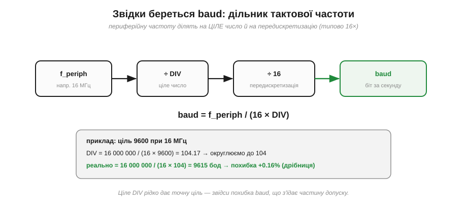
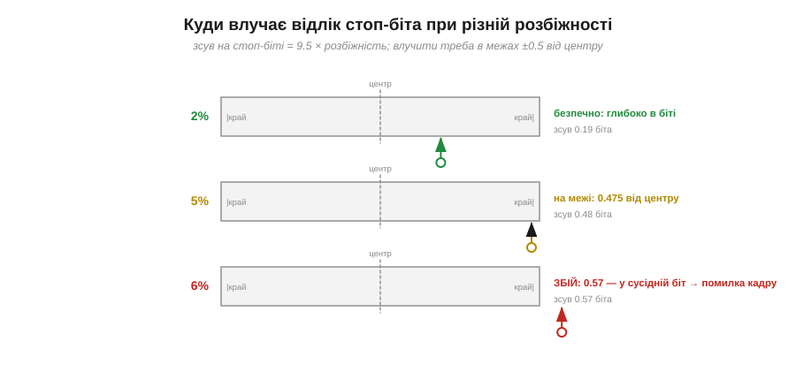

# Швидкість (baud) і розсинхрон

В [асинхронній передачі](book:communications/async-serial) сторони не діляться спільним тактовим дротом, тож їхні годинники мусять бути «досить точні» самі по собі. Що ж це за точність? Виявиться, тут є цілком конкретний, легко обчислюваний **допуск на розбіжність такту** — і знання цього числа рятує від найзагадковіших збоїв UART, коли «начебто все під'єднано, а лінія несе сміття». Заодно стане ясно, чому на платах трапляються кварци з безглуздими на вигляд частотами на кшталт 14.7456 МГц.

### Звідки береться baud: дільник частоти

Спершу — як апаратура взагалі отримує потрібну швидкість. У мікроконтролера є тактова частота периферії (скажімо, 16 МГц), а UART-блок усередині містить **генератор швидкості** (*baud-rate generator*) — звичайний дільник. Він ділить тактову частоту на ціле число **DIV**, а потім ще на коефіцієнт **передискретизації** (типово 16 — стільки разів приймач опитує лінію за один бітовий інтервал), і дістає бітову швидкість.


*Рис. Генератор baud: baud = f_periph / (16 × DIV). Периферійну частоту ділять на ціле DIV і на передискретизацію. Оскільки DIV — **ціле**, бажану швидкість майже ніколи не дістати точно: реальний baud трохи відрізняється від цілі, і ця похибка з'їдає частину допуску ще до того, як підключено другий пристрій.*

Ось де народжується перша похибка. DIV мусить бути цілим, а формула рідко дає рівне число, тож його **округлюють** — і реальна швидкість трохи відхиляється від бажаної. Стандартні швидкості (1200, 2400, 4800, 9600, 19200, 38400, 57600, 115200…) тому й «дивні», що історично добиралися зручними для поширених тактових частот; кожна наступна приблизно вдвічі більша за попередню.

**Приклад (похибка baud від округлення).** Порахуймо реальну швидкість для цілі 9600 за тактової 16 МГц:

```
DIV = 16 000 000 / (16 × 9600) = 104.17  →  округлюємо до 104
реальний baud = 16 000 000 / (16 × 104) = 9615 бод
похибка = (9615 − 9600) / 9600 ≈ +0.16%
```

Для 9600 похибка крихітна — лиш 0.16%. Та сама арифметика на високій швидкості дає зовсім інший результат — і саме він стає джерелом проблем.

### Похибка не зникає: вона накопичується

Тепер головне розуміння всієї теми. Приймач синхронізується з передавачем **лише раз** — на спаді [старт-біта](book:communications/uart-frame). Після цього він відлічує кожен біт **власним** годинником, не маючи більше жодної прив'язки до передавача аж до наступного старту. А це означає, що навіть крихітна різниця в частоті годинників **накопичується** з кожним бітом.


*Рис. Розсинхрон накопичується вздовж кадру. Зелені — ідеальні точки відліку (центри бітів передавача). Червоні — точки, у яких бере відлік приймач зі злегка швидшим годинником. На старті вони збігаються, але далі червоні «повзуть» убік, і зсув росте з кожним бітом. На стоп-біті (k≈9.5) він найбільший: за розбіжності 5% це вже ≈ 0.475 біта.*

Кількісно: зсув відліку на біті номер k дорівнює приблизно **(k + 0.5) × (відносна розбіжність такту)**, виміряний у частках біта. На старті (k=0) зсув мізерний; на останньому біті кадру він **максимальний**. Саме тому асинхронна передача працює лише **короткими кадрами**: за десяток біт похибка не встигає накопичитися до фатальної, а перед наступним знаком старт-біт усе скидає в нуль. Якби кадр був завдовжки в сотні біт, навіть дрібний розсинхрон зрештою зіпсував би його кінець.

### Бюджет допуску: пів біта на останньому відліку

Скільки ж зсуву можна стерпіти? Приймач влучає в біт правильно, доки точка відліку лишається в межах цього біта — тобто поки зсув від центру менший за **половину біта**. Щойно зсув перевищить ±0.5 біта, відлік «провалюється» в сусідній біт, і дані спотворюються.


*Рис. Бюджет допуску: лінійне зростання до межі 0.5 біта. Зсув росте лінійно з номером біта (прямі для розбіжності 2%, 5%, 6%). Горизонтальна межа — 0.5 біта. Для формату 8N1 останній відлік (стоп-біт) припадає на k ≈ 9.5, тож гранична сумарна розбіжність — там, де пряма перетинає 0.5: приблизно 0.5 / 9.5 ≈ 5.3%.*

Звідси проста й точна оцінка. Для формату 8N1 останній значущий відлік (стоп-біт) припадає приблизно на 9.5 бітових інтервалів від точки синхронізації. Щоб зсув там лишився в межах 0.5 біта, сумарна розбіжність має бути меншою за:

```
гранична розбіжність ≈ 0.5 біта / 9.5 біта ≈ 5.3%
```

Але цей бюджет — **сумарний**: його ділять між собою **обидві** сторони (похибка baud передавача плюс похибка baud приймача), та ще й з'їдає частину зерно передискретизації (16× дає точність уставлення ≈ 1/16 біта). Тому на практиці керуються правилом: **кожна** сторона має триматися в межах приблизно **±2%**, і тоді сумарно лишається безпечний запас.

> 🔧 **Навіщо це.** Запам'ятай число **±2% на сторону, ~5% сумарно** — це і є та межа «досить точних» годинників. Воно пояснює, чому два пристрої з гарними кварцами легко спілкуються навіть на 115200, а два з неточними годинниками — ні. І воно ж підказує перший крок налагодження: якщо лінія несе сміття або сипле **помилками кадру** (*framing error* — коли стоп-біт прочитано як «0»), підозрюй не дроти, а **розбіжність baud**.

### Три випадки: безпечно, на межі, збій

Прикладімо цю межу до конкретних чисел і подивімося, де відлік стоп-біта влучає в біт, а де вже промахується.


*Рис. Куди влучає відлік стоп-біта за різної розбіжності. Клітина стоп-біта з центром і краями. За розбіжності 2% зсув на стоп-біті — лише 0.19 біта (глибоко в біті, безпечно). За 5% — 0.475 біта (на самій межі). За 6% — 0.57 біта: відлік уже вийшов за край, стоп-біт прочитано неправильно, приймач підіймає помилку кадру.*

**Приклад (де проходить межа).** Порахуймо зсув на стоп-біті (k = 9.5) для трьох розбіжностей:

```
зсув = 9.5 × розбіжність  (у частках біта)

2% : 9.5 × 0.02 = 0.19 біта   →  безпечно (≪ 0.5)
5% : 9.5 × 0.05 = 0.475 біта  →  на самій межі (ризиковано)
6% : 9.5 × 0.06 = 0.57 біта   →  ПРОМАХ (> 0.5) — помилка кадру
```

Видно, як вузька грань: різниця між «надійно» і «зовсім не працює» — лише кілька відсотків. Ось чому до точності годинників в асинхронній лінії ставляться так серйозно.

### Чому існують «дивні» кварци

Повернімося до похибки baud від округлення дільника — вона диктує сам **вибір кварцу**. За 16 МГц ціль 9600 дала лише +0.16% похибки — крихітну. А тепер та сама тактова, але висока швидкість.

**Приклад (16 МГц на 115200 — погана пара).** Порахуймо реальну швидкість:

```
DIV = 16 000 000 / (16 × 115200) = 8.68  →  округлюємо до 9
реальний baud = 16 000 000 / (16 × 9) = 111 111 бод
похибка = (111 111 − 115 200) / 115 200 ≈ −3.5%
```

Уже **−3.5%** лише з одного боку! Це з'їдає майже весь сумарний бюджет ще до того, як ми глянули на другий пристрій. Саме тому «16 МГц на 115200» — відомо проблемна пара. А розв'язок — узяти тактову, **кратну** бодовим швидкостям.


*Рис. Похибка baud на 115200 для різних кварців. Кварци 14.7456 і 11.0592 МГц дають точно 115200 (нульова похибка), бо вони кратні бодовим частотам. «Круглі» 16 і 12 МГц дають −3.5% і −7% — на межі або за нею. Ось чому на платах із послідовним зв'язком трапляються «дивні» кварци на кшталт 14.7456 МГц: вони — не примха, а добір під точний baud.*

Число 14.7456 МГц виглядає безглуздо, аж поки не помітиш: 14 745 600 = 115 200 × 128. Така частота ділиться на будь-яку стандартну бодову швидкість **націло**, тож похибка baud — нуль. Уся родина «телекомунікаційних» кварців (1.8432, 3.6864, 7.3728, 11.0592, 14.7456, 22.1184 МГц) — це кратні до бодових частот, дібрані саме заради цього.

> 🔧 **Навіщо це.** Побачивши на чужій платі кварц на 11.0592 чи 14.7456 МГц, ти одразу знаєш: ця плата серйозно працює з UART на високих швидкостях. І навпаки — якщо мікроконтролер тактується від «круглих» 16 чи 8 МГц, не дивуйся, що на 115200 зв'язок капризує: похибка baud уже близька до межі. Багато сучасних чипів (зокрема ESP32) обходять це **дробовим** дільником, який добирає швидкість точніше за ціле DIV, — але стара добра порада «візьми правильний кварц» досі жива.

### Що ще звужує допуск: кадр і джерело такту

Насамкінець — два чинники, які з'їдають бюджет допуску, і про які варто пам'ятати. Перший — **довжина кадру**. Що далі від старту останній відлік, то менший допуск: довший кадр накопичує більше зсуву.


*Рис. Довжина кадру й точність джерела такту. Ліворуч: короткий кадр терпить більший розсинхрон (5N1 — аж 7.7%, а 8N2 — лише 4.8%, бо стоп далі від старту). Праворуч: точність джерела такту. Кварц тримає ±0.005%, а внутрішній RC-генератор — цілих ±1…2% із температурою, тобто сам здатний з'їсти майже весь бюджет.*

Другий, важливіший, чинник — **джерело такту**. Кварцовий резонатор тримає частоту з точністю ±0.005% (±50 ppm) — на тлі нашого 2%-бюджету це ніщо. А от дешевий **внутрішній RC-генератор** мікроконтролера «гуляє» на ±1…2%, та ще й залежно від температури й напруги. Якщо обидва пристрої тактуються від внутрішніх RC, їхні похибки можуть скластися й вилізти за межу — і саме тому два таких пристрої нерідко «не бачать» одне одного на 115200, тоді як із кварцами зв'язок іде без проблем.

> 🔧 **Навіщо це.** Сумарний бюджет ≈5% ділиться між **чотирма** їдцями: похибка baud передавача, похибка baud приймача, дрейф годинника (особливо RC від температури) і зерно передискретизації. Практичні висновки прості: для надійного високошвидкісного UART бери кварц (або калібрований внутрішній генератор), не задирай швидкість понад потрібну, а якщо зв'язок капризує — спершу **знизь baud** (на 9600 допуск величезний, бо й похибки дрібні) і лише потім шукай інше. Часто саме крок «115200 → 9600» оживляє вперту лінію.

Отже, допуск на розбіжність такту — це не туманне «досить точно», а конкретне число: близько ±2% на сторону, ~5% сумарно, і вужче для довших кадрів та теплих RC-генераторів. Воно й пояснює, чому два пристрої з гарними кварцами легко спілкуються навіть на 115200, а пара дешевих RC-годинників нерідко «не бачить» одне одного. Окрема, незалежна історія — те, якими саме [рівнями напруги](book:electronics/ttl-rs232) кодуються ці «1» і «0»: 3.3 В на ніжці мікроконтролера й інвертовані ±12 В старого комп'ютерного порту — речі несумісні, і переплутати їх означає в кращому разі нічого не побачити, а в гіршому — спалити вхід.

---
