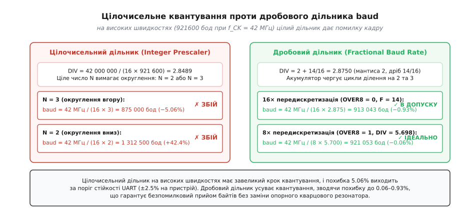
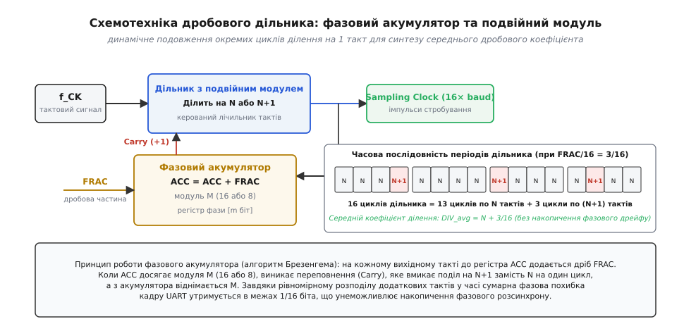
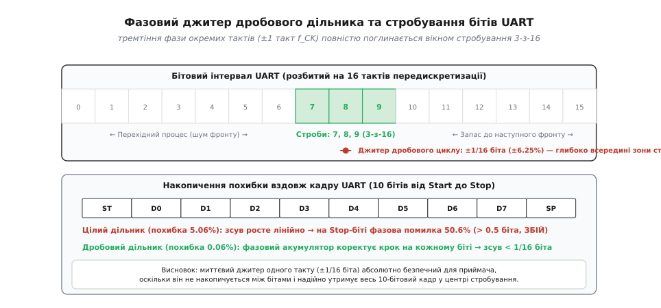
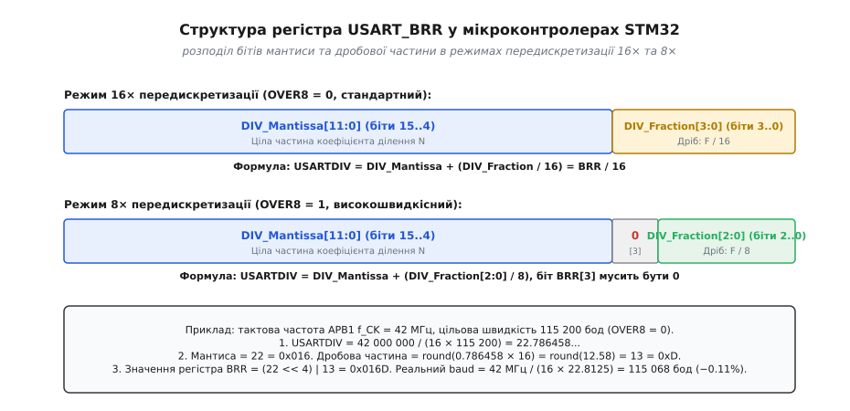

# Дробовий дільник baud

<preknowlist>
- [Швидкість baud](topic:communications/baud-rate) — цілочисельне ділення тактової частоти, накопичення розсинхрону вздовж кадру та межі допуску.
- [Формат кадру UART](topic:communications/uart-frame) — старт-біт, біти даних, біт парності та стоп-біт у часовій діаграмі.
- [Передискретизація UART](topic:communications/uart-oversampling) — мажоритарний вибір (3-з-16 або 3-з-8) та стробування центру біта.
- [Джитер дискретизації](topic:communications/sampling-jitter) — циклічні флуктуації фронтів та часовий розкид імпульсів.
</preknowlist>

Якщо розробник вбудованої системи налаштовує мікроконтролер STM32F4 з тактовою частотою шини периферії APB1 `f_PCLK = 42 МГц` для зв'язку з GNSS-приймачем або швидкісним бездротовим модулем на швидкості `921 600 бод`, стандартний цілочисельний дільник частоти зазнає повної невдачі. Формула ідеального коефіцієнта ділення з типовою 16-кратною передискретизацією вимагає дільника `DIV = 42 000 000 / (16 × 921 600) = 2.8489`. Оскільки класичний цифровий дільник на базі двійкового лічильника здатен відраховувати винятково цілі значення тактів, найближчим цілим числом є `DIV = 3`. Це дає фактичну швидкість передачі `42 000 000 / (16 × 3) = 875 000 бод`, що відповідає систематичній відносній похибці у `-5.06%`. В асинхронному протоколі UART з форматом кадру 8-N-1 сумарний допустимий бюджет розбіжності тактових генераторів обох сторін становить приблизно `5.3%`, а запас на окремий пристрій не повинен перевищувати `±2.5%`. Похибка у `5.06%` перевищує цей поріг удвічі, спричиняючи зміщення точок вибірки за межі стоп-біта, підняття апаратного прапорця помилки кадру (*framing error*, `FE`) та регулярну втрату байтів.

Історично цю проблему вирішували встановленням на друковану плату так званих «бодових кварців» із нестандартними номіналами (11.0592 МГц, 14.7456 МГц, 18.432 МГц), які діляться на стандартні швидкості UART без залишку. Проте в сучасних мікроконтролерах із високоінтегрованими системами фазового автопідстроювання частоти (PLL) внутрішні шини тактуються круглими частотами (48 МГц, 72 МГц, 84 МГц, 168 МГц, 480 МГц), оптимізованими під продуктивність процесорного ядра, шину USB або пам'ять SDRAM. Використання спеціального зовнішнього кварцу заради одного послідовного порту здорожчує схему та позбавляє систему гнучкості. Розв'язком став перехід до дробових дільників швидкості передачі (англ. *Fractional Baud Rate Generator*, FBRG) — апаратних блоків цифрового синтезу, які динамічно чергують коефіцієнти ділення на сусідніх тактах, формуючи середню швидкість з високою субдискретною точністю.

---

### Природа квантування цілочисельних дільників

Щоб зрозуміти причину виникнення похибки, простежимо внутрішню схемотехніку базового генератора швидкості UART. Будь-який асинхронний приймач потребує внутрішньої тактової частоти стробування `f_sample`, яка перевищує швидкість передачі даних `Baud` у `R` разів (де `R = 16` або `R = 8` — коефіцієнт передискретизації, англ. *oversampling ratio*). Ця вибірка необхідна приймачу для відліку старт-біта, пошуку спадного фронту та взяття трьох стробувальних вибірок у центрі кожного бітового інтервалу.

Вхідна тактова частота шини периферії `f_CK` подається на модуль цілочисельного лічильника зі зворотним відліком (англ. *prescaler*), який відраховує `N` вхідних тактів перед формуванням одного вихідного стробувального імпульсу:

```
f_sample = f_CK / N
Baud = f_sample / R = f_CK / (R · N)
```

Тут `N` — ціле додатне число, записане в регістр дільника. Крок переналаштування частоти (дискретність квантування) такого дільника є нерівномірним і визначається різницею частот для двох сусідніх цілих коефіцієнтів `N` та `N + 1`:

```
Delta_Baud(N)
= f_CK / (R · N) - f_CK / (R · (N + 1))
= ( f_CK · (N + 1) - f_CK · N ) / ( R · N · (N + 1) )  [зведення до спільного знаменника]
= f_CK / ( R · N · (N + 1) )                          [спрощення чисельника]
```

Відносна дискретність квантування становить величину `1 / N`. Це створює фундаментальну проблему: чим вища бажана швидкість передачі `Baud` або чим нижча базова тактова частота шини `f_CK`, тим меншим є коефіцієнт `N`, і тим катастрофічнішим стає стрибок частоти між сусідніми значеннями лічильника.

Наприклад, при `f_CK = 16 МГц`, `R = 16` та цільовій швидкості `115 200 бод`:

```
N_ideal = 16 000 000 / (16 × 115 200) = 8.680555...
```

Вибір `N = 9` дає швидкість `111 111 бод` (похибка `-3.55%`), а вибір `N = 8` дає швидкість `125 000 бод` (похибка `+8.51%`). Обидва варіанти знаходяться на межі або за межею працездатності протоколу. Якщо ж ми спробуємо встановити швидкість `921 600 бод` при такій самій тактовій частоті, теоретичний коефіцієнт складе `N_ideal = 1.085`, де єдиний доступний цілий дільник `N = 1` генерує швидкість `1 000 000 бод` із похибкою `+8.51%`.


*Цілочисельне квантування проти дробового дільника baud. На високих швидкостях цілий дільник N = 3 при частоті 42 МГц та швидкості 921600 бод дає відносну похибку −5.06%, що призводить до помилки кадру. Дробовий дільник з дискретністю 1/16 (мантиса 2, дріб 14/16) знижує похибку до −0.93%, а в режимі 8× передискретизації — до −0.06%, забезпечуючи надійний зв'язок.*

---

### Принцип дробового ділення: мантиса та дріб

Дробовий дільник швидкості передачі (Fractional Baud Rate Generator) усуває дискретність цілих чисел шляхом представлення коефіцієнта ділення у вигляді змішаного раціонального дробу:

```
DIV = N + F / M
```

У цій формулі:
- `N` — ціла частина коефіцієнта (мантиса дільника, *DIV_Mantissa*), яка задає базову кількість тактів у циклі;
- `F` — чисельник дробової частини (*DIV_Fraction*), ціле число в діапазоні від `0` до `M - 1`;
- `M` — знаменник дробу, фіксований розрядністю апаратного накопичувача (найчастіше `M = 16` або `M = 8`).

Усереднений коефіцієнт ділення синтезується завдяки тому, що дільник виконує не однакове ділення на кожному такті, а **чергує цикли різної тривалості**. Якщо у серії з `M` послідовних вихідних стробів дільник виконає рівно `F` циклів тривалістю `N + 1` тактів вхідної частоти та `M - F` циклів тривалістю `N` тактів, загальний витрачений час за повний блок становитиме:

```
T_block
= (M - F) · N · T_CK + F · (N + 1) · T_CK
= ( M · N - F · N + F · N + F ) · T_CK  [розкриття дужок]
= ( M · N + F ) · T_CK                  [скорочення доданків]
```

Поділивши сумарний час на кількість згенерованих вихідних циклів `M`, отримуємо середній період вихідного сигналу `T_sample_avg`:

```
T_sample_avg = T_block / M = (N + F / M) · T_CK
```

Відповідно, середня вихідна частота стробування становить:

```
f_sample_avg = f_CK / (N + F / M)
```

А результуюча середня швидкість передачі даних дорівнює:

```
Baud = f_CK / ( R · (N + F / M) ) = f_CK / ( R · N + (R / M) · F )
```

Якщо коефіцієнт передискретизації збігається зі знаменником дробу (`R = 16` та `M = 16`), дільник у знаменнику перетворюється на витончену форму з фіксованою комою: `16 · N + F`. Саме ця елегантна математична тотожність лежить в основі регістрової структури більшості сучасних мікроконтролерів.

---

### Схемотехніка фазового акумулятора та алгоритм Брезенгема

Ключовим інженерним викликом є правильний порядок чергування циклів `N` та `N + 1`. Якщо згрупувати всі подовжені цикли `N + 1` на початку періоду, а базові `N` — наприкінці, фаза вихідного сигналу отримає значне зміщення, яке зростатиме протягом першої половини кадру і спадатиме протягом другої.

Щоб мінімізувати миттєву фазову похибку в будь-який момент часу, подовжені такти повинні бути рівномірно розпорошені між стандартними тактами. Апаратна цифрова схемотехніка реалізує це за допомогою **фазового акумулятора** (англ. *phase accumulator*) на базі регістра суматора з фіксованою розрядністю — методу, повністю ізоморфного класичному алгоритму генерації ліній Брезенгема (англ. *Bresenham's algorithm*).


*Схемотехніка дробового дільника: фазовий акумулятор та дільник подвійного модуля. На кожному вихідному такті до регістра ACC додається дріб FRAC. Переповнення (Carry = 1) подовжує поточний цикл лічильника на +1 вхідний такт. Наведена часова послідовність для FRAC = 3/16 демонструє рівномірне вкраплення 3 подовжених циклів серед 13 базових, утримуючи середній коефіцієнт рівним N + 3/16 без накопичення фазового дрейфу.*

Робота фазового акумулятора відбувається за такими кроками:

1. Дільник містить `m`-бітний регістр накопичувача `ACC`, початкове значення якого дорівнює `0`. Для модуля `M = 16` розрядність становить `m = 4` біти.
2. Щоразу, коли головний лічильник завершує черговий цикл ділення і видає вихідний строб, до вмісту акумулятора додається числове значення дробу: `ACC = ACC + F`.
3. Якщо результат додавання не перевищує ємності модуля (`ACC < M`), біт переносу `Carry = 0`. Лічильник на наступному циклі відраховує стандартну кількість тактів `N`.
4. Якщо виникає переповнення (`ACC >= M`), суматор формує сигнал переносу `Carry = 1`, а з акумулятора віднімається значення модуля: `ACC = ACC - M` (або старший біт просто відкидається апаратно за рахунок циклічного переповнення `m`-бітного регістра).
5. Сигнал `Carry = 1` подається на схему блокування лічильника (англ. *pulse swallowing circuit* або *dual-modulus prescaler*), яка подовжує тривалість поточного циклу ділення рівно на один вхідний такт, змушуючи лічильник відрахувати `N + 1` тактів `f_CK`.

Строге математичне виведення меж фазових відхилень, рекурентних співвідношень та розрахунку спектра фазового шуму наведено у вставці [🧮 Математика дробового ділення частоти та накопичення фази](topic:communications/fractional-baud/math-bresenham-accumulator.md).

---

### Фазовий джитер проти бюджету стробування кадру UART

Принципове питання, яке виникає у кожного розробника: якщо окремі стробувальні цикли мають різну фізичну тривалість (`N` або `N + 1` тактів `f_CK`), чи не призводить це до фазового тремтіння (англ. *phase jitter*), яке зіпсує прийом даних?

Відповідь криється в аналізі масштабу часу та роботі цифрового фільтра приймача.

По-перше, абсолютна величина розтягнення циклу становить рівно **один період вхідної тактової частоти `T_CK`**. Оскільки тактова частота шини зазвичай вимірюється десятками або сотнями мегагерців, тривалість одного такту `T_CK` є надзвичайно малою порівняно з тривалістю одного біта UART `T_bit`.

Обчислимо співвідношення величин для тактової частоти `42 МГц` (`T_CK ≈ 23.8 нс`) та швидкості `921 600 бод` (`T_bit ≈ 1085 нс`):

```
T_CK / T_bit = 23.8 нс / 1085 нс ≈ 0.0219 (2.19% від тривалості біта)
```

По-друге, асинхронний приймач UART здійснює 16 вибірок на кожен бітовий інтервал. У стандартному режимі стробування (3-з-16) стан лінії опитується на **7, 8 та 9 тактах** передискретизації від початку біта, після чого апаратний мажоритарний селектор обирає рівень за правилом більшості (якщо щонайменше дві вибірки з трьох мають рівень «1», біт вважається одиницею).


*Фазовий джитер окремих тактів та око стробування кадру UART. Миттєве тремтіння фази (±1 такт f_CK, тобто ±6.25% від такт-відліку) повністю поглинається зоною стробування 3-з-16 (вибірки 7, 8, 9) у центрі біта. При цьому вздовж 10-бітового кадру похибка фази не накопичується, на відміну від цілочисельного дільника, де лінійний дрейф виводить відлік стоп-біта за межі допустимого вікна.*

Центральне вікно вибірок 7..9 розташоване посередині бітового інтервалу (між 43.75% та 56.25% тривалості біта), маючи колосальний захисний інтервал понад `40%` до переднього і заднього фронтів. Джитер в один такт `T_CK` зміщує точку вибірки максимум на `±1/16` частки одного відліку, що абсолютно нездатно вивести строб за межі стабільної полиці біта.

Мажоритарний селектор містить додатковий діагностичний механізм: якщо вибірки 7, 8 та 9 не однакові (наприклад, стан лінії змінився `1-0-1` або `0-1-1` через високочастотну заваду), контролер підіймає прапорець виявлення шуму (*Noise Flag*, `NF` у регістрі стану `USART_ISR`). Це дозволяє програмному забезпеченню оцінювати якість фізичного каналу зв'язку в реальному часі без переривання сесії прийому.

Найважливіше те, що **фазовий акумулятор запобігає накопиченню систематичної похибки вздовж кадру**. У простому цілочисельному дільнику розсинхрон на кожному біті додається, утворюючи лінійно зростаючий зсув, який до 10-го біта (стоп-біта) досягає катастрофічних `50%` тривалості біта. У дробовому дільнику фазовий акумулятор коректує фазу на кожному кроці, і сумарна фазова похибка на будь-якому біті кадру гарантовано не перевищує величини `T_CK`.

---

### Взаємодія з деревом тактування та подільниками шин

Реальна точність генератора швидкості UART безпосередньо залежить від конфігурації загальносистемного дерева тактування мікроконтролера (англ. *Clock Tree*). Розглянемо шлях сигналу від первинного кварцового генератора до кінцевого регістра `USART_BRR`:

1. **Первинний кварцовий генератор (HSE):** Формує опорну частоту, наприклад `8.0 МГц` чи `25.0 МГц` із високою стабільністю (±10..50 ppm).
2. **Головний помножувач PLL:** Множить та ділить опорну частоту для отримання максимальної частоти ядра системи (наприклад, `168 МГц` для Cortex-M4).
3. **Дільник шини AHB (HCLK):** Задає тактування пам'яті та центрального процесора.
4. **Попередні дільники шин периферії APB1 / APB2:** Знижують частоту до допустимих меж периферійних блоків (наприклад, дільник `/4` для APB1 формує `42 МГц`, а дільник `/2` для APB2 формує `84 МГц`).

Якщо інженер змінює коефіцієнт ділення шини APB в регістрі конфігурації `RCC_CFGR` під час роботи (наприклад, для зниження споживання струму в режимі очікування), тактова частота `f_CK` на вході модуля USART пропорційно зменшується. Якщо драйвер не оновить вміст `USART_BRR`, реальна швидкість передачі впаде у відповідну кількість разів.

Тому сучасні бібліотеки апаратних абстракцій (STM32 HAL / LL, ESP-IDF, Zephyr OS) реалізують динамічне опитування функцій визначення частоти шини:

```
uint32_t pclk = HAL_RCC_GetPCLK1Freq();
USART1->BRR = UART_BRR_SAMPLING16(pclk, target_baud);
```

---

### Апаратне автоматичне визначення швидкості (Auto-Baud Rate)

У багатьох промислових застосуваннях (зокрема в автомобільних шинах LIN, протоколах діагностики OBD-II та завантажувачах bootloader) ведучий пристрій може підключатися на невідомій заздалегідь швидкості. Для автоматичного підлаштування мікроконтролери оснащуються апаратним модулем автовизначення швидкості (Auto-Baud Rate, ABR).

У мікроконтролерах STM32 механізм ABR вмикається бітом `ABREN` у регістрі `USART_CR2`. Апаратна частина підтримує чотири режими вимірювання (`ABRMOD[1:0]`):

1. **Режим 00 (Вимірювання старт-біта):** Таймер вимірює часовий інтервал між спадним та наростаючим фронтами першого старт-біта (тривалість низького рівня «0»).
2. **Режим 01 (Вимірювання спадного фронту):** Вимірюється інтервал між спадним фронтом старт-біта та першим спадним фронтом бітів даних.
3. **Режим 10 (Синхронізація за кадром 0x55):** Ведучий передає тестовий байт `0x55` (двійковий шаблон `01010101`). Приймач вимірює сумарну тривалість 8 послідовних бітів від старт-біта до передостаннього біта даних і ділить отриманий час на 8. Це дає найвищу точність усереднення, нівелюючи випадкові сплески фронтів.
4. **Режим 11 (Синхронізація за шаблоном 0x7F):** Вимірювання інтервалу для спеціальних протоколів завантаження прошивки.

Після завершення вимірювання апаратний блок автоматично обчислює значення мантиси та дробової частини, записує результат безпосередньо в регістр `USART_BRR`, встановлює прапорець `ABRF = 1` (Auto-Baud Rate Flag) у регістрі `USART_ISR` та генерує переривання, повідомляючи процесор про готовність до прийому даних на новій швидкості.

---

### Довжина кадру та допустимий бюджет похибки

Сумарний бюджет похибки швидкості передачі безпосередньо залежить від формату та загальної довжини кадру UART. Чим більше бітів містить кадр між точкою початкової синхронізації (старт-бітом) та фінальною точкою вибірки (стоп-бітом), тим жорсткішим стає допуск на відносну розбіжність генераторів `epsilon`.

Розглянемо часове положення останньої значущої вибірки для різних конфігурацій кадру:

- **Формат 7-N-1 (9 бітів у кадрі):** 1 старт-біт, 7 бітів даних, 1 стоп-біт. Останній відлік припадає на момент `k = 8.5` бітових інтервалів від стартового фронту. Допустима сумарна похибка: `0.5 / 8.5 ≈ 5.88%`.
- **Формат 8-N-1 (10 бітів у кадрі):** 1 старт-біт, 8 бітів даних, 1 стоп-біт. Останній відлік припадає на `k = 9.5` бітових інтервалів. Допустима сумарна похибка: `0.5 / 9.5 ≈ 5.26%`.
- **Формат 8-E-1 або 8-O-1 (11 бітів у кадрі):** 1 старт-біт, 8 бітів даних, 1 біт парності, 1 стоп-біт. Останній відлік припадає на `k = 10.5` бітових інтервалів. Гранична похибка: `0.5 / 10.5 ≈ 4.76%`.
- **Формат 8-E-2 (12 бітів у кадрі, наприклад Futaba S.Bus):** 1 старт-біт, 8 бітів даних, 1 біт парності, 2 стоп-біти. Останній відлік припадає на `k = 11.5` бітових інтервалів. Гранична сумарна похибка: `0.5 / 11.5 ≈ 4.35%`.

Оскільки граничний бюджет ділиться порівну між передавачем та приймачем, для довгих 11- та 12-бітових кадрів допустима похибка кожного пристрою звужується до `±2.0%`. Застосування дробового дільника усуває похибку квантування лічильника, залишаючи весь бюджет на температурний дрейф кварцових резонаторів.

---

### Апаратні реалізації в мікроконтролерах

Різні виробники напівпровідників втілюють принципи дробового ділення через різні комбінації бітових полів та регістрових структур.

#### 1. STMicroelectronics STM32 (USART_BRR та біт OVER8)

У мікроконтролерах STM32 керування швидкістю здійснюється через 16-бітний регістр `USART_BRR`. Апаратна частина підтримує два режими передискретизації, що перемикаються бітом `OVER8` у регістрі керування `USART_CR1`:

- **Режим 16× передискретизації (`OVER8 = 0`):**
  Регістр `USART_BRR` інтерпретується як число з фіксованою комою формату 12.4. Старші 12 бітів `BRR[15:4]` містять мантису `DIV_Mantissa` (цілу частину дільника від 1 до 4095), а молодші 4 біти `BRR[3:0]` містять дробову частину `DIV_Fraction` з дискретністю `1/16` (значення від 0 до 15).
  Формула запису в регістр має винятково простий вигляд:
  ```
  USARTDIV = f_CK / (16 · Baud)
  BRR = round( 16 · USARTDIV ) = round( f_CK / Baud )
  ```

- **Режим 8× передискретизації (`OVER8 = 1`):**
  Режим підвищеної швидкості, призначений для подвоєння максимальної швидкості передачі (аж до `f_CK / 8`, наприклад до 10.5 Мбод при шині 84 МГц). Тут передискретизація становить 8 тактів на біт. Мантиса займає ті самі біти `BRR[15:4]`, а дробова частина зменшується до 3 бітів `BRR[2:0]` з дискретністю `1/8`. Біт `BRR[3]` повинен залишатися строго рівним `0`.
  ```
  USARTDIV = f_CK / (8 · Baud)
  DIV_Mantissa = floor( USARTDIV )
  DIV_Fraction = round( (USARTDIV - DIV_Mantissa) · 8 )
  BRR = (DIV_Mantissa << 4) | (DIV_Fraction & 0x07)
  ```


*Структура регістра USART_BRR у мікроконтролерах STM32. У стандартному режимі 16× передискретизації молодші 4 біти [3:0] несуть дробову частину F/16. У швидкісному режимі 8× передискретизації дріб кодується трьома бітами [2:0] як F/8, а біт [3] залишається нульовим.*

#### 2. Espressif ESP32 / ESP32-S3 (UART_CLKDIV_REG)

В архітектурі ESP32 регістр `UART_CLKDIV_REG` розрядністю 24 біти містить:
- `CLKDIV_INTEGER[11:0]` (біти 11..0) — 12-бітна ціла частина коефіцієнта ділення;
- `CLKDIV_FRAG[23:20]` (біти 23..20) — 4-бітна дробова частина (чисельник дробу `F / 16`).

Генератор тактується від внутрішньої шини `APB_CLK` (80 МГц) або від джерела `XTAL_CLK` (40 МГц). Завдяки дробовому накопичувачу ESP32 забезпечує стабільну роботу на нестандартних швидкостях (наприклад, 1 500 000 бод чи 3 000 000 бод для швидкісного завантаження прошивки або обміну з Wi-Fi/Bluetooth співпроцесорами).

#### 3. NXP LPC (Fractional Divider Register FDR)

У мікроконтролерах NXP серій LPC17xx, LPC40xx та LPC55xx дільник UART побудований за схемою з попереднім дробовим множником. Класичні регістри дільника `DLL` (молодший байт) та `DLM` (старший байт) задають цілий коефіцієнт `1..65535`, а додатковий регістр `FDR` задає чисельник `DIVADDVAL[3:0]` та знаменник `MULVAL[7:4]` дробового перетворювача:

```
Baud = f_PCLK / ( 16 · (256 · DLM + DLL) · ( 1 + DIVADDVAL / MULVAL ) )
```

Діапазон значень: `MULVAL ∈ [1..15]`, `DIVADDVAL ∈ [0..14]`, причому діє апаратне обмеження `DIVADDVAL < MULVAL`. Ця схема дозволяє підбирати не лише степені двійки (1/16), а й довільні раціональні дроби (наприклад, 1/3, 2/7, 5/11), досягаючи нульової похибки швидкості при найскладніших співвідношеннях частот.

#### 4. Texas Instruments MSP430 / TMS320 (Модуляція форми імпульсів)

У контролерах Texas Instruments (сімейства MSP430 eUSCI та C2000 DSP) використовується двоступенева схема: перший ступінь `UCBRFx` здійснює 4-бітне ділення передискретизації при встановленому прапорці `UCOS16 = 1`, а другий ступінь `UCBRSx` задає 8-бітну маску фазової модуляції окремих бітів усередині байта даних, забезпечуючи похибку менше ніж `0.02%`.

Повний опис бітових полів, конфігураційних структур та протоколів ініціалізації наведено у вставці [📋 Апаратні регістри генераторів Baud Rate мікроконтролерів](topic:communications/fractional-baud/api-mcu-brr-registers.md).

---

### Розрахунок стандартних та спеціальних швидкостей

Розглянемо практичний алгоритм покрокового розрахунку регістрів на конкретних інженерних прикладах для шини `f_CK = 42 МГц`.

#### Приклад 1: Високошвидкісний UART 921 600 бод (STM32, 16× oversampling)

```
1. Визначаємо ідеальний коефіцієнт:
   USARTDIV = 42 000 000 / (16 × 921 600) = 2.8489148...

2. Відокремлюємо мантису:
   DIV_Mantissa = floor( 2.8489148 ) = 2 = 0x002

3. Обчислюємо 4-бітну дробову частину:
   DIV_Fraction = round( (2.8489148 - 2) × 16 ) = round( 0.8489148 × 16 ) = round( 13.5826 ) = 14 = 0x0E

4. Формуємо 16-бітне значення регістра USART_BRR:
   BRR = (DIV_Mantissa << 4) | DIV_Fraction = (2 << 4) | 14 = 0x002E (46 у десятковій системі)

5. Розраховуємо фактичну швидкість та похибку:
   DIV_real = 2 + 14 / 16 = 2.8750
   Baud_real = 42 000 000 / (16 × 2.8750) = 913 043.48 бод
   Похибка = (913 043.48 - 921 600) / 921 600 ≈ -0.93%
```

Похибка `-0.93%` знаходиться глибоко всередині допустимого коридору `±2.5%`, що гарантує абсолютно стабільний обмін даними.

#### Приклад 2: Спеціальний протокол керування сервоприводами Futaba S.Bus (100 000 бод, 8-E-2)

Протокол авіамодельного зв'язку S.Bus використовує нестандартну швидкість `100 000 бод` з інверсною логікою, контролем парності та двома стоп-бітами:

```
1. Розрахунок USARTDIV при f_CK = 84 МГц (шина APB2 STM32F4):
   USARTDIV = 84 000 000 / (16 × 100 000) = 52.5000

2. Мантиса та дробова частина:
   DIV_Mantissa = 52 = 0x034
   DIV_Fraction = round( 0.5000 × 16 ) = 8 = 0x8

3. Значення регістра BRR:
   BRR = (52 << 4) | 8 = 0x0348

4. Фактична швидкість:
   DIV_real = 52 + 8 / 16 = 52.5000
   Baud_real = 84 000 000 / (16 × 52.5) = 100 000.00 бод  (Похибка = 0.00%!)
```

#### Приклад 3: Швидкісна телеметрія БПЛА S.Bus Fast / Crossfire (420 000 бод)

```
1. Тактова частота f_CK = 42 МГц, Baud = 420 000 бод:
   USARTDIV = 42 000 000 / (16 × 420 000) = 6.2500

2. Мантиса = 6, Дріб = round( 0.25 × 16 ) = 4
   BRR = (6 << 4) | 4 = 0x0064

3. Фактична швидкість:
   DIV_real = 6 + 4 / 16 = 6.2500
   Baud_real = 42 000 000 / (16 × 6.25) = 420 000.00 бод  (Похибка = 0.00%!)
```

#### Приклад 4: Максимальна швидкість 3.0 Мбод (STM32, режим OVER8 = 1)

При потребі передачі великих масивів даних (наприклад, зняття сирих вибірок АЦП чи передача відеопотоку низької роздільної здатності) стандартний режим 16× передискретизації при `f_CK = 42 МГц` дав би мантису `DIV = 42 / (16 × 3.0) = 0.875`, що є меншим за одиницю і заборонено апаратно. Перехід на режим 8× передискретизації знімає це обмеження:

```
1. Визначаємо USARTDIV для OVER8 = 1:
   USARTDIV = 42 000 000 / (8 × 3 000 000) = 1.7500

2. Мантиса:
   DIV_Mantissa = 1 = 0x001

3. 3-бітна дробова частина (дискретність 1/8):
   DIV_Fraction = round( (1.75 - 1) × 8 ) = round( 6.0 ) = 6 = 0x6

4. Формуємо BRR (біт 3 = 0):
   BRR = (1 << 4) | (6 & 0x07) = 0x0016

5. Фактична швидкість:
   DIV_real = 1 + 6 / 8 = 1.7500
   Baud_real = 42 000 000 / (8 × 1.7500) = 3 000 000.00 бод  (Похибка = 0.00%!)
```

Повний програмний код універсального калькулятора конфігурацій та потактового симулятора приймача наведено у вставці [⚙️ Калькулятор регістрів BRR та емулятор дробового дільника](topic:communications/fractional-baud/proj-brr-calculator.md).

---

### Зведена таблиця похибок для стандартних тактових частот

Порівняємо відносну похибку встановлення швидкості між традиційним цілочисельним дільником та сучасним дробовим дільником з роздільною здатністю 1/16:

| Частота шини `f_CK` | Цільовий Baud | Цілий дільник `N` | Похибка (цілий) | Дробовий дільник (мантиса + дріб) | Похибка (дробовий) |
| :--- | :--- | :--- | :--- | :--- | :--- |
| **16 МГц** | 9 600 | `104` | `+0.16%` | `104 + 3/16` | `+0.02%` |
| **16 МГц** | 115 200 | `9` | `−3.55%` ⚠️ | `8 + 11/16` | `−0.16%` ✓ |
| **16 МГц** | 921 600 | `1` | `+8.51%` ✗ | `1 + 1/16` | `+2.37%` ✓ |
| **42 МГц** | 115 200 | `23` | `−0.93%` | `22 + 13/16` | `−0.11%` ✓ |
| **42 МГц** | 921 600 | `3` | `−5.06%` ✗ | `2 + 14/16` | `−0.93%` ✓ |
| **48 МГц** | 115 200 | `26` | `+0.16%` | `26 + 1/16` | `−0.08%` ✓ |
| **48 МГц** | 921 600 | `3` | `+8.51%` ✗ | `3 + 4/16` | `+0.16%` ✓ |
| **72 МГц** | 115 200 | `39` | `+0.16%` | `39 + 1/16` | `0.00%` ✓ |
| **72 МГц** | 921 600 | `5` | `−2.17%` ⚠️ | `4 + 14/16` | `−0.08%` ✓ |
| **84 МГц** | 420 000 (S.Bus)| `13` | `−3.85%` ⚠️ | `12 + 8/16` | `0.00%` ✓ |
| **84 МГц** | 1 500 000 | `4` | `−12.5%` ✗ | `3 + 8/16` | `0.00%` ✓ |

Таблиця наочно демонструє, що цілочисельний дільник на швидкостях понад 115200 бод стає непридатним практично для всіх поширених тактових частот шин (похибки від `3.5%` до `12.5%`). Впровадження дробового дільника знижує залишковий розсинхрон до часток відсотка (`< 0.2%`), усуваючи необхідність застосування спеціальних кварцових резонаторів.

---

### Фізичні обмеження трансиверів та компенсація затримок

На швидкостях вище 1 Мбод інженер стикається не лише з математичною точністю дільника, а й із фізичними обмеженнями інтерфейсних мікросхем (драйверів RS-485, RS-422, ізольованих оптопар та перетворювачів рівнів TTL).

1. **Асиметрія затримок поширення (Propagation Delay Skew):**
   Швидкісні оптопари та цифрові ізолятори (наприклад, серії Si86xx або ADuM140x) мають різний час наростання `t_PLH` (перехід з 0 в 1) та час спаду `t_PHL` (перехід з 1 в 0). Різниця `|t_PLH - t_PHL|` може складати від 5 до 25 наносекунд. На швидкості 3 Мбод (`T_bit = 333 нс`) асиметрія у 20 нс спотворює тривалість біта на `6%`.
2. **Ємнісне навантаження та швидкість наростання (Slew Rate):**
   У довгих лініях RS-485 сумарна ємність кабелю затягує наростання сигналу. Завдяки високій субдискретній точності дробового дільника розробник може програмно ввести невелике зміщення швидкості (наприклад, встановити швидкість на `+0.5%` вище номіналу), що дозволяє скомпенсувати затягування фронтів та відцентрувати точки стробування відносно деформованого ока сигналу.

---

### Помилки переповнення та взаємодія з контролером DMA

На мегабітних швидкостях передачі (1.5 Мбод, 3 Мбод, 4.5 Мбод) інтервал між послідовними байтами становить лічені мікросекунди. Для швидкості 3 Мбод один 10-бітний байтовий кадр передається всього за `3.33 мкс`.

Якщо прийом даних організовано через звичайні переривання процесора (`USART_IT_RXNE`), час входу в переривання (ISR latency) разом із затримками збереження регістрового контексту ядра Cortex-M (близько 12–16 тактів) та можливим блокуванням від інших високопріоритетних переривань легко перевищує 3 мікросекунди. Це призводить до виникнення апаратної помилки переповнення приймального буфера (*Overrun Error*, `ORE` у регістрі `USART_ISR`), коли новий байт записується в регістр зсуву до того, як попередній байт було прочитано з регістра даних `RDR`.

Тому на швидкостях понад 115200 бод обов'язковою інженерною вимогою є використання **контролера прямого доступу до пам'яті (DMA)**:
- Біт `DMAR = 1` у регістрі `USART_CR3` активує передачу кожного прийнятого байта безпосередньо в оперативну пам'ять шиною AHB без участі ядра процесора.
- Для виявлення завершення пакету змінної довжини вмикається переривання за простоєм лінії (*IDLE Line Interrupt*, біт `IDLEIE = 1` у `USART_CR1`), яке спрацьовує тоді, коли лінія перебуває в пасивному стані «1» протягом тривалості одного повного бітового кадру після завершення передачі.

Дробовий дільник baud rate забезпечує стабільну синхронізацію тривалих масивів DMA (мегабайтні потоки даних), утримуючи фазовий зсув на нульовому рівні протягом мільйонів послідовно переданих кадрів.

---

### Інженерні рекомендації з проєктування

1. **Динамічний розрахунок у драйвері замість жорстких констант:**
   Ніколи не використовуйте в драйверах захардкоджені таблиці значень `BRR` під конкретну тактову частоту, якщо проект передбачає динамічну зміну частоти живлення (DVFS) або перенесення коду між різними сімействами мікроконтролерів (наприклад, перехід зі STM32F401 з APB1 42 МГц на STM32F407 з APB1 42 МГц чи STM32F446 з APB1 45 МГц). Функція ініціалізації порту повинна зчитувати поточну частоту через виклик на кшталт `HAL_RCC_GetPCLK1Freq()` та динамічно обчислювати значення регістрів за наведеними алгоритмами.

2. **Вибір між 16× та 8× передискретизацією:**
   - Використовуйте режим **16× передискретизації (`OVER8 = 0`)** як стандартний вибір. Він забезпечує максимальну стійкість до високочастотного шуму лінії завдяки ширшому діапазону мажоритарної вибірки (3 відліки з 16) та вищій роздільній здатності дробового акумулятора (1/16).
   - Вмикайте режим **8× передискретизації (`OVER8 = 1`)** лише за крайньої потреби: коли цільова швидкість перевищує `f_CK / 16` або коли в режимі 16× не вдається вкластися у допустиму похибку `2.5%` через мале значення мантиси. Враховуйте, що при 8-кратному опитуванні захисний інтервал мажоритарного селектора звужується, що підвищує чутливість приймача до крутизни фронтів у довгих кабельних трасах.

3. **Врахування нестабільності опорного генератора:**
   Дробовий дільник компенсує виключно математичну похибку квантування ділення частоти. Він не здатен виправити фізичний дрейф самого джерела такту. Якщо мікроконтролер працює від внутрішнього нескоригованого RC-генератора (HSI), похибка якого з температурою та напругою становить `±1% .. ±2%`, ця похибка безпосередньо додається до залишкової математичної похибки дільника. Для швидкостей 921600 бод і вище завжди використовуйте зовнішній кварцовий резонатор (HSE) з точністю не гірше ніж `±50 ppm` (`±0.005%`).

Дробовий дільник baud rate перетворює генератор швидкості послідовного порту зі слабкої ланки системи на високоточний цифровий синтезатор частоти. Завдяки техніці фазового накопичення та вкраплення додаткових тактів досягається компроміс між суворою дискретністю цифрової логіки та неперервною природою фізичного часу, гарантуючи надійну передачу даних за будь-яких тактових частот мікроконтролера.
