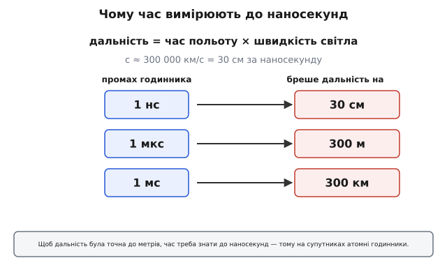
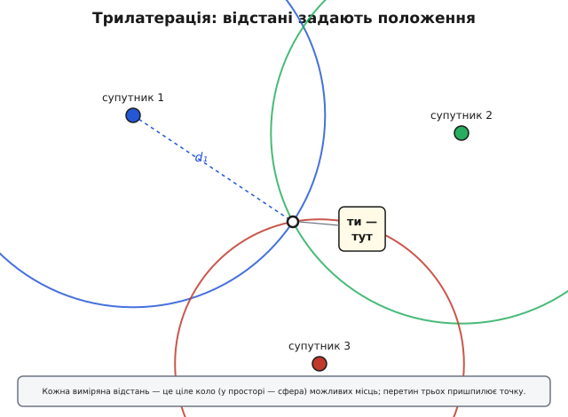
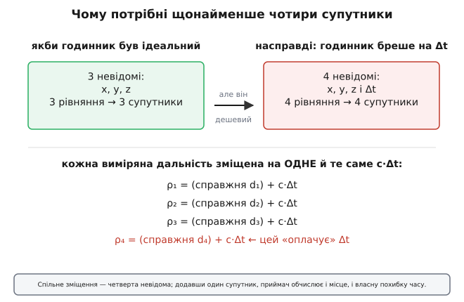
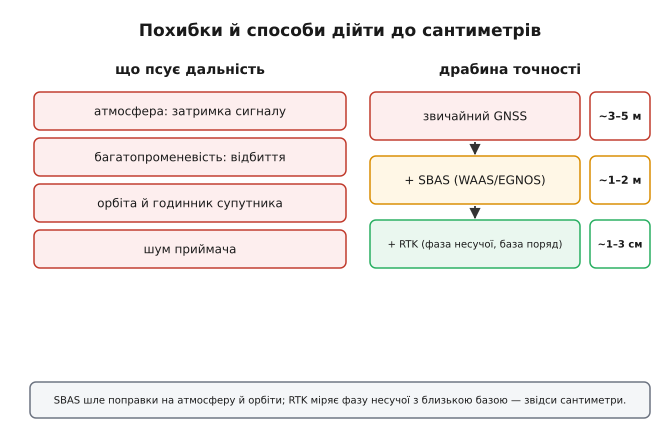

# Супутникова навігація (GNSS)

Уяви, що хтось питає: «де ти зараз?» — а відповісти треба з точністю до метрів, будь-де на планеті, не маючи поряд жодного орієнтира. Ні дороговказів, ні гір на горизонті, ні зв'язку з ким-небудь, хто тебе бачить. Саме цю задачу розв'язує **супутникова навігація**, або **GNSS** (*Global Navigation Satellite System* — глобальна супутникова навігаційна система). І розв'язує вона її напрочуд хитро: не «дивиться» на тебе згори й не питає, де ти, — а дає тобі змогу **самому** обчислити власне місце з того єдиного, що супутники безперервно роздають у простір. А роздають вони, по суті, одне — **дуже точний час**.

Це не випадково, що GNSS опиняється в розділі про синхронізацію. У глибині своїй супутникова навігація — це **задача про час**, перевдягнена в задачу про відстань. Розберімо її від самого кореня: як з часу народжується відстань, як з кількох відстаней народжується положення, чому супутників мусить бути саме чотири, а не три, звідки беруться похибки в метри й як їх збивають до сантиметрів.

## Від часу до відстані

Почнімо з єдиної фізичної опори, на якій тримається все інше. Радіосигнал — це електромагнітна хвиля, а вона летить зі **швидкістю світла**: близько 300 000 кілометрів за секунду. Швидкість стала й відома до неймовірної точності. А коли швидкість відома, то **час польоту прямо дає відстань**: помнож одне на друге — і маєш, скільки кілометрів пройшов сигнал.

Звідси й уся ідея. Супутник посилає сигнал і ніби каже: «я відправив це **точно** о такій-то мілісекунді». Приймач ловить сигнал і помічає, **коли** саме той прийшов. Різниця — час польоту. Помножимо на швидкість світла — і ось вона, відстань від приймача до супутника.

Звучить просто, поки не глянути на числа. Світло страшенно швидке, і це обертається жорсткою вимогою до годинника:

```
дальність = час польоту × швидкість світла
c ≈ 300 000 км/с  =  30 см за 1 наносекунду

похибка часу 1 нс   →  похибка дальності  30 см
похибка часу 1 мкс  →  похибка дальності  300 м
похибка часу 1 мс   →  похибка дальності  300 км
```


*Як похибка часу перетворюється на похибку відстані. Світло долає близько 30 см за наносекунду, тож кожна наносекунда промаху годинника бреше дальність на 30 см. Щоб координата була точна до метрів, час треба знати до наносекунд.*

Ось чому на кожному супутнику стоїть **атомний годинник** — не для краси, а тому, що мілісекундний промах перетворився б на сотні кілометрів помилки. Атомний годинник тримає час так рівно, що за добу збивається на частки наносекунди. До того ж супутник летить високо й швидко, тож час на ньому через ефекти теорії відносності тече трохи інакше, ніж унизу, — і цю поправку теж закладено наперед. Час тут не деталь, а **серце** всієї системи: усе подальше — лише спосіб перетворити точно відомий час на положення.

Щоб відчути той зв'язок руками, перетворимо виміряний час польоту на відстань так, як це робив би код у прошивці приймача, і поряд побачимо, чого варта одна наносекунда.

**Сигнал від супутника летів 67 128 450 нс; що це за дальність — і як її зрушить промах годинника на 10 нс?**

:::tabs
```c
// Час польоту приймач тримає в наносекундах (ціле — без втрати точності).
// Швидкість світла у вакуумі — метри за наносекунду.
static const double C_M_PER_NS = 0.299792458;   // 1 нс світла ≈ 30 см

double range_from_tof(uint64_t tof_ns) {
    return (double)tof_ns * C_M_PER_NS;          // дальність у метрах
}

uint64_t tof_ns = 67128450ULL;                   // ~67 мс — типова дальність
double range_m  = range_from_tof(tof_ns);        // = 20 124 603 м ≈ 20 125 км

double clock_err_ns = 10.0;                       // годинник збився на 10 нс
double range_bias_m = clock_err_ns * C_M_PER_NS;  // = 3.0 м похибки дальності
```
```python
# Час польоту приймач тримає в наносекундах (ціле — без втрати точності).
# Швидкість світла у вакуумі — метри за наносекунду.
C_M_PER_NS = 0.299792458                          # 1 нс світла ≈ 30 см


def range_from_tof(tof_ns: int) -> float:
    return tof_ns * C_M_PER_NS                     # дальність у метрах


tof_ns = 67_128_450                                # ~67 мс — типова дальність
range_m = range_from_tof(tof_ns)                   # = 20 124 603 м ≈ 20 125 км

clock_err_ns = 10.0                                # годинник збився на 10 нс
range_bias_m = clock_err_ns * C_M_PER_NS           # = 3.0 м похибки дальності
```
:::

Десять наносекунд промаху — і дальність уже бреше на три метри. Звідси два висновки відразу: час треба тримати цілим числом наносекунд (бо навіть округлення коштує сантиметрів), а похибку годинника не можна «зам'яти» — її доведеться чесно обчислити. Як саме — за мить.

> 🔧 **Навіщо це.** Коли в описі GNSS-модуля бачиш слова про «дисципліну годинника» чи «утримання часу», тепер ясно, звідки вони: точність координати впирається в точність часу один в один, наносекунда в тридцять сантиметрів. Той самий зв'язок працює і в інший бік — тому GNSS заодно роздає надточний час, яким синхронізують мережі й біржі.

## Одна відстань — це ще не точка

Отже, приймач уміє виміряти відстань до супутника. Чи досить цього, щоб знати, де ти? Ні. І причина суто геометрична, її варто відчути.

Припустимо, ти знаєш лише одне: до супутника рівно 20 200 км. Де ти? Десь на **сфері** радіусом 20 200 км із центром у тому супутнику — будь-де на цій сфері відстань однакова. Одне число відсікло майже весь простір, але лишило цілу поверхню можливих місць.

Додаймо другий супутник і другу відстань. Тепер ти на **перетині двох сфер** — а дві сфери перетинаються по колу. Уже не поверхня, а лінія, та все одно безліч точок.

Третій супутник, третя сфера. Три сфери перетинаються вже у **двох** точках. Майже все: лишилося обрати між двома. Зазвичай це легко — одна з точок десь далеко в космосі або під землею, тож реальна вона лише одна.

Цей спосіб знайти місце за відстанями до відомих точок зветься **трилатерацією** (від латини *trilateratus* — «трибічний»; не плутати з тріангуляцією, яка міряє **кути**, а не відстані). Її легше відчути на площині, де сфери стають колами:


*Трилатерація на площині. Кожна виміряна відстань — це ціле коло можливих місць (у просторі — сфера). Два кола перетинаються у двох точках, три — пришпилюють єдину. Координати супутників відомі наперед, тож із відстаней до них приймач і обчислює власне положення.*

Звідки приймач знає, **де** супутники, щоб було від чого відштовхуватися? Кожен супутник у самому сигналі передає свою точну орбіту — невеликий пакет даних, **навігаційне повідомлення**, з якого приймач обчислює, у якій точці простору супутник був тієї миті, коли відправляв сигнал. Тобто супутник каже одразу дві речі: «я був **отут**» і (через час відправлення) «сигнал летів **стільки**». Положення супутника плюс відстань до нього — і є одне рівняння трилатерації.

## Чому потрібні саме чотири супутники

Здавалося б, трьох сфер досить: три відстані задають точку в просторі (три координати — x, y, z). Так і було б, якби приймач мав **ідеальний годинник**. Але отут і ховається найгарніший хід усієї системи.

Атомний годинник коштує як невелика машина й важить чимало — на супутнику він доречний, а в твоєму телефоні чи на дроні його не буде ніколи. Там стоїть звичайний дешевий кварцовий резонатор, який весь час трохи **бреше**. А ми щойно бачили: похибка часу в наносекунди вже дає десятки сантиметрів, а дешевий годинник збивається куди гірше. Виміряти точний час відправлення супутник може; а от точний час **прийому** приймач своїм поганим годинником поміряти не здатний. Виходить, кожна виміряна відстань зміщена на похибку власного годинника приймача — її називають **псевдодальністю** (бо це «майже відстань», але систематично неправильна).

Здавалося б, глухий кут: без точного часу прийому немає точних відстаней, а точного часу приймачу взяти нізвідки. Та рятує одна обставина. Похибка годинника приймача в кожний момент **одна й та сама** для всіх супутників: годинник або поспішає на якесь Δt, або відстає на нього — однаково щодо всіх сигналів, що прийшли цієї миті. А отже, до кожної псевдодальності домішане **те саме** c·Δt:

```
ρ₁ = (справжня d₁) + c·Δt
ρ₂ = (справжня d₂) + c·Δt
ρ₃ = (справжня d₃) + c·Δt
ρ₄ = (справжня d₄) + c·Δt
```

Тепер полічімо невідомі. Їх не три, а **чотири**: три координати (x, y, z) і ще похибка годинника Δt. А правило просте: скільки невідомих — стільки й потрібно рівнянь. Кожен супутник дає одне рівняння. Отже, чотири невідомі вимагають **чотирьох** супутників.


*Чому супутників щонайменше чотири. Якби годинник приймача був ідеальний, вистачило б трьох супутників на три координати. Але дешевий годинник додає спільну для всіх дальностей похибку Δt — четверту невідому. Додавши один супутник, приймач одночасно знаходить і своє положення, і похибку власного годинника.*

У цьому й геніальність: система **не вимагає** від приймача дорогого годинника. Вона перетворює його ваду на ще одну невідому й **сама її обчислює** — ціною лише одного зайвого супутника. Дешевий кварц у приймачі дає ту саму точність положення, що й атомний еталон, бо його похибку розв'язано разом з координатами. Як приємний наслідок, приймач заодно дізнається **точний час** — он чому GPS-приймач можна використати як еталонний годинник.

Звідси й знайома фраза «потрібно чотири супутники для тривимірного фікса». З трьома вийде лише плаский, двовимірний фікс — і то якщо висоту взяти звідкись іще (скажімо, припустити, що ти на рівні моря). Побачивши в логах приймача рядок на кшталт «3D fix: 7 sats», тепер читаєш його по суті: знайдено всі три координати плюс розв'язано годинник, та ще й із запасом супутників.

> 🔧 **Навіщо це.** «Псевдо» в слові «псевдодальність» — не дрібниця термінології: воно нагадує, що сире вимірювання GNSS системно зміщене, поки не розв'язано похибку годинника. Тому й мінімум — чотири супутники, а не три; і тому ж приймач у відкритому полі, де видно багато супутників, фіксується впевненіше, ніж у дворі-колодязі, де неба клаптик.

## Чому перший фікс не миттєвий

Кожен, хто вмикав навігатор чи готував дрон до зльоту, помічав: свіжоввімкнений приймач не видає координати одразу — «думає», інколи довго. Це не повільність обчислень: розв'язати чотири рівняння для сучасного чипа — мить. Затримка в іншому: приймачу спершу треба **дізнатися, де шукати супутники й де вони насправді**.

Корінь затримки — в орбітах. Для трилатерації приймачу потрібні точні орбіти супутників, а кожен супутник передає свою орбіту в навігаційному повідомленні поділеною на два сорти за тривкістю:

- **Ефемериди** (*ephemeris*, з грецької *ἐφήμερος* — «одноденний») — дуже точна орбіта **саме цього** супутника. Точна, але швидко застаріває: її оновлюють приблизно щодві години.
- **Альманах** (*almanac*) — грубі орбіти **всіх** супутників сузір'я. Неточний, зате лишається придатним тижнями. Він потрібен, щоб узагалі знати, **який супутник де** шукати на небі.

Сигнал від супутника слабкий, передається повільно, і завантажити з нього свіжі дані — це секунди й навіть хвилини. Звідси три типові сценарії запуску:

- **Гарячий старт** — приймач нещодавно працював, ефемериди ще свіжі, груба позиція відома. Лишається зловити сигнал і порахувати — кілька секунд.
- **Теплий старт** — є альманах і приблизне місце, але ефемериди застаріли. Треба підвантажити свіжі ефемериди видимих супутників — десятки секунд.
- **Холодний старт** — приймач не знає ні точного часу, ні де він, ні де супутники (щойно з заводу або пролежав вимкненим тижні). Мусить наосліп знайти супутники, завантажити ефемериди, а часом і весь альманах — від півхвилини до кількох хвилин.

Ось чому апарат після довгого простою чи перельоту в інший край світу ловить супутники помітно довше, ніж зазвичай. Це не поломка — це холодний старт. Передові модулі обходять затримку, підкачуючи свіжі ефемериди не з неба, а з інтернету (так званий *A-GPS*, *assisted GPS*), коли є зв'язок, — і тоді навіть холодний приймач фіксується за секунди.

## Геометрія важить не менше за кількість

Чотири супутники — це мінімум, але не запорука точності. Величезну роль грає, **як саме** супутники розкидані по небу. Тут варто повернутися до картинки з перетином сфер.

Уяви, що два кола перетинаються майже під прямим кутом — перетин виходить чіткий, гострий: трохи зрушиш будь-яке коло, точка майже не зсунеться. А тепер уяви, що кола перетинаються під дуже гострим кутом, ледь-ледь розходячись, — перетин стає розмазаною, витягнутою плямою: найменша похибка в одній відстані жбурляє точку перетину далеко вбік. З супутниками те саме. Коли вони широко розкидані по небосхилу, перетин сфер «гострий» — похибка мала. Коли ж усі збилися в одному кутку неба, перетин «пологий» — і та сама похибка вимірювання дає набагато більшу похибку положення.

Цю властивість геометрії називають **DOP** (*dilution of precision* — «розмивання точності»), а конкретно для горизонталі — **HDOP** (*horizontal DOP*). Менший HDOP — краща геометрія, надійніший фікс; великий HDOP — навіть при багатьох супутниках точність кепська. Тому добрий приймач (і автопілот) дивиться не лише на **кількість** супутників, а й на **HDOP**, і не дозволяє покладатися на координати, поки геометрія погана. Тут і виручає те, що в небі тепер кілька сузір'їв одночасно: чим більше видимих супутників із різних систем, тим більший шанс, що серед них знайдуться широко розкидані, — а отже, краща геометрія.

> 🔧 **Навіщо це.** «Скільки супутників» — лише половина правди про якість фікса; друга половина — HDOP. У місті серед висоток або в каньйоні супутників може ловитися багато, але всі у вузькій смузі видимого неба — і точність буде погана попри велике число. Дивлячись у телеметрію апарата, читай **обидва** числа разом.

## Звідки беруться похибки

Чому ж навіть із доброю геометрією звичайний приймач дає не сантиметри, а кілька метрів? Бо до кожної виміряної дальності домішуються похибки, і їх кілька джерел:


*Звідки похибки і як їх збивають. Найбільша — затримка сигналу в атмосфері; далі відбиття від поверхонь, дрібні похибки орбіти й годинника супутника, шум приймача. Праворуч — драбина точності: звичайний GNSS дає метри, доповнення SBAS — близько метра, RTK із виміром фази несучої — сантиметри.*

Найбільший винуватець — **атмосфера**. Іоносфера (шар зарядженого газу високо вгорі) і тропосфера (нижній вологий шар) злегка **гальмують** сигнал, тож він іде трохи довше, ніж летів би в порожнечі. Приймач же множить час на швидкість світла в вакуумі — і дальність виходить трохи завеликою. Затримка ця мінлива (залежить від сонячної активності, висоти супутника над обрієм), тому й похибку дає змінну.

Другий за вагою — **багатопроменевість** (*multipath*): сигнал приходить до антени не лише прямо від супутника, а й відбившись від стін, землі, корпусу апарата. Відбитий промінь долає довший шлях, накладається на прямий і збиває вимір. Найдужче це псує життя в місті й поряд із великими поверхнями.

Решта дрібніша: невеликі похибки в орбіті та годиннику самого супутника (їх відстежують і коригують наземні станції) і власний тепловий шум приймача. Усе разом і дає ту звичну точність у кілька метрів.

## Як дійти до сантиметрів: SBAS і RTK

Способи покращення точності — це по суті способи **прибрати** перелічені похибки.

**SBAS** (*Satellite-Based Augmentation System* — супутникова система доповнення; у США це WAAS, у Європі EGNOS) працює так: мережа точно прив'язаних наземних станцій вимірює реальні похибки атмосфери й орбіт у своєму регіоні й розсилає **поправки** через окремі супутники. Приймач, що їх приймає, віднімає відомі похибки — і виходить близько метра, інколи краще. SBAS не потребує нічого, крім приймача, що його підтримує.

**RTK** (*Real-Time Kinematic* — кінематика в реальному часі) бере точність на зовсім інший рівень — **сантиметри**. Хитрість у тому, **що** саме він міряє. Звичайний приймач визначає затримку за **кодом** у сигналі, і його «лінійка» груба. RTK же міряє відстань за **фазою самої несучої хвилі**. А несуча GPS на частоті L1 (близько 1575 МГц) має довжину хвилі всього близько 19 сантиметрів — тобто «лінійка» стає в сотні разів тоншою за кодову.

Платня за таку точність — **неоднозначність**: фаза каже, в якому місці хвилі ти перебуваєш, але не каже, **скільки цілих хвиль** уклалося в дальність. Цю кількість цілих хвиль і треба розв'язати, і робиться це парою: нерухома **базова станція** на точно відомій точці плюс рухомий приймач. База бачить ті самі супутники й ті самі похибки, що й рухомий приймач поряд, обчислює поправки й передає їх — а спільна обробка дозволяє відкинути атмосферу й розв'язати цілі хвилі. Тому RTK дає сантиметри, але **лише** з поправками від близької бази (свого приймача чи мережі станцій); самотній приймач, хоч який добрий, такого не вміє.

Чимало залежить і від самої **антени**. Багатопроменевість б'є найдужче знизу й збоку, тому добру GNSS-антену ставлять угорі апарата на невеликій металевій площині — *ground plane*, — що екранує відбиття від корпусу. Дешева антена без такої площини в місті «збирає» відбиття від стін і дає стрибки на метри. Правило просте: добра антена, погано поставлена, — це погана антена.

> 🔧 **Навіщо це.** Коли в описі модуля бачиш «SBAS», «RTK» чи «multi-band L1/L5» — це прямо про точність, і тепер ясно, що кожне з них прибирає. Для звичайної навігації вистачає метрів; для точної посадки дрона, аерознімання чи розмітки поля беруть RTK — але пам'ятай, що йому потрібна базова станція або мережа поправок, а не лише дорожчий приймач.

## Слабке місце: глушіння й підміна

У того, що сигнал такий слабкий, є й зворотний бік, про який не можна мовчати. Сигнал доходить до Землі **слабшим за власні шуми** приймача — він ловить його лише завдяки тому, що довгий відомий наперед код, складаючись сам із собою, дає гострий пік, тоді як шум — ні. Цей виграш [згортки](topic:math/convolution) і витягує сигнал з-під шуму. Але саме тому GNSS легко **перебити**.

**Глушилка** (*jammer*) потужністю в кілька ватів здатна «засліпити» приймачі на сотні метрів навколо, просто заливши діапазон шумом, — і дешеві автомобільні глушилки вже не раз клали навігацію цілих районів. Ще підступніша **підміна** (*spoofing*): передавач, що імітує справжні супутники, може непомітно «повести» приймач у хибне місце, а той рапортуватиме фальшиві координати з повною впевненістю. Висновок для будь-якого апарата прямий: на GNSS **не можна сліпо покладатися**. Тому розважлива система перевіряє, чи правдоподібний фікс — чи згоден він з рештою давачів, — і вміє пережити раптову втрату або стрибок координат.

## Де це працює і що GNSS дає апарату

GNSS — це той єдиний давач, що дає **абсолютне** положення: широту, довготу й висоту, прив'язані до самої Землі, а не до точки старту. Жоден інший бортовий давач цього не вміє — гіроскоп та акселерометр кажуть лише, як ти **змінився** відносно того, де був, і їхня похибка з часом накопичується. Тому GNSS став незамінним там, де треба знати своє місце на планеті: у навігаторах, у телефонах, на кораблях і літаках, у польових вимірюваннях, а особливо — на **дронах**, де без абсолютного положення неможливі ні політ за маршрутом, ні повернення додому, ні утримання точки в повітрі.

Окрім положення, приймач віддає ще дві корисні речі. Першу — **точний час**, той самий, що випав «безкоштовно» з розв'язання Δt. Другу, яку часто недооцінюють, — **швидкість**, причому доброї якості: її рахують не з різниці положень, а з доплерівського зсуву несучої (як швидко міняється дальність до кожного супутника), тож вона виходить плавна й точна.

Але в GNSS є дві природні слабкості, і знати їх обов'язково. По-перше, він **повільний**: видає нове рішення лише кілька разів на секунду. По-друге, він потребує **видимості неба** — у приміщенні, в тунелі, під густим листям сигналу немає. Тому в серйозній техніці GNSS ніколи не керує сам: його поєднують зі швидкими інерційними давачами. GNSS, як-от у [польотному контролері](topic:programming/flight-controller) дрона, працює повільним абсолютним якорем, що раз на секунду каже «де ти насправді», а швидкий [IMU](root:embedded/imu-barometer) заповнює проміжки між фіксами й згладжує траєкторію. Це і є [поєднання давачів](topic:communications/sensor-fusion): порізно кожен недосконалий, а разом вони дають гладку, точну й незношувану оцінку положення.

## Системи, які створюють це сузір'я

«GNSS» — це не одна система, а спільна назва для кількох незалежних сузір'їв, що працюють за однаковим принципом:

- **GPS** (*Global Positioning System*) — система США, перша глобальна; повну робочу готовність із 24 супутниками оголошено 27 квітня 1995 року. Саме її назва стала майже синонімом усієї супутникової навігації.
- **ГЛОНАСС** (*GLONASS*) — система Російської держави, бере початок із радянської розробки; друга, що досягла глобального покриття.
- **Galileo** — цивільна система Європейського Союзу; початкові послуги — з грудня 2016 року, повне сузір'я — близько 30 супутників.
- **BeiDou** (北斗, «Північний ківш» — китайська назва сузір'я Великої Ведмедиці) — система Китаю; глобальне покриття третім поколінням (BDS-3) — від 2020 року.

Сучасний приймач зазвичай слухає **кілька систем одночасно** — і не з патріотизму, а заради якості: що більше видимих супутників із різних сузір'їв, то більший вибір широко рознесених, а отже, краща геометрія (менший HDOP) і надійніший фікс, особливо в місті, де частину неба затуляють будівлі.

## Підсумок

Супутникова навігація народжується з одного фізичного факту: радіосигнал летить зі сталою швидкістю світла, тож точно виміряний час польоту прямо дає відстань. Кожен супутник передає свою точну орбіту й мітку часу відправлення; приймач із них дістає відстань до супутника, а кілька таких відстаней методом трилатерації пришпилюють єдину точку в просторі. Супутників треба щонайменше чотири, бо до трьох координат додається четверта невідома — похибка дешевого годинника приймача, спільна для всіх вимірів; її система обчислює сама, ціною одного зайвого супутника, і заодно віддає точний час. Перший фікс не миттєвий, бо приймачу спершу треба завантажити орбіти супутників; точність залежить від геометрії (HDOP) і обмежена похибками атмосфери та відбиттів, які збивають доповненнями — SBAS до метра, RTK через вимір фази несучої аж до сантиметрів. На виході апарат має абсолютне положення, точний час і доплерівську швидкість — повільні, залежні від відкритого неба, вразливі до глушіння, та незамінні як якір, що в команді з інерційними давачами дає надійне відчуття місця на планеті.
