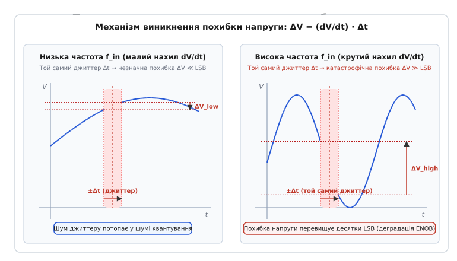
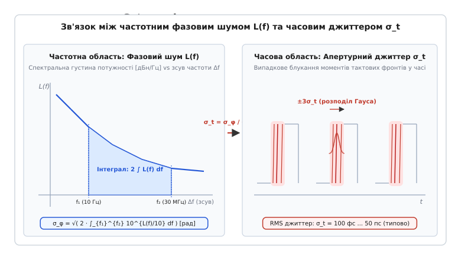
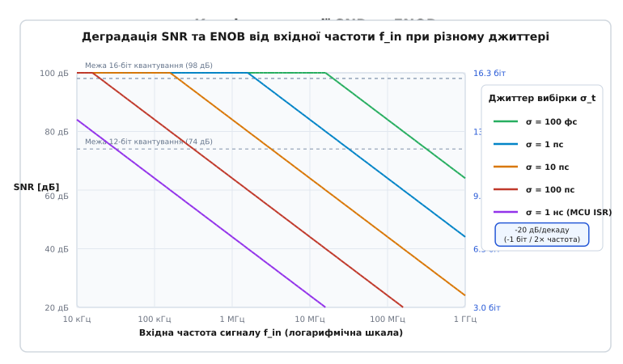
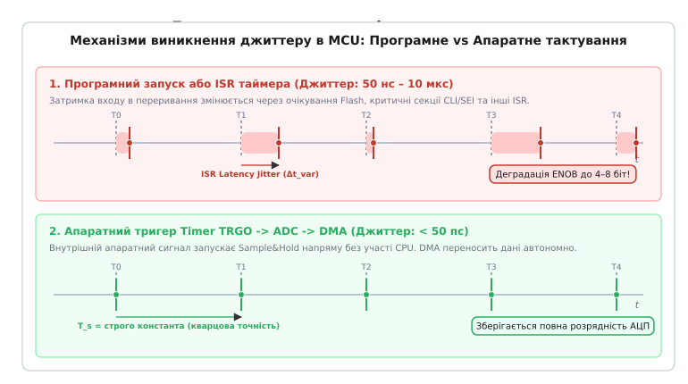
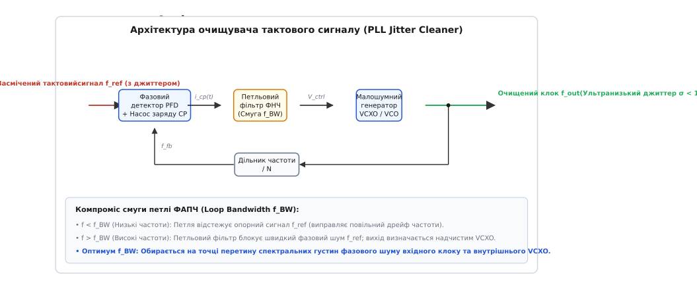

# Джиттер вибірки

<preknowlist>
- [Дискретизація й квантування](book:electronics/sampling-quantization) — перетворення неперервного сигналу в часову сітку відліків і дискретні рівні.
- [ENOB: скільки розрядів АЦП справді працюють](book:electronics/enob) — ефективна розрядність, співвідношення SNR та межі динамічного діапазону.
- [Тепловий шум](book:physics/thermal-noise) — спектральна густина шуму Джонсона-Найквіста та фізичні межі аналогового тракту.
- [Аліасинг та теорема Найквіста](book:communications/nyquist-aliasing) — частота вибірки, смуга Найквіста та спектральні дзеркала.
- [Похибки АЦП](book:electronics/adc-errors) — статичні та динамічні похибки, інтегральна й диференціальна нелінійність (INL/DNL).
</preknowlist>

Коли 16-бітний аналого-цифровий перетворювач із паспортним відношенням сигнал/шум 98 дБ та частотою дискретизації 100 MSPS оцифровує вхідний радіосигнал проміжної частоти 20 МГц, розробник на спектрограмі швидкого перетворення Фур'є несподівано виявляє підняття шумової доріжки до рівня −78 дБ. Замість заявлених 16 розрядів реальний перетворювач забезпечує лише 12.6 біта: старші три з половиною біти повністю знищені шумом. При цьому джерело опорної напруги є прецизійно тихим, вхідний буферний підсилювач має власний коефіцієнт шуму менше 2 дБ, а частотомір фіксує стабільну середню частоту тактування 100.000000 МГц. 

Причина цієї метрологічної деградації криється у часовому вимірі процесу вибірки: випадкове тремтіння фронту тактового сигналу всього на 1 пікосекунду (одна трильйонна частка секунди) на крутому схилі високочастотного сигналу перетворюється на амплітудну похибку напруги, що в рази перевищує крок молодшого значущого розряду (LSB).

Випадкове або псевдовипадкове відхилення реальних моментів фіксації аналогового сигналу від ідеальної періодичної часової сітки називається **джиттером вибірки** (від англійського *jitter* — тремтіння, нервувати; у вітчизняній метрології — фазове тремтіння або часова невизначеність вибірки). У швидкісних системах зв'язку, радіолокації, цифрових осцилографах та програмно керованому радіо (SDR) саме джиттер є головним фізичним бар'єром, що лімітує роздільну здатність перетворення.

## Анатомія вибірки: як невизначеність часу перетворюється на похибку напруги

У класичній теорії дискретизації вважається, що аналого-цифровий перетворювач бере миттєві знімки вхідної напруги `V(t)` через строго однакові інтервали часу `T_s = 1 / f_s`. Якщо аналоговий сигнал змінюється в часі, будь-яка часова похибка моменту замикання вхідного ключа схеми вибірки-зберігання (Sample & Hold) `Δt` неминуче трансформується в похибку виміряної напруги `ΔV`.


*Механізм перетворення часового джиттеру на амплітудну похибку напруги: для низькочастотного сигналу з малим нахилом dV/dt похибка ΔV потопає у шумі квантування; для високочастотного сигналу з крутим фронтом той самий часовий зсув Δt породжує похибку напруги, яка перекриває десятки квантів LSB.*

Зв'язок між часовим зсувом `Δt` та амплітудною похибкою `ΔV` описується першим членом розкладу функції напруги у ряд Тейлора:

```
ΔV ≈ ( dV(t) / dt ) · Δt
```

Ключовим фактором тут є швидкість зміни напруги (похідна сигналу за часом `dV/dt`). Для синусоїдального сигналу `V(t) = V₀ · sin(2π · f_in · t)` похідна дорівнює `2π · f_in · V₀ · cos(2π · f_in · t)`. Максимальна швидкість зміни напруги спостерігається в момент перетину синусоїдою нульового рівня:

```
( dV / dt )_max = 2π · f_in · V₀
```

Підставивши цей вираз у формулу похибки, отримуємо максимальну миттєву амплітудну помилку, викликану часовим відхиленням `Δt`:

```
ΔV_max = 2π · f_in · V₀ · Δt
```

Ця проста формула демонструє фундаментальну властивість процесу вибірки: **похибка напруги лінійно зростає зі збільшенням частоти вхідного сигналу `f_in`**.

Розглянемо числовий приклад. Нехай вхідний сигнал має повний розмах 2.0 В (амплітуда `V₀ = 1.0 В`), а 16-бітний АЦП має крок квантування:

```
LSB = 2.0 В / 2¹⁶ = 2.0 / 65536 ≈ 30.5 мкВ
```

1. **Низька частота сигналу (`f_in = 1 кГц`):**
   Максимальна швидкість наростання становить `(dV/dt)_max = 2π · 1000 · 1.0 ≈ 6283 В/с = 6.28 мкВ/нс`. Якщо тактовий сигнал має джиттер `Δt = 100 пс` (`0.1 нс`), максимальна похибка напруги дорівнює:
   `ΔV = 6.28 мкВ/нс · 0.1 нс ≈ 0.628 мкВ`.
   Оскільки `0.628 мкВ ≪ 30.5 мкВ` (похибка становить лише 0.02 LSB), шум джиттеру є повністю непомітним на тлі квантування.
2. **Висока частота сигналу (`f_in = 70 МГц`, типова проміжна частота радіотракту):**
   Максимальна швидкість наростання зростає в 70 000 разів: `(dV/dt)_max = 2π · 70×10⁶ · 1.0 ≈ 4.40 × 10⁸ В/с = 440 В/мкс = 440 мкВ/пс`. При абсолютно тому самому джиттері `Δt = 100 пс` похибка напруги сягає:
   `ΔV = 440 мкВ/пс · 100 пс = 44 000 мкВ = 44 мВ`.
   Похибка становить `44 мВ / 30.5 мкВ ≈ 1442 LSB`. Перетворювач помиляється на тисячу чотириста дискретних рівнів.

Навіть якщо зменшити джиттер у сто разів — до прецизійних `1 пс`, похибка на частоті 70 МГц становитиме `0.44 мВ` (близько 14.4 LSB), що повністю знищує молодші 4 біти перетворювача. 

Звідси слідує важливий практичний висновок: **вимоги до джиттеру вибірки диктуються не частотою дискретизації `f_s`, а найвищою частотою спектра вхідного сигналу `f_in`**. Навіть якщо АЦП працює на помірній частоті вибірки 1 MSPS, але оцифровує високочастотний піднесучий сигнал методом прямої радіочастотної вибірки (Undersampling / Bandpass Sampling), джиттер тактового генератора повинен бути субпікосекундним.

Детальне математичне виведення дисперсії похибки та інтегральних шумів для довільних форм сигналів наведено у вставці [🧮 Математичне виведення деградації SNR та ENOB від джиттеру вибірки](book:communications/sampling-jitter/math-jitter-snr.md).

## Класифікація часової нестабільності: апертурний джиттер, тактове тремтіння та затримка

У технічній документації на інтегральні мікросхеми та вимірювальні прилади зустрічаються три споріднені часові параметри, які позначають принципово різні фізичні явища.

```
                    ┌─────────────────────────┐
Тактовий перепад    │ Внутрішні буфери та СВЗ │   Фізичне розмикання ключа
───────────────────►│       АЦП (ADC)         ├───────────────────────────►
                    └─────────────────────────┘
◄───────────────── t_a (Апертурна затримка) ──────────────────────────────►
                    [ Постійний зсув: 0.5 – 5 нс ]
                    
                    ◄─── σ_a (Апертурний джиттер) ───►
                    [ Внутрішній розкид: 50 – 300 фс ]
```

### 1. Апертурна затримка (Aperture Delay, t_a)
Апертурна затримка (від латинського *apertura* — отвір, щілина) — це систематичний інтервал часу між моментом проходження фронту тактового імпульсу через поріг перемикання на зовнішньому виводі мікросхеми (Clock Pin) та фізичним моментом розмикання аналогового ключа на конденсаторі схеми вибірки-зберігання (СВЗ). 

Ця затримка обумовлена часом поширення сигналу крізь вхідні тригери Шмітта, інвертори та драйвери керування ключами всередині кристала кремнію. Для сучасних мікросхем `t_a` становить від 0.5 до 5 нс. Апертурна затримка є детермінованою константою: вона не створює випадкового шуму, а лише зсуває весь оцифрований масив у часі на фіксовану величину, що легко калібрується в програмному забезпеченні або компенсаторах затримки.

### 2. Апертурна невизначеність або апертурний джиттер (Aperture Jitter, t_j або σ_a)
Апертурний джиттер — це випадкові відхилення часу розмикання аналогового ключа від вибірки до вибірки відносно тактового фронту на піні перетворювача. Його першопричиною є власний тепловий шум та фліккер-шум транзисторів внутрішнього цифрового тактового буфера АЦП, флуктуації напруги на внутрішніх підкладках та тепловий шум опору ключа `R_on`.

Апертурний джиттер є внутрішньою, непереборною характеристикою кремнієвої топології конкретного АЦП. У прецизійних радіочастотних перетворювачах (наприклад, 16-бітних АЦП прямого оцифрування Texas Instruments чи Analog Devices) апертурний джиттер мінімізують до рівня `50 ... 150 фс` (фемтосекунд, `10⁻¹⁵ с`).

### 3. Джиттер зовнішнього тактового генератора (Clock Jitter, σ_clk)
Джиттер тактового сигналу — це часова нестабільність генератора, який подає опорну частоту на тактовий вхід перетворювача. Він складається з фазового шуму кварцового резонатора або синтезатора частоти (PLL), шумів джерел живлення, паразитних наводок на друкованій платі та шумів буферних мікросхем розподілу тактування (Clock Distribution Trees).

### Сумарний джиттер системи
Оскільки внутрішній апертурний джиттер перетворювача `σ_a` та джиттер зовнішнього тактового джерела `σ_clk` є статистично незалежними випадковими процесами, їхні дисперсії додаються квадратично. Повний середньоквадратичний джиттер системи `σ_total` дорівнює:

```
σ_total = √( σ_a² + σ_clk² )
```

У більшості практичних систем зв'язку саме зовнішній джиттер тактування `σ_clk` є домінуючим: навіть найкращий АЦП з внутрішнім джиттером 60 фс втратить свої характеристики, якщо тактувати його від дешевого тактового генератора мікроконтролера з джиттером 20 пс.

## Спектральний фазовий шум генератора L(f) проти часового джиттеру σ_t

У радіотехніці та телекомунікаціях стабільність генераторів прийнято описувати у двох взаємодоповнюючих областях: часовій (через RMS джиттер `σ_t`) та частотній (через спектральну густину фазового шуму `L(f)`).


*Зв'язок між спектральною густиною фазового шуму L(f) у частотній області та середньоквадратичним часовим джиттером σ_t у часовій області: інтегрування потужності фазового шуму в смузі відстроювань дає повну дисперсію часового розкиду тактових перепадів.*

Реальний тактовий генератор формує коливання з випадковою фазовою модуляцією `φ(t)`:

```
v_clk(t) = A₀ · cos( 2π · f₀ · t + φ(t) )
```

У частотній області фазовий шум `φ(t)` призводить до розмивання ідеальної спектральної дельта-функції несучої частоти `f₀` та появи симетричних шумових "пліч" (бічних смуг). 

**Фазовий шум** `L(f)` визначається як відношення потужності шуму фази в смузі 1 Гц на заданій частоті відстроювання `Δf` від несучої до повної потужності несучого коливання, і вимірюється в децибелах відносно несучої на герц (`дБн/Гц`, або `dBc/Hz`):

```
L(Δf) = 10 · lg[ P_noise(1 Гц на відстані Δf) / P_carrier ]
```

Типовий спектр кварцового генератора має кілька характерних зон:
- `1/f³` (спад 30 дБ/декаду) — фліккер-шум частоти поблизу несучої (`Δf < 100 Гц`);
- `1/f²` (спад 20 дБ/декаду) — білий шум частоти, обумовлений добротністю резонатора (зона Лісона);
- `1/f⁰` (горизонтальна поличка) — широкосмуговий білий фазовий шум вихідних транзисторних буферів генератора (типово від −155 до −170 дБн/Гц на відстроюваннях понад 1 МГц).

Міст між частотним фазовим шумом `L(f)` та часовим джиттером `σ_t` будується шляхом інтегрування спектральної густини потужності фази `S_φ(f) = 2 · 10^{L(f)/10}` у заданій смузі частот від `f₁` до `f₂`:

```
σ_φ = √( 2 · ∫_{f₁}^{f₂} 10^{ L(f) / 10 } df )    [рад]
```

Отримане середньоквадратичне відхилення фази `σ_φ` (у радіанах) переводиться у середньоквадратичний часовий джиттер `σ_t` (у секундах) діленням на кутову швидкість тактового коливання `ω₀ = 2π · f₀`:

```
σ_t = σ_φ / ( 2π · f₀ ) = ( 1 / ( 2π · f₀ ) ) · √( 2 · ∫_{f₁}^{f₂} 10^{ L(f) / 10 } df )
```

Межі інтегрування `[f₁, f₂]` обираються відповідно до фізики приймальної системи:
- Нижня межа `f₁` визначається тривалістю накопичення або часом спостереження алгоритму (наприклад, для кадру вимірювання 100 мс `f₁ = 10 Гц`);
- Верхня межа `f₂` визначається смугою пропускання вхідного тракту тактування АЦП (зазвичай частотою дискретизації `f_s` або подвоєною смугою Найквіста `2 · f_s`).

## Фундаментальна межа SNR_jitter та деградація ефективної розрядності ENOB

Математичне інтегрування похибок вибірки гармонічного сигналу дає строгий вираз для теоретичної верхньої межі відношення сигнал/шум, обумовленої виключно джиттером:

```
SNR_jitter [дБ] = -20 · lg( 2π · f_in · σ_t )
```

У реальній системі повний рівень шуму складається з трьох незалежних факторів:
1. Теоретичного шуму квантування ідеального `N`-бітного перетворювача `SNR_quant = 6.02 · N + 1.76 дБ`;
2. Аналогового теплового шуму тракту та схеми вибірки `SNR_thermal = 10 · lg( P_sig / (k_B · T / C_sample) )`;
3. Шуму джиттеру `SNR_jitter = -20 · lg( 2π · f_in · σ_t )`.

Повний сумарний SNR системи обчислюється як логарифмічна сума потужностей:

```
SNR_total [дБ] = -10 · lg[ 10^{-SNR_quant / 10} + 10^{-SNR_thermal / 10} + 10^{-SNR_jitter / 10} ]
```


*Криві деградації відношення сигнал/шум (SNR) та ефективної кількості розрядів (ENOB) як функція частоти вхідного сигналу при різних значеннях апертурного джиттеру: на низьких частотах точність обмежена шумом квантування (горизонтальні полички), а на високих частотах неминуче спадає з крутизною −20 дБ/декаду (−1 біт на кожне подвоєння частоти).*

Графік залежності чітко розпадається на дві характерні зони:
1. **Зона обмеження квантуванням (Low Frequency Region):**
   Поки частота сигналу низька (`f_in < 1 / (2π · σ_t · 2^N)`), доданок джиттеру мізерно малий. SNR визначається номінальною розрядністю АЦП і графік утворює горизонтальне плато (98 дБ для 16 біт, 74 дБ для 12 біт).
2. **Зона домінування джиттеру (Jitter-Limited Region):**
   При перевищенні критичної частоти шум джиттеру стає більшим за шум квантування. Криві всіх перетворювачів незалежно від їхньої номінальної розрядності зливаються в єдину похилу лінію зі спадом рівно **−20 дБ на декаду частоти** (або −6.02 дБ на октаву).

### Вплив на ефективну розрядність (ENOB)
Оскільки кожен біт роздільності еквівалентний 6.02 дБ динамічного діапазону, ефективна кількість розрядів у зоні домінування джиттеру розраховується як:

```
ENOB = ( SNR_total - 1.76 ) / 6.02 ≈ - log₂( 2π · f_in · σ_t ) - 0.29
```

Кожне подвоєння частоти вхідного сигналу `f_in` або збільшення джиттеру `σ_t` у 2 рази безповоротно **відбирає рівно 1.0 біт ефективної розрядності**.

Таблиця нижче ілюструє максимальну допустиму величину сумарного джиттеру `σ_t` для збереження номінальної розрядності АЦП на різних частотах сигналу:

| Розрядність | SNR (квант.) | f_in = 100 кГц | f_in = 1 МГц | f_in = 10 МГц | f_in = 100 МГц | f_in = 1 ГГц |
|:---:|:---:|:---:|:---:|:---:|:---:|:---:|
| **8 біт** | 50.0 дБ | 5.0 нс | 500 пс | 50 пс | 5.0 пс | 500 фс |
| **10 біт** | 62.0 дБ | 1.25 нс | 125 пс | 12.5 пс | 1.25 пс | 125 фс |
| **12 біт** | 74.0 дБ | 312 пс | 31.2 пс | 3.12 пс | 312 фс | 31.2 фс |
| **14 біт** | 86.0 дБ | 78 пс | 7.8 пс | 780 фс | 78 фс | 7.8 фс |
| **16 біт** | 98.1 дБ | 19.5 пс | 1.95 пс | 195 фс | 19.5 фс | 1.95 фс |

З таблиці очевидно: для оцифрування радіосигналів з частотою 100 МГц із роздільністю 14–16 біт тактова підсистема повинна забезпечувати ультранизький джиттер на рівні десятків фемтосекунд.

## Джерела джиттеру в розподільчих тактових мережах та швидкісних інтерфейсах

У складних багатоканальних вимірювальних комплексах та радіолокаційних фазованих антенних решітках (ФАР) тактовий сигнал повинен розподілятися між десятками або сотнями незалежних АЦП і ЦАП. 

Навіть якщо центральний опорний генератор (OCXO) має зразкову чистоту із джиттером менше 50 фемтосекунд, проходження сигналу крізь тактові дерева вносить додаткову часову деградацію.

### 1. Адитивний джиттер логічних буферів та розгалужувачів (Additive Jitter)
Кожен логічний елемент на шляху тактового сигналу (буфер-розгалужувач Fanout Buffer, перетворювач рівнів LVDS/CML, тригер синхронізатора) має власний широкосмуговий шум напруги `v_n(t)`. При проходженні сигналу через поріг перемикання цей шум перетворюється на адитивний часовий джиттер:

```
σ_t,add = v_n_rms / ( dV_clk / dt )
```

де `dV_clk / dt` — крутизна наростання тактового фронту (Slew Rate). Якщо тактовий сигнал має пологий фронт (наприклад, 0.5 В/нс замість 3 В/нс), адитивний джиттер буфера зростає у 6 разів.

Сумарний джиттер ланцюжка з `M` послідовних буферів зростає як корінь із суми квадратів:

```
σ_tree = √( σ_source² + σ_buf1² + σ_buf2² + ... + σ_bufM² )
```

### 2. Джиттер тактових мереж ПЛІС (FPGA Clock Trees)
Спроба тактувати зовнішній АЦП від внутрішнього генератора або PLL мікросхеми FPGA часто призводить до фатального погіршення `SNR`. Внутрішні глобальні тактові лінії FPGA (BUFG) проходять поруч із мільйонами логічних вентилів, що перемикаються одночасно. 

Імпульсні струми на шинах живлення кристала (шум `L · di/dt` та Ground Bounce) модулюють затримку буферів FPGA, створюючи детермінований періодичний джиттер (DJ) амплітудою від 5 до 50 пікосекунд. Тому у високоточних вимірювальних трактах тактовий сигнал подається безпосередньо від малошумного генератора на АЦП, а вже вихідний тактовий сигнал перетворювача повертається в FPGA як джерело стробування даних.

### 3. Швидкісні послідовні інтерфейси JESD204B/C
Сучасні гігагерцові АЦП використовують послідовний протокол JESD204B/C зі швидкостями передачі до 32 Гбіт/с на лінію. Для забезпечення фіксованої фазової прив'язки (Deterministic Latency) та когерентності масиву антенних каналів система розподіляє високочастотний клок пристрою (Device Clock) та імпульс вирівнювання локального кадру (SYSREF). Часове тремтіння між Device Clock та SYSREF не повинно перевищувати половини періоду тактування, інакше виникає невизначеність фази в один повний такт і розсинхронізація каналів обробки.

## Дзеркальний ефект джиттеру в цифрово-аналогових перетворювачах (ЦАП) та DDS

У цифрово-аналогових перетворювачах (ЦАП) та синтезаторах прямого цифрового синтезу (Direct Digital Synthesis, DDS) джиттер тактового сигналу оновлення вихідного регістру `σ_t` викликає дзеркальний ефект спотворення спектра.

Кожен аналоговий щабель напруги або струму на виході ЦАП повинен утримуватися строго протягом часу `T_s`. Якщо тактовий перепад зазнає часового відхилення `Δt`, тривалість імпульсу змінюється. Похибка площі імпульсу напруги становить `ΔA = ΔV_step · Δt`, де `ΔV_step` — різниця між двома сусідніми відліками синтезованого сигналу.

Ця похибка площі перетворюється на широкосмуговий шум, спектральна густина якого зростає з частотою вихідного радіосигналу `f_out`:

```
SNR_dac,jitter [дБ] = -20 · lg( 2π · f_out · σ_t )
```

У передавачах бездротового зв'язку та радіолокаційних модуляторах джиттер тактування ЦАП проявляється як підняття фазового шуму навколо сформованої радіочастотної несучої та поява паразитних гармонік у сусідніх частотних каналах (погіршення показника ACPR — Adjacent Channel Power Ratio).

## Механізми виникнення джиттеру в мікроконтролерах

У вбудованих системах на базі мікроконтролерів (MCU/DSP) часова нестабільність вибірки найчастіше породжується не фізикою кремнієвого перетворювача, а неправильною архітектурою програмного забезпечення та конфліктами на внутрішніх шинах процесора.


*Порівняння механізмів тактування в мікроконтролері: програмний запуск або обробник переривання страждає від недетермінованої варіації затримки ядра (джиттер від десятків наносекунд до мікросекунд), тоді як внутрішній тригер таймера TRGO забезпечує апаратну точність і перенесення відліків через DMA без участі процесора.*

Виділяють чотири головні джерела джиттеру в мікроконтролерах:

### 1. Програмне опитування (Software Polling Loop)
Найгрубіша помилка початківців — запуск перетворення АЦП у головному циклі програми `while(1)` із програмною затримкою `delayMicroseconds()`. 

Будь-яка системна подія — надходження байта через UART, пакету через SPI чи I2C, оновлення мілісекундного лічильника SysTick або виконання операцій планувальника RTOS — перериває виконання головного циклу. Час між послідовними запусками вибірки хаотично коливається в діапазоні від кількох мікросекунд до десятків мілісекунд. Отриманий масив відліків є принципово непридатним для алгоритмів швидкого перетворення Фур'є (ШПФ) чи цифрової фільтрації (FIR/IIR), оскільки порушується базова передумова рівномірності часової сітки.

### 2. Варіація затримки переривань (Interrupt Latency Jitter)
Другий поширений підхід — запуск АЦП всередині обробника періодичного переривання апаратного таймера:

:::tabs
```c
void TIM2_IRQHandler(void) {
    TIM2->SR &= ~TIM_SR_UIF;       /* Скидання прапорця переривання */
    ADC1->CR2 |= ADC_CR2_SWSTART;  /* Програмний запуск АЦП */
}
```
```cpp
extern "C" void TIM2_IRQHandler() {
    TIM2->SR &= ~TIM_SR_UIF;       // Скидання прапорця переривання
    ADC1->CR2 |= ADC_CR2_SWSTART;  // Програмний запуск АЦП
}
```
:::

Хоча сам апаратний таймер відраховує інтервали часу з точністю до одного такту кварцового генератора, момент виклику інструкції `SWSTART` зазнає значного часового тремтіння (джиттер від 50 до 800 нс). Причини цього недетермінізму:
- **Затримка входу в переривання (Cortex-M Interrupt Latency):** Ядру процесора потрібно від 12 до 29 тактів для збереження регістрів у стек (Stack Pushing). Якщо ядро в цей момент виконує багатотактову інструкцію (ділення `UDIV`, завантаження кількох регістрів `LDMIA`) або очікує завершення транзакції на шині, вхід у переривання затримується;
- **Очікування Flash-пам'яті (Flash Wait States):** При високих тактових частотах процесор зчитує інструкції обробника переривання через кеш Flash (ART Accelerator / I-Cache). При промаху кешу виникає випадкова затримка в 3–6 тактів ядра;
- **Критичні секції:** Якщо в іншій частині програми виконується виклик `__disable_irq()` (або макрос `taskENTER_CRITICAL()` у FreeRTOS), переривання таймера блокується до моменту відновлення дозволу переривань.

### 3. Конфлікти арбітражу на матриці шин (Bus Matrix Contention)
Сучасні мікроконтролери використовують багатошарові матриці шин (Multi-Layer AHB Matrix). Якщо ядро процесора, графічний прискорювач (DMA2D) та мережевий контролер Ethernet одночасно звертаються до того самого банку пам'яті SRAM, куди контролер DMA переносить відліки АЦП, арбітр шини встановлює чергу доступу. Затримка зчитування регістра `ADC_DR` призводить до внутрішнього переповнення буфера АЦП (ADC Overrun) або десинхронізації потоку даних.

### 4. Фазовий джиттер каналів ШІМ (PWM Switching Jitter)
У системах керування перетворювачами потужності та сервоприводами вимірювання струму повинно відбуватися суворо в момент, коли силове плече інвертора увімкнене, але перехідні процеси комутації вже затухли. Якщо таймер ШІМ не синхронізований апаратно з тригером АЦП, випадкове зміщення вибірки призводить до попадання на фронт перемикання силового MOSFET (зі швидкістю наростання `dV/dt > 10 В/нс`), що викликає колосальні викиди у виміряних даних.

## Апаратне тактування перетворювачів: Timer-Triggered ADC та DMA

Єдиним надійним інженерним рішенням, що усуває всі програмні джерела джиттеру в мікроконтролерах, є побудова повністю автономного апаратного конвеєра:

```
┌─────────────────┐       TRGO (Update)       ┌─────────────────┐       DMA Request       ┌─────────────────┐
│ Апаратний таймер├──────────────────────────►│       АЦП       ├────────────────────────►│  Контролер DMA  │
│  (TIM2 / TIM1)  │ (Кремнієва лінія без CPU) │   (ADC1 / ADC2) │ (Автономне перенесення) │ (Circular Buffer│
└─────────────────┘                           └─────────────────┘                         └────────┬────────┘
                                                                                                   │
                                              ┌────────────────────────────────────────────────────▼────────┐
                                              │      Оперативна пам'ять SRAM (Подвійний буфер відліків)     │
                                              │  [ Перша половина: Обробка ] [ Друга половина: Запис DMA ]  │
                                              └─────────────────────────────────────────────────────────────┘
```

1. **Апаратний тригер таймера (Timer Trigger Output, TRGO):**
   Таймер налаштовується в режим генератора бази часу. Подія переповнення лічильника (Update Event) комутується безпосередньо на внутрішню апаратну шину `TRGO`. 
2. **Апаратний запуск АЦП (Hardware External Trigger):**
   АЦП переводиться в режим очікування зовнішнього запуску по висхідному фронту від лінії `TIMx_TRGO`. Сигнал тактування надходить безпосередньо у внутрішній логічний автомат АЦП через кремнієві зв'язки кристала, повністю оминаючи конвеєр інструкцій процесора. Джиттер моменту вибірки падає до рівня внутрішнього апертурного джиттеру АЦП (`< 50 пс`).
3. **Кільцевий буфер прямого доступу до пам'яті (Circular DMA with Double Buffering):**
   Після завершення кожного перетворення АЦП генерує апаратний запит DMA. Контролер прямого доступу автономно переносить оцифроване 16-бітне слово в масив оперативної пам'яті. Використання подвійного буфера з перериваннями Half-Transfer (заповнено 50%) та Full-Transfer (заповнено 100%) дозволяє процесору пакетно обробляти один блок відліків (наприклад, виконувати ШПФ), поки DMA у фоні наповнює інший.

Повний вихідний код реалізації конвеєра для платформ STM32 (HAL/LL), ESP32 (ESP-IDF) та Arduino, а також ідіоматичні C++ RAII-обгортки та методики верифікації наведено у вставці [⚙️ Апаратне тактування АЦП через тригери таймера та DMA без участі процесора](book:communications/sampling-jitter/proj-timer-triggered-adc.md).

## Придушення джиттеру: фазове автопідстроювання частоти (PLL) та відновлення синхросигналу

У системах зв'язку тактовий сигнал часто надходить від зашумлених ліній зв'язку, оптичних трансиверів або відновлюється з вхідного потоку даних (Clock and Data Recovery, CDR). Для очищення тактового сигналу від високочастотного джиттеру використовують спеціалізовані мікросхеми — **очищувачі тактування (Jitter Cleaners / Jitter Attenuators)** на основі петель фазового автопідстроювання частоти (PLL / ФАПЧ).


*Архітектура очищувача тактового сигналу на базі петлі ФАПЧ (PLL Jitter Cleaner): фазочастотний детектор і петльовий фільтр низьких частот діють як фільтр низьких частот для фазового шуму вхідного тактового сигналу, замінюючи високочастотний джиттер надчистим спектром керованого кварцового генератора VCXO.*

### Фізичний механізм фільтрації джиттеру петлею ФАПЧ
Петля ФАПЧ складається з фазочастотного детектора (PFD), насоса заряду (Charge Pump), аналогового петльового фільтра низьких частот (Loop Filter) зі смугою пропускання `f_BW`, малошумного генератора, керованого напругою (VCXO / VCO), та дільника зворотного зв'язку `/N`.

Передатна функція замкненої петлі ФАПЧ по відношенню до вхідного фазового шуму має характер **фільтра низьких частот**:

```
H_in(s) = [ 2ζ · ω_n · s + ω_n² ] / [ s² + 2ζ · ω_n · s + ω_n² ]
```

де `ω_n = 2π · f_BW` — власна частота петлі, а `ζ` — коефіцієнт демпфування.

Передатна функція по відношенню до власного шуму внутрішнього генератора VCXO має характер **фільтра високих частот**:

```
H_vcxo(s) = s² / [ s² + 2ζ · ω_n · s + ω_n² ]
```

Ця дуальна природа створює унікальний ефект очищення:
- **Низькі частоти відстроювання (`f < f_BW`):** Петля повністю відстежує вхідний опорний сигнал `f_ref`. Це виправляє повільний температурний дрейф та довгострокову нестабільність частоти генератора VCXO;
- **Високі частоти відстроювання (`f > f_BW`):** Петльовий фільтр повністю пригнічує швидкий фазовий шум та широкосмуговий джиттер вхідного сигналу `f_ref`. Вихідний тактовий сигнал на цих частотах визначається виключно спектральною чистотою генератора VCXO.

Для ефективного придушення джиттеру смугу петлі `f_BW` роблять ультразвузькою (від 10 Гц до 1 кГц). При цьому високочастотний вхідний джиттер тривалістю сотні пікосекунд на виході зменшується до рівня менше `100 фс`.

### Відновлення синхросигналу з даних (Clock and Data Recovery, CDR)
У швидкісних послідовних інтерфейсах (Gigabit Ethernet, PCIe, USB3, SerDes) окрема лінія тактування відсутня: тактова інформація закладена безпосередньо у фронти інформаційних бітів. 

Вузол CDR виділяє тактову частоту за допомогою нелінійних фазових детекторів Александера (Alexander Phase Detector / Bang-Bang Phase Detector). Оскільки інформаційні переходи містять детермінований джиттер міжсимвольної інтерференції (Inter-Symbol Interference, ISI), петля CDR повинна мати оптимальний компроміс: відстежувати низькочастотне блукання фази (Wander) та одночасно фільтрувати високочастотний джиттер для забезпечення мінімального рівня бітових помилок (`BER < 10^{-12}`).

> 🔧 **Навіщо це в реальній розробці:**
> 1. **Вибір тактового джерела:** Якщо смуга оцифровуваного сигналу перевищує 5 МГц, відмовтеся від тактування АЦП від загального виходу мікроконтролера. Використовуйте спеціалізовані малошумні кварцові генератори (XO/TCXO) з паспортизованим RMS джиттером `< 0.5 пс` у смузі 12 кГц – 20 МГц.
> 2. **Заборона програмних тригерів:** Ніколи не запускайте АЦП у циклах опитування чи всередині переривань таймера, якщо над даними планується виконання ШПФ або спектрального аналізу. Завжди використовуйте апаратний сигнал `TIM_TRGO` у зв'язці з кільцевим `DMA`.
> 3. **Трасування друкованої плати:** Тактову лінію АЦП трасуйте як екрановану смужку мінімальної довжини над суцільним шаром аналогової землі, подалі від імпульсних стабілізаторів напруги (DC-DC) та швидкісних шин пам'яті.
> 4. **Крутизна фронтів тактування:** Перетворювачі вимагають крутих фронтів тактового сигналу (`Slew Rate > 1 В/нс`). Пологий синусоїдальний сигнал перетворює внутрішній шум напруги вхідного компаратора на додатковий апертурний джиттер.
