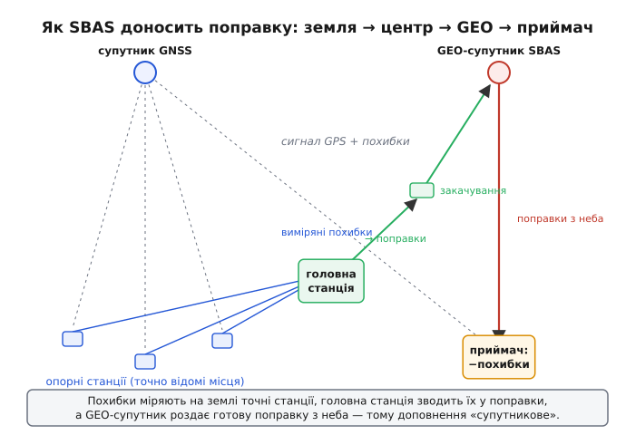
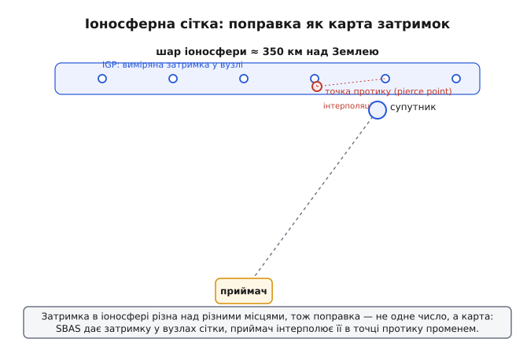
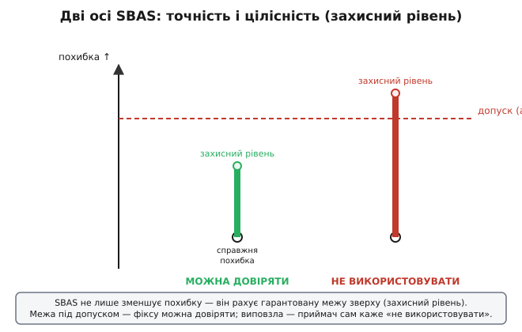

# Супутникові системи доповнення (SBAS)

Звичайний [супутниковий приймач](book:communications/gnss) чесно робить свою роботу — і все одно бреше на кілька метрів. Не через поганий чип: сам сигнал приходить уже зіпсутим. Поки він летів крізь атмосферу, іоносфера й тропосфера трохи його загальмували, тож виміряна відстань до супутника вийшла завеликою; орбіта супутника відома не ідеально; його власний годинник дрейфує на дрібку. Кожна така похибка додає до координати свій шматочок, і разом вони й дають ту звичну неточність у метри.

Тепер поставмо просте питання, з якого й народжується вся ідея. Ці похибки — випадковий шум, який щомиті інший для кожного? Чи щось, що можна **виміряти й відняти**? Виявляється, майже все в цьому переліку — друге. Затримка в іоносфері над якимось містом цієї хвилини цілком конкретна; похибка орбіти супутника цієї хвилини теж конкретна. І — головне — вона майже однакова для всіх приймачів, що стоять поблизу й дивляться на той самий супутник. А коли похибку можна виміряти й вона спільна для сусідів, то напрошується хід: нехай хтось із **точно відомим місцем** її виміряє й **роздасть поправку** всім навколо. Саме це й робить **SBAS** (*Satellite-Based Augmentation System* — супутникова система доповнення).

## Диференційна ідея: виміряти похибку там, де відповідь відома

Уся хитрість тримається на одному спостереженні. Постав приймач на точці, координати якої ти знаєш **наперед** до сантиметра — на бетонному стовпі геодезичної станції. Такий приймач теж отримує сигнали з тими самими похибками й теж обчислює свою позицію — але він **знає правильну відповідь**. Отже, він може порівняти обчислене з істинним і сказати точно: «до цього супутника моя виміряна дальність зараз завелика на 1.7 метра». Це і є **поправка** — не здогад, а виміряна різниця між тим, що вийшло, і тим, що мало вийти.

Тепер ключове припущення, на якому все й тримається: похибки **просторово корельовані**. Іоносфера над двома точками за сотню кілометрів одна від одної приблизно однакова; орбіта супутника — та сама для всіх, хто його бачить. Тож поправка, виміряна на відомій точці, годиться і для сусіднього приймача, який своєї істинної позиції **не знає**. Він бере чужу поправку й віднімає — і його дальність теж стає ближчою до правди. Такий підхід — виміряти похибку там, де відповідь відома, і застосувати там, де ні, — називають **диференційним** (від латини *differentia* — різниця): передають не саму позицію, а різницю, поправку.

Отут і криється відмінність SBAS від точного [RTK](book:communications/gnss). RTK ставить базу поряд — за кілометри — і міряє фазу несучої, тому дає сантиметри, але лише в невеликому радіусі й лише з близькою базою. SBAS натомість грає в іншу гру — **широкозонну**. Він не має бази поряд у кожного; він накриває поправками цілий континент. А щоб поправка з мережі станцій дійшла до будь-якого приймача під відкритим небом без жодного наземного зв'язку, її треба роздати звідти, звідки видно всіх одразу — **з супутника**.

> 🔧 **Навіщо це.** Коли в описі GNSS-модуля бачиш «SBAS» поряд із «DGPS» — це той самий диференційний корінь: хтось із відомим місцем виміряв похибку й поділився. Різниця в доставці: класичний DGPS шле поправку наземним радіо на обмежену округу, а SBAS — з геостаціонарного супутника на цілий регіон, тож приймачу не треба нічого, крім неба над головою.

## Чому саме з супутника — і саме геостаціонарного

Мережа наземних станцій виміряла похибки. Як донести їх до мільйонів приймачів, розкиданих по континенту, — від літака над океаном до трактора в полі? Проводом не дотягнешся, звичайним радіо накриєш хіба район. Потрібне джерело, яке **видно звідусіль на величезній площі одночасно** й **весь час з того самого напрямку**. Це геостаціонарний супутник (*geostationary* — той, що стоїть нерухомо щодо Землі): він висить на висоті близько 36 000 км над екватором і обертається синхронно з планетою, тож із землі здається прибитим до однієї точки неба. Один такий супутник накриває променем цілу півкулю.

Ланцюг виходить такий. Мережа **опорних станцій** (їх ще звуть моніторинговими) на точно відомих місцях безперервно ловить ті самі супутники, що й усі, і міряє їхні похибки. Виміри стікаються до **головної станції** — це мозок системи: вона відсіює шум окремих станцій, зводить усе докупи й обчислює поправки — окремо на годинник і орбіту кожного супутника, окремо на затримку в іоносфері — плюс дані про надійність. Готові поправки йдуть на **станцію закачування**, звідти вгору на геостаціонарний супутник, а той **транслює їх униз** на всю зону.


*Як SBAS доносить поправку. Похибки міряють на землі точні опорні станції; головна станція зводить їх у поправки; геостаціонарний супутник роздає готову поправку з неба — тому доповнення й зветься «супутниковим».*

Є ще один приємний бонус. Той самий геостаціонарний супутник транслює свій сигнал на **тій самій частоті L1** (1575.42 МГц), що й GPS, і **тим самим способом** — модульованим псевдовипадковим кодом (*PRN*, *pseudo-random noise*), як у справжніх навігаційних супутників. А раз так — приймач може виміряти дальність і **до нього самого**, використавши SBAS-супутник як ще одне джерело в трилатерації. Тобто SBAS-супутник грає одразу дві ролі: несе поправки й сам є додатковим «маяком».

## Іоносферна поправка — не число, а карта

З годинником і орбітою супутника все просто: похибка супутника — одна на всіх, хто його бачить, тож і поправка одна. А от [затримка в іоносфері](book:communications/gnss) — інша річ, і саме вона найбільша й найпідступніша. Іоносфера — це шар зарядженого газу високо вгорі, і гальмує вона сигнал по-різному над різними місцями: над екватором дужче, над полюсом слабше, удень інакше, ніж уночі, а в бурю на Сонці — стрибками. Одне число тут не рятує: поправка, слушна над Мадридом, буде хибною над Стокгольмом.

Тому SBAS передає іоносферну поправку **картою**. Над Землею на висоті близько 350 км — там, де іоносфера гальмує сигнал найсильніше, — подумки натягнуто сітку вузлів (**IGP**, *ionospheric grid points* — вузли іоносферної сітки). Для кожного вузла головна станція обчислює вертикальну затримку й транслює її. Приймач же дивиться, **де його промінь до супутника протикає той шар на висоті 350 км** — цю точку звуть точкою протику (*ionospheric pierce point*), — знаходить чотири найближчі вузли сітки й **інтерполює** затримку між ними. Так кожен промінь до кожного супутника дістає власну, місцеву поправку.


*Іоносферна поправка як карта. Затримка різна над різними місцями, тож SBAS дає її у вузлах сітки на висоті 350 км; приймач бере точку, де його промінь протикає шар, і інтерполює затримку із сусідніх вузлів.*

> 🔧 **Навіщо це.** Ось чому SBAS діє **регіонально**, а не глобально: сітка вузлів існує лише над зоною своїх наземних станцій. Виїхав приймач за край зони — іоносферні поправки закінчуються, і точність опадає до звичайної. Тому WAAS не допомагає над Європою, а EGNOS — над Америкою: кожна карта накриває лише свою землю.

## Головне — не точність, а цілісність

Тут криється найглибша ідея SBAS, і її часто проминають. Здавалося б, уся справа в точності: похибку зменшили з метрів до близько метра — і добре. Але SBAS народжувався не для того, щоб трактор їздив рівніше, а щоб **літак сідав за сигналом**, коли смуги не видно. А для життя одної лише точності **мало**. Уяви: приймач показує гарну точну координату — і раптом на секунду збрехав на десятки метрів, а пілот про це не знає. У полі це дрібниця, на посадці — катастрофа.

Тому SBAS дає другу річ, важливішу за саму точність, — **цілісність** (*integrity* — доброчесність, надійність): чесну гарантію, наскільки координаті **можна довіряти прямо зараз**, і обіцянку **швидко попередити**, якщо довіряти більше не можна. Працює це через **захисний рівень** (*protection level*): разом з поправками SBAS дає приймачу дані, з яких той обчислює гарантовану **межу зверху** для власної похибки. Не «скоріш за все похибка мала», а «похибка майже напевно **не більша** за оцю межу». Далі приймач порівнює цю межу з **допуском** (*alert limit*) — найбільшою похибкою, ще припустимою для поточної задачі. Межа під допуском — фіксу можна довіряти. Виповзла над допуск — приймач сам оголошує «**не використовувати**». І робить це швидко: за нормами для авіації від появи небезпеки до попередження має минути не більше **6 секунд** (*time to alert* — час до тривоги).


*Точність і цілісність — різні речі. SBAS не лише зменшує похибку, а й рахує гарантовану межу зверху (захисний рівень). Поки та межа під допуском — координаті можна вірити; виповзла — приймач сам каже «не використовувати».*

Ось цей самий тест «межа проти допуску» так, як його робив би код у приймачі:

**Приймач отримав горизонтальний захисний рівень 12.4 м; чи можна довіряти фіксу для заходу на посадку з допуском 40 м?**

:::tabs
```cpp
// Захисний рівень (HPL) приймач обчислює з даних цілісності SBAS —
// це гарантована верхня межа горизонтальної похибки, у метрах.
// Допуск (HAL) задає поточна задача: для цього заходу — 40 м.
struct Integrity { double hpl_m; double hal_m; };

bool position_trustworthy(const Integrity& ig) {
    return ig.hpl_m <= ig.hal_m;   // межа під допуском → довіряти можна
}

Integrity ig{ .hpl_m = 12.4, .hal_m = 40.0 };
bool ok = position_trustworthy(ig);   // 12.4 ≤ 40.0 → true: використовувати

// Якби похмура іоносфера роздула межу:
ig.hpl_m = 47.0;
ok = position_trustworthy(ig);        // 47.0 ≤ 40.0 → false: НЕ використовувати
```
```python
from dataclasses import dataclass

# Захисний рівень (HPL) приймач обчислює з даних цілісності SBAS —
# це гарантована верхня межа горизонтальної похибки, у метрах.
# Допуск (HAL) задає поточна задача: для цього заходу — 40 м.
@dataclass
class Integrity:
    hpl_m: float
    hal_m: float

def position_trustworthy(ig: Integrity) -> bool:
    return ig.hpl_m <= ig.hal_m   # межа під допуском → довіряти можна

ig = Integrity(hpl_m=12.4, hal_m=40.0)
ok = position_trustworthy(ig)     # 12.4 ≤ 40.0 → True: використовувати

# Якби похмура іоносфера роздула межу:
ig.hpl_m = 47.0
ok = position_trustworthy(ig)     # 47.0 ≤ 40.0 → False: НЕ використовувати
```
:::

Зверни увагу: рішення тут — не про саму координату, а про **довіру** до неї. Приймач може мати гарний фікс і все одно оголосити «не використовувати», якщо не може **гарантувати** межу під допуском. Саме ця здатність вчасно сказати «мені зараз не вір» і робить SBAS придатним там, де ціна помилки — життя.

> 🔧 **Навіщо це.** Для дрона чи трактора з цілісності беруть простіше, але не менш корисне: коли захисний рівень раптом підскочив, розумна система розуміє, що фіксу віри мало **саме зараз** (буря в іоносфері, погана геометрія), і не кидається виконувати точний маневр наосліп. Це чесний сигнал «обережно», якого сирий GNSS не дає взагалі.

## Що це дає приймачу на практиці

Складімо все докупи. Приймач, який уміє SBAS, ловить із геостаціонарного супутника потік поправок і, застосувавши їх, дістає **точність близько метра** — WAAS у Північній Америці дає порядку одного-двох метрів по горизонталі, EGNOS над Європою — метрового рівня, кожен у своїй зоні. Це втричі-вчетверо краще за сирий GNSS — і без жодного наземного обладнання, самим лише приймачем, що вміє слухати SBAS. Плюс той самий супутник додається як ще один «маяк» для трилатерації, а разом з поправками приходить і цілісність — гарантія довіри до координати.

Ціна за це майже нульова: не треба ні базової станції, як для RTK, ні зв'язку з інтернетом, ні абонплати. Тому SBAS увімкнено чи не в кожному сучасному GNSS-приймачі — від автомобільного навігатора до чипа в телефоні. Обмежень теж два, і про них варто пам'ятати. По-перше, **регіональність**: поза зоною наземних станцій поправки закінчуються, і в глибині океану чи над чужим континентом SBAS не працює. По-друге, геостаціонарні супутники висять **над екватором**, тож у високих широтах вони низько над обрієм — і в місті між висотками чи в горах промінь до них легко перекривається будівлею або схилом. Тоді потік поправок уривається, і приймач тихо відкочується до звичайної точності.

І остання пастка, спільна з будь-яким GNSS. Поправки SBAS ловлять помилки атмосфери й орбіт — ті, що спільні для сусідів. Але вони **безсилі** проти похибок, що народжуються **в самому приймачі**: [багатопроменевості](book:communications/multipath-fading), коли сигнал приходить, відбившись від стіни чи корпусу, і власного шуму антени. Ці похибки в кожного свої, наземна станція за сотню кілометрів їх не бачить і поправити не може. Тому в місті серед відбиттів навіть з увімкненим SBAS точність буває кепською — не через SBAS, а попри нього.

## Хто творить це сузір'я

SBAS — не одна система, а сімейство регіональних, збудованих за спільним стандартом (норми ICAO для авіації, а їхнє інженерне втілення для приймача — стандарт [RTCA DO-229](book:communications/sbas-corrections/hist-sbas-origins.md)), тож приймач розуміє їх усі однаково:

- **WAAS** (*Wide Area Augmentation System*) — система США, введена в експлуатацію **2003 року**; перша у світі SBAS, що дала літакам вертикальне ведення на заході на посадку.
- **EGNOS** (*European Geostationary Navigation Overlay Service*) — система Європейського Союзу; відкриту службу для всіх запущено **1 жовтня 2009 року**, а службу для авіації («безпека життя») — **2 березня 2011 року**.
- **GAGAN** — система Індії; сертифікована для заходу з вертикальним веденням **21 квітня 2015 року**, ставши третьою такою у світі.
- **MSAS** — система Японії, у роботі приблизно з **2007 року**.
- Пізніші додалися **SDCM** (Російська держава), **KASS** (Південна Корея) та **BDSBAS** (Китай) — кожна накриває свій регіон.

Сучасний приймач нерідко бачить супутники **кількох** із цих систем одразу; він бере поправки тієї, у чиїй зоні перебуває, а іноді комбінує дані з кількох. Приймачу байдуже, чий супутник роздає поправку, — усі говорять однією стандартною мовою.

## Підсумок

SBAS виростає з простого спостереження: більшість похибок GNSS — не випадковий шум, а величина, яку можна **виміряти й відняти**, бо вона спільна для сусідніх приймачів. Приймач на точно відомій точці міряє цю похибку — різницю між обчисленим і істинним — і роздає її як **диференційну поправку**. Щоб поправка дійшла до цілого континенту без наземного зв'язку, її транслюють з **геостаціонарного** супутника, який видно звідусіль і який заодно служить додатковим маяком. Найбільшу похибку — іоносферну — передають не числом, а **картою** вузлів на висоті 350 км, і приймач інтерполює її в точці, де його промінь протикає шар. Та серце SBAS — не точність (хоч вона й підходить до метра), а **цілісність**: гарантована межа зверху для похибки й обіцянка за секунди попередити, коли координаті довіряти не можна, — те, без чого літак не сів би за сигналом. Плата за все це — лише приймач, що вміє слухати SBAS; обмеження — регіональність, низькі над обрієм екваторіальні супутники й безсилість проти власних похибок приймача, як-от відбиттів. Родина цих систем — WAAS, EGNOS, GAGAN, MSAS та молодші — накриває свої частини світу за спільним стандартом, тож один приймач розуміє їх усі.
