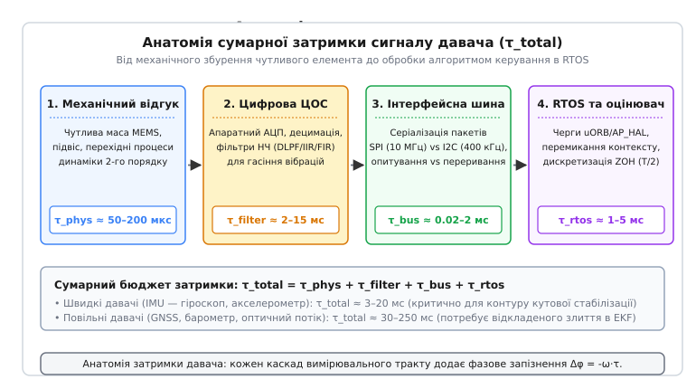
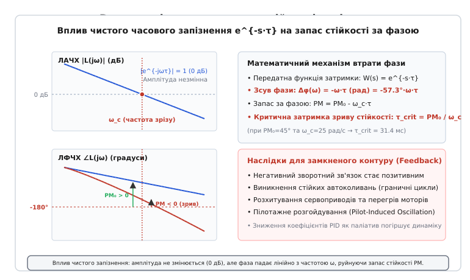
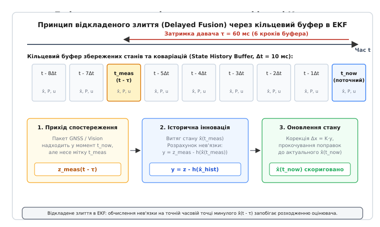

# Затримка давача

<preknowlist>
- [Супутникова навігація (GNSS)](topic:communications/gnss) — принципи вимірювання псевдодальностей та затримки поширення радіосигналів.
- [Час вимірювання](topic:communications/measurement-time) — когерентне й некогерентне накопичення енергії та фазові співвідношення.
- [Мітки точного часу](topic:communications/timestamps) — апаратні мітки часу та синхронізація годинників у розподілених мережах.
- [Шина SPI](topic:communications/spi-bus) — синхронний послідовний інтерфейс високої швидкості та організація транзакцій.
- [Шина I2C](topic:communications/i2c-bus) — адресація, тактування та арбітраж на спільній шині з відкритим стоком.
</preknowlist>

Коли польотний контролер швидкісного квадрокоптера або автопілот крилатої ракети виконує кутову стабілізацію в контурі зворотного зв'язку на частоті 1 кГц, запізнення даних гіроскопа всього на 15–20 мілісекунд призводить до катастрофічних наслідків. При кутовій швидкості обертання 300 град/с затримка у 20 мс означає, що обчислювач формує керівний момент для орієнтації, в якій апарат перебував 6 градусів тому. У частотній області чисте часове запізнення вносить фазовий зсув `Δφ = -ω·τ`, який на частоті зрізу контуру 10 Гц з'їдає понад 72 градуси запасу стійкості за фазою. Запас фази падає нижче нуля, негативний зворотний зв'язок перетворюється на позитивний, і замість демпфування збурень система входить у режим високочастотного розгойдування, що призводить до руйнування механіки та перегріву моторів.

Усі реальні вимірювальні пристрої володіють скінченним часом реакції. Інтервал між моментом, коли фізична величина зазнала зміни в навколишньому просторі, і моментом, коли відповідне числове значення стало доступним для алгоритму керування в оперативній пам'яті процесора, називається **затримкою давача** (*sensor latency*, від латинського *latens* — прихований). У системах зв'язку, радіолокації та автоматичного керування затримка давача є критичним параметром, що обмежує граничну швидкодію та динамічну стійкість замкнених контурів.

## Анатомія затримки давача: чотири каскади вимірювального тракту

Повна затримка вимірювання `τ_total` не є монолітною величиною: вона формується послідовним проходженням сигналу крізь чотири фізично різні рівні апаратно-програмного тракту.


*Анатомія затримки давача: кожен каскад вимірювального тракту додає фазове запізнення Δφ = -ω·τ.*

### 1. Механічний та фізичний відгук чутливого елемента (τ_phys)

Перший каскад визначається внутрішньою фізикою первинного перетворювача. У мікроелектромеханічних системах (MEMS — *Micro-Electro-Mechanical Systems*, грецьке *techne* — майстерність) чутливим елементом є рухома кремнієва інерційна маса (*proof mass*), закріплена на пружних мікропідвісах.

Динаміка зміщення чутливої маси `x(t)` під дією зовнішнього прискорення `a(t)` описується диференціальним рівнянням вимушених коливань другого порядку:

```
m · ẍ(t) + c · ẋ(t) + k · x(t) = m · a(t)
```

де `m` — маса чутливого кремнієвого тіла (порядку мікрограмів), `c` — коефіцієнт демпфування газом у герметичній камері мікросхеми, а `k` — жорсткість кремнієвих торсіонів.

Власна резонансна частота механічного підвісу становить:

```
ω₀ = √(k / m)
```

Для акселерометрів `ω₀` лежить у діапазоні 2–10 кГц, а для вібраційних гіроскопів (де маса змушена коливатися на опорній частоті) — 20–35 кГц. Перехідний процес механічного встановлення чутливого елемента після східчастого прикладання сили описується постійною часу затухання `T_phys = 2·m / c` і становить від 50 до 200 мікросекунд. Хоча цей час є найменшим у загальному балансі, він встановлює фізичну нижню межу затримки, нижче якої сенсор принципово не здатний відреагувати на зовнішній вплив.

### 2. Групова затримка вбудованої цифрової обробки сигналів (τ_filter)

Отриманий механічний рух перетворюється на зміну електричної ємності гребінчастих конденсаторів (*comb-drive*), після чого оцифровується вбудованим аналого-цифровим перетворювачем (АЦП, зазвичай Delta-Sigma або SAR на частотах 8–32 кГц). Для придушення широкосмугового теплового шуму та запобігання ефекту накладання спектрів (аліасингу від вібрацій моторів і пропелерів) сигнал пропускається крізь цифровий фільтр низьких частот (DLPF — *Digital Low-Pass Filter*).

Цифрова фільтрація вносить **групову затримку** (*group delay*) `τ_g`, яка визначається крутизною фазо-частотної характеристики фільтра:

```
τ_g(ω) = - dφ(ω) / dω
```

У сучасних сенсорних чипах застосовують два типи архітектури фільтрів:

1. **Фільтри з нескінченною імпульсною характеристикою (IIR / Biquad):** Реалізуються як каскад біквадратних ланок другого порядку (часто апроксимація Баттерворта). Вони вимагають мінімальної кількості множень в ASIC, але мають нелінійну фазову характеристику. На низьких частотах групова затримка баттервортівського фільтра другого порядку з частотою зрізу `f_c` наближено дорівнює:

```
τ_g,IIR ≈ √2 / (2π · f_c) ≈ 0.225 / f_c
```

Якщо частоту зрізу DLPF для гасіння сильних механічних вібрацій встановлено на `f_c = 20 Гц`, внутрішня затримка лише цього фільтра сягає:

```
τ_g = 0.225 / 20 = 0.01125 с = 11.25 мс
```

2. **Фільтри зі скінченною імпульсною характеристикою (FIR):** Мають строго лінійну фазову характеристику, що забезпечує абсолютно постійну групову затримку на всіх частотах смуги пропускання. Для симетричного FIR-фільтра довжиною `N` відліків, що працює на частоті квантування `f_s`:

```
τ_g,FIR = (N - 1) / (2 · f_s)
```

При довжині фільтра `N = 65` відліків та внутрішній частоті дискретизації `f_s = 8 кГц` затримка становить `(64) / (2 · 8000) = 4.0 мс`.

### 3. Затримка передачі інтерфейсною шиною (τ_bus)

Оцифровані та відфільтровані відліки зберігаються у внутрішніх регістрах або FIFO-буфері давача. Для передачі цих даних до центрального мікроконтролера використовується послідовна шина (SPI або I2C).

Час фізичної серіалізації пакета даних залежить від тактової частоти шини та протокольних накладних витрат:

```
τ_serial = N_bits / f_clk
```

Порівняємо зчитування стандартного пакета інерціальних даних (14 байтів: 6 байтів гіроскопа, 6 байтів акселерометра, 2 байти температури):
- **Шина I2C (Standard Mode 100 кГц):** Передача адреси пристрою, адреси початкового регістра, бітів повторного старту та 14 байтів даних із бітами ACK/NACK вимагає передачі близько 160 бітових інтервалів. Час транзакції становить `160 / 100000 = 1.60 мс`.
- **Шина I2C (Fast Mode 400 кГц):** Час транзакції зменшується до `160 / 400000 = 400 мкс`.
- **Шина SPI (10 МГц):** Передача байта команди та зчитування 14 байтів даних повнодуплексним апаратним каналом займає `(1 + 14) · 8 / 10000000 = 12 мкс`.

Окрім часу передачі, критичну роль відіграє режим опитування:
- **Періодичне опитування (Polling):** Якщо мікроконтролер опитує сенсор за таймером без прив'язки до внутрішнього такту АЦП, виникає випадкове фазове запізнення між моментом готовності відліку та початком читання шини. У середньому воно дорівнює половині періоду опитування `T_poll / 2` (для опитування на 500 Гц це додає додаткові 1.0 мс затримки та створює сильний фазовий джитер).
- **Апаратне переривання готовності (Data Ready, DRDY):** Сенсор піднімає логічний рівень на спеціальному виводі переривання `INT/DRDY` точно в момент оновлення вихідного регістра. Використання DRDY у парі з прямим доступом до пам'яті (DMA) скорочує час очікування до лічених мікросекунд.

### 4. Буферизація, планування та дискретизація в RTOS (τ_rtos)

Останній каскад виникає всередині операційної системи реального часу (RTOS — FreeRTOS, NuttX, Zephyr):
1. **Затримка обробки переривання (Interrupt Latency):** Час від спрацювання лінії DRDY до входу в обробник переривання (ISR) та перемикання контексту на відповідний потік-драйвер (зазвичай 3–15 мкс на ядрах ARM Cortex-M4/M7).
2. **Маршрутизація через черги повідомлень (Message Passing Latency):** У модульних архітектурах польотних стеків (наприклад, шина публікацій-підписок uORB у PX4) дані копіюються в кільцеві черги, де очікують виклику навігаційного потоку. Затримка диспетчеризації залежить від пріоритетів і завантаженості процесора й становить 0.5–3.0 мс.
3. **Екстраполятор нульового порядку (Zero-Order Hold, ZOH):** Оскільки цифровий регулятор обчислює керівний сигнал дискретно з періодом `T_loop`, утримання сигналу протягом такту вносить еквівалентне фазове запізнення:

```
τ_zoh = T_loop / 2
```

Для контуру керування з частотою 400 Гц (`T_loop = 2.5 мс`) це додає ще `1.25 мс` чистої фазової затримки.

Сумарний бюджет затримки складається з суми всіх чотирьох ланок:

```
τ_total = τ_phys + τ_filter + τ_bus + τ_rtos + τ_zoh
```

Для швидких IMU типова сумарна затримка становить від 3 до 20 мс, а для повільних навігаційних давачів (GNSS, комп'ютерний зір) — від 40 до 250 мс.

## Апаратні FIFO-буфери та компроміс пакетування (Watermark Latency)

Сучасні інерціальні давачі (наприклад, ICM-42688-P, BMI270, LSM6DSOX) оснащені внутрішньою пам'яттю FIFO ємністю від 512 байтів до 3 кілобайтів.

Використання FIFO дозволяє мікроконтролеру зчитувати не поодинокі відліки, а цілі пакети вибірок (наприклад, по 16 відліків за одну транзакцію SPI DMA). Це суттєво розвантажує процесор: замість 1000 переривань на секунду ядро обробляє лише 62 переривання.

Проте за це доводиться платити додатковою пакетною затримкою (*Batching / Watermark Latency*):
- Перший відлік, записаний у FIFO, змушений чекати, поки сенсор не заповнить буфер до заданого порогу переривання (*Watermark Level* `W`).
- Додаткове часове відставання найстарішого відліку в пачці становить:

```
τ_batch = (W - 1) / f_odr
```

де `f_odr` — вихідна частота оновлення даних (*Output Data Rate*). При `W = 8` та `f_odr = 1 кГц` перший відлік затримується на 7.0 мс. Для усунення цієї похибки навігаційний фільтр повинен призначати кожному відліку всередині прочитаного FIFO-блока власну ретроспективну мітку часу `t_k = t_irq - (W - 1 - k) / f_odr`.

## Затримки різнотипних навігаційних давачів

Кожен клас сенсорів володіє унікальним профілем затримки, обумовленим фізикою вимірювання та обчислювальною складністю вторинної обробки.

### 1. Барометричні датчики висоти (20–60 мс)

П'єзорезистивні та ємнісні мембрани барометрів (наприклад, BMP280, MS5611, ICP-20100) мають надзвичайно високу чутливість до теплового шуму та акустичних хвиль від гвинтів. Для отримання вертикальної роздільної здатності в 10–20 см вбудований АЦП виконує надмірну вибірку (Oversampling) із коефіцієнтом від 16 до 128. Разом із внутрішньою температурною компенсацією час перетворення одного виміру сягає 15–40 мс. Додатковий програмний фільтр низьких частот збільшує повну затримку барометра до 50–80 мс.

### 2. Магнітометри (15–40 мс)

Триосьові магніторезистивні датчики (AMR/GMR) або давачі на ефекті Холла (BMM150, LIS3MDL, IST8310) оновлюють дані з відносно невисоким темпом (50–100 Гц). Внутрішнє децимаційне усереднення для компенсації електромагнітних завад від силових кабелів моторів формує затримку в 15–30 мс.

### 3. Комп'ютерний зір, оптичний потік та візуальна одометрія (40–100 мс)

Модулі Visual Inertial Odometry (VIO) та камери оптичного потоку (Optical Flow) вносять один із найбільших вкладів у затримку:
- **Час експозиції матриці (Exposure Time):** 5–20 мс залежно від освітленості. При використанні матриць із рядковим затвором (Rolling Shutter) верхні та нижні рядки кадру експонуються в різні моменти часу, вносячи просторово-часове викривлення.
- **Зчитування кадру по шині MIPI-CSI / USB:** 5–15 мс.
- **Обчислення оптичного потоку або детекція кутових точок FAST/ORB:** 15–40 мс на супутньому процесорі чи нейроприскорювачі NPU.
- **Транспортування пакетів одометрії по UART/Ethernet:** 2–10 мс.

Сумарна затримка оптичного потоку часто перевищує 60–90 мс. Якщо спробувати використовувати такий сигнал у швидкісному контурі стабілізації без урахування затримки, апарат миттєво втрачає орієнтацію та переходить у режим незатухаючого дрейфу.

### 4. Приймачі супутникової навігації GNSS (100–250 мс)

У навігаційних приймачах (u-blox F9P, Septentrio, Trimble) затримка формується тривалим часом когерентного та некогерентного накопичення радіосигналів супутників (10–20 мс), циклом розв'язання задачі фазової неоднозначності RTK (Real-Time Kinematic) та математичним фільтром Калмана всередині приймача (50–150 мс). Видача навігаційного повідомлення по інтерфейсу UART/CAN завершується через 120–220 мс після фізичного моменту приходу радіохвилі на антену.

## Апаратне часове маркування та компенсація дрейфу годинників

Для точної роботи відкладеного злиття необхідно забезпечити мікросекундну синхронізацію між годинником центрального процесора та автономними таймерами зовнішніх модулів.

Опорний кварцовий генератор мікроконтролера має температурний дрейф частоти від 10 до 50 ppm (мільйонних часток, що відповідає накопиченню 50 мікросекунд похибки щосекунди). Без корекції за годину польоту часове зміщення сягає 180 мс, повністю спотворюючи роботу буфера затримок.

Для усунення дрейфу застосовують апаратне маркування імпульсом точного секундного часу (PPS — *Pulse Per Second*):
1. Вивід PPS супутникового приймача підключається до виводу захоплення таймера мікроконтролера (Timer Input Capture).
2. На кожному фронті PPS фіксується точне значення внутрішнього лічильника мікросекунд `T_capture`.
3. Алгоритм фазового автопідстроювання частоти (PLL) обчислює реальну тактову частоту шини таймера та компенсує дрейф локального годинника.

## Частотна область: фазове запізнення, втрата стійкості та автоколивання

Математичний опис чистого часового запізнення `τ` в операторній формі Лапласа задається трансцендентною передатною функцією:

```
W_delay(s) = e^{-s·τ}
```

Підставивши `s = j·ω`, отримуємо гармонійний частотний відгук:

```
W_delay(jω) = e^{-j·ω·τ} = cos(ω·τ) - j·sin(ω·τ)
```

Модуль та фаза передатної функції запізнення:

```
|W_delay(jω)| = 1  (0 дБ для всіх частот)
∠W_delay(jω) = -ω·τ  (радіан) = - (180 / π) · ω · τ  (градусів)
```


*Вплив чистого запізнення: амплітуда не змінюється (0 дБ), але фаза падає лінійно з частотою ω, руйнуючи запас стійкості PM.*

Чисте запізнення не впливає на амплітудну характеристику (ЛАЧХ): коефіцієнт передачі строго дорівнює 0 дБ, тому частота зрізу розімкненого контуру за одиничним підсиленням `ω_c` залишається незмінною.

Проте фазова характеристика (ЛФЧХ) зазнає спаду, пропорційного частоті `ω`. Якщо номінальний розімкнений контур без затримки мав запас стійкості за фазою `PM₀ = 180° + ∠L₀(jω_c)`, то з урахуванням затримки давача результуючий запас фази становить:

```
PM(τ) = PM₀ - (180 / π) · ω_c · τ
```

Критична гранична затримка `τ_crit`, при якій запас фази падає до нуля (`PM = 0`), визначається співвідношенням:

```
τ_crit = PM₀ / ω_c  (де PM₀ виражено в радіанах)
```

Якщо затримка вимірювального тракту перевищує `τ_crit`, виникає нестабільність замкненого контуру. Внаслідок нелінійного насичення приводів (обмеження максимального струму моторів або кута рульових поверхонь) система переходить у стійкий режим автоколивань (граничні цикли, *limit cycles*, або пілотажне розгойдування *Pilot-Induced Oscillation*, PIO). 

Детальний аналіз апроксимації Паде, немінімально-фазових нулів та розрахунок амплітуди граничних циклів методом гармонійного балансу наведено у вставці [🧮 Математика фазового запізнення та втрати стійкості](topic:communications/sensor-latency-compensation/math-phase-margin-loss.md).

## Вплив затримок на диференціальну ланку (D-term) регуляторів

У класичних пропорційно-диференціальних (PID) регуляторах кутової стабілізації диференціальна складова `D` відповідає за прогнозування динаміки та створення демпфуючого моменту, що протидіє кутовому обертанню:

```
u_d(t) = K_d · [ de(t) / dt ]
```

В ідеальній неперервній системі диференціатор формує фазове випередження `+90°`, компенсуючи інерцію корпусу. Проте чисте диференціювання фізично нереалізовне через нескінченне підсилення високочастотного шуму (`d/dt ∝ ω`). На практиці диференціатор завжди доповнюється фільтром низьких частот першого або другого порядку:

```
D(s) = (K_d · s) / (1 + T_f · s)
```

де `T_f = 1 / (2π · f_cut)` — постійна часу фільтра диференціатора.

Фазовий внесок фільтрованого диференціатора на робочій частоті `ω`:

```
∠D(jω) = 90° - arctan(ω · T_f)
```

Якщо для придушення шуму квантування та брязкоту підшипників частоту зрізу `f_cut` встановити занадто низькою (наприклад, 30 Гц при частоті зрізу контуру 15 Гц), фазовий зсув фільтра складе `-26.5°`. Разом із затримкою зчитування гіроскопа (10 мс, що дає `-54°` на 15 Гц) сумарний фазовий набіг диференціальної ланки становить:

```
∠D_total(j·2π·15) = +90° - 26.5° - 54° = +9.5°
```

Замість потужного фазового випередження `+90°` диференціальна ланка дає всього `+9.5°`. Демпфуюча дія майже повністю зникає, а при найменшому зростанні затримки `D`-терм починає додавати від'ємний фазовий зсув, підсилюючи високочастотні коливання замість їх гасіння.

## Методи прецизійного вимірювання затримки

Для ефективної компенсації затримки її величину необхідно знати з точністю до десятих часток мілісекунди. Виробники мікросхем рідко вказують повну наскрізну затримку в документації, оскільки вона залежить від конфігурації регістрів та драйверів RTOS. На практиці застосовують два експериментальних методи.

### 1. Апаратний метод оптичної/імпульсної синхронізації (Hardware Step Sync)

Метод базується на одночасній реєстрації фізичного збурення та реакції давача за допомогою апаратного таймера захоплення (Input Capture) контролера:
- Для гіроскопа/акселерометра: сенсор встановлюється на платформу з високошвидкісним оптичним фотопереривачем або магнітним датчиком кута. Платформа приводиться в рух різким механічним ударом або кроковим двигуном.
- Сигнал від оптичного датчика підключається безпосередньо до входу захоплення таймера мікроконтролера, фіксуючи точний фізичний момент початку руху `t_event` із субмікросекундною роздільною здатністю.
- Мікроконтролер фіксує момент часу `t_data`, коли оцифрований відлік перевищує поріг спрацювання:

```
τ_sensor = t_data - t_event
```

### 2. Метод взаємної крос-кореляції (Cross-Correlation Sweep)

Для вимірювання частотно-залежної групової затримки сенсор встановлюють на прецизійний поворотний динамічний стенд (Rate Table), який задає гармонійні коливання зі змінною частотою (Chirp-сигнал від 0.1 до 100 Гц).

Одночасно реєструються дані еталонного оптичного енкодера прямого приводу `x_ref(t)` (затримка менше 1 мкс) та тестованого давача `y_sensor(t)`. Затримка визначається за положенням максимуму функції взаємної кореляції:

```
R_xy(Δt) = ∫ x_ref(t) · y_sensor(t + Δt) dt
τ_meas = argmax_{Δt} R_xy(Δt)
```

Цей метод дозволяє отримати точну неперервну криву групової затримки `τ_g(f)` для будь-яких режимів вбудованих цифрових фільтрів.

## Алгоритми компенсації затримки в реальному часі

В інженерній практиці застосовують три основні методи усунення шкідливого впливу запізнення.

### 1. Буфер затримок станів та відкладене злиття (Delayed Fusion в EKF)

Це стандартний алгоритм для сучасних систем навігації з неоднорідними за часом давачами. Швидкі вимірювання IMU інтегруються миттєво з високим темпом (1 кГц), забезпечуючи керівний контур актуальними оцінками без затримок. Усі розраховані вектори стану записуються в кільцевий буфер пам'яті з мітками часу.


*Відкладене злиття в EKF: обчислення нев'язки на точній часовій точці минулого x̂(t - τ) запобігає розходженню оцінювача.*

Коли повільний давач (наприклад, GNSS із затримкою 180 мс) приносить нові координати, EKF не оновлює поточний стан, а виконує такі кроки:
1. Знаходить у буфері збережений вектор стану `x̂(t - τ)` на момент, коли супутникове вимірювання було фізично зроблене.
2. Обчислює інновацію (нев'язку) саме на цьому ретроспективному стані: `y = z_gnss - h(x̂(t - τ))`.
3. Розраховує поправку Калмана `Δx(t - τ) = K · y`.
4. Прокочує поправку вперед до поточного моменту `t_now` через накопичену матрицю лінеаризованого переходу стану `Φ(t_now, t - τ)`.

Повну програмну реалізацію кільцевого буфера без блокувань та модуля Delayed Fusion мовами C та C++ наведено у вставці [⚙️ Кільцевий буфер станів для відкладеного злиття в EKF](topic:communications/sensor-latency-compensation/proj-ekf-ring-buffer.md).

### 2. Предиктор Сміта (Smith Predictor)

Для систем керування об'єктами з відомою математичною моделлю динаміки `G_p(s)` та постійним чистим запізненням `τ` застосовують структуру предиктора Сміта (*Smith Predictor*, запропоновану Отто Смітом у 1957 році).

Ідея полягає у винесенні ланки запізнення за межі головного контуру зворотного зв'язку за допомогою внутрішньої моделі об'єкта:

```
G_m(s) — номінальна модель об'єкта без затримки
G_d(s) = G_m(s) · e^{-s·τ_m} — модель об'єкта з затримкою
```

Регулятор `C(s)` охоплюється додатковим внутрішнім зворотним зв'язком через різницю моделей `G_m(s) - G_m(s)·e^{-s·τ_m}`. Якщо модель ідеально відповідає реальному об'єкту (`G_m = G_p` та `τ_m = τ`), передатна функція замкненої системи перетворюється на:

```
T(s) = [ C(s) · G_p(s) / (1 + C(s) · G_m(s)) ] · e^{-s·τ}
```

Характеристичне рівняння системи стає повністю вільним від експоненти запізнення: `1 + C(s)·G_m(s) = 0`. Це дозволяє налаштовувати коефіцієнти регулятора так, ніби затримки в контурі взагалі немає, а запізнення `e^{-s·τ}` з'являється лише як чистий зсув вихідної траєкторії в часі.

Головним обмеженням класичного предиктора Сміта є висока чутливість до розбіжності між реальною динамікою об'єкта та моделлю (похибки підсилення або постійних часу). Якщо модель містить інтегруючу ланку або нестійкі полюси, застосовують модифікований предиктор Сміта (Матсубара або Ожевана) з додатковим спостерігачем стану на базі Luenberger Observer.

### 3. Фазове випередження та кінематична екстраполяція

У високошвидкісних сервоприводах застосовують послідовні фазово-випереджаючі фільтри (Lead Compensators):

```
W_lead(s) = (1 + T·s) / (1 + α·T·s)  (де α < 1)
```

Фільтр створює локальний фазовий підйом `+φ_max = arcsin((1-α)/(1+α))` на частоті зрізу `ω_c = 1 / (T·√α)`, компенсуючи спад фази від фільтрів НЧ. 

Для випереджаючої кінематичної екстраполяції застосовують розклад у ряд Тейлора за виміряними похідними (швидкістю та прискоренням):

```
x̂(t + τ) ≈ x(t) + τ · ẋ(t) + (τ² / 2) · ẍ(t)
```

Ціна кінематичної екстраполяції полягає у сильному підсиленні шумів другої похідної: наявність вібрацій вимагає ретельного проектування каскадних режекторних фільтрів.

## Мультитемпове злиття давачів (Multi-Rate Sensor Fusion Timing)

У повноцінному навігаційному комплексі злиття спостережень відрізняється не лише затримкою, а й темпом оновлення (Multi-Rate Scheduling).

Нижче наведено типову часову діаграму та параметри злиття різнорідних сенсорів у сучасному автопілоті:

| Сенсор / Канал вимірювання | Частота оновлення (Гц) | Фізична затримка τ (мс) | Метод обробки в навігаційному контурі |
|---|---|---|---|
| **IMU (Гіроскоп + Акселерометр)** | 1000 Гц | 2–4 мс | Пряме strapdown-інтегрування + запис у State Ring Buffer |
| **Колісні енкодери (Одометрія)** | 100 Гц | 8–15 мс | Відкладене злиття швидкості (Delayed Velocity Fusion) |
| **Магнітометр (Компас)** | 50 Гц | 20–35 мс | Відкладене злиття кута курсу (Delayed Heading Fusion) |
| **Барометричний висотомір** | 50 Гц | 30–50 мс | Відкладене злиття вертикальної позиції та швидкості |
| **Оптичний потік (Optical Flow)** | 50 Гц | 40–80 мс | Інтерполяція орієнтації + злиття оптичного зсуву |
| **RTK GNSS (Позиція + Доплер)** | 5–10 Гц | 120–220 мс | Пошук у буфері на 50–90 кроків назад + перенесення коваріацій |

Організація черги спостережень будується за принципом пріоритетного списку подій (Event Priority Queue), впорядкованого за фізичною міткою часу `t_meas`. Це гарантує, що спостереження, які прибувають із різними затримками, зливаються зі станом у суворо хронологічному порядку їх фізичного виникнення в реальному світі.

## Прикладні інженерні сценарії та проектування контурів

Розглянемо три характерні інженерні задачі, де затримка давача є головним обмежуючим фактором.

### Сценарій 1. Гоночний FPV-квадрокоптер: оптимізація гіроскопічного тракту

У спортивних дронах смуга пропускання контуру кутової швидкості становить `f_c = 20–30 Гц`. При `ω_c = 188 рад/с` гранично допустима сумарна затримка для збереження запасу фази `PM = 50°` становить:

```
τ_max = (50° · π / 180°) / 188 ≈ 0.0046 с = 4.6 мс
```

Якщо інженер увімкне стандартний фільтр DLPF другого порядку на 40 Гц (`τ_filter ≈ 5.6 мс`), система гарантовано втратить стійкість. Оптимальна архітектура фільтрації включає:
- Відключення вбудованого апаратного DLPF у сенсорі (робота на частоті вибірки 8 кГц).
- Передача даних по шині SPI на частоті 10 МГц по перериванню DRDY (`τ_bus ≈ 15 мкс`).
- Програмна фільтрація на процесорі STM32: каскад динамічних вузькосмугових режекторних фільтрів (Dynamic Notch), налаштованих на частоту обертання моторів за даними телеметрії регуляторів швидкості (DShot RPM Telemetry).
- Результуюча затримка становить менше 1.8 мс, що гарантує запас фази понад 65° та відсутність автоколивань при агресивних віражах.

### Сценарій 2. Автономна посадка БПЛА літакового типу з RTK GNSS

Під час посадки літака на злітно-посадкову смугу вертикальна швидкість зниження становить 1.5 м/с. Приймач RTK GNSS видає висоту з точністю 2 см, але має затримку `τ = 180 мс`.

Якщо злити координати GNSS безпосередньо з поточним станом, похибка висоти в точці дотику складе `1.5 м/с · 0.18 с = 0.27 м`. Для легкого літака це призведе до жорсткого удару об смугу з перевантаженням понад 4g. Використання кільцевого буфера станів (Delayed Fusion) повертає розрахунок інновації точно на 180 мс назад, коригує висоту та вертикальну швидкість без динамічного зсуву й забезпечує плавне вирівнювання літака з точністю до сантиметра.

### Сценарій 3. Триосьовий стабілізатор кінокамери (Direct-Drive Gimbal)

У прецизійних підвісах камер із безколекторними двигунами прямого приводу контур орієнтації працює на частотах 5–10 кГц. Будь-яка фазова затримка понад 200 мікросекунд породжує високочастотне тремтіння (мікрозмаз кадрів).

Для подолання затримки застосовують магнітні енкодери кута з паралельним цифровим інтерфейсом SSI/BiSS-C або високою частотою SPI (20 МГц), а також комбінують випереджаючі диференціальні фільтри з компенсацією когнінгу магнітного поля двигунів у реальному часі.

## Інженерний компроміс: Затримка проти Шуму (Latency vs Noise)

Усі методи проектування вимірювальних систем впираються у фундаментальний компроміс:
- **Агресивна фільтрація (велика постійна часу фільтра):** Забезпечує ідеальне згладжування шумів та придушення аліасингу вібрацій, але створює велику затримку `τ_filter`. Це руйнує фазовий запас `PM` і викликає низькочастотну нестійкість (розгойдування корпусу апарата).
- **Мінімальна фільтрація (мала затримка):** Зберігає високий запас фази та дозволяє реалізувати граничну швидкодію, але пропускає високочастотний шум квантування та вібрації механіки. Диференціальна складова регулятора (D-term) багаторазово підсилює цей шум (`d/dt ∝ ω`), спричиняючи високочастотне тремтіння сервоприводів, сильне нагрівання силових ключів та надмірне споживання струму.

Сучасна архітектура високоточних систем керування вирішує цей компроміс комбіновано:
1. Використання вузькосмугових адаптивних режекторних фільтрів (динамічні Notch-фільтри за телеметрією обертів моторів RPM або швидким перетворенням Фур'є FFT), які вирізають вузькі резонансні піки без внесення значної групової затримки на робочих частотах керування.
2. Мінімізація затримок шин за рахунок переходу на швидкісний SPI (10–20 МГц) з апаратним виводом готовності даних DRDY та підтримкою DMA.
3. Застосування кільцевих буферів відкладеного злиття (Delayed Fusion) в розширеному фільтрі Калмана, що дозволяє одночасно підтримувати нульову затримку для стабілізації кутових швидкостей та математично бездоганно зливати спостереження від повільних супутникових і оптичних давачів.
