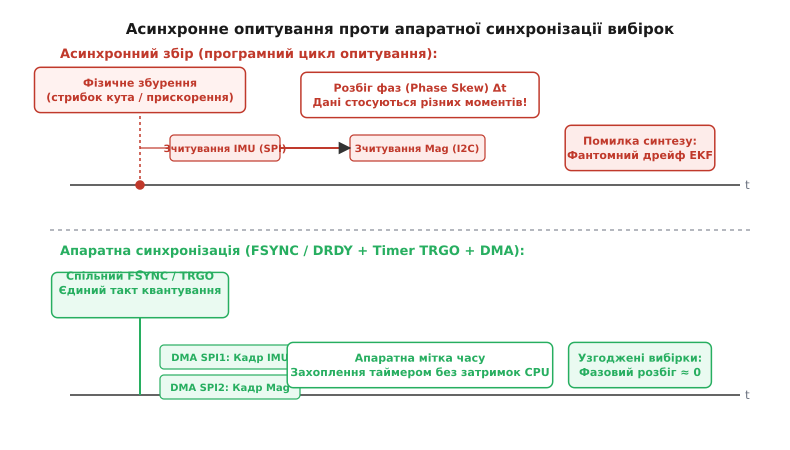
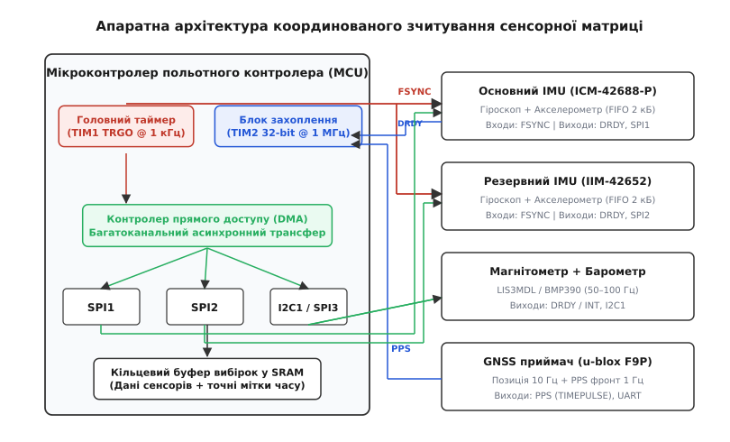
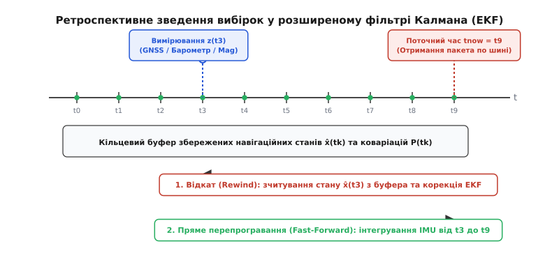

# Синхронне зчитування

<preknowlist>
- [Мітки часу](book:communications/timestamps) — прив'язка цифрових подій до єдиної шкали часу.
- [PPS-імпульс](book:communications/pps-pulse) — апаратний секундний фронт для глобальної синхронізації.
- [Джиттер вибірки](book:communications/sampling-jitter) — випадкові часові флуктуації моментів оцифрування.
</preknowlist>

Коли швидкісний квадрокоптер виконує різкий розворот із кутовою швидкістю 400°/с, його інерційний давач (IMU) фіксує обертання щомілісекунди, а зовнішній магнітометр оновлює вектор магнітного поля кожні 10 мс через повільну шину I2C. Якщо центральний процесор просто опитує ці прилади в загальному програмному циклі, часовий розрив між вибіркою кутової швидкості та вибіркою магнітного вектора сягає від 2 до 5 мс через затримки шини та планувальника операційної системи. За цей короткий проміжок корпус апарата встигає повернутися на 2 градуси, через що фільтр орієнтації зіставляє поточний вектор тяжіння із застарілим напрямком магнітного поля. Виникає хибна кутова нев'язка, алгоритм синтезу починає штучно «виправляти» уявний дрейф, і контур керування видає некоректний керівний імпульс на мотори, провокуючи розгойдування або зрив у штопор.

Проблема полягає в тому, що просторово рознесені та різнорідні давачі — гіроскопи, акселерометри, магнітометри, барометри, далекоміри та приймачі супутникової навігації (GNSS) — живуть на власних незалежних генераторах тактової частоти. Вони виконують аналогово-цифрове перетворення у довільні моменти часу, буферизують відліки у внутрішніх регістрах із різною затримкою цифрової фільтрації та передають кадри по черзі через спільні послідовні шини. **Синхронне зчитування** — це комплекс схемотехнічних, апаратних та алгоритмічних рішень, який гарантує, що кожен цифровий відлік або створюється строго в єдиний синхронізований момент фізичного часу, або отримує детерміновану апаратну мітку часу для математичного зведення в алгоритмах просторової навігації.

## Анатомія розбігу фаз (Phase Skew) та асинхронного дрейфу

У типовій безпілотній або робототехнічній системі одночасно працює матриця первинних давачів із радикально відмінними динамічними характеристиками. Інерційний блок первинної стабілізації вимагає частоти дискретизації від 1 до 8 кГц для запобігання аліасингу вібрацій двигунів. Триосьовий магнітометр працює на частотах 50–200 Гц через обмежену швидкість релаксації чутливих магніторезистивних елементів. П'єзорезистивний барометр оцифровує статичний тиск із темпом 20–100 Гц, а навігаційний модуль GNSS генерує просторові координати з темпом 5–20 Гц.

Кожен із цих приладів містить власний кремнієвий кристал із внутрішнім RC-генератором або кварцовим резонатором. Номінальна частота навіть якісного внутрішнього генератора має технологічний розкид ±1–2 % та температурний дрейф до 100–200 ppm (*parts per million* — частин на мільйон). Це означає, що два давачі з номінальною частотою 1000 Гц у реальності генерують, наприклад, 994 Гц та 1005 Гц. Моменти готовності їхніх вибірок безперервно зміщуються один відносно одного, створюючи циклічні низькочастотні биття: в один момент часу вибірки з'являються майже одночасно, а через пів секунди розходяться на половину всього періоду квантування.


*Зверху: програмний цикл опитування призводить до неконтрольованого розбігу фаз Δt між вибірками IMU та магнітометра через блокування шин і планувальник. Знизу: апаратне тактування FSYNC та прямий доступ до пам'яті (DMA) вирівнюють фази перетворення та фіксують точну мітку.*

Якщо прошивка польотного контролера опитує сенсори методом звичайного програмного опитування (*polling*), до дрейфу генераторів додається три складові затримки:
1. **Затримка арбітражу шини:** якщо швидкий IMU та магнітометр висять на одній шині [SPI](book:communications/spi-bus) або [I2C](book:communications/i2c-bus), транзакція опитування одного приладу блокує доступ до іншого на сотні мікросекунд.
2. **Джиттер планувальника RTOS:** потік зчитування давача може бути перерваний високопріоритетним завданням (наприклад, генерацією сигналів PWM для регуляторів обертів або обробкою радіоканалу керування), через що інтервал опитування коливається на величину випадкового [джиттера](book:communications/sampling-jitter).
3. **Групова затримка внутрішніх цифрових фільтрів (DLPF):** перед тим як потрапити у вихідний регістр, аналоговий сигнал проходить крізь інтегратор і цифровий фільтр низьких частот давача. Різні моделі мікросхем мають різну кількість каскадів фільтрації, через що фазова затримка відліку може складати від 1 до 20 мс навіть при нульовому часі передачі по шині.

Наслідком такого часового розбігу фаз (*phase skew*, від англ. *skew* — перекіс) є поява фальшивих крос-кореляційних шумів. У швидкому русі виміряний вектор прискорення зміщується під дією кутової швидкості за рівнянням Кориоліса: `da/dt = ȧ + ω × a`. Коли акселерометр зчитується із запізненням `Δt` відносно гіроскопа, у навігаційні рівняння потрапляє паразитне прискорення амплітудою `|ω| · |a| · Δt`. Докладний аналітичний вивід поширення цієї похибки та її дисперсії подано у [математичному аналізі узгодження вибірок](book:communications/synchronous-multi-sensor-read/math-lagrange-resampling.md).

> 🔧 **Навіщо це.** Якщо ви калібруєте вібрації або будуєте систему запобігання аваріям на базі двох паралельних IMU (основного та резервного), асинхронне опитування створить хибну різницю їхніх показів. Система контролю цілісності (*fault detection and isolation*) сприйме розбіг фаз за відмову одного з давачів і помилково заблокує справний контур керування.

## Кремнієвий тракт: децимація, фільтри та апаратні лінії DRDY

Щоб зрозуміти походження часової затримки всередині давача, необхідно розглянути структуру його вимірювального тракту. У сучасних мікроелектромеханічних системах (MEMS — *Micro-Electro-Mechanical Systems*) чутливий елемент є механічним резонатором, зміщення якого змінює мікроємність обкладок (на рівні десятих часток фемтофарада).

Аналоговий фронтенд (AFE) перетворює зміну ємності на напругу, після чого сигнал оцифровується сигма-дельта АЦП (*Sigma-Delta ADC*), який працює на надвисокій внутрішній частоті модулятора від 100 кГц до 1 МГц. Отриманий однобітний потік даних надходить на каскад децимації:
1. **Децимаційний фільтр (SINC3 / SINC4):** знижує частоту вибірок до базової частоти оцифрування (ODR — *Output Data Rate*), одночасно виконуючи первинну фільтрацію шумів квантування.
2. **Цифровий фільтр низьких частот (DLPF — Digital Low-Pass Filter):** формує необхідну смугу пропускання (наприклад, 40 Гц, 100 Гц або 250 Гц) за допомогою фільтрів із скінченною (FIR) або нескінченною (IIR) імпульсною характеристикою.

Кожен із цих каскадів вносить строго детерміновану, але ненульову затримку конвеєра (*pipeline delay*). Фільтри FIR мають строго лінійну фазову характеристику і постійну групову затримку `τ_group = (N - 1) / (2 · f_sample)` (де `N` — порядок фільтра), тоді як фільтри IIR (наприклад, 2-полюсний фільтр Баттерворта) вносять меншу затримку на низьких частотах, але спотворюють фазу поблизу частоти зрізу.

```
        ┌─────────────────────────────────────────────────────────────┐
        │                     Мікроконтролер (MCU)                    │
        │                                                             │
        │  [Таймер TRGO] ──────────── FSYNC ────────────┐              │
        │                                               │              │
        │  [Timer Capture] ◄───────── DRDY ───────────┐ │              │
        │                                             │ │              │
        │  [SPI Master DMA] ◄════════ SPI Bus ══════┐ │ │              │
        └───────────────────────────────────────────┼─┼─┼─────────────┘
                                                    │ │ │
                                                    ▼ ▼ │
        ┌───────────────────────────────────────────────┴─────────────┐
        │                 MEMS Давач (ICM-42688 / BMI088)             │
        │                                                             │
        │   ┌─────────────┐     ┌──────────────┐     ┌────────────┐   │
        │   │ Чутливий    │ ──> │ АЦП + Фільтр │ ──> │ FIFO буфер │   │
        │   │ кремній     │     │ (DLPF)       │     │ каскад     │   │
        │   └─────────────┘     └──────┬───────┘     └─────┬──────┘   │
        │                              │                   │          │
        │   FSYNC Вхід ────────────────┘                   │          │
        │   (Примусовий старт АЦП)                         │          │
        │                                                  │          │
        │   DRDY Вихід ────────────────────────────────────┘          │
        │   (Сповіщення про готовність відліку)                       │
        └─────────────────────────────────────────────────────────────┘
```

### Лінія готовності даних (Data Ready / DRDY)

Вихід `DRDY` (або `INT1`/`INT2` у конфігурації генерації переривання) фізично підключений до внутрішнього цифрового автомата давача. Щойно внутрішній АЦП завершує цикл інтегрування чергового відліку, а цифровий фільтр записує результат у вихідний тіньовий регістр, вивід `DRDY` генерує короткий електричний фронт (типово логічну одиницю тривалістю кілька мікросекунд або перехід 0 → 1 до моменту читання).

Використання `DRDY` докорінно змінює архітектуру драйвера:
1. Процесор не витрачає час шини на періодичні опитування регістру статусу.
2. Фронт `DRDY` заводиться на пін зовнішнього переривання (EXTI) мікроконтролера.
3. Головне: цей самий фронт апаратно спрямовується на вхід каналу захоплення таймера (*Timer Input Capture*).

Коли `DRDY` підстрибує у високий рівень, апаратний 32-бітний таймер мікроконтролера миттєво (за 1 такт тактової частоти, без участі ядра CPU) копіює поточне значення системного лічильника часу в регістр захоплення `CCR`. Навіть якщо процесор у цю мить зайнятий виконанням іншого коду або знаходиться в критичній секції, апаратна мітка часу фіксується з похибкою не більше кількох наносекунд. Коли ядро нарешті дійде до обробника переривання, воно зчитає зафіксовану мітку з регістру `CCR` і прив'яже її до отриманого кадру.

### Зовнішня синхронізація перетворень (FSYNC / ExtSync)

Хоча `DRDY` точно повідомляє, *коли* завершилося перетворення, він не вирішує проблему розбігу частот між двома різними мікросхемами: кожна мікросхема генеруватиме `DRDY` у власному темпі. Для повного фазового узгодження застосовують зворотний механізм — лінію зовнішньої синхронізації `FSYNC` (*Frame Synchronization*).

Вхід `FSYNC` давача з'єднується з виходом апаратного таймера польотного контролера. Залежно від внутрішньої архітектури MEMS-чіпа, сигнал `FSYNC` може працювати у двох режимах:
- **Режим маркування вибірки (Sample Tagging):** давач працює від власного генератора, але при надходженні фронту на пін `FSYNC` виставляє спеціальний біт у заголовку поточного кадру даних або записує поточний стан лічильника перетворень. Це дозволяє мікроконтролеру однозначно зіставити кадр давача із зовнішньою подією (наприклад, зі спалахом світлодіода оптичного трекера або відкриттям затвора камери).
- **Режим апаратного перезапуску АЦП (Direct Conversion Trigger):** фронт `FSYNC` примусово скидає внутрішній дільник фази модулятора АЦП і запускає новий цикл вибірки. Якщо подати один і той самий сигнал `FSYNC` на два однакових IMU, встановлених на платі, їхні вимірювальні тракти почнуть працювати строго синфазно, повністю ліквідуючи розбіг фаз між основним і дублюючим каналами.

> 🔧 **Навіщо це.** У системах візуально-інерційної одометрії (VIO), де дані високошвидкісного IMU об'єднуються зі стереокамерою, лінію стробування затвора камери (*Strobe Output*) підключають прямо до входу `FSYNC` інерційного датчика. Кожен знятий кадр зображення отримує точний зріз кутових швидкостей і прискорень безпосередньо в момент експозиції матриці.

## Координований запуск: таймери TRGO та паралельні канали DMA

Якщо система містить кілька високошвидкісних сенсорів на шинах SPI, виклик класичних функцій читання в обробниках переривань швидко перевантажить процесор. При частоті 1 кГц на кожен із двох IMU ядро змушене обробляти 2000 переривань на секунду. Накладні витрати на збереження контексту регістрів процесора (стековий кадр) починають забирати до 15–25 % усієї обчислювальної потужності.

Архітектурний вихід полягає в побудові повністю автономного апаратного конвеєра: **Timer TRGO → FSYNC → DMA Burst Read**.


*Контролер формує періодичний апаратний тригер TIM1 TRGO, який тактує лінії FSYNC ініціації перетворень. Сигнали DRDY замикають апаратні мітки часу в таймері TIM2, а паралельні потоки DMA зчитують кадри без участі CPU.*

### Механізм запуску через Timer TRGO

Головний таймер мікроконтролера (наприклад, `TIM1` або `TIM8` в архітектурі ARM Cortex-M) конфігурується як провідний генератор тактової сітки (*Master Timer*). Його регістр автоперезавантаження `ARR` встановлює період рівно 1000 мкс (1 кГц), а джерелом тактування є стабілізований кварцом системний тактовий сигнал.

При кожному переповненні лічильника внутрішній блок керування таймером формує вихідний сигнал тригера `TRGO` (*Trigger Output*). Цей сигнал виконує одночасно три апаратні дії:
1. Через канал вихідного порівняння формує фізичний імпульс на піні `FSYNC`, який іде до первинних давачів.
2. Внутрішньою шиною взаємодії периферії (ITR — *Internal Trigger*) запускає синхронний запуск аналогово-цифрових перетворювачів самого мікроконтролера (наприклад, для вимірювання струму та напруги силової батареї в ту саму мить).
3. Ініціює запит до контролера прямого доступу до пам'яті (DMA) для попередньої підготовки буферів передачі SPI.

### Паралельне зчитування через виділені контролери SPI та DMA

Щоб уникнути черг арбітражу, критично важливі давачі розводять на **фізично незалежні контролери SPI**:
- Основний IMU 1 підключається до `SPI1` (зі своїми лініями SCK, MISO, MOSI, CS).
- Резервний IMU 2 підключається до `SPI2`.
- Магнітометр і барометр розміщуються на `SPI3` або швидкісній шині I2C.

Кожен контролер SPI підключається до власного потоку DMA (*DMA Stream*). Коли від давача приходить сигнал `DRDY`, прошивка опускає лінію вибору мікросхеми CS і активує потік DMA. Контролер DMA бере на себе повне керування шиною: він генерує тактові імпульси `SCK`, передає порожні байти в лінію `MOSI` для тактування зсувного регістру давача й одночасно записує вхідні байти з лінії `MISO` безпосередньо в кільцевий масив оперативної пам'яті.

Процесор у цьому процесі не бере жодної участі. Переривання генерується лише один раз — коли контролер DMA перенесе весь пакет (14–20 байтів) у пам'ять. Це зменшує навантаження на процесор до часток відсотка та гарантує абсолютно стабільний час передачі без фазового джиттера. Повна практична реалізація конфігурації регістрів таймера, переривань EXTI та каналів DMA у C та ідіоматичному C++ наведена у [проєкті синхронного зчитування на таймерах TRGO та DMA](book:communications/synchronous-multi-sensor-read/proj-sync-dma-trgo.md).

## Буферизація в апаратні черги FIFO давачів

Коли частота оцифрування IMU зростає до 4–8 кГц (що необхідно для точної фільтрації високочастотних шумів пропелерів цифровими режекторними фільтрами — *gyro notch filters*), передавати кожен відлік окремою транзакцією SPI стає неефективно. Час опускання та підняття піна CS, налаштування регістрів та паузи між байтами починають перевищувати тривалість корисної передачі.

Для оптимізації пропускної здатності сучасні інерційні модулі містять внутрішню апаратну чергу FIFO (*First-In, First-Out*) об'ємом від 512 байтів до кількох кілобайтів.

```
       Внутрішній АЦП (8 кГц)
                 │
                 ▼
       ┌─────────────────────────────────────────────────────────────┐
       │             Внутрішній буфер FIFO давача (2 кБ)             │
       │  Кадр 0  │  Кадр 1  │  Кадр 2  │  Кадр 3  │  ...  │ Кадр N  │
       └─────────────────────────────────────────────────────────────┘
                                       │
                         Поріг заповнення (Watermark)
                                       │
                                       ▼
                             Фронт на лінії DRDY
                                       │
                                       ▼
       ┌─────────────────────────────────────────────────────────────┐
       │             Пакетне DMA зчитування (Burst Read)             │
       │       Одна транзакція SPI: CS=0 ──> 112 байтів ──> CS=1     │
       └─────────────────────────────────────────────────────────────┘
```

Робота з FIFO будується за принципом порогового рівня (*Watermark*):
1. Давач накопичує у FIFO кадри фіксованого розміру (наприклад, 14 байтів на вибірку).
2. Регістр водяного знака (*FIFO Watermark*) налаштовується на значення `N` кадрів (наприклад, 8 кадрів = 112 байтів).
3. Поки у черзі менше `N` кадрів, лінія `DRDY` мовчить. Щойно записується `N`-й кадр, `DRDY` піднімається.
4. Контролер DMA за одну безперервну транзакцію пакетного читання (*Burst Read*) зчитує всі 8 кадрів поспіль на максимальній частоті шини SPI (до 20–24 МГц).

### Відновлення часової шкали всередині пакету FIFO

Оскільки пакет містить кілька вибірок, постає питання: як визначити точний час для кожного проміжного відліку всередині пакету?

Сучасні сенсори записують у кожен кадр FIFO або власний 16-бітний лічильник міток часу (*FIFO Timestamp*), або передають статусний заголовок із номером вибірки. Якщо внутрішній лічильник відсутній, час кожного `i`-го кадру відновлюється ретроспективно від апаратно зафіксованої мітки останнього відліку `t_end`:

```
t[i] = t_end - (N - 1 - i) · T_sample
```

де `T_sample = 1 / ODR` — номінальний період дискретизації давача. Оскільки внутрішній генератор давача має невеликий дрейф, номінальний період `T_sample` періодично калібрується в польоті за співвідношенням накопичених інтервалів між послідовними спрацьовуваннями переривань `DRDY` та системним таймером польотного контролера.

## Синхронізація камер оптичного потоку та лазерних далекомірів

Окрему складність становлять давачі просторового позиціонування на малій висоті: камери оптичного потоку (*Optical Flow*) та однопроменеві або матричні лазерні далекоміри (LiDAR / ToF — *Time of Flight*).

Камера оптичного потоку обчислює зсув пікселів `Δp` між двома послідовними кадрами. Проте видимий рух зображення викликаний як лінійним зміщенням апарата `v · Δt`, так і його кутовим обертанням `ω · Δt`:

```
Δp = (f / h) · v · Δt + f · (ω × r) · Δt
```

де `f` — фокусна відстань об'єктива, `h` — висота над поверхнею від далекоміра, `r` — координати пікселя.

Щоб виділити чисту лінійну швидкість `v`, необхідно відняти кутову складову, обчислену гіроскопом. Якщо відлік гіроскопа взято не в інтервалі експозиції камери, а на 5 мс пізніше, компенсація кутової швидкості стає неточною, і робот отримує хибний сигнал про наявність лінійного дрейфу.

Для точної компенсації застосовують стробування експозиції (*Exposure Strobe*):
1. Сенсор камери (наприклад, PMW3901 або глобальний затвор AR0144) при відкритті затвора піднімає вихідний сигнал `STROBE`.
2. Сигнал `STROBE` фіксується таймером польотного контролера як початок експозиції `t_exp_start`, а спад — як завершення `t_exp_end`.
3. Інерційний драйвер обчислює точний інтеграл кутової швидкості саме за цим відрізком часу:

```
Δθ_gyro = ∫_{t_exp_start}^{t_exp_end} ω(t) dt
```

Цей інтеграл кута віднімається від оптичного потоку, повністю усуваючи паразитні сигнали від нахилів корпусу при зависанні над землею.

## Дисциплінування годинників давачів та програмна петля DPLL

Коли давач не має входу зовнішньої синхронізації FSYNC, його внутрішній генератор вільно дрейфує під дією температури навколишнього середовища та самонагріву кристала. Температурний градієнт усередині герметичного корпусу автопілота може досягати 1–2 °C за хвилину під час польоту, що викликає плавний дрейф частоти вибірки на 50–150 ppm.

Якщо прошивка вважає номінальний період вибірки строго сталим `T_nom = 1000.0 мкс`, накопичена похибка інтегрування кутової швидкості швидко перетворюється на систематичну похибку орієнтації. Для розв'язання цієї проблеми драйвер реалізує програмне стеження за частотою за допомогою цифрової петлі фазового автопідстроювання (DPLL — *Digital Phase-Locked Loop*).

На кожному кроці переривання `DRDY` вимірюється фактичний інтервал між послідовними апаратними мітками часу `Δt_meas = t_{DRDY, k} - t_{DRDY, k-1}`. Цей інтервал містить високочастотний джиттер захоплення та плавний тренд зміни частоти. Пропорційно-інтегральний фільтр петлі DPLL обчислює згладжену оцінку фактичного періоду `T̂_k`, яка передається в алгоритми інтегрування кватерніона орієнтації:

```
q_{k+1} = q_k ⊗ exp(0.5 · ω_k · T̂_k)
```

Таке дисциплінування усуває розсинхронізацію між шкалою часу мікроконтролера та фізичними інтервалами оцифрування первинних давачів.

## Синхронізація у слабозв'язаних та тіснозв'язаних комплексах GNSS/INS

В інтегрованих системах супутникової та інерційної навігації (GNSS/INS) вимоги до синхронізації залежать від архітектури комплексування:

1. **Слабозв'язана схема (Loosely-Coupled Integration):** навігаційний модуль самостійно обчислює координати та вектор швидкості й передає їх у польотний контролер текстовими або бінарними повідомленнями (NMEA / UBX / RTCM). Транспортна затримка передачі по UART сягає 50–150 мс. Синхронізація забезпечується прив'язкою початку навігаційної епохи до апаратного фронту імпульсу [PPS](book:communications/pps-pulse). Контролер фіксує момент PPS із субмікросекундною точністю, а повідомлення, що надходить через 80 мс, співвідноситься саме з цією секундною міткою.
2. **Тіснозв'язана схема (Tightly-Coupled Integration):** фільтр Калмана безпосередньо обробляє сирі псевдодальності `ρ_i` та фази несучої `Φ_i` від кожного видимого супутника. Оскільки супутник рухається орбітою зі швидкістю понад 3.8 км/с, його радіальна швидкість відносно антени сягає `v_radial ≈ 1000 м/с`. Похибка синхронізації між моментом зняття псевдодальності та моментом вибірки IMU всього в 1 мс створює штучну координатно-дистанційну нев'язку:

```
δρ = v_radial · Δt = 1000 м/с · 0.001 с = 1.0 метр
```

У тіснозв'язаних комплексах будь-який несинхронізований фазовий зсув вибірок руйнує фазову однозначність несучої (RTK / PPP), унеможливлюючи сантиметрову точність позиціонування. Тому прийом сирих супутникових вимірів прив'язується строго до апаратної сітки часу інерційного блоку.

## Темпоральне зведення різночасових потоків: інтерполяція та EKF

Повна апаратна синхронізація можлива лише для тих давачів, які підтримують вхід `FSYNC` або підключені до швидких шин мікроконтролера. Проте навігаційні приймачі GNSS, цифрові далекоміри та системи технічного зору передають пакети через асинхронні інтерфейси (UART, CAN, Ethernet) із затримками декодування від 20 до 200 мс. Їхні вибірки фізично неможливо «підігнати» під такт IMU апаратними лініями.

Для об'єднання таких асинхронних, різночасових потоків даних застосовують математичні методи часового узгодження на рівні алгоритмів навігаційного синтезу (*sensor fusion*).


*Швидкий контур IMU інтегрує стани у кільцевий буфер. Коли надходить запізніле вимірювання z(t3), фільтр дістає з буфера відповідний стан x̂(t3), виконує корекцію та перепрограває траєкторію вперед до tnow.*

### Поліноміальна інтерполяція та передискретизація

Коли потрібно звести потік повільного давача (наприклад, магнітометра 100 Гц) до швидкої рівномірної сітки інерційного блоку (1000 Гц), просте ступінчасте утримання нульового порядку (*Zero-Order Hold* — повторення попереднього значення) неприпустиме, оскільки воно вносить середню фазову затримку `T_mag / 2 = 5 мс` та високочастотні сходинки, які збурюють диференціальні ланки регуляторів.

Замість цього застосовують поліноміальну інтерполяцію Лагранжа або кубічні сплайни Ерміта. За трьома останніми зафіксованими точками повільного давача `(t₀, y₀), (t₁, y₁), (t₂, y₂)` будується параболічна крива, з якої обчислюється точне проміжне значення на кожному мікросекундному кроці `t_imu`. Це усуває фазове запізнення та зберігає гладкість похідних вимірюваного поля.

### Ретроспективне оновлення станів у розширеному фільтрі Калмана (EKF)

Найдосконалішим підходом до зведення різночасових вибірок є архітектура ретроспективного злиття з буфером станів (*Delayed State Fusion*), реалізована в сучасних автопілотах (зокрема в модулі ECL EKF у PX4 та EKF3 в ArduPilot):

1. **Кільцевий буфер навігаційних станів:** на кожному швидкому кроці IMU (1 кГц) вектор стану апарата `x` (положення, швидкість, орієнтація, зсуви давачів) інтегрується вперед за рівняннями кінематики й записується у кільцевий буфер глибиною 200–300 елементів разом із матрицею коваріацій `P`.
2. **Отримання запізнілого вимірювання:** нехай у поточний фізичний момент часу `t_now` від GNSS-приймача надійшов пакет координат. Пакет містить точну мітку часу `t_meas` моменту вимірювання (отриману за допомогою апаратного [PPS-імпульсу](book:communications/pps-pulse) та внутрішнього таймера приймача). Різниця `t_delay = t_now - t_meas` може складати, наприклад, 120 мс.
3. **Відкат назад у часі (Rewind):** алгоритм EKF знаходить у кільцевому буфері історичний стан `x(t_meas)`, який відповідає саме тому моменту, коли GNSS-приймач зафіксував свій відлік.
4. **Обчислення нев'язки та корекція:** нев'язка спостереження (інновація) обчислюється відносно *історичного* стану: `y = z_gnss - H · x(t_meas)`. Коефіцієнт підсилення Калмана `K` оновлює стан у тій точці минулого.
5. **Пряме перепрогравання (Fast-Forward Propagation):** розрахована поправка стану `Δx` транслюється крізь накопичений ланцюг матриць переходів від моменту `t_meas` вперед до поточного моменту `t_now`.

Цей механізм повністю ліквідує вплив затримок передачі та обробки пакетів: повільні давачі коригують стан саме в тій точці просторово-часової траєкторії, де вимір був здійснений, а швидкий контур стабілізації польоту працює без найменших затримок та фазових фальсифікацій.

### Багатосмугове голосування у надлишкових системах (EKF Lane Voting)

У високонадійних автопілотах промислових БПЛА використовують не один, а три незалежні обчислювальні контури фільтра Калмана (*EKF Lanes*). Перший контур синтезує дані від основного IMU 1 (наприклад, ICM-42688-P), другий — від резервного IMU 2 (BMI088), а третій — від третього давача на окремій вібророзв'язаній платформі.

Усі три смуги паралельно споживають однакові виправлені часові мітки від барометра та GNSS. Спеціальний алгоритм вибору провідної смуги (*Primary Lane Selector*) безперервно оцінює величину нев'язок інновацій `y_k` та слід коваріаційної матриці `tr(P)` кожного контуру. Якщо на одному з IMU відбувається збій синхронізації шини, апаратний зсув фази або механічне насичення через сильний удар, його інновації миттєво зростають. Система автоматично перемикає виконавчий контур керування на сусідню смугу без переривання траєкторії польоту.

## Програмна організація драйверів у реальному часі (RTOS)

Для забезпечення безперервної синхронної роботи сенсорного тракту в операційних системах реального часу (NuttX, FreeRTOS, Zephyr) структуру драйверів поділяють на дві частини:

```
   ┌─────────────────────────────────────────────────────────────┐
   │     Апаратне переривання ISR (Високий пріоритет)            │
   │  - Захоплення мітки часу з регістру CCR таймера             │
   │  - Запуск DMA читання пакета                                │
   │  - Мінімальний час виконання: < 1.5 мкс                     │
   └──────────────────────────────┬──────────────────────────────┘
                                  │
                                  ▼
   ┌─────────────────────────────────────────────────────────────┐
   │     Черга без блокувань (Lock-Free SPSC Ring Buffer)        │
   │  - Атомарні покажчики head/tail з memory barrier            │
   │  - Нульове копіювання (Zero-Copy Buffer Descriptor)         │
   └──────────────────────────────┬──────────────────────────────┘
                                  │
                                  ▼
   ┌─────────────────────────────────────────────────────────────┐
   │     Потік сенсорної обробки RTOS (Пріоритет SCHED_FIFO 250) │
   │  - Калібрування нулів і масштабів (Scale & Bias)            │
   │  - Цифрова режекція вібрацій (Gyro Notch Filter)            │
   │  - Передача узгодженого вектора в контур навігації EKF      │
   └──────────────────────────────┘
```

1. **Верхня половина (Hardware ISR — Interrupt Service Routine):** виконується з найвищим пріоритетом. Вона фіксує апаратну мітку часу, перезапускає канали DMA та скидає прапорці переривань периферії. У цій секції суворо заборонені будь-які операції виділення динамічної пам'яті, блокуючі цикли очікування та виклики функцій форматованого виводу.
2. **Черга без блокувань (Lock-Free Single-Producer Single-Consumer Queue):** забезпечує безпечну передачу дескриптора пакета між апаратним перериванням та користувацьким потоком без використання м'ютексів. Використання атомарних операцій із бар'єрами пам'яті (`std::memory_order_release` / `std::memory_order_acquire`) виключає затримки перемикання контексту ядра.
3. **Нижня половина (High-Priority Worker Thread):** виконується в потоці операційної системи з фіксованим пріоритетом реального часу (`SCHED_FIFO`). Вона розпаковує сирі слова, застосовує матриці калібрування масштабних коефіцієнтів і температурного дрейфу, обчислює фільтри режекції вібрацій і публікує готовий синхронізований вектор у шину міжпроцесної взаємодії (наприклад, uORB у PX4).

## Інженерні компроміси та схемотехнічні пастки

Побудова системи синхронного зчитування вимагає ретельного врахування фізичних властивостей друкованої плати та цифрових інтерфейсів:

| Схемотехнічний фактор | Фізична природа проблеми | Інженерне рішення |
| :--- | :--- | :--- |
| **Електромагнітна наводка від SCK на аналогову частину** | Круті фронти сигналу тактування SPI (20 МГц) проникають через паразитні ємності на мікромеханічні структури MEMS. | Зниження швидкості наростання фронту (*Drive Strength* / *Slew Rate*) у регістрах GPIO мікроконтролера, розведення сигналів `SCK` у внутрішніх шарах плати між суцільними полігонами землі (GND). |
| **Паразитне зворотне живлення через цифрові піни** | Якщо на лінію `FSYNC` подається сигнал від увімкненого таймера, коли живлення давача ще вимкнене, струм тече через захисні діоди ESD. | Програмне тримання пінів синхронізації у високоімпедансному стані (Hi-Z) до повної стабілізації напруги живлення сенсорної шини. |
| **Неузгодженість частот зрізу фільтрів (DLPF)** | Якщо основний і резервний IMU мають різні налаштування DLPF (наприклад, 40 Гц та 100 Гц), їхні групові затримки відрізнятимуться на 5–10 мс. | Синхронна конфігурація регістрів цифрових фільтрів з однаковою смугою пропускання та однаковою фазовою затримкою на обох мікросхемах. |
| **Перехресне блокування на спільній шині SPI** | Утримання лінії CS у нулі під час тривалої передачі DMA блокує доступ до інших приладів на тій самій шині. | Використання окремих апаратних контролерів SPI для кожного швидкісного давача або оптимізація розміру DMA-транзакцій. |
| **Узгодження хвильового опору швидкісних ліній** | Відбиття сигналів на довгих шлейфах SPI (понад 10 см) викликають помилкові спрацьовування тригерів Шмітта. | Встановлення послідовних демпфуючих резисторів (*Series Termination*) номіналом 22–33 Ом біля виходів передавача. |

Синхронне зчитування усуває розрив між неперервним фізичним рухом об'єкта та дискретною природою мікроконтролера. Поєднання апаратного тактування перетворень через таймери TRGO, безперервного фонового перенесення пакетів через канали DMA та ретроспективного узгодження запізнілих вимірів у буферах EKF перетворює сукупність незалежних кремнієвих кристалів на єдиний, когерентний вимірювальний комплекс, здатний утримувати точність просторової орієнтації в найжорсткіших динамічних режимах.
