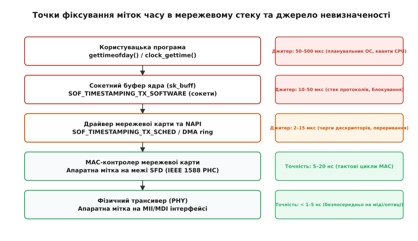
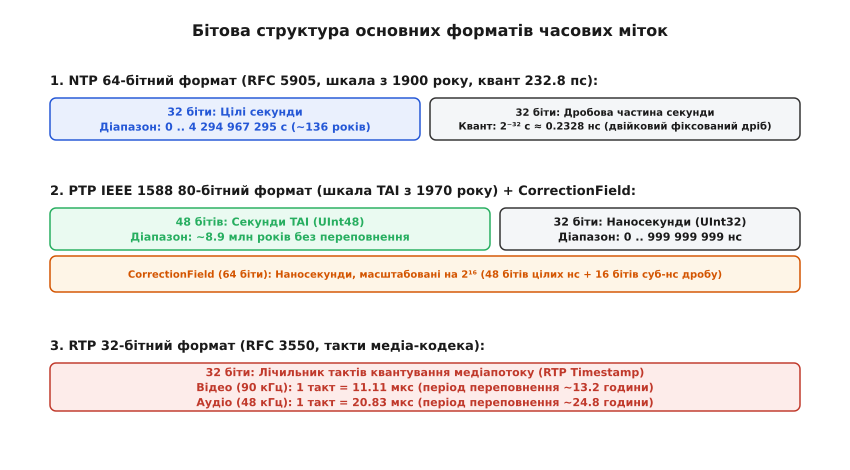
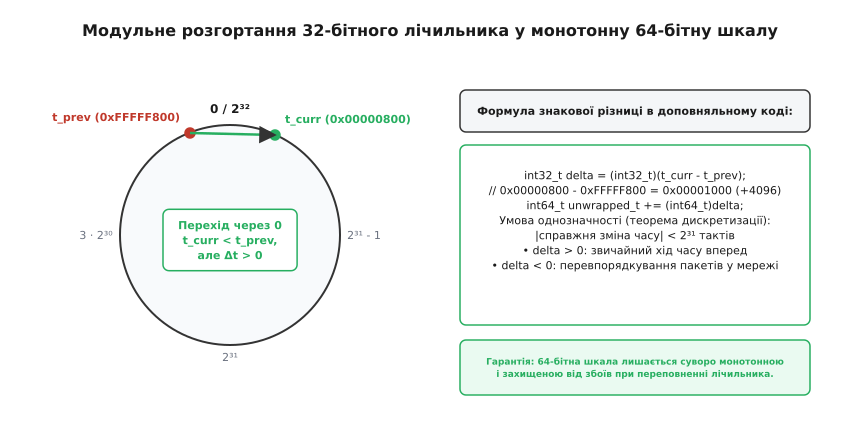
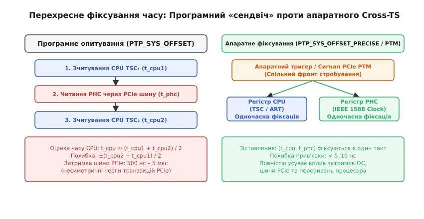

# Мітки часу

<preknowlist>
- [NTP: мережевий протокол синхронізації часу](topic:communications/ntp-sync) — чотири мітки обміну, фільтрація затримок та алгоритм Марзулло.
- [PTP (IEEE 1588): точна синхронізація часу](topic:communications/ptp-1588) — ієрархія годинників, протокол вимірювання затримки та апаратні мітки.
- [PPS-імпульс](topic:communications/pps-pulse) — секундний фронт з наносекундною точністю та прив'язка до супутникового часу GNSS.
- [Дрейф годинників](topic:communications/clock-offset-drift) — зміщення фази, нестабільність частоти кварцових генераторів та старіння кристалів.
- [RTP та RTCP: транспорт реального часу](topic:communications/rtp-rtcp) — часові мітки медіапотоків, SSRC та синхронізація аудіо/відео.
</preknowlist>

Якщо керуюча програма промислового робота чи торговий шлюз викликає системний виклик `clock_gettime(CLOCK_REALTIME)` безпосередньо перед передачею вихідного UDP-пакета у сокет функцією `sendto()`, записане число часу відрізнятиметься від моменту появи першого біта сигналу на мідному або оптичному кабелі на величину від 15 до 350 мікросекунд. Цей часовий проміжок не є постійним: перемикання контексту ядра (англ. *context switch*), зміна тактової частоти ядер процесора при енергозбереженні (англ. *C-states*), черги дескрипторів прямого доступу до пам'яті (DMA), агрегація переривань мережевої карти (англ. *interrupt coalescing*) та блокування у сокетних буферах перетворюють детерміновану операцію на випадковий процес із колосальним джитером (англ. *jitter* — тремтіння). У мережах зі швидкістю 10 Гбіт/с затримка у 100 мікросекунд відповідає передачі 125 000 байтів даних або поширенню світла оптоволокном на відстань у 20 кілометрів, що унеможливлює субмікросекундну синхронізацію фаз в енергомережах, фазованих антенних решітках або базових станціях мобільного зв'язку.

Єдиним способом усунення цієї невизначеності є перенесення точки фіксування часової мітки (англ. *timestamp*) з прикладного коду вглиб мережевого стека — аж до апаратного контролера MAC (англ. *Media Access Control*) або фізичного трансивера PHY (англ. *Physical Layer*), де час фіксується безпосередньо за фізичним фронтом сигналу.

---

### Точки фіксування міток та анатомія затримок

Шлях мережевого пакета від моменту його формування в пам'яті програми до виходу на фізичний носій складається з кількох послідовних етапів. На кожному з них виникають власні апаратні та програмні затримки:

```
Програма: clock_gettime()
   │  [Системний виклик: 0.8–2.5 мкс]
   ▼
Ядро: Сокетний буфер (sk_buff)
   │  [Маршрутизація, iptables, qdisc: 5–30 мкс]
   ▼
Драйвер: Кільце передавача (Tx Ring DMA)
   │  [Транзакції шини PCIe, черга дескрипторів: 2–15 мкс]
   ▼
Мережевий адаптер (MAC)
   │  [Формування кадру, буфер FIFO, паузи Flow Control: 0.1–2 мкс]
   ▼
Фізичний трансивер (PHY)
   │  [Кодування 8b/10b або 64b/66b, SerDes: 15–60 нс]
   ▼
Фізична лінія (Кабель / Оптоволокно)
```


*Точки фіксування міток часу в мережевому стеку та джерела випадкового джитеру операційної системи.*

#### 1. Програмні мітки в просторі користувача (User-space Timestamps)
Найпростіший спосіб полягає у виклику `gettimeofday()` або `clock_gettime()`. Його похибка визначається станом планувальника операційної системи: якщо в момент між отриманням мітки та виконанням виклику `sendto()` ядро витіснить потік на користь іншого завдання, пакет залишиться в пам'яті на цілий квант планування (від 1 до 10 мілісекунд). Навіть за відсутності витіснення сам перехід між простором користувача та ядром через інструкцію `syscall` вносить змінну затримку в кілька сотень наносекунд, а динамічне скидання тактової частоти ядра процесора у станах енергозбереження C-states (C1E, C3, C6) додає від 10 до 150 мікросекунд на «прокидання» обчислювального конвеєра.

#### 2. Програмні мітки ядра сокетного рівня (Kernel Software Timestamps)
Операційна система Linux дозволяє фіксувати час усередині мережевого стека ядра. Для вихідних пакетів сокетний прапорець `SOF_TIMESTAMPING_TX_SOFTWARE` зчитує системний час у функції `__dev_queue_xmit()`, коли пакет передається з протокольного стека (IP/UDP) у чергу планувальника дисципліни обслуговування (qdisc). Додатковий прапорець `SOF_TIMESTAMPING_TX_SCHED` фіксує момент, коли планувальник фактично вилучає пакет із черги та передає його дескриптор у кільцевий буфер драйвера.

Для вхідних пакетів прапорець `SOF_TIMESTAMPING_RX_SOFTWARE` фіксує час у функції ядра `__netif_receive_skb()`, коли ядро забирає пакет з черги драйвера в контексті обробки переривань NAPI. Це повністю усуває джитер планувальника користувацьких процесів, проте залишає невизначеність черг ядра, затримок шини PCIe та механізму агрегації переривань (похибка 10–50 мікросекунд).

#### 3. Агрегація переривань та затримки шини PCIe
Серверні мережеві карти використовують механізм адаптивної агрегації переривань (англ. *Interrupt Coalescing / Adaptive Moderation*). Щоб не перевантажувати процесор мільйонами переривань на секунду при інтенсивному потоці даних, контролер затримує генерацію апаратного переривання на 50–250 мікросекунд, очікуючи накопичення пачки пакетів. Для звичайного передавання даних це підвищує загальну пропускну здатність, проте для протоколів синхронізації часу створює випадковий плаваючий джитер, який робить програмні сокетні мітки непридатними для високоточних задач.

Крім того, копіювання пакета з системної оперативної пам'яті в пам'ять мережевої карти здійснюється через транзакції прямого доступу до пам'яті (DMA) по шині PCIe. Затримка проходження транзакції через комутатори PCIe та контролер пам'яті залежить від конкурентного навантаження інших пристроїв (дискових NVMe контролерів, графічних процесорів) і коливається від 500 наносекунд до кількох мікросекунд.

#### 4. Апаратні мітки на рівні MAC-контролера (MAC Hardware Timestamps)
Контролер мережевого адаптера містить власний високочастотний цифровий лічильник — апаратний годинник PHC (англ. *PTP Hardware Clock*), що тактується від внутрішнього або зовнішнього кварцового генератора (типово 100–250 МГц). Коли апаратний блок обробки виявляє вихід чи прийом кадру, він миттєво зберігає значення лічильника PHC у спеціальний регістр захоплення (англ. *capture register*). Похибка зменшується до 5–20 наносекунд, що визначається тактом контролера MAC.

#### 5. Апаратні мітки на рівні PHY-трансивера (PHY Hardware Timestamps)
Мікросхема фізичного рівня (PHY) розташована безпосередньо біля роз'єму RJ-45 або оптичного модуля SFP. Фіксування мітки в PHY повністю усуває затримки внутрішніх конвеєрів перетворення даних (SerDes), буферів еластичності (англ. *elasticity buffers*) та інтерфейсів MII/GMII/XGMII. Точність фіксації сягає одиниць або часток наносекунди.

---

### Архітектура апаратного фіксування: детекція SFD та механізми One-Step / Two-Step

Апаратне фіксування часу не може відбуватися «у будь-який момент кадру», оскільки пакети мають різну довжину, а їх передача триває певний час (передача кадру розміром 1500 байтів на швидкості 1 Гбіт/с займає рівно 12 мікросекунд).

Стандарт IEEE 1588 суворо визначає **опорну точку фіксування часу** (англ. *timestamp reference point*): для кадрів Ethernet нею є момент проходження **початкового обмежувача кадру** — байта SFD (англ. *Start of Frame Delimiter*, шістнадцяткове значення `0xD5`, двійкове `10101011`), який слідує одразу за 7 байтами преамбули `0xAA`.

```
Структура початку Ethernet-кадру на фізичному рівні:
┌──────────────────────────────────────┬────────┬──────────────────────────┐
│ Преамбула (Preamble, 7 байтів)       │  SFD   │ Заголовок Ethernet, IP…  │
│ 0xAA 0xAA 0xAA 0xAA 0xAA 0xAA 0xAA   │  0xD5  │                          │
└──────────────────────────────────────┴────────┴──────────────────────────┘
                                           ▲
                                   Точка фіксації PHC
```

Як тільки апаратний компаратор у мікросхемі MAC чи PHY розпізнає бітовий патерн SFD у потоці переданих або прийнятих даних, лінія стробування миттєво переносить значення лічильника секунд та наносекунд PHC у внутрішній регістр захоплення.

#### Внутрішня будова годинника PHC та цифрового генератора NCO

Апаратний годинник мережевої карти PHC складається з трьох ключових регістрів:
1. **Регістр цілих секунд (Seconds Register):** 32- або 48-бітне беззнакове ціле число.
2. **Регістр наносекунд (Nanoseconds Register):** 32-бітне число, що інкрементується від `0` до `999 999 999`. При досягненні значення 1 мільярд лічильник скидається в нуль, а регістр секунд збільшується на одиницю.
3. **Акумулятор дробової фази (Phase Accumulator):** 32-бітний регістр цифрового генератора NCO (Numerically Controlled Oscillator). Оскільки тактовий генератор мережевої карти зазвичай працює на фіксованій частоті (наприклад, 125 МГц із періодом такту рівно 8 наносекунд), на кожному такті до наносекундного лічильника додається номінальний крок 8 нс.

Якщо кварцовий генератор карти поспішає або відстає через температуру, операційна система не переписує лічильник часу щосекунди, а змінює коефіцієнт інкременту фазового акумулятора за допомогою системного виклику `clock_adjtime(clkid, &tx)` з прапорцем `ADJ_FREQUENCY`. Наприклад, додавання зміщення у `+100` ppm призводить до того, що лічильник накопичує додаткові частки наносекунди на кожному фізичному такті кварцу, плавно підстроюючи швидкість ходу апаратного годинника без фазових стрибків.

#### Апаратні фільтри пакетів та захист дескрипторних буферів

Апаратне фіксування часу вимагає збереження мітки для кожного дозволеного кадру. Якщо на інтерфейсі 10/25/100 Гбіт/с увімкнути фіксування для абсолютно всіх вхідних пакетів (`HWTSTAMP_FILTER_ALL`), до кожного дескриптора DMA додається 64-бітне значення часу, а апаратне FIFO міток переповнюється при першому ж сплеску трафіку.

Для оптимізації контролери містять апаратний парсер протоколів (Protocol Parser ASIC), який фільтрує кадри на швидкості лінії (Line Rate):
* **Layer 2 Ethernet PTP:** Перевіряється поле EtherType `0x88F7`.
* **Layer 4 UDP/IPv4 та UDP/IPv6 PTP:** Перевіряються порти призначення UDP `319` (повідомлення подій) та `320` (загальні повідомлення).
* **Тип повідомлення PTP (MessageType):** Парсер зчитує молодші 4 біти першого байта PTP-заголовка. Апаратні мітки генеруються виключно для повідомлень подій: `Sync` (`0x0`), `Delay_Req` (`0x1`), `Pdelay_Req` (`0x2`) та `Pdelay_Resp` (`0x3`). Загальні інформаційні повідомлення (`Announce`, `Follow_Up`, `Delay_Resp`, `Management`) ігноруються апаратним таймером, що запобігає засміченню черг дескрипторів.

#### Відмінність між таймстемпінгом на рівні MAC та PHY

Між контролером MAC та фізичною лінією зв'язку розташована мікросхема трансивера PHY. У сучасних високошвидкісних мережах (1G, 10G, 25G, 100G) трансивер виконує складне перетворення бітових потоків:
* **Кодування підрівня PCS:** Кодування 8b/10b у Gigabit Ethernet або 64b/66b у 10 Gigabit Ethernet, що вводить затримку на блокове перетворення слів.
* **Серіалізатор / Десеріалізатор (SerDes):** Перетворює паралельні внутрішні шини на високошвидкісні диференційні послідовні лінії.
* **Буфери еластичності (Elasticity FIFO):** Компенсують різницю тактових частот між передавачем та приймачем. Глибина заповнення буфера FIFO є випадковою і фіксується в момент встановлення фізичного лінку (Link Up). Після кожного перезавантаження порту затримка проходження кадру через PHY може стрибати на 10–60 наносекунд.

Якщо апаратне фіксування виконується на рівні MAC, ця змінна затримка трансивера PHY потрапляє у вимірювання. Спеціалізовані мікросхеми з підтримкою PHY Timestamping (наприклад, DP83640 або VSC85xx) розпізнають преамбулу безпосередньо на виході аналогового тракту MDI (Medium Dependent Interface), що усуває вплив буферів еластичності та забезпечує субнаносекундну стабільність вимірювань.

#### Механізми передачі вихідних міток: One-Step проти Two-Step

Якщо для вхідного пакета зафіксовану апаратну мітку можна просто додати до службового дескриптора DMA і передати драйверу разом із пакетом, то для вихідного пакета виникає дилема: значення мітки стає відомим лише тоді, коли пакет **вже виходить** на лінію. Стандарти синхронізації передбачають два взаємовиключні архітектурні рішення:

```
1. Однокроковий годинник (One-Step Clock):
   Вузол A ───[ Sync (мітка t1 записується в тіло на льоту) ]───► Вузол B

2. Двокроковий годинник (Two-Step Clock):
   Вузол A ───[ Sync (вихідна мітка t1 зберігається в регістрі) ]──► Вузол B
   Вузол A ───[ Follow_Up (містить точне числове значення t1) ]────► Вузол B
```

* **Однокроковий режим (One-Step):** Контролер мережевої карти модифікує поле мітки часу або поле корекції безпосередньо у вихідному кадрі під час його руху конвеєром передавача. Оскільки запис у кадр змінює його вміст, контролер повинен на льоту перерахувати контрольну суму кадру (Ethernet FCS або UDP Checksum). Це спрощує мережевий протокол (не потрібні додаткові повідомлення), але вимагає складної логіки в кремнії.
* **Двокроковий режим (Two-Step):** Контролер зберігає зафіксовану мітку `t1` у внутрішньому буфері FIFO, а пакет `Sync` виходить у мережу без змін. Після відправки процесор вичитує значення `t1` через переривання та надсилає слідом окремий пакет `Follow_Up`, у корисне навантаження якого записує точне числове значення `t1`.

Повний опис сокетних прапорців `SO_TIMESTAMPING`, системних викликів налаштування фільтрів `SIOCSHWTSTAMP` та читання черги `MSG_ERRQUEUE` наведено у вставці [📋 Linux SO_TIMESTAMPING та PHC ioctl: програмний та апаратний інтерфейс міток часу](topic:communications/timestamps/api-socket-timestamping.md).

---

### Формати міток у мережевих протоколах: NTP, PTP та RTP

Різні мережеві протоколи розроблялися під відмінні вимоги щодо тривалості часових епох, роздільної здатності та обчислювальної складності.


*Порівняння бітової структури та роздільної здатності форматів NTP, PTP та RTP.*

#### 1. Формат NTP (Network Time Protocol, RFC 5905)
Протокол NTP використовує 64-бітне подання часу у форматі з фіксованою комою без знака:
* **Старші 32 біти:** ціла кількість секунд від початку епохи NTP (1 січня 1900 року, 00:00:00 UTC).
* **Молодші 32 біти:** двійковий дріб секунди.

Квант дробової частини NTP становить:

```
q_NTP = 2⁻³² с ≈ 0.2328306436538696 нс (232.83 пікосекунди)
```

Повний діапазон 32-бітного лічильника секунд становить `2³²` секунд (приблизно 136 років). Перше переповнення лічильника секунд NTP (англ. *NTP Era 0 rollover*) настане **7 лютого 2036 року о 06:28:16 UTC**, коли значення секунд скинеться в нуль. Для захисту від збоїв стандарт NTPv4 ввів 128-бітний розширений формат мітки часу (64 біти цілих секунд + 64 біти дробу), що розширює епоху на 584 мільярди років.

#### 2. Формат IEEE 1588 PTP (Precision Time Protocol)
Стандарт PTP розрахований на наносекундну точність і використовує 80-бітну структуру часу за атомною шкалою TAI (англ. *International Atomic Time*):
* **Старші 48 бітів:** ціла кількість секунд від епохи POSIX/TAI (1 січня 1970 року, 00:00:00 TAI). 48-бітне поле секунд переповниться лише через 8.9 мільйона років.
* **Молодші 32 біти:** ціла кількість наносекунд у межах поточної секунди (діапазон від `0` до `999 999 999`).

Окрім 80-бітної мітки, PTP використовує **64-бітне поле корекції (CorrectionField)** у заголовку кожного пакета. Воно вимірюється в **суб-наносекундах** — одиницях `2⁻¹⁶` наносекунди (квант `≈ 15.258` фемтосекунди).

#### Прозорі комутатори (Transparent Clocks, TC)
У традиційних мережах комутатори накопичують пакети в чергах, створюючи випадкову затримку від 10 мкс до десятків мілісекунд (Packet Delay Variation, PDV). PTP вирішує цю проблему за допомогою прозорих комутаторів:
* **End-to-End (E2E) Transparent Clock:** Комутатор фіксує апаратний час входу кадру `t_in` та час виходу `t_out`. Різниця `t_residence = t_out - t_in` (час перебування пакета в комутаторі) додається до поля `correctionField`. Кінцевий ведений вузол віднімає це накопичене значення, повністю виключаючи комутатор із розрахунку джитеру.
* **Peer-to-Peer (P2P) Transparent Clock:** Комутатор додатково вимірює затримку безпосередньо приєднаного кабелю (`t_pdelay`) і додає як час перебування, так і затримку лінії зв'язку, що спрощує роботу кінцевих пристроїв.

#### 3. Формат RTP (Real-time Transport Protocol, RFC 3550)
Протокол передачі аудіо- та відеопотоків RTP використовує відносний 32-бітний беззнаковий лічильник. На відміну від NTP та PTP, час RTP вимірюється не в секундах, а в **тактах частоти дискретизації медіакодека**:
* Для відеотреків (H.264, HEVC, AV1) стандартна частота становить **90 кГц** (1 такт = `11.111` мікросекунди).
* Для аудіотреків високої якості (Opus, PCM) частота становить **48 кГц** (1 такт = `20.833` мікросекунди).
* Для телефонії (кодек G.711) частота становить **8 кГц** (1 такт = `125` мікросекунд).

Мітка часу RTP вказує на **момент вибірки (Sampling Instant)** першого аудіосемплу чи відеокадру в пакеті, а не на момент передачі пакета в мережу. Початкове значення мітки обирається випадковим чином при старті сесії для криптографічного захисту.

Для міжпотокової синхронізації (Lip Synchronization між звуком і відео) протокол RTCP періодично надсилає службові звіти відправника (Sender Report, SR). Кожен пакет SR містить пару пов'язаних міток часу: абсолютний 64-бітний час NTP та відповідне йому значення 32-бітної мітки RTP на той самий фізичний момент. Отримувач використовує ці пари для побудови лінійної регресії, що дозволяє вирівняти звук та відео на спільній осі часу.

Строгі математичні алгоритми взаємного перетворення NTP, PTP та суб-наносекундних полів корекції виведено у вставці [🧮 Перетворення форматів міток часу та модульне розгортання лічильників](topic:communications/timestamps/math-timestamp-conversion.md).

---

### Фізична асиметрія каналів та бюджет похибки часу

Усі протоколи двостороннього вимірювання затримок (як PTP, так і NTP) розраховують зсув годинника веденого вузла відносно ведучого за формулою:

```
Offset = ( (t2 - t1) - (t4 - t3) ) / 2
```

Ця формула спирається на фундаментальне припущення: час поширення сигналу в прямому напрямку `d_forward` строго дорівнює часу у зворотному напрямку `d_reverse`. У реальних фізичних каналах це припущення майже завжди порушується.

#### Джерела фізичної асиметрії в оптичних та мідних середовищах
1. **Різниця довжин оптичних волокон у дуплексному кабелі:** У звичайних оптичних патч-кордах LC-LC волокно передачі (Tx) та волокно прийому (Rx) прокладаються окремими нитками. Різниця довжин усього на 1 метр створює часову асиметрію близько 4.9 наносекунди (швидкість світла у кварцовому склі `v ≈ 204 000` км/с, або приблизно 4.9 нс на метр).
2. **Хроматична дисперсія в одноволоконних системах (BiDi / WDM):** Якщо передача та прийом відбуваються по одному волокну на різних довжинах хвиль (наприклад, 1310 нм у прямому напрямку та 1490/1550 нм у зворотному), показники заломлення скла `n(λ)` відрізняються. На лінії довжиною 20 км різниця часу поширення становить понад 33 наносекунди.
3. **Температурний коефіцієнт затримки кабелю:** Температурне розширення та зміна показника заломлення кварцового скла вносять дрейф затримки порядку `40` пс/км/°C. Якщо кабель прокладено частково під землею, а частково повітрям на опорах, добові коливання температури генерують циклічну плаваючу асиметрію.

Оскільки будь-яка асиметрія `Δ_asym` входить у розрахунок зміщення годинника в пропорції `1:1` (`Offset_error = Δ_asym`), високоточні системи (наприклад, базові станції 5G з вимогою сумарної похибки Time Alignment Error менше ніж 130 наносекунд) вимагають обов'язкового калібрування ліній зв'язку та внесення стаціонарної поправки `asymmetryCorrection` у конфігурацію PTP.

---

### Монотонність, циклічні переповнення та розгортання шкал

Для коректної роботи розподілених протоколів часова шкала повинна мати властивість **суворої монотонності**: для будь-яких двох послідовних подій `A` та `B`, де `B` сталося пізніше за `A`, виміряні мітки часу мають задовольняти нерівність `t_B > t_A`.

#### Проблема переповнення лічильників (Counter Wraparound)
Оскільки розрядність апаратних таймерів та протокольних полів обмежена, будь-який лічильник неминуче переповнюється і скидається в нуль:
* 32-бітний лічильник наносекунд (частота 1 ГГц) переповнюється кожні **4.295 секунди**.
* 32-бітна мітка RTP для відео (90 кГц) переповнюється кожні **13.256 годин** (`47 721.8` секунди).
* 32-бітна мітка RTP для аудіо (48 кГц) переповнюється кожні **24.855 годин** (`89 478.5` секунди).

Якщо приймач просто порівнюватиме поточне значення `t_curr` із попереднім `t_prev`, момент переповнення (`t_curr = 10`, `t_prev = 4294967280`) виглядатиме як стрибок у минуле на 13 годин, що зруйнує роботу буфера відтворення (jitter buffer) та алгоритмів декодування.


*Модульне розгортання 32-бітного циклічного лічильника у неперервну 64-бітну шкалу.*

#### Алгоритм модульного розгортання (Unwrapping)
Завдяки властивостям арифметики доповняльного коду знакове приведення 32-бітної різниці автоматично враховує перехід через нульову межу без умовних розгалужень:

```
uint32_t raw_current = 0x00000100;   // 256 (після переповнення)
uint32_t raw_prev    = 0xFFFFFF00;   // 4294967040 (до переповнення)

// Беззнакове віднімання: 0x00000100 - 0xFFFFFF00 = 0x00000200 (512)
// Приведення до int32_t дає коректну додатну дельту +512 тактів:
int32_t delta = (int32_t)(raw_current - raw_prev);

// Накопичення в монотонний 64-бітний лічильник:
int64_t unwrapped_timeline += delta;
```

Цей метод коректно обробляє переповнення та випадкові перевпорядкування пакетів у мережі (коли пакет з минулого має `delta < 0`), за умови що реальний проміжок між сусідніми пакетами не перевищує `2³¹` тактів (для відео 90 кГц — не більше ніж 6.6 години відсутності зв'язку).

#### Високосна секунда: стрибок проти згладжування (Leap Smearing)
При додаванні високосної секунди (UTC Leap Second) астрономічний час повторює секунду `23:59:59` двічі (`23:59:59` → `23:59:60` → `00:00:00`). Миттєвий стрибок системного годинника назад на 1 секунду порушує монотонність у базах даних та розподілених журналах транзакцій.

Для запобігання збоям магістральні системи застосовують **згладжування високосної секунди (Leap Smearing)**: замість одномоментного кроку частота годинника сповільнюється на `11.574` ppm протягом 24-годинного вікна (за 12 годин до і 12 годин після опівночі). Протягом цієї доби кожна секунда триває на `11.57` мікросекунди довше, що зберігає сувору монотонність шкали та гладкість її першої похідної (частоти).

---

### Перехресне фіксування часу (Cross-timestamping): зшивання PHC та процесора

У серверах та вбудованих системах виникає архітектурний розрив: мережева карта має власний надточний апаратний годинник PHC, прив'язаний до PTP/GNSS, але всі прикладні процеси, файлові системи та логіка операційної системи використовують системний таймер центрального процесора (TSC в x86_64 або ARM Generic Timer).

Для передачі точного часу від мережевої карти до процесора ядро має регулярно оцінювати зсув між системним часом `T_sys` та апаратним часом `T_phc`.


*Програмний метод «сендвіча» проти апаратного перехресного фіксування через PCIe PTM.*

#### 1. Програмний метод «сендвіча» (PTP_SYS_OFFSET)
Процесор виконує послідовність вимірювань:
1. Зчитує таймер процесора `t_cpu1 = rdtsc()`.
2. Відправляє запит читання регістра PHC через шину PCIe і чекає на відповідь `t_phc`.
3. Знову зчитує таймер процесора `t_cpu2 = rdtsc()`.

Оцінка системного часу, що відповідає моменту `t_phc`, приймається рівною середині інтервалу:

```
t_cpu_mid = (t_cpu1 + t_cpu2) / 2
Похибка оцінки = ±(t_cpu2 - t_cpu1) / 2
```

Оскільки операція читання через шину PCIe займає від 500 нс до 5 мкс (через черги контролера кореневого комплексу PCIe та арбітраж шини), а затримки в прямому та зворотному напрямках часто несиметричні, похибка прив'язки годинника PHC до CPU становить від 200 наносекунд до кількох мікросекунд.

#### 2. Апаратне перехресне фіксування (Hardware Cross-timestamping)
Сучасні архітектури усувають невизначеність шини PCIe на апаратному рівні:
* **Розширення PCIe PTM (Precision Time Measurement):** Стандарт протоколу PCIe визначає спеціальні службові повідомлення фізичного рівня (PTM TLP), які дозволяють кореневому комплексу процесора та кінцевому пристрою мережевої карти обмінюватися мітками без участі центрального процесора і фіксувати стан лічильників з похибкою менше ніж 8 наносекунд.
* **Апаратне стробування (Intel Always Running Timer, ART):** Процесори Intel (від архітектури Skylake) мають таймер ART, що працює на фіксованій базовій частоті (типово 24 МГц). Спеціальний апаратний сигнал між чіпсетом і мережевим контролером (наприклад, Intel I210 / I225 / X550) одночасно фіксує значення ART та PHC в один і той самий такт.
* **Системний виклик `PTP_SYS_OFFSET_PRECISE`:** Повертає з ядра пару одночасно зафіксованих значень `(sys_realtime, phc_device)` без проміжку затримки шини, що дозволяє демону `phc2sys` тримати синхронізацію системного годинника Linux відносно PHC з точністю до 10–20 наносекунд.

#### 3. Робота демона дисциплінування phc2sys
Утиліта `phc2sys` зі складу пакету `linuxptp` функціонує як цифровий сервоконтролер:
1. Регулярно виконує виклик `PTP_SYS_OFFSET_PRECISE` (або `PTP_SYS_OFFSET`).
2. Отримує вектор похибки фази `e_k = T_sys - T_phc`.
3. Застосовує пропорційно-інтегральний (PI) фільтр для розрахунку необхідної поправки частоти процесорного годинника.
4. Передає значення поправки в ядро через виклик `adjtimex()`, підстроюючи системний час `CLOCK_REALTIME` під еталон PHC плавно і без розривів монотонності.

---

### Діагностика, налагодження та аналіз телеметрії

Для перевірки коректності роботи механізмів апаратного фіксування системний адміністратор та розробник мають набір інструментів діагностики ядра Linux:

#### 1. Перевірка лічильників апаратних збоїв драйвера
Мережеві контролери ведуть статистику апаратних міток, доступну через `ethtool -S`:

```bash
$ ethtool -S eth0 | grep -i ptp
     tx_hwtstamp_timeouts: 0
     tx_hwtstamp_skipped: 0
     rx_hwtstamp_cleared: 0
     rx_hwtstamp_dropped: 0
```
Якщо лічильник `tx_hwtstamp_timeouts` або `tx_hwtstamp_skipped` зростає, це свідчить про те, що програма надсилає вихідні пакети швидше, ніж драйвер встигає звільняти апаратні регістри захоплення Tx. Лічильник `rx_hwtstamp_dropped` вказує на переповнення внутрішнього FIFO приймача і потребує звуження фільтра через `SIOCSHWTSTAMP` (наприклад, перехід від `FILTER_ALL` до `FILTER_PTP_V2_EVENT`).

#### 2. Простеження за допомогою eBPF / bpftrace
Для вимірювання затримок проходження пакета від сокета до фізичного рівня можна використовувати сценарій bpftrace:

```bash
# Відстеження часу між запитом мітки та отриманням переривання Tx:
bpftrace -e '
kprobe:__dev_queue_xmit { @start[tid] = nsecs; }
kprobe:skb_tstamp_tx /@start[tid]/ {
    @latency_us = hist((nsecs - @start[tid]) / 1000);
    delete(@start[tid]);
}'
```

---

### Порівняння рівнів реалізації міток часу

> 🔧 **Навіщо це.**  
> При проектуванні розподілених вимірювальних систем, радарів чи високочастотних шлюзів вибір рівня фіксування міток визначає граничну точність системи, вимоги до обладнання та навантаження на процесор.

| Рівень фіксування | Точність | Джитер | Апаратні вимоги | Навантаження на CPU | Типове застосування |
|:---|:---:|:---:|:---:|:---:|:---|
| **User Space (`clock_gettime`)** | 1–10 мс | 100–500 мкс | Будь-яка мережева карта | Мінімальне | Загальне логування, HTTP API, моніторинг серверів |
| **Kernel Socket (`SO_TIMESTAMPING_SOFTWARE`)** | 10–50 мкс | 5–20 мкс | Будь-яка мережева карта | Низьке | NTP-клієнти, корпоративна синхронізація, аудіопотоки |
| **Kernel XDP / eBPF (Zero-copy)** | 1–5 мкс | 0.5–2 мкс | Драйвер з підтримкою XDP | Середнє | Високонавантажені шлюзи, трекінг пакетів у реальному часі |
| **NIC MAC (IEEE 1588 PHC)** | 10–50 нс | 2–10 нс | Серверні NIC (Intel I210/X540, Mellanox) | Нульове (апаратне) | PTP Grandmaster/Slave, 5G O-RAN, Smart Grid, біржі |
| **PHY Hardware (MDI)** | < 1–5 нс | < 0.5 нс | Спеціалізовані PHY (DP83640, Microchip) | Нульове (апаратне) | Фазовані решітки, системи White Rabbit, прискорювачі |

---

### Практична реалізація: відправка та прийом пакетів з апаратними мітками

У наступному прикладі наведено повний виробничий цикл роботи з апаратними мітками в Linux: ініціалізація апаратного фільтра мережевого адаптера через виклик `ioctl(SIOCSHWTSTAMP)`, активація сокетної опції `SO_TIMESTAMPING`, відправка UDP-пакета та вичитування точної мітки часу передавача з черги `MSG_ERRQUEUE`.

:::tabs
```c
#define _GNU_SOURCE
#include <stdio.h>
#include <stdlib.h>
#include <string.h>
#include <unistd.h>
#include <errno.h>
#include <sys/socket.h>
#include <sys/ioctl.h>
#include <netinet/in.h>
#include <arpa/inet.h>
#include <net/if.h>
#include <linux/net_tstamp.h>
#include <linux/sockios.h>
#include <linux/errqueue.h>
#include <poll.h>

static int setup_hw_timestamping(int sock, const char *interface_name) {
    struct ifreq ifr;
    struct hwtstamp_config hw_cfg;

    memset(&ifr, 0, sizeof(ifr));
    strncpy(ifr.ifr_name, interface_name, sizeof(ifr.ifr_name) - 1);

    memset(&hw_cfg, 0, sizeof(hw_cfg));
    hw_cfg.tx_type = HWTSTAMP_TX_ON;
    hw_cfg.rx_filter = HWTSTAMP_FILTER_ALL;
    ifr.ifr_data = (char *)&hw_cfg;

    if (ioctl(sock, SIOCSHWTSTAMP, &ifr) < 0) {
        perror("Попередження: SIOCSHWTSTAMP не підтримується або потрібні права root");
    }

    int flags = SOF_TIMESTAMPING_TX_HARDWARE |
                SOF_TIMESTAMPING_TX_SOFTWARE |
                SOF_TIMESTAMPING_RX_HARDWARE |
                SOF_TIMESTAMPING_RAW_HARDWARE |
                SOF_TIMESTAMPING_OPT_ID |
                SOF_TIMESTAMPING_OPT_TSONLY;

    if (setsockopt(sock, SOL_SOCKET, SO_TIMESTAMPING, &flags, sizeof(flags)) < 0) {
        perror("Помилка: setsockopt(SO_TIMESTAMPING)");
        return -1;
    }
    return 0;
}

static void retrieve_tx_timestamp(int sock) {
    struct pollfd pfd = { .fd = sock, .events = POLLERR, .revents = 0 };
    if (poll(&pfd, 1, 1000) <= 0) {
        fprintf(stderr, "Таймаут очікування мітки в черзі помилок\n");
        return;
    }

    char ctrl_data[512];
    struct msghdr msg;
    memset(&msg, 0, sizeof(msg));
    msg.msg_control = ctrl_data;
    msg.msg_controllen = sizeof(ctrl_data);

    if (recvmsg(sock, &msg, MSG_ERRQUEUE | MSG_DONTWAIT) < 0) {
        perror("recvmsg(MSG_ERRQUEUE)");
        return;
    }

    struct cmsghdr *cmsg;
    for (cmsg = CMSG_FIRSTHDR(&msg); cmsg != NULL; cmsg = CMSG_NXTHDR(&msg, cmsg)) {
        if (cmsg->cmsg_level == SOL_SOCKET && cmsg->cmsg_type == SCM_TIMESTAMPING) {
            struct scm_timestamping *ts = (struct scm_timestamping *)CMSG_DATA(cmsg);
            printf("Зафіксовано мітку відправки (Tx):\n");
            printf("  Програмна мітка ядра: %ld.%09ld с\n",
                   (long)ts->ts[0].tv_sec, (long)ts->ts[0].tv_nsec);
            printf("  Апаратна мітка PHC:   %ld.%09ld с\n",
                   (long)ts->ts[2].tv_sec, (long)ts->ts[2].tv_nsec);
        }
    }
}

int main(int argc, char *argv[]) {
    const char *ifname = (argc > 1) ? argv[1] : "eth0";
    int sock = socket(AF_INET, SOCK_DGRAM, 0);
    if (sock < 0) {
        perror("socket()");
        return 1;
    }

    if (setup_hw_timestamping(sock, ifname) < 0) {
        close(sock);
        return 1;
    }

    struct sockaddr_in dest;
    memset(&dest, 0, sizeof(dest));
    dest.sin_family = AF_INET;
    dest.sin_port = htons(319);
    inet_pton(AF_INET, "127.0.0.1", &dest.sin_addr);

    const char packet_payload[] = "IEEE1588_SYNC_TEST_PACKET";
    ssize_t sent = sendto(sock, packet_payload, sizeof(packet_payload), 0,
                          (struct sockaddr *)&dest, sizeof(dest));
    if (sent > 0) {
        printf("Пакет надіслано (%zd байтів). Очікування апаратної мітки...\n", sent);
        retrieve_tx_timestamp(sock);
    }

    close(sock);
    return 0;
}
```
```cpp
#include <iostream>
#include <string_view>
#include <vector>
#include <array>
#include <span>
#include <expected>
#include <system_error>
#include <cstring>
#include <unistd.h>
#include <sys/socket.h>
#include <sys/ioctl.h>
#include <netinet/in.h>
#include <arpa/inet.h>
#include <net/if.h>
#include <linux/net_tstamp.h>
#include <linux/sockios.h>
#include <linux/errqueue.h>
#include <poll.h>

class SafeSocket {
    int fd_{-1};
public:
    explicit SafeSocket(int fd) noexcept : fd_(fd) {}
    ~SafeSocket() {
        if (fd_ >= 0) ::close(fd_);
    }
    SafeSocket(const SafeSocket&) = delete;
    SafeSocket& operator=(const SafeSocket&) = delete;
    SafeSocket(SafeSocket&& o) noexcept : fd_(o.fd_) { o.fd_ = -1; }
    SafeSocket& operator=(SafeSocket&& o) noexcept {
        if (this != &o) {
            if (fd_ >= 0) ::close(fd_);
            fd_ = o.fd_;
            o.fd_ = -1;
        }
        return *this;
    }
    [[nodiscard]] int get() const noexcept { return fd_; }
};

struct HardwareTimestampResult {
    timespec kernel_sw_ts{};
    timespec hardware_raw_ts{};
};

class HardwareTimestampSocket {
    SafeSocket sock_;

public:
    static std::expected<HardwareTimestampSocket, std::error_code> create(std::string_view ifname) {
        int fd = ::socket(AF_INET, SOCK_DGRAM, 0);
        if (fd < 0) {
            return std::unexpected(std::error_code(errno, std::generic_category()));
        }
        SafeSocket safe_sock(fd);

        // Спроба налаштувати фільтр карти
        struct ifreq ifr{};
        std::strncpy(ifr.ifr_name, ifname.data(), sizeof(ifr.ifr_name) - 1);
        struct hwtstamp_config hw_cfg{};
        hw_cfg.tx_type = HWTSTAMP_TX_ON;
        hw_cfg.rx_filter = HWTSTAMP_FILTER_ALL;
        ifr.ifr_data = reinterpret_cast<char*>(&hw_cfg);

        if (::ioctl(safe_sock.get(), SIOCSHWTSTAMP, &ifr) < 0) {
            std::cerr << "Попередження: SIOCSHWTSTAMP не підтримується для " << ifname << "\n";
        }

        int flags = SOF_TIMESTAMPING_TX_HARDWARE |
                    SOF_TIMESTAMPING_TX_SOFTWARE |
                    SOF_TIMESTAMPING_RX_HARDWARE |
                    SOF_TIMESTAMPING_RAW_HARDWARE |
                    SOF_TIMESTAMPING_OPT_ID |
                    SOF_TIMESTAMPING_OPT_TSONLY;

        if (::setsockopt(safe_sock.get(), SOL_SOCKET, SO_TIMESTAMPING, &flags, sizeof(flags)) < 0) {
            return std::unexpected(std::error_code(errno, std::generic_category()));
        }

        return HardwareTimestampSocket(std::move(safe_sock));
    }

    explicit HardwareTimestampSocket(SafeSocket sock) : sock_(std::move(sock)) {}

    std::expected<void, std::error_code> send(std::span<const std::byte> payload, const sockaddr_in& dest) {
        ssize_t res = ::sendto(sock_.get(), payload.data(), payload.size(), 0,
                               reinterpret_cast<const sockaddr*>(&dest), sizeof(dest));
        if (res < 0) {
            return std::unexpected(std::error_code(errno, std::generic_category()));
        }
        return {};
    }

    std::expected<HardwareTimestampResult, std::error_code> wait_tx_timestamp(int timeout_ms = 1000) {
        pollfd pfd{.fd = sock_.get(), .events = POLLERR, .revents = 0};
        int p_res = ::poll(&pfd, 1, timeout_ms);
        if (p_res <= 0) {
            return std::unexpected(std::make_error_code(std::errc::timed_out));
        }

        std::array<char, 512> ctrl_buf{};
        msghdr msg{};
        msg.msg_control = ctrl_buf.data();
        msg.msg_controllen = ctrl_buf.size();

        if (::recvmsg(sock_.get(), &msg, MSG_ERRQUEUE | MSG_DONTWAIT) < 0) {
            return std::unexpected(std::error_code(errno, std::generic_category()));
        }

        HardwareTimestampResult result{};
        for (auto* cmsg = CMSG_FIRSTHDR(&msg); cmsg != nullptr; cmsg = CMSG_NXTHDR(&msg, cmsg)) {
            if (cmsg->cmsg_level == SOL_SOCKET && cmsg->cmsg_type == SCM_TIMESTAMPING) {
                auto* ts = reinterpret_cast<struct scm_timestamping*>(CMSG_DATA(cmsg));
                result.kernel_sw_ts = ts->ts[0];
                result.hardware_raw_ts = ts->ts[2];
            }
        }
        return result;
    }
};

int main(int argc, char* argv[]) {
    std::string_view ifname = (argc > 1) ? argv[1] : "eth0";

    auto sock_res = HardwareTimestampSocket::create(ifname);
    if (!sock_res) {
        std::cerr << "Помилка відкриття сокета: " << sock_res.error().message() << "\n";
        return 1;
    }

    sockaddr_in dest{};
    dest.sin_family = AF_INET;
    dest.sin_port = htons(319);
    ::inet_pton(AF_INET, "127.0.0.1", &dest.sin_addr);

    std::string_view msg_text = "IEEE1588_SYNC_CPP_PACKET";
    auto data_span = std::as_bytes(std::span(msg_text.data(), msg_text.size()));

    if (auto send_res = sock_res->send(data_span, dest); !send_res) {
        std::cerr << "Помилка надсилання: " << send_res.error().message() << "\n";
        return 1;
    }
    std::cout << "Пакет надіслано. Очікування мітки з дескриптора...\n";

    auto ts_res = sock_res->wait_tx_timestamp();
    if (!ts_res) {
        std::cerr << "Не вдалося отримати мітку: " << ts_res.error().message() << "\n";
        return 1;
    }

    std::cout << "Отримано мітку:\n"
              << "  Програмний час ядра: " << ts_res->kernel_sw_ts.tv_sec << "."
              << ts_res->kernel_sw_ts.tv_nsec << " с\n"
              << "  Апаратний час PHC:   " << ts_res->hardware_raw_ts.tv_sec << "."
              << ts_res->hardware_raw_ts.tv_nsec << " с\n";
    return 0;
}
```
:::
