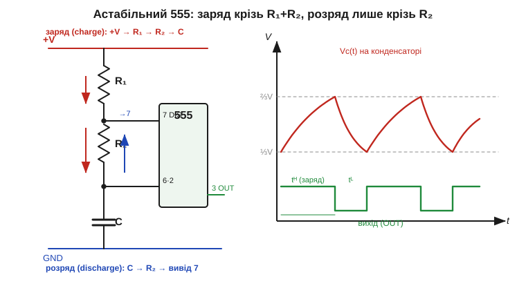
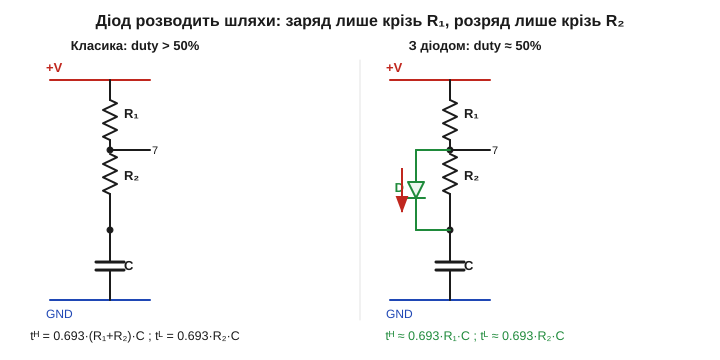

# 🧮 Формули астабільного 555: звідки 0.693 і чому шпаруватість завжди >50%

> Числова вставка до астабільного 555. Працює він так: конденсатор гойдається між порогами ⅓ і ⅔ живлення (їх задає [дільник із трьох резисторів по 5 кОм](book:electronics/555-internals)), а вихід перемикається на кожному дотику до порога. Тут цей механізм перетворено на **числа**: звідки береться множник 0.693, як порахувати частоту й тривалості, чому додатний імпульс завжди довший за від'ємний — і як одним діодом це виправити.

### Звідки 0.693: половина експоненти, а не вся

Усе зводиться до однієї формули [заряду RC-кола](book:electronics/rc-time-constant): конденсатор, що заряджається крізь резистор до напруги живлення, іде по експоненті

```
Vc(t) = V_кінц − (V_кінц − V_поч) · e^(−t/RC).
```

Стала часу τ = R·C — це не час повного заряду, а лише мітка «пройдено 63 % шляху». Але 555 ніколи не заряджає C до кінця: тригер ловить його на ⅔ живлення й перемикає на розряд, а розряд — на ⅓. Тобто нас цікавить не вся експонента, а **рівно той її шматок, що веде від ⅓ до ⅔ повної висоти**. Знайдімо, скільки це часу.

Підставмо межі. Заряд іде до стелі +V, стартуючи з ⅓V і фінішуючи на ⅔V. Зручно рахувати в частках того, що **лишилося до стелі**: на старті лишається ⅔ висоти (V − ⅓V), у кінці — ⅓ висоти (V − ⅔V). Відношення «лишку в кінці» до «лишку на старті» — це й є e^(−t/RC):

```
(V − ⅔V) / (V − ⅓V) = (⅓) / (⅔) = ½  =  e^(−t/RC).
```

Логарифмуємо обидві сторони:

```
t / RC = ln 2 = 0.6931…
t = ln2 · R·C ≈ 0.693 · R·C.
```

Ось де ховається славнозвісне **0.693** — це просто **ln 2** (*natural log of two*). І ось чому воно скрізь у даташитах 555: межі ⅓ і ⅔ підібрані так, що конденсатор завжди долає **рівно половину** залишку до стелі, а час пройти половину будь-якої експоненти — це завжди один і той самий ln 2 від сталої часу, **байдуже від рівня живлення**. Саме тому частота 555 від напруги майже не залежить — V скоротилася ще в рівнянні.


*Чому шпаруватість >50%. Заряд (червоні стрілки) тече з +V крізь R₁ і R₂ — стала часу (R₁+R₂)·C, схил пологий, час tᴴ великий. Розряд (синя стрілка) скидає C крізь сам вивід 7 (DISCHARGE) лише через R₂ — стала часу R₂·C менша, схил крутіший, час tᴸ коротший. Вихід (зелений) HIGH весь час заряду й LOW весь час розряду, тож додатний імпульс завжди ширший.*

### Дві різні сталі часу — і нерівність шпаруватості

Тепер — головна асиметрія схеми, видима на рисунку вище. Заряд і розряд ідуть **різними шляхами** з різним опором:

```
заряд  (вихід HIGH):  C набирає крізь R₁ + R₂   →  tᴴ = ln2 · (R₁ + R₂) · C ≈ 0.693·(R₁+R₂)·C
розряд (вихід LOW):   C стікає крізь сам R₂      →  tᴸ = ln2 ·  R₂      · C ≈ 0.693· R₂ ·C
```

Період і частота — сума двох часів:

```
T = tᴴ + tᴸ = 0.693 · (R₁ + 2·R₂) · C
f = 1 / T   = 1.44 / ((R₁ + 2·R₂) · C).
```

(Звідки 1.44? Це 1/ln2 ≈ 1.4427 — той самий ln 2, лише обернений.) **Шпаруватість** (*duty cycle*, D) — частка періоду, коли вихід HIGH:

```
D = tᴴ / T = (R₁ + R₂) / (R₁ + 2·R₂).
```

Подивіться на дріб: чисельник (R₁+R₂) завжди **менший** за знаменник (R₁+2·R₂) рівно на R₂. Тож поки R₂ > 0, маємо строго D > ½ — **додатний імпульс фізично не може бути коротшим за від'ємний**, бо заряд тягне зайвий резистор R₁, якого нема в шляху розряду. Підібратися до 50 % можна лише здалеку: узяти R₁ ≪ R₂ (тоді D → ½ зверху), та точної половини так не досягти, а малий R₁ небезпечний — у мить розряду вивід 7 фактично коротить R₁ на землю, і крізь нього б'є струм ≈ V/R₁.

> 🔧 **Навіщо це.** Якщо 555 тактує щось, де байдужа форма (блимавка, простий звуковий сигнал), стандартної формули досить. Але для **симетричного меандру** — тактовий вхід лічильника, несівна для ІЧ-пульта, half-bridge — несиметрія псує справу. Тоді або беруть діодний трюк нижче, або взагалі інший генератор. Знати формулу D — означає бачити цю пастку **до** того, як осцилограф покаже кривий меандр.

### Діодний трюк: розвести заряд і розряд

Раз асиметрію створює зайвий резистор у шляху заряду, то й позбутися її можна одним рухом — прибрати з цього шляху R₁, не чіпаючи розряд. Це робить один [діод](book:electronics/diode-bias), увімкнений **паралельно R₂** (анодом до виводу 7, катодом до конденсатора).


*Ліворуч — класика: заряд крізь R₁+R₂ дає D >50%. Праворуч — з діодом D: під час заряду струм з +V крізь R₁ обходить R₂ крізь відкритий діод (зелений шлях), тож tᴴ задає сам R₁; під час розряду діод під зворотною напругою закритий, і C стікає крізь R₂, як і раніше. Шляхи розведено — tᴴ і tᴸ керуються незалежно.*

Логіка діода проста: під час заряду на вивід 7 подається плюс, діод відкритий і **закорочує R₂**, тож заряд іде майже самим R₁; під час розряду полярність на діоді зворотна, він закритий і не заважає — розряд, як і був, крізь R₂. Часи розходяться:

```
tᴴ ≈ ln2 · R₁ · C   (заряд лише крізь R₁, мінус падіння на діоді)
tᴸ ≈ ln2 · R₂ · C   (розряд крізь R₂, як раніше)
D  ≈ R₁ / (R₁ + R₂).
```

Тепер, узявши R₁ = R₂, маємо D ≈ 50 % — чого без діода не діставали ніяк. Платою за це є невелика похибка від [падіння на діоді](book:electronics/diode-iv-curve) (≈0.6–0.7 В): воно трохи зсуває верхній поріг заряду, тому реальна шпаруватість виходить близько 50 %, а не точно в половину. Для строгої симетрії додають другий діод у плече розряду або беруть зовсім інший підхід — але для більшості задач одного діода досить.

**Приклад (звукова частота ~1 кГц).** Візьмемо R₁ = 1 кОм, R₂ = 6.8 кОм, C = 0.1 мкФ.

```
T  = 0.693 · (R₁ + 2·R₂) · C = 0.693 · (1000 + 13600) · 100·10⁻⁹
   = 0.693 · 14600 · 1·10⁻⁷ ≈ 1.012·10⁻³ с ≈ 1.01 мс
f  = 1 / T ≈ 988 Гц
D  = (R₁ + R₂)/(R₁ + 2·R₂) = 7800 / 14600 ≈ 0.534  →  53.4 %
```

Майже кілогерц і шпаруватість 53 % — типова «несиметрія» голого 555. Поставимо діод і візьмемо R₁ = R₂ = 6.8 кОм: tᴴ ≈ tᴸ, D ≈ 50 %, частота f ≈ 1.44/((2·R₂)·C) ≈ 1.06 кГц — той самий діапазон, але вже чистий меандр.

### Що з цього винести

Три формули — f, D і діодний трюк — це весь робочий апарат астабільного 555, і всі вони виросли з однієї [експоненти заряду RC-кола](book:electronics/rc-time-constant) та двох порогів [внутрішнього дільника](book:electronics/555-internals). Той самий ln 2 працює й у [моностабільному режимі](book:electronics/555-monostable), але там формула імпульсу t = 1.1·R·C містить уже **повний** перехід від нуля до ⅔ живлення — звідси інший множник, не 0.693. А вміння читати «яким шляхом тече струм у цю мить» — заряд це чи розряд, який резистор у колі — згодиться будь-де, де RC-коло перемикається між станами.
