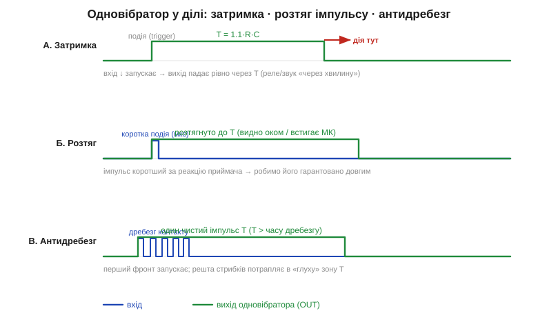
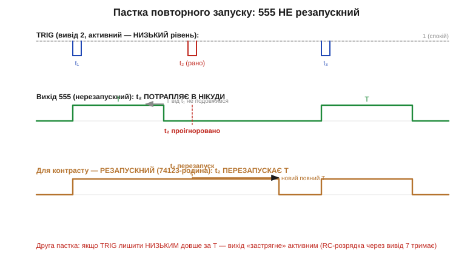

# ⚙️ Одновібратор у ділі: затримка, розтяг імпульсу, антибрязкіт — і пастка повторного запуску

> Це алгоритмічна вставка до теми [555 у моностабільному режимі](book:electronics/555-monostable). Сам **механізм** простий: один запуск — один імпульс тривалістю T = 1.1·R·C. Тут — **рецептура застосувань**: як тим самим імпульсом зробити затримку, розтягнути коротку подію, прибрати брязкіт кнопки. І головне — **пастка повторного запуску**: 555 поводиться не так, як підказує інтуїція, тож через необережну схему вмикання дістаємо або проковтнуті, або «застряглі» імпульси.

### Задача

В одновібратора одна функція — на запуск видати імпульс відомої тривалості. Але навколо цієї простої дії крутяться три щоденні задачі розробника, і всі вони — про **час**:

- **Затримка** (*delay*): зробити дію не зараз, а рівно через T після події (підсвітка згасає за хвилину; вентилятор крутиться ще трохи після вимкнення).
- **Розтяг** (*pulse stretch*): подія надто коротка, щоб її помітили — її треба гарантовано видовжити (голка на шині шириною в мікросекунди, яку око чи повільний вхід не побачать).
- **Антибрязкіт** (*debounce*): механічний контакт замикається не чисто, а серією стрибків на одиниці мілісекунд; з них треба зробити **один** чистий фронт.


*Один і той самий блок T = 1.1·R·C закриває три задачі. А — вихід падає рівно через T (дія — на задньому фронті). Б — мікросекундна подія стає імпульсом завдовжки T, який встигає побачити приймач. В — серія стрибків кнопки запускає рівно один імпульс, бо T довший за час брязкоту і решта фронтів потрапляє в «глуху» зону.*

### Ідея

Усі три задачі — це **той самий** одновібратор; різниця лише в тому, який край імпульсу ми вважаємо «корисним» і як добираємо T:

- для **затримки** діємо на **задньому** фронті виходу (передній — це момент події, задній — момент «через T»);
- для **розтягу** беремо T набагато більший за вхідний імпульс — вихід не залежить від того, наскільки коротким був запуск;
- для **антибрязкоту** беремо T трохи довшим за найдовший брязкіт контакту (типово 10–50 мс): перший стрибок запускає імпульс, а всі наступні впродовж T нічого не змінюють.

Останнє працює лише завдяки ключовій рисі 555: він **нерезапускний** (*non-retriggerable*) — поки імпульс активний, нові запуски ігноруються. Саме ця «глухота» й гасить брязкіт сама собою, без жодної додаткової логіки.

### Модель у коді

Поведінку 555 у моностабільному режимі зручно тримати в голові як скінченний автомат із двох станів — і рівно цей автомат легко відтворити на мікроконтролері. Структура зберігає стан і мітку часу старту, а функція опитування щоразу вирішує: тримати вихід «високо» чи вже пора його опустити. Роль конденсатора тут грає вільний лічильник мілісекунд, який є в кожного мікроконтролера (`millis()` в Arduino, `HAL_GetTick()` на STM32, `esp_timer_get_time()` в ESP-IDF), усе інше збігається з кремнієм один в один:

```c
#include <stdint.h>
#include <stdbool.h>

typedef enum { OS_IDLE, OS_ACTIVE } os_state_t;

typedef struct {
    os_state_t state;
    uint32_t   t_ms;      // тривалість імпульсу T = 1.1·R·C, у мілісекундах
    uint32_t   t_start;   // мітка часу, коли імпульс почався
} oneshot_t;

void oneshot_init(oneshot_t *os, uint32_t t_ms) {
    os->state = OS_IDLE;
    os->t_ms  = t_ms;
}

// trig — подія запуску (true рівно в момент спаду TRIG нижче ⅓V);
// now  — поточний час у мілісекундах (millis(), HAL_GetTick(), …).
// Повертає рівень виходу OUT.
bool oneshot_poll(oneshot_t *os, bool trig, uint32_t now) {
    if (os->state == OS_IDLE) {
        if (trig) {                 // подія — зводимо курок
            os->t_start = now;
            os->state   = OS_ACTIVE;
        }
    } else {                        // OS_ACTIVE: рахуємо, чи вийшов час
        // повторні запуски тут ІГНОРУЮТЬСЯ — 555 нерезапускний
        if (now - os->t_start >= os->t_ms) {
            os->state = OS_IDLE;    // імпульс добіг до кінця
        }
    }
    return os->state == OS_ACTIVE;
}
```

Одна тонкість, на якій легко спіткнутися: різницю `now - os->t_start` беремо в беззнаковому `uint32_t`. Коли 32-бітний лічильник мілісекунд переповниться (приблизно раз на 49 діб) і піде з нуля, беззнакове віднімання все одно дасть правильний проміжок — окремо ловити переповнення лічильника не треба.

Антибрязкіт — це той самий автомат плюс достатньо великий T. Ловимо на вході **спад** (момент натискання), а всі дальші стрибки контакту гасить стан `ACTIVE`, глухий до нових запусків. Заліза треба рівно два виводи будь-якого МК: вхід із **підтяжкою вгору** (кнопка замикає його на землю, тож натиснуто = низький рівень) і звичайний вихід. Далі — той самий цикл опитування; різняться лише назви — `pinMode`/`digitalRead` в Arduino, `gpio_config`/`gpio_get_level` в ESP-IDF, `HAL_GPIO_ReadPin` на STM32:

:::tabs
```arduino
#define BTN_PIN 2
#define OUT_PIN 3

oneshot_t btn;

void setup(void) {
    pinMode(BTN_PIN, INPUT_PULLUP);   // кнопка замикає вхід на землю
    pinMode(OUT_PIN, OUTPUT);         // сюди виходить чистий імпульс
    oneshot_init(&btn, 30);           // T = 30 мс, трохи довше за брязкіт
}

void loop(void) {
    static bool prev = true;               // рівень входу з попереднього кола
    bool level   = digitalRead(BTN_PIN);   // LOW = натиснуто
    bool falling = prev && !level;         // спад = момент натискання
    prev = level;

    // рівно один імпульс 30 мс на натискання: перший спад запускає ACTIVE,
    // а всі дальші стрибки контакту в ці 30 мс потрапляють у «глуху» зону
    digitalWrite(OUT_PIN, oneshot_poll(&btn, falling, millis()));
}
```
```esp-idf
#include "driver/gpio.h"
#include "esp_timer.h"
#include "freertos/FreeRTOS.h"
#include "freertos/task.h"

#define BTN_GPIO GPIO_NUM_4
#define OUT_GPIO GPIO_NUM_5

void debounce_task(void *arg) {
    gpio_config_t in = {                       // кнопка замикає вхід на землю
        .pin_bit_mask = 1ULL << BTN_GPIO,
        .mode         = GPIO_MODE_INPUT,
        .pull_up_en   = GPIO_PULLUP_ENABLE,
    };
    gpio_config(&in);
    gpio_config_t out = {                      // сюди виходить чистий імпульс
        .pin_bit_mask = 1ULL << OUT_GPIO,
        .mode         = GPIO_MODE_OUTPUT,
    };
    gpio_config(&out);

    oneshot_t btn;
    oneshot_init(&btn, 30);                    // T = 30 мс, трохи довше за брязкіт
    bool prev = true;

    for (;;) {
        bool level   = gpio_get_level(BTN_GPIO) != 0;   // 0 = натиснуто
        bool falling = prev && !level;
        prev = level;

        uint32_t now = (uint32_t)(esp_timer_get_time() / 1000);  // мкс → мс
        gpio_set_level(OUT_GPIO, oneshot_poll(&btn, falling, now));
        vTaskDelay(pdMS_TO_TICKS(1));          // крок опитування
    }
}
```
```stm32
#include "main.h"   // BTN_GPIO_Port/BTN_Pin, OUT_GPIO_Port/OUT_Pin — з CubeMX:
                    // вхід GPIO_MODE_INPUT + GPIO_PULLUP, вихід GPIO_MODE_OUTPUT_PP

int main(void) {
    HAL_Init();
    SystemClock_Config();
    MX_GPIO_Init();                    // піни налаштовано генератором

    oneshot_t btn;
    oneshot_init(&btn, 30);            // T = 30 мс, трохи довше за брязкіт
    bool prev = true;

    while (1) {
        // підтяжка вгору: RESET = натиснуто
        bool level   = (HAL_GPIO_ReadPin(BTN_GPIO_Port, BTN_Pin) == GPIO_PIN_SET);
        bool falling = prev && !level;
        prev = level;

        // рівно один імпульс 30 мс на натискання: перший спад запускає ACTIVE,
        // а всі дальші стрибки контакту в ці 30 мс потрапляють у «глуху» зону
        HAL_GPIO_WritePin(OUT_GPIO_Port, OUT_Pin,
                          oneshot_poll(&btn, falling, HAL_GetTick())
                              ? GPIO_PIN_SET : GPIO_PIN_RESET);
    }
}
```
:::

### Складність і пастки на «МК»

На самому 555 коду нема — «складність» тут вимірюється підводними каменями схеми. Їх три, і всі болючі.


*Три запуски TRIG. Угорі — нерезапускний 555: запуск t₂ під час активного імпульсу просто зникає («в нікуди»), а відлік T від t₁ не подовжується. Унизу для контрасту — резапускний одновібратор (родина 74122/74123): t₂ перезапускає відлік, тож вихід тягнеться t₂ + T. Це дві протилежні поведінки — плутати їх не можна.*

**1. 555 нерезапускний — і це і дар, і пастка.** Дар: для антибрязкоту не треба нічого, окрім великого T. Пастка: якщо потрібно, щоб кожна подія **подовжувала** імпульс (класичний «retriggerable one-shot» — світло горить, доки в кімнаті є рух, і ще T після останнього), то 555 у звичайному ввімкненні **не годиться**: ранній запуск він проковтне. Тут беруть резапускну логіку (74123-клас) або скидають конденсатор перед кожним запуском.

**2. TRIG, що залишився низьким, «застрягає» вихід.** Вивід 2 (*trigger*) реагує на **рівень**, а не на фронт. Якщо тримати його низьким **довше за T**, внутрішній компаратор не дасть тригеру скинутись — вихід застрягне активним, доки TRIG не повернеться високим. Тому кнопку чи давач на вхід заводять **через диференціювальне RC-коло** (короткий «голчастий» імпульс на вивід 2), а не напряму: інакше довге натискання дасть не імпульс T, а імпульс «доки тримаю».

**3. T живе доти, доки заряджається C — отже плаває з ним.** Точність імпульсу — це точність R і C. Електролітичний конденсатор із розкидом −20…+80 % і витоком перетворить «рівно 100 мс» на «десь від 80 до 180 мс». Для антибрязкоту це байдуже (аби T був «достатньо великим»), а для каліброваної затримки — беріть плівковий C і резистор 1 %.

> 🔧 **Навіщо це.** Одновібратор — це «таймер на одну подію»: затримка, розтяг короткого, чистий фронт із брудного контакту — усе це той самий блок T = 1.1·R·C, треба лише обрати корисний край і добрати T. Але запам'ятайте дві речі, на яких спотикаються найчастіше. По-перше, 555 **нерезапускний**: ранній повторний запуск він ігнорує — це чудово для антибрязкоту, але робить його непридатним для «світла за рухом» без додаткової логіки. По-друге, його вхід реагує на **рівень**: заводьте подію коротким імпульсом через RC, інакше довге натискання «застрягне» вихід активним замість видати рівний імпульс.
