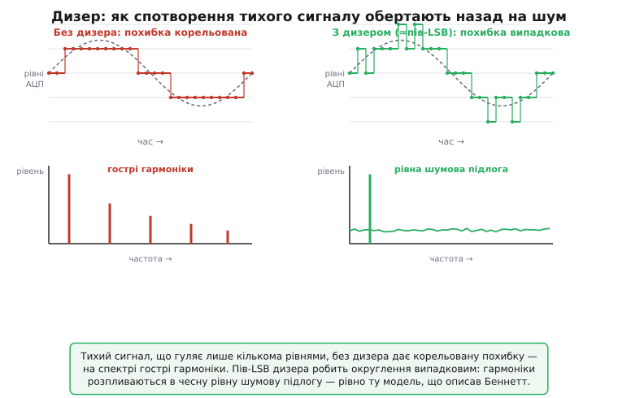

# 📜 Хто і як зрозумів, що округлення — це шум

Округлення до найближчого рівня здається найбезневиннішою операцією на світі. Ви маєте 1.7 і маєте сітку цілих — пишете 2. Маєте 1.3 — пишете 1. Жодної таємниці, жодної фізики: чиста арифметика, яку вчать у початковій школі. І от ця сама арифметика, коли її повторити мільйони разів на секунду в телефонній лінії, раптом починає **сичати** — додає до голосу рівне шипіння, неначе десь увімкнули кепський підсилювач. Звідки шипіння, якщо ми лише округлюємо? Адже округлення — дія цілком визначена: тому самому входу завжди відповідає той самий вихід, нічого випадкового тут немає.

Ця загадка — як строго детерміноване округлення породжує щось, що поводиться як випадковий шум, — мучила інженерів зв'язку всю другу половину 1930-х і всі 1940-ті. Розв'язали її не одним осяянням, а кількома кроками різних людей; і найгостріший, найточніший крок зробив 1948 року в Bell Labs інженер на ім'я Вільям Беннетт. Він узяв розпливчасте інженерне відчуття «та похибка квантування ніби як шум» і обернув його на сувору теорему: за яких саме умов спектр похибки рівний, чому її можна рахувати як шум, — і де ця зручна картина ламається. Нижче — як до цього дійшли, хто бентежився, у чому була суперечка й чому без неї жоден сучасний АЦП не мав би свого паспортного числа якості.

## Чому проблема народилася саме в телефонії

Щоб зрозуміти, **навіщо** комусь узагалі знадобилося квантувати сигнал — а отже, страждати від похибки квантування, — треба повернутися до головного болю міжміського телефонного зв'язку. Голос, що йде дротом за сотні кілометрів, слабшає; його доводиться раз за разом підсилювати проміжними підсилювачами (репітерами). Біда в тому, що підсилювач підсилює **все** — і голос, і той шум, що вже наліз на лінію. Кожен наступний репітер додає свою порцію шуму до вже зашумленого сигналу, і шум **накопичується** вздовж усієї траси. Що довша лінія — то більше репітерів — то гірший звук на тому кінці. Аналоговий сигнал зношується дорогою, як монета, що пройшла через тисячу рук.

Британський інженер **Алек Рівз** (Alec Harley Reeves, 1902–1971), працюючи у французькому відділенні компанії ITT під Парижем, 1937 року дійшов до думки, яка цей головний біль прибирала в корені. А що, як не передавати голос **як неперервну хвилю** взагалі? Що, як заміряти його амплітуду багато разів на секунду, кожен замір записати **числом**, а далі гнати лінією не тендітну хвилю, а грубі, чіткі **імпульси** цього числа — двійкові, «є імпульс / нема імпульсу»? Тоді репітерові не треба точно відтворювати форму — йому досить **розрізнити**, був імпульс чи ні, і вистрелити **свіжий**, чистий імпульс далі. Шум на лінії, поки він менший за півамплітуди імпульсу, просто **відкидається** на кожному кроці: його не передають далі, його щоразу стирають. Сигнал перестає зношуватися. Це і є **імпульсно-кодова модуляція** (PCM, *pulse-code modulation*) — Рівз подав на неї французький патент 1938 року, а американський (US 2 272 070) йому видали 1943-го.

> 🔧 **Навіщо це.** Уся цифрова обробка сигналу починається саме з цього прозріння Рівза: число регенерується без втрат, хвиля — ні. Кожен АЦП у вашій прошивці — прямий нащадок тієї паризької ідеї 1937 року. І та сама причина, що зробила PCM привабливою (число можна точно повторити), породила її фундаментальну ціну: щоб записати замір **числом**, його треба підігнати до скінченної сітки рівнів — тобто **округлити**. Зиск і ціна тут — дві сторони однієї монети.

Та ось у чому пастка, яку Рівз бачив, але точно оцінити ще не міг. Замінивши неперервну амплітуду найближчим числом зі скінченного набору, ми викидаємо все, що було **між** рівнями. Голос, що насправді мав 1.736 рівня, поїде лінією як «2» — і на тому кінці відновиться як рівне «2», без тих 0.264, що загубилися при округленні. Ці втрачені дрібки і є **похибка квантування**. PCM купує собі несхибну передачу ціною того, що сам сигнал на вході вже **спотворено** округленням — і це спотворення жоден ідеальний репітер уже не виправить, бо воно вшите в саме число. Питання, яким перейнялися інженери Bell Labs, було просте на словах і підступне по суті: **наскільки** псує сигнал це округлення — і на що та псувань схожа?

## Дві загадки: чому це звучить як шум — і чому інколи ні

Перші ж досліди з PCM-голосом виявили дивну двоїстість, що збивала з пантелику. Коли лінією йшла нормальна жвава мова — з її переливами, придихами, шумом дихання, — похибка квантування на слух була **рівним шипінням**, ні на що в самому голосі не схожим: просто тихий рівний шум на тлі. Поводилася вона достоту як звичайний тепловий шум, від якого PCM нібито мала рятувати. Прикро, але зрозуміло: ну є якийсь залишковий шум, хай і він.

А от друга половина загадки була справді бентежна. Коли на вхід подавали щось **тихе й рівне** — наприклад, повільно завмираючу ноту, тиху витримувану голосну, хвіст згасаючого звуку, — шипіння раптом **зникало**, а натомість лізло щось значно гірше: деренчливе, «зернисте» спотворення, чітко **прив'язане до самого звуку**. Воно мінялося разом із тоном, мало присмак самої ноти — і саме на тихому, де вухо найчутливіше до бруду, лізло найнахабніше. Та сама операція округлення в одному випадку давала безневинний рівний шум, а в іншому — огидне корельоване деренчання. **Чому одне й те саме округлення поводиться так по-різному?**

Інженерне чуття підказувало відповідь, але строго обґрунтувати її ніхто не міг. Відчуття було таке: коли сигнал **великий і метушливий**, він перескакує через багато рівнів за раз, і на яку саме частку рівня ляже черговий замір — щоразу мовби «як пощастить», без ладу. Похибка стрибає туди-сюди в межах ±півкроку безсистемно — і виходить **шум**. А коли сигнал **малий і повільний**, він ледь повзе одним-двома рівнями; округлення на сусідніх замірах виходить майже однакове, похибка йде **гладкою, впорядкованою хвилею**, що дзеркалить сам сигнал, — і виходить **спотворення**, а не шум. Картинка переконлива. Та одне діло — намалювати її руками на дошці, інше — **довести**: справді спектр похибки на жвавому сигналі рівний? точно білий? за яких саме умов? і де межа, за якою картинка валиться? Бракувало математики. І 1948 року вона з'явилася.

*Та сама двоїстість, що бентежила інженерів PCM, на одній картинці. Ліворуч — тихий повільний сигнал без дизера: округлення на сусідніх замірах однакове, похибка корельована, на спектрі — гострі гармоніки (деренчання). Праворуч — підмішали пів-LSB шуму: округлення знову випадкове, гармоніки розпливаються в рівну шумову підлогу. Це і є чесний шум квантування, який описав Беннетт.*

## Беннетт, 1948: коли спектр похибки таки рівний

Чоловік, що навів тут лад, — **Вільям Ралф Беннетт-старший** (William Ralph Bennett, 1904–1983), народжений у Де-Мойні, штат Айова, інженер-електрик за освітою (бакалаврат Орегонського державного коледжу, 1925), того ж 1925 року прийнятий до Bell Telephone Laboratories. (Не плутати з його сином — **Вільямом Р. Беннеттом-молодшим**, 1930–2008, фізиком, що 1960 року в тих самих Bell Labs разом з Алі Джаваном (Ali Javan) і Дональдом Герріоттом (Donald Herriott) запустив перший газовий гелій-неоновий лазер. Батько — теоретик шуму та зв'язку; син — лазерник. Прізвище й місце роботи однакові, царини різні.) Беннетт-старший усе життя займався саме **шумом** — як він народжується, як його рахувати, як із ним боротися; згодом, 1960 року, він видав книжку «Electrical Noise», що стала класикою теми. Тож коли постало питання про природу похибки квантування, людина, краще за нього готова до відповіді, навряд чи знайшлася б.

Праця називалася стримано — **«Spectra of Quantized Signals»** («Спектри квантованих сигналів»), вийшла в **Bell System Technical Journal**, том 27, сторінки 446–472, у **липні 1948** року. (Той самий журнал, той самий рік, коли Клод Шеннон (Claude Shannon) друкував там-таки свою «A Mathematical Theory of Communication», — Bell Labs тоді переживали справжній вибух ідей про інформацію та шум.) Назва каже геть мало; зміст же був точно той, якого бракувало: **сувора спектральна теорія того, як виглядає похибка квантування на частоті**.

Серце роботи Беннетта — таке. Він узяв вхідний сигнал, що **жваво й широко гуляє** рівнями (формально — досить складний і досить великий, щоб амплітуда сягала багатьох кроків квантування), і показав, що за цих умов спектр похибки округлення **рівний** — її потужність розмазана однаково по всій смузі від нуля до половини частоти замірів. Іншими словами: на жвавому сигналі похибка квантування **математично нерозрізненна з білим шумом**. Не «схожа на шум», не «приблизно шум» — а має рівно той самий рівний спектр, що й справжній випадковий шум. А коли потужність шуму рівномірно розмазана по смузі, її **повне** значення можна порахувати, **не вникаючи** в деталі того, з яких саме частот вона складена. Це й розчищало шлях до простої формули: повна потужність похибки — це просто q²/12 (середній квадрат рівномірного розкиду на відрізку завширшки в крок q), і вона лягає рівним килимом на весь спектр. Уся арифметика «q/√12», «6.02·N + 1.76», «передискретизація додає розряд» виростає саме з цієї **рівності спектра**, яку Беннетт довів першим і строго.

> 🔧 **Навіщо це.** Кожне число, яким ви сьогодні характеризуєте АЦП, спирається на теорему Беннетта про білість. Коли в даташиті пишуть «SNR 74 дБ» чи «ENOB 13.2», за цим стоїть мовчазне припущення: похибка квантування — білий шум, розмазаний по всій смузі Найквіста рівно. Саме тому передискретизація працює (білий шум розтягується по ширшій смузі — у вузькій смузі сигналу його меншає), саме тому шумова підлога на FFT лежить нижче за SNR (білий шум ділиться між сотнями кошиків). Усе це — наслідки рівності спектра, яку 1948 року вивів Беннетт. Без неї теорія квантування лишилася б купою емпіричних спостережень без єдиного стрижня.

Та чесний теоретик завжди показує не лише де його модель **працює**, а й де вона **валиться**, — і тут Беннеттова робота особливо цінна. Він-бо й окреслив **межі**. Рівний спектр виходить **лише** за «жвавого» сигналу. На сигналах тихих, повільних, простих — на тих самих згасаючих нотах, що деренчали в перших дослідах PCM, — умова порушується, похибка **корелює** з сигналом, і її спектр уже **не рівний**: він збирається в гострі **гармоніки**, прив'язані до сигналу. Тобто Беннетт не лише довів «це шум», а й точно сказав, **коли** це шум, а коли — спотворення. Він дав інженерам і зручну модель, і чесне попередження, де нею користуватися не можна. Друга загадка — чому на тихому лізе деренчання — діставала строге пояснення: бо там умова білості не виконана.

## Зворотний хід думки: а зробімо шум навмисне

Лишалося питання радше практичне, ніж теоретичне. Гаразд, на тихих сигналах квантування деренчить гармоніками замість того, щоб чесно шуміти. Ну то й що з цим робити? Не передавати тихих звуків? Безглуздя. І тут хтось — не одразу, а поступово, кількома руками — додумався до ходу, що спершу звучить як знущання з інженерного глузду: **а підмішаймо до сигналу трохи шуму навмисне**.

Логіка цього парадоксу прозора, щойно її розкласти. Деренчання береться з того, що сигнал **застрягає** між рівнями: повзе тихо, округлення на сусідніх замірах однакове, похибка йде гладкою корельованою хвилею. А що, як **розхитати** сигнал — додати йому крихітну тремтячу добавку, замалу, щоб її було чути, але досить велику, щоб збити те застрягання? Тоді на яку частку рівня ляже черговий замір, знову стає **як пощастить** — округлення робиться випадковим, похибка втрачає зв'язок із сигналом, гармоніки **розпливаються** назад у рівний шум. Ми навмисне виконуємо Беннеттову умову «жвавості» — підкидаємо сигналові тієї метушні, якої йому бракувало, щоб похибка стала білою. Платимо за це крихтою доданого шуму — а взамін **прибираємо** деренчання, яке вухо ловить куди гостріше за рівне шипіння.

Цей навмисний шум назвали **дизером** (англ. *dither* — тремтіння, дрож). І назва, і саме явище мають несподівано стару й майже легендарну передісторію — ще з-перед усякої цифрової техніки. Кажуть, у Другу світову бомбардувальники несли на борту механічні балістичні обчислювачі — коробки, напхані сотнями шестерень, що рахували траєкторію бомби. І помітили дивне: **в повітрі** ці машинки рахували **точніше**, ніж на землі. Розгадка — вібрація літака: дрібне тремтіння **розхитувало** шестерні, не даючи їм залипати в тертя спокою, і похибка від «застрягання» меншала. Подейкують, інженери потім навіть ставили в наземні обчислювачі маленькі вібромоторчики — спеціально, щоб трусити механізм. Тремтіння (dither), що **зменшує** похибку залипання, — ця ідея перекочувала з механіки прямо в теорію квантування: там сигнал так само «залипає» між рівнями, і так само його рятує дрібне підтрушування. *(Воєнну історію подають як галузевий переказ — за дати й конкретні машини в ній ручатися важко; та сам механізм, де дрож збиває залипання, цілком реальний і добре задокументований у повоєнних книжках з аналогових обчислень.)*

> 🔧 **Навіщо це.** Дизер — не екзотика звукорежисерів, а штатний інструмент будь-кого, хто оцифровує слабкі сигнали. Заводите в АЦП тихий чистий сенсорний сигнал, що гуляє лише кількома молодшими розрядами, — і бачите на спектрі не рівну підлогу, а гострі паразитні гармоніки? Це деренчання Беннетта. Лік той самий, що й у звукозаписі: підмішати на вхід трохи широкосмугового шуму (часто його й так дає сам тракт — тоді дизер виходить «безкоштовно»), щоб збити залипання й повернути похибці статус чесного білого шуму. Інколи власного шуму бракує, і тоді розробники **спеціально** додають дизерний генератор — рівно як ті вібромоторчики в наземних обчислювачах.

## Дизер дорослішає: від картинок до точної дози

Від воєнної легенди до строгого інженерного прийому дизер ішов ще не одне десятиліття, і перший задокументований крок зробив не звукозапис, а **обробка зображень**. 1961 року в Массачусетському технологічному інституті (MIT) аспірант **Лоренс Робертс** (Lawrence G. Roberts — згодом один із батьків ARPANET, прямого предка інтернету) у магістерській роботі, а потім у статті **«Picture Coding Using Pseudo-Random Noise»** (лютий 1962), показав: якщо перед грубим квантуванням картинки **підмішати** до неї псевдовипадковий шум, то бридкі різкі «сходинки» яскравості (контурні смуги на плавних градієнтах) **розпливаються** і око сприймає зображення як значно плавніше. Робертс ще не вживав слова «дизер», але робив рівно те, що ми тепер ним звемо: **руйнував кореляцію** похибки квантування з сигналом, обертаючи видимі гармоніки-смуги на непомітне зерно шуму.

Лишалося відповісти на головне інженерне питання: **скільки** саме шуму додавати? Замало — деренчання не зникне; забагато — самі заллєте сигнал зайвим шумом. Тут уже потрібна була теорія, не чуття. Її довели до пуття у 1980-х фахівці з цифрового звуку, надто **Стенлі Ліпшиц** (Stanley P. Lipshitz) і **Джон Вандеркой** (John Vanderkooy) з Університету Ватерлоо (Канада): вони строго розібрали, що різні **форми розподілу** дизерного шуму поводяться по-різному, і знайшли оптимум. Виявилося, що найкраще працює дизер не з рівномірним, а з **трикутним** розподілом імовірності (TPDF, *triangular probability density function*) розмахом приблизно в **один крок квантування** (1 LSB від краю до краю) — саме він і збиває гармоніки, і не дає рівневі шуму «дихати» (помітно гуляти разом із сигналом). Звідси й житейське правило звукорежисера — «підмішай десь із пів-LSB дизеру»: достатньо, щоб похибка стала чесним некорельованим шумом, і не настільки, щоб помітно підняти шумову підлогу.

Так замкнулося коло, що почалося з паризького прозріння Рівза. Спершу квантування **здавалося** безневинним округленням. Беннетт довів, що на жвавому сигналі його похибка **є** білий шум — і чесно вказав, що на тихому це вже не так. А інженери, від воєнних обчислювачів через Робертсові картинки до теорії цифрового звуку, навчилися **повертати** тихим сигналам ту жвавість штучно — крихтою дизеру, — щоб похибка скрізь лишалася чесним шумом, який Беннетт умів рахувати. Тепер, коли ви прикидаєте SNR ідеального АЦП за формулою 6.02·N + 1.76, ви спираєтеся рівно на цей ланцюжок: на те, що похибка квантування біла (Беннетт, 1948), а там, де вона сама по собі білою не виходить, її такою **роблять** дизером. Безневинне шкільне округлення виявилося цілою главою теорії шуму — і досі лежить в основі кожного аналого-цифрового перетворення.

## Що варто винести з цієї історії

Похибка квантування — не банальне округлення, а явище з власною теорією, що народилося з дуже конкретної інженерної потреби. Проблема прийшла з **телефонної PCM** (Алек Рівз, ідея 1937, патенти 1938/1943): щоб число регенерувалося лінією без втрат, замір треба підігнати до скінченної сітки рівнів — тобто округлити, а отже, **зіпсувати**. Перші досліди показали дивну двоїстість: на жвавому голосі це звучало як рівний шум, на тихих згасаючих звуках — як деренчливе спотворення. Розв'язав загадку **Вільям Беннетт** у праці «Spectra of Quantized Signals» (BSTJ, т. 27, с. 446–472, липень 1948): за **жвавого** сигналу спектр похибки **рівний** (білий), тож її можна рахувати як шум, — і це **ламається** на тихих, повільних, простих сигналах, де похибка корелює із сигналом і збирається в гармоніки. Звідси прямий практичний хід — **дизер**: навмисне підмішати крихту шуму (з історичним корінням у вібрації воєнних обчислювачів, із першою цифровою реалізацією в Робертса 1962 на зображеннях і строгою теорією Ліпшиця-Вандеркоя в 1980-х на звуці), щоб збити «залипання» тихого сигналу між рівнями й повернути похибці статус чесного некорельованого шуму. Усі звичні формули теорії квантування спираються саме на Беннеттову білість; а там, де її від природи нема, її створюють дизером.
