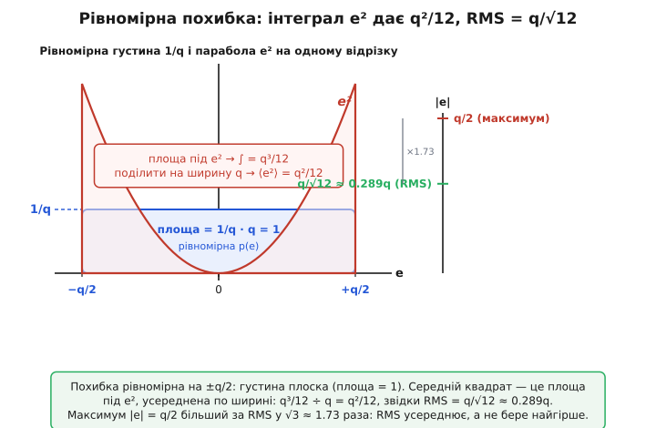
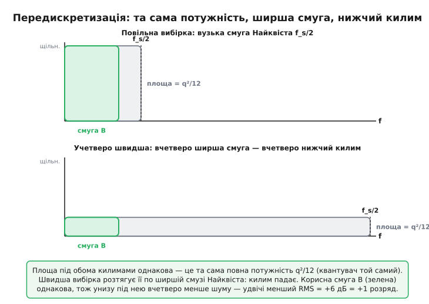

# 🧮 Математика шуму квантування: від інтеграла рівномірного розподілу до 6.02·N + 1.76

Стаття дає три числа й користується ними як готовими: середньоквадратичний шум квантування дорівнює q/√12, гранична якість ідеального АЦП — 6.02·N + 1.76 дБ, а сам шум білий, тож передискретизація викуповує по розряду точності. Усі три — не аксіоми, а **наслідки**, і кожен виводиться з нуля кількома рядками інтеграла та алгебри. Завдання цієї вставки — пройти ці виведення до кінця, не пропускаючи жодного кроку, щоб дванадцятка перестала бути магічним числом із підручника, а √1.5 у формулі SNR стало видно як те, чим воно є насправді: відношення двох коренів, один від синуса, другий від рівномірного шуму.

Підемо тим самим шляхом, яким ішла теорія. Спершу — точне означення середнього квадрата похибки як інтеграла, бо саме з нього падає q²/12; тут варто згадати, що цей самий інтеграл порахував ще 1898 року Вільям Шеппард, задовго до будь-яких АЦП, для зовсім іншої задачі — поправки до дисперсії згрупованих даних. Тоді — спектральний аргумент Беннетта: **чому** потужність q²/12 розмазана рівно по всій смузі, а не сидить горбом на якійсь частоті, і як саме звідси випливає виграш передискретизації 10·log₁₀(OSR). Далі — повне виведення SNR з відношення двох RMS, із чесним скороченням кроку q. І наприкінці — що змінюється, коли округлення до найближчого рівня замінюють на просте відсікання молодших розрядів: RMS той самий, але з'являється стала складова, якої при округленні не було.

## Означення RMS: чому саме корінь із середнього квадрата

Перш ніж інтегрувати, варто зрозуміти, **чому** мірою шуму є середньоквадратичне, а не, скажімо, середнє за модулем чи максимум. Відповідь — у тому, що потужність будь-якого коливання пропорційна **квадрату** амплітуди (потужність на резисторі — це U²/R), а потужності різних незалежних джерел **додаються**. Тож коли ми хочемо порівняти внесок шуму з внеском сигналу в спільну потужність, єдина чесна валюта — це середній квадрат величини, а не сама величина. Корінь із нього повертає нас назад у вольти, даючи число, яке грає **ту саму потужність**, що й еквівалентна стала напруга. Саме тому всюди в шумовій інженерії живе RMS (*root mean square* — корінь із середнього квадрата), а не якась простіша усереднена міра.

> 🔧 **Навіщо це.** Це не педантизм, а причина, чому шуми складаються «по квадратах». Якщо в тракті два незалежні джерела шуму — квантування q/√12 і тепловий шум давача e_т, — їхні RMS не додаються прямо, а як √(квадрат + квадрат): e_заг = √(e_кв² + e_т²). Звідси й випливає головне практичне правило статті: коли одне джерело помітно більше за інше, менше **майже не змінює суму** (бо під коренем додається малий квадрат до великого). Саме тому немає сенсу нарощувати розрядність АЦП, поки його шум квантування вже й так нижчий за тепловий шум давача — у квадратурній сумі він просто зникне.

Тепер запишімо означення середнього квадрата для величини, що набуває значень із певним розподілом імовірності. Якщо похибка e — випадкова з густиною ймовірності p(e), то її середній квадрат (він же дисперсія, бо середнє самої похибки нульове) — це інтеграл квадрата, зваженого густиною:

```
⟨e²⟩ = ∫ e² · p(e) de        (по всіх можливих e)
```

Уся подальша справа — підставити сюди конкретну p(e) для квантування й узяти інтеграл. Тож наступний крок — обґрунтувати, чому ця густина саме **рівномірна**.

## Чому розподіл рівномірний: модель і її межа

Похибка квантування e = U_справжня − U_квантована при округленні до найближчого рівня завжди лежить у смузі [−q/2, +q/2] — це чиста геометрія сходинок. Але **обмеженість** смуги ще не означає **рівномірність** усередині неї. Щоб середній квадрат брався так просто, треба, щоб усі значення похибки в цій смузі були **однаково ймовірні** — щоб густина p(e) була плоскою.

Чому вона плоска? Уявімо, що вхідна напруга гуляє діапазоном, перетинаючи багато рівнів, і дивимося, на яку **частку кроку** ляже черговий відлік. Якщо сигнал жвавий і не корельований дрібно з сіткою рівнів, то ця частка — фактично рівномірно розкидана між «щойно над рівнем» (e → −q/2) і «майже біля наступного» (e → +q/2): немає причини, чому якесь одне положення в межах кроку траплялося б частіше за інше. Формально це наслідок такого факту: якщо взяти будь-яку досить гладку густину вхідного сигналу й «згорнути» її за модулем кроку q (а саме це робить операція квантування — відкидає ціле число кроків, лишаючи залишок), то на масштабі одного кроку результат вирівнюється в плоский. Чим дрібніший крок проти масштабу, на якому сигнал помітно змінюється, тим точніше залишок стає рівномірним. Це і є **припущення високої роздільності**, на якому стоїть уся класична теорія.

Густина рівномірного розподілу на відрізку завширшки q мусить інтегруватися в одиницю (повна ймовірність), тож її висота — обернена до ширини:

```
        ⎧ 1/q,   якщо −q/2 ≤ e ≤ +q/2
p(e) =  ⎨
        ⎩ 0,     поза цим відрізком
```

Висота 1/q — не довільна: площа під p(e) має дорівнювати одиниці, а площа прямокутника висотою 1/q й шириною q і є рівно 1. Ось ця густина й піде в інтеграл.

Межа моделі варта окремого слова, бо саме об неї спотикаються на практиці. Усе виведення тримається на тому, що залишок-за-модулем-кроку **рівномірний і не корельований із сигналом**. Для тихого, повільного, чистого синуса, що гуляє лише трьома-чотирма рівнями, це **неправда**: похибка тоді жорстко прив'язана до фази сигналу, її густина — не плоский прямокутник, а щось горбате, і на спектрі вона сідає не килимом, а гострими гармоніками. Лік від цього — [дизер](book:electronics/adc-quantization/hist-quantization-noise.md): підмішати на вхід трохи власного шуму, щоб залишок знову став рівномірним і незалежним.

> Як саме Беннетт у Bell Labs 1948 року вперше показав межі цієї моделі, і як інженери навчилися навмисне додавати крихітний шум (дизер), щоб повернути тихим сигналам статус чесного шуму, — у нарисі [хто і як зрозумів шум квантування](book:electronics/adc-quantization/hist-quantization-noise.md).

## Інтеграл: звідки падає q²/12

Тепер головне обчислення вставки. Підставмо плоску густину p(e) = 1/q в означення середнього квадрата. Оскільки p(e) поза відрізком [−q/2, +q/2] дорівнює нулю, інтеграл звужується саме до цього відрізка, а сталу 1/q виносимо за знак:

```
                    +q/2                    +q/2
⟨e²⟩ = ∫ e²·(1/q) de  =  (1/q) · ∫ e² de
                    −q/2                    −q/2
```

Усе звелося до одного шкільного інтеграла — площі під параболою e² на відрізку. Первісна від e² — це e³/3. Підставмо межі:

```
  +q/2
  ∫ e² de = [ e³/3 ]   = (q/2)³/3 − (−q/2)³/3
  −q/2

          = (q³/8)/3 − (−q³/8)/3
          = q³/24 + q³/24
          = q³/12
```

Зверніть увагу на красу симетрії: обидва плеча, додатне й від'ємне, дають **однаковий** додатний внесок q³/24 (бо куб від'ємного числа від'ємний, але мінус перед ним обертає його на плюс), і разом виходить q³/12. Тепер поділимо на ширину q (та сама 1/q, що чекала за дужкою):

```
⟨e²⟩ = (1/q) · q³/12 = q²/12
```

Ось вона, та сама дванадцятка — народжена не з якоїсь глибокої властивості природи, а суто з геометрії: **інтеграл квадрата по симетричному відрізку, поділений на його ширину, завжди дає квадрат ширини на дванадцять**. Корінь повертає нас у вольти:

```
e_rms = √⟨e²⟩ = √(q²/12) = q/√12 = q/(2√3) ≈ 0.2887 · q
```

Підкреслімо, що це властивість **будь-якого** рівномірного розподілу, не лише квантування: для рівномірної величини шириною w її середньоквадратичне відхилення навколо центру дорівнює w/√12. У нас w = q, звідси q/√12. Те саме число 1/12 виринає скрізь, де є рівномірний розподіл, — і не випадково: саме його ще 1898 року вивів Вільям Шеппард, рахуючи **поправку до дисперсії згрупованих даних** (коли неперервні вимірювання загнали в стовпчики гістограми шириною h, обчислена з них дисперсія завищена рівно на h²/12 — це й досі звуть поправкою Шеппарда). Округлення до рівнів АЦП і групування даних у стовпчики — математично та сама операція, тож і поправка та сама; теорія шуму квантування успадкувала свою дванадцятку прямо звідти.

Варто закарбувати різницю двох чисел, які легко сплутати. **Максимальна** похибка округлення — це q/2 (півкроку, найгірший випадок, коли напруга рівно посередині між рівнями). А **середньоквадратична** — це q/√12 ≈ 0.289q, помітно менша за півкроку. Різниця між ними — це різниця між «найгіршим» і «типовим»: RMS усереднює по всьому відрізку, де більшість значень похибки далекі від країв ±q/2, тож типовий внесок суттєво менший за максимальний. Плутати їх — поширена помилка, що дає завищену на 1.76 дБ оцінку шуму.


*Похибка квантування рівномірно розподілена між −q/2 і +q/2: густина — плоский прямокутник висотою 1/q (його площа дорівнює одиниці). Середній квадрат — це площа під параболою e², усереднена по ширині відрізка: інтеграл дає q³/12, поділення на ширину q — рівно q²/12. Максимум похибки (±q/2) удвічі з гаком більший за її RMS (≈0.289q): RMS усереднює, а не бере найгірше.*

## Спектральний аргумент Беннетта: чому шум білий

Дотепер ми знайшли **повну** потужність шуму — число q²/12. Але інженера часто цікавить не вся потужність гуртом, а те, **як вона розкидана по частотах**: чи сидить горбом на якійсь одній, чи розмазана рівно. Це питання й розв'язав Беннетт, і відповідь на нього — фундамент усієї передискретизації.

Аргумент спирається на одну властивість послідовних похибок: за жвавого сигналу вони **некорельовані** між собою. Корельованість у часі й розподіл по частотах — це дві сторони однієї медалі, зшиті перетворенням Фур'є (формальна назва зв'язку — теорема Вінера–Хінчина: спектральна щільність потужності є фур'є-образом автокореляційної функції). Сенс її простий: «пам'ять» сигналу в часі визначає форму його спектра. Якщо величина пам'ятає своє минуле (сусідні відліки схожі) — спектр горбатий, енергія збита в певних частотах. Якщо ж кожен відлік **незалежний** від попередніх — автокореляція є гострий пік у нулі й нуль усюди інде, а фур'є-образ такого піку — це **рівна горизонтальна лінія**: однакова щільність на всіх частотах. Саме така величина й зветься **білим шумом** (за аналогією з білим світлом, де рівно намішані всі кольори).

Ось логічний ланцюжок Беннетта повністю: жвавий сигнал → залишок-за-модулем-кроку рівномірний і незалежний від відліку до відліку → автокореляція похибки є дельта-пік у нулі → її спектр плоский → шум квантування **білий**. Уся потужність q²/12 розподілена **рівномірно** по всій смузі від нуля до половини частоти дискретизації (смуги Найквіста, названої за тим, що вище половини частоти вибірки нової інформації вже не передати).

З цього випливає поняття **спектральної щільності** — потужності на одиницю смуги. Якщо повна потужність q²/12 розмазана рівно по смузі шириною f_s/2 (від нуля до половини частоти дискретизації f_s), то на кожен герц припадає:

```
щільність шуму = (q²/12) / (f_s/2) = q² / (6·f_s)      [потужність на герц]
```

Ось ключ до всього: щільність обернено пропорційна частоті дискретизації. **Та сама** повна потужність, розтягнута по **ширшій** смузі, дає **нижчу** щільність на герц. Це і є фізична причина, чому передискретизація працює, — розглянемо її точно.


*Повна потужність шуму квантування q²/12 — однакова площа під обома спектрами, бо квантувач той самий. Але при швидшій вибірці (нижній спектр) ця площа розтягнута по ширшій смузі Найквіста — щільність на герц падає. Корисна вузька смуга сигналу (зелена) ловить лише ту частку шуму, що сидить під нею; решта йде у фільтр. Учетверо ширша смуга — учетверо нижча щільність — удвічі менший шум у смузі сигналу — +6 дБ, тобто +1 розряд.*

## Виграш передискретизації: звідки 10·log₁₀(OSR)

Тепер виведімо точну формулу виграшу. Нехай корисний сигнал займає смугу шириною B (від нуля до f_signal, тобто B = f_signal). Після оцифрування цифровий фільтр викидає все поза цією смугою, а з ним — і весь шум квантування, що сидів поза нею. У смузі сигналу лишається лише та частка повної потужності, яка припадає на ширину B:

```
шум у смузі = (повна потужність) · (B / повна смуга Найквіста)
            = (q²/12) · B / (f_s/2)
            = (q²/12) · (2·B / f_s)
            = (q²/12) / OSR
```

де ми ввели **коефіцієнт передискретизації** (*oversampling ratio*) як відношення наявної смуги Найквіста до потрібної смуги сигналу:

```
OSR = (f_s/2) / B = f_s / (2·f_signal)
```

Ось і вся таємниця: шум, що лишається в корисній смузі після фільтрації, дорівнює повній потужності q²/12, **поділеній на OSR**. Удвічі швидша вибірка — удвічі менше шуму в смузі. Переведімо це в децибели. Потужність зменшилась у OSR разів, а децибели потужності — це 10·log₁₀ відношення:

```
виграш SNR[дБ] = 10 · log₁₀(OSR)
```

Підставмо живі числа й порівняймо з ціною розряду (один розряд = 6.02 дБ, як виведемо нижче):

```
OSR = 4:    10·log₁₀4   = 6.02 дБ   →  +1 розряд
OSR = 16:   10·log₁₀16  = 12.0 дБ   →  +2 розряди
OSR = 256:  10·log₁₀256 = 24.1 дБ   →  +4 розряди
```

Кожне **чотирикратне** прискорення вибірки додає рівно 6 дБ — тобто один ефективний розряд. Не випадково 6 дБ збігається з ціною біта: і там, і там стоїть множник, що зменшує **потужність** шуму вчетверо (4× у потужності = 2× у напрузі = +6 дБ). Подвоївши розрядність, ми вчетверо зменшуємо потужність шуму дрібнішим кроком; учетверо передискретизувавши — вчетверо розтягуємо ту саму потужність по смузі. Різні механізми, однакова ціна.

> 🔧 **Навіщо це.** Звідси видно і силу, і слабкість «голої» передискретизації. Сила: точність купується **частотою**, а не якістю аналогового заліза — можна взяти грубий, дешевий квантувач і витиснути з нього зайві розряди швидкою вибіркою з фільтром. Слабкість: виграш **логарифмічний і повільний** — щоб додати лише 4 розряди, треба оцифровувати у 256 разів швидше, що часто нереально. Саме тому проста передискретизація рідко йде далі +1…2 розрядів; коли треба більше, вмикають **формування шуму** (noise shaping), яке не розмазує шум рівно, а **виштовхує** його з корисної смуги у високі частоти — і там виграш уже не 10·log₁₀(OSR), а набагато крутіший. На цьому стоять [сигма-дельта АЦП](book:electronics/sigma-delta-adc), що з однобітного квантувача роблять 24-розрядний результат.

## Виведення SNR: чому 6.02·N і чому 1.76

Тепер зберімо все докупи й виведімо стелю якості ідеального N-розрядного АЦП. Маємо RMS шуму; потрібен RMS сигналу. Як заведено в характеристиці перетворювачів, беремо найвигідніший для сигналу випадок — **повношкальну синусоїду**, що розмахується від дна діапазону до верху, користуючись усіма рівнями. Її пікова амплітуда (від середини до краю) дорівнює половині повної шкали V_FS/2, а повна шкала вкладає рівно 2ᴺ кроків q, тобто V_FS = q·2ᴺ.

RMS синусоїди амплітудою A — це A/√2 (бо середній квадрат синуса за період дорівнює половині квадрата амплітуди: ⟨sin²⟩ = 1/2, а корінь дає 1/√2). Запишімо обидва RMS поряд:

```
сигнал:  U_sig  = (V_FS/2)/√2 = (q·2ᴺ/2)/√2 = q·2ᴺ/(2√2)
шум:     U_noise = q/√12
```

Тепер головний крок — відношення. Випишімо його й простежмо за кроком q:

```
U_sig     q·2ᴺ/(2√2)     2ᴺ      √12
───── = ───────────── = ──── · ─────
U_noise    q/√12          2√2     1
```

Зверніть увагу: **крок q стоїть і вгорі, і внизу — і скорочується вщент**. Це не дрібниця оформлення, а глибокий факт: відношення сигнал/шум ідеального АЦП **не залежить** ні від розміру діапазону, ні від абсолютної величини кроку, ні від того, вольти це чи мілівольти. Воно залежить **лише від числа кроків** — тобто винятково від розрядності N. Усе фізичне (наскільки великий діапазон) скоротилось, лишилось чисте число рівнів. Спростімо корені:

```
U_sig     2ᴺ · √12     2ᴺ · √12      √12
───── = ──────────── = ──────── = 2ᴺ · ─── = 2ᴺ · √(12/8) = 2ᴺ · √1.5
U_noise     2√2         2·√2         √8
```

(тут √12/√8 = √(12/8) = √1.5, бо 2√2 = √4·√2 = √8). Лишилось перевести відношення напруг у децибели. За напругою децибели рахують як 20·log₁₀ (бо потужність ∝ напрузі в квадраті, а log квадрата — це подвоєний log, звідси 20 замість 10):

```
SNR[дБ] = 20 · log₁₀(2ᴺ · √1.5)
        = 20 · log₁₀(2ᴺ)  +  20 · log₁₀(√1.5)
        = 20·N·log₁₀2     +  20·log₁₀(1.2247)
        = N · 6.0206      +  1.7609
```

І ось він, усталений результат теорії квантування — округлений до сотих:

```
SNR[дБ] = 6.02 · N + 1.76
```

Тепер розберімо **обидва доданки до кінця**, бо в них уся фізика, а не лише арифметика.

**Перший доданок, 6.02·N.** Він каже: кожен розряд коштує 6.02 дБ. Звідки рівно стільки? Доданок є 20·N·log₁₀2, тобто на один біт припадає 20·log₁₀2 = 20·0.30103 = 6.0206 дБ. Фізично: зайвий біт **подвоює** число рівнів, тож крок q **меншає вдвічі**, а вдвічі менша амплітуда шуму за напругою — це рівно +6 дБ за означенням (20·log₁₀2). Логіка наскрізна: дрібніший крок — тихіший шум округлення, по 6 дБ за кожне подвоєння роздільності. Звідси й зручні орієнтири: 4 розряди — це рівно 24 дБ (4·6.02), а коротке правило «розряд ≈ 6 дБ» точне до сотих.

**Другий доданок, 1.76 дБ.** Це найхитріша частина, яку часто бубнять напам'ять, не розуміючи. Він **не залежить від розрядності** — це разовий зсув усієї прямої вгору, і народжується він суто з **порівняння двох форм коливання**. У чисельнику відношення стоїть RMS **синусоїди** (множник 1/√2 від ⟨sin²⟩ = 1/2), у знаменнику — RMS **рівномірного шуму** (множник 1/√12). Доданок 1.76 дБ — це децибельний вираз відношення цих двох коренів:

```
√1.5 = √(12/8) = (1/√2) / (1/√12) · (1/...)   →   20·log₁₀√1.5 = 1.76 дБ
```

Розкладімо точніше, **звідки** береться 1.5 під коренем. Синус «програє» рівномірному шуму того самого розмаху в потужності у певне число разів, і це число — рівно 1.5. Якби сигнал був не синусом, а, скажімо, **трикутником** чи **рівномірним шумом** на весь діапазон, цей доданок змінився б: для повношкального трикутника його RMS дорівнює (розмах/2)/√3, і повторивши виведення, дістали б замість +1.76 дБ доданок 0 дБ (бо √1.5 замінилося б на √1, тобто SNR = 6.02·N рівно). Тобто **1.76 дБ — це «премія форми» саме синуса** над рівномірним шумом, не універсальна стала. Її варто пам'ятати разом із застереженням: вона дійсна лише для синусоїдального тесту, на якому всі й міряють АЦП.

Звідси ціна розрядів у живих числах і чому кожні 4 біти дають круглі 24 дБ:

```
 8 біт:  6.02·8  + 1.76 ≈  49.9 дБ
12 біт:  6.02·12 + 1.76 ≈  74.0 дБ
16 біт:  6.02·16 + 1.76 ≈  98.1 дБ
20 біт:  6.02·20 + 1.76 ≈ 122.2 дБ
24 біт:  6.02·24 + 1.76 ≈ 146.2 дБ
```

## Worked-приклад: розкласти SNR на доданки в коді

Щоб формула остаточно перестала бути магією, корисно бачити, як кожен її шматок збирається з коренів у живому розрахунку. Код нижче не просто рахує 6.02·N+1.76 готовим виразом, а **збирає** SNR із двох RMS — синуса й рівномірного шуму, — щоб видно було походження кожного доданка. Це той код, який ліг би в утиліту-калькулятор бюджету тракту в прошивці.

**Скласти граничний SNR з компонентів і звірити з формулою.** Беремо 12-розрядний АЦП на діапазоні 3.3 В; рахуємо крок, RMS шуму, RMS повношкального синуса, їхнє відношення в децибелах — і перевіряємо, що збіглося з 6.02·N+1.76.

:::tabs
```c
#include <stdio.h>
#include <math.h>

int main(void) {
    const int   N    = 12;        // розрядність
    const float Vfs  = 3.3f;      // повна шкала, В
    const float levels = (float)(1u << N);   // 2^N = 4096 рівнів

    // 1) крок квантування
    float q = Vfs / levels;                          // 3.3/4096 ≈ 0.806 мВ

    // 2) RMS шуму квантування з рівномірного розподілу: q/√12
    float e_rms = q / sqrtf(12.0f);                  // ≈ 0.233 мВ

    // 3) RMS повношкального синуса: амплітуда/√2, амплітуда = Vfs/2
    float sig_rms = (Vfs / 2.0f) / sqrtf(2.0f);      // ≈ 1.167 В

    // 4) SNR як відношення RMS у децибелах (за напругою → 20·log10)
    float snr_built = 20.0f * log10f(sig_rms / e_rms);

    // 5) та сама величина з готової формули
    float snr_formula = 6.02f * N + 1.76f;

    printf("крок q          = %.4f мВ\n", q * 1e3f);
    printf("шум  e_rms      = %.4f мВ  (= q/sqrt(12))\n", e_rms * 1e3f);
    printf("сигнал sig_rms  = %.4f В   (= (Vfs/2)/sqrt(2))\n", sig_rms);
    printf("SNR зібраний    = %.2f дБ\n", snr_built);
    printf("SNR за формулою = %.2f дБ\n", snr_formula);
    return 0;
}
```
```python
from math import sqrt, log10

N   = 12          # розрядність
Vfs = 3.3         # повна шкала, В
levels = 1 << N   # 2^N = 4096 рівнів

# 1) крок квантування
q = Vfs / levels                       # 3.3/4096 ≈ 0.806 мВ

# 2) RMS шуму квантування з рівномірного розподілу: q/√12
e_rms = q / sqrt(12)                    # ≈ 0.233 мВ

# 3) RMS повношкального синуса: амплітуда/√2, амплітуда = Vfs/2
sig_rms = (Vfs / 2) / sqrt(2)          # ≈ 1.167 В

# 4) SNR як відношення RMS у децибелах (за напругою → 20·log10)
snr_built = 20 * log10(sig_rms / e_rms)

# 5) та сама величина з готової формули
snr_formula = 6.02 * N + 1.76

print(f"крок q          = {q * 1e3:.4f} мВ")
print(f"шум  e_rms      = {e_rms * 1e3:.4f} мВ  (= q/sqrt(12))")
print(f"сигнал sig_rms  = {sig_rms:.4f} В   (= (Vfs/2)/sqrt(2))")
print(f"SNR зібраний    = {snr_built:.2f} дБ")
print(f"SNR за формулою = {snr_formula:.2f} дБ")
```
:::

Вивід:

```
крок q          = 0.8057 мВ
шум  e_rms      = 0.2326 мВ  (= q/sqrt(12))
сигнал sig_rms  = 1.1667 В   (= (Vfs/2)/sqrt(2))
SNR зібраний    = 74.01 дБ
SNR за формулою = 74.01 дБ
```

Дві дороги — через корені й через готову формулу — сходяться в ту саму цифру 74.01 дБ до сотої. Це не магія, а тотожність: 6.02·N+1.76 і є стиснутий запис того самого відношення (Vfs/2)/√2 до q/√12, у якому крок q наперед скоротився. Зверніть увагу й на абсолютні числа: шум квантування 12-бітника на 3.3 В — це лише 0.23 мВ RMS, дрібніше за чверть кроку; саме з цим числом треба порівнювати власний тепловий шум давача, щоб вирішити, чи варті 12 розрядів свого квантувача.

## Відсікання замість округлення: той самий шум, плюс зсув

Дотепер ми скрізь припускали, що АЦП округлює до **найближчого** рівня — тоді похибка симетрична навколо нуля, [−q/2, +q/2]. Але деякі перетворювачі (і дуже багато цифрових операцій — відкидання молодших розрядів при зсуві, цілочислове ділення в мові C) роблять не округлення, а **відсікання** (англ. *truncation* — усічення): просто відкидають усе, що нижче поточного рівня, завжди округляючи **вниз**. Подивімося, що це міняє в математиці, бо різниця тонка, але важлива.

При відсіканні квантована величина ніколи не перевищує справжню — вона завжди трохи менша (ми ж відкинули дробову частину). Тож похибка e = U_справжня − U_квантована тепер завжди **невід'ємна** й лежить у смузі від 0 до q, а не від −q/2 до +q/2:

```
округлення:  −q/2 ≤ e ≤ +q/2     (симетрично, центр у нулі)
відсікання:    0  ≤ e ≤  q        (зсунуто, центр у +q/2)
```

Розподіл лишається **рівномірним** (та сама плоска густина 1/q, той самий жвавий сигнал) — просто відрізок зсунувся на півкроку вправо. Порахуймо для нього середній квадрат тим самим інтегралом, але з новими межами:

```
              q                  q
⟨e²⟩ = (1/q)·∫ e² de = (1/q)·[e³/3]  = (1/q)·(q³/3) = q²/3
              0                  0
```

Виходить q²/3 — **учетверо більше** за q²/12 округлення! Та невже відсікання вчетверо галасливіше? Ні — і ось де ховається тонкість. Цей q²/3 включає не лише **змінну** частину (власне шум), а й **сталий зсув**, бо центр відрізка тепер не в нулі, а в +q/2. Середнє значення похибки при відсіканні:

```
                q
⟨e⟩ = (1/q)·∫ e de = (1/q)·[e²/2]  = (1/q)·(q²/2) = q/2
                0
```

Похибка має **ненульове середнє** q/2 — стале зміщення, якого при округленні не було. А шум — це **розкид навколо середнього**, тобто дисперсія, яку рахують від середнього, а не від нуля. Розкладімо середній квадрат на квадрат середнього плюс дисперсію (тотожність ⟨e²⟩ = ⟨e⟩² + дисперсія):

```
q²/3 = (q/2)² + дисперсія = q²/4 + дисперсія
дисперсія = q²/3 − q²/4 = 4q²/12 − 3q²/12 = q²/12
```

Дисперсія — рівно q²/12, **та сама, що й при округленні**! Тобто власне **шумова** складова відсікання нічим не відрізняється: e_rms навколо середнього однаково дорівнює q/√12. Уся різниця — у тому, що додатково з'являється **стала складова** (англ. *DC offset* — постійне зміщення) величиною q/2, накладена згори. Зведімо це в чисту картину:

```
                         RMS навколо середнього    середнє (зсув)
округлення  [−q/2,+q/2]:        q/√12                   0
відсікання     [0, q]:          q/√12                  +q/2
```

> 🔧 **Навіщо це.** Висновок практичний і неочевидний: **відсікання не псує SNR** — змінний шум той самий q/√12, тож формула 6.02·N+1.76 лишається чинна. Псує воно **точність нуля**: додає стале зміщення в півкроку, яке у вимірювальному тракті виглядає як систематична похибка зсуву (offset error). Для звуку чи радіо це зазвичай байдуже — стала складова однаково ріжеться розв'язувальним конденсатором і не чути її. Але для прецизійного **сталого** вимірювання (зважування, термометрія, давач тиску) цей півкроку зсуву треба **відняти** в калібруванні, інакше всі покази поїдуть угору на половину LSB. Ось чому добрі АЦП роблять округлення, а не відсікання, а там, де відсікання неминуче (цифрове відкидання розрядів), додають **трюк округлення**: перед відкиданням додають половину молодшого розряду — і зсув −q/2 від відкидання гаситься +q/2 від додавання, повертаючи симетричну похибку округлення. Один зайвий додавач рятує півкроку точності.

## Що варто винести

Уся математика шуму квантування тримається на одному інтегралі та одній властивості. **Інтеграл**: середній квадрат рівномірної похибки на відрізку завширшки q — це площа під параболою e², поділена на ширину, тобто (q³/12)/q = q²/12, а корінь дає e_rms = q/√12 ≈ 0.289q (та сама дванадцятка, що її ще 1898 року вивів Шеппард для згрупованих даних). **Властивість** — некорельованість похибок за жвавого сигналу: через зв'язок Вінера–Хінчина вона робить спектр шуму плоским (білим), тож повна потужність q²/12 розмазана рівно по смузі Найквіста, її щільність падає з розширенням смуги, і кожне вчетверо швидше оцифрування з фільтрацією викуповує 10·log₁₀4 = 6 дБ, тобто розряд (база передискретизації й сигма-дельта). Порівнявши шум q/√12 із повношкальним синусом (RMS = амплітуда/√2), дістаємо стелю ідеального АЦП **SNR = 6.02·N + 1.76 дБ**, де крок q скорочується наперед (SNR залежить лише від числа рівнів), 6.02 на розряд — бо біт удвічі дрібнить крок (+6 дБ), а 1.76 — премія форми саме синуса над рівномірним шумом (√1.5), що зникла б для іншої форми тесту. А заміна округлення на відсікання лишає змінний шум тим самим q/√12, але додає стале зміщення в півкроку — нешкідливе для SNR, та фатальне для точності сталих вимірювань, якщо його не відняти.
