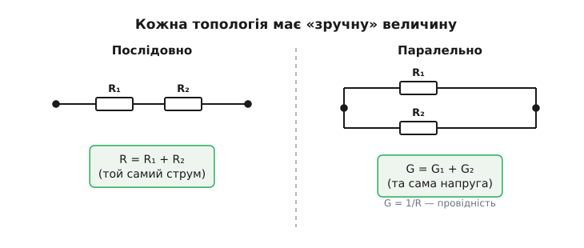
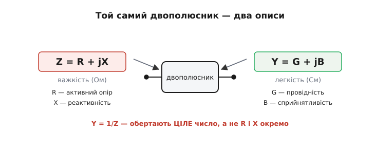
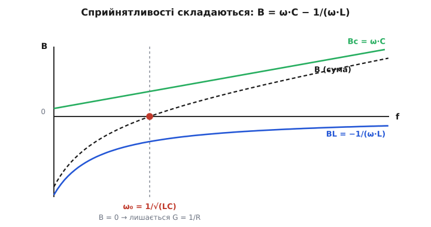
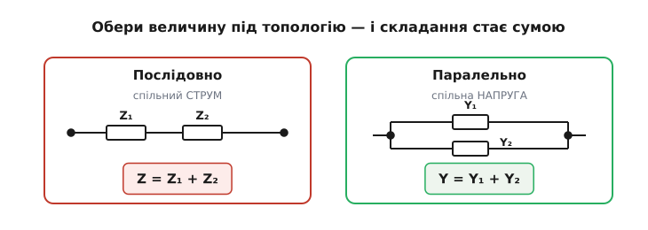

# Адмітанс — наскільки коло легко пропускає струм

<preknowlist>
- [Імпеданс](book:math/impedance) — повний опір Z = R + jX змінному струмові, записаний комплексним числом.
- [Реактивність](book:electronics/reactance) — частотозалежна протидія конденсатора й котушки, що зсуває струм по фазі відносно напруги.
- [Комплексні числа й фазори](book:math/phasors) — величина як дійсна + j·уявна частина; її магнітуда, кут і ділення таких чисел.
- [Закон Ома](book:electronics/ohms-law) — зв'язок напруги, струму й опору V = I·R, звідки провідність G = 1/R.
</preknowlist>

Опір питає: «наскільки важко?». Адмітанс (*admittance*, від лат. *admittere* — впускати, допускати) ставить дзеркальне питання: **«наскільки легко?»**. Це міра того, як охоче коло пускає крізь себе струм за заданої напруги. Формально адмітанс — просто обернена величина до повного опору ([імпедансу](book:math/impedance)): Y = 1/Z. Здавалося б, навіщо взагалі друга назва для того самого, лише перевернутого? Бо в цілій родині задач перевернутий погляд робить арифметику в рази простішою — а проста арифметика на схемі означає менше помилок і швидше відчуття, що відбувається.

Розберімо спершу, чому «легко» іноді зручніше за «важко», а тоді — як адмітанс улаштований усередині й де він щодня рятує інженера.

## Чому варто думати про «легкість», а не про «важкість»

Уявіть два резистори поряд, **паралельно**. Через кожен тече свій струм, обидва підвішені до тієї самої напруги. Питання: який сумарний опір цієї пари? Через опори формула виходить незграбна:

```
R_заг = (R₁ · R₂) / (R₁ + R₂)
```

Добуток поділити на суму — і це лише для **двох** резисторів. Додайте третій, четвертий — і вираз розпухає, його легко наплутати. А тепер гляньмо на ту саму пару очима «легкості». Кожен резистор пропускає струм з якоюсь охотою; назвемо її **провідністю** (*conductance*) G = 1/R. Коли два шляхи йдуть пліч-о-пліч, повна охота пропускати — це просто **сума** двох охот, бо струм просто розтікається обома стежками заразом:

```
G_заг = G₁ + G₂ + G₃ + …
```

Жодних добутків, жодних дробів — лише додавання, скільки б гілок не було. Ось і вся причина, чому інженери вигадали окрему величину для «легкості»: **паралельні кола додаються в провідностях так само природно, як послідовні — в опорах**. Це не нова фізика, а зручніша система координат для тієї самої фізики.

І зручність ця не абстрактна. Паралель — найчастіша топологія реальних схем: живлення висить на спільних шинах, навантаження й конденсатори розв'язки чіпляють паралельно одне до одного. Рахувати щоразу «добуток на суму» втомливо й помилконебезпечно, а складати провідності — миттєво; до того ж багато методів аналізу (вузловий метод, вхідний опір каскаду) природно розмовляють саме провідностями, тож звичка бачити коло в G економить чимало кроків.

Тепер головний крок. Провідність G = 1/R — це історія для **резисторів** на постійному струмі. Та реальні кола містять [конденсатори й котушки](book:electronics/reactance), і їхня протидія струмові залежить від частоти й до того ж зсуває струм відносно напруги в часі. Повну протидію змінному струмові описують **імпедансом** Z — комплексним числом, що тримає в собі і «гальмування» амплітуди, і зсув фази. Адмітанс — це те саме обернення «важко → легко», але вже для повного імпедансу:

```
Y = 1 / Z
```

І та сама магія працює знову: **паралельні імпеданси додаються в адмітансах**. Y_заг = Y₁ + Y₂ + … — без жодних добутків, для будь-якого числа гілок, на будь-якій частоті. Ось чому адмітанс — не примха, а робочий інструмент: він робить паралельне з'єднання змінних кіл таким самим простим, яким провідність робить паралель резисторів.


*Дві дзеркальні зручності. Послідовно (ліворуч) опори просто додаються: R = R₁ + R₂. Паралельно (праворуч) додаються провідності: G = G₁ + G₂. Кожна топологія має свою «природну» величину, у якій складання — банальна сума.*

## Що сидить усередині адмітансу: провідність і сприйнятливість

Раз адмітанс — обернене до комплексного імпедансу, він і сам **комплексне число**. У нього дві частини, і кожна має свій фізичний зміст. Запишемо так:

```
Y = G + j·B
```

Тут **G** — **активна провідність** (*conductance*): та частина «легкості», що відповідає за **реальний струм у фазі з напругою** — струм, який несе енергію й гріє резистивну частину кола. **B** — **сприйнятливість** (*susceptance*, від лат. *suscipere* — приймати, переймати): частина «легкості», що відповідає за струм, зсунутий на чверть періоду відносно напруги — той самий реактивний струм конденсатора й котушки, що енергію не витрачає, а лише гойдає її туди-сюди в полі. Множник **j** (уявна одиниця) — це коротка позначка того, що цей струм зсунутий по фазі на 90°.

Цей розклад одразу каже про вузол дві різні речі. G — скільки тут **витрачається** потужності: теплові втрати, корисне навантаження. B — скільки **реактивного** струму гуляє туди-сюди, не роблячи роботи, але навантажуючи джерело й дроти. Саме тому в техніці компенсації реактивної потужності «вбивають» B, додаючи протилежну за знаком сприйнятливість, — і споживач перестає ганяти мережею зайвий струм.

Тут чигає головна пастка, через яку адмітанс плутають. Спокуса каже: «G — це ж 1/R, а B — це 1/X, правда?». **Неправда.** Обертати треба ціле комплексне число Z = R + jX, а не кожну його частину окремо. Коли ділиш одиницю на комплексне число, дійсна й уявна частини **перемішуються**:

```
Y = 1/Z = 1/(R + jX) = (R − jX) / (R² + X²)
```

звідки

```
G = R / (R² + X²)
B = −X / (R² + X²)
```

Подивіться уважно: у знаменнику обох частин сидить **і R, і X разом**. Тобто активна провідність G залежить **не лише** від опору R, а й від реактивності X; а сприйнятливість B — і від X, і від R. Лише в двох крайніх випадках усе спрощується: для чистого резистора (X = 0) виходить G = 1/R, B = 0; для чистого реактивного елемента (R = 0) виходить G = 0, B = −1/X. У всіх проміжних випадках — змішування, і саме на ньому найчастіше спотикаються. Чому так виходить алгебраїчно й що означає кожен знак — розгорнуто в [математичній вставці про обернення комплексного імпедансу](book:electronics/admittance/math-y-from-z.md).


*Той самий двополюсник, два описи. Зліва імпеданс Z = R + jX (важкість): R — активний опір, X — реактивність. Справа адмітанс Y = G + jB (легкість): G — активна провідність, B — сприйнятливість. Перейти між ними — не «обернути частини», а обернути ціле комплексне число, через що R і X у формулах для G і B перемішуються.*

Зверніть увагу й на **знаки**. Для котушки реактивність X додатна (XL = ω·L > 0), тож її сприйнятливість B = −1/XL виходить **від'ємна**. Для конденсатора X від'ємна (Xc = −1/(ω·C)), тож сприйнятливість **додатна**, B = ω·C. Це не випадковість: у світі адмітансу ролі ніби міняються місцями. **Ємнісна сприйнятливість додатна й росте з частотою** (Bc = ω·C — конденсатор тим легше пропускає, чим швидші коливання), **індуктивна — від'ємна й спадає за модулем із частотою** (BL = −1/(ω·L)). Якщо ви звикли до реактивностей, де Xc від'ємна, а XL додатна, то в адмітансі знаки перевертаються — і це логічно, бо легкість обернена до важкості.

**Worked-приклад: обернути імпеданс у адмітанс.** Нехай на робочій частоті двополюсник має Z = 30 + j40 Ом (опір 30 Ом плюс індуктивна реактивність 40 Ом). Знайдемо G і B.

:::tabs
```c
// Обернення Z = R + jX  →  Y = G + jB  (фірмварний обчислювач)
#include <stdio.h>

int main(void) {
    double R = 30.0, X = 40.0;          // Ом: активний опір та реактивність
    double den = R*R + X*X;             // R² + X²  = 900 + 1600 = 2500
    double G = R / den;                 // активна провідність, См
    double B = -X / den;                // сприйнятливість, См

    printf("|Z| = %.1f Ом\n", 50.0);    // sqrt(2500) = 50
    printf("G = %.4f См\n", G);          // 30/2500  = 0.0120 См
    printf("B = %.4f См\n", B);          // -40/2500 = -0.0160 См
    return 0;
}
```
```python
# Обернення Z = R + jX  →  Y = G + jB  (фірмварний обчислювач)
Z = complex(30.0, 40.0)     # Ом: активний опір + j·реактивність
Y = 1 / Z                   # обертаємо ціле комплексне число, не частини

G = Y.real                  # активна провідність, См
B = Y.imag                  # сприйнятливість, См

print(f"|Z| = {abs(Z):.1f} Ом")   # sqrt(2500) = 50
print(f"G = {G:.4f} См")           # 30/2500  = 0.0120 См
print(f"B = {B:.4f} См")           # -40/2500 = -0.0160 См
```
:::

Результат: G = 0.0120 См, B = −0.0160 См. Перевірте пастку наочно: тут **G = 0.012 См**, а зовсім **не** 1/R = 1/30 ≈ 0.0333 См. Реактивність 40 Ом «розбавила» активну провідність більш ніж утричі — рівно тому, що в знаменнику сидить R² + X². Хто механічно взяв би 1/R, помилився б у три рази. Від'ємний знак B підтверджує: двополюсник індуктивний (як і має бути за додатної X = +40).

Саме такий обчислювач — типовий шматок прошивки приладу, що міряє імпеданс (LCR-метр, аналізатор): сенсор віддає R і X, а на екран треба вивести і Z, і Y, і добротність, і фазовий кут. Формули G = R/(R²+X²) та B = −X/(R²+X²) — рівно те, що крутиться в такій програмі щомиті, і запам'ятати їх простіше, ніж щоразу виводити з комплексного ділення.

## Магнітуда й кут адмітансу

Як і будь-яке комплексне число, адмітанс можна тримати не лише у вигляді «дві частини G і B», а й як **довжину стрілки та її кут**. Магнітуда |Y| показує, наскільки сильний повний струм тече за одиничної напруги (амплітудне відношення), а кут φ — наскільки цей струм зсунутий по фазі відносно напруги:

```
|Y| = √(G² + B²)
φ_Y = arctan(B / G)
```

Між полярними виглядами імпедансу й адмітансу зв'язок простий і красивий: довжини обернені, а кути — протилежні за знаком.

```
|Y| = 1 / |Z|
φ_Y = −φ_Z
```

Друга рівність варта окремої уваги. Якщо коло індуктивне, струм відстає від напруги — кут імпедансу додатний; у адмітансі той самий фізичний зсув записується **від'ємним** кутом. Жодна фізика не змінилася — лише ми дивимося на ту саму стрілку з протилежного боку. Тому, переходячи від Z до Y, не дивуйтеся, що «індуктивне» раптом стало мати від'ємний кут: це особливість мови, а не кола. Глибше про те, чому обернення комплексного числа віддзеркалює його кут, — у [математичній вставці](book:electronics/admittance/math-y-from-z.md).

## Одиниця — сименс (а колись «мо»)

Опір міряють в омах. Що ж до оберненої величини, то логічно міряти її в **обернених омах** — і саме так колись і робили. Уявну одиницю «обернений ом» жартівливо назвали **«мо»** (*mho*) — це слово **«ом» (ohm), прочитане навспак**, із символом перевернутої грецької літери омега ℧. Цю назву запропонував у 1883 році Вільям Томсон (лорд Кельвін). Інженери старої школи десятиліттями писали провідність «у мо», і в старих підручниках та даташитах ви ще натрапите на ℧.

Згодом систему СІ впорядкували, і обернений ом дістав «дорослу» назву — **сименс** (*siemens*, символ **S**, по-українському «См»), на честь німецького винахідника й промисловця Вернера фон Сіменса. Назву рекомендувала Міжнародна електротехнічна комісія 1935 року, а офіційно у СІ її затвердила Генеральна конференція з мір та ваг 1971 року. Тож **1 См = 1 Ом⁻¹ = 1 А/В**: провідність в один сименс означає, що на кожен вольт прикладеної напруги тече один ампер струму. І провідність G, і сприйнятливість B, і повний адмітанс |Y| міряють однаково — у сименсах. Звідки взялися обидві назви й чому «мо» поступилося «сименсу», розказано в [історичній вставці](book:electronics/admittance/hist-mho-siemens.md).

Корисна звірка одиниць наочно показує, що адмітанс — це справді «легкість»: великий адмітанс (багато сименсів) означає **малий** опір і легкий шлях для струму; малий адмітанс — великий опір, важкий шлях. Резистор 10 Ом має провідність 0.1 См; резистор 1 МОм — мізерні 10⁻⁶ См (1 мкСм). Що нижчий опір, то вищий сименс — усе як належить оберненій величині.

## Адмітанс у паралельному колі: ось де він блищить

Повернімося до того, заради чого все й затівалося. Візьмімо найзвичайнісіньку ланку: **резистор, конденсатор і котушка, увімкнені паралельно** до одного джерела змінної напруги (це класична RLC-ланка, з якої виростають фільтри й коливальні контури). В імпедансах рахувати її — морока: довелося б тричі брати «добуток на суму». А в адмітансах кожна гілка дає свій простий внесок, і вони просто **складаються**:

```
Y = G + j·Bc + j·BL = 1/R + j·ω·C − j/(ω·L)
```

тобто

```
Y = 1/R + j·(ω·C − 1/(ω·L))
```

Гляньте, як прозоро все вишикувалося. Дійсна частина — суто резистор, 1/R. Уявна частина — **різниця** ємнісної та індуктивної сприйнятливостей. Конденсатор тягне її вгору (ω·C росте з частотою), котушка — вниз (1/(ω·L) спадає з частотою). А тепер найцікавіше: на якійсь частоті ці двоє **зрівняються**, і уявна частина обернеться на нуль. Сприйнятливість зникає, лишається сама провідність 1/R — коло поводиться як чистий резистор. Це і є **[резонанс](book:electronics/lc-resonance)**: реактивні струми конденсатора й котушки рівні за величиною й протилежні за фазою, тож вони повністю гасять один одного, а зовнішнє джерело «бачить» лише резистор. Умова резонансу читається з формули миттєво:

```
ω·C = 1/(ω·L)   ⇒   ω₀ = 1/√(L·C)
```

Те, що в мові імпедансів довелося б витягувати через громіздкий спільний знаменник, у мові адмітансів випадає саме собою: резонанс — це просто «уявна частина адмітансу = 0». Ось наочна вигода правильно обраної системи координат.


*Сприйнятливості складаються. Ємнісна Bc = ω·C росте з частотою (вгору), індуктивна BL = −1/(ω·L) — від'ємна й наближається до нуля знизу. Їхня сума перетинає нуль на резонансі ω₀, де лишається сама активна провідність G = 1/R, і паралельний контур поводиться як чистий резистор.*

**Worked-приклад: повний адмітанс паралельної ланки.** Резистор R = 100 Ом, конденсатор C = 100 нФ і котушка L = 10 мГн увімкнені паралельно. Частота сигналу f = 2 кГц. Знайдемо адмітанс ланки.

```c
// Адмітанс паралельного R||C||L на заданій частоті
#include <stdio.h>
#include <math.h>

int main(void) {
    double R = 100.0;        // Ом
    double C = 100e-9;       // Ф  (100 нФ)
    double L = 10e-3;        // Гн (10 мГн)
    double f = 2000.0;       // Гц
    double w = 2.0 * M_PI * f;       // кутова частота ω, рад/с

    double G  = 1.0 / R;             // активна провідність
    double Bc = w * C;               // ємнісна сприйнятливість (+)
    double Bl = -1.0 / (w * L);      // індуктивна сприйнятливість (−)
    double B  = Bc + Bl;             // повна реактивна частина

    double Ymag = sqrt(G*G + B*B);   // магнітуда адмітансу
    printf("G  = %.5f См\n", G);     // 0.01000 См
    printf("Bc = %.5f См\n", Bc);    // ω·C
    printf("Bl = %.5f См\n", Bl);    // -1/(ω·L)
    printf("B  = %.5f См\n", B);     // сума
    printf("|Y|= %.5f См\n", Ymag);
    return 0;
}
```

Підставимо числа в голові, щоб відчути порядок. Кутова частота ω = 2·π·2000 ≈ 12 566 рад/с. Тоді Bc = ω·C ≈ 12 566 · 100·10⁻⁹ ≈ 0.00126 См. А BL = −1/(ω·L) ≈ −1/(12 566 · 0.01) ≈ −0.00796 См. Сума B ≈ 0.00126 − 0.00796 ≈ −0.0067 См — від'ємна, отже на 2 кГц ланка переважно **індуктивна** (котушка «перетягує»). Резонанс настав би там, де Bc зрівняється з |BL|, тобто на ω₀ = 1/√(L·C) ≈ 1/√(10⁻²·10⁻⁷) ≈ 31 623 рад/с, або f₀ ≈ 5 кГц. Нижче за резонанс домінує котушка (B < 0), вище — конденсатор (B > 0) — і адмітанс одразу це показує знаком своєї уявної частини, без жодного додаткового аналізу.

Так рахують поведінку будь-якого паралельного контуру — вхідного кола приймача, антенного узгодження, фільтра-пастки. Знак B миттєво каже, з якого боку від резонансу ви стоїте, а |Y| — який струм ланка спожила б від джерела. Для проєктувальника фільтра висновок простий: щоб зсунути резонанс, треба змінити суму ω·C − 1/(ω·L), а не морочитися з добутком-на-суму імпедансів.

## Коли який погляд брати

Адмітанс і імпеданс — два боки однієї монети, і вся майстерність у тому, щоб брати зручніший бік під задачу. Правило просте й працює завжди:

- **Послідовне з'єднання — думайте імпедансами.** Послідовні Z просто додаються (Z = Z₁ + Z₂ + …), бо через усі елементи тече **той самий струм**, а напруги складаються. Тут адмітанс лише заважав би.
- **Паралельне з'єднання — думайте адмітансами.** Паралельні Y просто додаються (Y = Y₁ + Y₂ + …), бо на всіх елементах **та сама напруга**, а струми складаються. Тут імпеданс лише заважав би.

Глибша причина симетрична й варта того, щоб її відчути. Послідовне коло «розмовляє» спільним струмом — і додаються величини, прив'язані до напруги (опори: V = Z·I). Паралельне коло «розмовляє» спільною напругою — і додаються величини, прив'язані до струму (адмітанси: I = Y·V). Тому-то [вузловий метод](book:electronics/kcl) аналізу кіл, де невідомими є напруги вузлів, природно записується в адмітансах: рівняння Кірхгофа для струмів у вузлі стають акуратними сумами Y·V. Інженер, що звик гнучко перемикатися між Z і Y, розв'язує схему вдвічі швидше за того, хто вперто тримається лише опорів.


*Симетрія, яку варто закарбувати. Послідовно (спільний струм) додаються імпеданси: Z = Z₁ + Z₂. Паралельно (спільна напруга) додаються адмітанси: Y = Y₁ + Y₂. Обрати правильну величину під топологію — означає звести аналіз до банального додавання.*
