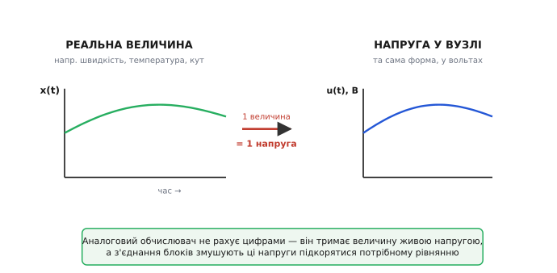
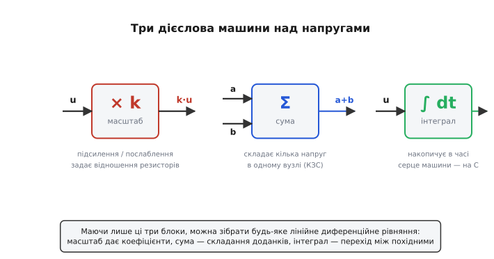
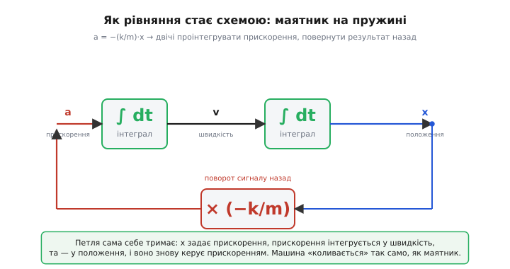
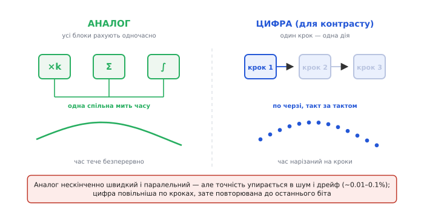

# Аналоговий обчислювач

Уявіть, що вам треба розв'язати рівняння руху — скажімо, як гойдається підвішений на пружині вантаж, або як розганяється літак під поривами вітру. Звичайний шлях: записати диференційне рівняння й рахувати його числами, крок за кроком. Аналоговий обчислювач (від гр. *análogos* — відповідний, співмірний) робить інакше й майже зухвало: він **будує фізичну копію вашого рівняння з дротів і підсилювачів** і дає їй ожити. Напруга в одному вузлі схеми поводиться рівно так, як швидкість вантажу; напруга в іншому — як його положення. Увімкнули живлення — і схема **сама коливається** точнісінько так, як коливався б справжній маятник. Ви не рахуєте розв'язок — ви його **спостерігаєте** на осцилографі.

Це інший спосіб думати про обчислення, і він варто того, щоб його зрозуміти до кореня. Бо за ним стоїть проста й потужна ідея: якщо два різні явища описує **одне й те саме рівняння**, то одне можна підставити замість іншого. Розберімо, як саме напруга стає змінною рівняння, якими цеглинками з неї роблять математику й де ця красива машина впирається в стіну.


*Головна думка: одну фізичну величину (швидкість, температуру, кут) машина зображує однією напругою. Форма напруги у часі повторює поведінку величини — лише в інших одиницях, у вольтах. Далі з'єднання блоків змусять ці напруги підкорятися потрібному рівнянню.*

## Навіщо взагалі копіювати рівняння схемою

Спершу — чесне запитання. Якщо в нас є рівняння, чому б просто не порахувати його числами? Відповідь історична й проста: **колись числами було надто повільно**. Щоб розв'язати систему диференційних рівнянь вручну чи на арифмометрі, інженер витрачав дні. А підсилювач із конденсатором інтегрує сигнал **миттєво й безперервно** — він не робить тисячі дрібних кроків, він просто *є* інтегралом у кожну мить часу. Тому до 1960-х, поки цифрові машини були повільні й дорогі, аналоговий обчислювач панував там, де треба було швидко крутити динаміку: траєкторії снарядів, поведінку літака, керування ракетою, відгук електромережі.

> 🔧 **Навіщо це.** Навіть сьогодні, коли цифра скрізь, ця ідея жива в кожному регуляторі. ПІД-регулятор у термостаті, у драйвері двигуна, у джерелі живлення — це і є маленький аналоговий обчислювач: він бере похибку (різницю «треба мінус є»), множить її, інтегрує й диференціює — і складає результат у керівний сигнал. Розуміючи аналоговий обчислювач, ви розумієте, **чому ці три дії — масштаб, інтеграл, похідна — і є азбука керування**, і чому будь-який сигнальний ланцюг — це насправді машина, що розв'язує рівняння в реальному часі.

Уся побудова тримається на одному факті, який легко проґавити: **різні фізичні системи бувають описані тим самим рівнянням**. Маятник на пружині, коливальний контур із котушки й конденсатора, навіть популяція кроликів із хижаками — у певних межах підкоряються однаковій математиці. А якщо математика спільна, то й **поведінка спільна**. Аналоговий обчислювач експлуатує саме це: він — універсальна система, яку ми **підлаштовуємо** під будь-яке потрібне рівняння, добираючи з'єднання та коефіцієнти.

## Напруга як змінна

Перший крок — домовитися, **що означає напруга**. У цифровій машині число живе в бітах. Тут число живе у вольтах: умовимося, наприклад, що 1 вольт відповідає 1 метру на секунду швидкості. Тоді 2.5 В означають 2.5 м/с, а як швидкість змінюється в часі — так само в часі гойдається напруга. Величина стала **живим сигналом**: не записаною в пам'яті, а присутньою на дроті щомиті.

Це дає аналоговому обчислювачеві дві властивості, яких у цифри від природи немає. По-перше, **час справжній**: змінна тече безперервно, без нарізки на такти, бо напруга на дроті ніколи не «зупиняється між кроками». По-друге, **усе відбувається одночасно**: десяток блоків рахують паралельно, бо кожен — це просто шматок схеми, що реагує на свій вхід тут і зараз, не чекаючи черги. Машина не виконує програму по рядку — вона **просто є** розв'язком, доки ввімкнена.

Звідси й обмеження, до якого ми повернемося: напруга — це фізична величина, а отже на ній є **шум**, **дрейф** і скінченна **точність**. Число в пам'яті точне до останнього біта; напруга — лише настільки, наскільки чистий сигнал. Це не дрібниця, а сама природа підходу.

## Три дієслова: масштаб, сума, інтеграл

Тепер головне. Щоб напруги «робили математику», нам потрібні блоки, які виконують над ними операції. Дивовижно, але для **будь-якого** лінійного диференційного рівняння вистачає всього трьох. Усі три будуються на одній цеглинці аналогової техніки — [операційному підсилювачі](book:electronics/opamp), увімкненому зі зворотним зв'язком.


*Три «дієслова» машини над напругами. Масштаб множить напругу на сталий коефіцієнт, сума складає кілька напруг в одному вузлі, інтеграл накопичує напругу в часі. Цих трьох операцій досить, щоб скласти будь-яке лінійне диференційне рівняння: масштаб дає коефіцієнти, сума — складання доданків, інтеграл — перехід між похідними.*

**Масштаб — помножити на число.** Найпростіше. Підсилювач із резистором на вході й резистором у зворотному зв'язку множить вхідну напругу на відношення цих резисторів. Хочете коефіцієнт 4.7 — ставите резистори у відношенні 4.7. Усе. Сам коефіцієнт задається **геометрією деталей**, а не обчисленням, і саме тому він стабільний. Це той самий [підсилювач напруги](book:electronics/inverting-noninverting), лише тут ми дивимося на нього не як на «гучніше зробити звук», а як на «помножити змінну на сталу».

**Сума — скласти кілька напруг.** Якщо звести кілька вхідних струмів в один вузол перед підсилювачем, вони за [законом струмів Кірхгофа](book:electronics/kcl) додаються, і на виході виходить їхня зважена сума. Ось вам блок `a + b + c` — стільки доданків, скільки входів. Це звичайний [суматор на ОП](book:electronics/summing-difference-amp): кожен вхідний резистор задає свою вагу, а вузол сам складає.

**Інтеграл — накопичити в часі.** Ось серце машини. Якщо в зворотний зв'язок підсилювача поставити не резистор, а **конденсатор**, то вихідна напруга стає інтегралом вхідної: підсилювач весь час «доливає» в конденсатор заряд, пропорційний входу, а напруга на конденсаторі — це накопичений заряд. Подайте на вхід сталу напругу — вихід поповзе рівною похилою (бо інтеграл сталої — пряма). Це [інтегратор на ОП](book:electronics/integrator-differentiator), і саме він уміє те, чого не вміє жодна купка резисторів: **переходити від похідної до самої величини**. Швидкість проінтегрував — отримав шлях. Прискорення проінтегрував — отримав швидкість.

Чому саме інтеграл, а не похідна, — варто пояснити, бо це не випадковість. Похідну теж можна зробити (конденсатор на вході замість виходу), але вона **підсилює шум**: різкі дрібні брижі на сигналі мають велику похідну, і диференціатор їх роздуває. Інтеграл навпаки — **згладжує**, бо усереднює. Тому класична машина будується **на інтеграторах**: рівняння завжди розв'язують «згори вниз», від найвищої похідної до самої змінної, інтегруючи її донизу. Це не лише зручно — це робить машину стійкою до шуму.

> 🔧 **Навіщо це.** Ці три блоки — не музейна екзотика, а буквально те, з чого зібраний аналоговий фільтр, генератор сигналу й регулятор. Коли ви бачите в схемі ОП із конденсатором у зворотному зв'язку — це інтегратор, тобто хтось розв'язує рівняння просто на платі. Уміти впізнати ці три фігури означає читати аналогові схеми як текст: ось тут множать, тут складають, а тут інтегрують похибку — отже, це регулятор.

## Як рівняння перетворюється на схему

Тепер складімо все докупи на живому прикладі — і ви побачите магію. Візьмімо вантаж масою *m* на пружині жорсткості *k*. Шкільна фізика дає рівняння: сила пружини тягне вантаж назад пропорційно зміщенню, а сила — це маса на прискорення. Звідси прискорення:

```
a = − (k/m) · x
```

Читається просто: **прискорення дорівнює положенню, помноженому на від'ємний коефіцієнт**. Знак мінус — бо пружина завжди тягне назад, до спокою. А тепер хитрість, на якій тримається вся машина. Прискорення — це похідна швидкості, а швидкість — похідна положення. Отже, маючи прискорення, **двічі проінтегрувавши** його, дістанемо положення:

```
a  ──інтеграл──►  v  ──інтеграл──►  x
```

Лишилося замкнути коло. Рівняння каже, що прискорення **залежить від положення** через множник −(k/m). То візьмемо отримане *x*, помножимо на −(k/m) — і подамо назад на вхід, як прискорення. Коло замкнулося саме на себе.


*Рівняння a = −(k/m)·x, зібране зі схеми. Прискорення інтегрується у швидкість, швидкість — у положення; положення множиться на −(k/m) і повертається назад як прискорення. Петля сама себе тримає: машина «коливається» точнісінько так, як справжній вантаж на пружині, — на осцилографі це буде синусоїда.*

Зверніть увагу, що сталося. Ми **ніде не розв'язували** рівняння. Ми лише з'єднали два інтегратори й один підсилювач так, щоб з'єднання **повторювало** рівняння. І щойно дали схемі живлення — напруги самі набули потрібної поведінки: вузол «*x*» загойдався синусоїдою з частотою √(k/m), точнісінько як справжній вантаж. Розв'язок з'явився **як побічний наслідок того, що схема не може поводитися інакше** — її змусили підкорятися рівнянню самі дроти.

Цей зворотний зв'язок — не той самий [від'ємний зворотний зв'язок](book:electronics/negative-feedback), яким стабілізують підсилювач, хоч і родич. Там петля гасить помилку до нуля; тут петля **втілює рівняння** й тому **підтримує коливання**. У цьому й сенс: машина не заспокоюється в точку, вона живе у розв'язку.

**Worked-приклад: як задати коефіцієнт −k/m.** Нехай маса *m* = 2 кг, жорсткість *k* = 8 Н/м. Тоді k/m = 4, а власна частота коливань ω = √4 = 2 рад/с. Множник −(k/m) робить блок масштабу: ставимо резистор у зворотному зв'язку вчетверо більший за вхідний (4 : 1), а від'ємний знак дає сам інвертувальний підсилювач. Перевіримо очікувану частоту в коді — це чиста арифметика проєктування, яку зручно тримати поряд:

:::tabs
```c
#include <math.h>

// Власна частота пружинного маятника, що його моделює машина.
// k — жорсткість (Н/м), m — маса (кг); повертає рад/с.
float spring_omega(float k, float m)
{
    return sqrtf(k / m);          // ω = √(k/m)
}

// Масштаб блоку зворотного зв'язку k/m задаємо відношенням резисторів R_fb/R_in.
float feedback_gain(float k, float m)
{
    return k / m;                 // напр. 8/2 = 4  → R_fb : R_in = 4 : 1
}
// spring_omega(8, 2) -> 2.0 рад/с;  feedback_gain(8, 2) -> 4.0
```
```python
from math import sqrt

# Власна частота пружинного маятника, що його моделює машина.
# k — жорсткість (Н/м), m — маса (кг); повертає рад/с.
def spring_omega(k, m):
    return sqrt(k / m)            # ω = √(k/m)

# Масштаб блоку зворотного зв'язку k/m задаємо відношенням резисторів R_fb/R_in.
def feedback_gain(k, m):
    return k / m                  # напр. 8/2 = 4  → R_fb : R_in = 4 : 1

# spring_omega(8, 2) -> 2.0 рад/с;  feedback_gain(8, 2) -> 4.0
```
```cpp
#include <cmath>

// Власна частота пружинного маятника, що його моделює машина.
// k — жорсткість (Н/м), m — маса (кг); повертає рад/с.
float spring_omega(float k, float m)
{
    return std::sqrt(k / m);      // ω = √(k/m)
}

// Масштаб блоку зворотного зв'язку k/m задаємо відношенням резисторів R_fb/R_in.
float feedback_gain(float k, float m)
{
    return k / m;                 // напр. 8/2 = 4  → R_fb : R_in = 4 : 1
}
// spring_omega(8, 2) -> 2.0 рад/с;  feedback_gain(8, 2) -> 4.0
```
:::

Поставивши коефіцієнт 4 і запустивши схему, на виході побачимо синусоїду з частотою рівно 2 рад/с. Хочете інший маятник — крутіть резистори; хочете згасання (тертя) — додайте ще один зворотний зв'язок зі швидкості. Те саме рівняння, та сама машина, інші числа.

## Чому аналог — і де він ламається

Тепер чесна оцінка: у чому аналоговий обчислювач сильний, а де програє цифрі.


*Дві природи обчислення. Ліворуч: аналог — усі блоки працюють в одну спільну мить, час тече безперервно, результат миттєвий. Праворуч (для контрасту): цифра рахує крок за кроком, нарізаючи час на такти. Аналог нескінченно швидкий і паралельний, але його точність упирається в шум і дрейф; цифра повільніша по кроках, зате повторювана до останнього біта.*

**Сильний бік — швидкість і паралельність.** Машина видає розв'язок **миттєво й безперервно**, хоч би яким складним було рівняння: десяток інтеграторів працюють одночасно, ніхто нікого не чекає. Збільшили складність задачі — додали блоків, а час відгуку не зріс. Для цифри ж кожен новий доданок — це ще обчислення в кожному такті. Тому там, де треба швидко прокрутити динаміку «що буде, якщо», аналог був незрівнянний.

**Слабкий бік — точність.** І це не дрібний недолік, а **межа самого підходу**. Напруга — фізична величина, на ній сидять [тепловий шум](book:electronics/resistor-noise) резисторів, дрейф зміщення підсилювачів від температури, неточність самих резисторів і конденсаторів. У підсумку гарний аналоговий обчислювач дає точність десь **0.01–0.1 %** — і вище стрибнути дуже важко, бо це впирається у фізику деталей. Цифра ж точна рівно настільки, скільки бітів ви взяли: хочете дев'ять знаків — берете подвійну точність, і все повторюється байт-у-байт від запуску до запуску. Аналогова машина при двох запусках дасть **трішки різні** криві — бо шум щоразу інший.

Є й дрібніші болі: інтегратор поволі «спливає» через витоки конденсатора й вхідні струми підсилювача (тому довгі симуляції дрейфують); кожну змінну треба **відмасштабувати**, щоб напруги не вилізли за межі живлення (бо за стелею підсилювач [насичується](book:electronics/real-opamp-limits) й рівняння ламається); а перепрограмувати машину — означає **фізично перепаяти** з'єднання чи перемкнути на комутаційному полі.

Саме точність і незручність перенастройки й вирішили долю аналогового обчислювача. Коли цифрові машини в 1960–70-х подешевшали й пришвидшилися, вони виграли не швидкістю інтегрування, а **повторюваністю, точністю й тим, що програма — це текст, а не паяння**. Аналог відступив із великих задач — але нікуди не зник: у будь-якому регуляторі він і досі живе там, де потрібен миттєвий безперервний відгук на реальний сигнал.

## Звідки воно взялося

Ідея старша за електроніку. Найкрасивіший ранній аналоговий обчислювач — **механічний**: машина лорда Кельвіна для передбачення припливів (1872), що складала з десятка обертових коліс гармоніки морського припливу й вимальовувала рік припливів наперед за кілька годин. Пізніше Венівар Буш у MIT збудував величезний **диференційний аналізатор** (1928–1931) із валів і шестерень, що інтегрував механічно — крутінням дисків. Електронну еру відкрив сам термін: назву «операційний підсилювач» 1947 року дали Джон Раджаззіні з колегами саме тому, що цей підсилювач, обвішаний резисторами й конденсаторами, **виконує математичні операції** — він і був цеглинкою аналогових обчислювачів воєнного часу.

Як механічні шестерні поступилися лампам і чому слово «операційний» у назві підсилювача — це спадок саме обчислювальних машин, а не звукопідсилення, розказано в окремій вставці [про народження аналогового обчислювача](book:electronics/analog-computer/hist-differential-analyzer.md). Для суті ж досить запам'ятати: підсилювач, що множить, складає й інтегрує, з'явився **як деталь машини для розв'язування рівнянь**, а вже потім став універсальною робочою конячкою всієї аналогової електроніки.

## Суть, яку варто забрати

Аналоговий обчислювач думати про себе дозволяє напрочуд просто. Одна змінна — одна напруга, жива й безперервна. Три блоки — масштаб, сума, інтеграл — роблять над напругами математику. З'єднуєш блоки так, щоб **з'єднання повторювало рівняння**, замикаєш зворотний зв'язок — і схема сама стає розв'язком, бо інакше поводитися не може. Жодного покрокового рахунку: результат **є** в кожну мить, поки ввімкнено живлення.

> 🔧 **Навіщо це.** Найцінніше тут — не сама машина (її витіснила цифра), а **спосіб бачення**. Будь-який аналоговий ланцюг, що множить сигнал, щось додає й інтегрує, — це обчислювач, який розв'язує рівняння в реальному часі. Регулятор, фільтр, генератор, синтезатор — усі вони родом звідси. Побачивши ОП із конденсатором у зворотному зв'язку, знайте: тут інтегрують, тобто хтось будує математику з напруги. А обмеження — точність на рівні часток відсотка проти ідеальної повторюваності цифри — пояснює, чому світ зрештою пішов у біти, лишивши аналогу те, що він робить найкраще: миттєво й безперервно відповідати на живий сигнал.

Уся складність — масштабування змінних, дрейф інтеграторів, шум, варіанти блоків — лише уточнює цю картину, але не міняє її. Серце лишається тим самим: машина, що **не рахує** розв'язок, а **стає** ним.
