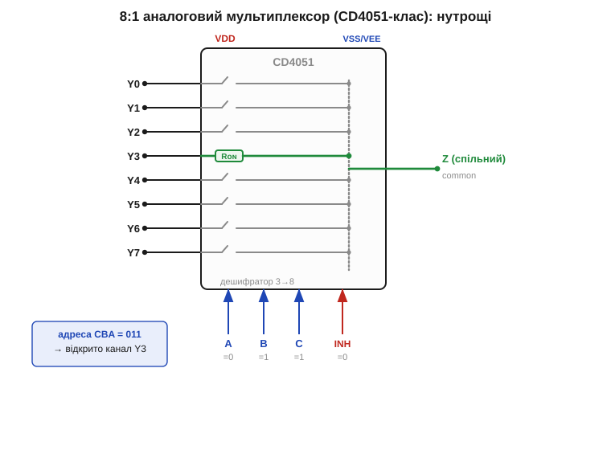
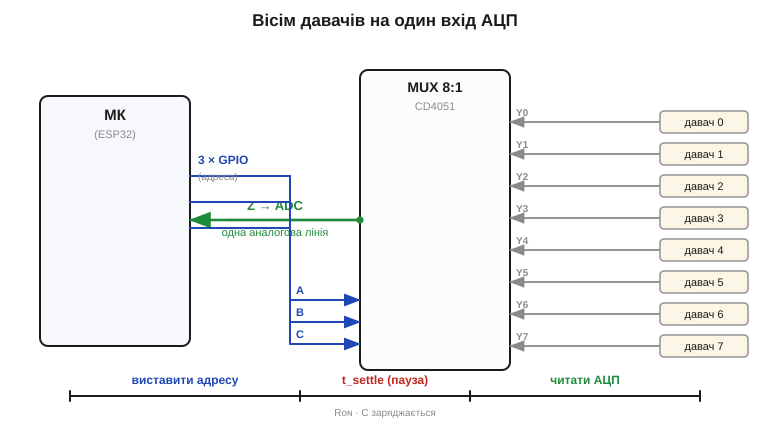

# 🔌 CD4051/74HC4066-класи: вісім давачів на один вимірювальний вхід

Сам принцип [аналогового ключа](topic:electronics/analog-switches-mux) простий: він комутує **сигнал**, а не потужність, і в замкненому стані має скінченний опір Rᴏɴ. Тут — про два канонічні сімейства цих ключів і про найчастішу їхню роботу: коли давачів багато, а точний вимірювальний вхід (АЦП) — один.

### Клас пристрою

**Аналоговий мультиплексор** (*analog multiplexer*, MUX) і **аналоговий ключ** (*analog switch*) — це один і той самий [двонапрямлений CMOS-ключ](topic:electronics/analog-switches-mux), тільки зібраний у дві різні зручні конфігурації:

- **CD4051-клас** — один мультиплексор **8→1** (*8-channel mux/demux*). Усередині — вісім ключів, що сходяться на **спільний вивід** (у даташиті — `COMMON OUT/IN`, на схемах часто `Z`), і **дешифратор адреси** (*address decoder*), який трьома логічними бітами `A`, `B`, `C` обирає, **який один** із восьми каналів зараз замкнено. Споріднені: CD4052 (двічі 4→1), CD4053 (тричі 2→1), швидші CMOS-версії 74HC4051.
- **74HC4066-клас** — **чотири незалежні** ключі (*quad bilateral switch*) в одному корпусі. Жодного дешифратора: у кожного ключа свій вивід дозволу, і вмикаєш ти їх **окремо й у будь-якій комбінації**. Споріднені: 4016 (старіший, більший Rᴏɴ), 74HC4316.

Різниця проста: 4051 — це **селектор «один із восьми»** (адресуєш номером), 4066 — це **чотири окремі вмикачі** (керуєш кожним напряму). Адресований варіант трапляється найчастіше, тож варто зазирнути всередину саме нього.


*Усередині 8:1 мультиплексора: вісім ключів із опором Rᴏɴ сходяться на спільний вивід Z. Дешифратор за трьома бітами адреси (тут CBA = 011) замикає рівно **один** канал — Y3, решта розімкнені. Вхід INH (*inhibit*) у логічній «1» вимикає **всі** канали разом.*

### Типова розпіновка (8:1)

Ці вісім ключів, спільний вивід і три біти адреси треба якось вивести назовні — звідси й набір виводів корпусу. У 16-вивідному корпусі: вісім каналів `Y0…Y7`; спільний вивід `Z`; три адресні `A`, `B`, `C` (A — молодший біт); вхід `INH` (дозвіл, активний рівнем «1» = все вимкнено); живлення `VDD` і `VSS`. Окремий вивід `VEE` дає змогу пропускати **двополярний** сигнал (від −VEE до +VDD) — рідкісна для логіки властивість, бо ключ усередині двонапрямлений.

### Підключення

Маючи цю розпіновку, зібрати робоче коло вже просто. Класичне коло «вісім давачів — один АЦП»: виходи давачів заводять на `Y0…Y7`, спільний `Z` — на **єдиний** аналоговий вхід мікроконтролера, а три адресні лінії — на три **GPIO**. `INH` тримають на «0» (дозволено), `VDD` — на тій самій напрузі, що й живлення АЦП (важливо: сигнал не повинен виходити за межи `VSS…VDD`).


*Три GPIO задають адресу, спільний вивід Z іде на один вхід АЦП. Між зміною адреси й вимірюванням потрібна пауза t_settle: ключ має скінченний Rᴏɴ, і коло «Rᴏɴ × ємність входу АЦП» спершу мусить зарядитися до нового рівня.*

### Перший «байт» (як заговорити)

Коло зібране — лишається навчити мікроконтролер ним керувати. Жодного протоколу тут немає: керування суто логічне. Щоб прочитати давач №*n* через 4051:

```
biti = n;                  // 0..7
gpio_write(A, biti & 1);   // молодший біт адреси
gpio_write(B, (biti>>1)&1);
gpio_write(C, (biti>>2)&1);
delay_us(t_settle);        // дати колу встановитися (одиниці-десятки мкс)
val = adc_read();          // тепер на вході — давач n
```

З 4066 ще простіше: щоб замкнути ключ *k*, подаєш «1» на його вивід дозволу; «0» — розмикаєш.

> 🔧 **Навіщо це.** Точний АЦП (а надто його [опорна напруга](topic:electronics/voltage-reference)) дорогий, і входів у мікроконтролера лічена кількість. Мультиплексор за копійки перетворює **один** добрий вимірювальний канал на вісім: усі давачи читає та сама схема, без розкиду між окремими АЦП.

### Чому Rᴏɴ «гуляє» від рівня сигналу: фізика CMOS-ключа

Найхитріша властивість Rᴏɴ — те, що опір відкритого ключа не просто скінченний, а ще й **змінюється залежно від того, яку напругу через нього пропускаєш**. Без цього параметр Rᴏɴ у даташиті виглядає як одне число, а в реальному вимірюванні поводиться як крива.

Усередині [цей ключ](topic:electronics/analog-switches-mux) — **передавальний вентиль** (*transmission gate*): паралельно ввімкнені два транзистори — n-канальний (NMOS) і p-канальний (PMOS). Чому саме пара, а не один транзистор? Бо в кожного поодинці провідність **падає до нуля на одному з кінців діапазону сигналу**, і ця залежність — пряме слідство фізики MOSFET.

Провідність відкритого MOSFET задає не напруга на затворі сама собою, а **різниця між затвором і каналом** — напруга «затвор-витік» Vɢs понад порогом Vᴛ. Для NMOS затвор тримають на VDD. Поки сигнал на каналі низький (близько VSS), перенапруга над порогом велика — Vɢs ≈ VDD, канал широко відкритий, опір малий. Та щойно сигнал піднімається до VDD, напруга на каналі наздоганяє затвор: Vɢs зменшується, наближається до Vᴛ — і NMOS **зачиняється**. Тобто:

```
NMOS:  добре проводить біля VSS,  гасне біля VDD
PMOS:  дзеркально — добре біля VDD, гасне біля VSS
```

PMOS поводиться дзеркально, бо в нього затвор тримають на VSS, і «робоча» перенапруга в нього велика саме біля верхньої шини. Поставивши їх **паралельно**, отримуємо ключ, у якого хоча б один транзистор завжди відкритий широко: внизу тягне NMOS, угорі — PMOS. Сума двох провідностей і дає сумарний Rᴏɴ.

Але ці дві «гірки» провідності не зливаються в ідеально рівну поличку. Десь **посередині діапазону** (приблизно VDD/2) обидва транзистори вже не в найкращій формі — кожен на спаді своєї кривої. Саме там сумарна провідність найменша, а **Rᴏɴ — найбільший**. Виходить характерний «горб» опору в середині шкали сигналу: на краях нижче, по центру вище. Це і є та сама «залежність Rᴏɴ від рівня сигналу», і тепер вона не магія, а наслідок того, що Vɢs кожного транзистора їде разом із сигналом.

```
Rᴏɴ(Vsig):
  низ (≈VSS) ── малий (тягне NMOS)
  центр(VDD/2)── максимум («горб»: обидва на спаді)
  верх (≈VDD) ── малий (тягне PMOS)
```

Звідси й друга залежність — **від напруги живлення**. Підняли VDD — підняли перенапругу Vɢs над порогом для обох транзисторів, канали відкрилися ширше, увесь горб просів донизу. Тому в даташиті Rᴏɴ при 3.3 В у рази більший, ніж при 15 В: при низькому живленні перенапруги мало, транзистори ледь відкриті. Це безпосередньо б'є по нашій схемі — на 3.3 В живленні мікроконтролера ключ найслабший саме тоді, коли він нам потрібен.

> 🔧 **Навіщо це.** Якщо Rᴏɴ був би сталим, його можна було б одноразово відкалібрувати й відняти. Але він «їде» з сигналом — отже, та сама похибка на 2 В і на 0.2 В буде різна. Для прецизійного вимірювання це означає: або тримай джерело низькоомним (щоб падіння на Rᴏɴ було мізерним проти сигналу), або бери ключ із малим і пласким Rᴏɴ, або вимірюй уже **після** ключа диференційно. Сам собою «горб» — це нелінійність, яку калібруванням однією константою не прибрати.

### Числовий приклад: скільки коштує Rᴏɴ у точності

**Умова.** Через CD4051-клас при VDD = 3.3 В читаємо дільник із вихідним опором Rᴊ = 10 кОм. Опір ключа Rᴏɴ ≈ 200 Ом (типове для цього сімейства на 3.3 В). АЦП ESP32 — 12 біт, опорна напруга 3.3 В. Питання перше: яка статична похибка від падіння на Rᴏɴ? Питання друге: який t_settle треба, якщо ємність входу АЦП Cꜱ ≈ 25 пФ?

```
Статична похибка (дільник Rᴏɴ і вхідного опору АЦП):
  Вхід SAR-АЦП під час вибірки — це Cꜱ через ключ; струму
  спокою майже нема, тож саме падіння Rᴏɴ мізерне.
  Головна біда — НЕ статика, а час заряду Cꜱ.

Постійна часу заряду вибіркової ємності:
  R_заг = Rᴊ + Rᴏɴ = 10000 + 200 = 10200 Ом
  τ      = R_заг × Cꜱ = 10200 × 25e-12 ≈ 0.255 мкс

Скільки τ до похибки < ½ LSB у 12 бітах:
  потрібно e^(−t/τ) < 1 / 2^(12+1) = 1 / 8192
  t/τ > ln(8192) ≈ 9.0
  t_settle > 9.0 × 0.255 ≈ 2.3 мкс
```

Висновок: бери **t_settle ≈ 3–5 мкс** із запасом — і це для «зручного» джерела на 10 кОм. Підніми Rᴊ до 1 МОм — τ зросте в сто разів, і вже сам АЦП ESP32 без зовнішнього буфера не встигне зарядити Cꜱ за стандартне вікно вибірки. Звідси практичне правило: **високоомне джерело + мультиплексор = постав буфер ([операційний підсилювач-повторювач](topic:electronics/voltage-follower)) між ними**, інакше «горб» Rᴏɴ і повільний заряд з'їдять молодші біти.

### Типові граблі

Вигода очевидна, але задарма вона не дається — ось де така схема найчастіше підводить.

- **Опір відкритого ключа Rᴏɴ.** Він не нульовий — від десятків ом (74HC4066 при вищому живленні) до сотень ом (CD4051/4066 при 3.3 В), та ще й «горбатий» за рівнем сигналу й залежний від живлення. Послідовно з Rᴏɴ і ємністю входу АЦП виходить RC-коло, тому **зміни адресу — і зачекай t_settle**, перш ніж читати. Для високоомного джерела (наприклад, дільника з великими резисторами) це особливо відчутно: воно заряджає таке коло повільно.
- **Вихід за межи живлення й защіпання (*latch-up*).** Сигнал поза `VSS…VDD` відмикає паразитні діоди на входах — це найнебезпечніша поломка такого чипа, бо запускає паразитний тиристор усередині кристала (механізм розібрано нижче).
- **Перехресні завади між каналами** (*crosstalk*) і витік у вимкнених каналах — на швидких сигналах сусіди трохи «просочуються». Причина — паразитна ємність між сусідніми каналами в корпусі та скінченний опір вимкненого ключа (*off-isolation* не нескінченна): через них частина чужого сигналу «протікає» на спільний вивід, тим більше, чим вища частота (ємнісний шлях має опір 1/ωC, який із частотою падає).
- **Не для потужності.** Десятки міліампер — стеля; мотор чи реле такий ключ не комутує (для цього — [силовий транзистор](topic:electronics/mosfet-power-switch)). Причина та сама, що й горб Rᴏɴ: канали тонкі, великий струм просто розсіє на Rᴏɴ забагато тепла й посадить сигнал.

### Защіпання (latch-up): паразитний тиристор усередині CMOS

«Сигнал поза межами живлення може защіпнути чип» — звучить як забобон, поки не побачиш, **звідки** в безневинному CMOS-ключі береться тиристор. А він там є — як неминучий побічний продукт того, що NMOS і PMOS живуть в одному кристалі поруч.

PMOS роблять у **n-кишені** (*n-well*), зануреній у спільну p-підкладку (*p-substrate*), де живе NMOS. Подивімося на чергування шарів навколо межі двох транзисторів: витік PMOS (p⁺) — n-кишеня — p-підкладка — витік NMOS (n⁺). Це чотири шари **p-n-p-n** поспіль — а саме так влаштований **тиристор**. Інакше кажучи, у структуру вбудовано два паразитні [біполярні транзистори](topic:electronics/bjt-structure): один **PNP** (p⁺-витік / n-кишеня / p-підкладка) і один **NPN** (n-кишеня / p-підкладка / n⁺-витік), причому колектор кожного годує базу іншого.

```
Паразитна пара (тиристорна засувка):
  p⁺ ─ n-well ─ p-substrate ─ n⁺
  └── PNP ──┘   └──── NPN ────┘
  колектор PNP → база NPN,  колектор NPN → база PNP
```

У нормі обидва закриті: бази притягнуті до своїх шин через опір кишені та підкладки, струму бази нема. Але **варто сигналу вийти за VSS…VDD** — і вхідний захисний діод (той, що в нормі замкнений і лише обмежує викиди) відмикається в пряму. Через нього в підкладку чи кишеню тече струм. Цей струм створює падіння напруги на розподіленому опорі підкладки — і **відмикає базу** одного з паразитних транзисторів.

Далі — лавина зі зворотним зв'язком, у цьому й суть тиристора. Відкрився NPN — його колекторний струм тече з бази PNP, відмикаючи PNP. Колектор PNP, своєю чергою, додає струму в базу NPN. Кожен підживлює інший: якщо добуток їхніх коефіцієнтів підсилення β перевищує одиницю, пара **сама себе утримує у відкритому стані** навіть після того, як зовнішня причина зникла. Між VDD і VSS відкривається низькоомний канал — фактично коротке замикання живлення через кристал. Струм обмежений лише зовнішнім колом; якщо джерело живлення сильне, чип розігрівається й вигорає за секунди. Зняти засувку можна **лише знявши живлення** — логічними сигналами її вже не закрити.

> 🔧 **Навіщо це.** Звідси три практичні правила, і тепер зрозуміло, чому саме вони. Перше: **не давай сигналу вийти за VSS…VDD** — це той єдиний пусковий механізм, що відмикає захисний діод. Якщо джерело може дати викид (довгі дроти давача, індуктивне навантаження), постав послідовний резистор на вході: він обмежить струм через захисний діод до безпечних одиниць міліампер, і навіть короткий вихід за шину не дасть тиристору набрати струм. Друге: **подавай живлення на чип РАНІШЕ за сигнал** — інакше сигнал виявиться «вищим за VDD», який ще дорівнює нулю. Третє: **обмеж струм живлення** запобіжником або струмообмежувальним резистором — якщо засувка все ж клацне, чип хоч не згорить.

### Варіації класу

Навколо базової пари 4051/4066 є ціле сімейство під інші конфігурації. CD4052 (двоканальний 4→1 — зручний для диференційних сигналів), CD4053 (три перемикачі 2→1), мультиплексори 16→1 (74HC4067), а також «справжні» прецизійні ключі з малим Rᴏɴ і керуванням по шині — але це вже окреме сімейство поза цим розділом. Прецизійні саме тим і кращі, що в них Rᴏɴ малий **і плаский** (горб майже вирівняний спеціальною геометрією транзисторів), а захист входів витримує більший вихід за шину без ризику защіпання. Для нашої ж задачі — «багато давачів, один АЦП» з некритичною точністю — 4051 лишається типовим робочим конем.
