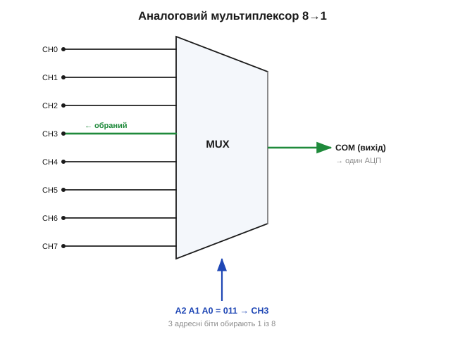

# Аналогові ключі й мультиплексори

Є вічна електронна функція — не порівняти сигнал, а **спрямувати** його, перемкнути з одного шляху на інший. Більшість ключів, що спадають на думку, комутують **потужність**: і [біполярний транзистор](topic:electronics/bjt-switch), і [польовий](topic:electronics/mosfet-power-switch), і [силові ключі змінного струму](root:embedded/ac-switch-need) вмикають лампу, мотор, нагрівач. Та існує цілий клас ключів із зовсім іншим призначенням — **аналогові ключі** (*analog switch*) і побудовані з них **мультиплексори** (*multiplexer*, MUX). Вони комутують не потужність, а **сигнал**: спрямовують крихітні напруги й струми з одного входу на інший, керовані цифровою командою. Це теж легендарні цеглинки (класи 4066 і 4051), і вони — місток між аналоговим і цифровим світом.

### Що таке аналоговий ключ

Аналоговий ключ — це **керована цифрою електронна перемичка**. У нього є два сигнальні виводи (назвімо їх A і B) і вхід керування. Подали на керування логічну «1» — виводи **з'єднані**, сигнал проходить з A на B (і навпаки — ключ **двонапрямлений**). Подали «0» — виводи **роз'єднані**, між ними висока ізоляція. По суті, це електронний аналог механічного контакту, тільки перемикається він мільйони разів на секунду й не зношується.


*Аналоговий ключ як керована цифрою перемичка. Цифровий сигнал на вході CTRL вмикає або вимикає провідність між сигнальними виводами. У замкненому стані ключ має невеликий, але ненульовий опір Ron (десятки–сотні ом); у розімкненому — дуже високу ізоляцію. Комутується саме сигнал (мікро- й міліампери), а не потужність.*

Усередині такий ключ — це [польові транзистори](topic:electronics/field-control), найчастіше пара з n- і p-канального, увімкнених паралельно (так звана передавальна логіка). Чому саме пара, а не один транзистор? Бо [провідність каналу залежить від напруги між затвором і каналом](topic:electronics/mosfet-threshold), а отже — від рівня самого сигналу, що проходить крізь ключ. Одинокий n-канальний транзистор добре проводить сигнали, близькі до землі (там напруга затвор–канал велика), але «затискається», коли сигнал підходить до живлення. P-канальний — навпаки: чудово проводить біля живлення й гірше біля землі. Увімкнені паралельно, вони **доповнюють** один одного: де слабне один, тягне другий, тож сумарний опір лишається відносно низьким **в усьому** діапазоні сигналу. Саме ця пара (її звуть передавальним вентилем) і дозволяє аналоговому ключу пропускати **двополярний у межах живлення** сигнал з малими спотвореннями — те, чого простий ключ на одному транзисторі не вміє. Звідси, до речі, і важливе обмеження: сигнал має лишатися **в межах живлення** ключа; вийти за рейки він не може, бо транзистори просто не відкриються там.

### Опір відкритого ключа Ron

Головна неідеальність аналогового ключа — **опір у відкритому стані** (*on-resistance*, Ron). Замкнений ключ — це не ідеальна перемичка з нульовим опором, а маленький резистор: типово десятки–сотні ом. Це прямий родич [Rds(on) силового MOSFET](topic:electronics/rds-on), тільки тут він навмисно невеликий і стабільний, бо завдання інше.

Чому Ron важливий? Бо він утворює [дільник напруги](topic:electronics/voltage-divider) з тим, що під'єднано далі по колу. Якщо ключ передає сигнал на високоомний вхід (наприклад, на вхід АЦП чи [операційного підсилювача](topic:electronics/ideal-opamp), де струм майже не тече), то спад на Ron мізерний і сигнал проходить майже без втрат. А якщо навантаження низькоомне — Ron з'їдає частину сигналу, і це треба враховувати. Ось чому ключ годиться для комутації **сигналів** (де струми крихітні), але не для комутації **потужності** (де великий струм на Ron дав би і втрати, і нагрів).

Ron має ще одну підступну рису, варту згадки: він **не зовсім сталий**, а трохи змінюється залежно від рівня сигналу (бо провідність каналу залежить від напруги). Цю зміну Ron у межах розмаху сигналу звуть її «плоскістю» (*Ron flatness*); якщо навантаження не дуже високоомне, нерівність Ron вносить невелике **нелінійне спотворення**. Для якісної комутації аудіо чи прецизійного вимірювання це важливо, тому хороші ключі мають і малий, і **рівний** Ron.

Окрім Ron, у даташиті аналогового ключа варто помічати ще кілька параметрів — вони описують, наскільки ключ близький до ідеальної перемички:

- **Струм витоку в розімкненому стані** (*off-leakage*) — крізь «вимкнений» ключ усе одно тече мікроскопічний струм; на високоомному вузлі він може створити помітну похибку напруги.
- **Ізоляція й прохід на високих частотах** — на високій частоті розімкнений ключ перестає бути ідеальним розривом: крізь паразитну ємність сигнал трохи «протікає» (*off-isolation*), а сусідні канали злегка «чують» один одного (*crosstalk*).
- **Інжекція заряду** (*charge injection*) — у мить перемикання керувальний сигнал через паразитні ємності «впорскує» крихітний заряд у сигнальний вузол, смикаючи його напругу. На високоомному конденсаторі це дає невеликий стрибок, який інколи доводиться враховувати.

Усі ці неідеальності — дрібні, але вони і є та межа, що відрізняє реальний ключ від ідеальної перемички. Для більшості завдань ними нехтують; для прецизійних — обирають ключ саме за цими числами.

### Чим аналоговий ключ не є

Щоб остаточно вкласти цю цеглинку в голову, корисно відмежувати її від двох сусідів, з якими її легко сплутати. По-перше, аналоговий ключ — це **не [реле](topic:electronics/relay-driver)**. Реле теж комутує, і теж керується слабким сигналом, але воно має механічні контакти, перемикається повільно (мілісекунди), клацає, зношується й, головне, призначене саме для **потужності** — його контакти витримують ампери й сотні вольтів. Аналоговий ключ — навпаки: жодної механіки, перемикання за наносекунди, мільярди циклів без зносу, але тільки для **слабких сигналів** у межах живлення. Реле і ключ — антиподи за призначенням: одне для силового кола, друге для сигнального.

По-друге, аналоговий ключ — це **не логічний вентиль**. Логічний елемент на виході видає **свої** рівні «0» чи «1» (він джерело сигналу); аналоговий ключ нічого свого не видає — він лише **з'єднує або роз'єднує** чужі вузли, прозоро пропускаючи будь-яку напругу в межах живлення в обидва боки. Логіка вирішує й формує; ключ просто пропускає. Ця прозорість і двонапрямленість — саме те, чого від нього хочуть: він має бути якомога ближчим до шматка дроту, який можна то приєднати, то від'єднати командою.

Тримаючи в голові ці дві межі — «не реле» і «не вентиль», — ви не помилитеся з вибором: для сили беруть силовий ключ чи реле, для логіки — вентиль, а для **комутації слабкого аналогового сигналу** — саме аналоговий ключ.

> 🔧 **Навіщо це.** Аналоговий ключ — це спосіб дати цифровій системі (мікроконтролеру) керувати аналоговими сигналами. Перемкнути джерело сигналу, обрати один із кількох входів підсилювача, відключити давач від кола, побудувати керований атенюатор чи фільтр зі змінними параметрами — усе це робить аналоговий ключ. Головне правило, яке варто закарбувати: ним комутують **сигнал, а не потужність**. Спроба пропустити крізь ключ 4066-класу струм мотора закінчиться димом — для потужності є [силові польові ключі](topic:electronics/mosfet-power-switch) і [ключі змінного струму](root:embedded/ac-switch-need).

### Мультиплексор: один із багатьох

Якщо взяти кілька аналогових ключів і об'єднати один їхній бік у спільну точку, а керування влаштувати так, щоб у кожен момент був замкнений **рівно один** ключ, — вийде **аналоговий мультиплексор**. Це електронний перемикач «один із N»: він з'єднує спільний вивід по черзі з одним із кількох каналів, обираючи канал за **адресою** в двійковому коді.


*Аналоговий мультиплексор 8→1. Усередині — вісім аналогових ключів зі спільним виводом COM. Три адресні біти (A2 A1 A0) обирають рівно один із восьми каналів і з'єднують його з виходом. Так один вимірювальний вхід (наприклад, єдиний канал АЦП) по черзі «бачить» вісім різних давачів.*

Адресні біти задають, який канал увімкнено: для восьми каналів треба три біти (2³ = 8), бо кожна комбінація трьох нулів і одиниць вказує на свій канал. Загалом N адресних ліній обирають один із 2ᴺ каналів — це та сама двійкова логіка, що пронизує всю цифрову техніку. Класична цеглинка такого роду — 4051-клас (один мультиплексор на 8 каналів) і споріднені; вони дешеві, повсюдні й випускаються багатьма виробниками.

Навіщо це потрібно на практиці? Найчастіша причина — **економія дорогого ресурсу**. Аналого-цифровий перетворювач (а часто й хороший підсилювач) — вузол недешевий і не безмежний: у мікроконтролера каналів АЦП обмаль, а зовнішній прецизійний АЦП коштує помітно більше за жменю давачів. Мультиплексор дозволяє **одному** такому каналу по черзі «дивитися» на багато джерел: опитав перший давач, перемкнув адресу, опитав другий, і так по колу. Один дорогий перетворювач плюс копійчаний мультиплексор обслуговують вісім, шістнадцять, тридцять два входи — замість того щоб ставити вісім окремих перетворювачів. Це класичний інженерний компроміс: ми **жертвуємо одночасністю** (канали читаються не разом, а по черзі) заради **дешевизни** (один тракт замість багатьох).

Розплата за таке поділяння — **час**. Перемкнувши канал, не можна міряти миттєво: сигнал має «встояти» (*settling time*) — нова напруга мусить дозарядити через Ron усі паразитні ємності тракту до сталого значення, перш ніж його можна оцифрувати. Поспішиш — і прочитаєш суміш нового каналу з «хвостом» попереднього (це й є та сама перехресна завада). Тому правильне опитування — це завжди «перемкнув адресу → зачекав час встановлення → виміряв», і порядок та паузи тут важать. Саме так на готових мікросхемах [CD4051 та 74HC4066 «розширюють» один вимірювальний вхід на вісім давачів](topic:electronics/analog-mux), а методику опитування каналів по черзі з правильними паузами розібрано у [⚙️ вставці про сканування входів](topic:electronics/analog-switches-mux/proj-mux-scanning.md).

**Приклад (втрата сигналу на Ron мультиплексора).** Хай аналоговий мультиплексор має Ron = 120 Ом, а його вихід під'єднано до входу АЦП, який під час вимірювання споживає невеликий струм заряду й має еквівалентний вхідний опір R_вх = 1 МОм. Оцінимо, яку частку сигналу «з'їсть» Ron:

```
Дільник напруги:   Vвих / Vсигн = R_вх / (Ron + R_вх)
                   = 1 000 000 / (120 + 1 000 000)
                   = 1 000 000 / 1 000 120
                   ≈ 0.99988

Втрата = 1 − 0.99988 = 0.00012 = 0.012 %
```

Утрата — лише 0.012 %, тобто на високоомному вході АЦП опір ключа практично невидимий. А тепер уявімо протилежне: те саме навантаження зменшили до R_вх = 1 кОм:

```
Vвих / Vсигн = 1000 / (120 + 1000) = 1000 / 1120 ≈ 0.893
Втрата ≈ 10.7 %
```

Тепер Ron з'їдає понад 10 % сигналу — неприпустимо. Висновок практичний: аналоговий ключ і мультиплексор працюють чудово на **високоомне** навантаження (вхід АЦП, вхід ОП) і кепсько — на низькоомне. Це і є суть правила «комутуємо сигнал, а не потужність».

Цікаво, що на дуже високоомному вузлі прокидається протилежна біда — не Ron, а **витік розімкнених** каналів. У мультиплексорі до спільної точки приєднано всі вісім ключів; обраний замкнений, а сім інших розімкнені — але крізь кожен тече крихітний струм витоку, і всі вони збираються на спільному вузлі. Подивимось, що це дає на високоомному вході:

```
Сумарний витік (7 розімкнених ключів):
  хай витік одного ключа I_leak ≈ 1 нА
  I_сум ≈ 7 · 1 нА = 7 нА

Похибка напруги на вході з опором R_вх = 1 МОм:
  ΔV = I_сум · R_вх = 7·10⁻⁹ · 1·10⁶ = 7·10⁻³ В = 7 мВ

А на ще вищому R_вх = 10 МОм:
  ΔV = 7·10⁻⁹ · 10·10⁶ = 70·10⁻³ В = 70 мВ  (!)
```

На вузлі 1 МОм витік дає вже помітні 7 мВ похибки, а на 10 МОм — аж 70 мВ. Виходить парадокс: занадто **низькоомне** навантаження псує сигнал через Ron, а занадто **високоомне** — через витоки. Є «золота середина» опору навантаження, де обидві біди малі; саме в неї й цілять, проєктуючи вимірювальний тракт із мультиплексором.
