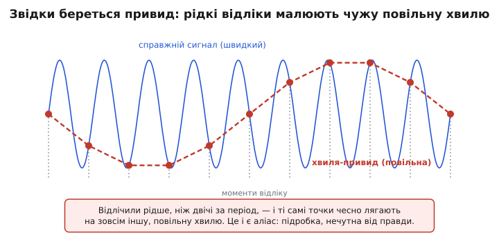
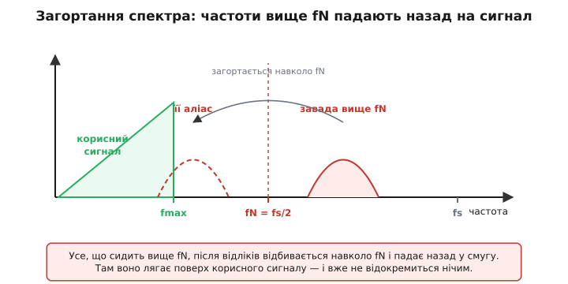
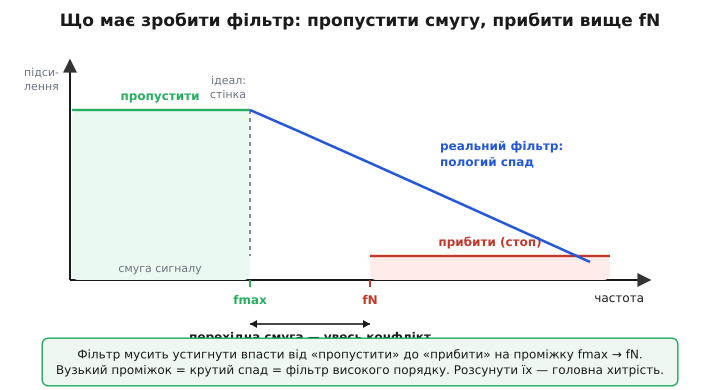
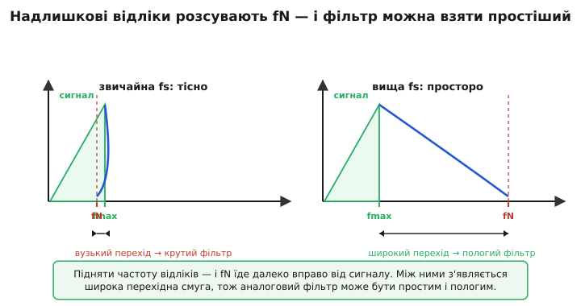

# Антиаліасинговий фільтр: аналоговий вартовий, що ставлять перед оцифруванням

Уявімо камеру, що знімає колесо воза. Спиці миготять, колесо набирає хід — і раптом на екрані воно ніби сповільнюється, завмирає, а тоді крутиться **назад**, хоч віз їде вперед. Очі не брешуть: камера справді бачить так. Вона ловить колесо не безперервно, а окремими кадрами; коли спиця за час між кадрами встигає провернутися майже на ціле положення наступної спиці, на знімках вона лягає трохи **позаду** — і ланцюжок кадрів складається в плавний обертовий рух у зворотний бік. Швидке обертання прикинулося повільним, навіть протилежним. Зайвої брехні тут немає — є фундаментальна пастка будь-якого переходу від неперервного до дискретного: **рідкі відліки не вміють відрізнити швидку зміну від повільної підробки**. Саме від цієї пастки й боронить антиаліасинговий фільтр.

**Антиаліасинговий фільтр** (англ. *anti-aliasing* — «проти псевдонімів»; *alias* — лат. «інакше, під іншим іменем») — це аналоговий фільтр низьких частот, який ставлять у тракт **перед** пристроєм, що бере відліки (перед АЦП, перед дискретизатором), щоб **прибрати з сигналу все, що швидше, ніж відліки здатні чесно передати**. Слово «псевдонім» тут буквальне: висока частота, відлічена надто рідко, з'являється в даних **під чужим іменем** — як нижча частота, що насправді в сигналі не жила. Фільтр не дає таким самозванцям потрапити на вхід дискретизатора, відрізаючи їх ще в аналоговому світі, де їх іще можна відрізнити.

> 🔧 **Навіщо це.** Це не «бажано», а **обов'язково** перед кожним реальним оцифруванням. Без антиаліасингового фільтра завада з радіопередавача, гармоніка від імпульсного перетворювача, шум поза смугою цікавості — усе це не просто додасться згори, а **переселиться прямо у вашу робочу смугу** під виглядом корисного сигналу. І найгірше: після оцифрування ви вже **ніколи** не дізнаєтесь, що це підробка, і не приберете її жодним цифровим фільтром — бо в числах вона неотлична від справжнього сигналу тієї ж частоти. Тому аналоговий фільтр перед АЦП — остання й єдина межа, за якою брехню ще можна спинити. Хто її пропускає, той потім місяцями полює на «привид» у даних, якого в природі немає.

### Чому швидке прикидається повільним

Проживімо пастку повільно, бо вся тема стоїть на ній. Візьмімо чисту синусоїду й почнімо знімати її значення через рівні проміжки — це й роблять і камера кадрами, і АЦП відліками. Поки відліків багато на кожен період, точки густо лягають уздовж хвилі, і відновити її з них — очевидно. Та почнімо відлічувати рідше. У певний момент між двома відліками синусоїда встигає зробити майже повний оберт — і наступну точку ми ловимо вже не там, де лишили, а трохи зсунутою. Точка за точкою цей зсув накопичується, і відліки вишиковуються вздовж **зовсім іншої** хвилі — повільної, якої в сигналі не було.


*Суцільна лінія — справжній швидкий сигнал; точки — рідкі відліки; штрихова — повільна хвиля-привид, що проходить рівно крізь ті самі точки. З самих відліків ці дві хвилі не розрізнити: дискретизатор чесно віддасть повільну.*

Корінь у тому, що **через будь-який скінченний набір точок проходить безліч різних синусоїд**. Доки ми бачимо лише точки, ми не маємо права сказати, котра з них «та сама». Дискретизатор, не маючи іншої інформації, віддасть найпростіше пояснення — найнижчу частоту, що лягає на ці точки. І якщо справжній сигнал був вищий за цю межу, він повернеться до нас **під псевдонімом**, як його повільний двійник. Це й називають **аліасингом** — підміною частоти через надто рідкі відліки.

### Межа Найквіста: скільки відліків досить

Звідси природне питання: скільки відліків треба брати, щоб підробки не виникло? Відповідь — одна з найважливіших меж усієї техніки оброблення сигналів. Щоб синусоїду можна було однозначно відновити, на кожен її період має припадати **більше ніж два** відліки. Інакше кажучи, частота відліків fs мусить перевищувати найвищу частоту в сигналі щонайменше **вдвічі**:

```formula
fs > 2 · fmax          (умова Найквіста)
```

Половину частоти відліків — ту саму межу, вище якої починаються підробки, — звуть **частотою Найквіста**:

```formula
fN = fs / 2
```

Усе, що в сигналі повільніше за fN, відліки передають чесно. Усе, що швидше, повертається аліасом нижче fN. Тому fN — це стеля чесності для даної частоти відліків: рівно та межа, до якої антиаліасинговий фільтр мусить лишити сигнал недоторканим, а вище якої — прибрати дощенту.

> Чому межа саме «двічі за період», як ця умова доводиться строго і хто її сформулював — окрема історія, де поряд стоять Гаррі Найквіст, Клод Шеннон і радянський інженер [Володимир Котельников, що сформулював теорему відліків незалежно ще 1933 року](book:electronics/anti-aliasing-filter/hist-sampling-theorem.md). Тут ми беремо межу fs > 2·fmax як готовий закон і будуємо на ньому роботу фільтра.

Варто одразу відчути число. Людське вухо чує приблизно до 20 кГц. Щоб оцифрувати звук без підробок, частота відліків мусить перевищувати 40 кГц — і недарма компакт-диск узяв 44.1 кГц: трохи з запасом над подвоєними 20 кГц, аби лишити місце фільтрові. Частота Найквіста тут fN = 22.05 кГц. Антиаліасинговий фільтр зобов'язаний пропустити все до 20 кГц і прибити все вище 22.05 кГц — а між ними лише вузенька щілина в 2 кГц. Звідки цей затиск береться і чому він болить, побачимо нижче.

### Чому фільтрувати треба до відліків, а не після

Тут — головна, найменш очевидна думка теми, заради якої фільтр і існує саме **аналоговим** і саме **перед** дискретизатором. Перейдімо від точок на екрані до спектра — переліку частот, з яких складено сигнал. Коли беремо відліки з частотою fs, із спектром стається дивна річ: усе, що сиділо вище частоти Найквіста, **відбивається навколо fN, як від дзеркала, і падає назад у смугу нижче fN**. Завада на частоті трохи вище fN опиняється трохи нижче fN; завада далеко вгорі — десь у середині смуги. Це віддзеркалення називають **загортанням спектра** (англ. *folding* — згортання).


*Корисний сигнал живе в смузі до fmax. Завада вище fN після відліків віддзеркалюється навколо fN і лягає аліасом усередині смуги — просто поверх корисного. Розділити їх у числах уже неможливо: вони на одній частоті.*

І ось чому це смертельно. Доки сигнал аналоговий, завада на 25 кГц і корисний тон на 19 кГц — **різні частоти**, їх легко рознести фільтром. Та щойно ми взяли відліки, та сама завада впала, скажімо, на 19 кГц — **точно туди, де корисний сигнал**. Тепер у числах сидять дві складові на одній частоті, додані в одну. Ніякий, навіть найрозумніший цифровий фільтр їх уже не розділить: розділяти нема за чим, вони злилися в одне число. Інформацію втрачено **в момент відліку**, безповоротно.

Звідси й залізний висновок: підробку треба спинити **до** того, як вона потрапить у дискретизатор, поки частоти ще різні й розділяються. А спинити аналоговий сигнал перед АЦП може лише **аналоговий** елемент — фільтр із резисторів, конденсаторів, підсилювачів, що стоїть у тракті фізично раніше за точку відліку. Цифрова обробка тут безсила за визначенням: вона починається після відліку, коли вже пізно. Тому антиаліасинговий фільтр — це завжди аналог, завжди перед дискретизатором, і замінити його цифрою принципово не можна.

### Сам фільтр: фільтр низьких частот і його крутість

Що мусить робити цей фільтр, тепер очевидно: **пропускати низькі частоти** (де корисний сигнал) і **давити високі** (звідки лізе аліас). Це й є фільтр низьких частот — у найпростішому вигляді та сама [RC-ланка низьких частот](book:electronics/rc-low-pass): резистор послідовно, конденсатор на землю. Конденсатор тим легше пропускає сигнал на землю, чим вища частота, тож високі частоти стікають, а низькі проходять до виходу. Межу, де фільтр починає давити, ставлять частотою зрізу:

```formula
fc = 1 / (2 · π · R · C)
```

Та одна RC-ланка давить надто мляво. За частотою зрізу її амплітуда спадає всього на **20 дБ на декаду** — удесятеро слабше на кожне десятикратне зростання частоти. Це **перший порядок**. Для антиаліасингу часто замало: між кінцем корисної смуги й частотою Найквіста треба впасти на 60–80 дБ, а млява RC-ланка на такому короткому відрізку стільки не встигне. Тому фільтр роблять **вищого порядку** — складають кілька ланок або беруть [активний фільтр на операційному підсилювачі](book:electronics/active-filters). Кожен порядок додає по 20 дБ на декаду:

```formula
спад фільтра ≈ n · 20 дБ/декаду        (n — порядок фільтра)
```

> 🔧 **Навіщо це.** Порядок — це прямо ваші гроші, плата й затримка. Фільтр четвертого порядку — це чотири реактивні елементи, два-три операційники, ретельно підібрані номінали, що тримають крутість. Кожен зайвий порядок — ще деталі, ще місце на платі, ще ймовірність, що розкид номіналів зіпсує характеристику. Тому інженер не накручує порядок наосліп: він рахує, **скільки децибелів** треба прибрати й **на якому відрізку частот**, і бере найменший порядок, що це дає. Недобрав — аліас пролізе; перебрав — переплатив грошима, розміром і фазовими спотвореннями.

**Який порядок фільтра треба для 16-розрядного оцифрування звуку?** Корисна смуга до fmax = 20 кГц, частота Найквіста fN = 22.05 кГц (як на CD). Завада вище fN мусить упасти нижче рівня шуму квантування 16-бітного АЦП — це приблизно 96 дБ. Скільки порядків треба?

:::tabs
```c
#include <math.h>
// Скільки децибелів спаду треба й чи дає їх фільтр порядку n
float octaves   = log2f(22050.0f / 20000.0f);   // відстань fmax→fN у октавах ≈ 0.1375
float need_dB   = 96.0f;                         // прибрати до підлоги 16 біт
// фільтр n-го порядку дає 6.02·n дБ на ОКТАВУ
float slope_per_octave(int n) { return 6.02f * n; }
float atten(int n) { return slope_per_octave(n) * octaves; }
// atten(8)  = 6.02*8 *0.1375 ≈ 6.6 дБ  — мізер!
```
```py
from math import log2
# Скільки децибелів спаду треба й чи дає їх фільтр порядку n
octaves = log2(22050 / 20000)          # відстань fmax→fN у октавах ≈ 0.1375
need_dB = 96.0                         # прибрати до підлоги 16 біт
# фільтр n-го порядку дає 6.02·n дБ на ОКТАВУ
slope_per_octave = lambda n: 6.02 * n
atten = lambda n: slope_per_octave(n) * octaves
# atten(8)  = 6.02*8 *0.1375 ≈ 6.6 дБ  — мізер!
```
:::

Результат шокує: навіть фільтр **восьмого** порядку на цьому крихітному відрізку від 20 до 22.05 кГц устигне прибрати всього близько 6.6 дБ замість потрібних 96. Між fmax і fN лише чверть октави — фільтрові просто **нема де розігнатися**. Якби CD-програвачі справді так працювали, антиаліасинговий фільтр був би жахіттям: десятки порядків, аналоговий монстр, що до того ж нищив би фазу звуку. Цей глухий кут — не вада розрахунку, а сама природа задачі, і вихід із нього лежить не в крутіших фільтрах.

### Перехідна смуга: де весь конфлікт

Підіб'ємо, чому фільтр загнаний у глухий кут. Намалюймо, що від нього вимагають по частоті: до fmax — пропустити недоторканим (смуга пропускання), від fN — придушити дощенту (смуга затримання). Між ними лежить **перехідна смуга** — відрізок fmax → fN, на якому фільтр мусить устигнути впасти з повного пропускання до повного придушення.


*Зеленим — що треба пропустити, червоним — що прибити. Ідеальний фільтр падав би вертикальною стінкою на fmax; реальний спадає полого. Уся складність — у ширині перехідної смуги: чим вона вужча, тим крутіший, отже вищого порядку, потрібен фільтр.*

Тут і весь конфлікт. Ідеальний фільтр падав би **вертикальною стінкою** на fmax — пропустив усе до неї, прибив усе за нею. Такий фільтр звуть «цеглиною» (англ. *brick-wall* — цегляна стіна), і він **фізично неможливий**: жодне коло зі скінченної кількості елементів не дає вертикального спаду. Реальний фільтр спадає полого, і чим вужча перехідна смуга, тим **крутіший** спад від нього вимагають, тобто тим **вищий порядок**. А коли fmax і fN майже злиплися (як 20 і 22.05 кГц), потрібна крутість злітає до небес. Звідси прямий зв'язок, що його варто закарбувати: **ширина перехідної смуги визначає порядок фільтра**. Хочеш простий фільтр — дай йому широку перехідну смугу. Але fmax задає сам сигнал, а fN — частота відліків… і ось де відкривається лазівка.

### Як вибратися: надлишкові відліки

Глухий кут постав через те, що fN сиділа майже впритул до fmax. А fN — це fs/2, тобто ми самі задаємо її, обираючи частоту відліків. То піднімімо fs **набагато вище** за мінімум Найквіста — і fN поїде далеко вправо від корисної смуги. Між fmax і fN розчахнеться **широка** перехідна смуга, і фільтрові буде де неквапом спадати. Цей прийом — брати відліків значно більше, ніж вимагає Найквіст, — називають **надлишковою дискретизацією** (англ. *oversampling*).


*Смуга сигналу однакова в обох панелях. Ліворуч fs мінімальна — fN тісно над сигналом, перехідна смуга вузька, потрібен крутий фільтр. Праворуч fs у кілька разів вища — fN далеко, перехідна смуга широка, і досить простого пологого фільтра.*

Вийшов чудовий розмін. Замість дорогого крутого аналогового фільтра ми платимо **швидшим** оцифруванням — а швидкі відліки нині дешеві, цифрова логіка коштує копійки. Беремо відліки, скажімо, у вісім разів частіше, тоді fN відстрибує далеко вгору, і **простенький** фільтр першого-другого порядку легко прибирає все вище неї. А зайві відліки після оцифрування проріджуємо вже **цифровим** фільтром (там, у числах, зробити круту стінку легко) і повертаємось до потрібної частоти. Так аналогову задачу — найважчу — звели до м'якої, а важке переклали на цифру, де воно просте.

**Наскільки спрощується фільтр при восьмиразовому оверсемплінгу?** Той самий звук fmax = 20 кГц, але оцифровуємо на 8·44.1 кГц = 352.8 кГц. Де тепер fN і яка стала перехідна смуга?

```c
float fmax = 20000.0f;
float fs   = 8.0f * 44100.0f;     // 352800 Гц — у 8 разів частіше
float fN   = fs / 2.0f;           // 176400 Гц — далеко над сигналом!
float octaves = log2f(fN / fmax); // log2(176400/20000) ≈ 3.14 октави
// тепер навіть фільтр 2-го порядку дає 6.02*2*3.14 ≈ 37.8 дБ,
// а 3-го — 6.02*3*3.14 ≈ 56.7 дБ — простою RC-логікою, без монстра
```

Перехідна смуга роздалася з чверті октави до трьох з лишком — у понад двадцять разів. Те, що раніше не брав і восьмий порядок, тепер легко робить другий-третій. Саме так влаштовані всі сучасні аудіо-АЦП: вони беруть відліки в десятки-сотні разів частіше за потрібне, тож аналоговий антиаліасинговий фільтр у них — копійчана RC-ланка, а всю гостру роботу виконує цифровий фільтр-проріджувач усередині кристала. Цю ідею доведено до краю в [сигма-дельта АЦП](book:electronics/sigma-delta-adc), де частота відліків у тисячі разів вища за смугу сигналу — і аналоговий фільтр перед ним стає геть тривіальним.

### Ціна фільтра: він чіпає й корисний сигнал

Антиаліасинговий фільтр — не безкоштовний вартовий; за охорону він бере плату з самого сигналу, і цю плату треба бачити. Будь-який реальний фільтр, давлячи високі частоти, трохи зачіпає й верхівку корисної смуги: підрізає амплітуду найвищих корисних тонів і — головне — **затримує** різні частоти неоднаково. Ця нерівномірна затримка зветься [груповою затримкою](book:electronics/filter-group-delay) і для імпульсних, ступінчастих сигналів означає спотворення форми: гострий фронт розпливається, дзвенить. Що крутіший фільтр (вищий порядок), то сильніше він кривить фазу — і це ще одна причина не накручувати порядок дарма.

Тому тип фільтра обирають під задачу. Коли важить **рівна амплітуда** в смузі (звук, спектральні виміри) — беруть фільтр Баттерворта з максимально плоскою вершиною. Коли важить **неспотворена форма** імпульсу (зв'язок, керування) — беруть фільтр Бесселя з рівномірною затримкою, жертвуючи крутістю. А коли треба видавити максимум крутості з даного порядку — Чебишова, миряючись із брижами в смузі. Усе це — різні компроміси між крутістю спаду, рівністю смуги й чистотою фази; докладніше — у темі [активні фільтри та їхні типи](book:electronics/active-filters). Для антиаліасингу головне правило просте: бери найменший порядок, що дає потрібне придушення на твоїй перехідній смузі, а решту складності збувай надлишковою дискретизацією.

### Що варто винести

Антиаліасинговий фільтр — обов'язковий аналоговий фільтр низьких частот **перед** будь-яким дискретизатором чи АЦП. Він існує тому, що рідкі відліки не відрізняють швидку зміну від повільної підробки: усе, що в сигналі швидше за частоту Найквіста fN = fs/2, після відліків **загортається** назад у робочу смугу під чужим іменем — як аліас — і зливається з корисним сигналом нерозривно. Спинити цю підробку можна лише **до** відліку, поки частоти ще різні, і лише **аналоговим** елементом — цифра тут безсила за визначенням, бо починається запізно. Сам фільтр давить тим крутіше, чим вищий його порядок (≈ n·20 дБ/декаду), а потрібну крутість диктує ширина **перехідної смуги** між кінцем корисної смуги fmax і частотою Найквіста fN: вузька смуга — крутий дорогий фільтр, широка — простий. Звідси головний прийом інженерії: брати відліків **набагато більше** за мінімум Найквіста (надлишкова дискретизація), щоб відсунути fN далеко, розширити перехідну смугу й обійтися копійчаним аналоговим фільтром, переклавши гостру роботу на дешевий цифровий проріджувач. І завжди пам'ятати ціну: фільтр трохи кривить амплітуду й фазу верхівки смуги, тож його порядок і тип обирають під задачу, а не за принципом «що крутіше, то краще».

---
