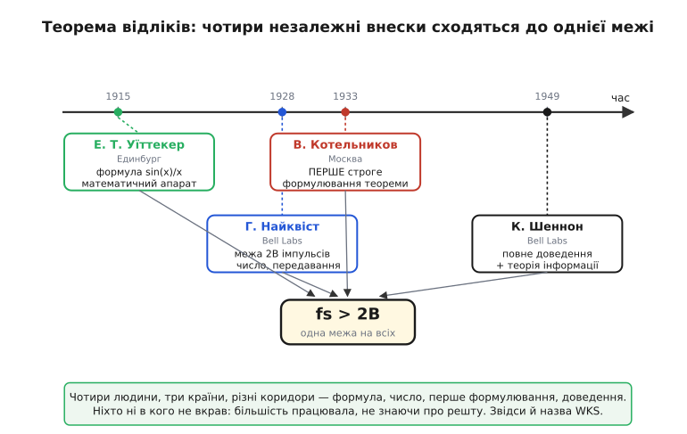

# 📜 Теорема відліків: чотири людини, три країни, одна межа

Закон, на якому стоїть антиаліасинговий фільтр, звучить так просто, що ним користуються мимохіть: щоб відновити сигнал з відліків, бери їх частіше, ніж удвічі за найвищу частоту. Назвати цей закон одним іменем — звична спокуса, і в підручниках він мандрує то як «теорема Найквіста», то як «теорема Шеннона», то як «теорема Котельникова». Жодна з цих назв сама по собі не бреше — і жодна не каже всієї правди. Бо ця межа не виникла в одній голові одного ранку. Її намацували незалежно, з різних боків, люди, що про роботу одне одного нічого не знали: математик у Единбурзі, інженер у Москві, ще один інженер у телефонній компанії в Нью-Йорку. Кожен підійшов своїм коридором — і всі вперлися в те саме число «два». Історія цієї теореми — гарний приклад того, як наукова істина буває **колективною**: не вкраденою, не приписаною, а справді складеною з окремих, чесно зароблених шматків. І водночас — приклад того, як легко потім один зі шматків забути, а інший роздути.

Розберімо, хто що насправді зробив, у якому порядку, і чому теорема врешті носить аж три прізвища поспіль.

## Що взагалі треба було довести

Спершу — про саму загадку, бо без неї імена нічого не варті. Уявімо неперервний сигнал — напругу, що плавно ходить угору-вниз у часі. Ми хочемо запам'ятати його числами: беремо його значення через рівні проміжки, записуємо стовпчик чисел і викидаємо все, що було між відліками. Питання, що мучило інженерів зв'язку, було не риторичне, а грошове: **скільки інформації влізе в дріт чи в ефір за секунду?** Скільки окремих, незалежних значень можна проштовхнути крізь канал заданої ширини, поки вони не почнуть зливатися в кашу?

З одного боку відповідь очевидно скінченна — канал вузький, нескінченно багато не влізе. З іншого боку — а чи не втрачаємо ми все, що сталося в проміжках між відліками? Раптом сигнал там стрибнув, а ми проґавили? Виявилося — ось де диво — що якщо сигнал не містить частот вище за певну межу (а реальний обмежений канал їх і не пропустить), то з відліків, узятих досить часто, його можна відновити **точно, до останньої краплі**. Нічого в проміжках не загубилося, бо обмежений по частоті сигнал не має права різко смикнутися між відліками — він надто «гладкий» для цього. Між сусідніми відліками існує рівно одна гладка крива, що крізь них проходить.

Оце «досить часто» і є серце теореми: **частіше, ніж удвічі за найвищу частоту B**. Беремо рідше — і різні сигнали починають давати однакові стовпчики чисел, ми вже не розрізнимо, котрий був насправді (це і є аліасинг, проти якого ставлять фільтр). Беремо вдвічі-з-хвостиком частіше — і відповідність стає однозначною. Хто перший це зрозумів, сформулював і довів — і є наша історія.

## Едмунд Уїттекер: математик, що не думав про зв'язок (1915)

Найдавніша нитка тягнеться зовсім не від інженерів, а від чистої математики, і людина в її початку про телеграф із радіо не думала взагалі. **Едмунд Тейлор Уїттекер** (англ. *Edmund Taylor Whittaker*, 1873–1956) — англійський математик, на той час професор у Единбурзькому університеті в Шотландії. 1915 року він опублікував у «Трудах Единбурзького королівського товариства» працю з назвою сухою й суто математичною: «Про функції, що подаються розкладами теорії інтерполяції».

Уїттекера цікавило ось що. Маємо набір значень функції у рівновіддалених точках. Через них можна провести безліч різних кривих. Але серед усіх цих кривих є одна особлива — найбільш «спокійна», без зайвих швидких коливань, та, яку він назвав **кардинальною функцією** (англ. *cardinal function*). Уїттекер показав, що ця кардинальна крива будується з відліків за конкретною формулою — сумою однакових дзвоноподібних доданків, по одному на кожен відлік, що тепер відома як ряд із функцій виду sin(x)/x:

```
f(t) = Σ f(n·T) · sin(π·(t − n·T)/T) / (π·(t − n·T)/T)
```

Це **точно та сама формула**, якою сьогодні цифровий пристрій відновлює аналоговий сигнал з відліків. Кожен відлік f(n·T) накладає на час свій гладкий «горбок», що дорівнює одиниці у своїй точці й нулю в усіх інших точках відліків; сума горбків і дає неперервну криву. Уїттекер вивів цей апарат як шматок теорії інтерполяції — як відповідь на питання «яку функцію найрозумніше провести через дані точки». Що ця крива — і є той єдиний сигнал, який реально передавали каналом обмеженої смуги, він не формулював: задачі зв'язку перед ним не стояло. Це робить його **математичним попередником**, а не автором інженерної теореми. Апарат він дав — а застосувати його до передавання інформації мали інші.

> 🔧 **Навіщо це.** Та сама дзвоноподібна функція sin(x)/x — не музейний експонат, а саме те, що рахує цифро-аналоговий перетворювач на виході вашого АЦП-тракту, відновлюючи неперервний сигнал, та цифровий фільтр-проріджувач усередині аудіо-кристала. Коли в документації на ЦАП пишуть «sinc-інтерполяція» — це формула Уїттекера 1915 року, що дожила до кремнію.

Пізніше тему підхопив його син, **Джон Маквортер Уїттекер** (англ. *John Macnaghten Whittaker*, 1905–1984), теж математик: 1935 року в книжці «Інтерполяційна функційна теорія» він розвинув кардинальні ряди далі. Тому в математичній традиції теорему часом звуть **«теоремою Уїттекера»** — і це справедливо рівно настільки, наскільки йдеться про формулу відновлення, а не про її зв'язок із шириною каналу.

## Гаррі Найквіст: телеграф і число «два» (1928)

Друга нитка — інженерна, і веде вона у велику телефонну компанію. **Гаррі Найквіст** (швед. *Harry Nyquist*, 1889–1976) народився в Швеції, у бідній селянській родині на півночі країни, і дитиною емігрував до США 1907 року. Там він вивчився, дійшов до докторату з фізики в Єльському університеті й опинився серед інженерів, що згодом склали кістяк уславленої Bell Telephone Laboratories. Це важлива деталь ідентичності: Найквіста часто звуть «американським інженером», і за громадянством та місцем праці це так — але **за походженням він швед**, і його шлях у науку почався з еміграції, а не зі звичної академічної колії.

1928 року Найквіст опублікував працю «Деякі питання теорії телеграфної передачі». Завдання було практичне до краю: телеграфна компанія хотіла знати, **як швидко можна гнати імпульси (крапки-тире) каналом заданої ширини**, поки сусідні імпульси не почнуть розмазуватись один в одного. І Найквіст вивів межу, що тепер носить його ім'я: каналом смуги B на секунду можна передати щонайбільше **2B незалежних імпульсів-значень**. Хочеш швидше — імпульси зіллються, прийомник їх уже не розрізнить.

Ось воно — те саме число «два», з того самого боку, але дзеркально. Найквіст думав не про відліки неперервного сигналу, а про **протилежне**: скільки окремих імпульсів увіпхати в канал. Та межа вийшла одна: ширина смуги B дозволяє рівно 2B незалежних значень за секунду — байдуже, чи ти їх **зчитуєш** із сигналу (відліки), чи **вкладаєш** у канал (імпульси). Це дві грані одного факту, і Найквіст ухопив грань передавання. Строгого твердження «обмежений смугою B сигнал повністю відновлюється з відліків, узятих із частотою понад 2B» він не записав і не доводив — він про неперервне відновлення не питав. Тому чесне формулювання таке: **Найквіст дав ключове число й інженерну межу пропускної здатності**, з якої теорема відліків випливає як двійник, але саму теорему сформулювали інші. На честь цього внеску межу fs = 2B досі звуть **частотою Найквіста**, і це цілком заслужено.

## Володимир Котельников: незалежно, у Москві, найперше строге формулювання (1933)

Третя нитка тягнеться з Радянського Союзу, і це найцікавіша частина історії — бо тут і найвагоміший внесок, і найдовше замовчування, і найбільший ризик перекрутити, в один чи в інший бік.

**Володимир Олександрович Котельников** (рос. *Владимир Александрович Котельников*, 1908–2005) народився 6 вересня 1908 року в Казані, тоді — Казанська губернія Російської імперії. За етнічністю він **росіянин**, із родини університетських науковців (батько — професор математики й механіки), і нема жодних підстав це заперечувати чи затушовувати: це той випадок, коли точна атрибуція — саме «російський радянський інженер». Тут важлива не національність сама собою, а **чесність обліку**: внесок Котельникова реальний, першорядний, і применшувати його через те, з якої він країни, було б такою самою кривдою, як і роздувати чужі заслуги за рахунок інших народів. Точність працює в обидва боки.

Вчився Котельников у Москві — у Вищому технічному училищі (нині Бауманка) і Московському енергетичному інституті, де потім і працював інженером та викладачем десятиліттями. І ось 1933 року, двадцятип'ятирічним, він написав працю, що стала його місцем в історії: **«Про пропускну здатність "ефіру" та дроту в електрозв'язку»**. У ній він **уперше сформулював теорему відліків строго, у математично точному вигляді, та ще й одразу для двох випадків** — для сигналів у смузі від нуля (низькочастотних, *low-pass*) і для сигналів у смузі, зсунутій угору (*band-pass*). Він не просто намацав межу — він записав теорему як теорему, з умовою й доведенням, у контексті саме задачі зв'язку: скільки інформації несе канал. Це більше, ніж зробив до нього будь-хто: Уїттекер дав формулу без зв'язку з каналом, Найквіст — число без строгого твердження про відновлення, а Котельников — **повне, точне, інженерно поставлене формулювання**.

Тут варто чесно сказати про обставини публікації, бо вони незвичні й самі стали частиною історії. Працю Котельников підготував як доповідь на Перший всесоюзний з'їзд із питань технічної реконструкції зв'язку, що мав відбутися 1933 року в Москві. За низкою джерел, сам з'їзд так і не зібрався — але матеріали, подані до оргкомітету, були надруковані, і саме цей друк лишився документальним підтвердженням **пріоритету** Котельникова. Тобто теорема вийшла у світ, її можна датувати й перевірити — навіть якщо трибуни, з якої її планували проголосити, фактично не було. Статус тут такий: **публікація 1933 року — усталений, документований факт**; деталь про незбіглий з'їзд — правдоподібна й повторювана в кількох джерелах, але це вже обставина, а не суть.

А далі сталося те, що й робить цю історію повчальною. Праця вийшла **російською, у вузькому радянському відомчому виданні**, у роки, коли наукові світи СРСР і Заходу майже не сполучалися. На Заході її просто **не побачили** — ще багато років. Коли в 1948–49 роках американець Клод Шеннон публікував своє доведення, він про роботу Котельникова, що випередила його на п'ятнадцять років, нічого не знав — і не міг знати. Західний світ дізнався про внесок Котельникова лише у 1950-х і пізніше, коли його праці почали згадувати й перекладати. Це **не крадіжка й не змова** — це звичайна трагедія розірваного інформаційного простору: два інженери незалежно дійшли того самого, але мур між мовами й системами не дав їхнім результатам зустрітися вчасно.

> 🔧 **Навіщо це.** Історія Котельникова — наочний урок, чому в інженерії так бережуть **дату публікації** й перевіряють першоджерела, а не вірять назві на слово. Закон, яким ви щодня користуєтесь, цілком міг бути доведений раніше, ніж каже звична легенда, — просто іншою мовою, в іншій країні, і тому загубитися з поля зору. Перевіряти, хто й коли насправді що зробив, — не педантизм, а елементарна чесність професії.

Визнання прийшло, хоч і пізно. 1999 року німецький **фонд Едуарда Райна** (нім. *Eduard-Rhein-Stiftung*) присудив Котельникову Премію за фундаментальні дослідження з формулюванням, що чесно ставить усе на місце: **«за перше теоретично точне формулювання теореми відліків»** (англ. *for the first theoretically exact formulation of the sampling theorem*). Зверніть на слова: не «за відкриття» взагалі, а саме за **перше теоретично точне формулювання** — тобто фонд визнав, що до Котельникова теорему намацували, але строго записав її першим саме він. Роком пізніше, 2000-го, інститут інженерів IEEE вручив йому медаль Александера Ґрейама Белла. Сам Котельников прожив дев'яносто шість років, став одним із керівників радянської космічної програми, керував радіолокаційним картографуванням Венери й Меркурія — теорема відліків була лише раннім епізодом великого життя.

## Клод Шеннон: строге доведення, що сполучило все (1948–1949)

Четверта нитка — найвідоміша на Заході, і саме через неї теорему частіше за все звуть «теоремою Шеннона». **Клод Елвуд Шеннон** (англ. *Claude Elwood Shannon*, 1916–2001) — американський математик та інженер із тих самих Bell Labs, людина, що того ж часу заклала всю теорію інформації (саме він увів поняття «біт» як одиницю інформації). Для нього теорема відліків була не самоціллю, а **інструментом** у значно ширшій будові — у математичній теорії того, скільки інформації можна надійно передати каналом із шумом.

1948 року Шеннон публікує епохальну «Математичну теорію зв'язку», а 1949-го — статтю «Зв'язок за наявності шуму», де теорема відліків з'являється як строго доведене твердження (у тій статті — під номером «Теорема 13»). Тут варто розрізнити дату написання й дату виходу: рукопис Шеннона був поданий до інституту ще **1940 року**, а вийшов лише 1949-го — публікацію затримала Друга світова війна. Тобто думка дозріла в нього раніше, ніж побачила друк, — але навіть найраніша дата, 1940-й, усе одно пізніша за Котельникові 1933-й.

Що ж зробив **саме** Шеннон, якщо число дав Найквіст, формулу — Уїттекер, а точне формулювання — Котельников? Він дав найповніше, найчіткіше **доведення** і — головне — **вмонтував теорему в загальну теорію інформації**, показавши її не як окремий трюк, а як наслідок глибших законів про канал, шум і пропускну здатність. У Шеннона теорема відліків перестала бути ізольованим фактом і стала частиною єдиної картини: ось скільки незалежних чисел несе сигнал смуги B за час T (рівно 2·B·T штук), ось як це пов'язано з ємністю каналу й шумом. Саме ця цілісність і ясність зробили формулювання Шеннона канонічним на Заході — не тому, що він був перший (він не був), а тому, що він поставив теорему в найкращу раму. До того ж Шеннон чесно посилався на Найквіста й не претендував на одноосібність — назва «теорема Шеннона» прилипла вже потім, зусиллями підручників, а не його власних заяв.

## Чому теорема носить аж три прізвища

Тепер видно всю картину, і видно, чому жодна однослівна назва не чесна. Складемо нитки в одну, у порядку часу:

```
1915  Е. Т. Уїттекер   — формула відновлення (sin(x)/x), без задачі зв'язку
1928  Г. Найквіст      — межа 2B імпульсів на смугу B (число, з боку передавання)
1933  В. Котельников   — ПЕРШЕ строге формулювання теореми для low-pass і band-pass
1940  К. Шеннон        — рукопис готовий (вийшов 1949)
1949  К. Шеннон        — повне доведення + вбудовано в теорію інформації
```

Кожен зробив свій, окремий і потрібний крок: математичний апарат (Уїттекер) → ключове число й інженерну межу (Найквіст) → перше точне формулювання теореми (Котельников) → строге доведення в загальній теорії (Шеннон). Жоден не вкрав в іншого — більшість працювала, не знаючи про решту. Це і є **колективний результат**: істина, що складена з чесно зароблених шматків, а не виліплена однією рукою.

Тому в літературі співіснують кілька чесних назв, і кожна підкреслює свій бік:

- **теорема Найквіста — Шеннона** — найпоширеніша; визнає число Найквіста й доведення Шеннона, але мовчить про Котельникова й Уїттекера;
- **теорема Котельникова** — стандартна назва в російськомовній традиції; справедливо ставить уперед перше строге формулювання, але часто опускає решту;
- **теорема Уїттекера — Котельникова — Шеннона** (англ. *Whittaker–Kotelnikov–Shannon*, скорочено **WKS**) — найповніша й найчесніша з ходових: вона називає три з чотирьох головних внесків у часовому порядку, від математичного попередника через перше формулювання до канонічного доведення.

> 🔧 **Навіщо це.** Коли в datasheet чи в підручнику ви бачите «Nyquist theorem» або «Shannon theorem» — знайте, що це **скорочення зі зрізаними іменами**, а не повна правда. На роботу фільтра це не впливає (закон той самий), але якщо колись дійде до точного посилання — пишіть Whittaker–Kotelnikov–Shannon або хоч згадайте Котельникова: так ви нікого не обкрадете, і ваша атрибуція буде чесна.

Статус усієї цієї історії за доказовістю: **усталений факт** — що Уїттекер дав формулу 1915-го, Найквіст межу 1928-го, Котельников строге формулювання 1933-го, Шеннон доведення 1949-го (рукопис 1940-го); усе це задокументовано публікаціями, які можна взяти й перевірити. **Чесний висновок, не міф**: теорема відліків — колективний результат із чітко розрізненими внесками (ідея/формула, інженерна межа, перше формулювання, строге доведення), і будь-яка спроба звести її до одного імені — спрощення, а спроба викреслити чийсь внесок за національною ознакою — викривлення. Тут немає ні героя-одинака, ні поглинання чужих заслуг: є четверо людей із трьох країн, що різними коридорами вийшли до однієї межі — числа «два», на якому тримається кожне оцифрування у світі.


*Чотири внески в порядку часу: формула відновлення Уїттекера, число пропускної здатності Найквіста, перше строге формулювання Котельникова й канонічне доведення Шеннона — усі сходяться до однієї умови. Стрілка від Шеннона починається пунктиром 1940 року (готовий рукопис) і стає суцільною 1949-го (публікація).*
