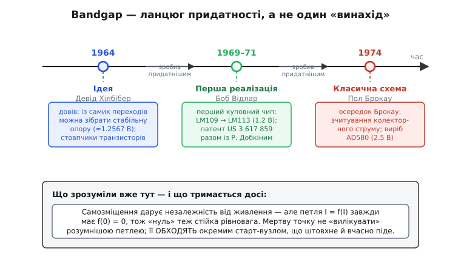

# 📜 Як bandgap навчився прокидатися

Будь-яка історія техніки, де щось працює «само собою», має тіньовий бік: те саме «само собою» означає, що пристрій спершу мусить себе **запустити**, а от цьому його ніхто не вчив. Bandgap-джерело опорної напруги — взірцевий випадок. Воно живиться сам себе, тому незалежне від живлення; і рівно через те, що живиться сам себе, воно вміє назавжди зависнути в нулі, ще навіть не почавши. Інженери, які робили перші такі джерела на кремнії наприкінці 1960-х, наштовхнулися на цю двозначність не з підручника — вони побачили її на стенді, коли свіжий кристал відмовлявся вмикатися. Розберімо, як ця проблема народилася разом із самою ідеєю, хто з нею стикнувся й чому **старт-схема** стала невіддільною частиною топології, а не пізнішою латкою.

## Чого взагалі бракувало: опора, що не «пливе»

Щоб зрозуміти, навіщо взялися за bandgap, треба згадати, з чим жили до нього. Опорну напругу — еталон, відносно якого міряють усе інше, — у 1960-х брали зі **стабілітрона** (*Zener diode*): діода, що пробивається за певної напруги й тримає її. Працює, але має дві біди. По-перше, напруга пробою зручних стабілітронів — близько 6–7 В, а це забагато для схем, які вже тоді хотіли живитися від низьких напруг. По-друге, і це гірше, стабілітрон **шумить** і **пливе** з часом: його напруга поволі дрейфує, бо механізм пробою відбувається на поверхні кристала, де повно пасток і забруднень. Для приладу, що має роками тримати точність, такий еталон — ненадійна підвалина.

Думка, яка все змінила, була майже зухвалою: а що, як зробити опору не з якогось «магічного» пробою, а з **самої фізики кремнію** — зі ширини його забороненої зони (*band gap*), фундаментальної сталої, яку не зрушать ні старіння, ні забруднення? Падіння на p-n-переході (Vbe) лінійно спадає з температурою; різниця падінь двох переходів за різних густин струму (ΔVbe), навпаки, з температурою лінійно росте. Склади їх у правильній пропорції — і температурні нахили взаємно знищаться, а лишиться напруга, що дорівнює екстрапольованій ширині забороненої зони кремнію: близько **1.2 В**. Стабільна, тиха, прив'язана не до примхи поверхні, а до сталої матеріалу.

> 🔧 **Навіщо це.** Уся цінність bandgap — у тому, що його опора тримається на фізичній сталій, а не на технологічному капризі. Саме тому ці джерела пережили півстоліття змін техпроцесів і досі стоять усередині майже кожного АЦП, регулятора й мікроконтролера. Та сама логіка «спертися на щось непорушне» і зробила схему самозміщеною — а отже, вразливою до застрягання в нулі. Історія старт-схеми — це історія того, як за незалежність від живлення довелося доплатити окремим вузлом запуску.

## Хто перший: ідея, реалізація, класична схема — це різні люди

Тут важливо одразу розчепити три речі, які побутова розповідь злипає в одне «винайшов bandgap». Одне — **ідея** скомпенсувати Vbe різницею падінь. Інше — **перша робоча реалізація** в кремнії, яку можна купити. Третє — **класична схема**, що стала стандартом і яку малюють у підручниках. Це три різні внески й три різні автори; і лише знаючи їх нарізно, видно, де саме в цю історію вбудувалася проблема старту.

**Ідея — Девід Хілбібер (David F. Hilbiber), Fairchild, 1964.** На лютневій конференції з твердотільних схем (ISSCC) 1964 року Хілбібер виголосив доповідь «Новий напівпровідниковий еталон напруги» (*A New Semiconductor Voltage Standard*, ISSCC Digest, т. 7, с. 32–33); патент він подав ще 1963-го. Він узяв дискретні транзистори Fairchild із помітно різними прямими падіннями, склав із них два «стовпчики» з різною кількістю переходів і знайшов струм, за якого в певному вузькому діапазоні температур різниця напруг між стовпчиками виходила сталою — близько **1.2567 В**. Це був перший публічний доказ, що зі самих переходів можна зібрати температурно-стабільну опору. Статус: **усталено** — Хілбіберова доповідь зафіксована в матеріалах ISSCC і регулярно цитується як першоджерело ідеї. Та це була ще не та схема, що пішла у вироби: громіздкі стовпчики транзисторів — це лабораторний доказ принципу, а не монолітне джерело.

**Перша комерційна реалізація — Боб Відлар (Robert J. Widlar), National Semiconductor, 1969–1971.** Відлар — постать, навколо якої наросло чимало легенд, тож тримаймося задокументованого. Народився 30 листопада 1937 року в Клівленді (штат Огайо); за походженням — мішанина чеського, ірландського й німецького коріння (тобто американець, і жоден «національний» наратив тут ні до чого — звичайний інженер зі Середнього Заходу США). Працював у Fairchild Semiconductor (1963–1965), де спроєктував перші монолітні операційні підсилювачі μA702 і μA709, а наприкінці 1965-го перейшов до National Semiconductor. Саме там, наприкінці 1960-х, він перетворив свій струмовий вузол на bandgap-джерело.

Перша **робоча** bandgap-опора Відлара з'явилася не окремою мікросхемою, а **всередині регулятора напруги LM109** (близько 1969 року) — як внутрішнє джерело, що задавало регулятору опорну точку. Потім той самий осередок виокремили в самостійний виріб — **LM113**, температурно-компенсований еталон на **1.2 В**, випущений 1971 року. Це і є **перше комерційне bandgap-джерело** — перша опора такого типу, яку можна було купити як готову мікросхему. Статус: **усталено**.

А тепер — нюанс атрибуції, який варто назвати чесно. Знаменитий патент на цю топологію — **US 3 617 859** «Електричний регуляторний пристрій із джерелом опорної напруги нульового температурного коефіцієнта» (*Electrical regulator apparatus including a zero temperature coefficient voltage reference circuit*) — подано 23 березня 1970 року й видано 2 листопада 1971-го на **двох** винахідників: **Роберта К. Добкіна (Robert C. Dobkin) і Роберта Дж. Відлара**, із передачею прав National Semiconductor. Тобто «патент Відлара 1971» — насправді патент Добкіна **і** Відлара; Добкін, тоді молодий інженер National (згодом співзасновник Linear Technology), стоїть у цьому документі рівноправно. Це типовий приклад того, як колективний інженерний внесок у переказі зводять до одного гучного імені. Сам патент описує саме те, про що йдеться: три узгоджені транзистори дають опору без стабілітрона, складаючи від'ємний температурний коефіцієнт одного Vbe з додатним коефіцієнтом різниці Vbe двох інших, що працюють за різних густин струму. Статус інженерної суті — **усталено**; статус атрибуції — **усталено, але звично спрощуване** до самого Відлара.

**Класична схема, яку всі малюють, — Пол Брокау (A. Paul Brokaw), Analog Devices, 1974.** І ось третій внесок, який часто плутають із самим винаходом bandgap. Брокау — американський інженер, народився 18 січня 1935 року в Міннеаполісі, бакалавр фізики Університету штату Оклахома (1962), згодом Analog Fellow в Analog Devices; пішов із життя 18 вересня 2025 року. У грудні 1974-го він опублікував у IEEE Journal of Solid-State Circuits статтю «Просте трипровідне ІС-джерело bandgap» (*A Simple Three-Terminal IC Bandgap Reference*, IEEE JSSC, грудень 1974). Її головна ідея — **двотранзисторний осередок зі зчитуванням колекторного струму**, що прибирає похибку від базового струму: міряємо те, що тече в колекторах, а не в емітерах, тож струми двох плечей задано точно й баланс не «з'їдає» базовий струм. Цей осередок дістав ім'я **осередок Брокау** (*Brokaw cell*) і втілився у виробі **AD580** — трипровідному еталоні на 2.5 В, першому **прецизійному** bandgap-джерелі в монолітному виконанні. Саме його схему й малюють у підручниках, коли кажуть «bandgap». Статус: **усталено**.

Підсумок розрізнення, без злипання: **ідея** — Хілбібер (1964); **перша комерційна реалізація** — Відлар (LM109, 1969 → LM113, 1971), патент спільно з Добкіним (1971); **класична підручникова схема** — Брокау (1974, осередок Брокау, AD580). Три кроки, три автори, і кожен наступний не «винайшов наново», а **зробив придатнішим**: від доказу принципу до куповної мікросхеми й далі до прецизійного стандарту.


*Родовід bandgap-джерела як ланцюг придатності, а не один «винахід». Хілбібер (1964) довів, що з переходів можна зібрати стабільну опору, — але стовпчиками дискретних транзисторів. Відлар (1969–1971) уперше вмонтував осередок у куповну мікросхему (LM109, потім LM113); патент US 3 617 859 — спільний із Добкіним. Брокау (1974) дав двотранзисторний осередок зі зчитуванням колекторного струму — ту саму схему, що нині в підручниках. Проблема двох робочих точок і потреба старт-вузла усвідомлена вже на цьому етапі: самозміщення дарує незалежність від живлення ціною ризику застрягти в нулі.*

## Де в цій історії заховалася мертва точка

Тепер про саму проблему — і про те, коли інженери зрозуміли, що вона не випадкова. Усі три осередки об'єднує одна риса: вони **самозміщені** (*self-biased*). Це означає, що осередок сам задає собі робочий струм — не чекає, поки хтось ззовні «наллє» правильний струм, а встановлює його власною петлею зворотного зв'язку. Різниця падінь породжує струм, той струм через дзеркало повертається в осередок і задає робочу точку тих самих переходів, що його породили. Петля замкнена на себе. І саме ця замкненість на себе — джерело і всієї сили, і всієї біди.

Сила очевидна: якщо осередок не залежить від зовнішнього струму, він не залежить і від напруги живлення — вихід майже не «пливе», коли шина гуляє. Заради цього все й робилося: позбутися дрейфу стабілітрона, спертися на сталу матеріалу.

А біда випливає з простого міркування, яке інженери раннього аналогового IC-дизайну усвідомили доволі швидко — і не як абстракцію, а як **повторювану відмову на стенді**. Спитаймо: скільки робочих точок має така петля? Робоча точка — це струм, що сам себе відтворює: осередок бере струм `I`, повертає у відповідь `f(I)`, і рівновага там, де повернутий струм дорівнює поточному:

```
рівновага  ⇄  f(I) = I
```

Очевидна, бажана рівновага — той ненульовий робочий струм, заради якого все будувалося. Але є ще одна, непрохана. Якщо струму немає **зовсім** (`I = 0`), то немає й різниці падінь, немає чого віддзеркалювати — осередок чесно повертає **нуль**. Тобто:

```
f(0) = 0    завжди
```

Нуль **завжди** задовольняє рівняння рівноваги. І не просто задовольняє формально — він **стійкий**: біля нуля відгук притиснутий до нуля (мало струму — мало відгуку), тож петля не може себе розгойдати з абсолютного нуля. Якщо в мить подачі живлення в петлі випадково опинився нуль струму — а так і буває, бо ємності розряджені й усе стартує з нуля, — осередок повертає нуль, той нуль дає нуль, і схема **навічно зависає** в мертвій точці. Математично — рівновага. Практично — пристрій мертвий: не згорів, не задимів, просто видає 0 В, ніби живлення й не подавали.

Те, що в одній схемі мирно співіснують **дві** стійкі робочі точки, теоретики кіл звуть **виродженням** (*degeneracy*): рівняння кола має кілька розв'язків, і коло «не знає», який обрати, — обидва його задовольняють. Лінійне коло такого не вміє: закони Кірхгофа дають єдиний розв'язок. А нелінійна петля зі зворотним зв'язком — цілком. Bandgap став хрестоматійним прикладом цього явища.

Ключове історичне спостереження: ця двозначність — **не дефект конкретного проєкту, який можна «вилизати»**, а неминучий супутник самозміщення. Будь-яка петля, що сама задає собі струм, має тривіальний розв'язок «струму немає», бо «немає струму» завжди задовольняє «струм дорівнює тому, що петля повертає». І прибрати цей розв'язок усередині самої петлі неможливо, не зруйнувавши те, заради чого петлю й роблять, — її незалежність від зовнішнього струму. Саме це усвідомлення — що мертву точку не «вилікувати розумнішою петлею», а доведеться **обходити** окремим вузлом — і зробило старт-схему обов'язковою частиною топології, а не випадковим додатком.

> 🔧 **Навіщо це.** Розрізнення «дефект проєкту» проти «неминуча властивість класу схем» — не філософія, а інженерна економія часу. Хто вважає застрягання випадковим браком, той безкінечно «лагодить» осередок і ловить плаваючі відмови на виробництві. Хто розуміє, що це вроджена риса самозміщення, той одразу закладає старт-вузол у топологію й перевіряє його на найгірших умовах (повільне живлення, гарячий кристал). Історія тут учить простого: правильна абстракція проблеми економить місяці марних спроб.

## Поштовх, який мусить піти: чому це не просто «підтягти резистором»

Зрозумівши неминучість двох станів, інженери дійшли розв'язку, інтуїтивно простого, мов виштовхнути авто, що заглухло на рівному. Якщо петля застрягла в нулі лише через брак початкового струму — треба той струм **впорснути** ззовні. Досить найменшого: щойно в петлі з'явиться трохи струму, вона потрапляє в зону, де повертає більше, ніж узяла, і далі **сама** докочується до робочої точки. Поштовх не мусить бути ні точним, ні сильним — лише вивести систему з мертвого нуля.

Але тут і виявилася справжня інженерна тонкість, яка відрізняє грамотну старт-схему від наївної: поштовх **мусить зникнути**. Коли осередок ожив і тримає себе сам, старт-вузол має повністю відчепитися. Інакше він далі підкачуватиме струм у вузол, де вже все працює, і **зіпсує** саме те, що мав запустити: доливаючи струм в одне плече, він порушує точний баланс між плечима, опорна напруга «з'їжджає» від ідеалу, та ще й сам цей струм тече весь час, додаючи до струму спокою чипа. Маленький паразитний струм старт-вузла перетворюється на похибку опори й на зайвий розряд батареї. Тому правильний принцип — «штовхнув і відійшов»: детектор стану нюхає опорну напругу (чи внутрішній струм), поки вона низька — підтікає струм у петлю, а щойно опора піднялася до робочої — закриває цей шлях і стає невидимим для осередку.

Чому не можна просто поставити резистор від шини живлення до вузла петлі — адже він теж «підтікає» струм? Можна, і так іноді й роблять у невибагливих схемах; та це **найгрубший** старт. Резистор тече **весь час** і не вміє відчепитися: його струм заданий законом Ома й нікуди не дівається після запуску. Тому в точних джерелах резистор замінюють на детектор, що сам закривається. Це розрізнення — «грубий резистор» проти «детектора, що відходить» — і є практичний бік того самого усвідомлення: старт-вузол має бути не просто джерелом струму, а **тимчасовим** джерелом, прив'язаним до стану осередку, який він запускає. Глибше про математику двох рівноваг і вибір струму поштовху — у самій темі [старт-схеми bandgap-осередку](book:electronics/bandgap-startup).

## Чому ця історія важить і досі

Може здатися, що все це — музейна цікавинка з 1970-х: відтоді техпроцеси змінилися тричі, напруги живлення впали з 15 В до часток вольта, осередки переїхали з біполярних транзисторів на КМОН. Та проблема старту **не зникла нікуди** — навпаки, на низьких напругах вона ще гостріша. Чим нижча напруга живлення й чим повільніше воно наростає, тим легше детектору «вирішити», що все вже добре, і закритися ще до того, як осередок насправді розігнався. Сучасні статті про старт-схеми низьковольтних bandgap — а їх десятки — крутяться навколо тих самих двох вимог, що їх сформулювали ще на перших кремнієвих осередках: **дати достатній поштовх за найгірших умов** (гарячий кристал, де підсилення транзисторів нижче й петля повільніша) і **чисто відключитися**, не зачепивши опору.

І ще один наскрізний урок цієї історії — про те, як читати приписи «X винайшов Y». За гладким «Відлар винайшов bandgap» ховається ланцюг із трьох внесків (Хілбібер → Відлар → Брокау), спільний патент із Добкіним і ціла галузь інженерів, що шліфували деталі. Винаходи в електроніці майже завжди **колективні й поетапні**: хтось дав ідею, хтось зробив першу куповну реалізацію, хтось — класичну схему, і всі вони стоять на плечах одне одного. Bandgap — гарне нагадування розрізняти «подумав», «опублікував», «зробив придатним» і «зробив стандартом», бо саме на стику цих кроків — між гарною ідеєю Хілбібера й куповною мікросхемою Відлара — і виліз на світло той самий «нуль, що теж рівновага», який відтоді змушує кожне самозміщене джерело носити з собою маленький вузол, що вміє його штовхнути й вчасно піти.
