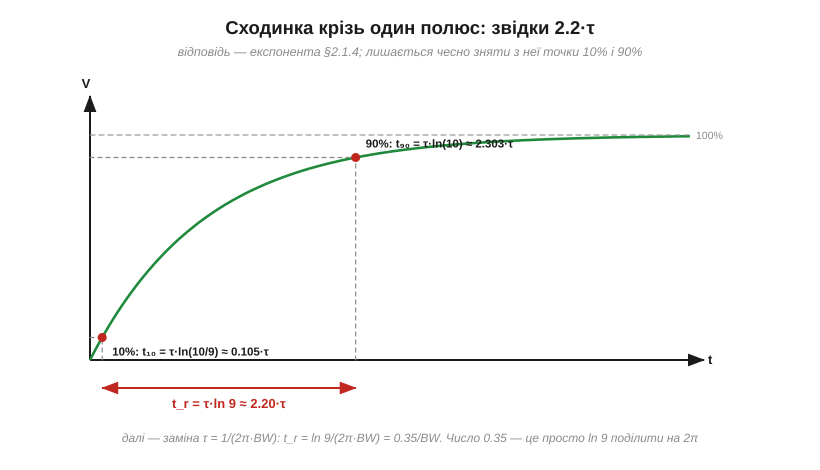
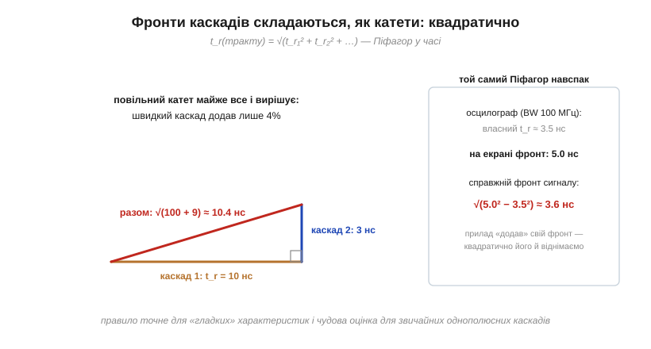

# 🧮 Фронт і смуга: звідки формула t_r ≈ 0.35/BW

> Смуга пропускання обмежує найкрутіший фронт, який система здатна відтворити, — звідси інженерне правило t_r ≈ 0.35/BW. Тут — чесне виведення в чотири рядки (число 0.35 виявиться просто ln 9, поділеним на 2π), доказ-інтуїція квадратичного складання фронтів — і чесна примітка, коли коефіцієнт «0.35» підмінюють іншим.

### Постановка: сходинка проти одного полюса

Найпростіша система зі смугою — однополюсна: RC-ФНЧ, чия точка −3 дБ і є його смугою BW. Подамо на неї ідеальну сходинку. Відповідь — знайома [експонента заряду RC](book:electronics/rc-time-constant):

```
V(t) = V₀·(1 − e^(−t/τ)),        τ = RC
```

А пара «τ ↔ f_c» з [RC-фільтра нижніх частот](book:electronics/rc-low-pass) пов'язує цю сталу часу зі смугою: BW = f_c = 1/(2πτ), тобто **τ = 1/(2π·BW)**. Лишилося виміряти фронт цієї експоненти.

### Чому 10–90%

**Час наростання** домовилися міряти між 10% і 90% кінцевого рівня — і не з примхи. Експонента торкається полиці лише асимптотично: час «від 0 до 100%» нескінченний за означенням, а біля самих країв реальна осцилограма потопає в шумі. Точки 10/90 вимірюються чітко — їх і беруть (для дуже дзвінких чи шумних систем інколи вживають 20–80%, це окрема домовленість).

### Виведення: чотири рядки

Розв'язуємо V(t) = 0.1·V₀ і V(t) = 0.9·V₀ відносно часу — логарифм робить це миттєво ([вставка про логарифми](book:math/logarithms): «скільки сталих часу?» — питання для ln):


*Десять відсотків експонента проходить швидко (0.105·τ), до дев'яноста повзе аж 2.303·τ. Різниця — 2.2 сталої часу: ось фізичне обличчя «часу наростання».*

```
t₁₀ = τ·ln(1/0.9) = τ·ln(10/9) ≈ 0.105·τ
t₉₀ = τ·ln(1/0.1) = τ·ln(10)   ≈ 2.303·τ
t_r = t₉₀ − t₁₀ = τ·ln 9       ≈ 2.197·τ
```

І фінальний крок — підставляємо τ = 1/(2π·BW):

```
t_r = ln 9/(2π·BW) = 2.197/(6.283·BW) ≈ 0.35/BW
```

Ось і вся «магія»: **0.35 = ln 9 / 2π**. Жодної емпірики — лише експонента, дві точки і одна заміна. Працює формула в обидва боки: осцилограф 100 МГц має власний фронт 3.5 нс; а тракт, що показує фронти 1 мкс, має смугу близько 350 кГц.

### Каскади: Піфагор у часі

Є ще одне правило для ланцюжка каскадів — їхні фронти складаються **квадратично**: t_r(тракту) = √(t_r₁² + t_r₂² + …). Звідки квадрати? Строге виведення живе в теорії згорток, але інтуїція проста і чесна: фронти каскадів «розмазують» сходинку незалежно один від одного — так само, як незалежні катети складаються в гіпотенузу. Подивіться, як це працює на числах:


*Каскад 10 нс плюс каскад 3 нс — це не 13 нс, а √(100+9) ≈ 10.4 нс: повільніший майже все вирішує сам. Праворуч — той самий Піфагор навспак: «віднімаємо» власний фронт осцилографа з виміряного.*

Два щоденні наслідки:

- **Домінує найповільніший.** Каскад, утричі швидший за сусіда, додає до фронту лише ~5% — тому в тракті досить зробити швидкими всі ланки, *крім однієї навмисне обмежувальної*, і саме вона задасть смугу.
- **Фронт приладу можна відняти.** Якщо осцилограф із власним t_r = 3.5 нс показав 5.0 нс, справжній фронт сигналу ≈ √(5.0² − 3.5²) ≈ 3.6 нс. Саме так «витягають» виміри на межі смуги приладу — хоч надійніше, звісно, узяти прилад зі смугою з п'ятиразовим запасом.

А зв'язка фронту зі смугою замикається і числом: два однакові каскади дають t_r більший у √2 — отже смугу вужчу в 1/√2... майже: точний розрахунок двох полюсів дає 0.64, бо «квадратичне» правило для однакових однополюсних ланок — оцінка, а не тотожність. Для оцінок «на серветці» розбіжність у кілька відсотків — шум.

### Коли 0.35 підмінюють

Коефіцієнт 0.35 — властивість **плавного однополюсного** коліна. У систем з іншою формою характеристики він інший:

- **Гаусова характеристика** (так налаштовували аналогові осцилографи: плавний спад без дзвону) — ті самі ≈ 0.34–0.35; формула чинна.
- **Різкий, «цегляний» зріз** (сучасні цифрові осцилографи з пласкою смугою і крутим спадом) — коефіцієнт повзе до **0.4–0.45**, а на фронтах з'являється невеликий дзвін: різке обрізання спектра безплатним не буває — [фазова відповідь](book:electronics/frequency-response) такого фільтра спотворює форму сигналу. Виробники чесно пишуть власний t_r у даташиті — він надійніший за будь-який коефіцієнт.

Тож формула-краватка на щодень: **t_r ≈ 0.35/BW для плавних систем, до 0.45/BW для різких**; порядок величини один, і для оцінок це майже завжди досить.

### Де це працює

Це правило — місток між двома мовами: часовою і частотною. Вибір осцилографа й правило п'ятиразового запасу смуги — пряме застосування. Оцінка «яку смугу з'їсть цей фронт» працює і на цифрових платах: кожен [фронт логіки](book:electronics/edges-rise-time) несе спектр до частот ~0.35/t_r, і саме ця оцінка вирішує, чи стане доріжка антеною. А «Піфагор у часі» рятує щоразу, коли вимірюване сумірне зі швидкістю самого вимірювача — від фронтів до ширини імпульсів.
