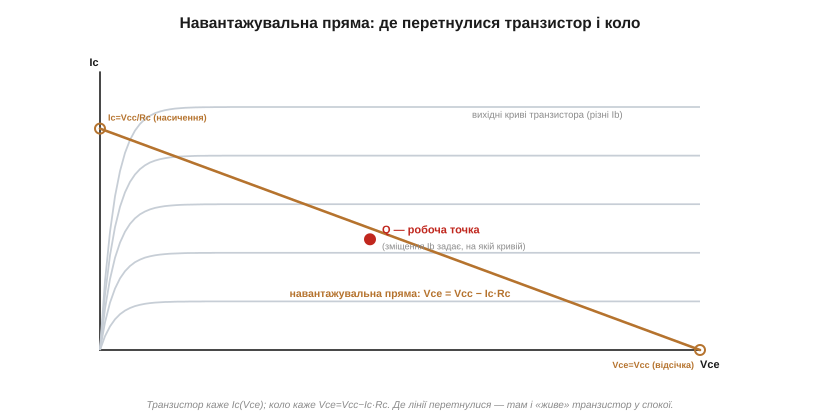
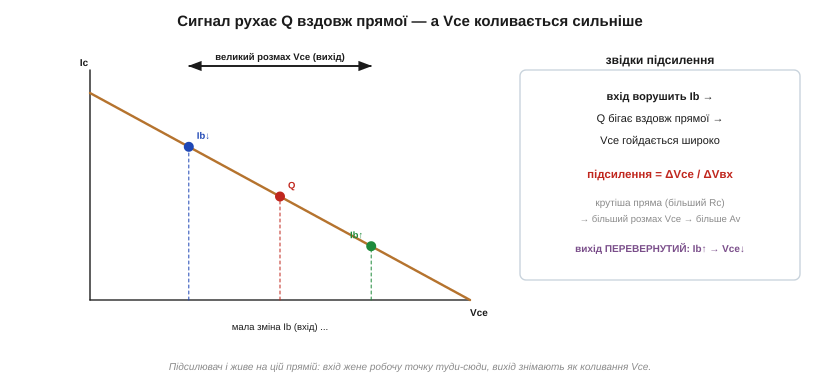

# 🧮 Робоча точка й навантажувальна пряма: де «живе» підсилювач

> Щоб [транзисторний підсилювач](topic:electronics/bjt-amplifier) працював без спотворень, його робоча точка має «сидіти» посередині — аби сигнал міг коливатися в обидва боки. Тут — графічний інструмент, яким цю «середину» знаходять точно: **навантажувальна пряма**. Один малюнок зв'язує транзистор і коло навколо нього й одразу показує, де транзистор спочиває й чому розмах сигналу саме такий.

### Дві умови водночас

Колекторний струм Ic і напруга на транзисторі Vce не можуть бути якими завгодно — їх **одночасно** тримають дві умови, і обидві мусять справджуватися.

Перша — від **транзистора**. Для заданого струму бази він пропускає свій Ic майже незалежно від Vce, поки лишається в [активному режимі](topic:electronics/bjt-regions): це сімейство **вихідних характеристик** — майже горизонтальних кривих, по одній на кожен Ib.

Друга — від **кола** навколо. У колекторному колі стоїть резистор Rc між живленням Vcc і транзистором; за [законом напруг Кірхгофа](topic:electronics/kvl) напруга живлення ділиться між резистором і транзистором:

```
Vcc = Ic·Rc + Vce      ⟹      Vce = Vcc − Ic·Rc
```

Це рівняння **прямої** на площині (Vce, Ic) — і зветься вона навантажувальною.

### Будуємо навантажувальну пряму

Пряму малюють за двома крайніми точками, кожна з яких має простий фізичний сенс:


*Сірі криві — вихідні характеристики транзистора (по одній на кожен Ib). Мідна пряма Vce = Vcc − Ic·Rc — від (Vcc, 0) до (0, Vcc/Rc). Де вона перетинає криву для заданого зміщення — там і сидить транзистор: робоча точка Q.*

```
Ic = 0   →  Vce = Vcc          (правий кінець: транзистор закритий — відсічка)
Vce = 0  →  Ic = Vcc/Rc        (лівий кінець: відкритий навстіж — насичення)
```

З'єднавши ці дві точки, дістаємо пряму всіх **можливих** станів кола з даним Rc і Vcc. Транзистор зобов'язаний бути десь на ній — більше йому ніде. А **де саме** — каже друга умова: на якій із вихідних кривих він сидить, задає струм бази (зміщення). Перетин навантажувальної прямої з кривою для робочого Ib і є **робоча точка Q** (*quiescent point*, точка спокою) — там транзистор спочиває, поки немає сигналу.

### Чому Q — посередині

Тепер видно сенс поради «сидіти посередині». Сигнал ворушить струм бази вгору-вниз, а робоча точка від цього **бігає вздовж навантажувальної прямої**. Якщо Q стоїть по центру, є місце хитнутися в обидва боки на повний розмах:


*Q посередині — сигнал хитається симетрично, не впираючись у краї. Q біля насичення — нижні півхвилі впираються в лівий кінець і зрізаються; Q біля відсічки — верхні впираються в правий і зрізаються — те саме обрізання (кліп), що псує вихід підсилювача.*

Зміщення (*bias*) ставлять так, щоб у спокої Vce було приблизно **половиною** Vcc — тоді сигнал може опустити його майже до нуля (насичення) і підняти майже до Vcc (відсічка) без обрізання. Зрушите Q до насичення — і перша ж велика від'ємна півхвиля впреться в лівий край прямої й зріжеться; зрушите до відсічки — зріжуться верхні. Саме тому встановлення робочої точки — перший крок проєктування підсилювача, ще до будь-якого сигналу.

### Підсилення — з нахилу

І останнє: на цій самій прямій видно, **звідки береться підсилення**. Мала зміна струму бази переводить транзистор на сусідню вихідну криву — Q зсувається вздовж прямої, а разом із ним сильно зсувається Vce:


*Вхід ворушить Ib → робоча точка бігає по прямій → Vce гойдається широко. Відношення розмаху Vce до розмаху входу — і є підсилення. Зверніть увагу: при Ib↑ струм росте, а Vce падає — вихід перевернутий.*

Чим **крутіша** навантажувальна пряма (більший Rc), тим сильніше та сама зміна Ic зрушує Vce — і тим більше підсилення за напругою. Тут одразу видно і **інверсію** [схеми зі спільним емітером](topic:electronics/bjt-amplifier): зростання Ib піднімає Ic, але через Vce = Vcc − Ic·Rc напруга на виході **падає** — рух по прямій вгору-вліво. А ще пряма пояснює межу розмаху: вихід не може вийти за відрізок між насиченням і відсічкою, скільки б ми не піднімали вхід, — звідси й обрізання при перевантаженні.

### Де ще працює цей прийом

Навантажувальна пряма — універсальний графічний прийом «коло + нелінійний прилад». Той самий хід працює і для діода з резистором: перетин [вольт-амперної характеристики діода](topic:electronics/diode-iv-curve) з прямою резистора так само дає робочу точку. Для підсилювача вона показує, де поставити Q і який буде розмах; цим же методом знаходять робочу точку при її стабілізації (емітерний резистор, дільник у базі), а в потужних каскадах по прямій рахують ще й розсіювану потужність. Хто бачить навантажувальну пряму, той бачить підсилювач наскрізь — без жодних формул, самим оком по графіку.
