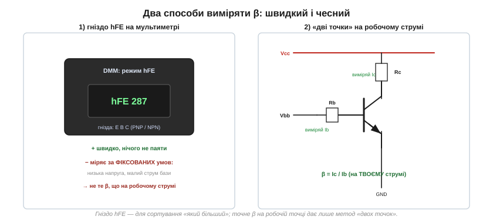
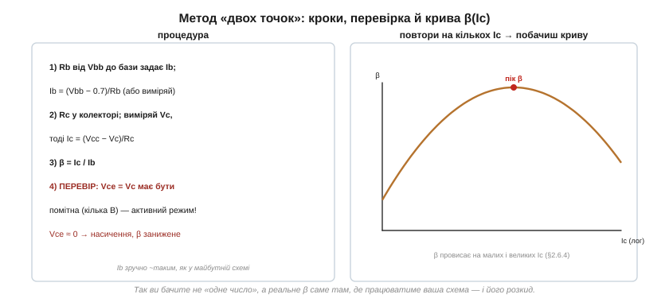

# ⚙️ Виміряти β самому: гніздо hFE й метод двох точок

β непевне й гуляє в рази — тож його часто доводиться **виміряти** власноруч. Два шляхи: швидко гніздом hFE на мультиметрі (і чому це число варто приймати з обережністю) і чесно методом «двох точок», що дає β саме на тому струмі, де працюватиме ваша схема.

### Два способи, дуже різні за чесністю


*Ліворуч — гніздо hFE: вставив транзистор, прочитав число. Праворуч — метод «двох точок»: задаєш струм бази резистором, міряєш струм колектора, ділиш. Перший швидкий, другий правдивий.*

### Спосіб 1: гніздо hFE — швидко, але грубо

У багатьох мультиметрів є режим **hFE** з гніздом на чотири отвори (E-B-C, окремо для PNP і NPN). Вставив ніжки за розпіновкою — прилад одразу показав число. Зручно для сортування: «який із цих двох транзисторів β більший» чи «живий він узагалі».

Але до самого числа варто ставитися критично. Гніздо міряє β за **фіксованих** умов, які зашиті в мультиметр: низька напруга (зазвичай ~2–3 В) і дуже малий струм бази (близько 10 мкА). А [β залежить від струму колектора](topic:electronics/bjt-gain) — воно провисає на малих струмах. Тож гніздо показує β на струмі, який може бути в сотні разів меншим за ваш робочий, — і число легко відрізняється від того, що транзистор покаже в реальній схемі. Гніздо hFE — це сортувальник, а не точний прилад.

### Спосіб 2: «дві точки» — на робочому струмі

Чесний вимір простий: самі задайте струм бази, виміряйте струм колектора, поділіть. Зберіть мінімальне коло — джерело Vbb через резистор Rb у базу, джерело Vcc через резистор Rc у колектор, емітер на землю:


*Rb задає Ib, Rc дозволяє порахувати Ic зі спаду напруги. β = Ic/Ib. Головна перевірка — Vce має бути помітною (транзистор у активному режимі), інакше β виходить занижене.*

```
1. Rb від Vbb до бази задає струм бази:
   Ib = (Vbb − 0.7)/Rb        (або виміряй амперметром у розрив бази)
2. Rc у колекторі; виміряй напругу на колекторі Vc, тоді
   Ic = (Vcc − Vc)/Rc
3. β = Ic / Ib
4. ПЕРЕВІР режим: Vce (= Vc) має бути помітною, кілька вольтів.
```

Крок 4 — найважливіший і найчастіше забутий. Формула Ic = β·Ib справедлива **лише в [активному режимі](topic:electronics/bjt-regions)**. Якщо Vce впала майже до нуля — транзистор у **насиченні**, колекторний струм обмежений уже не базою, а резистором Rc, і поділивши, ви дістанете занижене, неправдиве «β». Тому колекторний резистор добирають так, щоб за вашого струму на транзисторі лишалося хоч кілька вольтів. Побачили Vce ≈ 0 — зменшіть Rc (або підніміть Vcc) і повторіть.

### Чому це краще — і що з кривою

Перевага методу очевидна: ви міряєте β саме на тому **струмі й напрузі**, де транзистор працюватиме, — а не на випадкових умовах гнізда. А якщо повторити вимір на кількох різних Ic (міняючи Rb чи Vbb), проступить уся **[крива β(Ic)](topic:electronics/bjt-gain)**: пік десь посередині діапазону, провисання на малих і великих струмах. Це наочно показує, чому в розрахунках беруть не «типове» β, а мінімальне на робочому струмі.

### Дрібний шрифт

- **Самонагрів.** На великому струмі транзистор гріється, а β з температурою повзе — дайте показам усталитися й не тримайте велику потужність довго.
- **Амперметр у базі.** Якщо міряєте Ib безпосередньо мультиметром у розрив, його опір додається послідовно з Rb; за великого Rb це мізер, але пам'ятайте про нього.
- **Розкид — це норма.** Зміряєте кілька «однакових» транзисторів — і [β різнитиметься вдвічі-втричі](topic:electronics/bjt-gain). Це не брак приладу, а сама природа β; власне заради цього його й міряють, коли треба точно.

> ⚙️ **Підсумок методу.** Гніздо hFE — для швидкого «більше/менше» й перевірки «чи живий». Точне β на робочій точці дає лише метод «двох точок»: задав Ib резистором, виміряв Ic, поділив — **перевіривши**, що Vce помітна (активний режим, а не насичення). Повторите на кількох струмах — побачите криву β(Ic) власноруч і зрозумієте, чому в проєктуванні на β не покладаються, а [беруть його з добрим запасом](topic:electronics/bjt-switch).
