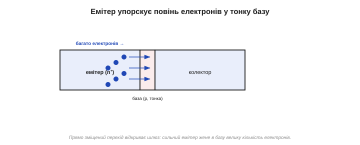
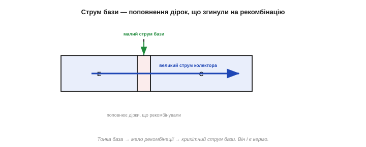

# Як працює: малий струм бази керує великим струмом колектора

У серці біполярного транзистора лежить **транзисторний ефект**. Його [будова](book:electronics/bjt-structure) — три шари, два переходи, тонка база. Лишається зрозуміти диво: чому **кволий** струм у базу породжує **потужний** струм через колектор. Простежмо це крок за кроком, ідучи за носіями в NPN-транзисторі (у PNP усе дзеркально).

### Налаштування: один перехід відкритий, другий замкнений

Щоб транзистор запрацював підсилювачем, два його переходи зміщують **протилежно**:

- перехід **база–емітер** — у [**прямому** напрямку](book:electronics/diode-bias) (база приблизно на 0.7 В позитивніша за емітер), тож він **відкритий**;
- перехід **база–колектор** — у **зворотному** (колектор сильно позитивний щодо бази), тож він **замкнений**.

Така комбінація зветься **активним режимом** (він — один із кількох [режимів роботи](book:electronics/bjt-regions) транзистора). Саме в ньому коїться вся магія.

На перший погляд налаштування дивне: один перехід відкрили, другий **замкнули** — то як же струм піде наскрізь? Якби це й справді були два окремі діоди, струм би й не пішов — замкнений B-C усе перекрив би. Уся хитрість у тому, що база **спільна й тонка**: електрони, упорснуті відкритим переходом, дістаються другого переходу **зсередини бази**, а його зворотне поле їх не відштовхує, а навпаки **затягує** в колектор. Те, що для звичайного діода — глуха стіна, для електронів із бази — відчинені ворота. (Якщо ж і другий перехід відкрити — подати на колектор замало напруги, — транзистор «захлинеться» й перестане підсилювати; це режим [**насичення**](book:electronics/bjt-regions). Поки тримаймо B-C замкненим — у цьому й суть активного режиму.)


*Налаштування NPN: перехід база–емітер зміщено прямо (відкритий, ~0.7 В), перехід база–колектор — зворотно (замкнений, але під сильним полем). Здавалося б, зворотний B-C мав би все перекрити — та саме його поле й «вловлюватиме» носії.*

### Емітер упорскує потік носіїв

Відкритий перехід база–емітер означає, що сильно легований **емітер** (лат. *emittere* — випускати) жене у базу **повінь** електронів — багато й охоче (на те він і «емітер»). Це той самий прямий струм діода, лише носіїв тут особливо багато, бо емітер легований сильно.


*Прямо зміщений перехід база–емітер відкриває шлюз: сильно легований емітер упорскує в базу велику кількість електронів. Це початок головного потоку.*

Чому емітер легують **сильно**? Бо що більше в ньому вільних електронів, то потужніший потік він упорсне в базу за тієї самої прямої напруги. Сильний емітер — це повноводе джерело носіїв, з якого й живиться весь головний струм транзистора. Власне, тому головний потік і зветься струмом **емітера** та **колектора**, а не бази: база лише керує, а несуть потік емітер із колектором.

### Тонка база: майже всі проскакують у колектор

А тепер — ключ. Електрони, що зайшли в базу (p-тип), там [**неосновні** носії](book:physics/doping) — і за звичайних умов мали б рекомбінувати з дірками й зникнути. Та база **така тонка**, що електрони долітають до її дальнього краю — до переходу база–колектор — **перш ніж** устигнуть рекомбінувати. А там на них чекає **сильне поле** зворотно зміщеного B-C, яке миттю **підхоплює** їх і втягує в колектор.

Через те що база тонка, переважна більшість упорснутих електронів — десь **99 із 100** — проскакують її наскрізь і стають **струмом колектора**. І лише жалюгідний відсоток встигає рекомбінувати в базі.


*Майже всі електрони пролітають тонку базу, не встигнувши рекомбінувати, і їх підхоплює поле зворотного переходу B-C — це струм колектора. Лише дрібна частка (≈1 із 100) гине в базі на рекомбінацію.*

Тут ідуть справжні **перегони**: упорснутий електрон або встигне пролетіти базу й бути спійманим колектором, або загине в рекомбінації по дорозі. Тонка база робить перші перегони майже завжди виграшними. Частку електронів, що долітають, позначають α (альфа), і в доброго транзистора вона дуже близька до одиниці (0.99 і вище). Саме ця близькість α до одиниці — «майже всі долітають» — і є першопричиною великого підсилення.

Образно, для електрона, що долетів до краю бази, зворотне поле колектора — це **обрив**, з якого він радо «скочується». Потрапивши в [збіднену область переходу](book:physics/pn-junction) B-C, він уже не повернеться, а покотиться полем у колектор. Тому колектор (лат. *colligere* — збирати) і «збирає» геть усе, що до нього долетіло, — звідси й майже стовідсоткова ефективність переносу.

### Звідки береться струм бази

А що ж той нещасний ~1 %, що таки рекомбінував? Кожна рекомбінація «з'їдає» в базі одну дірку. Щоб база лишалася нейтральною (і перехід B-E — відкритим), ці витрачені дірки треба **поповнювати** — і саме це поповнення, що притікає крізь вивід бази, і є **струмом бази**. Інакше кажучи, струм бази — це маленький «податок на рекомбінацію», і він **малий** саме тому, що база тонка й рекомбінує мало.

Зверніть увагу, чому саме струм бази став **кермом**. Він нерозривно зв'язаний із прямою напругою на переході база–емітер: відкриєш перехід сильніше — побільшає і впорснутих електронів, і їхньої рекомбінації, тобто струм бази й струм колектора зростуть **разом**, в одній пропорції. Тому, керуючи маленьким струмом бази, ви насправді керуєте тим, наскільки відчинено шлюз емітера, — а отже, і всім потоком у колектор. База мала, але владна.

А що, як струму в базу не дати взагалі — лишити її ні до чого не під'єднаною? Тоді нема кому поповнювати рекомбіновані дірки, перехід B-E зачиняється — і великий струм колектора **спиняється**. Нема струмка бази — нема й потоку: керування справді в руках бази, і саме тому в схемах базу ніколи не лишають «висіти в повітрі».


*Дірки, що згинули на рекомбінацію з тим ~1 % електронів, поповнюються струмом, який притікає крізь базу. Це і є струм бази — малесенький, бо рекомбінує лише крихта носіїв. Тонка база → мало рекомбінації → крихітний струм бази.*

### Мале керує великим: Ic ≈ β·Ib

Ось і розв'язка. Великий потік (струм колектора) і крихітний «податок» (струм бази) пов'язані **сталим відношенням**, що його задають геометрія й легування транзистора:

```
Ic ≈ β · Ib       (β — коефіцієнт підсилення, типово ≈ 100)
Ie = Ic + Ib      (емітер = колектор + база)
```

Тобто струм колектора в **сотню разів** більший за струм бази. А оскільки відношення стале, то, **трохи** піднявши струмок бази, ви в стільки ж разів піднімаєте могутній струм колектора. Маленьке на вході — велике на виході: це і є **підсилення**, тепер уже на рівні фізики. Енергію для «великого» дає, звісно, [джерело в колі колектора](book:electronics/transistor-idea) — база лише **керує**, не живить.


*Майже весь струм іде емітер → колектор (товста стрілка); у базу відгалужується лише тонкий струмок. Їхнє відношення стале: Ic ≈ β·Ib (β ≈ 100). Тому кволий струм бази керує струмом колектора, у сто разів більшим.*

> 🔧 **Навіщо це.** Звідси — головне практичне правило роботи з BJT: щоб пустити великий струм через колектор, у базу треба подати приблизно в β разів менший струм. Хочете ввімкнути навантаження на 100 мА транзистором із β = 100 — досить ~1 мА в базу. Це і робить транзистор «підсилювачем струму»: дрібним керуєш великим. (А саме [число β](book:electronics/bjt-gain) й те, як його читати з даташита, — окрема тема.)

Прикиньмо числом. Хай β = 100. Подали в базу 0.5 мА — у колекторі потече ≈ 50 мА. Підняли базу до 1 мА — колектор стрибнув до 100 мА. Бачите: **зміна** входу віддзеркалюється стократ більшою зміною виходу — і саме це використовують у підсилювачі, подаючи на базу слабкий сигнал і знімаючи з колектора потужну його копію. Інженери так і кажуть: BJT — це **джерело струму, кероване струмом** (струм колектора підкоряється струмові бази). А в ключовому режимі ту саму властивість беруть грубіше: є струмок у базі — колектор «увімкнено», нема — «вимкнено».

Є й другий, рівноправний погляд на те саме. Можна вважати, що струмом колектора керує не стільки сам струм бази, скільки **напруга** база–емітер: трохи підняв U_BE — і струм колектора зріс ([експоненційно, як у діода](book:electronics/diode-iv-curve)). Обидва погляди правильні й корисні: «керування струмом» зручне для ключів і швидких прикидок, «керування напругою» — для тонкого аналізу підсилювачів. Ми переважно триматимемося першого, простішого.

### Чому саме тонка база й сильний емітер

Тепер видно, навіщо вся та несиметрія в [будові транзистора](book:electronics/bjt-structure). **Тонка база** — щоб рекомбінувало якнайменше носіїв: мало рекомбінації → крихітний струм бази → велике β (підсилення). Зробіть базу товстою — і більшість електронів рекомбінують, не долетівши; струм бази розбухне, β впаде до одиниць, підсилення зникне. **Сильно легований емітер** — щоб потік крізь B-E несли переважно «потрібні» носії (електрони з емітера), а не марні (дірки з бази); це теж піднімає ефективність. Отже, дивна на вигляд будова транзистора — це рецепт великого β. Щоб відчути роль тонкості: подвойте товщину бази — і вдвічі (чи більше) зросте частка електронів, що рекомбінують, тобто струм бази; β відповідно впаде. Тому виробники женуться за якомога тоншою, але ще керованою базою — це прямий шлях до більшого підсилення.

Варто наголосити: у **PNP** усе те саме, лише дзеркально — емітер упорскує **дірки**, полярності обернені, а ролі електронів і дірок міняються місцями. Принцип незмінний: тонка база, мало рекомбінації, велике β. Тож, зрозумівши NPN, ви автоматично розумієте й PNP.

Зведімо подорож носія в один ланцюжок: **відкритий B-E** → емітер упорскує електрони в базу → **тонка база** пропускає майже всі → **зворотне поле B-C** затягує їх у колектор → лише ~1 % рекомбінує, і цей відсоток притікає як струм бази. Уся фізика біполярного транзистора, по суті, вміщається в це одне речення.

### Аналогія: турнікет із крихітним керуванням

Уявіть турнікет на стадіоні: крізь нього суне величезний натовп (струм колектора), а контролер біля нього лише **дозволяє** прохід легким рухом (струм бази). Маленьке зусилля керує великим потоком — і що «легше» влаштовано керування (що тонша база), то менше зусилля потрібно на той самий натовп. Транзистор — саме такий турнікет для струму: крихітний керувальний струмок пропускає в сто разів більший.


*Образ транзистора: великий потік проходить турнікет, а контролер керує ним крихітним зусиллям. Що «тонша база» (легше керування), то менший керувальний струм на той самий потік — то більше підсилення.*

Найяскравіше це працює в підсилювачі звуку: кволий струм від мікрофона, поданий у базу, керує в сто разів більшим струмом колектора, що живить динамік від батареї. Форму звуку задає мікрофон, силу — батарея, а транзистор їх **поєднує**. Це рівно та [«активність» активного приладу](book:electronics/transistor-idea), тепер пояснена зсередини: транзистор не додає енергії, а слабким сигналом ліпить із енергії джерела потужну копію.

Порівняймо з [реле](root:embedded/flyback-protection): там малий струм котушки теж керує великим струмом контактів. Але реле — або повністю ввімкнено, або вимкнено, повільне й з рухомими частинами; транзистор же керує **плавно**, миттєво й без зносу. Тому він і витіснив реле всюди, де потрібні швидкість або підсилення, лишивши йому хіба що комутацію дуже великих чи високовольтних навантажень.

### Підсумок: уся фізика в одному правилі

Отже, транзисторний ефект розкрито: емітер упорскує носії, тонка база майже їх не затримує, колектор збирає, а крихітний струм бази (податок на рекомбінацію) керує всім потоком за правилом Ic ≈ β·Ib. Саме [число β](book:electronics/bjt-gain) — наскільки колекторний струм більший за базовий — і визначає, який це підсилювач; а вже з цієї єдиної властивості будують дві найкорисніші схеми: [ключ](book:electronics/bjt-switch) і [підсилювач](book:electronics/bjt-amplifier).

---
