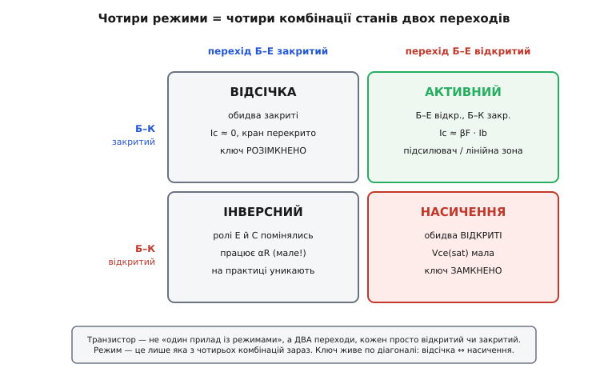
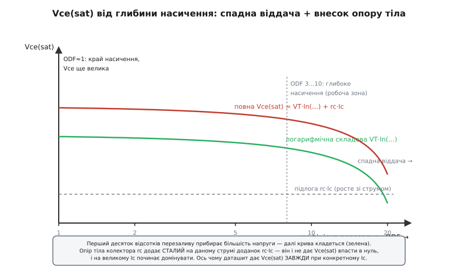

# Режими BJT: чотири стани і природа Vce(sat)

<preknowlist>
- [Модель Еберса — Молла](topic:electronics/ebers-moll) — транзистор як два зчеплені діоди зі спільним керуванням; система з трьох струмів виводів через дві напруги переходів.
- [Робота BJT](topic:electronics/bjt-operation) — три леговані шари (емітер, база, колектор) із двома p-n-переходами і тонкою базою між ними; Ic = β·Ib.
- [Підсилення β](topic:electronics/bjt-gain) — коефіцієнти передавання струму: β зі спільним емітером і α зі спільною базою, зв'язок β = α/(1 − α).
- [ВАХ діода](topic:electronics/diode-iv-curve) — струм переходу росте експонентою від напруги, I = Iₛ·(e^(V/Vₜ) − 1), і що таке тепловий потенціал Vₜ ≈ 26 мВ.
</preknowlist>

Питати «у якому режимі транзистор» звучить так, ніби режим — це якийсь окремий вимикач усередині приладу, і їх треба завчити як окремі явища. Насправді ж режим не закладений у транзистор — його **задає ззовні** той, хто прикладає напруги. У транзистора всього два переходи, кожен може бути або відкритий, або закритий, і це вичерпує все: два переходи по два стани дають рівно **чотири** комбінації, і кожна комбінація — це і є режим. Не чотири окремі правила, а чотири клітинки таблиці 2×2.

Ця стаття веде дві лінії. Перша — показати, що чотири режими не вигадані, а прямо випадають із рівнянь. Друга, і головна, — розібрати найтонший із них, **насичення**, і відповісти на питання, яке в коротких оглядах лишається без пояснення: чому на відкритому транзисторі падає не нуль, а невелика, але вперта напруга Vce(sat) ≈ 0.1…0.3 В, від чого вона залежить і де її межа. Відповідь на це питання і є справжнє розуміння того, як користуватися транзистором-ключем.

## Чотири клітинки: стани двох переходів

Візьмемо готовий результат [моделі Еберса — Молла](topic:electronics/ebers-moll): три струми виводів виражаються через два «внутрішні» струми переходів, кожен — за законом діода від своєї напруги.

```
I_F = I_ES·(e^(Vbe/Vₜ) − 1)     ← перехід база–емітер
I_R = I_CS·(e^(Vbc/Vₜ) − 1)     ← перехід база–колектор

Ic = αF·I_F − I_R
Ie = I_F − αR·I_R
```

Тут αF (типово 0.98…0.998) — частка прямого струму, що долітає крізь тонку базу до колектора, а αR (типово 0.1…0.5) — та сама частка в оберненому напрямі, і вона значно менша, бо колектор конструктивно не пристосований впорскувати носії. Струм бази — просто різниця, Ib = Ie − Ic, тож окремого рівняння для нього не треба.

Тепер поставимо єдине питання: який знак у кожного з двох переходів? Прямо зміщений перехід (V > ~0.6 В) відкритий — його експонента велика; зворотно зміщений (V ≤ 0) закритий — експонента гасне до нуля. Дві незалежні відповіді, чотири комбінації.


*Транзистор — не «прилад із режимами», а два переходи, кожен просто відкритий чи закритий. Режим — лише яка з чотирьох комбінацій зараз. Ключ живе по діагоналі: відсічка ↔ насичення.*

**Обидва закриті → відсічка** *(cutoff)*. Vbe і Vbc малі чи від'ємні, обидві експоненти ≈ 0, тож I_F ≈ 0 і I_R ≈ 0. Підставляємо: Ic ≈ 0, Ie ≈ 0. Тече лише мізерний зворотний струм витікання — той самий, що псує ідеальні «нулі» в реальних схемах. Кран перекрито.

**Тільки база–емітер відкритий → активний режим** *(active)*. I_F велике, I_R ≈ 0 (перехід база–колектор замкнено зворотним зсувом). Рівняння радикально спрощуються:

```
Ic ≈ αF·I_F
Ie ≈ I_F
```

Поділивши одне на одне, дістаємо Ic ≈ αF·Ie, а струм бази — це різниця, Ib = Ie − Ic = I_F·(1 − αF). Звідси знамените:

```
β = Ic / Ib = αF / (1 − αF)
```

Ось математичний корінь того, чому β таке велике і водночас таке **непевне**: якщо αF = 0.99, то β = 99; трохи чистіший транзистор із αF = 0.995 дає вже β = 199. Майже невимірна зміна αF (99.0% → 99.5%) **подвоює** β, бо дільник 1/(1 − αF) шалено чутливий там, де αF близький до одиниці. αF — тверда фізична величина, β — її ненадійне відлуння; саме тому в розрахунку ключа спираються не на «типове» β, а на гарантований мінімум.

**Тільки база–колектор відкритий → обернено-активний режим** *(reverse active)*. Дзеркало активного: транзистор увімкнено «догори ногами», колектор працює за емітер. Головує αR, а він малий, тож підсилення βR = αR/(1 − αR) жалюгідне — одиниці, а не сотні. На практиці цей режим оминають; але його «домішка» вилазить у насиченні, куди ми зараз і йдемо.

**Обидва відкриті → насичення** *(saturation)*. Ось клітинка, заради якої варто було затіватися. Обидва переходи проводять: I_F велике **і** I_R помітне. У рівняннях жоден доданок не можна відкинути — це єдиний режим, де працює повна модель без спрощень. Саме тому насичення й називають «найскладнішим»: у ньому Vce не падає в нуль, і його величину задає тонкий баланс двох ненульових струмів. Розберімо цей баланс до кінця.

## Насичення: чому Vce(sat) не нуль

Транзистор заганяють у насичення, щоб на ньому падало якнайменше і навантаженню діставалося майже все живлення. Насичення настає, коли струм бази стає **надлишковим** — більшим, ніж активному режиму треба на даний Ic. Кран уже відкрито на повну, більше струму колектор узяти не може (його обмежує зовнішнє коло, Ic ≈ Vcc/R), а база все підливає. Надлишку нема куди подітися — і він **відчиняє другий перехід**, база–колектор. Тепер обидва відкриті.

Ось звідки береться напруга на відкритому ключі. За означенням вона — різниця напруг двох переходів (обидві відлічуються від спільної бази):

```
Vce = Vbe − Vbc
```

Обидві напруги — прямі падіння на p-n переходах, кожне близько 0.7…0.8 В, і вони майже рівні. Тому їхня різниця — це не пів вольта і не нуль, а якраз ті **десяті вольта**. Але наскільки саме десяті? Щоб знайти точне число, обернемо закон діода — виразимо напругу через струм переходу:

```
Vbe = Vₜ·ln(I_F / I_ES)
Vbc = Vₜ·ln(I_R / I_CS)
```

(У насиченні струми великі проти струмів насичення, тож одиницею всередині логарифма нехтуємо.) Різниця дає:

```
Vce(sat) = Vₜ·ln[ (I_F / I_ES) · (I_CS / I_R) ]
```

Це поки що через **внутрішні** струми переходів, яких ми не міряємо. Перепишемо через **зовнішні** — Ic і Ib, що їх задає схема. Розв'язавши два рівняння Еберса — Молла відносно I_F та I_R (звичайне виключення) і скориставшись [співвідношенням взаємності](topic:electronics/ebers-moll) αF·I_ES = αR·I_CS — воно скорочує всі внутрішні струми насичення, — дістаємо канонічну форму (ту саму, що в підручнику Седри — Сміта):

```
                1     1 + (1 − αR)·β_forced
Vce(sat) = Vₜ·ln( ──── · ────────────────────── )
                αR      1 − β_forced/β_F
```

де β_forced = Ic/Ib — **реальне** відношення струмів у робочій точці ключа, а β_F — паспортне (активне) β. Не лякаймося вигляду: важлива не формула на пам'ять, а що вона каже. А щоб побачити її живою, підставмо числа.

**Умова: 2N2222 у насиченні, β_forced = 12.5, αF = 0.99 (отже β_F ≈ 99), αR = 0.5, Vₜ = 26 мВ.**
```
чисельник = (1/αR)·(1 + (1 − αR)·β_forced)
          = (1/0.5)·(1 + 0.5·12.5) = 2·7.25 = 14.5
знаменник = 1 − β_forced/β_F = 1 − 12.5/99 = 0.874
відношення = 14.5 / 0.874 = 16.6
Vce(sat) = 0.026 · ln(16.6) = 0.026 · 2.81 ≈ 0.073 В ≈ 73 мВ
```

Усього 73 мВ — а даташит на той самий транзистор каже «0.3 В». Розбіжність не помилка: **власна** Vce(sat) переходів справді крихітна, десятки мілівольт. Решту додасть доданок, якого в цій формулі ще немає; до нього дійдемо за мить. Спершу вичавимо все з логарифма — у ньому сховано три практичні уроки.

### Що каже логарифм

**Керує не струм, а відношення струмів.** У формулі немає окремо Ic чи Ib — є лише їхнє відношення β_forced. Подвоїш і колекторний, і базовий струм разом — Vce(sat) не зміниться. Транзистор у насиченні тримає напругу не за абсолютною величиною струму, а за тим, **наскільки щедро** заливають базу відносно колектора.

**Звідси випливає перезалив і його міра.** Що менший β_forced (більше базового струму на той самий колекторний), то менше відношення під логарифмом, то менша Vce(sat). Це і є строгий сенс поради «перезалити базу». А міру перезаливу задають **коефіцієнтом перезаливу** *(overdrive factor, ODF)*:

```
ODF = Ib(реальний) / Ib(на межі насичення) = β_F / β_forced
```

На краю насичення β_forced = β_F, тобто ODF = 1, і знаменник формули 1 − β_forced/β_F = 0 — відношення злітає в нескінченність, Vce велика: транзистор ще майже в активному режимі. Заганяємо глибше (ODF > 1) — знаменник відкривається, відношення падає, Vce(sat) стискається.

**Віддача спадна.** Логарифм — повільна функція. Перший крок углиб (ODF з 1 до 3) міняє його аргумент у рази й прибирає більшу частину напруги. Наступний такий самий крок (ODF з 10 до 30) міняє аргумент лише трохи. Тому крива Vce(sat)(ODF) — це **круте падіння, що швидко кладеться в поличку**: перший десяток відсотків перезаливу дає майже весь виграш, а далі базовий струм доливають майже задарма.


*Логарифмічна складова круто падає з ODF і швидко кладеться — глибше насичення дає дедалі меншу віддачу. Опір тіла колектора додає сталий на даному струмі доданок rc·Ic: він не дає Vce(sat) впасти в нуль і на великому Ic домінує. Тому даташит завжди наводить Vce(sat) при конкретному Ic.*

> 🔧 **Навіщо це.** Спадна віддача — пряма інструкція проєктувальнику. Гнатися за надглибоким насиченням (ODF 20, 50) немає сенсу: Vce(sat) майже не зменшиться, а плата велика — на статиці дарма грієш резистор бази й вантажиш джерело сигналу, а на динаміці роздуваєш накопичений у базі заряд, що затягує вимкнення (звідси й [обмеження швидкості комутації](topic:electronics/bjt-switching-speed)). ODF 3…10 — золота середина: логарифм уже майже вичерпаний, а сховок ще стерпний.

### Звідки береться доданок rc·Ic

Тепер закриємо розбіжність «73 мВ проти 0.3 В». Модель Еберса — Молла описує **ідеальні** переходи — так, ніби від виводу колектора до самого переходу струм тече без опору. Насправді між металевим контактом колектора і власне переходом лежить шматок слабо легованого напівпровідника — **тіло колектора** — і в нього ненульовий питомий опір rc (одиниці ом у малому транзисторі, частки ома в силовому). Реальний струм колектора, проходячи крізь це тіло, створює на ньому звичайне омічне падіння:

```
Vce(sat, реальна) = Vce(sat, з формули) + rc·Ic
                    └── логарифм, десятки мВ ──┘   └ омічний доданок ┘
```

Ось чому в прикладі 73 мВ обертаються на паспортні ~0.3 В: при Ic = 150 мА і rc ≈ 1.5 Ом додається 1.5·0.15 = 0.225 В, і разом виходить 0.073 + 0.225 ≈ 0.30 В — рівно даташитне число. Цей доданок докорінно **інакший** за логарифмічний, і в цій різниці — практичний урок:

- **Логарифмічна складова** залежить від *відношення* струмів (β_forced, ODF) і **не залежить** від абсолютного Ic. Її зменшують перезаливом бази.
- **Омічний доданок rc·Ic** залежить від *абсолютного* Ic **лінійно** і **зовсім не реагує** на перезалив бази — хоч заллєш базу по вінця, він не зрушить. Його збиває лише менший струм або транзистор із меншим rc (тобто більший, силовий).

На малому струмі головує логарифм — тому дрібний ключ у насиченні дає милі десятки мВ. На великому струмі rc·Ic **переганяє** логарифм і домінує — тому Vce(sat) силового транзистора на амперах вимірюється вже вольтами і росте зі струмом майже лінійно. Ось точна причина, чому даташит **завжди** наводить Vce(sat) при конкретному струмі («Vce(sat) = 0.3 В при Ic = 150 мА, Ib = 15 мА»): два числа умови керують двома різними складовими — Ib/Ic задає β_forced (логарифм), а сам Ic задає rc·Ic (омічний доданок). Візьмеш у своїй схемі більший струм — Vce(sat) буде вища за табличну.

## Що режими означають на практиці

Тепер видно, чому три робочі стани транзистора дають два зовсім різні способи його вжитку — і чому вибір режиму важить більше за вибір самого транзистора.

**Ключ** живе на **діагоналі** відсічка ↔ насичення: два холодні кінці, між якими прилад проскакує гарячу середину. У відсічці струм ≈ 0, у насиченні напруга ≈ Vce(sat) — в обох станах добуток P = Vce·Ic малий, транзистор холодний. Саме на цих двох клітинках стоїть [транзистор як ключ](topic:electronics/bjt-switch) і вся цифрова логіка. Ціна насичення — накопичений у базі надлишковий заряд, що затягує вимкнення (тому [швидкі ключі](topic:electronics/bjt-switching-speed) насичення навмисне обмежують).

**Підсилювач** тримають у **активному** режимі, посеред карти, де Ic = β·Ib і вихід лінійно йде за входом. Там транзистор гарячий (і напруга, і струм помітні водночас), зате вірно відтворює сигнал — на цьому стоїть [транзистор-підсилювач](topic:electronics/bjt-amplifier).

І остання ниточка — туди, де насичення стає проблемою. Складений транзистор ([пара Дарлінгтона](topic:electronics/darlington-pair)) має у відкритому стані **два** переходи поспіль, тож його Vce(sat) подвоєна; на амперних струмах, де вже домінує rc·Ic, ця підвищена напруга обертається ватами грійки. Саме тут вигіднішим стає [польовий транзистор](topic:electronics/field-control), у якого замість Vce(sat) — просто опір відкритого каналу, що на великому струмі кидає менше.

Отже, режим — це не властивість транзистора, а властивість того, **як зміщено два його переходи**. Прилад один; відсічка й насичення роблять із нього цифровий вимикач, активний режим — аналоговий підсилювач. Обравши, які переходи відкрити, ви обираєте, у якому з двох світів зараз працюєте, — і в цьому виборі вся суть уміння користуватися біполярним транзистором.
