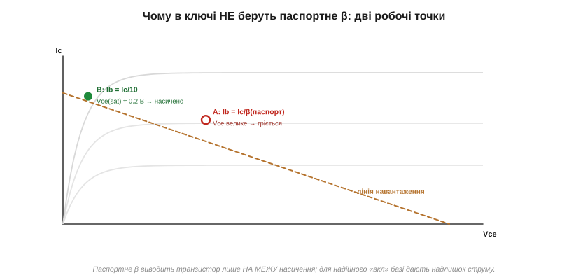
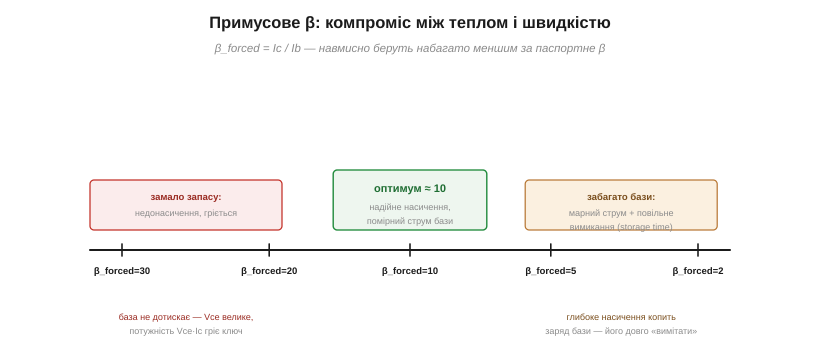
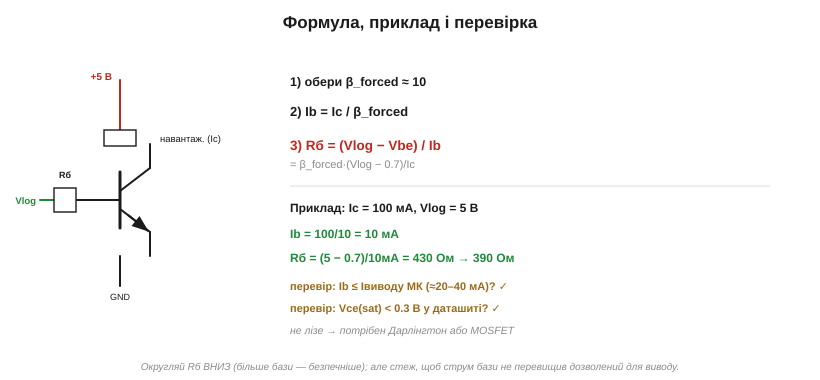

# 🧮 Розрахунок резистора бази: насичення з запасом

Резистор бази транзисторного ключа рахують «із запасом». Розберемо, **чому** цей запас потрібен, що таке примусове β, звідки взялося магічне число ≈10 — і як перевірити, що ключ справді насичений, а не просто «майже відкритий».

### Пастка паспортного β

Спокуса очевидна: транзистор має [коефіцієнт підсилення β](book:electronics/bjt-gain) — скажімо, 200, — тож для струму навантаження Ic вистачить струму бази Ib = Ic/200. Здавалося б, логічно. І хибно. Річ у тім, що співвідношення **Ic = β·Ib** працює лише в [**активному** режимі](book:electronics/bjt-regions) — там, де транзистор поводиться як підсилювач. А ключ нам потрібен у **насиченні**: відкритий «до кінця», з мінімальним падінням Vce(sat) ≈ 0.2 В. Якщо завести рівно Ib = Ic/β(паспорт), транзистор опиниться лише **на межі** насичення:


*Рис. Точка A (Ib = Ic/β паспортне) сидить на самій межі — Vce ще велике, транзистор гріється. Точка B (Ib = Ic/10) — глибоко в насиченні, Vce(sat) ≈ 0.2 В. Для надійного «вкл» базі дають надлишок струму.*

Чому межа небезпечна? По-перше, паспортне β — не константа: воно [гуляє в рази від екземпляра](book:electronics/bjt-gain), падає на холоді й на малих струмах. Транзистор, що ледь насичувався за β = 200, із сусіднього в партії з β = 100 уже **не** насититься. По-друге, недонасичений ключ має велике Vce — а отже, розсіює помітну [потужність P = Vce·Ic](book:physics/electric-power) і гріється там, де мав би бути холодним. Ключ або насичений, або ні; «майже» тут не працює.

### Примусове β: беремо менше навмисно

Рішення — навмисно завести в базу **більше** струму, ніж вимагає паспортне β. Уводять поняття **примусового β** (*forced beta*) — це відношення, яке ми **самі задаємо**:

```
β_forced = Ic / Ib       (те, що ми нав'язуємо схемою)
```

Для надійного ключа беруть β_forced ≈ **10** — у багато разів менше за паспортне β (100–300). Тобто струму бази дають у 10–30 разів більше, ніж «теоретично потрібно». Цей надлишок і є той самий «запас на насичення» з теми: він заганяє транзистор глибоко в насичення й тримає його там попри будь-який розкид β.

### Звідки саме ≈10

Чому не 2 і не 50? Це компроміс із двох боків:


*Рис. Замало запасу (β_forced близько до паспортного) — недонасичення й нагрів. Забагато (β_forced = 2–3) — марний струм бази й повільне вимикання. Близько 10 — золота середина.*

**Згори (β_forced завелике, мало бази):** недонасичення, велике Vce, нагрів — те, чого ми щойно уникали. **Знизу (β_forced замале, багато бази):** дві біди. Перша — марнотратство: струм бази тече з виводу мікроконтролера, а той дає лише десятки міліампер; глибоке перенасичення легко вимагає більше, ніж вивід може віддати. Друга, тонша — **швидкість вимикання**. У глибокому насиченні в базі накопичується надлишковий заряд (та сама ідея [накопиченого заряду](book:electronics/rc-time-constant), що й у конденсаторі); щоб вимкнути транзистор, цей заряд треба спершу «вимести», на що йде час (*storage time*). Що глибше насичення — то повільніше вимикання. Тому β_forced ≈ 10 — золота середина: надійне насичення без зайвого марнування струму й без надмірної інерції. (Для дуже швидких ключів насичення навмисне обмежують діодом Шотткі між базою й колектором — але це вже тонкощі імпульсної техніки.)

### Виведення формули і перевірка

Тепер сама формула. Резистор бази бере на себе різницю між напругою сигналу й падінням база-емітер (≈0.7 В), а струм крізь нього і є Ib:


*Рис. Rб = (V_лог − 0.7)/Ib, де Ib = Ic/β_forced. Приклад на 100 мА дає 430 Ом; округлюють униз і перевіряють два запобіжники — струм виводу й Vce(sat).*

```
Ib = Ic / β_forced
Rб = (V_лог − V_be) / Ib = β_forced · (V_лог − 0.7) / Ic
```

**Приклад.** Ic = 100 мА, живлення логіки V_лог = 5 В, β_forced = 10:

```
Ib = 100 мА / 10 = 10 мА
Rб = (5 − 0.7) / 10 мА = 430 Ом   →  беремо 390 Ом (округлення вниз)
```

Округлюють Rб **униз**: менший резистор дає трохи більший струм бази — а зайва база лише глибше насичує (безпечно), тоді як завелика база лишила б ключ недотиснутим. Та перед тим, як ставити деталь, двічі перевіряють:

- **Чи витримає вивід?** Ib (тут 10 мА) має бути в межах допустимого струму виводу мікроконтролера (зазвичай 20–40 мА). Якщо ні — потрібен Дарлінгтон (велике β, менший Ib) або MOSFET (керується напругою, струму майже не треба).
- **Чи справді насичено?** Подивіться в даташит Vce(sat) для вашого Ic: якщо вона ≈0.1–0.3 В — ключ насичений; якщо більше — додайте струму бази (менший Rб).

### Де це працює

Цей розрахунок — серце будь-якого транзисторного ключа: [драйвера реле](book:electronics/relay-driver), світлодіода, моторчика, сирени. Скрізь та сама логіка: **забудь паспортне β, візьми примусове ≈10, дай базі надлишок** — і перевір два запобіжники. А коли β_forced·(V−0.7)/Ic вимагає більшого струму бази, ніж може дати вивід, — це сигнал, що настав час по Дарлінгтон чи польовий транзистор, яким керують уже не струмом, а полем.
