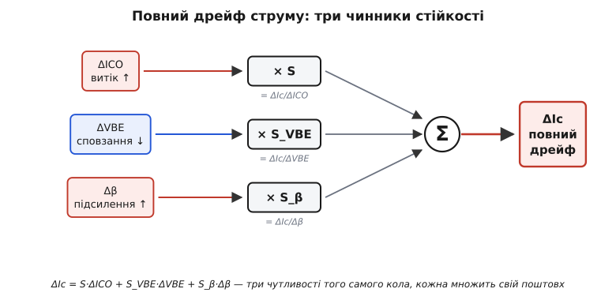
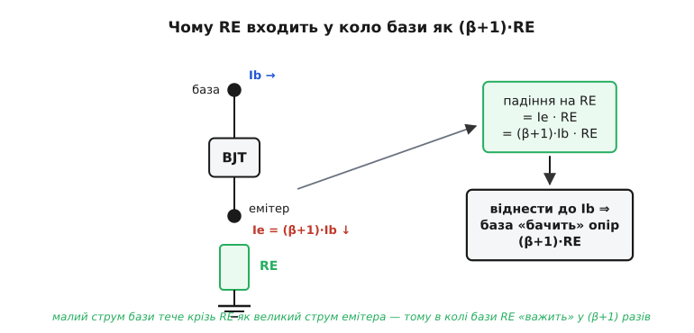

# 🧮 Виведення чинника стійкості: від законів кіл до S = ∂Ic/∂ICO

Інтуїтивно вже зрозуміло, що схема або множить тепловий дрейф, або глушить його, і що міра цього множення зветься чинником стійкості S. Але «множить» — це ще не число. Скільки саме? Чому для голого зміщення струмом бази виходить рівно β+1, а не β і не 2β? Звідки в стійкій схемі береться той самий опір кола бази RB, що його ділять на RE? І чому подільник напруги заганяє S не «менше», а конкретно до одиниць? Усі ці відповіді не висять у повітрі — вони **виводяться з двох законів Кірхгофа** для конкретної схеми зміщення, і завдання цієї вставки — пройти це виведення до кінця, не пропускаючи жодного кроку, щоб формули зі статті перестали бути магією й стали наслідком.

Підемо так, як ішли інженери, коли вперше поставили задачу стійкості строго (класичний апарат трьох чинників стійкості — S за струмом витоку, за напругою VBE та за коефіцієнтом β — усталився в підручниках із напівпровідникової схемотехніки до початку 1960-х; це загальновизнаний матеріал, не спірне авторство). Спершу — точне означення похідної, що ховається за літерою S. Тоді — рівняння кола для трьох схем, від найгіршої до найкращої, з виведенням S для кожної. Далі — два інші чинники, за VBE й за β, бо тепло б'є не лише по витоку. І наприкінці — як усі три складаються в одну формулу повного температурного дрейфу.

## Що таке S насправді: похідна, а не множник

Почнімо з точного запису. У статті S означено словами — «на скільки зміниться Ic, якщо ICO зміниться на одиницю». Мовою аналізу це **частинна похідна**:

```
       ∂Ic
S = ─────         (за сталих β і VBE)
      ∂ICO
```

Тут ICO — узагальнена назва струму витоку зворотно зміщеного переходу (часто пишуть ICBO для схеми зі спільною базою або ICO як родову позначку; це той самий тепловий витік). Слово «частинна» й приписка «за сталих β і VBE» — не формальність, а серце означення. Тепло насправді чіпає всі три величини разом, але щоб **розділити три ефекти й виміряти кожен окремо**, ми подумки заморожуємо два з трьох і дивимося на реакцію струму лише на третій. S — це чутливість **тільки до витоку**, за уявно застиглих β та VBE. Так само S_VBE заморозить витік і β, а S_β — витік і VBE. Три похідні від тієї самої функції Ic, кожна вздовж своєї осі.

Чому це коректно — і чому потім їх можна просто додати? Бо колекторний струм у схемі є функцією трьох незалежних «входів»: Ic = Ic(ICO, VBE, β). Мала повна зміна будь-якої гладкої функції кількох змінних розкладається в суму частинних внесків — це **повний диференціал**:

```
        ∂Ic            ∂Ic            ∂Ic
ΔIc ≈ ───── · ΔICO  +  ───── · ΔVBE  +  ───── · Δβ
       ∂ICO            ∂VBE            ∂β
      └─── S ───┘     └── S_VBE ──┘    └── S_β ──┘
```

Ось чому три чинники стійкості — не три окремі теорії, а три члени одного розкладу. Поки зміни малі (а температурні зсуви за десятки градусів саме такі — лінеаризація тримається), повний дрейф струму є **сумою трьох добутків** «чутливість × поштовх». Уся решта вставки — це обчислення трьох коефіцієнтів цього розкладу з рівнянь кола. Почнімо з першого, S за витоком, і пройдімо ним три схеми.


*Колекторний струм залежить від трьох величин, що пливуть від тепла: витоку ICO, напруги VBE й коефіцієнта β. Повний дрейф ΔIc — сума трьох внесків, де кожна чутливість (S, S_VBE, S_β) множить свій поштовх. Три чинники стійкості — це три частинні похідні того самого рівняння кола.*

## Спільний фундамент: рівняння струму колектора

Щоб диференціювати, треба мати що диференціювати. Усі три схеми спираються на одне й те саме рівняння приладу, наведене й у статті:

```
Ic = β · Ib + (β + 1) · ICO
```

Розберімо, **звідки** тут (β+1) при витоку — бо саме цей множник проросте в усі подальші формули, і без розуміння його походження виведення буде набором символів. Уявімо транзистор у схемі зі спільним емітером. У вузол бази заходить керований струм Ib від кола зміщення. Але туди ж, у базу, тепловий витік ICO впорскує свою порцію носіїв із зворотно зміщеного переходу база–колектор. Для самого транзистора **немає різниці**, звідки в базі взявся струм: він підсилює сумарний базовий струм однаково. Запишімо баланс струмів (закон Кірхгофа для струмів, KCL) у вузлі бази й простежмо, що виходить у колекторі.

Повний струм, що керує транзистором, — це Ib плюс витоковий внесок. Колекторний струм є β від повного базового, а до нього ще додається сам витоковий струм, що протікає крізь колектор фізично. Акуратне складання дає:

```
Ic = β · (Ib + ICO) + ICO = β·Ib + β·ICO + ICO = β·Ib + (β+1)·ICO
```

Ось і народився (β+1): витік потрапляє в колектор **двічі** — раз підсиленим у β разів (бо транзистор приймає його за базовий струм), і раз напряму (бо він і сам тече крізь колекторний перехід). Сума цих двох шляхів і є (β+1). Це не примха запису, а фізика: транзистор **підсилює власний паразитний струм**, і тому крихітний витік виходить у колектор більшим у сотні разів. Тримаймо це рівняння як спільний старт — далі різниця між схемами буде лише в тому, **як кожна задає Ib** і як Ib реагує на зміну ICO.

> 🔧 **Навіщо це.** Уся гра чинника стійкості — це гра навколо одного питання: коли витік ICO підштовхне струм, **чи відреагує** на це струм бази Ib, чи лишиться байдужим? Якщо Ib застиглий (його ніщо не коригує) — витік проходить у колектор у повні (β+1) разів, і схема приречена. Якщо ж схема влаштована так, що зростання струму **зменшує** Ib у відповідь, частина поштовху гаситься ще до підсилення. Саме це й роблять емітерний резистор та подільник; уся арифметика нижче лише рахує, наскільки.

## Схема 1: фіксований струм бази — чому S = β+1

Найпростіше зміщення: один резистор RB тягнеться від живлення до бази й задає струм бази. Виведімо S строго й побачимо, чому виходить найгірше можливе число.

Ключова риса цієї схеми — струм бази **закріплений зовнішнім колом і не залежить від того, що коїться в колекторі**. Напруга живлення мінус падіння на переході база–емітер, поділена на RB, дає Ib — і це джерело струму бази «не знає» ні про витік, ні про колекторний струм:

```
       Vcc − VBE
Ib = ─────────────        (від витоку ICO не залежить)
          RB
```

Тепер головний крок — продиференціювати рівняння струму колектора за ICO, тримаючи β та VBE сталими (саме цього вимагає означення S). Запишімо Ic як функцію ICO й чесно візьмемо похідну кожного доданка:

```
       ∂Ic     ∂            ∂Ib              ∂ICO
S = ───── = ───── [β·Ib + (β+1)·ICO] = β·──── + (β+1)·────
      ∂ICO    ∂ICO                          ∂ICO            ∂ICO
```

Тут вирішує перший доданок. Оскільки Ib від ICO **не залежить** (його тримає зовнішній резистор), його похідна за ICO дорівнює нулю:

```
∂Ib
──── = 0          (струм бази закріплений)
∂ICO
```

Перший доданок зникає цілком, а другий — це похідна ICO за самим собою, тобто одиниця, помножена на (β+1):

```
S = β·0 + (β+1)·1 = β + 1
```

Ось воно. **S = β+1 — це не наближення й не «приблизно так», а точний наслідок одного факту: струм бази не реагує на дрейф.** Витік проходить у колектор у повні (β+1) разів, бо ніщо в схемі не пробує його скоригувати — похідна ∂Ib/∂ICO дорівнює нулю, і весь множник (β+1) лишається голим. Для β = 150 це S ≈ 151: кожен наноампер витоку обертається півтораста наноамперами дрейфу колекторного струму. Гірше за цю схему вже не буває — S = β+1 є **верхньою межею** чинника стійкості, бо нульова реакція бази — це найгірше, що схема може зробити.

## Схема 2: емітерний резистор — повна формула S

Тепер додаймо резистор RE між емітером і землею — і подивімося, як похідна ∂Ib/∂ICO перестане бути нулем. Тут виведення робить найбільший крок, тому пройдімо його по-чесному, через закон напруг (KVL) у колі бази.

Спершу — **чому RE взагалі впливає на коло бази**, адже він стоїть в емітері. Річ у напрямку струмів. Крізь RE тече повний струм емітера, а він майже в (β+1) разів більший за струм бази: Ie ≈ (β+1)·Ib (бо емітер збирає і колекторний, і базовий струми). Тому падіння напруги на RE, якщо віднести його до **струму бази**, виглядає так, ніби в колі бази стоїть резистор у (β+1) разів більший. Цей прийом — «віднесення» емітерного опору до бази через множник (β+1) — і є ключ до всієї формули; тримаймо його в голові, бо саме **(β+1)·RE**, а не β·RE, з'явиться в знаменнику.


*Крізь RE тече струм емітера Ie = (β+1)·Ib — майже в (β+1) разів більший за струм бази. Тому падіння на RE, віднесене до струму бази, важить так, ніби в колі бази стоїть опір (β+1)·RE. Саме цей «віднесений» опір і зчіплює коло бази з колекторним струмом, даючи від'ємний зворотний зв'язок.*

Запишімо тепер закон напруг для контуру «джерело зміщення → база → емітер → земля». Джерело зміщення дає напругу VBB через опір кола бази RB (для цієї схеми RB — це просто базовий резистор; для подільника далі він стане еквівалентом Тевенена). Обходячи контур, складаємо падіння: на RB падає Ib·RB, на переході — VBE, на емітерному резисторі — Ie·RE. Сума дорівнює напрузі джерела:

```
VBB = Ib·RB + VBE + Ie·RE
```

Тепер виразимо струми бази й емітера через колекторний, і зробімо це **точно, без округлень** — саме тут криється тонкість, що вирішує вигляд формули. Струм бази беремо просто з рівняння приладу, розв'язаного щодо Ib. А струм емітера — не «приблизно Ic», а точно: за законом струмів емітер збирає весь базовий і весь колекторний струм, Ie = Ib + Ic, і підстановка Ib дає:

```
Ib = (Ic − (β+1)·ICO) / β                (з рівняння Ic = β·Ib + (β+1)·ICO)
Ie = Ib + Ic = (β+1)·(Ic − ICO) / β      (KCL: емітер збирає базу й колектор)
```

Друге рівняння — не наближення, а точний наслідок KCL; саме воно проросте в знаменник множником **(β+1)·RE**, який ми щойно передбачили з «віднесення» опору. Груба заміна Ie ≈ Ic тут дала б β·RE замість (β+1)·RE — і зіпсувала б формулу, тому беремо точний вираз.

Підставмо обидва вирази в рівняння контуру. Це найгустіший крок виведення, тож робімо його повільно — підставляємо Ib і Ie, домножуємо на β, щоб позбутися дробу:

```
VBB = [(Ic − (β+1)·ICO)/β]·RB + VBE + [(β+1)·(Ic − ICO)/β]·RE

β·VBB = (Ic − (β+1)·ICO)·RB + β·VBE + (β+1)·(Ic − ICO)·RE
β·VBB = Ic·RB − (β+1)·ICO·RB + β·VBE + (β+1)·Ic·RE − (β+1)·ICO·RE
```

Зберімо доданки зі струмом колектора Ic ліворуч, решту — праворуч (доданки з ICO дають спільний множник (β+1)·(RB+RE)):

```
Ic·[RB + (β+1)·RE] = β·VBB − β·VBE + (β+1)·(RB + RE)·ICO
```

Ось ключове проміжне рівняння — і зверніть увагу: у дужці зліва стоїть саме **RB + (β+1)·RE**, той самий «віднесений» опір, що ми передбачили з фізики. Тепер беремо ту саму похідну, що й раніше, — ∂Ic/∂ICO за сталих β, VBE (а отже сталих VBB, RB, RE). Ліворуч [RB + (β+1)·RE] — стала, праворуч від ICO залежить лише останній доданок:

```
                 ∂Ic
[RB + (β+1)·RE]·──── = (β+1)·(RB + RE)
                ∂ICO

       ∂Ic       (β+1)·(RB + RE)
S = ───── = ──────────────────────
      ∂ICO      RB + (β+1)·RE
```

Це вже робоча формула — і, що приємно, **точна**. Причешімо її до вигляду зі статті: поділимо чисельник і знаменник на RE, щоб винести характеристичне відношення RB/RE:

```
       (β+1)·(RB + RE)       (β + 1)·(1 + RB/RE)
S = ──────────────────── = ───────────────────────
      RB + (β+1)·RE            1 + β + RB/RE
```

Це просто ділення чисельника й знаменника на RE — жодних трюків: (RB+RE)/RE = 1+RB/RE, а (RB+(β+1)·RE)/RE = RB/RE + (β+1) = 1 + β + RB/RE. Виходить рівно той симетричний вигляд, що в статті. **Точна підстановка Ie одразу привела до канонічної формули**, без жодного «підправляння» на пів-кроку.

> 🔧 **Навіщо це.** Дві форми — `(β+1)·(RB+RE) / (RB + (β+1)·RE)` та `(β+1)·(1+RB/RE) / (1+β+RB/RE)` — це **той самий вираз, записаний двічі**: друга виходить із першої простим діленням на RE, вони тотожні за всіх β. Перша зручніша, щоб бачити змагання опорів: у знаменнику RB бореться проти (β+1)·RE — того самого «віднесеного» емітерного опору. Друга — канонічна, бо в ній прозоро видно обидві межі: RB/RE → 0 і RB/RE → ∞. Тримайте в голові саме це змагання **RB проти (β+1)·RE**: коли гальмо (β+1)·RE забиває RB, S падає до одиниць.

### Дві межі, які пояснюють усе

Формула суха, поки не подивитися на її краї. Якраз краї й розкривають, **чому** емітерний резистор працює.

**Межа без гальма — RE → 0.** Заберімо емітерний резистор зовсім. Тоді знаменник RB + (β+1)·RE → RB, а чисельник (β+1)·(RB+RE) → (β+1)·RB, і

```
       (β+1)·RB
S = ──────────── → β + 1        (RE → 0)
          RB
```

Формула чесно повертає найгірший випадок — рівно S = β+1 першої схеми. Це добра перевірка: схема з RE = 0 і є фіксований струм бази, і формула це знає. Емітерного гальма немає — стійкості теж.

**Межа сильного гальма — (β+1)·RE ≫ RB.** Тепер навпаки: емітерний резистор великий, опір бази малий, тож у знаменнику (β+1)·RE забиває RB:

```
       (β+1)·(RB + RE)     (β+1)·(RB + RE)     RB + RE          RB
S ≈ ──────────────────── ≈ ────────────────── = ───────── = 1 + ────
       RB + (β+1)·RE           (β+1)·RE             RE              RE
                                                      ((β+1)·RE ≫ RB)
```

S падає до **1 + RB/RE** — числа, що майже не містить β. Ось де ховається стійкість: коли гальмо сильне, чинник стійкості перестає залежати від примхливого коефіцієнта транзистора й визначається лише відношенням двох резисторів, які інженер вибирає сам. Транзистор як джерело розкиду випав з рівняння. Саме тому в статті гранична форма записана як S → (1 + RB/RE): точна формула сходиться до неї сама, без жодного округлення руками.

Між цими краями формула плавно інтерполює. Чим менший RB (жорсткіше зафіксована база) і чим більший RE (сильніше гальмо), тим ближче S до нижньої межі. Виведення показало **механізм**: похідна ∂Ib/∂ICO у цій схемі вже не нуль — зростання струму через RE піднімає потенціал емітера, зменшує керувальну різницю база–емітер, прикриває перехід і **зменшує Ib у відповідь на дрейф**. Це той самий [від'ємний зворотний зв'язок](topic:electronics/negative-feedback) за струмом, тільки тепер видно його точну ціну в коефіцієнті.

## Схема 3: подільник напруги — чому RB стає малим

Третя схема не дає **нової формули** — вона дає той самий вираз S = (β+1)·(RB+RE)/(RB + (β+1)·RE), але з **малим RB**, і тому заганяє S до одиниць. Звідки береться мале RB — ось що варто вивести, бо тут ховається друга половина мистецтва зміщення.

У подільнику базу тримають два резистори, R1 від живлення й R2 до землі, з'єднані у вузлі бази. Щоб застосувати нашу формулу, треба замінити цей подільник його **еквівалентом Тевенена** — одним джерелом VBB через один опір RB. Тевененове джерело — це напруга порожнього подільника, а тевененів опір — це R1 і R2, з'єднані паралельно (бо для малосигнальних збурень і живлення, і земля — однакові «нулі», тож обидва резистори висять між вузлом бази й спільним нулем):

```
            R2                       R1·R2
VBB = Vcc·───────         RB = R1 ∥ R2 = ───────
          R1 + R2                       R1 + R2
```

Ось вузол усієї справи. Тевенів опір RB — це **паралель** двох резисторів, а паралель завжди менша за менший з них. Якщо подільник зробити «жорстким» — тобто пустити крізь нього струм у 5–10 разів більший за струм бази, а отже взяти R1 і R2 порівняно малими, — то й їхня паралель RB виходить мала. А мале RB — це саме те, що формула S = (β+1)·(RB+RE)/(RB + (β+1)·RE) перетворює на малий S:

```
       (β+1)·(RB + RE)
S = ──────────────────── → мале,     бо RB = R1∥R2 мале, а (β+1)·RE велике
       RB + (β+1)·RE
```

Підставивши в граничну форму, дістаємо число зі статті:

```
            RB        R1∥R2
S → 1 + ──── = 1 + ───────       ≈ 3…10  (для жорсткого подільника)
            RE          RE
```

Тут і змикаються дві ідеї. **Емітерний резистор** дає велике (β+1)·RE у знаменнику (сильне гальмо). **Жорсткий подільник** дає мале RB у чисельнику (база майже не «гуляє»). Разом вони тиснуть S з обох боків — і заганяють його до одиниць. Кожен порізно допомагає, але саме їхня пара дає намертво стійку робочу точку.

> 🔧 **Навіщо це.** Звідси кількісне правило вибору подільника. «Жорсткість» — це струм дільника відносно струму бази: беруть струм крізь R2 у 5–10 разів більший за Ib, тоді VBB майже не просідає, коли база відбирає свою частку, а паралель R1∥R2 виходить досить малою, щоб RB/RE було близьким до одиниці. Заплатити доводиться зайвим струмом, що марно тече крізь дільник (трохи більше споживання) — і це майже завжди вигідна ціна за робочу точку, яка не пливе ні від тепла, ні від заміни транзистора. А переборщити теж не варто: надто малі R1, R2 даремно жеруть струм і навантажують попередній каскад. П'ять–десять разів — усталений компроміс.

## Чинник за VBE: чому тепло сповзає крізь поріг

Витік — лише один із трьох теплових поштовхів. Тепер виведімо другий чинник, **за напругою VBE**, бо в сучасному кремнію саме сповзання порога відкривання, а не витік, є головним двигуном дрейфу. Означення дзеркальне до S:

```
            ∂Ic
S_VBE = ─────         (за сталих ICO і β)
            ∂VBE
```

Виведення на диво коротке — бо найважчу роботу вже зроблено. Повернімося до ключового проміжного рівняння схеми з емітерним резистором (воно вже містить усю топологію кола):

```
Ic·[RB + (β+1)·RE] = β·VBB − β·VBE + (β+1)·(RB + RE)·ICO
```

Тепер беремо похідну за VBE, тримаючи ICO й β сталими. Ліворуч [RB + (β+1)·RE] — стала; праворуч від VBE залежить лише доданок −β·VBE:

```
                 ∂Ic
[RB + (β+1)·RE]·──── = −β
                ∂VBE

              ∂Ic            −β
S_VBE = ───── = ──────────────────
            ∂VBE     RB + (β+1)·RE
```

Знак мінус тут — фізичний, а не помилка: коли VBE **зростає**, керувальна напруга на переході зменшується, тож струм **падає**. А оскільки тепло, навпаки, **знижує** поріг VBE приблизно на 2 мВ на градус, добуток S_VBE·ΔVBE виходить додатним — струм росте, як і має. Два мінуси (від'ємний S_VBE і від'ємний ΔVBE) дають додатний внесок у дрейф.

Найважливіше — той самий знаменник RB + (β+1)·RE, що й у S. Це не випадковість: **те саме гальмо, що приборкує витік, приборкує й сповзання VBE**. Збільшуючи (β+1)·RE й зменшуючи RB, ми одним заходом давимо обидва чинники стійкості. Ось чому в статті сказано, що схема з малим S за витоком тримає малими й решту: усі три чинники сидять на спільному знаменнику кола.

**Прикинемо силу.** Для жорсткого каскаду: β = 150, RE = 470 Ом, RB = 4.7 кОм (паралель помірного подільника), VT тут не потрібне — формула суто з опорів.

```
RB + (β+1)·RE = 4700 + 151·470 = 4700 + 70970 = 75670 Ом

              −β          −150
S_VBE = ─────────────── = ──────── ≈ −0.00198 А/В = −1.98 мА/В
        RB + (β+1)·RE      75670
```

Тепер помножимо на тепловий зсув VBE за нагрів на 50 °C (ΔVBE = −2 мВ/°C · 50 = −0.1 В):

```
ΔIc(від VBE) = S_VBE · ΔVBE = (−0.00198)·(−0.1) = +0.000198 А ≈ +0.2 мА
```

Лише 0.2 мА дрейфу від сповзання порога за 50 градусів — і це попри те, що сам поріг зрушив на цілих 100 мВ. Знаменник 75.7 кОм притиснув чутливість до пари міліампер на вольт. Порівняймо з голим зміщенням, де RE = 0: там знаменник був би лише RB, S_VBE стрибнув би до −150/4700 ≈ −32 мА/В — у шістнадцять разів більше, і той самий зсув VBE дав би вже 3.2 мА дрейфу. Та сама пара: емітерний резистор у знаменнику — і чутливість до VBE падає в стільки ж разів, що й чутливість до витоку.

## Чинник за β: дрейф від самого підсилення

Лишився третій поштовх — зростання коефіцієнта β з температурою. Виведімо S_β, бо в схемі з фіксованим струмом бази саме він, а не витік, дає той самий «+40 % за 50 °C», що так вражає в наскрізному прикладі статті. Означення:

```
          ∂Ic
S_β = ─────         (за сталих ICO і VBE)
          ∂β
```

Тут найкраще видно **різницю між схемами**, тож виведімо два крайні випадки.

**Фіксований струм бази.** Струм бази закріплений зовнішнім резистором і від β не залежить узагалі. Тоді Ic = β·Ib (витоком знехтуємо) — пряма пропорція до β:

```
        ∂Ic     ∂
S_β = ───── = ───── (β·Ib) = Ib = Ic/β        (Ib стале)
        ∂β        ∂β
```

Чутливість дорівнює самому струму бази Ib = Ic/β. Перепишімо як відносний дрейф — поділимо на Ic:

```
ΔIc      S_β·Δβ     (Ic/β)·Δβ     Δβ
─── = ───────── = ──────────── = ────
 Ic        Ic           Ic            β
```

Відносна зміна струму **дорівнює відносній зміні β**. Якщо β виросло на 40 % (а саме стільки дає 0.8 %/°C за 50 °C), струм виросте рівно на 40 %. Ось точне джерело тих «+40 %» зі статті — не наближення, а проста рівність ΔIc/Ic = Δβ/β для схеми, де Ib не реагує. Транзистор повністю відданий на ласку власного підсилення.

**Емітерний резистор.** Тепер інша картина. Візьмімо проміжне рівняння й розв'яжімо щодо Ic (знехтувавши витоком заради чистоти):

```
Ic·[RB + (β+1)·RE] = β·(VBB − VBE)

       β·(VBB − VBE)
Ic = ─────────────────
       RB + (β+1)·RE
```

Подивімося на цей дріб як на функцію β. Коли β велике (а (β+1)·RE ≫ RB), і чисельник, і знаменник ростуть з β майже однаково — β скорочується:

```
       β·(VBB − VBE)     (VBB − VBE)
Ic ≈ ───────────────── ≈ ───────────       ((β+1)·RE ≫ RB)
          (β+1)·RE             RE
```

β **майже зникло з виразу для струму**! А якщо Ic майже не залежить від β, то й похідна ∂Ic/∂β мала — S_β малий. Порахуймо її точно, за правилом похідної частки. Позначмо знаменник D = RB + (β+1)·RE; тоді Ic = β·(VBB−VBE)/D, ∂D/∂β = RE, і

```
        ∂Ic     (VBB−VBE)·D − β·(VBB−VBE)·RE     (VBB−VBE)·[RB + (β+1)·RE − β·RE]
S_β = ───── = ────────────────────────────── = ─────────────────────────────────
        ∂β                  D²                                 D²
```

У квадратній дужці β·RE скорочується з (β+1)·RE, лишаючи чистий (RB + RE):

```
        (VBB − VBE)·(RB + RE)
S_β = ────────────────────────
         (RB + (β+1)·RE)²
```

Ось точний результат, без жодного недописаного кроку. Він малий **не тому, що «RB прямує до нуля»**, а тому, що знаменник росте як квадрат гальма: (RB + (β+1)·RE)² ≈ (β·RE)² роздувається як β², тоді як чисельник (VBB−VBE)·(RB+RE) від β не залежить зовсім. Ту саму думку видно й через відносний дрейф — поділивши S_β·Δβ на сам струм Ic = β·(VBB−VBE)/D, дістаємо напрочуд чисту рівність:

```
ΔIc             Δβ     RB + RE       Δβ       S
─── (від β) = ──── · ───────── = ──── · ──────
 Ic             β        D              β     β+1
```

бо (RB+RE)/D — це рівно S/(β+1). Відносний дрейф від β дорівнює відносній зміні β, **притиснутій множником S/(β+1)**. Для голого зміщення S = β+1, множник — одиниця, дрейф повний (ті самі «+40 %»). Для жорсткого каскаду S ≈ 10, а β+1 ≈ 151, тож множник S/(β+1) ≈ 1/15 — і дрейф від β осідає майже в п'ятнадцять разів. Той самий S, що міряв витік, керує й дрейфом підсилення.

> 🔧 **Навіщо це.** Зверніть увагу на красу спільного знаменника. Усі три чинники — S, S_VBE, S_β — у схемі з RE мають у знаменнику те саме `RB + (β+1)·RE` (S_β навіть у квадраті). Це означає, що **одна-єдина дія — збільшити (β+1)·RE відносно RB — гасить усі три теплові поштовхи разом**. Інженерові не треба боротися з витоком, сповзанням і дрейфом β окремо: жорсткий подільник плюс емітерний резистор давлять трійцю одним рухом. Ось чому це найдешевша угода в усьому зміщенні BJT — один структурний прийом купує стійкість за всіма трьома осями.

## Усе докупи: повний температурний дрейф у числах

Тепер зведімо три чинники в одну формулу повного дрейфу — ту, з якою працює інженер, оцінюючи, наскільки попливе робоча точка за найгарячіший день. Повний диференціал, з якого ми починали, тепер має всі три коефіцієнти, виведені з кола:

```
ΔIc = S·ΔICO + S_VBE·ΔVBE + S_β·Δβ

де   S      = (β+1)·(RB + RE) / (RB + (β+1)·RE)        — за витоком
     S_VBE  = −β / (RB + (β+1)·RE)                     — за порогом
     S_β    ≈ Ic·(RB + RE) / [β·(RB + (β+1)·RE)]       — за підсиленням (наближено)
```

(Третю форму S_β зручно взяти через Ic: підставивши VBB−VBE = Ic·D/β у `(VBB−VBE)·(RB+RE)/D²`, дістаємо саме `Ic·(RB+RE)/(β·D)` — те саме число, лише виражене через робочий струм.) Три поштовхи, кожен зі свого температурного джерела:

```
ΔICO = ICO·(2^(ΔT/10) − 1)        витік подвоюється на кожні ~10 °C
ΔVBE = −2 мВ/°C · ΔT              поріг сповзає вниз
Δβ   = β·(0.005…0.01)·ΔT          підсилення росте 0.5…1 %/°C
```

Зберімо це в робочий розрахунок — порахуймо повний дрейф двох схем за нагрів на 50 °C, щоб числа з означення ожили. КОД — реальний C, як його писали б у прошивці контролера, що сам перевіряє тепловий бюджет каскаду перед запуском.

:::tabs
```cpp
// Повний температурний дрейф колекторного струму через три чинники стійкості.
// Порівнюємо фіксований струм бази (RE=0) з жорстким подільником (RB мале, RE є).
// ΔIc = S·ΔICO + S_VBE·ΔVBE + S_β·Δβ  — повний диференціал рівняння кола.
// Знаменник кола den = RB + (β+1)·RE  — саме (β+1)·RE, а не β·RE (точний Ie).
#include <stdio.h>
#include <math.h>

// Один чинник-розрахунок для заданих RB, RE
static void drift(const char *name, float RB, float RE,
                  float beta, float Ic, float ICO, float dT) {
    float den   = RB + (beta + 1.0f) * RE;     // спільний знаменник кола

    // три чинники стійкості з виведення
    float S     = (beta + 1.0f) * (RB + RE) / den;      // за витоком
    float S_vbe = -beta / den;                          // за порогом (А/В)
    float S_b   = Ic * (RB + RE) / (beta * den);        // за β (наближено, А/од.)

    // три теплові поштовхи за нагрів dT
    float dICO  = ICO * (powf(2.0f, dT / 10.0f) - 1.0f);   // витік подвоюється/10°C
    float dVBE  = -0.002f * dT;                            // −2 мВ/°C
    float dBeta = beta * 0.008f * dT;                      // β росте 0.8 %/°C

    // три внески й сума
    float dIc_ico = S     * dICO;
    float dIc_vbe = S_vbe * dVBE;
    float dIc_b   = S_b   * dBeta;
    float dIc     = dIc_ico + dIc_vbe + dIc_b;

    printf("%s:  S=%.1f  S_VBE=%.4f A/B  S_b=%.2e A/od.\n", name, S, S_vbe, S_b);
    printf("   dIc(вит)=%.3f  dIc(VBE)=%.3f  dIc(b)=%.3f  ->  dIc=%.3f мА (%.0f%%)\n\n",
           dIc_ico*1e3f, dIc_vbe*1e3f, dIc_b*1e3f, dIc*1e3f, 100.0f*dIc/Ic);
}

int main(void) {
    const float beta = 150.0f;     // β при 25 °C
    const float Ic   = 0.002f;     // робочий струм 2 мА
    const float ICO  = 50e-9f;     // витік 50 нА при 25 °C
    const float dT   = 50.0f;      // нагрів на 50 °C

    // Схема А: фіксований струм бази — RE=0, базовий резистор великий
    drift("Схема А (фікс. Ib)", 100000.0f, 0.0f, beta, Ic, ICO, dT);
    // Схема Б: жорсткий подільник + RE — RB мале (паралель), RE = 470 Ом
    drift("Схема Б (подільник+RE)", 4700.0f, 470.0f, beta, Ic, ICO, dT);
    return 0;
}
```
```python
# Повний температурний дрейф колекторного струму через три чинники стійкості.
# Порівнюємо фіксований струм бази (RE=0) з жорстким подільником (RB мале, RE є).
# ΔIc = S·ΔICO + S_VBE·ΔVBE + S_β·Δβ  — повний диференціал рівняння кола.
# Знаменник кола den = RB + (β+1)·RE  — саме (β+1)·RE, а не β·RE (точний Ie).

# Один чинник-розрахунок для заданих RB, RE
def drift(name, RB, RE, beta, Ic, ICO, dT):
    den = RB + (beta + 1.0) * RE       # спільний знаменник кола

    # три чинники стійкості з виведення
    S     = (beta + 1.0) * (RB + RE) / den     # за витоком
    S_vbe = -beta / den                        # за порогом (А/В)
    S_b   = Ic * (RB + RE) / (beta * den)      # за β (наближено, А/од.)

    # три теплові поштовхи за нагрів dT
    dICO  = ICO * (2.0 ** (dT / 10.0) - 1.0)   # витік подвоюється/10°C
    dVBE  = -0.002 * dT                        # −2 мВ/°C
    dBeta = beta * 0.008 * dT                  # β росте 0.8 %/°C

    # три внески й сума
    dIc_ico = S     * dICO
    dIc_vbe = S_vbe * dVBE
    dIc_b   = S_b   * dBeta
    dIc     = dIc_ico + dIc_vbe + dIc_b

    print(f"{name}:  S={S:.1f}  S_VBE={S_vbe:.4f} A/B  S_b={S_b:.2e} A/od.")
    print(f"   dIc(вит)={dIc_ico * 1e3:.3f}  dIc(VBE)={dIc_vbe * 1e3:.3f}  "
          f"dIc(b)={dIc_b * 1e3:.3f}  ->  dIc={dIc * 1e3:.3f} мА "
          f"({100.0 * dIc / Ic:.0f}%)\n")


beta = 150.0     # β при 25 °C
Ic   = 0.002     # робочий струм 2 мА
ICO  = 50e-9     # витік 50 нА при 25 °C
dT   = 50.0      # нагрів на 50 °C

# Схема А: фіксований струм бази — RE=0, базовий резистор великий
drift("Схема А (фікс. Ib)", 100000.0, 0.0, beta, Ic, ICO, dT)
# Схема Б: жорсткий подільник + RE — RB мале (паралель), RE = 470 Ом
drift("Схема Б (подільник+RE)", 4700.0, 470.0, beta, Ic, ICO, dT)
```
:::

Простежмо обидві схеми вручну, щоб побачити, як три внески складаються — і чому один і той самий транзистор має дві долі.

```
Схема А — фіксований струм бази (RB = 100 кОм, RE = 0):
  знаменник den = 100000 + 151·0 = 100000
  S     = 151·(100000+0)/100000 = 151        (повне β+1!)
  S_VBE = −150/100000 = −1.5 мА/В
  S_β   = 0.002·100000/(150·100000) = 1.33·10⁻⁵ А/од.

  поштовхи за +50 °C:
    ΔICO = 50нА·(2⁵ − 1) = 50нА·31 = 1.55 мкА
    ΔVBE = −0.1 В
    Δβ   = 150·0.008·50 = 60 одиниць

  внески:
    від витоку: 151 · 1.55мкА   = 0.234 мА
    від VBE:    −1.5мА/В·(−0.1) = 0.150 мА
    від β:      1.33·10⁻⁵·60    = 0.800 мА     ← найбільший!
    ─────────────────────────────────────
    ΔIc ≈ 1.18 мА на 2 мА  →  +59 %      робоча точка попливла геть

Схема Б — подільник + RE (RB = 4.7 кОм, RE = 470 Ом):
  знаменник den = 4700 + 151·470 = 75670
  S     = 151·(4700+470)/75670 = 151·5170/75670 = 10.3   (одиниці, не сотні!)
  S_VBE = −150/75670 = −0.00198 А/В = −1.98 мА/В
  S_β   = 0.002·5170/(150·75670) = 9.1·10⁻⁷ А/од.

  ті самі поштовхи: ΔICO = 1.55 мкА, ΔVBE = −0.1 В, Δβ = 60

  внески:
    від витоку: 10.3 · 1.55мкА    = 0.0160 мА
    від VBE:    −0.00198·(−0.1)   = 0.198 мА    ← тепер головний
    від β:      9.1·10⁻⁷·60       = 0.0547 мА
    ─────────────────────────────────────
    ΔIc ≈ 0.27 мА на 2 мА  →  +13 %      ледь зрушила
```

Висновок промовистий і прямо стикується зі статтею. **Той самий транзистор, той самий нагрів на 50 °C — а схема А попливла на 59 %, схема Б ледь на 13 %.** Але виведення дало більше, ніж цифри: воно показало **який саме поштовх винен у кожній схемі**. У схемі А головний винуватець — дрейф β (0.8 мА з 1.18): струм бази закріплений, тож зростання β проходить у колектор повністю. У схемі Б цей канал майже занулився (0.05 мА), і лишилося переважно сповзання VBE (0.2 мА) — той єдиний поштовх, що пробивається крізь будь-яке гальмо, бо діє прямо на перехід. Велике (β+1)·RE проти малого RB задавило і витік, і дрейф β майже до нуля; вистояло тільки сповзання порога — і саме воно лишає схемі Б її скромні 13 %.

> 🔧 **Навіщо це.** Звідси практичний підсумок, який не випливе з самого «менший S — краще». По-перше, у жорсткому каскаді **головним лишається дрейф VBE**, а не витік і не β — тож боротися варто саме з ним (більше падіння на RE, термокомпенсація діодом у колі бази для прецизійних схем). По-друге, виведення дало числа для прикидки на папері: знаючи RB, RE й β, інженер рахує всі три чинники за хвилину й бачить, який поштовх домінує, **ще до того, як паяти**. По-третє — і найголовніше — спільний знаменник (RB + (β+1)·RE) означає, що **одна ручка керує всіма трьома**: збільшив (β+1)·RE, зменшив RB — і трійця поштовхів осідає разом. Стійкість робочої точки проти тепла й стійкість проти розкиду β купуються тим самим рухом, бо це той самий знаменник.

Уся арифметика цієї вставки зводиться до однієї думки: **три чинники стійкості — це три частинні похідні рівняння кола, і всі три сидять на спільному знаменнику (RB + (β+1)·RE)**. Голе зміщення обнуляє цей знаменник до RB і віддає струм на ласку β; емітерний резистор і жорсткий подільник роздувають знаменник через (β+1)·RE й тиснуть малим RB — і три теплові поштовхи, що поодинці женуть [тепловий розгін](topic:electronics/thermal-runaway), осідають усі разом. Те, що в статті звучить як «топологія задає S», тут доведено до робочих формул, якими цей S рахують наперед — і видно не лише *що* схема стійка, а *чому* саме, з точністю до похідної.
