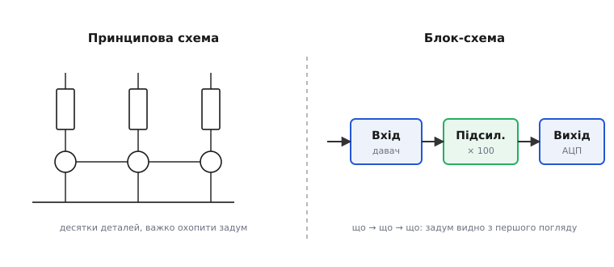
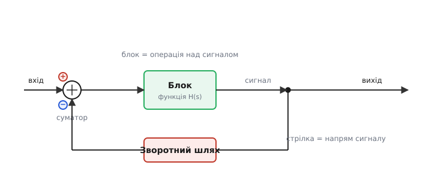
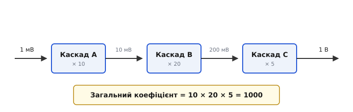
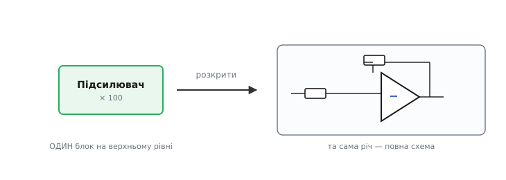

# Блок-схема системи

Уявіть, що вам показали принципову схему серйозного приладу: сотні резисторів, десятки транзисторів, мікросхеми, плетиво ліній. На питання «що тут із чим з'єднано» вона відповідає бездоганно. А от на питання «**що ця коробка взагалі робить**» — мовчить, бо тоне в деталях. Щоб відповісти на нього, інженер відступає на крок назад і малює зовсім інше креслення — **блок-схему** (англ. *block diagram*, «схема з блоків»): кілька прямокутників із назвами та стрілки між ними. Не «який резистор куди», а «**сигнал заходить сюди → його підсилюють → фільтрують → оцифровують → віддають**». Розберімо, навіщо потрібен цей рівень опису, з чого він складається й чому в аналоговій техніці блок — це не просто підпис, а **операція над сигналом** із цілком конкретною математикою.

## Навіщо стирати деталі

Почнімо з болю, який блок-схема лікує. [Принципова схема](book:electronics/schematic-purpose) показує **кожен** компонент і **кожне** з'єднання — і саме тому з неї важко вичитати **задум**. Це як читати програму, де немає функцій: суцільний потік команд, у якому загальна логіка губиться між дрібницями. Людська увага не тримає сотні деталей одночасно; щоб зрозуміти систему, її треба бачити **великими частинами**.

Блок-схема робить рівно це: бере цілий шматок кола, що виконує одну осмислену роботу — підсилення, фільтрування, перетворення, — і **ховає** його всередину прямокутника з назвою. Зникають номінали, зникають окремі деталі; лишається **функція** частини та її зв'язки з іншими. Свідома втрата подробиць — не недолік, а вся суть: ми навмисне стираємо «як зроблено», щоб проступило «**що робить і в якому порядку**».


*Те саме коло на двох рівнях. Принципова схема (ліворуч) чесно показує кожну деталь, але задум у ній тоне. Блок-схема (праворуч) відкидає начинку й лишає головне: сигнал від давача йде в підсилювач, звідти на АЦП. Одна картинка — і зрозуміло, що прилад робить.*

Найточніша аналогія — **карта різного масштабу**. Маршрут між містами планують по дрібномасштабній карті країни, де видно лише траси й розв'язки; вулиці окремого міста на ній свідомо не показані — вони б тільки заважали. А коли вже доїхав і шукаєш потрібний будинок, береш великомасштабний план міста. Блок-схема — це «карта країни» для приладу: дрібниць немає, зате видно весь маршрут сигналу. Принципова схема — «план міста»: усе до останнього провулка, але лише для свого району. Аналогія ламається в одному: переходячи від карти країни до плану міста, ви не втрачаєте інформації — обидві карти існують паралельно й узгоджені. Так само блок-схема й принципова схема того самого приладу — **не суперники, а два узгоджені погляди**: одна про задум, друга про втілення.

> 🔧 **Навіщо це.** Будь-який реальний проєкт **починається** з блок-схеми, ще до жодного резистора. Спершу домовляються про великі частини — звідки сигнал, що його обробляє, куди йде результат, як це живиться, — і лише потім кожен блок розгортають у схему. Та сама картинка потім стає **картою налагодження**: коли прилад не працює, ви не кидаєтесь перевіряти всі сто деталей одразу, а йдете по блоках — міряєте сигнал на виході кожного й знаходите той блок, після якого все ламається. Без блок-схеми пошук несправності перетворюється на тицяння наосліп.

## З чого складається блок-схема

Абетка тут коротка — лічені елементи, і кожен має точний зміст.

**Блок** — прямокутник, що позначає **операцію над сигналом** чи цілу функційну частину. Усередині пишуть назву («Підсилювач», «Фільтр», «АЦП») або просто те, що блок робить із сигналом («× 100», «ФНЧ 1 кГц»). Що саме там за деталі — навмисне приховано.

**Стрілка** — це **сигнал** і, головне, **напрям** його руху. Тут пастка для тих, хто звик до принципових схем: на блок-схемі лінія — це **не дріт**. На принциповій схемі лінія байдужа до напряму (струм тече, куди йому треба), а тут стрілка строго каже «сигнал іде **звідси туди**». Вона задає **причинність**: вихід одного блоку стає входом наступного. Тому блок-схему читають, як текст, — за стрілками, від входу до виходу.

**Суматор** (англ. *summing junction*) — кружок, у якому два-три сигнали **складаються**. Біля кожної вхідної стрілки ставлять знак: «+» — сигнал додають, «−» — віднімають. Саме суматор зі знаком «−» — серце [від'ємного зворотного зв'язку](book:electronics/negative-feedback): від входу віднімають частину виходу.

**Вузол-відгалуження** (точка-розгалуження) — жирна крапка, де сигнал **роздвоюється**: та сама величина йде далі по основному шляху й водночас відгалужується вбік (наприклад, назад у суматор, утворюючи петлю). Сигнал при цьому **не ділиться навпіл** — обидві гілки несуть його повністю; це не фізичний вузол кола, а просто «той самий сигнал потрібен у двох місцях».


*Анатомія блок-схеми. Сигнал входить у суматор (тут «+» згори, «−» від зворотного шляху), проходить блок-операцію H(s), у точці-відгалуженні роздвоюється — частина йде на вихід, частина повертається через зворотний шлях назад у суматор. Стрілки задають напрям і причинність.*

Ось і вся абетка: блоки-операції, стрілки-сигнали, суматори, відгалуження. Скільки б складною не була система на блок-схемі, вона зібрана лише з цих чотирьох речей — і саме тому читається легко.

## Блок як операція над сигналом

Тепер найважливіше, що відрізняє блок-схему в аналоговій техніці від простого «малюнка коробочок». У теорії кіл блок — це не просто підпис, а **математичний оператор**: він бере вхідний сигнал і за певним правилом перетворює його на вихідний. Найпростіший випадок — підсилювач: правило «помнож на 100». Тоді блок несе **коефіцієнт** 100, і вихід = вхід × 100. Це робить блок-схему не лише ілюстрацією, а й **інструментом розрахунку**.

Що це за «правило перетворення» в загальному випадку? Для лінійного кола його описує [передавальна функція](book:electronics/transfer-function) — компактний запис того, як блок змінює сигнал залежно від частоти. Її скорочено позначають **H(s)** (або H(ω)). Для звичайного підсилювача це просто число (коефіцієнт підсилення); для [фільтра](book:electronics/rc-low-pass) — функція, що залежить від частоти: низькі частоти проходять, високі гасяться. Сенс той самий — блок каже, **що** він робить із сигналом, а H(s) каже це **точно**, числом чи формулою.

> 🔧 **Навіщо це.** Саме завдяки тому, що блок несе число, блок-схему можна **рахувати на серветці**, не торкаючись жодного компонента. Скільки треба підсилення в усьому тракті? Перемнож коефіцієнти блоків. Який сигнал дійде до АЦП? Веди величину по стрілках, застосовуючи правило кожного блоку. Це і є щоденна робота: спершу прикинути цифри на блок-схемі (вистачить підсилення? чи не зашкалить вихід?), а вже потім підбирати резистори. Блок-схема — це чернетка системи, на якій рахунок робиться **до** проєктування заліза.

### Каскад: коефіцієнти перемножуються

Найпоширеніше з'єднання — **каскад** (англ. *cascade*, від лат. *cadere* — «падати», як вода по уступах): блоки стоять **ланцюжком**, вихід кожного — вхід наступного. І тут діє просте, але потужне правило: **загальний коефіцієнт каскаду — це добуток коефіцієнтів усіх блоків**.

Чому добуток, а не сума? Бо кожен блок множить **те, що отримав на вході**. Перший узяв сигнал і помножив на 10. Другий узяв уже помножене й помножив ще на 20 — отже від початкового це вже × 200. Множення накладається на множення — звідси добуток. Це міркування варто провести самому на числах:

**Тракт із трьох каскадів: вхід 1 мВ.** Підсилювачі × 10, × 20, × 5 стоять ланцюжком.

:::tabs
```cpp
// Сигнал крок за кроком уздовж каскаду (коефіцієнти перемножуються)
float v_in   = 0.001f;            // 1 мВ із давача
float v_a    = v_in * 10.0f;      // після A:  0.010 В = 10 мВ
float v_b    = v_a  * 20.0f;      // після B:  0.200 В = 200 мВ
float v_out  = v_b  * 5.0f;       // після C:  1.000 В = 1 В

float gain_total = 10.0f * 20.0f * 5.0f;   // = 1000  (добуток, не сума!)
// перевірка: v_in * gain_total = 0.001 * 1000 = 1.0 В  ✓
```
```python
# Сигнал крок за кроком уздовж каскаду (коефіцієнти перемножуються)
v_in  = 0.001            # 1 мВ із давача
v_a   = v_in * 10        # після A:  0.010 В = 10 мВ
v_b   = v_a  * 20        # після B:  0.200 В = 200 мВ
v_out = v_b  * 5         # після C:  1.000 В = 1 В

gain_total = 10 * 20 * 5             # = 1000  (добуток, не сума!)
# перевірка: v_in * gain_total = 0.001 * 1000 = 1.0 В  ✓
```
:::

Загальне підсилення — **1000**, а не 10 + 20 + 5 = 35. Сплутати добуток із сумою — класична помилка початківця, і блок-схема рятує саме тим, що показує множення наочно: сигнал росте з блока в блок.


*Каскад блоків і ріст сигналу вздовж нього. Кожен блок множить те, що отримав, тож від входу до виходу коефіцієнти перемножуються: 10 × 20 × 5 = 1000. Сигнал 1 мВ виростає до 1 В.*

Та сама логіка працює і для фільтрів, лише замість чисел перемножуються передавальні функції: поставив [два фільтри](book:electronics/lc-rlc-filters) каскадом — їхні H(s) множаться, і спад стає вдвічі крутішим. Блок-схема показує це з'єднання, а математику перемноження детально розбирає [виведення правил каскаду й петлі зворотного зв'язку](book:electronics/block-diagram/math-block-algebra.md).

### Петля: зворотний зв'язок на блок-схемі

Коли частину виходу повертають назад на вхід, блок-схема замикається в **петлю** — і саме на ній видно [від'ємний зворотний зв'язок](book:electronics/negative-feedback) у чистому вигляді. Вихід відгалужується (точка-розгалуження), проходить **зворотний блок** і приходить у суматор зі знаком «−»: від входу віднімається частина виходу. Цю замкнену картинку («прямий блок × — суматор — зворотний блок») інженери впізнають миттєво, бо це універсальний кістяк будь-якої керованої системи: підсилювача зі стабілізованим коефіцієнтом, стабілізатора напруги, регулятора температури. Блок-схема — рідна мова таких систем; без неї міркувати про зворотний зв'язок майже неможливо, бо петлю треба **бачити**.

## Блок ховає цілу схему

Лишилося зрозуміти, як блок-схема стикується з рештою креслень приладу. Зв'язок прямий: **кожен блок — це згорнута принципова схема**. Прямокутник «Підсилювач × 100» — це обкладинка, а під нею живе ціле коло: операційний підсилювач, резистори зворотного зв'язку, конденсатори. На блок-схемі ви бачите лише назву й коефіцієнт; «розгорнувши» блок, потрапляєте на повну схему цієї частини.


*Блок — це згорнута схема. «Підсилювач × 100» на блок-схемі розгортається у власне коло: операційний підсилювач із вхідним резистором і резистором зворотного зв'язку. Згори — функція й коефіцієнт; усередині — як саме його досягнуто.*

Звідси випливає, що один прилад описують **кількома рівнями абстракції** — від найзагальнішого до найфізичнішого. Блок-схема — найвищий рівень, **задум системи**: великі частини та потік сигналу між ними. Нижче — [принципова схема](book:electronics/schematic-purpose): кожен компонент і кожне з'єднання, рівень, на якому коло **розраховують**. Ще нижче — друкована плата: де фізично лежить деталь і як в'ються доріжки, рівень **виготовлення**. Кожен рівень відповідає на своє питання: блок-схема — «**що** робить система», принципова — «**як** воно влаштоване електрично», плата — «**де** воно фізично».

Великі прилади на цьому не спиняються: блок верхнього рівня сам може розкриватися не в готову схему, а в **дрібнішу блок-схему** — і так кілька разів, поки не дійдемо до деталей. Так блоки вкладаються один в одного, і ця вкладеність лягає в [ієрархічні схеми](book:electronics/hierarchical-schematics), де блок верхнього аркуша ховає окремий аркуш із власною схемою. Принцип той самий, що й тут: ховати складність за назвою та виводами, відкриваючи її, лише коли потрібно.

Варто чітко тримати межу між блок-схемою та принциповою, бо їх плутають. Блок-схема **не годиться для збирання** приладу: вона не каже, який резистор куди припаяти, — у ній цих відомостей навмисне немає. Зібрати коло можна **лише** з принципової схеми. І навпаки, з принципової важко швидко схопити задум — для цього є блок-схема. Це два інструменти для двох різних робіт, і обоє потрібні: одним думають про систему в цілому, другим її будують.

> 🔧 **Навіщо це.** Той самий хід «сховати складне за блоком і розкрити, лише коли треба» — наскрізний у всій інженерії, не лише в схемах. У прошивці блок-схема приладу майже дослівно стає **структурою програми**: блок «давач» — це функція читання давача, блок «фільтр» — функція фільтрування, стрілки між блоками — порядок викликів і передавання даних. Спроєктувавши систему блоками, ви наполовину спроєктували й код: лишається кожен блок втілити окремою функцією, а стрілки — викликами в потрібному порядку. Тому блок-схему малюють і ті, хто паяє, і ті, хто програмує, — це спільна карта задуму.

## Звідки взялися блок-схеми

Звичка зображати систему блоками зі стрілками народилася не на порожньому місці — її виштовхнула конкретна інженерна потреба. У 1920-х у **Bell Telephone Laboratories** билися над підсилювачами для далекого телефонного зв'язку: сигнал треба було багато разів підсилювати вздовж лінії, а підсилювачі при цьому спотворювали голос. У серпні 1927-го інженер Bell Labs **Гарольд Блек** (Harold Stephen Black) винайшов [підсилювач зі зворотним зв'язком](book:electronics/negative-feedback) — і, за документованим переказом, накидав ідею просто на полях газети дорогою на роботу. Щоб міркувати про такі схеми з петлею, потрібен був спосіб бачити **потік сигналу**, а не плетиво деталей, — і блоки зі стрілками лягли ідеально (усталений факт).

Далі апарат відточили математики кіл і регулювання. **Гаррі Найквіст** (1932) і **Гендрік Боде** (праці кінця 1930-х — 1940-х) дали методи аналізу зворотного зв'язку, для яких блок-схема стала природною мовою. У Другу світову блок-схеми стали робочим інструментом проєктувальників **слідкувальних систем** (радари, наведення). Хто, коли й чому привчив інженерію мислити блоками — у нарисі про [народження блок-схеми](book:electronics/block-diagram/hist-block-diagram.md).

## Коротко про головне

**Блок-схема** — це опис приладу на рівні **задуму**: кілька блоків-операцій і стрілки-сигнали між ними. Вона навмисне стирає деталі (які саме компоненти), щоб проступило головне — **що система робить і в якому порядку тече сигнал**. Її абетка коротка: блок (операція над сигналом), стрілка (сигнал і його напрям), суматор (складання зі знаком), відгалуження (той самий сигнал у двох місцях). В аналоговій техніці блок несе ще й **число** — коефіцієнт чи [передавальну функцію](book:electronics/transfer-function), — тож блок-схему можна **рахувати**: у [каскаді](book:electronics/lc-rlc-filters) коефіцієнти перемножуються, а замкнена в петлю схема показує [від'ємний зворотний зв'язок](book:electronics/negative-feedback) наочно. Кожен блок — це згорнута [принципова схема](book:electronics/schematic-purpose), тож прилад описують рівнями абстракції: блок-схема — «що», принципова схема — «як», плата — «де». Думати системою й знаходити в ній несправність — робота блок-схеми; будувати коло — робота принципової. Обидві потрібні, і обидві варто вміти читати.
