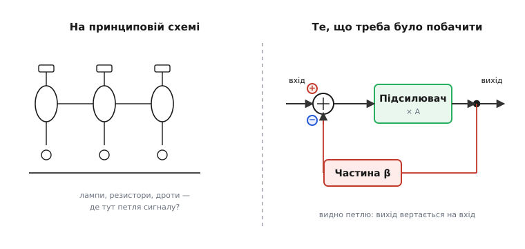
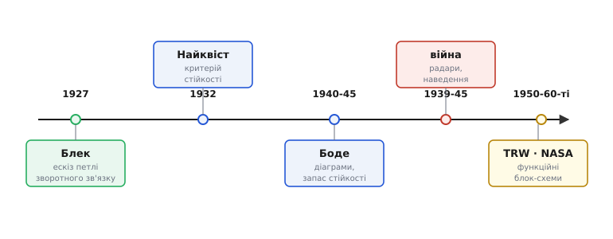

# 📜 Як народилася мова блок-схем

Креслення з прямокутників і стрілок здається таким очевидним, що про його походження ніхто не думає, — наче воно було завжди, як стрілка чи знак плюс. Але мова, якою інженер сьогодні малює «сигнал заходить сюди → підсилюється → фільтрується → виходить», не впала з неба. Вона викристалізувалася з цілком конкретного болю на цілком конкретному виробництві — у телефонній компанії, що в 1920-х намагалася простягнути голос через увесь континент і ламала собі голову над тим, чого доти ніхто не вмів описати. Розберімо, що то був за біль, хто й коли знайшов спосіб його побачити, і чому з цього способу виросла окрема інженерна абетка.

Одразу домовмося про чесність. У цій історії є героїчна легенда — інженер на поромі, ескіз на газеті, спалах генія, — і вона навіть переважно правдива. Але є й те, що ця легенда затирає: блок-схема не була чиїмось одноосібним винаходом, а зворотний зв'язок існував задовго до славетного порома. Тож пройдімося обережно, відділяючи задокументований факт від красивого переказу й від пізнішого міфотворення.

## Біль, із якого все почалося: голос, що згасає

Щоб зрозуміти, чому знадобилася нова мова креслень, треба відчути проблему, яку вона мала розв'язати. А проблема була фізична й невблаганна: **сигнал у дроті згасає**.

Телефонна лінія — це довгий мідний провідник, а будь-який провідник має опір. Що довша лінія, то більше енергії голосу розсіюється в теплі дорогою, і то тихіший сигнал доходить до іншого кінця. На сотні кілометрів голос просто тоне в шумах. Розмова Нью-Йорк — Чикаго на межі чутності ще абияк давалася, а про Нью-Йорк — Сан-Франциско на початку століття не йшлося зовсім: затухання з'їдало сигнал задовго до мети.

Очевидний лік — **повторювач** (англ. *repeater*): прилад, що вряди-годи вздовж лінії бере ослаблений сигнал і знову його підсилює. Постав такі підсилювачі через кожні кількадесят кілометрів — і голос дотягне куди завгодно. З появою електронної лампи (вакуумного тріода) це стало можливим: 1915 року компанія Bell справді відкрила трансконтинентальну лінію Нью-Йорк — Сан-Франциско саме на лампових повторювачах (усталений факт). Здавалося б, перемога.

Але тут і чигала пастка, яка зрештою й виштовхнула блок-схему на світ. Лампа підсилює сигнал — і водночас **спотворює** його. Вона нелінійна: подвоїш вхід, а вихід зросте не рівно вдвічі, а трохи інакше, бо характеристика лампи зігнута. Один повторювач спотворює ледь помітно. Але повторювачів десятки, і кожен **додає** свого спотворення до вже спотвореного попередником. Викривлення накопичується вздовж лінії, як помилка переписувача, що копіює копію копії, — і на далекому кінці голос стає хрипким, негарним, місцями нерозбірливим. Що довша лінія, то гірше. Виходило зачароване коло: підсилення потрібне, щоб голос дотягнув, але саме підсилення голос і псує.

> 🔧 **Навіщо це.** Ця сама халепа — «підсилюємо, але псуємо» — нікуди не поділася й донині. Будь-який тракт із кількох каскадів накопичує і спотворення, і шум; саме тому інженер спершу прикидає весь ланцюг блоками — де скільки підсилення, де що псується, — а вже потім береться за деталі. Блок-схема й народилася як інструмент саме для цього міркування про ланцюг у цілому.

## 2 серпня 1927-го: ескіз на полях газети

У Bell Telephone Laboratories над цим спотворенням билися роками. І 2 серпня 1927 року молодий інженер лабораторії **Гарольд Стівен Блек** (англ. Harold Stephen Black, 1898–1983, родом із Лемінстера, Массачусетс) знайшов розв'язок — настільки простий і настільки зухвалий, що в нього спершу не повірили.

Ідея перевертала здоровий глузд із ніг на голову. Блек запропонував **навмисне віддати частину з таким трудом здобутого підсилення**. Бери трохи вихідного сигналу, повертай його назад на вхід — але в **протифазі**, щоб він від входу віднімався, — і подавай цю різницю на підсилювач. На перший погляд безглуздя: ти ж ослаблюєш власний підсилювач. Та коли провести міркування до кінця, виходить диво. Якщо підсилювач раптом підсилив забагато (спотворив), то й назад повернеться забагато, від входу віднімиться більше — і підсилювач сам себе пригальмує. Якщо підсилив замало — назад повернеться мало, віднімиться мало, підсилювач сам себе підштовхне. Петля безперервно **виправляє власну похибку**. Платиш загальним підсиленням (його стає менше), а взамін дістаєш сигнал, очищений від спотворень, — і, що головне, **стабільний**, майже байдужий до примх конкретної лампи. Це і є [від'ємний зворотний зв'язок](topic:electronics/negative-feedback) — фундамент, на якому згодом стане вся техніка керування.

> Стаття-власник цієї вставки розбирає, як така петля виглядає на блок-схемі — прямий блок, суматор зі знаком «−», зворотний блок — і чому її впізнають з першого погляду. Тут нас цікавить інше: щоб таку петлю взагалі **придумати й перевірити**, потрібен був спосіб її **бачити**.

А тепер — про легенду, бо вона того варта й вона задокументована. За власною пізнішою розповіддю Блека, осяяння прийшло до нього не за робочим столом, а дорогою на роботу — на поромі через річку Гудзон, яким він щоранку діставався з Нью-Джерсі на Мангеттен (це був порім залізниці Lackawanna). Папір під рукою був лише один — свіже число газети **The New York Times**. На вільному ріжку сторінки Блек накидав схему й рівняння свого підсилювача, а прийшовши в лабораторію, дав колезі засвідчити й підписати цей ескіз як документ про дату винаходу.

Тут варто чесно позначити статус доказовості. Сам факт винаходу 2 серпня 1927-го, авторство Блека й суть ідеї — **усталені**. А ось мальовничі подробиці (саме порім, саме газета, ескіз на полях) походять із **власних спогадів Блека, записаних значно пізніше**, — це задокументований переказ із перших уст, а не незалежно підтверджений протокол. Дрібні розбіжності в джерелах теж є: подеколи трапляється дата 6 серпня замість 2-го. Тож ставмося до картинки з поромом як до правдоподібного й гарного, але мемуарного спогаду, а не до хронометражу під присягою.

І ще одне, без чого історія була б нечесна. Романтична версія «один геній на поромі вигадав зворотний зв'язок» — це **міф про одноосібне народження**, і його варто розвіяти. Сам Блек визнавав, що від'ємний зворотний зв'язок **уже застосовували до нього** — наприклад, щоб гасити самозбудження («спів», англ. *singing*) у тих самих телефонних колах; він наголошував на іншій **меті** свого винаходу — лінійності й стабільності, — а не на тому, що петлю придумав із нуля. Історик техніки Девід Мінделл (David Mindell) у праці «Opening Black's Box» прямо показує, як легенда про спалах генія затирає і ширшу традицію саморегульованих машин (відцентрові регулятори парових машин тут найвідоміший приклад), і саму інженерну культуру телефонної мережі, у якій ця ідея визріла. Тож точне формулювання таке: Блек **довів від'ємний зворотний зв'язок до зрілого, кількісно описаного методу** підсилення без спотворень — а не «винайшов зворотний зв'язок як такий».

Доказ, наскільки незвичною була ідея, лишила сама патентна тяганина. Заявку Блек подав 1928 року, а патент США № 2,102,671 «Wave Translation System» отримав аж **21 грудня 1937-го** — більш ніж через дев'ять років (усталений факт). Одна з причин затримки, за переказами, у тому, що в патентному відомстві просто **не вірили, що таке працює**: надто суперечило воно тодішнім уявленням, надто схоже було на спробу витягти себе за волосся з болота. Дев'ять років — наочна міра того, наскільки зворотний зв'язок ламав здоровий глузд епохи.

## Чому саме звідси виросли блоки зі стрілками

Тепер — головна нитка нашої історії, бо досі ми говорили про зворотний зв'язок, а не про креслення. Зв'язок прямий: **щоб міркувати про петлю, конче потрібно бачити потік сигналу, а не плетиво деталей**.

Уявіть, що петлю зворотного зв'язку вам намалювали на повній принциповій схемі: лампи, резистори, конденсатори, десятки дротів. Спробуйте на такому кресленні відстежити, **куди зрештою приходить сигнал, що повернувся з виходу**. Він губиться у вузлах, розгалуженнях, паразитних шляхах — око тоне. А вся суть винаходу Блека — саме в **напрямі обходу петлі**: сигнал іде вперед через підсилювач, відгалужується, повертається назад, віднімається на вході. Це розповідь про **рух і причинність**, а принципова схема про напрям руху мовчить — на ній лінія байдужа до того, куди тече сигнал.

Звідси й народилася потреба в іншому кресленні. Намалюй підсилювач одним прямокутником («підсилення A»), зворотну ланку — другим («частина β, що вертається»), з'єднай їх стрілками, які чітко кажуть «звідси туди», постав на вході кружок-суматор зі знаком «−» — і петля проступає вмить. Не «який резистор куди припаяти», а «що з чим у якому порядку й що повертається назад». Прямокутники-операції зі стрілками-сигналами виявилися **рідною мовою зворотного зв'язку**: лише на них петлю стає видно як петлю.

*Чому знадобилися блоки. На принциповій схемі (ліворуч) сигнал тоне в лампах і дротах — петлю зворотного зв'язку годі простежити. Та сама річ блоками (праворуч): видно прямий шлях через підсилювач, відгалуження виходу й зворотну ланку, що повертається на суматор зі знаком «−». Саме потреба бачити цей обхід петлі й виштовхнула мову блок-схем.*

Зробімо тут точне застереження, щоб не вигадати власної міфології. Малювати системи блоками люди вміли й до Блека — інженери здавна користувалися всілякими схемами потоків і функційними кресленнями, а слово «block diagram» не належить нікому особисто. Тож чесне твердження не «Блек винайшов блок-схему», а м'якше й точніше: **проблема зворотного зв'язку дала блок-схемі її головну роль в електроніці** — описувати не статичне з'єднання деталей, а **динамічний потік сигналу з петлями**. Саме під цю задачу абетку блоків відточили до строгого інструменту. Хто перетворив малюнок коробочок на точний апарат — то вже наступні дійові особи.

## Хто зробив із малюнка точний апарат: Найквіст і Боде

Винахід Блека поставив перед інженерами нове, підступне питання, і саме воно змусило відточити мову блок-схем до математичної строгості. Питання таке: **коли петля зворотного зв'язку стає небезпечною?**

Адже зворотний зв'язок — палиця на два кінці. Повертаєш сигнал на вхід — і якщо повернеться він не точно в протифазі, а зі зсувом (а на високих частотах фаза неминуче «пливе» через затримки в колі), то на якійсь частоті від'ємний зв'язок може обернутися **додатним**: замість гасити, петля почне сама себе розгойдувати. Підсилювач **самозбуджується** — перетворюється на генератор, починає «співати» чи свистіти, і ні про яке чисте підсилення вже не йдеться. Отже, конче треба було вміти **наперед сказати**, чи буде дана петля стійкою, — не складаючи прилад навмання, а з розрахунку на кресленні.

Першим строгу відповідь дав **Гаррі Найквіст** (швед. Harry Theodor Nyquist, 1889–1976), колега Блека по Bell Labs. Народився Найквіст у селі Нільсбю у Вермланді, **у Швеції**, а 1907 року емігрував до США — тож точно він **швед за походженням, американський інженер за діяльністю** (а не просто «американець», як подеколи спрощують). 1932 року в журналі Bell System Technical Journal він опублікував працю «Regeneration Theory» (усталений факт), де вивів **критерій стійкості**: береш підсилення й зсув фази по всій петлі, відкладаєш їх кривою на площині — і за виглядом цієї кривої одразу видно, розгойдається замкнена система чи лишиться спокійною. Уперше «співатиме чи ні» стало **обчислюваним наперед**, а не питанням спроб і помилок. А думати про «підсилення й фазу по всій петлі» природно саме на блок-схемі: обходиш петлю блок за блоком, перемножуючи їхні внески. Метод Найквіста й мова блоків підійшли одне одному, як ключ до замка.

Далі апарат довів до інженерної досконалості **Гендрік Вейд Боде** (англ. Hendrik Wade Bode, 1905–1982; прізвище вимовляють приблизно «Бо́де», бо рід має нідерландське коріння, хоч сам він народився в Медисоні, штат Вісконсин, — **американський інженер**). Працюючи в Bell Labs (з 1944-го очолив там групу математичних досліджень), Боде в працях кінця 1930-х — 1940-х дав інженерам зручний щоденний інструмент: **частотні діаграми** (ті самі графіки підсилення й фази проти частоти, які донині звуть діаграмами Боде) і поняття **запасу стійкості** — наскільки далеко система від тієї межі, за якою почне «співати». Підсумком став його класичний підручник «Network Analysis and Feedback Amplifier Design» 1945 року. Після Боде проєктувати зворотний зв'язок стало інженерним ремеслом із чіткими правилами, і всі ці правила формулювалися й застосовувалися **на блок-схемі** — вона остаточно стала робочим столом, а не ілюстрацією.

*Від ескізу до інженерної мови. Винахід зворотного зв'язку (Блек) поставив питання стійкості, на яке відповіли Найквіст і Боде; під час війни апарат блок-схем перейшов з підсилювачів на слідкувальні системи; згодом окрема гілка — функційні блок-схеми — виросла для опису послідовності дій у складних проєктах.*

## Війна: блоки переходять з підсилювачів на гармати

Те, що зародилося в телефонії, могло б там і лишитися вузьким ремеслом зв'язківців. На широкий простір блок-схему вивела Друга світова війна — і причина знов-таки в зворотному зв'язку, лише вже не сигналу, а **руху**.

Постала задача: навести зенітну гармату чи антену радара на ціль, що швидко летить, — точно й автоматично. Прилад мусить порівняти, **куди** дивиться, з тим, **куди треба**, і сам доводити похибку до нуля, крутячи важкий ствол двигуном. Це знов-таки петля зі зворотним зв'язком, тільки в ній «сигнал» — це фізичний кут наведення; такі системи назвали **слідкувальними** (англ. *servomechanism*, від лат. *servus* — «раб», бо механізм слухняно «слідкує» за командою). І виявилося диво суміжності: математика слідкувальної петлі — **та сама**, що й у підсилювача Блека. Те саме питання стійкості («чи не піде ствол у нескінченну рятку коло цілі замість завмерти на ній»), ті самі критерії Найквіста й Боде, та сама мова блоків. Інженери, які щойно приборкали «спів» підсилювачів, тепер тими ж кресленнями приборкували розгойдування гармат.

У США осередком цієї роботи стала **Лабораторія слідкувальних систем при MIT** (MIT Servomechanisms Laboratory, заснована 1940-го саме під задачі наведення вогню на запит флоту) разом із **Радіаційною лабораторією MIT** (MIT Radiation Laboratory), де народжувалися радари на кшталт SCR-584 з автоматичним стеженням за ціллю (усталені факти). Саме там апарат частотного аналізу й блок-схем остаточно відірвався від вузької телефонії й став **загальною мовою керування рухом** — від гарматної башти до серводвигуна. Після війни ці люди й ці методи розійшлися по всій інженерії, а блок-схема разом з ними перетворилася з фахового прийому зв'язківців на спільну абетку всіх, хто будує системи з петлями.

> 🔧 **Навіщо це.** Та сама математика петлі, що в підсилювачі й у гарматі, працює й у вашому регуляторі температури паяльника, у стабілізаторі напруги, у контурі швидкості мотора дрона. Тому, навчившись читати блок-схему зворотного зв'язку **в одному** місці, ви читаєте її **скрізь**: контролер двигуна на блок-схемі влаштований так само, як підсилювач Блека, — суматор похибки, прямий блок, зворотна ланка. Це одна з причин, чому варто опанувати цю мову раз і назавжди.

## Друга гілка: функційні блок-схеми великих проєктів

Є в історії блок-схем і відгалуження, яке варто **не сплутати** з нашою основною ниткою, бо назва спільна, а суть інша. Поки інженери-електрики відточували блок-схему сигналу й петлі, у світі великих технічних проєктів виростала окрема порода блок-схем — про **послідовність дій**, а не про потік сигналу.

Коли проєкт стає велетенським — ракета, космічний корабель, оборонна система, — постає інше питання: не «куди тече сигнал», а «**що за чим має відбутися, і що від чого залежить**». Спочатку відокремлення ступеня, потім запуск двигуна, потім орієнтація — і кожен крок дозволений, лише якщо попередній **успішно завершився**. Для такого опису з'явилися **функційні блок-схеми** (англ. *functional flow block diagram*, FFBD): прямокутники тут — це **функції-етапи місії**, а стрілки — **порядок і залежність** («це почнеться, тільки коли те вдалося»). Сучасну форму такого креслення розробила в 1950-х американська оборонна компанія TRW, а в 1960-х його широко взяла на озброєння NASA, щоб розписувати в часі послідовність подій космічних місій (усталені факти).

Важливо тримати межу. Блок-схема сигналу (наша основна історія: Блек — Найквіст — Боде) і функційна блок-схема (TRW — NASA) — це **два різні інструменти зі схожою графікою**. У першій стрілка — це **сигнал**, що тече зараз; у другій стрілка — це **черговість у часі**, перехід до наступного етапу. Перша описує, як прилад **обробляє сигнал** щомиті; друга — як проєкт **розгортається крок за кроком**. Сплутати їх легко через спільні прямокутники, тож, зустрівши «блок-схему», варто спершу спитати себе, **що означає стрілка** — рух сигналу чи порядок дій. У статті-власнику цієї вставки йдеться саме про **першу** — блок як операцію над сигналом; функційні блок-схеми згадуємо тут лише для повноти картини й щоб застерегти від плутанини.

## Що з усього цього винести

Мова блок-схем не була чиїмось одноосібним винаходом і не з'явилася в один день — вона **викристалізувалася з потреби**. Спершу телефонна компанія вперлася в спотворення повторювачів; Гарольд Блек 1927 року приборкав його від'ємним зворотним зв'язком (довівши до зрілого методу те, що в зародку існувало й до нього) — і саме щоб **бачити петлю**, знадобилося креслення з блоків і стрілок, а не з деталей. Найквіст (1932) і Боде (кінець 1930-х — 1940-ві) перетворили цей малюнок на точний апарат, навчивши наперед рахувати стійкість петлі. Друга світова війна винесла мову блоків із телефонії на слідкувальні системи — і та сама математика петлі стала спільною для підсилювача, гармати й будь-якого регулятора. А поряд, під іншу задачу — опис послідовності дій у велетенських проєктах, — виросла окрема порода функційних блок-схем (TRW, NASA), яку не варто плутати з блок-схемою сигналу.

Тож коли наступного разу малюватимете прилад прямокутниками й стрілками, варто пам'ятати: за цією буденною звичкою стоїть річка Гудзон, ескіз на полях газети, дев'ять років невіри патентного відомства й війна, що зробила цю мову загальною. А ще — урок чесності: великі винаходи майже завжди **колективні й поступові**, навіть коли історія любить стиснути їх до одного генія на поромі.
