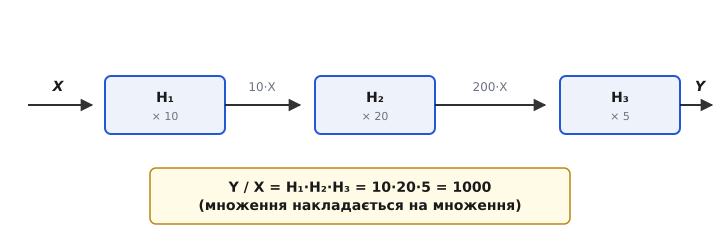
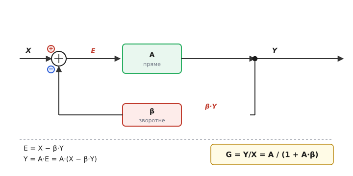
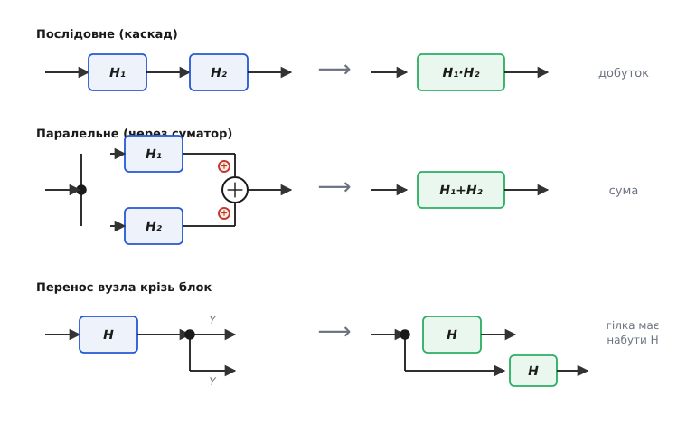

# 🧮 Алгебра блок-схем: як згорнути плетиво блоків в одну формулу

Блок-схема — не просто малюнок. Якщо кожен блок несе число (коефіцієнт) чи [передавальну функцію H(s)](book:electronics/transfer-function), то ціла схема з десятка блоків, стрілок, суматорів і петель **зводиться до одного-єдиного блоку** з одним H(s) між входом і виходом. Це і є алгебра блок-схем: набір правил, що дозволяють згортати з'єднання, поки не лишиться формула «вихід / вхід». Тут ми виведемо ці правила **від першопричини** — не «запам'ятай, що каскад перемножується», а **чому** інакше й бути не може, — і дійдемо до головного результату всієї теорії керування: формули замкненої петлі G = A / (1 + A·β), яка одним рядком пояснює, чому зворотний зв'язок робить схему точною.

## Що взагалі означає «блок несе число»

Спершу домовимося, що таке блок як математичний об'єкт, бо без цього правила згортання повисають у повітрі.

Блок — це **множник**. Він бере вхідний сигнал X і віддає вихідний Y за правилом Y = H·X, де H — характеристика блоку. У найпростішому випадку H — просто число: блок «× 100» означає Y = 100·X. У загальному випадку H залежить від частоти, і тоді його записують як H(s) — це й є [передавальна функція](book:electronics/transfer-function): компактний запис того, у скільки разів (і з яким зсувом фази) блок змінює синусоїду кожної частоти.

> 🔧 **Навіщо це.** Уся сила блок-схеми в тому й полягає, що складну фізичну дію — підсилення, фільтрування, інтегрування — згорнуто до одного множника. Поки блок це **множник**, з блоками можна робити алгебру так само вільно, як із числами в рівнянні: переставляти, виносити за дужку, скорочувати. Уся ця вставка — про те, як саме.

Ключова умова, без якої нічого не працює: блок має бути **лінійним**. Лінійність означає рівно дві властивості. Перша — однорідність: подвоїв вхід — подвоївся вихід (H·(2X) = 2·(H·X)). Друга — суперпозиція: подав суму двох сигналів — на виході сума двох відгуків (H·(X₁ + X₂) = H·X₁ + H·X₂). Звичайний підсилювач у робочому режимі, [RC-фільтр](book:electronics/rc-low-pass), інтегратор — усі лінійні, і вся алгебра блок-схем — для них. Щойно блок починає **спотворювати** (обрізає вершини синусоїди, насичується), він уже нелінійний, суперпозиція ламається, і перемножувати H(s) більше не можна. Тому все нижче неявно припускає: сигнали достатньо малі, блоки в лінійній зоні.

## Каскад: чому коефіцієнти перемножуються, а не додаються

Найчастіше блоки стоять **ланцюжком** (каскадом): вихід першого — вхід другого, і так далі. Питання, на якому спотикається кожен початківець: загальний коефіцієнт такого ланцюжка — це сума коефіцієнтів блоків чи добуток? Інтуїтивно хочеться скласти. Це неправильно, і причину варто прожити, а не завчити.

### На числах

Розгорнімо ланцюжок крок за кроком. Хай на вході сигнал X, а три блоки мають коефіцієнти 10, 20 і 5.

```
вхід першого блоку:   X
вихід першого (× 10): 10·X
вихід другого (× 20): 20·(10·X) = 200·X      ← другий множить уже помножене
вихід третього (× 5):  5·(200·X) = 1000·X
```

Дивіться, що сталося на середньому рядку. Другий блок не знає й знати не може, що там було «на самому початку». Йому на вхід прийшло 10·X — уже готове, уже підсилене число. Він робить своє єдине діло: множить **те, що отримав**, на 20. Виходить 200·X. Третій так само множить отримане 200·X на 5. Множення **накладається на множення** — і саме тому коефіцієнти збираються в **добуток**:

```
Y / X = 10 · 20 · 5 = 1000      (а НЕ 10 + 20 + 5 = 35)
```


*Сигнал росте вздовж каскаду. Кожен блок множить те, що дістав на вході, тож множники збираються в добуток: 10·20·5 = 1000. Сума 10+20+5 = 35 тут ні до чого — її дав би зовсім інший спосіб з'єднання.*

Звідки взагалі береться спокуса додати? З досвіду іншого роду з'єднань. Опори в ряд **додаються**, відстані вздовж дороги **додаються** — там кожна ланка докидає свою порцію до спільної суми. Але каскад блоків влаштований не так: ланка не **докидає**, а **масштабує** все, що пройшло крізь неї. Тому й закон інший. Аналогія, яка не ламається: відсотки складних процентів. Поклали гроші під +10 %, потім ще під +20 %, потім +5 % — підсумковий множник не 1.35, а 1.10·1.20·1.05 ≈ 1.386, бо кожен відсоток береться вже від нарослої суми. Каскад блоків — це та сама складна дія, лише множники не «1 плюс щось», а голі коефіцієнти.

### На передавальних функціях

Для блоків-чисел це очевидно; уся краса в тому, що **те саме правило дослівно працює для H(s)**. Поставимо два [фільтри нижніх частот](book:electronics/rc-low-pass) каскадом (з буфером між ними, щоб другий не навантажував перший — без буфера ланки впливають одна на одну, і це окрема історія про [взаємне навантаження](book:electronics/lc-rlc-filters/math-cascading.md)). Нехай кожен має передавальну функцію H(s) = 1/(1 + s·τ). Вихід першого — H(s)·X. Цей вихід заходить у другий блок як його власний вхід, і другий множить його на свою H(s) — точно як число-каскад множив помножене:

```
Y = H₂(s) · [ H₁(s) · X ] = H₁(s) · H₂(s) · X
тож   Y/X = H₁(s) · H₂(s) = 1/(1 + s·τ)²
```

Загальна передавальна функція каскаду — **добуток передавальних функцій**, бо причина та сама: другий блок діє на готовий вихід першого, а не на початковий сигнал. А з добутку H(s) випливає важливий практичний наслідок. Спад одиночного RC-фільтра — 20 децибел на декаду ([децибел](book:electronics/decibels) — логарифмічна міра відношення). У логарифмі добуток стає сумою:

```
|H| = |H₁| · |H₂|        (множення амплітуд)
дБ:  20·lg|H| = 20·lg|H₁| + 20·lg|H₂|   (у децибелах — додавання!)
```

Ось і розгадка, чому «у децибелах підсилення каскаду додаються», хоча самі коефіцієнти перемножуються: децибел — логарифм, а логарифм перетворює добуток на суму. Два фільтри по −20 дБ/дек дають разом −40 дБ/дек — спад удвічі крутіший. Фази так само додаються (зсув другого блоку накладається на зсув першого). Тож каскад двох однакових RC дає подвоєний нахил і подвоєний зсув фази — прямий наслідок того, що H(s) перемножилися.

> 🔧 **Навіщо це.** Це щоденний інструмент прикидки тракту. Треба знати загальне підсилення сигнального ланцюга «давач → підсилювач → фільтр → ще каскад»? Перемнож коефіцієнти блоків — і маєш відповідь, не торкаючись жодного резистора. Працюєш у децибелах (а в радіотехніці працюють саме так)? Тоді просто **додавай** дБ кожного блоку. І те, і те — одна формула Y/X = ∏Hᵢ, побачена з двох боків.

## Замкнена петля: серце зворотного зв'язку

Каскад — це розімкнений ланцюг: сигнал тече вперед і не вертається. Уся міць блок-схем розкривається, коли частину виходу **повертають назад** на вхід, замикаючи **петлю**. Саме петля стоїть за стабілізованим підсиленням, стабілізаторами напруги, регуляторами температури — за будь-якою системою, що сама себе тримає в точці. Виведемо її головну формулу — і зробимо це повільно, бо це найважливіший рядок у всій теорії.

### Складаємо рівняння петлі

Намалюймо мінімальну петлю [від'ємного зворотного зв'язку](book:electronics/negative-feedback). На вході — суматор. У нього зверху заходить сигнал X зі знаком «+». Із суматора виходить різниця — назвемо її **помилкою** E (англ. *error*). Вона йде в **прямий блок** з коефіцієнтом A (це наше підсилення — велике, але неточне). Вихід A·E — це і є вихід усієї схеми, Y. Але перед самим виходом стоїть **вузол-відгалуження**: той самий Y роздвоюється, частина йде на вихід, а частина повертається вниз — крізь **зворотний блок** β — і приходить у суматор зі знаком «−». Тобто від входу віднімають β·Y.


*Петля від'ємного зворотного зв'язку й виведення її формули. Суматор віднімає повернену частку β·Y від входу X, утворюючи помилку E. Прямий блок підсилює помилку (Y = A·E). Підставивши одне в одне й розв'язавши відносно Y, дістаємо замкнений коефіцієнт G = A/(1 + A·β).*

Тепер уся фізика — у двох коротких реченнях, перекладених на формули. Перше: суматор **віднімає** повернену частку від входу, тож помилка дорівнює різниці.

```
E = X − β·Y
```

Друге: прямий блок підсилює саме цю помилку.

```
Y = A · E
```

Більше в петлі немає нічого — лишилося поєднати ці два рядки. Підставимо перший у другий:

```
Y = A · (X − β·Y)
```

### Розв'язуємо відносно виходу

Маємо одне рівняння з одним невідомим Y (X — заданий вхід). Розкриваємо дужку й збираємо всі Y ліворуч — звичайна шкільна алгебра, але кожен крок вартий того, щоб провести його самому:

```
Y = A·X − A·β·Y           розкрили дужку
Y + A·β·Y = A·X           перенесли Y·A·β ліворуч
Y·(1 + A·β) = A·X         винесли Y за дужку
Y = A·X / (1 + A·β)       поділили на (1 + A·β)
```

А нам потрібен **замкнений коефіцієнт** G — відношення виходу до входу всієї схеми. Ділимо обидві частини на X:

```
G = Y / X = A / (1 + A·β)
```

Ось вона — формула замкненої петлі від'ємного зворотного зв'язку. Найважливіший рядок у теорії керування, і ми вивели його з двох очевидних речень про суматор та підсилювач, нічого не завчаючи. Звідки в знаменнику взялася **одиниця плюс A·β** — видно прямо з виведення: одиниця — це сам Y, що стоїть зліва, а A·β — те, що повернулося петлею й додалося до нього при перенесенні. Добуток **A·β** має власну назву — **петльове підсилення** (англ. *loop gain*): це коефіцієнт, який сигнал набирає, обійшовши **все коло** — спершу крізь A вперед, тоді крізь β назад. Скільки сигнал «нарощує за один оберт петлі» — стільки й стоїть у знаменнику поряд з одиницею. Сам обхід петлі й те, що петльове підсилення вимірюють як [різницю на розриві контуру](book:electronics/loop-gain), — окрема глибока тема; нам зараз досить, що A·β — це підсилення за один повний оберт.

### Інтуїція, без якої формула мертва

Формула — це півсправи; треба відчути, **що вона каже про схему**. Розгляньмо випадок, заради якого зворотний зв'язок узагалі вигадали: коли петльове підсилення велике, A·β ≫ 1. Із сирим підсиленням A в сотні тисяч так буде майже завжди. Тоді одиницею в знаменнику можна знехтувати поряд із величезним A·β:

```
G = A / (1 + A·β)  ≈  A / (A·β)  =  1 / β
```

A **скоротилося** й зникло з відповіді. Замкнений коефіцієнт залежить тепер **тільки від β** — від зворотного блоку, а не від примхливого прямого. Тут і ховається вся магія від'ємного зв'язку, тепер уже видима в одному рядку: схема виміняла велетенське, але хитке підсилення A на скромне G = 1/β, зате задане **тільки** елементами зворотного шляху, які легко зробити точними й стабільними (зазвичай це звичайний резисторний дільник).

Чому так стається — зрозуміло без формули, з самої петлі. Суматор віднімає β-частку виходу. Якщо вихід раптом підскочив (від нагріву, від примхи A), зросла й віднята частка β·Y, помилка E зменшилася, і прямий блок підсилює вже менше — вихід **сам себе осаджує** назад. Петля стереже вихід так, щоб віднята частка точно врівноважувала вхід; а це фіксує відношення виходу до входу на 1/β, хоч би що виробляло A. Сильніше A·β — тугіше зашморг, точніше тримає.

### Чому це ще й зменшує спотворення

Та сама формула пояснює, чому зворотний зв'язок **очищає** сигнал. Спотворення (англ. *distortion*) — це небажана добавка, яку прямий блок підмішує до виходу через свою нелінійність: підсилив не рівно в A разів, а трохи криво, додавши паразитний шматочок D просто всередині блоку. Подивімося, що петля з ним зробить. Така добавка з'являється **на виході** прямого блоку, тож вона не множиться на A — вона входить у вихід напряму. Розв'язавши петлю з цим зайвим доданком, дістанемо, що на виході він з'являється не повністю, а **поділений на (1 + A·β)**:

```
вклад спотворення у вихід ≈ D / (1 + A·β)
```

Чому ділиться — видно з того ж зашморгу. Добавка штовхнула вихід, петля це **побачила** (вона ж стереже вихід!), повернула зрослу β-частку, помилка зменшилася, прямий блок прибрав рівно стільки, щоб майже погасити чужу добавку. Що тугіший зашморг A·β, то повніше гасіння. Тому підсилювач зі зворотним зв'язком — навіть на досить кривому транзисторі — на виході дає чистий сигнал: петля давить його власні [гармонічні спотворення](book:electronics/harmonic-distortion) у (1 + A·β) разів. Це не випадковість і не окремий трюк, а той самий механізм десенсибілізації, лише застосований до завад, що народилися **всередині** петлі.

> 🔧 **Навіщо це.** Запам'ятати варто одне: **G ≈ 1/β, коли A·β велике**. З цього випливає вся практика. Підсилення схеми задавай **зворотним блоком β** (резисторами) — воно буде точне й стабільне, а не таке, як вийде в конкретного ОП. Хочеш ще й чистий сигнал чи несхитну точку — тримай **запас петльового підсилення A·β**: саме його надлишок поглинає й примхи A, і спотворення. Платня одна — A·β не вічне: воно [спадає з частотою](book:electronics/real-opamp-limits) (бо A спадає), тож на верхах і точність гіршає, і гасіння спотворень слабшає. Глибше число про десенсибілізацію — у [виведенні для ОП](book:electronics/negative-feedback/math-feedback-formula.md).

## Правила згортання типових з'єднань

Каскад і петля — два крайні випадки. Між ними — кілька стандартних з'єднань, з яких складають будь-яку блок-схему. Алгебра дає на кожне **правило згортання**: як замінити кілька блоків одним еквівалентним. Зібравши їх, можна механічно стиснути схему-плетиво до однієї формули. Усі правила — наслідок того самого, що блок є лінійний множник.


*Три базові правила алгебри блок-схем. Послідовне (каскад) → добуток. Паралельне (гілки сходяться в суматор) → сума. Перенос вузла-відгалуження з виходу блоку на його вхід → відгалужена гілка має набути той самий множник H, щоб сигнал у ній не змінився.*

### Послідовне → добуток

Два блоки підряд, вихід першого — вхід другого. Це вже розібраний каскад: еквівалентний блок несе **добуток**.

```
H_екв = H₁ · H₂
```

Причина — друга ланка діє на готовий вихід першої. Порядок при цьому не важить: H₁·H₂ = H₂·H₁ (для лінійних блоків множники переставні). На блок-схемі це означає, що два послідовні лінійні блоки можна **міняти місцями** без зміни результату — підсилити-потім-відфільтрувати дасть те саме, що відфільтрувати-потім-підсилити. (На реальному залізі порядок таки буває важливий — через шуми, перевантаження, обмеження діапазону, — але це вже за межами ідеальної лінійної алгебри.)

### Паралельне через суматор → сума

Тепер сигнал відгалужується у вузлі, проходить **двома блоками паралельно**, і обидва результати сходяться в **суматор** зі знаком «+». Кожна гілка дала свій відгук на той самий вхід X: верхня H₁·X, нижня H₂·X. Суматор їх складає:

```
Y = H₁·X + H₂·X = (H₁ + H₂)·X
тож   H_екв = H₁ + H₂
```

Ось **звідки** береться сума — і чому вона не суперечить добутку каскаду. Це різні з'єднання: у каскаді сигнал іде **крізь** обидва блоки по черзі (кожен масштабує попереднє → добуток), а в паралелі він іде крізь них **порізно** й результати **складає** суматор (→ сума). Той самий доданок, на якому початківець хибно «складав каскад», насправді з'являється тут, у паралельному з'єднанні. Якщо суматор стоїть зі знаком «−», то й у формулі різниця: H_екв = H₁ − H₂. Паралельні гілки — це, по суті, [суперпозиція](book:electronics/transfer-function) двох шляхів, і саме лінійність дозволяє просто додати їхні відгуки.

### Перенос вузла-відгалуження крізь блок

Найтонше правило — і саме воно перетворює складні переплетені схеми на прості. Часто, щоб згорнути петлю, треба **посунути** вузол-відгалуження: був він після блоку H, а нам зручніше мати його перед блоком (або навпаки). Не можна просто пересунути крапку — сигнал у відгалуженій гілці зміниться, а схема має лишитися **еквівалентною** (давати ті самі сигнали всюди). Алгебра підказує, як це компенсувати.

Хай вузол стоїть **після** блоку H: на виході сигнал H·X, і саме H·X іде у відгалужену гілку. Пересунемо вузол **перед** блок. Тепер у точці відгалуження сигнал лише X — рівно у H разів менший, ніж був до переносу. Щоб гілка й далі несла те саме H·X, у неї треба **вставити такий самий блок H**:

```
вузол ПІСЛЯ H:   відгалужений сигнал = H·X
вузол ПЕРЕД H:   у точці лише X  →  щоб лишилось H·X, у гілку додаємо ×H
```

Логіка проста: пересуваючи вузол проти ходу сигналу (на бік, де його ще не помножили на H), ми **відібрали** у гілки множник H — тож мусимо **повернути** його, дописавши блок H у саму гілку. Сунемо у зворотний бік (вузол із входу на вихід блоку) — навпаки: у точці тепер сигнал уже H·X, на H забагато, тож у гілку треба вставити **1/H**, щоб скоротити зайве. Те саме правило стосується й переносу суматора крізь блок — там компенсація дзеркальна. Це і є технічні «гайки» згортання: пересувай вузли й суматори так, щоб розплутати петлі, щоразу домножуючи переставлену гілку на потрібний множник, аби нічого не змінити по суті.

> 🔧 **Навіщо це.** Зібравши ці правила, ви згортаєте **будь-яку** блок-схему механічно, без здогадів: каскади — в добутки, паралелі — в суми, петлі — за формулою A/(1+A·β), а вузли пересуваєте з компенсацією, поки картинка не спроститься до однієї стрілки з одним H(s). Це і робить блок-схему **рахунковим** інструментом, а не лише ілюстрацією: складну систему ви чесно зводите до одного відношення «вихід/вхід», з яким уже працюєте як зі звичайною формулою.

## Згортаємо ціле: приклад на числах

Складемо все докупи на маленькому, але повному прикладі. Хай прямий шлях — два каскадні блоки, а потім усе охоплене петлею зворотного зв'язку. Згорнімо це до одного числа.

**Підсилювач: прямий шлях A₁ = 50 і A₂ = 40 каскадом, зворотний зв'язок β = 0.05.**

Спершу згортаємо каскад прямого шляху (послідовне → добуток):

:::tabs
```cpp
// Крок 1: прямий шлях — два блоки в каскаді перемножуються
float A1 = 50.0f;
float A2 = 40.0f;
float A  = A1 * A2;            // = 2000  (повне пряме підсилення)

// Крок 2: петля зворотного зв'язку — формула A/(1+A·β)
float beta      = 0.05f;
float loop_gain = A * beta;    // A·β = 2000·0.05 = 100  (петльове підсилення)
float G         = A / (1.0f + loop_gain);   // 2000 / 101 = 19.80

// Перевірка ідеалом 1/β: при великому A·β  G → 1/β
float G_ideal   = 1.0f / beta; // = 20.00
// G = 19.80 проти ідеалу 20.00 — недобір 1 %, бо A·β = 100, не нескінченність
```
```python
# Крок 1: прямий шлях — два блоки в каскаді перемножуються
A1 = 50.0
A2 = 40.0
A  = A1 * A2                  # = 2000  (повне пряме підсилення)

# Крок 2: петля зворотного зв'язку — формула A/(1+A·β)
beta      = 0.05
loop_gain = A * beta          # A·β = 2000·0.05 = 100  (петльове підсилення)
G         = A / (1.0 + loop_gain)   # 2000 / 101 = 19.80

# Перевірка ідеалом 1/β: при великому A·β  G → 1/β
G_ideal   = 1.0 / beta        # = 20.00
# G = 19.80 проти ідеалу 20.00 — недобір 1 %, бо A·β = 100, не нескінченність
```
:::

Каскад стиснувся в A = 2000, петля — у G = 19.80. Зверніть увагу на останній рядок: ідеал 1/β = 20 здійснився б точно лише за нескінченного A·β; реальні A·β = 100 дають недобір рівно 1/(1 + A·β) = 1/101 ≈ 1 %. Тобто **точність дорівнює оберненому петльовому підсиленню** — ще один прямий наслідок тієї самої формули. Хочеш точніше — піднімай A·β (більше A або більше β), і недобір тане.

## Де ця алгебра працює в реальних схемах

Усе виведене — не вправа задля вправи, а робоча мова цілих галузей.

Будь-який **підсилювач на операційному підсилювачі** — це петля A/(1 + A·β) у чистому вигляді: A — сире підсилення ОП, β — резисторний дільник зворотного зв'язку, і G = 1/β задає коефіцієнт схеми. **Лінійний стабілізатор напруги** тримає вихід тим самим зашморгом: підскочила напруга — петля побачила, осадила. **Регулятор температури чи обертів** — теж петля, лише блоки вже фізичні (нагрівач, давач). Скрізь, де система **сама себе тримає в точці**, у її серці стоїть ця формула.

Каскадне правило — щоденний хліб **сигнальних трактів** і **фільтрів**: загальне підсилення тракту = добуток коефіцієнтів каскадів, а спад багатоланкового фільтра = сума спадів у децибелах (бо H(s) перемножилися). А правила переносу вузлів — інструмент, яким згортають [складні петлі стійкості](book:electronics/stability-margins) до вигляду, де видно, чи не задзвенить система. Одна невелика алгебра — і блок-схема з картинки стає калькулятором, що відповідає на головні питання: скільки буде підсилення, наскільки воно точне, чи чистий сигнал, чи стійка петля.
